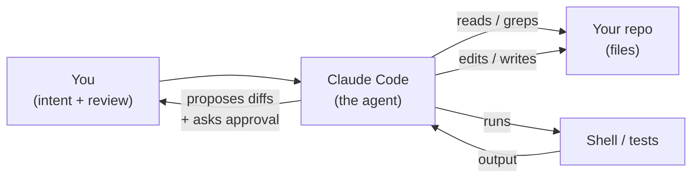
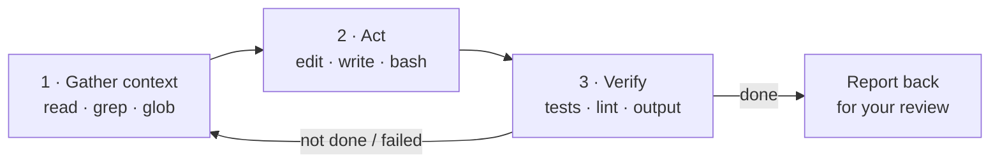
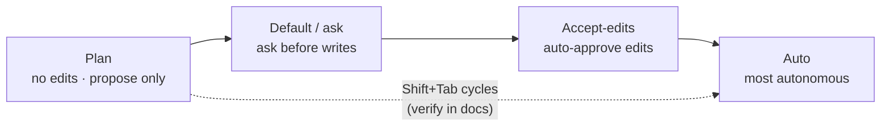
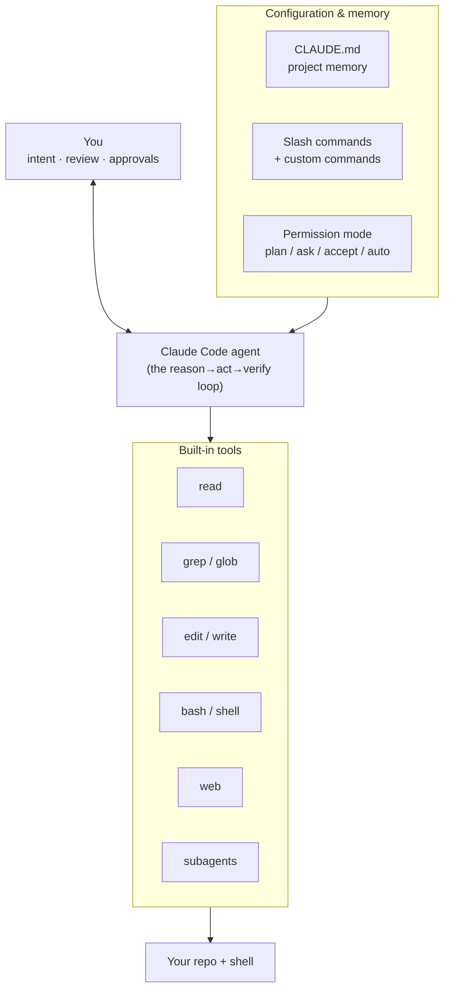

# What Claude Code Is (and How It Works)

> Imagine a sharp new teammate joins your pod. On day one they read your entire
> repository — every module, every test, every config — faster than you can pour a
> coffee. They can edit files, run your test suite, grep for that one function you
> half-remember, and drive a messy refactor from idea to green build. But they never
> merge without your review, and they check with you before doing anything risky. That
> teammate is **Claude Code**.

You have already met the idea of an AI **agent** — a model that reasons, calls tools,
observes what happened, and loops until the job is done. Claude Code *is* one of those
agents. What makes it click for a data engineer is *which* tools it holds: not a
weather API or a calculator, but **your development environment** — the files in your
repo, `grep`, the shell, the test runner.

This lesson is the conceptual-but-concrete grounding for the rest of the track. No setup
yet (that's next). Just a clear mental model of what Claude Code is, the loop it runs,
the tools it uses, and the controls you hold — so that when you start pairing with it,
nothing feels like magic.

## Learning Objectives

By the end of this lesson, you will be able to:

- Explain what an **agentic coding assistant** is, and how it maps onto the
  reason → act → observe loop you already know from [What Is an AI Agent?](/docs/agents-tools-mcp/what-is-an-agent).
- Describe Claude Code's core loop in depth: **gather context → act → verify → repeat**.
- Name the **tool categories** Claude Code uses (file read/edit/write, search, shell, web, subagents) and what each is for.
- Explain the **permission modes** (plan, default/ask, accept-edits, auto) and why they exist.
- Describe **CLAUDE.md** project memory, **slash commands**, and lightweight **context management** at a high level.
- Articulate the core framing: Claude Code is **leverage, not autopilot** — you supply intent and review.

## Prerequisites

Before this lesson, it helps to have read:

- [Claude Code for Databricks AI Engineers](/agentic-coding/claude-code/intro) — the hub for this subtopic, which frames where Claude Code fits.
- [What Is an AI Agent?](/docs/agents-tools-mcp/what-is-an-agent) — the reason → act → observe loop, which everything here builds on.
- [How Function Calling Works](/docs/agents-tools-mcp/function-calling) — how a model decides to call a tool and reads the result back. Claude Code's tools *are* function calls under the hood.

If those feel comfortable, you're ready. If not, this lesson still stands on its own and
reminds you of the key ideas as they come up.

## Estimated Reading Time

About 20 to 25 minutes. There is nothing to install here — that's the next lesson. Read
gently; this is a mental model, not a checklist to memorize.

## Business Motivation

Meet **Maya**, a data engineer at **Northwind Trust**, a mid-sized financial services
firm. Her backlog is the usual data-platform reality: a new ingestion job to wire up, a
flaky test suite nobody has time to fix, a schema migration that touches a dozen files,
and a chat App the business keeps asking about. Each task is mostly *known* work — glue
code, boilerplate, careful edits across many files — but there's more of it than hours in
the day.

Maya has heard the pitch for AI coding assistants and is skeptical. She's seen autocomplete
that guesses one line at a time, and she's seen demos that look great until the generated
code doesn't compile. What she actually wants is a teammate who can hold a whole task —
read the relevant files, make a coherent multi-file change, run the tests, and *tell her
what it did* so she can review it like a pull request.

That's the gap Claude Code fills. It isn't a smarter autocomplete; it's an agent that
**drives a task end to end** while Maya stays in the reviewer's seat. The payoff for a
firm like Northwind Trust: routine engineering moves faster, the human stays accountable
for every change, and the guardrails (permissions, review, project conventions) are built
into how the tool works — not bolted on afterward.

:::note[Not a Databricks product]
Claude Code is a general coding agent from Anthropic — it works on any codebase, Databricks
or not. Later in this track, the **Databricks AI Dev Kit** is what makes it Databricks-aware.
So the habits you learn here travel with you to non-Databricks work too.
:::

## Intuition

Here's the whole idea in one picture. A human agent (you) hands intent to Claude Code.
Claude Code reads your repo, acts on it, checks the result, and reports back for review.



*Diagram 1: The shape of the collaboration. You supply intent and review; Claude Code
drives the repo and shell. Nothing lands without passing back through you.*

If you've read [What Is an AI Agent?](/docs/agents-tools-mcp/what-is-an-agent), this is
the same **reason → act → observe** loop — just pointed at software engineering. The
"tools" the agent calls are the everyday actions you'd take in a terminal: open a file,
search for a symbol, edit a line, run `pytest`, read the traceback. Claude Code's model
reasons about *which* of those actions to take next, does it, reads what happened, and
decides again.

That's the intuition to carry through the rest of the lesson: **Claude Code is a
tool-using agent whose tools are your dev environment.**

## Theory

Let's put a few words on the ideas so the rest of the lesson is easy to follow.

An **agentic coding assistant** is an AI agent whose job is to change software, and whose
tools are the primitives of a developer's environment. Three properties make it "agentic"
rather than just a chatbot that emits code:

- **It acts, not just suggests.** It can actually edit files and run commands, then read
  the results — it doesn't stop at printing a snippet for you to paste.
- **It loops.** One action informs the next. A failing test tells it what to fix; the fix
  changes what to run next. It keeps going until the goal is met or it needs you.
- **It stays grounded in reality.** Because it reads real files and real command output,
  its decisions are based on *your actual repo*, not a guess about what your code probably
  looks like.

Contrast this with plain **function calling**, which you've seen: there, you hand a model a
fixed list of tools and it picks one. Claude Code is that idea scaled into a full loop —
many tool calls, chained, with the model deciding when it's done. The
[function-calling lesson](/docs/agents-tools-mcp/function-calling) is the atom; Claude Code
is the molecule.

:::info[The human is part of the loop, on purpose]
An agent left fully unattended can drift — make a wrong assumption early and build on it.
Claude Code's design keeps you in the loop at the moments that matter: it proposes plans,
shows diffs, and asks permission before risky actions. This is a feature, not friction.
:::

## Deep Dive

### The loop, in depth

Every non-trivial task Claude Code does follows the same three-beat rhythm. Understanding
these beats is the single most useful thing in this lesson, because it tells you *what the
assistant is doing at any moment* and *where you get to intervene*.

**1. Gather context.** Before touching anything, Claude Code builds a picture of your
code. It **reads** relevant files, **greps** for symbols and patterns, and uses **glob**
to find files by name. Think of this as the assistant doing the reading you'd do before a
change — except across the whole repo in seconds. Good context here is why its edits fit
your codebase instead of fighting it.

**2. Act.** With a picture in hand, it makes the change: **edits** existing files,
**writes** new ones, and **runs shell commands** — creating a branch, installing a
dependency, generating a scaffold. This is the beat where your repo actually changes, and
(depending on your permission mode) where it may pause to ask you first.

**3. Verify.** An action without a check is a guess. Claude Code **runs the tests**, reads
the output, runs a linter, or executes the script to see what happened. If the tests fail,
that failure becomes new context — and the loop repeats: gather (read the traceback), act
(fix), verify (re-run). It continues until the goal is met or it hits something only you
can decide.



*Diagram 2: The core loop. Verify feeds back into gather — a failing test is just more
context. The loop exits when the goal is met (and always exits to you for review).*

This is exactly how *you* work on a careful change: understand, edit, run it, repeat. Claude
Code just does it fast and out loud, narrating each step so you can follow along.

### The tool categories

Under the hood, each beat of the loop is powered by tools — the same function-calling
mechanism from earlier lessons, where the model picks a tool and passes arguments. It helps
to know the categories, because they map directly onto the loop:

- **File read** — open and read files. The backbone of *gather context*. Reads are safe and
  generally don't prompt for permission.
- **Search (grep / glob)** — find text across the repo (grep) or find files by name pattern
  (glob). This is how it locates the three files that matter in a 3,000-file repo.
- **File edit / write** — change existing files precisely, or create new ones. The heart of
  *act*. These modify your working tree, so they're gated by permissions.
- **Shell / bash** — run commands: tests, linters, git, build tools, your own scripts. Powers
  both *act* (e.g. `git checkout -b`) and *verify* (e.g. `pytest`). Safe read-only commands
  (like `ls`, `cat`, `pwd`) typically don't prompt; commands that change things do.
- **Web** — fetch a URL or search the web for current documentation when the answer isn't in
  your repo.
- **Subagents** — spawn a *separate* agent with its own context window to handle a big or
  focused sub-task (research, a large search, a scoped change), which reports a summary back.
  This keeps the main conversation from drowning in detail.

:::tip[Tools are extensible]
This is the built-in set. Later in the track you'll add **MCP servers** — the same
[universal-plug standard](/docs/agents-tools-mcp/mcp) from the Databricks AI track — to give
Claude Code *more* tools, including governed Databricks tools via the AI Dev Kit. The loop
doesn't change; the toolbox just gets bigger.
:::

### Permission modes — the controls you hold

Because Claude Code can genuinely change your files and run commands, it needs an equally
genuine set of brakes. That's what **permission modes** are: they decide how much the
assistant may do on its own before checking with you. You cycle between them quickly
(commonly with **Shift+Tab** — verify the current binding in the docs, as the interface
evolves).

The modes, from most cautious to most autonomous:

- **Plan mode** — Claude Code explores and *proposes a plan* but makes **no edits**. It reads
  and thinks; you approve the plan before it touches anything. This is the highest-leverage
  control for anything non-trivial: catch a wrong assumption before a single line changes.
- **Default / ask mode** — the everyday setting. Reads and safe commands run freely, but the
  assistant **asks before writing files or running commands that change things**.
- **Accept-edits mode** — auto-approves file edits (and safe filesystem actions) so you're not
  clicking "yes" on every line during a flow you trust, while still pausing for the riskier
  stuff.
- **Auto mode** — the most autonomous: the assistant proceeds through more actions without
  stopping to ask. Reserve this for well-scoped, low-risk, reversible work — and know your
  undo path.

*(Exact mode names, prompts, and the key binding can shift between versions — verify in the
Claude Code docs.)*

Why so many? Because the right amount of autonomy depends on the task. Exploring an unfamiliar
bug? Plan mode. Grinding through a repetitive, well-understood refactor with good tests? Lean
toward accept-edits. **The mode is your throttle** — match it to how much you trust the current
step.



*Diagram 3: Permission modes as a throttle, from most cautious (plan) to most autonomous
(auto). You move along this line to match your trust in the current step.*

### Project memory and slash commands, at a glance

Two more pieces round out the mental model. You'll go deep on both later; for now, just know
they exist.

- **CLAUDE.md — project memory.** A markdown file in your repo that Claude Code loads **every
  session**. Put your conventions and guardrails here: "use `uv` not `pip`," "all Spark jobs
  live in `src/jobs/`," "never write to the `prod` catalog." A project-level `./CLAUDE.md` is
  shared with your team via git; a personal `~/.claude/CLAUDE.md` carries your own preferences
  across projects. Think of it as onboarding docs the assistant actually reads.
- **Slash commands.** Typed shortcuts for common actions. Built-ins include things like
  `/plan`, `/model`, `/context`, `/compact`, and `/init`, and you can define **custom
  commands** as markdown files in `.claude/commands/`. (Exact command names evolve — verify in
  the docs.)

### Context management, briefly

Claude Code works within a **context window** — a finite budget of tokens holding your
conversation, the files it's read, and command output. Two commands help you manage it:

- **`/context`** shows what's currently in the window, so you can see when it's filling up.
- **`/compact`** summarizes the conversation so far, freeing room to keep working on a long
  task without losing the thread.

You don't need to micromanage this early on. Just know the window is finite, and these are the
levers when a long session starts to feel sluggish or forgetful. (Verify current command
behavior in the docs.)

## Architecture

Let's assemble the pieces into one picture: the human, the agent, its tools, and the
configuration that shapes its behavior.



*Diagram 4: How the pieces connect. Configuration (CLAUDE.md, slash commands, the active
permission mode) shapes how the agent behaves; the built-in tools are how it reaches your
repo and shell; you sit on top, supplying intent and approving actions.*

The key architectural idea: Claude Code is the *loop* in the middle. Everything else is
either **what it can do** (tools), **how it's allowed to behave** (permissions and memory),
or **who's accountable** (you). Change the configuration and you change the assistant's
behavior — without changing the loop itself.

## Step-by-Step Walkthrough

Let's follow Maya's very first session with Claude Code — no exact commands, just the story,
so the loop becomes concrete. Her task: a flaky test in Northwind Trust's ingestion pipeline
keeps failing intermittently, and nobody knows why.

1. **She states intent.** Maya opens Claude Code in the repo and says, in plain English:
   "The test `test_ingest_daily` fails about one run in five. Figure out why and propose a
   fix." She stays in **plan mode** — she wants a diagnosis before any edits.
2. **It gathers context.** Claude Code **greps** for `test_ingest_daily`, **reads** the test
   and the module it exercises, and **globs** for related fixtures. It notices the test relies
   on the current date.
3. **It proposes a plan.** Because Maya is in plan mode, it *doesn't edit*. It reports: "The
   test uses `datetime.now()`, so it fails near midnight UTC. Plan: inject a fixed clock,
   update the fixture, add a regression test." Maya reviews the reasoning — it matches her
   hunch — and approves.
4. **It acts.** She switches toward **accept-edits** for this well-scoped change. Claude Code
   **edits** the module to accept an injected clock, **writes** a new regression test, and
   **runs** a `git` command to keep the work on a branch.
5. **It verifies.** It **runs the test suite**, reads the output, and sees the new test pass
   and the flaky one stabilize. Had something failed, that output would loop back into step 2.
6. **It reports for review.** Claude Code summarizes exactly what it changed. Maya reads the
   diff like a pull request, asks for one rename, and merges.

Notice the shape: Maya supplied **intent** and did the **review**; Claude Code did the reading,
editing, and verifying in between. That division of labor is the whole game.

## Hands-on Examples

You'll do real setup in the next lesson. For now, here's the *shape* of interacting with
Claude Code, so the vocabulary is familiar. Treat these as illustrative — exact commands and
flags evolve, so **verify in the [Claude Code docs](https://docs.claude.com/en/docs/claude-code)**.

**Starting a session and stating intent.** You launch Claude Code in your repo and describe a
goal in plain language:

```text
> Add a --dry-run flag to scripts/ingest.py that logs what it would write
> without touching the target table. Add a test for it.
```

You're not writing code — you're delegating a task, the way you'd brief the new teammate from
the opening.

**Steering with a slash command.** Built-in commands adjust the session. For example, asking
for a plan before any edits:

```text
> /plan Refactor the ingestion module to separate IO from transformation.
```

**A CLAUDE.md that encodes Northwind Trust's conventions.** Dropping a file like this at the
repo root means every session starts already knowing the house rules:

```markdown
# Project conventions (loaded every session)

- Use `uv` for Python deps, never `pip`.
- Spark jobs live in `src/jobs/`; shared code in `src/lib/`.
- Run `pytest -q` before declaring a task done.
- NEVER write to the `prod` catalog. Use `dev` unless I say otherwise.
```

*(File locations, command names, and flags can change — confirm current specifics in the docs.)*

The thread that runs through all three: you express **what** and **why**; Claude Code handles
**how**, within the guardrails you've set.

## Production Considerations

A few practical notes for using Claude Code on real, shared codebases — not just experiments.

- **Match the permission mode to the risk.** Unfamiliar or destructive work → plan mode first.
  Well-tested, repetitive work → accept-edits. Don't reach for auto on anything you can't easily
  undo.
- **Invest in CLAUDE.md early.** The five minutes you spend writing down conventions saves you
  from correcting the same mistake every session. It's the assistant's onboarding doc — and it's
  version-controlled, so the whole team benefits.
- **Work on a branch.** Let Claude Code operate on a feature branch so its changes are isolated
  and easy to review or discard. Treat its output like any teammate's: it goes through review.
- **Keep tasks scoped.** A crisp, bounded task ("add this flag, with a test") gets a cleaner
  result than a vague epic ("modernize the pipeline"). Break big work into reviewable steps.

## Team & Collaboration Considerations

Claude Code is a *team* tool, not just a personal one, and a little coordination goes a long way.

- **Share project memory, keep personal memory personal.** Commit `./CLAUDE.md` so everyone's
  assistant follows the same conventions; keep individual quirks in your `~/.claude/CLAUDE.md`.
- **Custom slash commands standardize workflows.** A shared `.claude/commands/` folder lets the
  team encode "how we do a release" or "how we scaffold a job" once, so every engineer's assistant
  does it the same way.
- **Review is still review.** The assistant writing the diff doesn't change who's accountable for
  it. Normal code review, CI, and approvals still apply — Claude Code just gets the diff to review
  faster.
- **Subagents keep big tasks tidy.** For a large research or migration task, letting Claude Code
  delegate to a subagent keeps the main thread focused and the summary reviewable.

## Security Considerations

Read this part twice — an agent that can run shell commands deserves respect.

- **Permissions are your primary control.** The assistant asks before writing files or running
  changing commands by default. Understand your current mode before you turn it loose, and know
  that reads and safe commands run without prompting while risky ones don't.
- **First use of an external tool prompts you.** When Claude Code first tries to use a new tool —
  for example an MCP server you've added — it asks for approval. Don't rubber-stamp tools you
  haven't vetted.
- **Least privilege for anything it can reach.** When you later connect Databricks via the AI Dev
  Kit, Claude Code acts through *your* credentials and Unity Catalog governs what that identity can
  touch. It gets exactly your access — no magic backdoor. Scope that identity tightly.
- **Never paste secrets into the conversation.** Keep credentials in environment variables or a
  secret store, not in prompts or files the assistant reads and echoes.
- **You can undo.** Claude Code snapshots files before edits, so you can revert (for example, ask
  it to undo, or use the interrupt/undo keys — verify current bindings in the docs). Combined with
  working on a branch, this makes mistakes cheap to reverse.

The one-line summary: Claude Code can *do* a lot, but permissions, your identity's governance, and
your review decide *whether and what* it does.

## Common Mistakes

Everyone new to agentic coding hits a few of these. Spotting them early saves hours.

- **Treating it as autopilot.** Firing off a vague task and merging the result unread. The value is
  in *your* review; skip it and you've just added an unaccountable committer.
- **Skipping plan mode on hard tasks.** Letting it edit before you've confirmed its understanding.
  One wrong early assumption, built upon, wastes far more time than a 30-second plan review.
- **No CLAUDE.md.** Re-explaining your conventions every session, then being annoyed when it uses
  `pip` again. Write the rules down once.
- **Over-broad tasks.** "Refactor everything" produces a sprawling, unreviewable diff. Scope it.
- **Ignoring context limits.** Long sessions fill the window; if the assistant seems to "forget,"
  that's your cue for `/compact`, not a reason to give up.
- **Leaving it in a high-autonomy mode by accident.** Match the mode to the moment, and check which
  mode you're in before a risky step.

## Best Practices

A short checklist you can lean on:

- **Supply clear intent, then review like a PR.** You own the *what* and *why*; the assistant owns
  the *how*. Read every diff.
- **Start in plan mode for anything non-trivial.** Approve the approach before a line changes.
- **Write and commit a CLAUDE.md.** Conventions, guardrails, and "never do X" belong there.
- **Scope tasks tightly and work on a branch.** Small, reviewable steps beat one giant change.
- **Move the throttle deliberately.** Cycle permission modes to match how much you trust each step.
- **Verify current specifics in the docs.** Commands, flags, and key bindings evolve — check the
  [Claude Code documentation](https://docs.claude.com/en/docs/claude-code).

## Interview Questions

Practice explaining these out loud. If you can teach it simply, you understand it.

1. **What makes Claude Code an "agentic" coding assistant rather than smart autocomplete?**
   Look for: it runs a reason → act → observe loop with real tools (edit files, run commands), it
   loops on results (a failing test becomes new context), and it grounds decisions in the actual
   repo — not just emitting a snippet to paste.

2. **Describe Claude Code's core loop and where a human intervenes.**
   Look for: gather context (read/grep/glob) → act (edit/write/bash) → verify (tests/output) →
   repeat. Human supplies intent up front, approves plans and risky actions via permissions, and
   reviews the final diff.

3. **What are the permission modes, and why does the tool have more than one?**
   Look for: plan (no edits, propose only), default/ask (ask before changes), accept-edits
   (auto-approve edits), auto (most autonomous). They exist because the right autonomy depends on
   task risk; the mode is a throttle the human sets. Bonus: cycled with Shift+Tab.

4. **What is CLAUDE.md and why is it useful on a team?**
   Look for: a markdown file loaded every session holding conventions and guardrails; project-level
   is committed and shared via git, user-level is personal. It stops you re-explaining rules and
   keeps the whole team's assistant consistent.

5. **How does Claude Code stay safe when it can run shell commands and edit files?**
   Look for: permission modes gate changing actions; reads/safe commands don't prompt; first use of
   a new tool prompts; it acts through your identity (so Databricks access is governed by Unity
   Catalog); file snapshots allow undo; and your review is the final gate.

6. **Where does the built-in toolset end and MCP begin?**
   Look for: built-in tools are file read/edit/write, search, shell, web, subagents. MCP is how you
   add *more* tools (including governed Databricks tools via the AI Dev Kit); it extends the toolbox
   without changing the loop.

## Quiz

Test yourself. Try to answer before opening each toggle.

**Q1.** In one sentence, what are Claude Code's "tools"?

<details>
<summary>Show answer</summary>

Its tools are **your development environment** — reading files, searching (grep/glob), editing and
writing files, running shell commands and tests, fetching the web, and spawning subagents. It's an
agent whose toolbox is the developer's environment.

</details>

**Q2.** Name the three beats of Claude Code's core loop, and give one example tool for each.

<details>
<summary>Show answer</summary>

**Gather context** (read / grep / glob), **act** (edit / write / bash), **verify** (run tests /
read output). Verify feeds back into gather until the goal is met — then it reports back for your
review.

</details>

**Q3.** You're about to let Claude Code tackle an unfamiliar bug in a critical pipeline. Which
permission mode should you start in, and why?

<details>
<summary>Show answer</summary>

**Plan mode.** It explores and proposes a plan without editing anything, so you can confirm its
understanding before a single line changes. Catching a wrong assumption at the plan stage is far
cheaper than after it has edited a dozen files.

</details>

**Q4.** True or false: because Claude Code can run shell commands, connecting it to Databricks gives
it more access than you have.

<details>
<summary>Show answer</summary>

**False.** It acts through *your* credentials, and Unity Catalog governs what that identity can
touch. It gets exactly your access — no backdoor — and permissions plus your review still gate what
it does.

</details>

## Summary

Claude Code is an **agentic coding assistant**: an AI agent whose tools are your development
environment. It runs the same reason → act → observe loop you learned in the agents track, pointed
at software — **gather context** (read/grep/glob) → **act** (edit/write/bash) → **verify**
(tests/output) → **repeat** — and reports back for your review.

Its built-in tools fall into a few categories (file read, search, edit/write, shell, web,
subagents), and its behavior is shaped by configuration you control: **permission modes** (plan →
ask → accept-edits → auto, your throttle), **CLAUDE.md** project memory loaded every session,
**slash commands** for common actions, and lightweight **context management** (`/context`,
`/compact`). Later, **MCP** extends the toolbox with governed Databricks tools — without changing
the loop.

The framing to carry forward: **leverage, not autopilot.** You supply intent and review; Claude
Code does the reading, editing, and verifying in between. That's the division of labor the rest of
this track builds on.

## Key Takeaways

- Claude Code is a **tool-using agent whose tools are your dev environment** — the same
  reason → act → observe loop, pointed at code.
- The core loop is **gather context → act → verify → repeat**, and it always exits to you for
  review.
- Tool categories: **file read**, **search (grep/glob)**, **edit/write**, **shell/bash**, **web**,
  and **subagents**.
- **Permission modes** (plan / ask / accept-edits / auto) are your throttle — match autonomy to
  task risk; cycle them (commonly Shift+Tab).
- **CLAUDE.md** is project memory loaded every session; **slash commands** shortcut common actions;
  `/context` and `/compact` manage the finite context window.
- It's **leverage, not autopilot**: you own intent and review; permissions and your identity's
  governance decide what it may do.

## Glossary

- **Agentic coding assistant:** An AI agent whose job is to change software, using developer-environment tools (files, search, shell) in a reason → act → observe loop.
- **The loop (gather → act → verify):** Claude Code's core rhythm — build context by reading/searching, make changes by editing/running, then check results and repeat.
- **Tool categories:** The built-in kinds of actions — file read, search (grep/glob), edit/write, shell/bash, web, subagents.
- **Permission mode:** The setting that decides how much Claude Code may do before asking — plan, default/ask, accept-edits, or auto.
- **Plan mode:** A mode where the assistant proposes a plan without editing anything; you approve before it acts.
- **CLAUDE.md:** A markdown file loaded every session that holds project conventions and guardrails; project-level (committed) and user-level (personal) variants exist.
- **Slash command:** A typed shortcut (e.g. `/plan`, `/context`, `/compact`) for a common action; custom ones live in `.claude/commands/`.
- **Context window:** The finite token budget holding the conversation, files read, and command output; managed with `/context` and `/compact`.
- **Subagent:** A separate agent with its own context window that handles a focused sub-task and returns a summary.
- **MCP (Model Context Protocol):** The open standard for adding more tools to an agent; used later to give Claude Code governed Databricks tools.

## Further Reading

- [Claude Code documentation](https://docs.claude.com/en/docs/claude-code) — the authoritative, always-current reference for commands, modes, and configuration.
- [Model Context Protocol](https://modelcontextprotocol.io/) — the open standard behind the tools you'll add to Claude Code later in this track.
- [What Is an AI Agent?](/docs/agents-tools-mcp/what-is-an-agent) — the reason → act → observe loop this lesson builds on.
- [AI Assistants and MCP in VS Code](/agentic-coding/vscode/ai-assistants-and-mcp) — the sibling subtopic's take on assistants inside the editor.

## Next Lesson

You now have the mental model — what Claude Code is, the loop it runs, its tools, and the controls
you hold. Time to make it real: install it and wire it to Databricks.

➡️ [Setup: Claude Code + the Databricks AI Dev Kit](/agentic-coding/claude-code/setup-ai-dev-kit)
