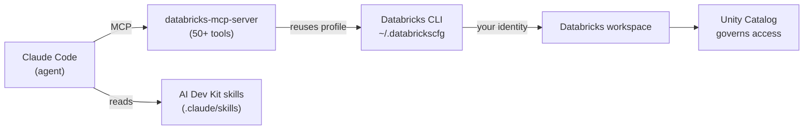

# Setup: Claude Code + the Databricks AI Dev Kit

> A new power tool is only as useful as the jig you clamp it into. Claude Code out of the
> box is a superb *general* coding agent — but it doesn't know your Databricks workspace
> exists. The **AI Dev Kit** is the jig: it hands the assistant a set of governed
> Databricks tools and a library of patterns, so "build me a job" or "deploy this App"
> becomes something it can actually *do*, safely, as you.

This page gets you from nothing to a working setup: Claude Code installed, the Databricks
CLI authenticated, and the [AI Dev Kit](https://github.com/databricks-solutions/ai-dev-kit)
installed so the assistant can reach your workspace over MCP. The next pages use this
setup — first to understand the tools the assistant gains, then to build a real Databricks App.

Take a breath — it's a handful of one-time commands. Once it's done, you rarely touch it
again.

## Learning Objectives

By the end of this page, you will be able to:

- Explain what the AI Dev Kit adds to Claude Code: an MCP server (50+ Databricks tools) and skills.
- Install and authenticate the **Databricks CLI** so the MCP server can act as you.
- Install Claude Code and confirm it runs.
- Run the AI Dev Kit installer at **project** or **global** scope and understand what it writes.
- Verify the Databricks MCP server is connected inside Claude Code with `/mcp` and `claude mcp list`.
- Describe how governance works: the assistant acts through your CLI profile, and Unity Catalog still decides what it may touch.

## Prerequisites

Before this page, it helps to have:

- A **Databricks workspace** you can log into, with permission to create catalogs/schemas, jobs, and Apps (or a dev workspace where that's fine).
- Comfort with a terminal and a Python virtual environment — see [Setting Up VS Code for AI Engineering](/agentic-coding/vscode/setup-vscode-for-ai).
- Read [What Claude Code Is](/agentic-coding/claude-code/what-is-claude-code) so the agentic-loop mental model is fresh.

You do **not** need deep Databricks CLI experience — we'll set it up here.

## Estimated Reading Time

About 15 to 20 minutes, plus 10 minutes of installing. Most of the time is one-time
authentication. Read gently; you can copy the commands as you go.

## Business Motivation

**Maya**, a data engineer at **Northwind Trust**, wants to stop clicking through the
Databricks UI to wire up plumbing. She's about to build an internal advisor App, and it
involves the usual glue: a catalog, a serving endpoint to call, an App to deploy, some
config. Each step is documented, repetitive, and easy to get *slightly* wrong.

She'd like to describe the outcome — "create a chat App that calls our advisor endpoint,
deploy it to the dev workspace" — and have her assistant do the mechanical work while she
reviews. But for that to be safe, two things must be true: the assistant must reach
Databricks *as Maya* (so it can't do anything she couldn't), and it should follow
Databricks' real patterns (so its code isn't subtly wrong).

That's exactly the gap the AI Dev Kit fills. It's an **official Databricks
field-engineering project** that gives coding assistants a governed MCP server and a set
of skills. Set it up once, and Claude Code becomes a Databricks-aware pair that works
inside your existing permissions. The payoff: less click-ops, fewer copy-paste mistakes,
and every action still governed by Unity Catalog.

## Core Concepts

Three pieces come together. Keep them straight:

- **Claude Code** — the agentic coding assistant (Anthropic). It runs the reason → act → verify loop over your repo and shell.
- **The Databricks CLI** — the authenticated bridge to your workspace. It stores a **configuration profile** (host + credentials) in `~/.databrickscfg`. The MCP server reuses it.
- **The AI Dev Kit** — installs two things for the assistant:
  - a **`databricks-mcp-server`** exposing 50+ tools (SQL, Unity Catalog, jobs, pipelines, MLflow, model serving, **Databricks Apps**), and
  - **skills** — curated markdown guides teaching Databricks patterns and best practices.



*The AI Dev Kit wires Claude Code to Databricks. The MCP server does the *doing*; the
skills shape *how*; the CLI profile provides the *identity*; Unity Catalog governs the
rest.*

## Deep Dive

Let's understand what the installer actually does, because that demystifies the whole
thing.

The AI Dev Kit ships an installer script. When you run it, it detects which AI coding
tools you use (Claude Code, Cursor, Copilot, Gemini CLI, and others) and writes the right
configuration for each. For Claude Code specifically, it configures the **Databricks MCP
server** as an MCP client entry and drops the **skills** into your project's `.claude`
directory. Because it configures the client for you, you generally **don't** hand-edit a
`.mcp.json` — though it's useful to know that's the file where project-scoped MCP servers
live (more below).

The MCP server itself is a local process. When Claude Code needs to, say, list catalogs,
it calls the server's `list_catalogs` tool over MCP; the server turns that into a
Databricks API/CLI call using your profile, and returns the result. This is the same
[MCP](/docs/agents-tools-mcp/mcp) pattern you learned in the Databricks AI track — here
the *client* is your coding assistant instead of a production agent.

:::note Fast-moving project — verify specifics
The AI Dev Kit is under active development. Its README notes a **major evolution**: in an
upcoming release the *skills* move to official, Databricks-managed sets (installed via the
Databricks CLI), while the MCP server and Builder App stay in the repo. Some skill names
are changing too (e.g. `databricks-bundles` → `databricks-dabs`). Treat exact commands and
file paths here as the *current shape* and confirm against the
[repository README](https://github.com/databricks-solutions/ai-dev-kit).
:::

## Step-by-Step Walkthrough

The whole setup, at a glance — we'll do each in the next section:

1. **Install prerequisites**: `uv` and the Databricks CLI.
2. **Authenticate the CLI** to your workspace (creates a profile in `~/.databrickscfg`).
3. **Install Claude Code** and confirm it launches.
4. **Run the AI Dev Kit installer** in your project (or globally).
5. **Verify** the MCP server inside Claude Code.
6. **Sanity-check** by asking Claude Code to list your catalogs.

## Hands-on Examples

:::note
Commands, package names, and install URLs evolve. Treat these as the shape to recognize
and confirm current specifics in the [AI Dev Kit README](https://github.com/databricks-solutions/ai-dev-kit),
the [Databricks CLI docs](https://docs.databricks.com/aws/en/dev-tools/cli/), and the
[Claude Code docs](https://docs.claude.com/en/docs/claude-code).
:::

**Step 1 — Install `uv` and the Databricks CLI.**

```bash
# uv — a fast Python package manager the kit uses.
curl -LsSf https://astral.sh/uv/install.sh | sh

# Databricks CLI (macOS/Linux). Verify the current install method in the docs.
brew tap databricks/tap && brew install databricks
# or:  curl -fsSL https://raw.githubusercontent.com/databricks/setup-cli/main/install.sh | sh
```

**Step 2 — Authenticate the Databricks CLI (create a profile).**

```bash
# OAuth (U2M) login — opens a browser, no long-lived token to manage.
databricks auth login --host https://your-workspace.cloud.databricks.com

# Give it a profile name when prompted, e.g. "northwind-dev".
# Confirm it works:
databricks current-user me --profile northwind-dev
```

This writes a profile to `~/.databrickscfg`. Prefer **OAuth** over a personal access
token — short-lived credentials are safer, the same lesson from the
[Databricks extension](/agentic-coding/vscode/databricks-extension). The MCP server will
reuse this profile (the `DEFAULT` profile automatically, or a named one via a `--profile`
flag).

**Step 3 — Install Claude Code and launch it once.**

```bash
# Install Claude Code (verify the current method in the docs).
# Native installer:
curl -fsSL https://claude.ai/install.sh | bash
# or via npm:
# npm install -g @anthropic-ai/claude-code

# Launch it inside a project folder:
mkdir northwind-advisor-app && cd northwind-advisor-app
claude
```

The first launch walks you through signing in. Type `/help` inside the session to see
commands, then exit for a moment to install the kit.

**Step 4 — Run the AI Dev Kit installer (project scope).**

```bash
# From your project root. Installs at PROJECT scope by default,
# writing config into .claude (and other editors' folders if present).
bash <(curl -sL https://raw.githubusercontent.com/databricks-solutions/ai-dev-kit/main/install.sh)

# Options you might use:
#   --global          install for all projects
#   --tools claude    limit to specific editors
#   --force           reinstall/overwrite
#   --uninstall       remove it
```

On Windows PowerShell the equivalent is
`irm https://raw.githubusercontent.com/databricks-solutions/ai-dev-kit/main/install.ps1 | iex`.
The installer configures the Databricks MCP server for Claude Code and places the skills
under `.claude/skills`.

**Step 5 — Verify the MCP server inside Claude Code.**

```bash
# List configured MCP servers from the CLI:
claude mcp list
# You should see a "databricks" (or similarly named) server.
```

Then launch `claude` again and run the in-session command:

```
/mcp
```

This shows connected MCP servers and lets you authenticate any that need it. The **first**
time the assistant calls a Databricks tool, Claude Code prompts you to approve it — that's
the permission model working as intended.

**Step 6 — Sanity check: ask for something read-only.**

Inside the Claude Code session, just type in plain English:

```
List the catalogs in my Databricks workspace using the databricks-dev profile,
and show me the schemas in the first one.
```

Claude Code will call the MCP server's catalog/schema tools, ask your approval on first
use, and print the results. If you see your real catalogs, the bridge is live. 🎉

## Production Considerations

- **Use a dev profile for experimentation.** Point the kit at a **development** workspace or a profile with limited scope while you're learning. Promote to prod deliberately.
- **Understand project vs. global scope.** Project-scoped install keeps the kit's config in *this* repo (shareable with the team via git); global applies everywhere for you. For team repos, project scope plus a committed setup is usually cleaner.
- **Pin what you can.** The kit and its skills are evolving; note the version/commit you installed in your README so teammates match it.
- **Keep the CLI current.** The MCP server leans on the Databricks CLI; an outdated CLI can cause confusing tool failures.

## Team & Collaboration Considerations

- **Share the setup, not the secrets.** The MCP config and skills can live in the repo (`.claude/`); each engineer runs `databricks auth login` once to create their *own* profile. Nobody commits credentials.
- **Know the config files.** Project-scoped MCP servers live in a `.mcp.json` at the repo root (`{"mcpServers": {...}}`); user-scoped ones live in your personal Claude config. The installer manages these, but knowing where they are helps when debugging.
- **Agree on a profile name.** If the whole team uses, say, `northwind-dev`, then shared prompts and docs ("use the northwind-dev profile") just work for everyone.
- **Add a CLAUDE.md.** A short [project memory](/agentic-coding/vscode/repo-first-project) file — "we deploy Apps to the dev workspace via the AI Dev Kit; always ask before deploying to prod" — loads every session and keeps the assistant on-guardrails.

## Security Considerations

This is the reassuring part — the design keeps you in control.

- **The assistant acts as *you*.** The MCP server authenticates with your CLI profile, so it can only touch what your Databricks identity is permitted to touch. There's no privilege escalation and no separate all-powerful service account by default.
- **Unity Catalog still governs everything.** Every tool call is checked against your permissions, exactly like [MCP](/docs/agents-tools-mcp/mcp) tools for a production agent. Listing a tool is not the same as being allowed to run it.
- **Approve tool use deliberately.** Claude Code prompts before a server's tools run. Don't blanket-approve destructive operations; keep an allow/deny policy in `settings.json` and lean on **plan mode** when you just want the assistant to explore.
- **Prefer OAuth over PATs.** Short-lived credentials from `databricks auth login` beat a long-lived token sitting in an env var. Never paste a token into a prompt or commit `~/.databrickscfg`.
- **Trust the installer source.** You're running a script from the internet — read what it does, and only run the official Databricks repository's installer.

## Common Mistakes

- **Skipping CLI auth.** If `databricks current-user me` fails, the MCP server can't act. Fix authentication first — most "the tools don't work" issues are really auth issues.
- **Profile mismatch.** The kit defaults to the `DEFAULT` profile. If your creds are under a named profile, tell the assistant which profile to use (or set it as default).
- **Version drift.** Installing the kit but running an old Databricks CLI, or expecting an old skill name after the kit's evolution. Check the README when something's off.
- **Blanket-approving everything.** Turning off all prompts removes your safety net. Keep approvals on for writes and deploys, at least while learning.
- **Editing generated config by hand and then re-running the installer.** Re-running can overwrite your edits. Prefer a `CLAUDE.md` and `settings.json` for your own customizations.

## Best Practices

- **Authenticate first, install second, verify third.** In that order, and confirm each with a check command.
- **Start in a dev workspace with a named profile.** Least privilege while you learn.
- **Commit the shared setup; keep secrets local.** `.claude/` and `.mcp.json` in git; `~/.databrickscfg` never.
- **Write a small CLAUDE.md** with your guardrails ("ask before deploying to prod", "use the dev profile").
- **Use `/mcp` and `claude mcp list`** whenever tools misbehave — they tell you what's connected.
- **Verify evolving specifics** in the [kit README](https://github.com/databricks-solutions/ai-dev-kit) and [Claude Code docs](https://docs.claude.com/en/docs/claude-code) before relying on an exact command.

## Interview Questions

1. **What does the AI Dev Kit add to a coding assistant like Claude Code, and why is that necessary?**
   Look for: an MCP server (50+ Databricks tools) plus skills (pattern guides). Necessary because a general coding agent has no built-in way to *act* on a Databricks workspace or follow its conventions; the kit provides governed tools and know-how.

2. **How does the MCP server authenticate to Databricks, and what are the security implications?**
   Look for: it reuses the Databricks CLI profile (`~/.databrickscfg`), so it acts as *your* identity and is bound by Unity Catalog permissions. Implications: no privilege escalation, prefer OAuth over PATs, approve tool use deliberately.

3. **Explain project vs. user/global scope for MCP servers in Claude Code and where the config lives.**
   Look for: project scope is shared via the repo in `.mcp.json` (`mcpServers` object); user/global scope applies to all your projects and lives in your personal Claude config. Team repos usually favor project scope.

4. **Your teammate says "the Databricks tools don't work in Claude Code." How do you debug it?**
   Look for: check CLI auth (`databricks current-user me`), confirm the right profile, run `claude mcp list` and `/mcp` to see connection/auth state, check the CLI version, and confirm the first-use tool approval wasn't denied.

5. **Why keep tool approvals on and use plan mode, rather than auto-approving everything?**
   Look for: the assistant acts with real permissions; approvals and plan mode keep a human in the loop for writes/deploys, preventing an unintended destructive action while still allowing fast read-only exploration.

## Quiz

**Q1.** What two things does the AI Dev Kit install for Claude Code?

<details>
<summary>Show answer</summary>

A **Databricks MCP server** (50+ tools for SQL, Unity Catalog, jobs, pipelines, MLflow, model serving, and Databricks Apps) and a set of **skills** (markdown guides teaching Databricks patterns). The MCP server does the actions; the skills shape how the assistant does them.

</details>

**Q2.** Where does the MCP server get its credentials, and what does that mean for what it can do?

<details>
<summary>Show answer</summary>

From your **Databricks CLI profile** in `~/.databrickscfg`. It therefore acts as **your identity**, and Unity Catalog governs it — it can only do what you're permitted to do. No separate super-user account by default.

</details>

**Q3.** You installed the kit but Claude Code's Databricks tools return auth errors. What's the most likely first thing to check?

<details>
<summary>Show answer</summary>

That the **Databricks CLI is authenticated** and the right **profile** is being used. Run `databricks current-user me --profile <name>`. Most "tools don't work" problems are really CLI authentication or profile-selection problems, not MCP problems.

</details>

**Q4.** True or false: because the installer configures the MCP client for you, you should hand-edit `.mcp.json` to customize behavior.

<details>
<summary>Show answer</summary>

**False (mostly).** The installer manages the MCP client config, so you generally don't hand-edit `.mcp.json`; re-running the installer can overwrite manual edits. Put your own customizations in `CLAUDE.md` and `settings.json` instead. Knowing where `.mcp.json` lives is still useful for debugging.

</details>

## Summary

You turned a general coding agent into a Databricks-aware one. The recipe: install `uv`
and the Databricks CLI, **authenticate** the CLI to create a profile, install **Claude
Code**, then run the **AI Dev Kit** installer to wire up the Databricks MCP server (50+
tools) and skills. A quick `/mcp` check and a read-only "list my catalogs" prompt prove
the bridge is live.

The design keeps you safe: the assistant acts through your CLI profile, so Unity Catalog
governs everything, and Claude Code prompts before running tools. Share the setup via the
repo, keep credentials local, and jot your guardrails into a `CLAUDE.md`. With this in
place, the next page is the fun part — building a real Databricks App mostly by describing
what you want.

## Key Takeaways

- **Claude Code + AI Dev Kit** = a Databricks-aware coding agent: MCP server (tools) + skills (patterns).
- **The Databricks CLI profile is the identity.** Authenticate first; the MCP server reuses it and Unity Catalog governs it.
- **Install at project scope** to share config via git; keep secrets (`~/.databrickscfg`) local.
- **Verify with `claude mcp list` and `/mcp`;** the first tool call prompts for approval.
- **Prefer OAuth, use a dev profile, keep approvals on,** and record guardrails in `CLAUDE.md`.
- **The kit is evolving** — verify commands and skill names against the repo README.

## Glossary

- **Claude Code:** Anthropic's agentic coding assistant that reads/edits code, runs commands, and can call MCP tools.
- **AI Dev Kit:** Official Databricks field-engineering toolkit that gives coding assistants a Databricks MCP server and skills.
- **`databricks-mcp-server`:** The kit's MCP server exposing 50+ Databricks tools to an assistant.
- **Databricks CLI profile:** A named host + credentials entry in `~/.databrickscfg`, created by `databricks auth login`.
- **Skill (Claude Code):** A `SKILL.md` file (under `.claude/skills/`) that teaches the assistant a multi-step procedure or pattern.
- **`.mcp.json`:** Project-scoped MCP client config (`mcpServers` object) shared via the repo.
- **`CLAUDE.md`:** Project memory loaded every session — a place for conventions and guardrails.
- **`/mcp`:** In-session Claude Code command to view and authenticate MCP servers.

## Further Reading

- [Databricks AI Dev Kit (GitHub)](https://github.com/databricks-solutions/ai-dev-kit) — the source, installer, tools, and current status.
- [Claude Code documentation](https://docs.claude.com/en/docs/claude-code) — MCP, skills, memory, and permissions references.
- [Databricks CLI documentation](https://docs.databricks.com/aws/en/dev-tools/cli/) — authentication and profiles.
- [Model Context Protocol](https://modelcontextprotocol.io/) — the open standard behind the tools.

## Next Lesson

Your assistant can now reach Databricks, governed and as you. Before we build with it,
let's see exactly what tools it just gained and how it decides to use them.

➡️ [MCP & the AI Dev Kit's Databricks Tools](/agentic-coding/claude-code/mcp-and-tools)
