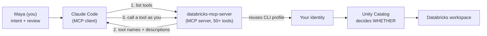
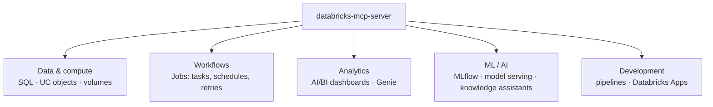
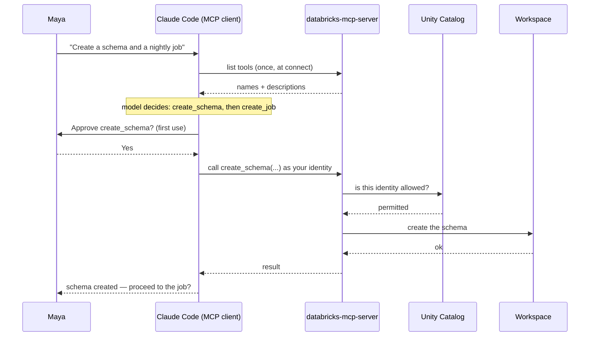

# MCP & the AI Dev Kit's Databricks Tools

> Picture handing a new teammate a wall of labeled tools on their first day. Every tool
> hangs on its own hook with a clear label — SQL, jobs, dashboards, model serving — so they
> can *see* the whole kit at a glance. But there's a catch: each tool only powers on if
> their badge allows it. Same wall for everyone; the badge decides what actually turns on.
> That's what MCP plus Unity Catalog give Claude Code — a visible, labeled toolwall where
> your identity is the badge.

In the [previous lesson](/agentic-coding/claude-code/setup-ai-dev-kit) you wired Claude
Code to your Databricks workspace: CLI authenticated, AI Dev Kit installed, the MCP server
connected. That was the plumbing. This lesson is about what happens *after* the plumbing —
how the assistant actually finds those 50+ Databricks tools, reasons about which one to
call, asks your permission, and stays inside the guardrails your workspace already enforces.

If you've read [MCP: A Universal Plug for Tools](/docs/agents-tools-mcp/mcp) from the
Databricks AI track, you already know the shape. Here we flip the perspective: instead of a
*production agent* being the MCP client, it's your *coding assistant*. Same protocol, same
governance, different seat.

## Learning Objectives

By the end of this lesson, you will be able to:

- Explain the MCP client/server roles in this setup — Claude Code is the **client**, the AI Dev Kit's `databricks-mcp-server` is the **server**.
- Describe **tool discovery**: how the assistant lists the server's tools and reads their descriptions rather than you hardcoding anything.
- Name the main **categories** of the 50+ AI Dev Kit tools (data & compute, workflows, analytics, ML/AI, development).
- Explain how the model **decides** which tool to call (function-calling reasoning) and how **skills** complement tools.
- Configure **tool approval** — first-use prompts, `settings.json` allow/deny rules, and plan mode.
- Explain the governance model: every call runs as your CLI identity, and Unity Catalog decides *whether* — MCP only standardizes *how*.

## Prerequisites

Before this lesson, you should have:

- Completed [Setup: Claude Code + the Databricks AI Dev Kit](/agentic-coding/claude-code/setup-ai-dev-kit) — a connected MCP server is assumed throughout.
- A working mental model of [MCP](/docs/agents-tools-mcp/mcp) and [how function calling works](/docs/agents-tools-mcp/function-calling). We'll recap both, but familiarity helps.

If you've also read the VS Code track's [AI assistants & MCP](/agentic-coding/vscode/ai-assistants-and-mcp) lesson, you'll notice the ideas here are portable — the same MCP concepts apply to any client, not just Claude Code.

## Estimated Reading Time

About 20 to 25 minutes. No installation — you did that last lesson. This one is about
building the right mental model so you trust (and control) what the assistant does.

## Business Motivation

**Maya** at **Northwind Trust** has the setup done. Now she wants to actually use it. Her
first real task: "create a `northwind_dev.advisor` schema and a nightly job that refreshes
the advisor's feature table." In the old world that's a tab-dance — Catalog Explorer to
make the schema, the Jobs UI to define the task, the cluster picker, a schedule, a couple
of retries. Ten minutes of clicking, and easy to get *slightly* wrong.

She'd rather type the sentence and review the result. But she has a reasonable worry: if
the assistant can "do Databricks things," what exactly can it do? Can it drop a production
table? Deploy to prod by accident? Read data she isn't cleared to see?

Those worries are the whole subject of this lesson, and the answers are reassuring. The
assistant can only *see* tools the server publishes, can only *run* the ones you approve,
and can only *touch* what her Databricks identity is already permitted to touch. The
toolwall is visible; the badge still rules. Understanding this precisely is what lets Maya
move fast without holding her breath.

## Intuition

Two systems are working together, and it's worth seeing them side by side. MCP is the
*shape of the connection* — how Claude Code talks to Databricks. Unity Catalog is the
*gate* — what that connection is allowed to do.



*Diagram 1: MCP standardizes HOW the assistant reaches Databricks tools; Unity Catalog
decides WHETHER each call is allowed. The server never gives the assistant more than your
identity already permits.*

Hold onto that split. Almost every question in this lesson — "can it do X?", "is this
safe?", "why did a tool fail?" — resolves cleanly once you know which system you're asking
about. MCP governs *how*. Unity Catalog governs *whether*. You (via approvals) govern
*when*.

## Theory

Let's put names on the pieces.

**MCP (Model Context Protocol)** is an open standard for how AI clients connect to tools.
It defines two roles:

- **MCP server** — offers tools. It can answer "here are my tools, here's what each does, here's the shape of their inputs."
- **MCP client** — connects to a server, asks for the tool list, and calls tools.

In the Databricks AI track, the *client* was a production agent you built. **Here the
client is Claude Code itself.** The AI Dev Kit's `databricks-mcp-server` is the server. This
is the single most important reframing in the lesson: your coding assistant is a fully
capable MCP client, and the Databricks workspace is just another server it can plug into.

The magic word — same as the reference lesson — is **discovery**. You never handed Claude
Code a list of Databricks tools. When it connects to the server, it *asks* for the list and
reads back each tool's name and description. That's why the assistant "knows" it can create
a job or list catalogs: the server told it, in a standard format, at connection time.

:::note[Why discovery matters here]
Because tools are discovered, not hardcoded, the AI Dev Kit can add, rename, or improve
tools and your assistant picks up the changes without you editing any config. The trade-off:
the *quality of tool descriptions* directly drives how well the model chooses. Good
descriptions are the interface.
:::

## Deep Dive

### The 50+ tools, by category

The AI Dev Kit's server exposes a large, evolving toolset. You don't memorize it — the
assistant discovers it — but knowing the *categories* helps you reason about what's
possible and helps you phrase requests well. Broadly:

- **Data & compute** — run SQL against a warehouse; create and inspect Unity Catalog objects (catalogs, schemas, tables); manage volumes and files.
- **Workflows** — create, update, run, and inspect **Jobs** (Databricks Workflows): tasks, schedules, retries, dependencies.
- **Analytics** — build and manage **AI/BI dashboards**; create and query **Genie spaces** for natural-language questions over tables.
- **ML / AI** — manage **MLflow experiments** and runs; deploy and query **model serving endpoints**; wire up **knowledge assistants** (RAG-style helpers).
- **Development** — author **pipelines** (Lakeflow / Delta Live Tables); scaffold and deploy **Databricks Apps** (the focus of the next lesson).



*Diagram 2: The AI Dev Kit tools cluster into five families. You describe an outcome; the
model maps it onto tools from these families.*

:::note[Exact tool names evolve]
Tool names, counts, and groupings change as the AI Dev Kit evolves (recall the setup
lesson's note about skills moving to Databricks-managed sets). Don't hardcode a name like
`create_job` in your head — ask the assistant "what Databricks tools can you see?" or check
the [repository README](https://github.com/databricks-solutions/ai-dev-kit). Discovery is
the source of truth.
:::

### How the model decides which tool to call

This is ordinary **function-calling reasoning** — the same mechanism covered in
[How Function Calling Works](/docs/agents-tools-mcp/function-calling). The model has, in its
context, the discovered tool descriptions. When you say "create a schema and a nightly
job," the model:

1. Reads your intent.
2. Scans the tool descriptions for ones whose purpose matches.
3. Picks a tool and fills in its arguments in the shape the description specifies.
4. Reads the result, then decides whether it's done or needs another call.

Nothing mystical: it's pattern-matching intent to tool descriptions, then structured
argument-filling. This is exactly why clear descriptions matter and why *your* phrasing
matters — "refresh the feature table nightly" points at a Jobs tool far more cleanly than
"make the data update itself."

### Skills vs. tools: the "how" vs. the "do"

The AI Dev Kit ships two very different things, and keeping them straight clears up a lot of
confusion:

- **Tools** are the *do*. They're the MCP-exposed verbs — `run SQL`, `create a job`, `deploy an App`. Calling one changes or reads your workspace.
- **Skills** are the *how*. They're `SKILL.md` pattern guides (under `.claude/skills/`) that teach the assistant Databricks' *conventions* — how a well-formed Asset Bundle is laid out, how to structure a Databricks App, what a good job definition looks like. They load on demand when relevant.

A useful metaphor: tools are the power tools on the wall; skills are the laminated
instruction cards next to them telling you the right way to use each one. Without skills,
the assistant *can* call `create_job` but might produce a job that's technically valid yet
not idiomatic. With skills, it calls the same tool but follows the pattern Databricks
actually recommends. Tools give reach; skills give judgment.

## Architecture

Here's a single request end to end — the shape of every Databricks action Claude Code
takes.



*Diagram 3: One request, many governed steps. Note the two independent gates — your
approval (when) and Unity Catalog's permission check (whether) — that stand between the
model's decision and any real change.*

The architectural heart: the server sits between the assistant and the workspace, and
**every call passes through both your approval and Unity Catalog**. There is no backdoor.
The assistant gets exactly the access your CLI identity permits — no more.

## Step-by-Step Walkthrough

Let's narrate Maya's "create a schema and a job" request without code, so the flow is clear
before we make it concrete.

1. **Connect & discover.** On launch, Claude Code connects to the MCP server and lists its tools. The Unity Catalog, Jobs, and SQL tools are now in its awareness.
2. **Understand intent.** Maya types her sentence. The model parses two sub-goals: a schema, and a scheduled job.
3. **Orient (read before write).** A well-behaved assistant looks first — it might call a read-only tool like `list_catalogs` to confirm `northwind_dev` exists and see where the schema should live.
4. **Plan the writes.** It settles on `create_schema`, then `create_job` with a nightly schedule and the right task.
5. **Ask approval.** The first time it calls each server tool, Claude Code prompts Maya. She approves the schema; she reads the job definition carefully before approving that one.
6. **Govern & execute.** Each approved call runs as Maya's identity; Unity Catalog checks permission; the workspace performs the action.
7. **Verify & report.** The assistant reads each result and reports back — schema created, job ID returned — and offers next steps.

Discover, decide, approve, govern, execute, verify. That's the loop for one tool or a
dozen.

## Hands-on Examples

:::note
The blocks below are **illustrative** — a transcript-style narration plus conceptual tool
calls. Actual tool names, arguments, and output shapes evolve; confirm current specifics via
the assistant's own discovery ("what Databricks tools do you have?") and the
[AI Dev Kit README](https://github.com/databricks-solutions/ai-dev-kit). The point is the
*shape* of the interaction.
:::

**Step 1 — Maya asks in plain English.**

```text
Maya: In the northwind_dev catalog, create a schema called "advisor",
then create a nightly job that refreshes the advisor feature table.
Use the northwind-dev profile. Show me the plan before you change anything.
```

Because she asked for a plan first, the assistant explores read-only and proposes before
acting — this is plan mode discipline (more below).

**Step 2 — The assistant discovers and orients (read-only).**

```text
Claude Code:
- Calling list_catalogs (databricks-mcp-server) ... found: northwind_dev, main, samples
- Calling list_schemas(catalog="northwind_dev") ... advisor does not exist yet.
Plan:
  1. create_schema(catalog="northwind_dev", name="advisor")
  2. create_job(name="advisor-feature-refresh",
                schedule="0 0 3 * * ?",   # nightly 03:00, verify cron shape
                task=<SQL/notebook that rebuilds the feature table>)
Proceed with step 1?
```

Notice: the read-only `list_*` calls may not even prompt (they're safe), but the model still
narrates them. It discovered these tools — Maya never named them.

**Step 3 — First-use approval on a write.**

```text
Claude Code: The tool `create_schema` (databricks-mcp-server) wants to run:
    catalog = "northwind_dev", name = "advisor"
[a] allow once   [A] allow for session   [d] deny
Maya: a
Claude Code: Schema northwind_dev.advisor created.
```

**Step 4 — The next tool prompts again, and Maya reviews carefully.**

```text
Claude Code: The tool `create_job` wants to run with:
    name     = "advisor-feature-refresh"
    schedule = nightly at 03:00
    task     = SQL: MERGE INTO northwind_dev.advisor.features ...
[a] allow once   [A] allow for session   [d] deny
Maya: (reads the SQL, confirms the target table) a
Claude Code: Job created (job_id 8821). It will first run tonight at 03:00.
```

Each *distinct* tool prompts on first use. Maya stayed in the loop exactly where it mattered
— the write that touches data — and the whole thing took one sentence and two glances.

## Production Considerations

- **Codify tool policy in `settings.json`.** The `permissions` object (`allow` / `deny` arrays in `.claude/settings.json`) lets you pre-approve safe, read-only tools and *deny* dangerous ones outright, so you're prompted only for the calls that deserve a human. Keep destructive operations out of blanket allows.
- **Use a dev profile and a dev catalog while iterating.** Point prompts at `northwind-dev`; promote to prod deliberately. The identity you authenticate is the ceiling on damage.
- **Record guardrails in `CLAUDE.md`.** A line like "always run read-only tools to confirm objects before creating them; never deploy to prod without explicit approval" loads every session and steers tool choice.
- **Prefer the assistant's discovery over hardcoded names in docs.** When you write runbooks, say "ask Claude to create the job" rather than pinning a tool name that may be renamed.

## Team & Collaboration Considerations

- **Share the toolset, not the badges.** The MCP config and skills live in the repo (`.mcp.json`, `.claude/`); each engineer runs `databricks auth login` for their own profile. Everyone sees the same toolwall; each badge differs.
- **Agree on allow/deny defaults.** A committed `.claude/settings.json` with sensible read-only allows and prod-write denies gives the whole team the same safety rails without per-person setup.
- **Write skills for your conventions.** If Northwind has a house style for jobs or Apps, a project skill teaches every teammate's assistant the same pattern — consistency for free.
- **Keep each request's scope tight.** Fewer, sharper asks ("create this one schema") produce clearer approval prompts than sprawling ones, so reviewers can actually read what they're approving.

## Security Considerations

Read this twice — it's the reassuring part.

- **The assistant acts as *you*.** Every tool call reuses your Databricks CLI profile. The assistant has no separate, more-powerful identity. It cannot do anything you couldn't do by hand.
- **Unity Catalog decides *whether*, every time.** Listing a tool is not permission to run it. If your identity can't write to a schema, `create_schema` fails there — the same check that protects the object from any client. MCP standardizes *how*; UC decides *whether*.
- **Approvals are the *when* gate.** First-use prompts and `settings.json` deny rules keep a human between the model's decision and irreversible actions. Don't blanket-approve writes and deploys, especially while learning.
- **Plan mode for exploration.** When you just want the assistant to investigate, use plan mode: it reads and proposes but makes no changes until you approve. Highest-leverage control for a governed workspace.
- **Prefer OAuth; never paste tokens.** Short-lived `databricks auth login` credentials beat a long-lived PAT in an env var, and never put a token in a prompt.
- **Auditability.** Because every action runs as your identity through the workspace, Databricks' own audit logs record who did what — the assistant's actions are attributable to you, which is exactly what a firm like Northwind needs.

## Common Mistakes

- **Thinking a listed tool means the assistant can use it.** Discovery lists what *exists*; Unity Catalog and your approvals decide what *runs*. Three different questions.
- **Blanket-allowing all tools to stop the prompts.** That removes the *when* gate. Allow read-only tools; keep writes and deploys prompting.
- **Confusing skills with tools.** Skills don't *do* anything — they shape how tools are used. If a task needs an action, that's a tool; if it needs a pattern, that's a skill.
- **Vague requests → wrong tool.** "Fix the data" gives the model little to match. "Refresh `northwind_dev.advisor.features` nightly via a job" points straight at the right tool.
- **Ignoring the profile.** If a call hits the wrong workspace, it's usually the profile. Tell the assistant which profile to use.
- **Assuming a hardcoded tool name still exists.** The kit evolves; rely on discovery, not memory.

## Best Practices

- **Ask read-only first.** Have the assistant `list_*` to orient before it writes. Cheap, safe, and it catches wrong assumptions early.
- **Let the assistant discover; you describe outcomes.** Say what you want, not which tool to call. The model maps intent to tools.
- **Pre-approve safe, deny dangerous.** Curate `settings.json` so prompts appear only where judgment is needed.
- **Use plan mode for anything non-trivial.** Read the plan, then approve. Especially for multi-tool sequences like "schema + job."
- **Keep skills current with your conventions.** They're your highest-leverage way to make tool use idiomatic across the team.
- **Verify evolving specifics** in the [AI Dev Kit README](https://github.com/databricks-solutions/ai-dev-kit) and [Claude Code docs](https://docs.claude.com/en/docs/claude-code).

## Interview Questions

1. **In the Claude Code + AI Dev Kit setup, who is the MCP client and who is the server?**
   Look for: Claude Code is the **client**; the AI Dev Kit's `databricks-mcp-server` is the **server**. Bonus: this flips the usual framing where a production agent is the client.

2. **What is tool discovery, and why does it matter that tools aren't hardcoded?**
   Look for: the client asks the server for its tool list + descriptions at connect time; the model reasons over those. It matters because the kit can evolve tools without config edits, and because description quality drives correct tool selection.

3. **How does the model decide which of the 50+ tools to call?**
   Look for: standard function-calling reasoning — match user intent to tool descriptions, fill arguments in the described shape, read the result, iterate. Clear phrasing and clear descriptions both improve selection.

4. **Distinguish skills from tools in the AI Dev Kit.**
   Look for: tools are the *do* (MCP-exposed actions that change/read the workspace); skills are the *how* (`SKILL.md` pattern guides that teach conventions and load on demand). Skills make tool use idiomatic; they don't act.

5. **Explain the governance model. Can the assistant do something you can't?**
   Look for: no. Every call runs as your CLI identity; Unity Catalog checks permission every time. MCP standardizes *how* it reaches tools; UC decides *whether*; approvals decide *when*. No privilege escalation.

6. **How would you let the assistant run read-only Databricks tools without prompting, but still guard writes?**
   Look for: `permissions` allow/deny in `.claude/settings.json` — allow the read-only tools, keep (or deny) write/deploy tools so they still prompt; combine with plan mode for exploration.

## Quiz

**Q1.** In this setup, which component is the MCP *server* — Claude Code or the AI Dev Kit?

<details>
<summary>Show answer</summary>

The **AI Dev Kit's `databricks-mcp-server`** is the server (it offers the tools). **Claude
Code** is the client (it discovers and calls them). This is the reverse of the production-
agent framing, where the agent is the client.

</details>

**Q2.** True or false: if the assistant can *see* a Databricks tool in its list, it can run it.

<details>
<summary>Show answer</summary>

**False.** Discovery lists what *exists*. Whether a call runs depends on **your approval**
(the *when* gate) and **Unity Catalog** checking your identity's permission (the *whether*
gate). Seeing a tool is not permission to use it.

</details>

**Q3.** How does the model pick which tool to call for "create a schema and a nightly job"?

<details>
<summary>Show answer</summary>

Ordinary **function-calling reasoning**: it matches your intent against the discovered tool
**descriptions**, chooses matching tools (a Unity Catalog `create_schema`-style tool and a
Jobs `create_job`-style tool), fills their arguments in the described shape, and reads each
result before continuing. Clear descriptions and clear phrasing both improve the choice.

</details>

**Q4.** What's the difference between a skill and a tool in the AI Dev Kit?

<details>
<summary>Show answer</summary>

A **tool** is the *do* — an MCP-exposed action (run SQL, create a job, deploy an App) that
reads or changes the workspace. A **skill** is the *how* — a `SKILL.md` pattern guide that
teaches Databricks conventions and loads on demand. Tools give reach; skills give judgment.

</details>

## Summary

Once the AI Dev Kit is wired up, Claude Code becomes an MCP **client** to the
`databricks-mcp-server`. It **discovers** the server's 50+ tools — across data & compute,
workflows, analytics, ML/AI, and development — and reasons over their descriptions the same
way ordinary function calling works, choosing tools from your plain-English intent.

Two systems keep it safe. **MCP** standardizes *how* the assistant reaches Databricks;
**Unity Catalog** decides *whether* each call is allowed, checking your CLI identity on every
call; and **you** decide *when*, through first-use approvals, `settings.json` allow/deny
rules, and plan mode. **Skills** ride alongside the tools, teaching the assistant to use them
the idiomatic Databricks way. The result is Maya's dream: describe "create a schema and a
nightly job," review two approval prompts, and it's done — governed, attributable, and inside
her existing permissions.

## Key Takeaways

- **Claude Code is the MCP client; the AI Dev Kit's `databricks-mcp-server` is the server.** Same protocol you learned for agents, different seat.
- **Tools are discovered, not hardcoded.** The assistant lists the server's tools and reads their descriptions — so descriptions and your phrasing drive correct choices.
- **The 50+ tools cluster into five families:** data & compute, workflows (Jobs), analytics (dashboards, Genie), ML/AI (MLflow, serving, knowledge assistants), and development (pipelines, Apps).
- **Three gates:** MCP = *how*, Unity Catalog = *whether* (every call, your identity), you = *when* (approvals, `settings.json`, plan mode).
- **Skills complement tools:** tools *do*, skills teach *how* to do it idiomatically.
- **No privilege escalation.** The assistant acts as you and can't exceed your permissions.

## Glossary

- **MCP client:** The component that connects to a server, discovers its tools, and calls them — here, **Claude Code**.
- **MCP server:** The component that offers tools and describes them — here, the AI Dev Kit's `databricks-mcp-server`.
- **Tool discovery:** The step where the client asks the server for its tool list and descriptions, so nothing is hardcoded.
- **Function-calling reasoning:** How the model matches intent to tool descriptions and fills arguments to decide which tool to call.
- **Skill:** A `SKILL.md` pattern guide (under `.claude/skills/`) that teaches Databricks conventions; loads on demand; shapes *how* tools are used.
- **First-use approval:** Claude Code's prompt the first time a given server tool runs in a session.
- **`settings.json` permissions:** The `allow` / `deny` arrays (`.claude/settings.json`) that pre-approve or block specific tools.
- **Plan mode:** A Claude Code mode where the assistant explores and proposes but makes no changes until you approve.
- **Unity Catalog:** Databricks' governance layer; decides *whether* each tool call is allowed, based on your identity.

## Further Reading

- [Databricks AI Dev Kit (GitHub)](https://github.com/databricks-solutions/ai-dev-kit) — the tools, skills, installer, and current status.
- [Claude Code documentation](https://docs.claude.com/en/docs/claude-code) — MCP clients, permissions, skills, and plan mode.
- [Model Context Protocol](https://modelcontextprotocol.io/) — the open standard behind the tools.

## Next Lesson

You now understand how the assistant finds, chooses, approves, and governs Databricks tool
calls. Time to put the whole toolwall to work and ship something real.

➡️ [Build a Databricks App with Claude Code](/agentic-coding/claude-code/build-a-databricks-app)
