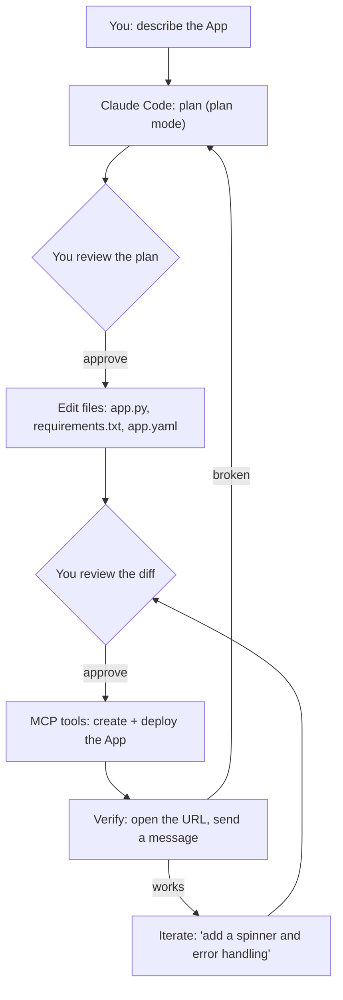
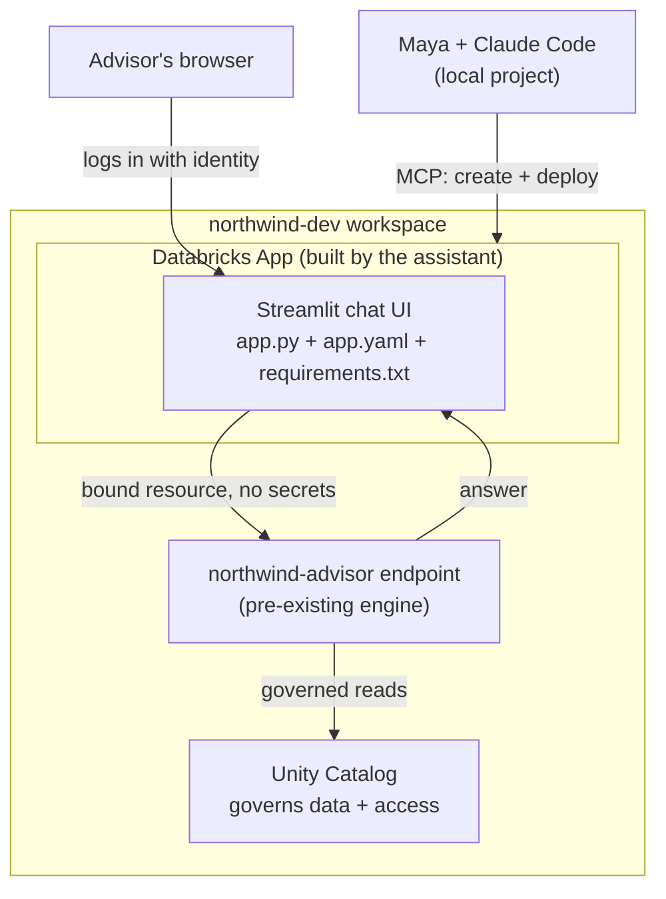

# Build a Databricks App with Claude Code

> Building a Databricks App by hand is like assembling flat-pack furniture: the parts are
> simple, but there are a dozen little steps, and one skipped screw means it wobbles. With
> Claude Code and the AI Dev Kit, you describe the finished piece and hand the assistant
> the toolbox — then you inspect each joint before it tightens. This page is that build,
> start to finish.

You've met [Claude Code](/agentic-coding/claude-code/intro) and
[wired it to Databricks](/agentic-coding/claude-code/setup-ai-dev-kit). Now we ship
something real: a governed chat App that lets Northwind Trust's advisors talk to their
internal advisor agent — the exact scenario from
[Shipping a Chat UI with Databricks Apps](/docs/building-agents/databricks-apps), but
built by *driving an assistant* instead of typing every file yourself.

The goal isn't to watch magic happen. It's to learn the **rhythm** of agentic coding on
Databricks: describe intent → let it plan → review the diff → let it act through governed
tools → verify → iterate. By the end you'll have a deployed App *and* a repeatable way of
working.

## Learning Objectives

By the end of this page, you will be able to:

- Drive Claude Code through a real, multi-step build using plain-English prompts.
- Use **plan mode** to make the assistant propose before it edits.
- Recognize which steps use the **AI Dev Kit's MCP tools** (acting on Databricks) versus plain file edits (writing your repo).
- Review the App's three files — `app.py`, `requirements.txt`, `app.yaml` — that the assistant generates, and know what each does.
- Have the assistant **deploy** the App and **verify** it end to end, then iterate on a change.
- Keep a human in the loop with approvals, diffs, and `CLAUDE.md` guardrails throughout.

## Prerequisites

You need the setup from the previous page working:

- [Claude Code + the AI Dev Kit installed](/agentic-coding/claude-code/setup-ai-dev-kit), with `claude mcp list` showing the Databricks server.
- A feel for [the tools the assistant gained](/agentic-coding/claude-code/mcp-and-tools) — this walkthrough puts several of them to work.
- An authenticated **Databricks CLI** profile (we'll call it `northwind-dev`).
- A **deployed agent serving endpoint** to point the App at — from [Authoring an Agent](/docs/building-agents/authoring-agents) / [Deploying Agents](/docs/llmops/deploy-agents). We'll use one named `northwind-advisor`. (No endpoint yet? You can still follow along and have the assistant stub the call, then swap in a real endpoint later.)

Skim the [Databricks Apps lesson](/docs/building-agents/databricks-apps) first — knowing
the "storefront vs. engine" split makes the assistant's output easy to review.

## Estimated Reading Time

About 30 minutes to read, and roughly the same to run it live in your own workspace. Go
slowly the first time — the point is the *workflow*, not speed.

## Business Motivation

Maya has a working advisor agent behind the `northwind-advisor` serving endpoint. Advisors
keep Slack-ing her questions that the agent could answer, but they won't touch a notebook.
They need a web page with a chat box, logged in with their Databricks identity, respecting
their access.

By hand, that's: scaffold an App project, write a Streamlit chat UI that calls the
endpoint, declare dependencies, write the app config, create the App in the workspace,
bind the endpoint as a resource, deploy, and share the URL. Individually easy; collectively
a morning of context-switching and doc-checking.

Maya's move: describe the whole thing to Claude Code, let it use the AI Dev Kit's tools
and skills to do the mechanical parts, and spend her attention on *review* — is the code
right, is the endpoint bound safely, does it actually work? That's the trade agentic
coding makes: the assistant handles breadth and boilerplate; the engineer handles judgment.

## Intuition

Here's the shape of the whole build. Notice how it alternates between the assistant
*writing your repo* (file edits) and *acting on Databricks* (MCP tools) — with you
reviewing at each hand-off.



*The agentic-coding loop for a Databricks App. Green-light gates (your reviews) sit between
each machine step. The assistant is fast; you are the guardrail.*

The mental model from the [Apps lesson](/docs/building-agents/databricks-apps) still holds:
we're building the **storefront** (the App). The **engine** (the `northwind-advisor`
endpoint) already exists. The assistant's job is to build a thin storefront and deploy it —
not to reinvent the engine.

## Core Concepts

Three ideas make this go smoothly:

- **Plan before edit.** Claude Code's *plan mode* lets it explore and propose a plan without changing files. You approve the plan, then it executes. This is your cheapest, highest-leverage control.
- **Two kinds of actions.** *File edits* build your repo (reviewable as diffs). *MCP tool calls* act on Databricks (create App, bind resource, deploy) — these prompt for approval on first use. Knowing which is which tells you what you're approving.
- **Skills shape the output.** The AI Dev Kit's `databricks-apps` skill teaches the assistant the current, correct App patterns, so its `app.yaml` and resource binding follow Databricks' grain rather than a guess. (The kit's App skill defaults to the TypeScript **AppKit** framework and falls back to Python frameworks like Streamlit — we'll ask for Streamlit to match our Apps lesson.)

## Deep Dive

Let's do the build. Everything below happens inside a `claude` session in your project
folder, with the AI Dev Kit installed. Prompts you type are in quotes; commentary follows
each.

### 1. Set your guardrails first (`CLAUDE.md`)

Before building, give the assistant standing rules. Ask it to write them:

> "Create a CLAUDE.md that says: this project deploys a Databricks App to the
> **northwind-dev** workspace using the **northwind-dev** CLI profile; always use plan
> mode for multi-step changes; **never deploy to a production workspace** without asking;
> and prefer Streamlit for the App UI."

Claude Code writes a `CLAUDE.md`. Because [project memory](/agentic-coding/claude-code/setup-ai-dev-kit)
loads every session, these rules now steer every future prompt. This one small file
prevents a whole class of "wait, don't do that" moments.

### 2. Ask for a plan (don't let it build yet)

Enter plan mode (Shift+Tab cycles modes, or use `/plan`), then:

> "I want to build a Databricks App: a Streamlit chat UI that calls our
> `northwind-advisor` serving endpoint, deployed to the northwind-dev workspace. Use the
> AI Dev Kit. First, **plan** the steps — don't edit anything yet. Tell me which steps
> touch Databricks vs. which just write local files."

The assistant explores (it may call read-only MCP tools to confirm the endpoint exists and
check the workspace) and returns a plan, for example:

```text
Plan:
1. Scaffold app/ with app.py (Streamlit), requirements.txt, app.yaml   [local files]
2. Write a chat UI that calls the northwind-advisor endpoint            [local files]
3. Create the Databricks App "northwind-advisor-app" in northwind-dev   [MCP tool]
4. Bind the northwind-advisor serving endpoint as an App resource       [MCP tool]
5. Deploy the App and return its URL                                    [MCP tool]
6. Verify by fetching the App status                                    [MCP tool]
```

Read it like a code review. Is the endpoint name right? Is it the dev workspace? Is it
binding the endpoint as a *resource* (good) rather than pasting a token (bad)? If anything
is off, say so now — "use the endpoint `northwind-advisor` exactly, and bind it as a
resource, don't hardcode credentials" — and let it revise the plan. **Cheap to fix here,
expensive to fix after deploy.**

### 3. Approve, and let it write the files

Approve the plan. The assistant scaffolds the project and writes the three files, showing
you each as a diff. You'll get something like the storefront from the Apps lesson:

```python
# app/app.py — the chat UI (storefront). Review, don't just accept.
import os
import streamlit as st
from openai import OpenAI

ENDPOINT_NAME = os.environ["SERVING_ENDPOINT"]          # from config, not hardcoded

client = OpenAI(
    base_url=f"{os.environ['DATABRICKS_HOST']}/serving-endpoints",
    api_key=os.environ["DATABRICKS_TOKEN"],             # provided at runtime, not in code
)

st.title("Northwind Trust — Internal Advisor")
st.caption("Ask about policies, accounts, and procedures. Answers respect your access.")

if "messages" not in st.session_state:
    st.session_state.messages = []

for m in st.session_state.messages:
    with st.chat_message(m["role"]):
        st.markdown(m["content"])

if prompt := st.chat_input("Type your question..."):
    st.session_state.messages.append({"role": "user", "content": prompt})
    with st.chat_message("user"):
        st.markdown(prompt)
    with st.chat_message("assistant"):
        resp = client.chat.completions.create(
            model=ENDPOINT_NAME,
            messages=st.session_state.messages,
        )
        answer = resp.choices[0].message.content
        st.markdown(answer)
    st.session_state.messages.append({"role": "assistant", "content": answer})
```

```text
# app/requirements.txt
streamlit
openai
```

```yaml
# app/app.yaml
command: ["streamlit", "run", "app.py"]
env:
  - name: "SERVING_ENDPOINT"
    value: "northwind-advisor"
```

This is exactly the storefront pattern the [Apps lesson](/docs/building-agents/databricks-apps)
teaches — the assistant produced it because the AI Dev Kit's skill knows it. Your review
checklist:

- **No hardcoded secrets.** Endpoint name and credentials come from config/runtime. ✅
- **Sends the whole message list**, so the agent keeps conversation context. ✅
- **Thin storefront** — no model logic snuck into the UI. ✅

If it hardcoded the endpoint or a token, reject and correct. This is the moment your
engineering judgment earns its keep.

### 4. Let it create and deploy — via MCP, with approval

Now the Databricks-touching steps. The assistant calls the AI Dev Kit's MCP tools to
create the App and deploy it. **These prompt for approval** — read each one:

> "Looks good. Create the App `northwind-advisor-app` in the northwind-dev workspace,
> bind the `northwind-advisor` serving endpoint as a resource, and deploy it."

When Claude Code requests to run the deploy tool, you'll see an approval prompt naming the
tool and workspace. Confirm it's the **dev** workspace (your `CLAUDE.md` rule reinforces
this) and approve. The assistant streams progress and returns the App URL.

:::warning[You are approving real actions]
MCP deploy tools change your workspace. Read the approval prompt — which workspace, which
resource. If it ever names a production workspace, deny and remind it of the guardrail.
Approvals are not a formality; they're the brake pedal.
:::

### 5. Verify end to end

Don't trust "done" — verify, the same discipline as
[debugging & testing](/agentic-coding/vscode/debugging-and-testing). Ask:

> "Fetch the App's status and give me the URL. Is it running?"

Then open the URL in a browser, log in with your Databricks identity, and send a real
question: *"What's our wire transfer policy for amounts over $50,000?"* You should get the
advisor agent's answer. That round trip — you → App → endpoint → answer — is the proof.

### 6. Iterate with small, reviewable prompts

Real work is iteration. Try:

> "Add a 'thinking...' spinner while the endpoint responds, and wrap the call in
> try/except so a failure shows a friendly message instead of a stack trace. Show me the
> diff before deploying, then redeploy."

The assistant edits `app.py`, shows the diff (a `with st.spinner(...)` and a `try/except`),
you approve, and it redeploys. Notice the loop: **small intent → diff → approve → deploy →
verify.** Small steps keep diffs reviewable and mistakes cheap — the opposite of "write the
whole thing and pray."

## Architecture

Here's the finished system and who built what.



*What Claude Code built (the storefront and its deploy) vs. what already existed (the
engine and governance). The assistant never bypasses Unity Catalog — the App calls the
endpoint via a bound resource, and permissions follow the logged-in advisor.*

## Step-by-Step Walkthrough

The whole build as a checklist you can rerun:

1. **Guardrails** — have the assistant write a `CLAUDE.md` (dev workspace, plan mode, no prod deploys, Streamlit).
2. **Plan** — in plan mode, ask for a step-by-step plan labeling Databricks vs. local steps; review it.
3. **Files** — approve; it writes `app.py`, `requirements.txt`, `app.yaml`; review the diffs.
4. **Deploy** — it creates the App and binds the endpoint via MCP; approve the tool calls (confirm dev workspace).
5. **Verify** — fetch status, open the URL, log in, send a real question.
6. **Iterate** — small prompts (spinner, error handling), diff, approve, redeploy, re-verify.
7. **Commit** — ask it to `git init`, write a `.gitignore` and README, and make a first commit.

## Hands-on Examples

A few more prompts that pull their weight in a real build:

- **Explain before trusting:** *"Walk me through what `app.yaml` does and why the endpoint is a bound resource rather than an env token."* Great for learning and for catching a wrong assumption.
- **Use a skill explicitly:** if the kit exposes an App skill as a slash command, invoke it — *"/databricks-apps scaffold a Streamlit app for the northwind-advisor endpoint."* Skills encode the current best pattern.
- **Add tests:** *"Write a small pytest that imports app logic and checks the message list is passed through to the client (mock the OpenAI client)."* Ties into [debugging & testing](/agentic-coding/vscode/debugging-and-testing).
- **Right-size the model:** for a big refactor use `/model` to pick a stronger model; for quick edits a faster one is fine. Verify available names in the [Claude Code docs](https://docs.claude.com/en/docs/claude-code).
- **Recover from a wrong turn:** if a diff went sideways, undo the edit (Esc twice, or ask it to revert) and re-plan. Small steps make this painless.

## Production Considerations

- **Promote deliberately, dev → prod.** Build and verify in `northwind-dev`. For prod, deploy the *same* App as code — ideally via [Asset Bundles](/agentic-coding/vscode/asset-bundles) so the promotion is reviewed and repeatable, not a one-off assistant action. Keep the "no prod without asking" guardrail.
- **Keep the App thin.** As you iterate, resist letting the assistant add model/business logic into the UI. New capability belongs in the endpoint. Say so in `CLAUDE.md`.
- **Bind resources, never paste tokens.** Confirm every deploy binds the endpoint as a resource. A token in `app.yaml` is a review failure.
- **Version everything.** Commit the App files, `CLAUDE.md`, and the kit setup. The assistant's work should live in git like any code.
- **Treat generated code as a PR, not gospel.** It's a strong first draft from a fast teammate — review it with the same rigor.

## Team & Collaboration Considerations

- **Share the guardrails.** Commit `CLAUDE.md` so every teammate's assistant follows the same rules (dev workspace, plan mode, no prod deploys).
- **Standardize the profile name.** If everyone uses `northwind-dev`, prompts like "deploy to northwind-dev" just work across the team.
- **Review assistant-authored diffs like human ones.** Same PR process, same standards. The author being an AI doesn't lower the bar.
- **Capture repeatable flows as skills/commands.** If "scaffold + deploy an App" is common, save it as a project command so the whole team gets the same, reviewed recipe.

## Security Considerations

- **Everything is governed as you.** The App deploy runs through your CLI profile; the deployed App authenticates advisors with *their* Databricks identity, and Unity Catalog governs what the agent surfaces — on-behalf-of, exactly as in the [Apps lesson](/docs/building-agents/databricks-apps).
- **Approve deploys consciously.** The MCP deploy tool changes the workspace. Read the prompt; confirm the workspace and resource. Keep a `deny` rule for prod in `settings.json` if you want a hard stop.
- **No secrets in code or prompts.** Don't paste tokens into the chat, and reject any generated file that hardcodes one. Bind resources instead.
- **Control who can open the App.** Share it with the right group. A chat box is still a door.
- **Read what the assistant runs.** For shell commands and installs, glance at them before approving — the same care you'd give a script from a colleague.

## Common Mistakes

- **Skipping plan mode.** Letting the assistant build a multi-step change blind means a big, hard-to-review diff. Plan first.
- **Rubber-stamping deploy approvals.** The one prompt you must actually read is the one that changes your workspace. Confirm dev vs. prod every time.
- **Accepting hardcoded endpoints or secrets.** The generated `app.py`/`app.yaml` must read config and bind resources. Reject anything else.
- **Giant prompts.** "Build and deploy the whole thing and add auth and logging and tests" yields a sprawling diff. Break it into small, verifiable steps.
- **Not verifying.** "It deployed" isn't "it works." Open the URL and send a real message.
- **Letting logic creep into the UI.** Keep the storefront thin; the engine holds the brains.

## Best Practices

- **`CLAUDE.md` first.** Encode guardrails before you build; they steer every prompt.
- **Plan → diff → approve → deploy → verify.** Run the loop in small steps.
- **Name the workspace and profile explicitly** in prompts and memory.
- **Bind the endpoint as a resource;** never hardcode credentials.
- **Verify end to end in a browser,** then iterate.
- **Commit the result** and promote to prod through a reviewed path (Asset Bundles), not an ad-hoc deploy.
- **Use the kit's App skill** so the pattern is current — and verify evolving specifics in the [kit README](https://github.com/databricks-solutions/ai-dev-kit) and [Apps docs](https://docs.databricks.com/aws/en/dev-tools/databricks-apps/).

## Interview Questions

1. **Describe the agentic-coding loop you'd use to build and deploy a Databricks App with Claude Code.**
   Look for: describe intent → plan mode → review plan → approve file edits (review diffs) → approve MCP deploy (confirm workspace) → verify end to end → iterate in small steps. Human-in-the-loop at each gate.

2. **In this build, which steps are file edits and which are MCP tool calls, and why does the distinction matter?**
   Look for: writing `app.py`/`requirements.txt`/`app.yaml` are local file edits (review as diffs); creating/binding/deploying the App are MCP tool calls that change Databricks (approve consciously). Knowing which is which tells you what an approval actually does.

3. **How do you keep the assistant from doing something dangerous, like deploying to production?**
   Look for: `CLAUDE.md` guardrails, plan mode, per-action approvals, `settings.json` allow/deny (deny prod), naming the dev workspace/profile explicitly, and promoting to prod via a reviewed path (Asset Bundles) rather than an ad-hoc tool call.

4. **The generated `app.py` hardcodes a personal access token. What do you do and why?**
   Look for: reject it — secrets never belong in code; have it read credentials from runtime and bind the serving endpoint as a resource so Databricks manages access. Ties to least-privilege and governance.

5. **Why review assistant-generated code as rigorously as a human PR?**
   Look for: it's a fast first draft, not verified truth; it can be subtly wrong, use a stale pattern, or miss a guardrail. Diffs, tests, and verification are how you keep speed without sacrificing correctness.

6. **How would you make this build repeatable for your team?**
   Look for: commit `CLAUDE.md` and the kit setup, standardize the profile name, save the flow as a skill/command, review diffs via the normal PR process, and promote via Asset Bundles.

## Quiz

**Q1.** Why use plan mode before letting Claude Code build the App?

<details>
<summary>Show answer</summary>

So the assistant **proposes the steps without editing anything**, letting you catch a wrong endpoint name, the wrong workspace, or a bad approach *before* any files change or anything deploys. It's the cheapest, highest-leverage review point — fixing the plan is far cheaper than fixing a deployed mistake.

</details>

**Q2.** In the walkthrough, which action changes your Databricks workspace and therefore prompts for approval — editing `app.py`, or deploying the App via an MCP tool?

<details>
<summary>Show answer</summary>

**Deploying the App via an MCP tool.** Editing `app.py` is a local file change (reviewed as a diff). The MCP create/bind/deploy calls act on Databricks, so Claude Code prompts for approval — and that's the prompt you must read carefully (confirm dev vs. prod).

</details>

**Q3.** The assistant proposes an `app.yaml` that puts a Databricks token directly in an `env` value. Is that acceptable?

<details>
<summary>Show answer</summary>

**No.** Secrets don't belong in code or config. The endpoint should be **bound as a resource** so Databricks manages credentials at runtime, and the app reads host/token from the runtime environment — never a hardcoded token. Reject and correct it.

</details>

**Q4.** After the assistant says the App is deployed, what's the minimum you should do before calling it done?

<details>
<summary>Show answer</summary>

**Verify end to end**: fetch the App status/URL, open it in a browser, log in with your Databricks identity, and send a real question to confirm the round trip (App → endpoint → answer) works. "Deployed" is not the same as "working."

</details>

## Summary

You built and deployed a real Databricks App by *driving* Claude Code: set guardrails in
`CLAUDE.md`, planned in plan mode, reviewed the generated `app.py`/`requirements.txt`/`app.yaml`,
approved the AI Dev Kit's MCP tools to create and deploy the App, verified the round trip
in a browser, and iterated in small, reviewable steps. The engine (the `northwind-advisor`
endpoint) already existed; the assistant built the thin, governed storefront in front of it.

The real takeaway is the **rhythm**: describe intent → plan → review diff → act through
governed tools → verify → iterate. The assistant supplies speed and breadth; you supply
intent and judgment. Do that, and agentic coding on Databricks is both fast *and* safe —
you ship more, and you still know exactly what shipped.

## Key Takeaways

- **Drive, don't delegate blindly.** Describe intent, plan first, review every diff and every deploy approval.
- **Two action types:** file edits build your repo (diffs); MCP tool calls act on Databricks (approve consciously).
- **The App is a thin storefront;** the pre-existing endpoint is the engine. Keep logic out of the UI.
- **Bind the endpoint as a resource, never hardcode secrets;** the App authenticates advisors with their own identity under Unity Catalog.
- **`CLAUDE.md` + plan mode + approvals + settings deny-rules** keep you safely in control (especially "no prod deploys").
- **Verify end to end and commit;** promote to prod via a reviewed path like Asset Bundles.

## Glossary

- **Plan mode:** A Claude Code mode where the assistant explores and proposes a plan without editing files; you approve before it acts.
- **MCP tool call:** An action the assistant takes through the AI Dev Kit's Databricks MCP server (e.g., create/deploy an App); prompts for approval.
- **Databricks App:** An interactive web app hosted inside Databricks — here, the Streamlit chat UI (the "storefront").
- **Serving endpoint:** The deployed agent (the "engine") the App calls; here, `northwind-advisor`.
- **Resource binding:** Attaching the serving endpoint to the App so Databricks manages credentials, instead of hardcoding a token.
- **`CLAUDE.md`:** Project memory (loaded every session) where you record guardrails and conventions.
- **`app.yaml`:** The App's config — the run command and environment settings.
- **On-behalf-of:** The App reaching downstream resources as the logged-in user, so their permissions apply.

## Further Reading

- [Databricks AI Dev Kit (GitHub)](https://github.com/databricks-solutions/ai-dev-kit) — the App tools and skills used here.
- [Databricks Apps documentation](https://docs.databricks.com/aws/en/dev-tools/databricks-apps/) — current build, config, auth, and resource-binding patterns.
- [Claude Code documentation](https://docs.claude.com/en/docs/claude-code) — plan mode, permissions, models, and MCP.
- Our own [Shipping a Chat UI with Databricks Apps](/docs/building-agents/databricks-apps) — the same App, built by hand, for a deeper look at the code.

You've now used Claude Code to ship a governed Databricks App end to end. Nicely done —
you drove an agent to build an app that fronts another agent. That's agentic coding on
Databricks. 🚀

Related paths worth a detour: make deploys reproducible with
[Asset Bundles](/agentic-coding/vscode/asset-bundles), revisit the sibling
[VS Code](/agentic-coding/vscode/intro) subtopic (the AI Dev Kit works with its assistants
too — [AI Assistants & MCP](/agentic-coding/vscode/ai-assistants-and-mcp)), or go deeper on
*what* you're building in the [Databricks AI](/docs/intro) track.

## Next Lesson

Shipping is the fun part — but real work means bugs and tests. Next, put Claude Code to
work on the unglamorous, high-value stuff.

➡️ [Debugging & Testing with Claude Code](/agentic-coding/claude-code/debugging-and-testing)
