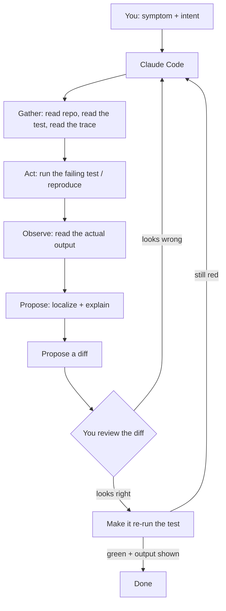
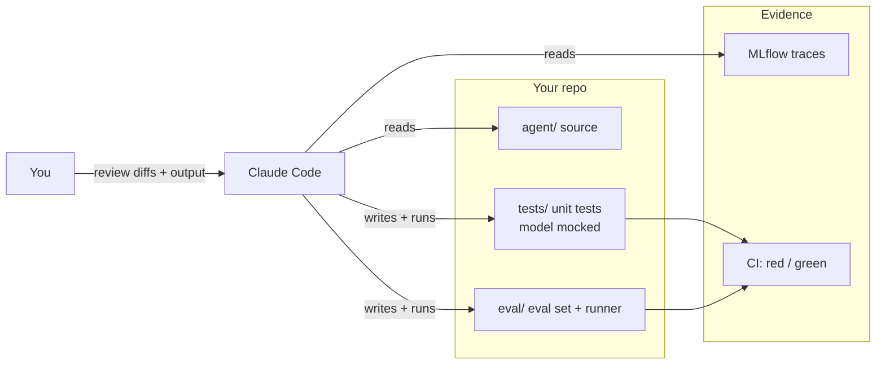

# Debugging & Testing with Claude Code

> Think of Claude Code here as a tireless junior engineer who will run the failing test a
> hundred times without complaint and narrate exactly what it saw each time — the stack
> trace, the assertion, the value that came back wrong. It never gets bored, never skims
> the output, never says "it works on my machine." But it also never ships anything you
> haven't read. Your job shifts from *typing the fix* to *directing the hunt and reviewing
> the diff.*

You already know how to [build a Databricks App with Claude Code](/agentic-coding/claude-code/build-a-databricks-app)
— describe intent, review the diff, let it act. This lesson turns that same rhythm onto
the least glamorous, highest-value work in an AI codebase: **finding out why something is
broken, proving it, and keeping it from breaking again.**

There's an important distinction from the VS Code track. The
[VS Code debugging & testing lesson](/agentic-coding/vscode/debugging-and-testing) taught
you the *tools* — breakpoints, `pytest`, the test explorer, the debugger. This lesson is
about using Claude Code *as a debugging and testing partner* on top of those tools. The
debugger is the microscope; Claude Code is the lab assistant who knows how to use it, runs
the experiment, and writes up what it saw. You still read the write-up.

## Learning Objectives

By the end of this page, you will be able to:

- Hand Claude Code a **failing test or a stack trace** and have it reproduce, localize, and propose a fix — reading the repo and running the test itself.
- Prompt it to write **pytest unit tests** for your tools and pure functions.
- Write tests that **mock the LLM call** so your suite is fast, cheap, and deterministic.
- Generate a small **eval set** and run a local eval to catch quality regressions, not just crashes.
- Feed an **MLflow trace** back to Claude Code so it can explain a wrong tool call.
- Practice **verify-don't-trust**: make the assistant run the test and show output, not merely claim success.

## Prerequisites

- You've done the [end-to-end App build](/agentic-coding/claude-code/build-a-databricks-app) and know the plan → review → act → verify loop.
- You're comfortable with the underlying tools from the [VS Code debugging & testing lesson](/agentic-coding/vscode/debugging-and-testing) (`pytest`, the debugger, the test explorer).
- Helpful background: [MLflow Tracing](/docs/tracing/mlflow-tracing), [Instrumenting Agents](/docs/tracing/instrumenting-agents), and [Why Evaluation Is Hard](/docs/evaluation/why-eval-is-hard).

## Estimated Reading Time

About 25 minutes, plus time to try a prompt or two against your own repo. Debugging is a
skill you build by doing — read once, then keep this open the next time a test goes red.

## Business Motivation

Maya's `northwind-advisor` agent has been live for a week. Advisors love it — until one
files a ticket: *"I asked for the balance on account 42 and it quoted me a policy about
overdraft fees instead."* The agent answered confidently. It was confidently wrong.

This is the nightmare case for a financial-services firm. It's not a crash — crashes are
easy, they leave a stack trace. This is a *behavioral* bug: the agent picked the wrong
tool. `policy_search` fired when `account_lookup` should have. Nothing threw an exception.
The logs just show a plausible-looking answer that happens to be useless.

Maya has two problems, and Claude Code helps with both:

1. **Diagnose this one incident.** Why did the model choose `policy_search`? Was it the
   prompt, the tool description, the routing logic?
2. **Prevent the class of bug.** Build tests and evals so the next time a tool-selection
   regression sneaks in, it turns a build red *before* an advisor ever sees it.

The payoff isn't "the AI writes my tests for me." It's that the boring, essential safety
net — reproduction, unit tests, mocked LLM tests, an eval set — gets built in an afternoon
instead of never. And "never" is the honest default for tests in most AI projects.

## Intuition

Debugging with Claude Code is the agentic loop you already know, pointed at a defect. You
supply the symptom; it runs the experiment and reports; you judge the report.



*Diagram 1: The debugging loop. Notice the two human gates — reviewing the proposed diff,
and confirming the re-run actually went green with visible output. The assistant does the
legwork; you keep the judgment.*

The single most important habit lives in that last box: **the loop isn't closed until you
have seen real output**, not a sentence that says "the fix works." An agent that never
ran the test can still cheerfully tell you it passes.

## Core Concepts

A few ideas do most of the work in this lesson.

**Reproduce before you fix.** A bug you can't reproduce is a rumor. The first thing to ask
Claude Code for is not a fix but a *reliable reproduction* — a command or a failing test
that goes red every time. Everything downstream depends on it.

**Localize, then change.** "Somewhere in the routing code" is not a diagnosis. Push the
assistant to name the file, the function, and the line, and to explain *why* that line
produces the symptom. A fix without a stated cause is a guess.

**Two kinds of failure, two kinds of test.** In AI systems you fight both:

- **Crashes / wrong values** — a tool returns `None`, a parser throws, a schema mismatch. Deterministic. A normal **unit test** catches these.
- **Wrong behavior** — the model chose a bad tool, or the answer is subtly off. Non-deterministic. This is what **evals** are for, and why [evaluation is genuinely hard](/docs/evaluation/why-eval-is-hard).

**Mock the model in unit tests.** Real LLM calls are slow, cost money, and give different
answers every run — poison for a test suite. For unit tests, you replace the model call
with a canned response so the test is fast and deterministic. You test *your code around
the model*, not the model itself.

**Traces are the debugger for behavior.** When there's no stack trace because nothing
crashed, an [MLflow trace](/docs/tracing/mlflow-tracing) is your evidence: every step,
every tool call, every input and output the agent produced. It's the "what did it actually
see and do" that behavioral bugs demand.

## Deep Dive

### Giving Claude Code a failing test or a stack trace

The strongest opening move is to hand over the raw evidence and let the assistant drive.
Paste the stack trace, or point at the failing test, and ask it to reproduce first.

```text
The test tests/test_router.py::test_balance_question_routes_to_account_lookup
is failing in CI. Reproduce it locally first — run just that test and show me the
full output. Don't fix anything yet. Once it's red, tell me which file and function
decide the routing, and your best hypothesis for why the wrong tool is chosen.
```

Notice what this prompt does. It forbids a premature fix. It demands the assistant *run*
the test and *show* output. And it asks for localization plus a hypothesis — a diagnosis,
not a patch. This is you directing the hunt.

Claude Code will typically: glob for the test, run `pytest` on that node id, read the
traceback or assertion, then read `router.py` and the tool descriptions it references, and
come back with something like *"`route()` in `agent/router.py:38` ranks tools by
description similarity; `policy_search`'s description mentions 'balance' in an example, so
a balance question scores it above `account_lookup`."* Now you have a cause you can judge.

### Writing pytest unit tests by prompt

Pure functions and tools are the easiest, highest-return things to test, and Claude Code
is genuinely good at it because the behavior is deterministic and the assistant can *run*
what it writes.

```text
Write pytest unit tests for parse_account_id() in agent/tools.py. Cover: a valid
"account 42" string, a missing id, extra whitespace, and a non-numeric id. Put them
in tests/test_tools.py, then run the file and show me the results. If any test
fails, tell me whether the bug is in the test or in parse_account_id — don't
"fix" the function to make a bad test pass.
```

That last clause matters. A common failure mode is the assistant "fixing" correct code to
satisfy a test it wrote wrong — or vice versa. Making it *state* which side is wrong forces
a decision you can veto.

### Testing code that calls an LLM — mock the model

Here's the technique that makes an AI test suite usable. Your router calls a model to pick
a tool. You don't want the real model in a unit test. You **mock** it — swap in a fake that
returns a fixed response — so the test exercises *your* logic deterministically.

```python
# tests/test_router.py
from unittest.mock import patch
from agent.router import route

def test_balance_question_routes_to_account_lookup():
    # Pretend the model replied by choosing account_lookup.
    fake_response = {"tool": "account_lookup", "args": {"account_id": 42}}

    # Patch the model call so no real request goes out.
    with patch("agent.router.call_model", return_value=fake_response) as m:
        decision = route("what's the balance on account 42?")

    assert decision.tool == "account_lookup"
    m.assert_called_once()   # we actually invoked the model layer
```

The test is now fast (no network), free (no tokens), and deterministic (same result every
run). You've isolated the question "does my routing code do the right thing *given* a model
response?" from the separate, harder question "does the model return a good response?" —
which is an **eval**, not a unit test.

:::tip
A good prompt here is: *"Rewrite these router tests to mock the model call with
`unittest.mock.patch` so they don't hit the network. Keep one test per routing decision,
and show me the run."* Then read the diff: confirm the patch target is the real call site
and the assertions check behavior, not the mock.
:::

### Generating an eval set and running a small local eval

Unit tests prove the plumbing. **Evals** prove the *behavior* — and behavioral regressions
(like Maya's wrong-tool bug) are exactly what unit tests miss. An eval set is a collection
of inputs paired with what a good outcome looks like. For Maya's router, each row is a
question plus the tool that *should* fire.

```text
Create tests/eval/router_cases.jsonl with 15 realistic advisor questions. For each,
include the expected tool (account_lookup, policy_search, or transactions_genie).
Include a few tricky ones that mention "balance" and "policy" in the same sentence.
Then write a small script eval/run_router_eval.py that runs route() on each case and
prints a pass/fail table plus the accuracy. Run it and show me the table.
```

You'll get a table like "13/15 correct" with the two failures named. That's a regression
signal you can put in front of a build. Keep the concepts straight by reading the Databricks
tracks — [building good evaluation datasets](/docs/evaluation/evaluation-datasets) and
[why evaluation is hard](/docs/evaluation/why-eval-is-hard) — because a sloppy eval set is
worse than none: it gives false confidence.

:::note
On Databricks you'd typically run this through **MLflow evaluation** against a logged
model, so results are tracked over time. Locally, a plain script is a fine first step —
the concepts are identical, and they're [portable off Databricks too](/docs/evaluation/why-eval-is-hard).
Verify the current MLflow eval API in the docs; it evolves.
:::

### Feeding a trace back to Claude Code

When nothing crashed but the answer was wrong, the [MLflow trace](/docs/tracing/mlflow-tracing)
is the evidence. It records every span: the prompt the model saw, the tool it chose, the
arguments, the result. [Instrument your agent](/docs/tracing/instrumenting-agents) once and
every run leaves this paper trail.

The move is to give Claude Code the trace and ask it to explain the divergence.

```text
Here's the MLflow trace for the failing advisor session (traces/advisor_42.json).
Walk through the spans and tell me exactly where it went wrong: which tool was
chosen, what the model saw that made it choose that, and what the correct tool was.
Then point at the code or the tool description responsible. Don't change anything yet.
```

Claude Code reads the trace as structured evidence — the same way you'd read a stack trace,
but for behavior. It might report: *"Span 3 shows the model chose `policy_search`. Its tool
description reads 'answers questions about balances, fees, and policies' — the word
'balances' is pulling balance questions here. `account_lookup`'s description doesn't mention
'balance' at all."* Now the fix is obvious and *small*: tighten the tool descriptions. That's
the [MCP lesson's](/docs/agents-tools-mcp/mcp) point made painfully concrete — the
description *is* the interface, and a vague one causes wrong tool calls.

## Architecture

Here's how the pieces fit around your repo when Claude Code is your debugging partner.



*Diagram 2: Claude Code reads your source and your traces, writes and runs your tests and
evals, and you gate everything by reviewing diffs and the actual run output. Unit tests
(with the model mocked) and evals both feed CI, so regressions turn a build red before a
user sees them.*

The important structural choice: **unit tests and evals are separate suites.** Unit tests
are fast and run on every commit; evals may hit a real model and run less often (nightly,
or pre-release). Don't let a slow, non-deterministic eval infect your fast feedback loop.

## Step-by-Step Walkthrough

How Maya actually chases down the wrong-tool bug, start to finish:

1. **Capture the evidence.** She grabs the MLflow trace for the bad session and the ticket description. No code changes yet.
2. **Reproduce.** She asks Claude Code to write a failing test that encodes the bug: "balance on account 42" *should* route to `account_lookup`. It runs red — good, the bug is now reproducible on demand.
3. **Localize with the trace.** She feeds the trace in and gets the diagnosis: `policy_search`'s description mentions "balances," out-scoring `account_lookup`.
4. **Review the proposed fix.** Claude Code proposes tightening both tool descriptions. She reads the diff — it's four lines, no logic change. She approves it.
5. **Verify, don't trust.** She makes it re-run the reproduction test *and* the full router eval, showing output. The reproduction goes green; the eval improves from 13/15 to 15/15.
6. **Lock it in.** The reproduction test stays in the suite forever. The eval runs in the nightly build. This exact regression can never ship silently again.

The whole thing is an afternoon. The reproduction test is the durable artifact — it
outlives the incident.

## Hands-on Examples

Three prompts you can adapt today, each paired with the kind of output you'd review.

**1 — Reproduce and localize from a stack trace.**

```text
This traceback came from prod (pasted below). Reproduce it in a test under
tests/, run it to confirm it's red, then localize the cause. Explain before fixing.

TypeError: unsupported operand type(s) for +: 'NoneType' and 'int'
  File "agent/tools.py", line 51, in account_summary
    return balance + pending
```

*What you review:* a new failing test, plus a diagnosis like *"`get_pending()` returns
`None` when there are no pending transactions; line 51 assumes an int."* Read whether the
proposed fix defaults to `0` (correct) or silently swallows a real error (not correct).

**2 — Unit tests with the model mocked.**

```text
Add unit tests for the agent's tool-dispatch layer in agent/dispatch.py. Mock the
model call so nothing hits the network. Cover: a valid tool name, an unknown tool
name, and malformed arguments. Run them and show the output.
```

*What you review:* the diff. Confirm `patch()` targets the real call site (a wrong patch
target makes a test that passes while testing nothing), and that assertions check
behavior, not the mock's own return value.

**3 — Explain a wrong tool call from a trace.**

```text
Compare traces/good_session.json (answered correctly) with traces/bad_session.json
(wrong tool). What differs in the model's inputs that led to the different choice?
Give me the smallest change that fixes the bad case without breaking the good one.
```

*What you review:* the explanation and the "smallest change" claim. Then make it *run the
eval* to prove the good case still passes. A fix that repairs one case and breaks two isn't
a fix.

:::warning[Verify, don't trust]
The failure mode to guard against is a confident *"All tests pass!"* with no visible run.
If you didn't see the green output, it didn't happen. Always end a debugging session with
"run it and show me the output." Better yet, put it in your `CLAUDE.md`:
*"After changing code, always run the affected tests and paste the output."*
:::

## Production Considerations

- **Put the reproduction in the suite, permanently.** Every bug you fix should leave behind a test that would have caught it. This is how a codebase gets safer over time instead of accumulating scar tissue.
- **Wire tests into CI.** A green local run means nothing if CI doesn't enforce it. Have Claude Code add the test command to your CI config, then confirm the build actually fails when a test fails.
- **Separate fast and slow suites.** Unit tests (mocked, deterministic) on every commit; evals (real model, non-deterministic) nightly or pre-release. Don't block a two-second feedback loop on a two-minute eval.
- **Track evals over time.** A single eval score is a snapshot; a *trend* is a signal. On Databricks, log eval runs to MLflow so you can see quality drift across model or prompt changes.
- **Keep traces on in staging.** [Instrumenting your agent](/docs/tracing/instrumenting-agents) costs little and turns every weird incident into evidence you can hand to Claude Code instead of a guessing game.

## Team & Collaboration Considerations

- **Reproduction tests are shared knowledge.** A test named `test_balance_question_routes_to_account_lookup` documents an incident better than any wiki page — and it's executable. New teammates learn the system's sharp edges by reading the tests.
- **Commit `CLAUDE.md` debugging conventions.** "Reproduce before fixing," "mock the model in unit tests," "always show test output" — put these in the project `CLAUDE.md` so every teammate's Claude Code follows the same discipline. It's loaded every session and shared via git.
- **Review the diff, not the vibe.** In code review, an AI-assisted fix gets the same scrutiny as any other. The reviewer reads the diff and asks for the run output. "Claude wrote it" is not a review.
- **Share the eval set.** An eval set is a team asset. Keep it in the repo, grow it with each incident, and treat a dropped eval score like a broken build.

## Security Considerations

- **Don't put real customer data in tests or eval sets.** Maya's cases use synthetic account ids and fabricated questions. A test file with real balances is a data leak waiting to happen — it lives in git forever. Tell Claude Code explicitly to use synthetic data.
- **Scrub traces before sharing them.** An MLflow trace can contain real prompts and results. Before pasting a trace to debug, confirm it's from a test session or has been redacted. Add a `CLAUDE.md` rule: *"Never include PII in test fixtures or committed traces."*
- **Mocked tests never call out.** A properly mocked unit test makes zero network calls — which also means zero credential use and zero data egress. That's a security feature, not just a speed one. Verify the mock actually prevents the call (`assert_not_called` on the network layer where appropriate).
- **Keep secrets out of fixtures.** No API keys or tokens in test files. Use the same secret-management path as production, even in tests.

## Common Mistakes

- **Fixing before reproducing.** If you can't make it fail on demand, you can't know you fixed it. Always get to red first.
- **Trusting "it passes" without output.** The number-one AI-assisted debugging trap. Demand the run.
- **Unit tests that call the real model.** Slow, flaky, expensive, and they test the model instead of your code. Mock it.
- **Mocking at the wrong layer.** A `patch()` on the wrong target makes a test that always passes while exercising nothing. Read the patch target in the diff.
- **Treating a passing unit suite as "quality assured."** Unit tests catch crashes, not bad answers. Wrong-tool and wrong-answer bugs need evals.
- **Letting the assistant "fix" correct code to satisfy a bad test.** Make it state which side is wrong before it changes anything.
- **A one-time eval.** An eval run once and forgotten catches nothing. Wire it into a schedule.

## Best Practices

- **Reproduce → localize → fix → verify → lock in.** Follow the loop every time. The lock-in step (a permanent test) is what compounds.
- **Ask for a diagnosis, not just a patch.** "Explain why before fixing" produces better fixes and teaches you the system.
- **Mock the model in unit tests; use the real one only in evals.** Two suites, two purposes.
- **End every session with visible output.** "Run it and show me." Put it in `CLAUDE.md`.
- **Grow the eval set with every incident.** Each production surprise becomes a new eval row.
- **Use traces as your behavioral debugger.** No stack trace? Reach for the [MLflow trace](/docs/tracing/mlflow-tracing).
- **Keep the human gate on diffs.** You read every change. That's the whole safety model.

## Interview Questions

1. **Why mock the LLM call in a unit test, and what are you actually testing when you do?**
   Look for: real calls are slow, costly, and non-deterministic, which breaks a test suite. Mocking makes tests fast and repeatable and isolates *your* code (parsing, routing, dispatch) from the model's quality — which is a separate concern tested by evals.

2. **An agent gave a wrong answer but nothing crashed. How do you debug it with Claude Code?**
   Look for: there's no stack trace, so you reach for an MLflow trace as evidence; feed the trace to Claude Code to identify which tool was chosen and why (what the model saw); localize to code or a tool description; propose a small fix; verify against an eval so you don't break other cases.

3. **What's the difference between a unit test and an eval for an AI system, and why do you need both?**
   Look for: unit tests catch deterministic failures (crashes, wrong values) with the model mocked; evals catch behavioral/quality regressions (wrong tool, poor answer) using a dataset of inputs and expected outcomes. Unit tests miss quality bugs; evals are slower and noisier. You separate the suites.

4. **What does "verify, don't trust" mean when pairing with a coding agent, and how do you enforce it?**
   Look for: never accept a claim of success without seeing the actual test output; make the agent run the test and paste results; encode it as a `CLAUDE.md` convention. An agent that never ran the test can still say it passed.

5. **You fixed a bug. What should you leave behind so it can't silently return?**
   Look for: a reproduction test committed to the suite and wired into CI, so the exact failure turns a build red. Bonus: an eval row if the bug was behavioral, and a trend tracked over time.

6. **How do you keep a debugging workflow from leaking sensitive data?**
   Look for: synthetic data in tests and eval sets, scrubbing/redacting traces before sharing, no secrets in fixtures, and a `CLAUDE.md` rule forbidding PII in committed files. Note that properly mocked tests also make no network calls.

## Quiz

**Q1.** Why should you ask Claude Code to *reproduce* a bug before proposing a fix?

<details>
<summary>Show answer</summary>

Because a bug you can't reproduce on demand is a rumor — you can't confirm a fix actually
worked. A reliable red test (or command) is the ground truth the whole loop depends on, and
it becomes a permanent regression guard once the bug is fixed.

</details>

**Q2.** You're writing a unit test for a function that calls an LLM to classify text. What
do you do about the model call, and why?

<details>
<summary>Show answer</summary>

**Mock it** — swap in a fixed, canned response so no real request goes out. This makes the
test fast, free, and deterministic, and isolates *your* code from the model's variability.
Whether the model classifies *well* is a separate question answered by an **eval**, not a
unit test.

</details>

**Q3.** An advisor got a wrong answer but there's no exception in the logs. What's your
primary piece of evidence, and how does Claude Code use it?

<details>
<summary>Show answer</summary>

An **MLflow trace** of the session — every span, tool call, input, and output. You feed the
trace to Claude Code, which reads it like a stack trace for behavior: it identifies which
tool was chosen, what the model saw that drove the choice, and points at the code or tool
description responsible. Then you fix and verify against an eval.

</details>

**Q4.** What's the single habit that most reduces the risk of a coding agent's fix?

<details>
<summary>Show answer</summary>

**Verify, don't trust** — make it run the affected test and show you the actual output,
rather than accepting a "tests pass" claim. Pair it with reviewing every diff. If you
didn't see the green output, treat it as unverified.

</details>

## Summary

Claude Code turns the unglamorous safety work of an AI codebase — reproduction, unit tests,
mocked-model tests, eval sets, trace analysis — from "someday" into "this afternoon." The
workflow is the agentic loop you already know, aimed at a defect: you supply the symptom
and the intent, it reads the repo, runs the failing test, reads the output, localizes the
cause, and proposes a diff. You review the diff and confirm the re-run went green with
*visible output*.

The two-test discipline is the backbone: **unit tests** (with the model mocked) catch
deterministic crashes fast on every commit; **evals** catch behavioral regressions like
Maya's wrong-tool bug, using a dataset of inputs and expected outcomes. When nothing
crashed, an **MLflow trace** is your behavioral debugger — hand it to Claude Code to explain
*why* the model chose wrong. Through all of it, the human gate never moves: you read every
change, and nothing is "done" until you've seen the test run.

## Key Takeaways

- Hand over the **raw evidence** (failing test, stack trace, or trace) and make Claude Code **reproduce before fixing**.
- Push for **localization and a stated cause**, not just a patch.
- **Mock the LLM** in unit tests so they're fast, free, and deterministic; test the model's *quality* separately with **evals**.
- Keep **unit and eval suites separate** — fast on every commit, slow on a schedule.
- Use **MLflow traces** to debug behavioral bugs that leave no stack trace.
- **Verify, don't trust:** always make it run the test and show output; encode the rule in `CLAUDE.md`.
- Every fix leaves a **permanent reproduction test** wired into CI. That's how the codebase gets safer over time.

## Glossary

- **Reproduction:** A reliable way (a command or a failing test) to make a bug appear on demand — the prerequisite for confirming any fix.
- **Localization:** Naming the exact file, function, and line responsible for a symptom, with a reason.
- **Unit test:** A fast, deterministic test of a small piece of code in isolation; for AI code, the model call is typically mocked.
- **Mock:** A stand-in that replaces a real dependency (like the LLM call) with a fixed response, so a test is fast, deterministic, and offline.
- **Eval:** An evaluation of *behavior/quality* over a dataset of inputs paired with expected outcomes; catches wrong-tool and wrong-answer regressions that unit tests miss.
- **Eval set:** The dataset of cases (input + expected outcome) an eval runs against.
- **MLflow trace:** A recorded, span-by-span log of an agent run — prompts, tool calls, arguments, results — used as evidence for behavioral debugging.
- **Verify-don't-trust:** The discipline of confirming success by observing real test output rather than accepting a claim.

## Further Reading

- [pytest documentation](https://docs.pytest.org/) — fixtures, parametrization, and mocking patterns.
- [Claude Code documentation](https://docs.claude.com/en/docs/claude-code) — current commands, flags, and configuration.

## Next Lesson

You can now find bugs, prove them, and keep them fixed. Next, scale that discipline up to
larger, riskier changes — refactors and migrations that touch many files — without losing
the plot or the safety net.

➡️ [Driving Multi-Step Changes Safely](/agentic-coding/claude-code/safe-multi-step-changes)
