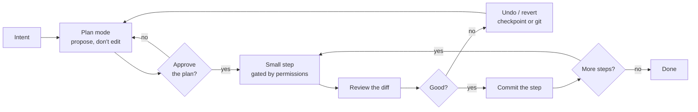
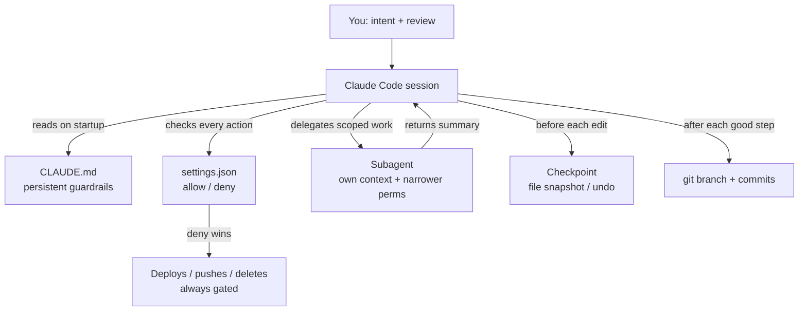

# Driving Multi-Step Changes Safely

> Picture a full-size excavator on a job site. In skilled hands it moves in an afternoon
> what a crew with shovels would take a week to dig. That leverage is exactly why nobody
> lets it swing freely. There are painted lines on the ground, an operator watching the
> arc of the bucket, and a kill switch within reach. The machine is powerful *because* it
> is constrained — the constraints are what make the power usable near gas lines and
> foundations. Claude Code on a big refactor is that excavator. This lesson is about the
> painted lines, the operator's eye, and the kill switch.

You already know how to [build a small app with Claude Code](/agentic-coding/claude-code/build-a-databricks-app):
describe intent, review the diff, let it act. That rhythm is forgiving when the change is
one feature in a fresh repo. It gets unforgiving fast when the change is a **repo-wide
refactor, a framework migration, or a multi-file feature** that touches thirty files and a
deploy config.

The agentic loop does not change — gather context, act, verify, repeat. What changes is the
*cost of a mistake*. A wrong edit in a scratch app is an annoyance. A wrong edit that
sprawls across a production ETL package, or a single unwanted `rm -rf`, is a bad afternoon.
So this lesson is not about making Claude Code more powerful. It is about the **control
discipline** that lets you use the power it already has on changes that matter.

## Learning Objectives

By the end of this page, you will be able to:

- Explain **why big agentic changes go wrong** without guardrails — sprawling diffs, silent scope creep, and the occasional destructive command.
- Use **plan mode** as your primary control: get a proposal before any edit, and approve it.
- **Break work into small, verifiable steps** so each one is easy to review and easy to undo.
- **Review a diff well** — know what to actually look for beyond "does it compile."
- Configure the **permission model**: modes via Shift+Tab, and `allow`/`deny` arrays in `settings.json`, keeping writes and deploys gated.
- Rely on **checkpoints and undo** plus git branches/commits so every step is cheap to recover.
- Delegate scoped or parallel work to **subagents** with their own context and restricted permissions.
- Write **CLAUDE.md guardrails** that persist across sessions — and know when to stop and take the wheel yourself.

## Prerequisites

This lesson builds directly on:

- [Build a Databricks App with Claude Code](/agentic-coding/claude-code/build-a-databricks-app) — the describe-review-act rhythm this lesson scales up. **Read this first.**
- [What Is Claude Code](/agentic-coding/claude-code/what-is-claude-code) — the agentic loop, permission modes, and CLAUDE.md at a basic level.
- [The Repo-First Project](/agentic-coding/vscode/repo-first-project) — why a clean git repo is the substrate that makes any of this recoverable.

If you have shipped even one change with Claude Code and reviewed the diff, you are ready.

## Estimated Reading Time

About 25 to 30 minutes. There is nothing to install; you can try the settings and commands
in any repo you already have.

## Business Motivation

Maya, a data engineer at **Northwind Trust**, has drawn a job nobody enjoys. The firm's
feature-engineering package, `nw_features`, grew organically over three years. It reads and
writes tables with hardcoded catalog names (`prod.risk.*`) scattered across forty modules.
Compliance now requires every table reference to route through a config object so the same
code can run against `dev`, `staging`, and `prod` targets. It is a mechanical change — and a
huge one. Forty files, hundreds of call sites, and a test suite that must stay green.

This is precisely the kind of task where Claude Code shines and where it can hurt you. The
upside: it can find every call site faster than grep-by-hand, apply a consistent
transformation, and run the tests after each batch. The downside, if Maya just says "fix all
the catalog references" and walks away:

- **A sprawling diff.** Claude Code touches forty files in one turn. Maya faces a 1,200-line diff with no way to tell the mechanical change from the three places where it guessed wrong.
- **Silent scope creep.** While in those files, it "helpfully" reformats imports, renames a variable it found confusing, and upgrades a deprecated call. None of that was the task. All of it is now in the diff.
- **An unwanted destructive command.** To "clean up," it runs `git checkout .` on a file with uncommitted work, or drops a scratch table it assumed was disposable.

None of these are the model being reckless. They are the natural result of handing a powerful
tool an unbounded task with no lines painted on the ground. Maya's job is to paint the lines
*before* the bucket swings. Done right, the same refactor becomes a sequence of small,
reviewed, reversible steps — and it ships in a day instead of a nervous week.

## Intuition

The core intuition: **the safety of a big change is set before the first edit, not after.**
Your leverage points, in order of power, are plan → permissions → small steps → review →
recover.



*Diagram 1: The control loop for a large change. Plan mode is the gate before anything is written; permissions gate what each step may touch; the diff review gate decides whether a step is kept; and checkpoints plus git make "no" cheap. Notice there are four gates before a change becomes permanent.*

Every one of those gates exists so that a mistake is caught while it is small and cheap. A
plan you disagree with costs you a sentence to redirect. A bad edit you catch in review costs
you an undo. A bad edit you catch in production costs you a rollback and an incident review.
The whole discipline is about **moving the catch as early as possible.**

## Theory

Four ideas do most of the work. Each maps to a gate in Diagram 1.

**1. Plan before edit.** Plan mode is a permission mode in which Claude Code may read, search,
and reason, but **may not write files or run mutating commands.** It produces a proposal — the
files it intends to change, the approach, the order — and stops. You approve, refine, or reject
*before* a single byte is written. This is the single highest-leverage control you have, because
it moves the catch to before the work.

**2. Least privilege, always.** Claude Code's permission system decides what it may do without
asking. The default is conservative: reads and obviously-safe commands (`ls`, `cat`, `pwd`) run
freely; edits and bash commands prompt for approval. You tune this two ways — **modes** you cycle
live with `Shift+Tab`, and **`allow`/`deny` rules** in `settings.json` that persist. The goal is
never "stop asking me"; it is "auto-approve the boring safe things, and *always* gate the
dangerous ones."

**3. Small, verifiable steps.** A change you can review is a change small enough to hold in your
head. Forty files at once is not reviewable; four files with a passing test suite is. Breaking the
refactor into batches — and committing after each — turns one terrifying diff into ten boring ones.

**4. Cheap recovery.** Claude Code snapshots your files before it edits, so you can undo. Git gives
you a second, durable layer: a branch to contain the work and a commit after each good step. When
both are in place, "that step went wrong" is a five-second fix, not a salvage operation.

:::note The permission modes, briefly
Cycle them live with `Shift+Tab`. Roughly: **plan** (explore, no writes), **default/manual** (ask
before edits and bash), **accept-edits** (auto-apply edits and safe file ops, still gate risky
bash), plus an **auto** mode for trusted flows. Reads and safe bash never prompt. Exact names and
behavior evolve — confirm in the [Claude Code docs](https://docs.claude.com/en/docs/claude-code).
:::

## Deep Dive

Let's go past the definitions into how each control actually behaves on a real refactor.

### Plan mode is a conversation, not a checkbox

The value of plan mode is not the plan document — it is the *argument you have with it before any
harm is possible.* When Maya asks for the catalog refactor in plan mode, Claude Code comes back
with something like: "I'll introduce a `TableConfig` object in `nw_features/config.py`, then update
call sites in batches by module, running `pytest` after each batch." Now Maya can catch the design
before it exists. Maybe she wants the config read from an environment variable, not a constructor
argument. She says so, the plan updates, and *only then* does editing begin. The cheapest bug to
fix is the one that was never written.

### Diffs are how you keep scope honest

Scope creep is the quiet killer of large agentic changes. The defense is a disciplined diff review
after every step. When you read a diff, look for:

- **Changes outside the stated scope.** A reformatted import block, a renamed local, a "while I was here" upgrade. These are not free — they inflate the diff and hide the real change. Reject them or ask for them separately.
- **Deletions and moves.** Additions are usually safe to skim; deletions and file moves deserve a line-by-line read. A deleted branch of logic is where behavior silently changes.
- **Guessed values.** In a mechanical refactor, most changes are identical. The three that differ — where the model guessed a catalog name or an edge case — are the ones that bite. Diffs make outliers visible; hunt for them.
- **Anything touching secrets, auth, or deploy config.** `databricks.yml`, a token, a connection string. Read these character by character.
- **Test changes you didn't ask for.** A test that was edited to pass is worse than a failing test. Confirm tests were made *correct*, not made *green*.

### The permission model, concretely

Modes are for the *session*; `settings.json` is for the *repo and you*. The `permissions` object
holds `allow` and `deny` arrays of tool rules. `deny` always wins over `allow`. This is where you
encode "these commands never need my attention" and, more importantly, "these commands must *always*
stop, no matter what mode I'm in." A `deny` rule on `git push` or `databricks bundle deploy` means
that even in accept-edits mode, a deploy cannot happen without you. That is your kill switch, written
down.

### Subagents contain blast radius

For a scoped or parallel piece of work, a **subagent** runs in its own context window, with its own
(often narrower) permissions, and returns a summary rather than dumping its whole transcript into
your main session. On Maya's refactor, a "find every hardcoded catalog reference and list them"
subagent can be given read-only permissions — it *cannot* edit even if it wanted to — and it hands
back a clean inventory without cluttering the main thread. Subagents are both a focus tool and a
safety tool: a read-only researcher simply has no power to break anything.

## Architecture

Here is how the pieces fit together around a single repo.



*Diagram 2: The safety net around a large change. CLAUDE.md and settings.json are the persistent layer (they apply every session); checkpoints and git are the recovery layer; subagents are the containment layer. You sit at the top supplying intent and reviewing output. No single mechanism is the whole net — they overlap on purpose.*

The layers overlap deliberately. If a `deny` rule is missing, plan mode still catches an unexpected
deploy in the proposal. If you approve a bad edit anyway, the checkpoint undoes it. If you miss it in
review, the git commit boundary limits how far it spread. Defense in depth means no single lapse is
fatal.

## Step-by-Step Walkthrough

Here is Maya running the `nw_features` catalog refactor end to end.

1. **Set the stage in git.** She creates a branch: `git switch -c refactor/table-config`. The main
   branch stays clean; everything the agent does is contained and, at worst, thrown away with a
   branch delete.
2. **Write the guardrails down.** She adds a few lines to `CLAUDE.md` (see below) so the rules survive
   compaction and future sessions.
3. **Start in plan mode.** `Shift+Tab` to plan mode. She describes the goal: route all table
   references through a `TableConfig`, target by module, tests green after each batch.
4. **Argue with the plan.** Claude Code proposes the approach. Maya corrects one thing — config comes
   from an env var — and approves.
5. **Delegate the inventory to a subagent.** A read-only subagent lists every hardcoded reference and
   which module it lives in. Maya now has a checklist and a sense of size.
6. **Work one batch, then stop.** She lets it refactor the first module, run `pytest` on that module,
   and report. Small diff, one module, tests green.
7. **Review the diff.** She reads it against the checklist from the Deep Dive. One catalog name was
   guessed wrong; she flags it, it's fixed.
8. **Commit the step.** `git commit -m "route module X through TableConfig"`. That step is now durable
   and recoverable.
9. **Repeat batches 2..N.** Same rhythm. If a batch goes sideways, Esc-twice to undo the edits or
   `git restore` to the last commit — cheap either way.
10. **Take the wheel when it stalls.** One module has genuinely tricky dynamic table names. Claude Code
    keeps guessing. Maya stops delegating, edits those three files herself, and moves on. Knowing when
    to drive manually is part of the discipline.

## Hands-on Examples

**A `settings.json` permissions block for a refactor.** Allow the safe, repetitive commands so you
aren't clicking "approve" on every `pytest` run; deny the ones that must never happen unattended.

```json
{
  "permissions": {
    "allow": [
      "Bash(pytest*)",
      "Bash(ruff*)",
      "Bash(git status)",
      "Bash(git diff*)",
      "Bash(git add*)",
      "Bash(git commit*)",
      "Bash(git switch*)",
      "Read(*)",
      "Edit(nw_features/**)"
    ],
    "deny": [
      "Bash(git push*)",
      "Bash(git reset --hard*)",
      "Bash(rm -rf*)",
      "Bash(databricks bundle deploy*)",
      "Bash(databricks * delete*)",
      "Edit(databricks.yml)",
      "Edit(.github/workflows/**)"
    ]
  }
}
```

The shape is what matters, not the exact tool-rule syntax — **verify the current pattern-matching
syntax in the [Claude Code docs](https://docs.claude.com/en/docs/claude-code)**, since it evolves.
Read the intent: editing lives inside `nw_features/`; the deploy config and CI workflows are edit-denied;
pushing, hard resets, recursive deletes, and any deploy or delete are denied outright. Even in
accept-edits mode, that deploy cannot fire without Maya. `deny` beats `allow`, so a broad `Read(*)`
allow never overrides a specific deny.

:::tip Put the gitignored file to work
`.claude/settings.local.json` is gitignored — use it for your *personal* allow-list (the commands you
trust on your machine) and keep `.claude/settings.json` for the team-wide rules, especially the `deny`
list, which you *want* committed so everyone shares the same kill switch.
:::

**A CLAUDE.md guardrail block.** These lines load every session, so the rules outlive any single chat.

```markdown
## Guardrails for refactors (read every session)

- NEVER run `databricks bundle deploy` or any deploy/push. Deploys are human-only.
- Work in small batches: one module at a time, run `pytest` for that module, then STOP for review.
- Do NOT reformat, rename, or "clean up" code outside the stated task. Keep diffs minimal.
- Before editing, confirm the current git branch is a feature branch, not `main`.
- If a table name or edge case is ambiguous, ASK — do not guess.
```

**Invoking plan mode and a scoped subagent (conceptual).**

```bash
# In-session: cycle to plan mode with Shift+Tab, then describe the goal.
# Or use the built-in slash command:
/plan Route all hardcoded catalog references in nw_features through a TableConfig object,
      one module per batch, running pytest after each. Do not edit deploy config.
```

```markdown
<!-- .claude/agents/reference-finder.md — a read-only inventory subagent -->
---
description: Finds hardcoded catalog/table references. Read-only.
tools: Read, Grep, Glob
---
List every hardcoded `catalog.schema.table` reference under nw_features/, grouped by module.
Return a table of file, line, and the reference. Do not modify anything.
```

Note the subagent's `tools` list has **no Edit and no Bash** — it is structurally incapable of changing
files. Exact subagent front-matter fields evolve; confirm in the docs.

## Production Considerations

- **A big change belongs on a branch, always.** Never let an agent refactor directly on `main`. The
  branch is free and makes the entire experiment disposable. This connects straight to your delivery
  pipeline — see [CI/CD and Rollback](/docs/llmops/cicd-and-rollback) for how those commits become a
  reviewable PR and a rollback point.
- **Commit at every green step.** Each commit is both a checkpoint and a story. If step 6 introduced a
  regression, `git bisect` finds it in minutes because your history is a sequence of small, tested steps.
- **Keep deploys human-only.** The `deny` rule on deploy commands is not paranoia; it is the difference
  between "the agent shipped something at 2 a.m." and "the agent prepared something for me to ship." Let
  the agent build and test; let a human deploy.
- **Don't let context rot.** On a long refactor the session fills up. `/compact` between phases, or hand
  the next phase to a fresh subagent with a clean context and the checklist. A confused, full-context
  session makes worse decisions.

## Team & Collaboration Considerations

- **Commit the guardrails.** `CLAUDE.md` and the team `settings.json` (especially `deny`) belong in git
  so every engineer — and every teammate's Claude Code session — inherits the same lines on the ground.
- **Review the agent's PR like any other.** A diff produced by Claude Code gets the same human review as
  a human's. "The AI wrote it" is not a review. Small, per-step commits make that review humane.
- **Write plans down for handoff.** The plan Claude Code produced is a great PR description. It tells the
  reviewer the *intended* shape, so they can check whether the diff matches the intent.
- **Agree on the `deny` list as a team.** The kill switch protects everyone; decide together what must
  never run unattended in your repos.

## Security Considerations

- **Deny destructive and exfiltrating commands explicitly.** `rm -rf`, `git push`, `git reset --hard`,
  and anything that deletes cloud resources or reads secrets should be in `deny`, not left to a mode.
- **Gate deploy and infra config.** Edit-deny `databricks.yml`, CI workflows, and IaC. A refactor has no
  business changing how you ship.
- **Least-privilege subagents.** Give research subagents read-only tools. If a task doesn't need to write,
  it shouldn't be able to.
- **Mind the MCP boundary.** If your session has [MCP tools](/agentic-coding/claude-code/mcp-and-tools)
  that can touch production data, the same discipline applies — first use of a server's tool prompts for
  approval, and destructive tools deserve the same scrutiny as destructive bash.
- **Never approve blind in an unfamiliar repo.** Accept-edits mode is a convenience for code you understand.
  In a repo you're new to, stay in default mode and read every diff.

## Common Mistakes

- **"Just fix everything" in one turn.** Produces an unreviewable diff and hides the guesses. Batch it.
- **Skipping plan mode on a big change.** You lose your cheapest catch — the one before any edit exists.
- **Turning on accept-edits and walking away.** Auto-applying edits is fine; *not reviewing them* is not.
  The mode speeds up applying; it doesn't remove your review.
- **Relying on modes instead of `deny` for dangerous commands.** Modes are per-session and easy to forget.
  A `deny` rule is permanent and mode-proof.
- **No git branch, no commits.** Without recovery layers, one bad step contaminates everything and undo is
  your only hope.
- **Letting scope creep into the diff.** Reformatting and renames "while we're here" inflate review and
  hide the real change. Keep diffs minimal; do cleanups as their own step.
- **Never taking the wheel.** When the agent loops on a genuinely hard spot, editing it yourself is faster
  and safer than a tenth guess.

## Best Practices

- **Plan first on anything that touches more than a couple of files.** Approve the approach before edits.
- **Branch, then batch, then commit.** One module (or logical unit) per step, tests green, commit, repeat.
- **Encode the kill switch in `deny`.** Deploys, pushes, hard resets, recursive deletes — always gated.
- **Review every diff against a checklist.** Scope, deletions, guessed values, secrets/deploy config, tests.
- **Keep two recovery layers live.** Checkpoints (Esc-twice / ask to revert) for the last edit; git commits
  for durable step boundaries.
- **Delegate scoped work to least-privilege subagents.** Read-only for research; narrow write scope for edits.
- **Persist the rules in CLAUDE.md.** So they survive compaction and the next session.
- **Know when to stop.** If the agent is guessing, take the wheel. Judgment about *when to drive manually*
  is a senior skill, not a failure.

## Interview Questions

1. **A teammate lets Claude Code refactor 40 files in one turn and is now staring at a 1,200-line diff.
   What went wrong and how would you have set it up?**
   Look for: no plan mode, no batching, no per-step commits. The fix is plan-first, one logical unit per
   step, review-and-commit each step, so the diff is always small and the guesses are visible.

2. **Explain the difference between permission *modes* and the `allow`/`deny` arrays in `settings.json`.
   When does each apply?**
   Look for: modes are per-session, cycled with Shift+Tab (plan / default / accept-edits / auto); the
   arrays persist across sessions in `settings.json` and encode always-on rules. `deny` wins over `allow`
   and is mode-proof — the right place for the kill switch.

3. **How do checkpoints and git commits complement each other during a large change?**
   Look for: checkpoints are automatic file snapshots for a fast local undo (Esc-twice / ask to revert);
   git commits are durable, named step boundaries that enable bisect and rollback. Two layers, different
   time horizons; use both.

4. **When would you reach for a subagent, and how does it improve safety?**
   Look for: scoped or parallel work, or work that would flood the main context. Safety: its own context
   window keeps the main thread clean, and narrower (e.g., read-only) permissions mean it structurally
   cannot do damage.

5. **What belongs in a `deny` list for a repo that deploys to Databricks, and why not just rely on being
   careful in the moment?**
   Look for: deploys, pushes, hard resets, recursive deletes, edits to `databricks.yml` and CI. Rationale:
   in-the-moment care fails under fatigue and forgotten modes; a written `deny` rule is permanent and
   applies regardless of mode.

6. **Give a concrete signal that it's time to stop delegating and edit the code yourself.**
   Look for: the agent repeatedly guessing on the same ambiguous spot (dynamic names, a subtle edge case),
   diffs that keep missing the intent. Manual editing is faster and safer than an nth guess.

## Quiz

**Q1.** Which control moves the "catch a mistake" moment to *before any file is edited*?

<details>
<summary>Show answer</summary>

**Plan mode.** Claude Code proposes the files, approach, and order and then stops, letting you approve or
redirect before a single byte is written. It's the highest-leverage control because the cheapest bug to
fix is the one that was never written.

</details>

**Q2.** In `settings.json`, a command matches both an `allow` rule and a `deny` rule. What happens?

<details>
<summary>Show answer</summary>

**It is denied.** `deny` wins over `allow`. That's exactly why the deny list is a reliable kill switch: a
broad allow (like `Read(*)`) can never override a specific deny, and no session mode can loosen it.

</details>

**Q3.** Name the two recovery layers you should keep live during a big refactor and what each is good for.

<details>
<summary>Show answer</summary>

**Checkpoints** — automatic file snapshots before edits, for a fast local undo (Esc-twice or ask it to
revert) of the most recent change. **Git branch + commits** — durable, named boundaries after each good
step, enabling `git restore`, `bisect`, and rollback. Short-horizon and long-horizon recovery, used
together.

</details>

**Q4.** Why give a "find all the references" subagent read-only tools instead of full access?

<details>
<summary>Show answer</summary>

Least privilege as containment: a research task doesn't need to write, so removing Edit/Bash makes the
subagent *structurally incapable* of changing files. It returns a clean summary to the main session without
risk and without cluttering the main context window.

</details>

## Summary

Big agentic changes go wrong not because the model is reckless but because an unbounded task plus a powerful
tool produces sprawling diffs, silent scope creep, and the occasional unwanted destructive command. The cure
is a control discipline applied *before* the first edit.

**Plan mode** is your primary control: propose, argue, approve, then act. **Small, verifiable steps** — one
logical unit, tests green, commit — turn one terrifying diff into a series of boring ones. **Diff review**
against a checklist (scope, deletions, guessed values, secrets/deploy config, tests) keeps each step honest.
The **permission model** — modes via `Shift+Tab` for the session, `allow`/`deny` in `settings.json` for the
persistent rules — lets you auto-approve the boring safe things while *always* gating deploys, pushes, and
deletes. **Checkpoints and git** make every step cheap to recover. **Subagents** contain scoped work in their
own context with narrower permissions. And **CLAUDE.md** persists all of it across sessions.

Above all: know when to stop delegating and take the wheel. The excavator is powerful because it stays inside
the painted lines, with an operator watching and a kill switch in reach. Your job on a large change is to be
that operator.

## Key Takeaways

- The safety of a big change is decided **before** the first edit, through plan mode and permissions.
- **Plan → permissions → small steps → review → recover** are five gates, each catching mistakes earlier and cheaper.
- Use **modes** (`Shift+Tab`) for the session and **`allow`/`deny`** in `settings.json` for persistent rules; **`deny` wins** and is your mode-proof kill switch.
- Keep **two recovery layers**: checkpoints for the last edit, git branch + commits for durable step boundaries.
- **Subagents** with least-privilege (often read-only) tools contain blast radius and keep the main context clean.
- **CLAUDE.md** makes the guardrails survive compaction and future sessions.
- **Deploys stay human-only.** Let the agent build and test; let a person ship.
- Knowing **when to drive manually** is part of the discipline, not a failure of it.

## Glossary

- **Plan mode:** A permission mode where Claude Code reads and reasons but cannot write files or run mutating commands; it proposes a plan you approve before it acts.
- **Permission mode:** A session-level setting (cycled with `Shift+Tab`) governing what runs without prompting — plan, default/manual, accept-edits, auto.
- **`allow` / `deny` arrays:** Lists of tool rules in `settings.json`'s `permissions` object; `deny` takes precedence over `allow` and persists across sessions.
- **Checkpoint:** An automatic file snapshot Claude Code takes before editing, enabling a quick undo (e.g., Esc twice) or a requested revert.
- **Subagent:** A task delegated to a separate context window with its own (often narrower) permissions, defined in `.claude/agents/*.md`; it returns a summary.
- **CLAUDE.md:** Project memory loaded every session — the place for conventions and guardrails that must persist.
- **Scope creep:** Changes an agent makes beyond the stated task (reformatting, renames, "while I was here" edits) that inflate and obscure a diff.
- **Kill switch:** Here, a `deny` rule that blocks a dangerous command (deploy, push, hard reset, recursive delete) regardless of session mode.

## Further Reading

- [Claude Code documentation](https://docs.claude.com/en/docs/claude-code) — current permission modes, `settings.json` syntax, subagents, and plan mode.
- [CI/CD and Rollback](/docs/llmops/cicd-and-rollback) — how per-step commits become a reviewable PR and a rollback point in your delivery pipeline.

## Next Lesson

You can now drive a large, multi-file change without losing control — plan it, gate it, review it, and keep
every step recoverable. Next, we distill the habits that make all of this second nature, so good practice
becomes your default rather than something you remember to do.

➡️ [Good Habits for Agentic Coding](/agentic-coding/claude-code/good-habits)
