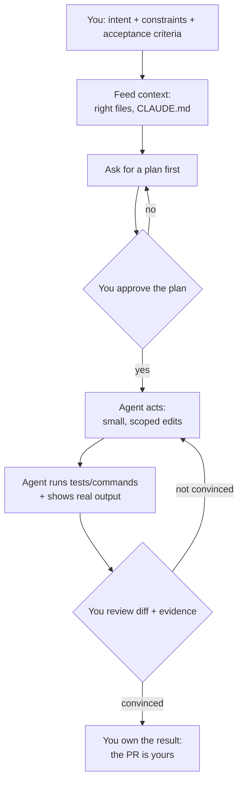
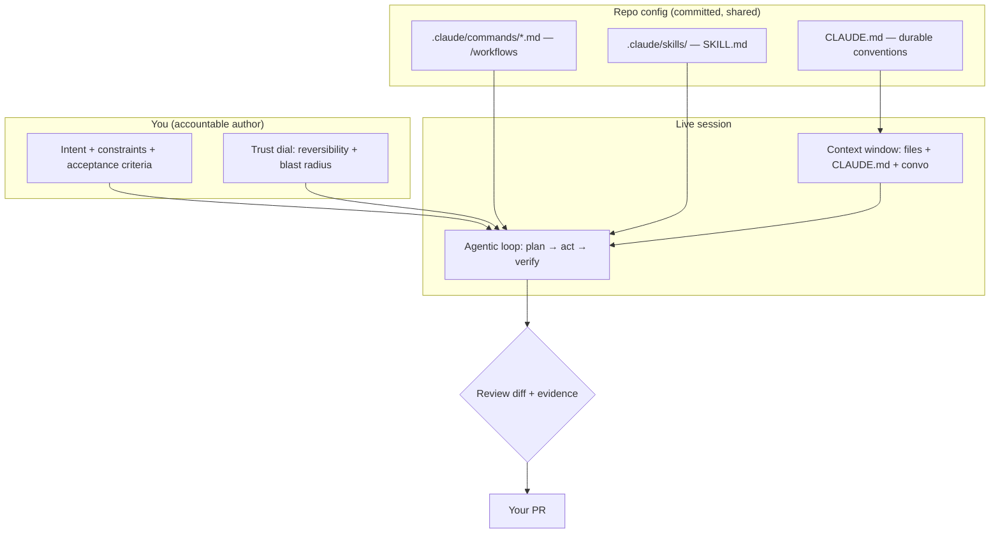

# Good Habits for Agentic Coding

> Put two drivers in the same 500-horsepower car. One fights it — stabs the throttle,
> saws at the wheel, brakes late, and spends the lap scared. The other is smooth: looks
> far ahead, feeds the power in, sets up each corner before entering it. Same machine,
> opposite results. The difference isn't the car. It's the habits. Claude Code is a
> powerful car. This lesson is about being the smooth driver.

You've now done the hard parts of this track. You've [built a Databricks App](/agentic-coding/claude-code/build-a-databricks-app),
[debugged with traces and tests](/agentic-coding/claude-code/debugging-and-testing), and
learned to [drive multi-step changes safely](/agentic-coding/claude-code/safe-multi-step-changes).
This lesson doesn't add a new feature. It ties the track together into a *craft* — the
durable working habits that make every session better.

Here's the honest observation from watching a lot of engineers pick up agentic coding:
the tool is the same for everyone. The results are not. The people who get spectacular
leverage and the people who quietly conclude "it's overhyped" are usually running the
*exact same* Claude Code. What differs is how they prompt, how they feed it context, and
whether they verify. Those are learnable habits, and that's the whole lesson.

## Learning Objectives

By the end of this page, you will be able to:

- **Prompt well:** state intent, constraints, and acceptance criteria; ask for a plan first; and prefer small scoped asks over mega-prompts.
- **Feed the right context:** point the agent at the right files, put durable facts in `CLAUDE.md`, and manage the context window with `/context` and `/compact`.
- Practice **verification as a habit** — never accept "done" without evidence you can see.
- Decide **when to trust vs. when to check** based on reversibility, blast radius, and ambiguity.
- Encode repeatable workflows as **slash commands and skills**.
- Keep yourself the **accountable author** of every change, and right-size **model and context** for cost and speed.

## Prerequisites

- [Driving Multi-Step Changes Safely](/agentic-coding/claude-code/safe-multi-step-changes) — plan mode, checkpoints, and the review discipline this lesson generalizes.
- Helpful: [What Is Claude Code](/agentic-coding/claude-code/what-is-claude-code) for the agentic-loop mental model, and the [VS Code debugging & testing lesson](/agentic-coding/vscode/debugging-and-testing) for the underlying test tooling these habits lean on.

## Estimated Reading Time

About 20 minutes. This is a lesson to *reread* — skim it now, then come back to it the
next time a session goes sideways and ask which habit you skipped. That's usually the fix.

## Business Motivation

Follow Maya over three weeks at Northwind Trust.

**Week 1 — fighting the car.** Maya is skeptical. She types a paragraph: *"Add caching to
the advisor agent and make it faster and clean up the code while you're at it."* Claude
Code rewrites six files, changes a config she didn't mean to touch, and reports "Done!
The agent is now faster." She has no idea if it's actually faster, the diff is 400 lines,
and she spends the afternoon untangling it. Her verdict: *"Faster to just do it myself."*

**Week 2 — noticing the pattern.** A teammate watches her work and points out that every
frustrating session has the same shape: a vague ask, no acceptance criteria, and a "done"
she never verified. He suggests one change — *ask for a plan first.* That week Maya starts
prefixing risky work with "propose a plan, don't edit yet." Her hit rate jumps immediately.

**Week 3 — smooth.** Maya's sessions now look different. She scopes each ask to one
outcome, names the files, states how she'll know it worked, and ends with "run it and show
me." Her `CLAUDE.md` encodes the conventions she used to re-explain every time. She trusts
the agent on mechanical work and slows down hard on anything touching money, data, or prod.
She ships more, reviews less frantically, and — importantly — still owns every PR with her
name on it.

Nothing about the tool changed between week 1 and week 3. Only Maya's habits did. The
payoff isn't philosophical: it's the difference between a tool she abandoned and a tool
that doubled her throughput on the boring 60% of the job.

## Intuition

Every good habit in this lesson attaches to one stage of the agentic loop you already
know. Think of it as a checklist wrapped around the loop.



*Diagram 1: The habit loop. The agent does the middle; the two human gates — approving the
plan and reviewing the diff plus evidence — are where your judgment lives. Skip a gate and
you're back to fighting the car.*

The single unifying idea: **you supply judgment and accountability; the agent supplies
tireless legwork.** Every habit below is just a concrete way to keep that division clean.

## Core Concepts

Five ideas carry the whole lesson.

**Prompting is specification.** A prompt is not a wish; it's a spec. The three parts that
matter most are *intent* (what outcome you want), *constraints* (what it must and must not
do), and *acceptance criteria* (how you'll both know it worked). Vague prompts don't fail
because the model is weak — they fail because you didn't decide what "done" means.

**Context is everything the agent can see.** The model reasons over what's in its context
window: the files it read, the conversation so far, and your `CLAUDE.md`. Give it too
little and it guesses; give it too much irrelevant noise and it loses the thread. Curating
context is a skill, not an afterthought.

**Verification is a habit, not a step.** "Verify, don't trust" ran through the
[debugging lesson](/agentic-coding/claude-code/debugging-and-testing) for a reason. An
agent that never ran the test can still tell you it passes. Evidence you can *see* — real
command output — is the only thing that closes the loop.

**Trust is a dial, not a switch.** How hard you check should scale with risk. Mechanical,
well-specified, reversible work earns a light touch. Anything touching security, customer
data, deploys, or the irreversible earns a full stop-and-read.

**You are the accountable author.** Your name goes on the PR. "Claude wrote it" is not a
defense in code review, an incident postmortem, or a compliance audit. The agent is a
collaborator; the accountability is yours and doesn't transfer.

## Deep Dive

### Habit 1 — Prompt like you're writing a spec

The highest-leverage change most people can make is to stop writing wishes and start
writing specs. Watch the difference.

```text
# Before (a wish)
Make the advisor agent faster.
```

```text
# After (a spec)
Goal: reduce p95 latency of the advisor agent's account-lookup path.
Constraints: don't change the public API of route(); don't touch auth;
keep all existing tests green.
Approach: add a short-lived in-memory cache for account_lookup results.
Acceptance: show me a before/after timing on tests/perf/lookup_bench.py,
and confirm the full test suite still passes.
```

The "after" prompt names the outcome, fences off what must not move, proposes a bounded
approach, and — crucially — tells the agent how you'll judge success. You'll get a focused
diff and evidence, instead of a 400-line surprise.

### Habit 2 — Ask for a plan before any risky edit

For anything beyond a one-liner, ask for the plan first. This is [plan mode](/agentic-coding/claude-code/safe-multi-step-changes)
made into a reflex. A plan is cheap to read and cheap to correct; a wrong 300-line diff is
neither.

```text
Before you change anything: read agent/router.py and agent/tools.py and propose a
plan for adding the cache — which files, what changes, what could break. Don't edit yet.
```

You catch the misunderstanding ("oh, it was going to cache the *model* call, not the
lookup") when it costs one sentence to fix, not one afternoon to unwind.

### Habit 3 — Prefer small scoped asks over mega-prompts

A mega-prompt ("add caching AND refactor AND write docs AND bump the config") produces a
tangled diff where a good change and a bad change are welded together — you can't approve
half. Small, sequential asks keep each diff reviewable and each step independently
revertible.

```text
# Instead of one giant ask, three clean ones:
1. Add the account_lookup cache. Show me the diff and the perf test. [review, commit]
2. Now add a unit test for cache expiry. Run it, show output. [review, commit]
3. Now update the module docstring to describe the cache. [review, commit]
```

Three small commits tell a story in git history. One giant commit tells nobody anything.
This is the same discipline as the [safe multi-step lesson](/agentic-coding/claude-code/safe-multi-step-changes) —
just applied at the level of a single afternoon.

### Habit 4 — Point the agent at the right context

The agent is only as good as what it can see. Naming the relevant files up front saves it
from guessing — and saves you from a fix that ignored the module that actually mattered.

```text
# Before
Why is the router picking the wrong tool?

# After
Look at agent/router.py (the route() function) and the tool descriptions in
agent/tools.py. Compare them against the failing case in tests/test_router.py.
Why does a "balance" question route to policy_search?
```

The "after" version hands the agent the three files a human expert would open first. It's
the difference between "go find the problem somewhere in the repo" and "here's the
crime scene."

### Habit 5 — Put durable facts in `CLAUDE.md`, not in every prompt

If you find yourself re-explaining the same convention every session — "we use `uv`, not
`pip`"; "always mock the model in unit tests"; "never put PII in fixtures" — that fact
belongs in `CLAUDE.md`, the project memory loaded every session.

```markdown
# CLAUDE.md (excerpt)
## Conventions
- Package manager: uv. Never suggest pip install.
- Tests: pytest; always mock the LLM call in unit tests (no network).
- After changing code, run the affected tests and paste the output.
- Never put real customer data or PII in test fixtures or committed traces.
- Deploys go through Asset Bundles (`databricks bundle deploy`), never manual UI edits.
```

`CLAUDE.md` is prompting that compounds. Write a convention once and every future session —
yours and your teammates', since it's committed to git — inherits it. It's the highest-ROI
file in an agentic repo.

:::tip
Keep `CLAUDE.md` lean and factual. It's loaded *every* session, so bloat costs context on
every turn. Durable conventions and guardrails, yes; a novel about the project, no. If a
line isn't something you'd want the agent to remember on every task, it doesn't belong.
:::

### Habit 6 — Manage the context window deliberately

A long session slowly fills the context window with old tool output and dead ends. When
the agent starts "forgetting" earlier decisions or getting slower and vaguer, the window
is the likely culprit. Two built-ins help (verify current behavior in the docs — the CLI
evolves):

- **`/context`** shows what's currently in the window — a quick way to see if it's bloated.
- **`/compact`** summarizes the conversation so far and frees space while keeping the thread.

The habit: **start a fresh session for a fresh task.** Don't debug a migration in the same
window where you spent two hours on an unrelated caching change. A clean context is a sharp
agent.

### Habit 7 — Make verification non-negotiable

Never accept "done" without evidence. This is the habit that most reduces risk, and it's
one clause at the end of a prompt.

```text
# The clause that closes the loop:
...then run the affected tests and the perf bench, and paste the actual output.
```

If you didn't *see* green output, treat the change as unverified. An agent narrating
success is not the same as a test suite confirming it. Bake the rule into `CLAUDE.md` so
you don't have to remember to say it every time.

### Habit 8 — Encode repeatable workflows as commands and skills

When you run the same multi-step ritual repeatedly — "review this diff for security,
run the linter, run the tests, summarize" — stop retyping it. Capture it once.

- **Slash commands** (`.claude/commands/*.md`) are reusable prompts you invoke as `/name`. Built-ins like `/code-review` and `/security-review` are exactly this idea, shipped.
- **Skills** (`SKILL.md` under `.claude/skills/<name>/`) package instructions the agent auto-invokes when relevant, or you run as `/skill-name`. They load on demand, so they don't cost context until used.

Maya's team wrote a `/ship-check` command that runs the linter, the unit suite, and a
security scan and summarizes the result — one keystroke replaces a paragraph nobody
remembered to type consistently. Encoded workflows also make the *team's* habits uniform,
because they're committed to the repo. (Verify current command/skill mechanics in the
docs; the format evolves.)

## Architecture

Here's how the habits map onto where things actually live — prompt, project config, and
the human gates.



*Diagram 2: Where the habits live. Durable habits get encoded in committed config
(`CLAUDE.md`, commands, skills) so they apply automatically; per-task judgment (the spec
and the trust dial) you supply live. Everything funnels through your review into a PR you
own.*

The structural point: **the more of your discipline you push into committed config, the
less you rely on remembering it.** Good habits you have to remember are fragile; good
habits encoded in `CLAUDE.md` and commands are durable and shared.

## Step-by-Step Walkthrough

Maya adds rate-limiting to the advisor API. Watch the habits fire in order.

1. **Spec it.** *"Goal: rate-limit the advisor API to 10 req/s per client. Constraint: return HTTP 429, don't drop requests silently. Don't touch auth. Acceptance: a test proving the 11th request in a second gets 429."*
2. **Plan first.** *"Propose a plan — which files, what middleware, what could break. Don't edit yet."* She reads it, catches that it planned to rate-limit globally instead of per-client, and corrects it in one sentence.
3. **Small scope.** She approves just the middleware change first, leaving the metrics/logging for a second commit.
4. **Right context.** The plan already named `api/middleware.py` and `api/app.py`; she confirms those are the right files before approving.
5. **Verify.** *"Run the new 429 test and the full API suite; paste the output."* She sees green, not a claim of green.
6. **Trust dial.** Rate-limiting touches request handling but is reversible and well-tested, so a normal review suffices. She notes that *if* this had touched auth, she'd have read every line twice.
7. **Own it.** She opens the PR under her name, writes the description herself, and can explain every line in review — because she read every line.

Seven steps, maybe forty minutes, and a change she'd stake her name on. That's the smooth
lap.

## Hands-on Examples

Three before/after upgrades you can adopt today.

**1 — From wish to spec.**

```text
# Before
Clean up the tools module.

# After
In agent/tools.py, extract the repeated account-id parsing into one helper and use it
in all three tools. Don't change any tool's behavior or signature. Keep tests green.
Show me the diff and the test run.
```

*Why it's better:* bounded scope, explicit "no behavior change," and a verification clause.
The "before" version invites the agent to redesign your module.

**2 — From trust to verify.**

```text
# Before
Did that fix work?

# After
Re-run tests/test_router.py and the router eval, and paste the full output. Tell me the
before/after pass counts.
```

*Why it's better:* you get evidence, not reassurance. "Did it work?" invites a yes; "paste
the output" invites proof.

**3 — From re-explaining to encoding.**

```text
# Before (typed every session)
Remember, we use uv not pip, mock the model in unit tests, and always show test output.

# After (once, in CLAUDE.md)
## Conventions
- Package manager: uv (never pip).
- Mock the LLM call in unit tests; no network in the unit suite.
- After code changes, run affected tests and paste output.
```

*Why it's better:* the convention now applies automatically, every session, for the whole
team — instead of depending on you remembering to say it.

## Production Considerations

- **Encode habits in the repo, not in your head.** `CLAUDE.md`, custom commands, and skills turn personal discipline into team defaults that survive turnover and apply on every task.
- **Right-size the model.** Use a stronger model for hard reasoning (a tricky refactor, a subtle bug) and a faster one for mechanical edits. Switch with `/model`. Don't burn the biggest model on renaming a variable, and don't cripple a hard debugging session with the fastest one. (Check current model options in the docs rather than hardcoding a name.)
- **Keep context lean for cost and speed.** A bloated context window is slower *and* more expensive on every turn. Fresh session per task, `/compact` when a session runs long, and a tight `CLAUDE.md` all pay off directly.
- **Small commits over big ones.** Reviewable diffs and clean git history aren't just tidiness — they're what makes a bad change cheap to revert and an incident fast to bisect.
- **Treat "verify, don't trust" as a release gate.** The same evidence habit that protects your local work should gate CI: the build enforces what the agent claimed.

## Team & Collaboration Considerations

- **`CLAUDE.md` is shared discipline.** Because it's committed, every teammate's Claude Code inherits the same conventions and guardrails. Review changes to it like any other important config.
- **Review the diff, not the vibe.** An AI-assisted change gets the same scrutiny as a hand-written one. "Claude wrote it" is not a review, and it's not an approval.
- **Share commands and skills.** A `/ship-check` or `/security-review` workflow in the repo means the whole team runs the same checks the same way — habits don't depend on who remembered.
- **The author is accountable, always.** Whoever's name is on the PR owns it: the design, the correctness, the security. Agentic assistance changes how the code got written, not who answers for it.

## Security Considerations

- **The trust dial is a security control.** Security-, data-, deploy-, and money-touching changes are exactly the ones to slow down on. Reversible and well-specified earns a light touch; irreversible and ambiguous earns a full read of every line.
- **Never let the agent auto-run destructive or privileged actions unreviewed.** Deploys, migrations, credential changes, and anything touching production or customer data go through explicit human approval — use plan mode and tight permissions, never blanket auto-accept, for these.
- **Keep secrets and PII out of prompts and context.** Don't paste real customer data, tokens, or credentials into a session to "give it context." Encode a `CLAUDE.md` rule forbidding PII in fixtures and committed traces, and mean it.
- **You own what ships, including what the agent wrote.** In a regulated firm like Northwind Trust, "the AI generated it" satisfies no auditor. Read security-relevant diffs yourself; run `/security-review` as a second pass, not a replacement for your own.

## Common Mistakes

- **Wishes instead of specs.** "Make it better" with no acceptance criteria — the number-one cause of disappointing sessions.
- **Skipping the plan on risky work.** Approving a 300-line diff you could have caught as a one-sentence wrong plan.
- **Mega-prompts.** Welding four changes into one un-reviewable, un-revertible diff.
- **Accepting "done" without output.** Trusting a narration of success instead of demanding visible evidence.
- **Re-explaining conventions every session** instead of putting them in `CLAUDE.md`.
- **Letting context rot.** Debugging a new task in a stale, bloated window and blaming the model when it gets vague.
- **Same trust level for everything** — either checking trivial edits obsessively (slow) or rubber-stamping a deploy (dangerous).
- **Outsourcing accountability.** Shipping code you didn't read and couldn't explain because "the agent wrote it."

## Best Practices

- **Prompt as spec:** intent + constraints + acceptance criteria, every time it matters.
- **Plan before risky edits;** approve the plan, then the diff.
- **Small scoped asks** beat one mega-prompt. One outcome per ask, one story per commit.
- **Feed the right files;** put durable facts in `CLAUDE.md`, not in every prompt.
- **Manage context:** fresh session per task, `/context` to inspect, `/compact` when long.
- **Verify, don't trust:** end with "run it and show me the output."
- **Set the trust dial by risk:** reversibility and blast radius decide how hard you check.
- **Encode repeatable workflows** as slash commands and skills.
- **Right-size the model;** keep context lean for cost and speed.
- **Own the PR.** Read every line you ship; be able to explain it.

## Interview Questions

1. **What makes a good prompt for a coding agent?**
   Look for: it's a specification, not a wish — states intent, constraints, and acceptance criteria; often asks for a plan first; scoped small. Bonus: names the relevant files so the agent isn't guessing at context.

2. **What is `CLAUDE.md` for, and what belongs in it versus a prompt?**
   Look for: project memory loaded every session, committed and shared via git; durable conventions and guardrails (package manager, test rules, PII bans) go there; per-task intent goes in the prompt. Bonus: keep it lean because it costs context every turn.

3. **How do you decide how hard to check an agent's work?**
   Look for: a trust *dial* set by risk — reversibility, blast radius, and ambiguity. Mechanical/well-specified/reversible → light touch; security, data, deploys, irreversible, ambiguous → always read every line. The dial is a real control, not a mood.

4. **What does "verify, don't trust" mean in practice, and how do you enforce it?**
   Look for: never accept "done" without visible evidence; make the agent run tests/commands and paste real output; encode the rule in `CLAUDE.md`; gate CI on it. An agent that never ran the test can still claim it passed.

5. **When would you reach for a slash command or a skill instead of just prompting?**
   Look for: to encode a repeatable multi-step workflow (review + lint + test + summarize) once, so it's consistent and shared across the team, instead of retyping (and forgetting parts of) it every time.

6. **Who is accountable for AI-assisted code, and what follows from that?**
   Look for: the human author whose name is on the PR — accountability doesn't transfer to the tool. It follows that you read security-relevant diffs yourself, can explain every line, and treat `/security-review` as a second pass, not a substitute for judgment.

## Quiz

**Q1.** Rewrite this wish as a spec: *"Speed up the ingestion job."* What three things must you add?

<details>
<summary>Show answer</summary>

Add **intent** (a concrete, measurable outcome — e.g., "cut p95 runtime of the nightly
ingestion job below 10 minutes"), **constraints** (what must not change — "don't alter the
output schema, keep the existing tests green"), and **acceptance criteria** (how you'll
both know — "show me a before/after timing and confirm row counts match"). A prompt without
these is a wish, and wishes produce surprises.

</details>

**Q2.** You're about to have the agent change the deploy pipeline for the production
advisor app. Where should your trust dial sit, and why?

<details>
<summary>Show answer</summary>

**All the way to "check everything."** Deploys are high blast radius and often irreversible,
so this is a full stop-and-read: use plan mode, approve the plan, review every line of the
diff, demand verification, and never blanket-auto-accept. Contrast with a mechanical,
reversible, well-tested edit, which earns a light touch.

</details>

**Q3.** You keep telling the agent "use uv, not pip" every session. What's the fix?

<details>
<summary>Show answer</summary>

Put it in **`CLAUDE.md`** — the project memory loaded every session and shared via git.
Durable conventions belong there, not in every prompt. Now every session (yours and your
teammates') inherits the rule automatically, and you never have to remember to say it.

</details>

**Q4.** The agent says "All tests pass, the fix is complete." What's your next move?

<details>
<summary>Show answer</summary>

Don't accept the claim — ask it to **run the tests and paste the actual output** (and read
the diff yourself). "Verify, don't trust": an agent that never ran the suite can still
report success. If you didn't see the green output, the change is unverified.

</details>

## Summary

Claude Code gives everyone the same powerful machine; the results diverge entirely on
habits. The craft comes down to a clean division of labor: you supply judgment and
accountability, the agent supplies tireless legwork, and a set of durable habits keeps that
line sharp.

**Prompt like a spec** — intent, constraints, acceptance criteria — and ask for a plan
before risky edits. **Scope asks small** so every diff is reviewable and every commit tells
a story. **Feed the right context:** name the files, put durable conventions in `CLAUDE.md`,
and manage the window with `/context` and `/compact`. **Verify, don't trust** — end every
session with visible evidence, never a claim. **Set the trust dial by risk:** mechanical and
reversible earns a light touch, while security, data, deploys, and the irreversible earn a
full read. **Encode repeatable workflows** as slash commands and skills so your discipline
is shared and automatic. Right-size the model and keep context lean for cost and speed. And
through all of it, stay the **accountable author** — the PR is yours, and so is every line in
it. That's the smooth lap: same car, opposite result, all in the habits.

## Key Takeaways

- A prompt is a **specification**: intent + constraints + acceptance criteria. Wishes produce surprises.
- **Plan before risky edits**, and prefer **small scoped asks** over mega-prompts.
- **Context is a skill:** name the right files; put durable facts in `CLAUDE.md`; use `/context` and `/compact` to manage the window.
- **Verify, don't trust** — demand visible output; encode the rule in `CLAUDE.md` and gate CI on it.
- The **trust dial** is set by reversibility, blast radius, and ambiguity — not by mood.
- **Encode repeatable workflows** as slash commands and skills so habits are shared and consistent.
- **Right-size the model** and keep context lean for cost and speed.
- You are the **accountable author**: read every line you ship, and be able to explain it. Accountability never transfers to the tool.

## Glossary

- **Acceptance criteria:** The stated, checkable condition that defines "done" for a task — the thing you and the agent both verify against.
- **`CLAUDE.md`:** Project memory loaded every session (committed and shared via git); the home for durable conventions and guardrails.
- **Context window:** Everything the model can currently see — files read, conversation so far, and `CLAUDE.md`. Curating it is a core skill.
- **`/context`:** In-session command that shows what's currently in the context window.
- **`/compact`:** In-session command that summarizes the conversation to free context while keeping the thread.
- **Trust dial:** The habit of scaling how hard you check the agent's work to the risk of the change (reversibility, blast radius, ambiguity).
- **Verify-don't-trust:** Confirming success by observing real command output rather than accepting a claim.
- **Slash command:** A reusable prompt invoked as `/name`, defined in `.claude/commands/*.md` (built-ins include `/plan`, `/code-review`, `/security-review`).
- **Skill:** Packaged instructions (`SKILL.md` under `.claude/skills/<name>/`) the agent auto-invokes when relevant or you run as `/skill-name`; loaded on demand.
- **Accountable author:** The human whose name is on the PR and who answers for the code, regardless of how it was written.

## Further Reading

- [Claude Code documentation](https://docs.claude.com/en/docs/claude-code) — current commands, configuration, `CLAUDE.md`, skills, and permissions (these evolve; check the docs for exact behavior).
- [Why Evaluation Is Hard](/docs/evaluation/why-eval-is-hard) — why "looks right" isn't evidence for AI systems, and why verification takes discipline.

## Next Lesson

You've reached the end of the craft lessons. You can build, debug, drive safe multi-step
changes, and now work with the habits that make it all pay off. Time to consolidate it and
be ready to talk about it with confidence.

➡️ [Interview Prep: Claude Code & Agentic Coding](/agentic-coding/claude-code/interview-prep)