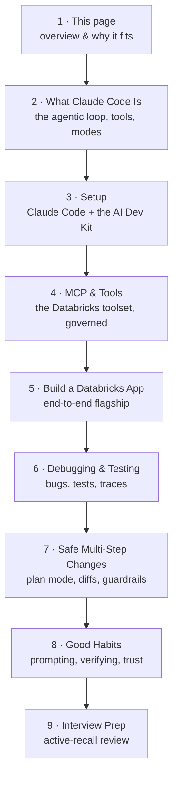
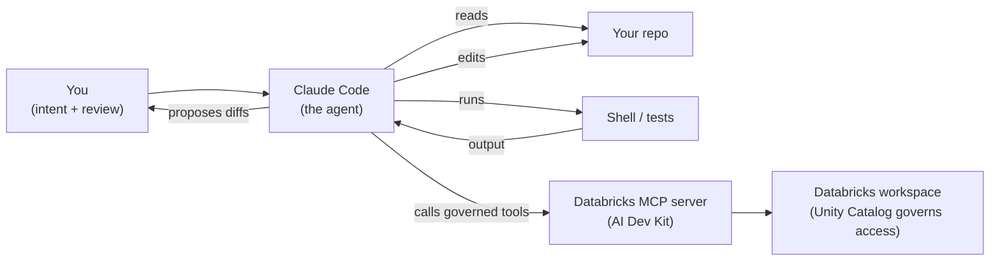

# Claude Code for Databricks AI Engineers

> Imagine hiring a sharp new teammate who reads your entire repository in seconds, writes
> and runs code, edits many files at once, and drives a change from idea to working
> software — all while you review each step. That teammate is **Claude Code**. This
> subtopic is about pairing with it well, and pointing it at **Databricks** so it can
> actually build things in your workspace.

You already know *what* to build — the [Databricks AI](/docs/intro) track taught agents,
RAG, evaluation, and deployment. The [VS Code](/agentic-coding/vscode/intro) subtopic set
up a professional editor. This subtopic goes deep on the **agentic assistant** you work
*with* inside that editor: Claude Code, a command-line coding agent that plans, edits,
runs, and verifies — with a human in the loop.

The centerpiece is a hands-on walkthrough: **building a Databricks App with Claude Code**,
using the official **[Databricks AI Dev Kit](https://github.com/databricks-solutions/ai-dev-kit)**
to give the assistant governed Databricks tools over MCP. By the end you'll have shipped a
chat UI in front of an agent — mostly by describing what you want — and you'll know how to
debug, test, and drive larger changes with the assistant safely.

:::note[Dual audience by design]
Claude Code is not a Databricks product — it's a general coding agent that works on any
codebase. The **AI Dev Kit** is the bridge that makes it Databricks-aware. So the habits
here (planning, reviewing diffs, MCP, guardrails) travel with you to non-Databricks work
too.
:::

## What this subtopic covers

A full end-to-end track, nine pages, built around one flagship: shipping a Databricks App.
Go in order the first time.

*The Claude Code subtopic, end to end. Each page uses the same running example — Maya, an
engineer at "Northwind Trust," shipping a governed chat App on Databricks with Claude Code
as her pair.*

## Pages

1. **This overview** — what the track covers and why Claude Code pairs so well with Databricks work.
2. **[What Claude Code Is (and How It Works)](/agentic-coding/claude-code/what-is-claude-code)** — the agentic loop, the tools it uses, its modes and permissions, and the "leverage, not autopilot" framing.
3. **[Setup: Claude Code + the Databricks AI Dev Kit](/agentic-coding/claude-code/setup-ai-dev-kit)** — install Claude Code and the AI Dev Kit, and connect the MCP server and skills so the assistant can use governed Databricks tools.
4. **[MCP & the AI Dev Kit's Databricks Tools](/agentic-coding/claude-code/mcp-and-tools)** — how the assistant discovers and calls the 50+ Databricks tools, how skills shape its patterns, and how Unity Catalog keeps every call governed.
5. **[Build a Databricks App with Claude Code](/agentic-coding/claude-code/build-a-databricks-app)** — the flagship: from an empty folder to a deployed, governed chat App in front of an agent, driving Claude Code step by step.
6. **[Debugging & Testing with Claude Code](/agentic-coding/claude-code/debugging-and-testing)** — reproduce bugs, write unit and eval tests, mock the LLM, and read traces, with you reviewing every diff.
7. **[Driving Multi-Step Changes Safely](/agentic-coding/claude-code/safe-multi-step-changes)** — plan mode, diff review, the permission and allow/deny model, checkpoints, subagents, and `CLAUDE.md` guardrails.
8. **[Good Habits for Agentic Coding](/agentic-coding/claude-code/good-habits)** — how to prompt, how to verify, how to manage context, and when to trust vs. check the agent.
9. **[Interview Prep: Claude Code & Agentic Coding](/agentic-coding/claude-code/interview-prep)** — a relaxed, active-recall review of the whole track.

## What Claude Code actually is

Claude Code is an **agentic coding assistant** that runs in your terminal (and integrates
with editors like VS Code). "Agentic" means it runs the same reason → act → observe loop
you learned about in [What Is an AI Agent?](/docs/agents-tools-mcp/what-is-an-agent) — but
its tools are *your development environment*: it reads files, edits them, runs shell
commands, runs tests, and reads the output to decide what to do next.

*How Claude Code works: it drives your repo and shell, and — once wired to the AI Dev
Kit's MCP server — it can also call governed Databricks tools. You stay in the loop,
reviewing diffs and approving actions.*

The important framing for an engineer: **Claude Code is leverage, not autopilot.** It
scaffolds, refactors, writes tests, and drives multi-step changes fast. You supply the
intent, review the diffs, and hold the guardrails — exactly the discipline the
[repo-first](/agentic-coding/vscode/repo-first-project) and
[debugging & testing](/agentic-coding/vscode/debugging-and-testing) lessons build.

## Why it pairs so well with Databricks

Building on Databricks means a lot of *glue*: create a catalog and schema, register a
function, deploy a job, stand up a serving endpoint, wire a chat App to it. That glue is
exactly the kind of well-documented, pattern-heavy work an agent is good at — *if* it can
reach the platform safely. The **AI Dev Kit** makes that possible:

- **An MCP server** exposing 50+ Databricks tools (SQL, Unity Catalog, jobs, pipelines, MLflow, model serving, **Databricks Apps**), so Claude Code can *do* things in your workspace — see [MCP](/docs/agents-tools-mcp/mcp).
- **Skills** — curated markdown guides that teach the assistant Databricks patterns and best practices, so its suggestions follow the platform's grain.
- **Your identity and Unity Catalog still govern everything.** The assistant acts through your Databricks CLI credentials and gets only the access you have.

## How it connects to the rest of the site

- Sibling of the **[VS Code](/agentic-coding/vscode/intro)** subtopic — that one sets up the *environment*; this one goes deep on the *assistant* you work with inside it. In fact, the AI Dev Kit installs for [VS Code's AI assistants too](/agentic-coding/vscode/ai-assistants-and-mcp).
- Builds on **[Databricks AI](/docs/intro)** — especially [Authoring Agents](/docs/building-agents/authoring-agents) and [Shipping a Chat UI with Databricks Apps](/docs/building-agents/databricks-apps), which the flagship walkthrough brings to life with an assistant.
- The habits are portable — see [Beyond Databricks](/docs/beyond-databricks/concepts-are-portable).

Ready? Start with **[What Claude Code Is (and How It Works)](/agentic-coding/claude-code/what-is-claude-code)**.

:::info[Independent project]
Databrickster is a free, independent educational resource. It is **not affiliated with,
endorsed by, or sponsored by Databricks, Inc.** "Databricks" and related marks belong to
their respective owners. Claude Code is a product of Anthropic.
:::
