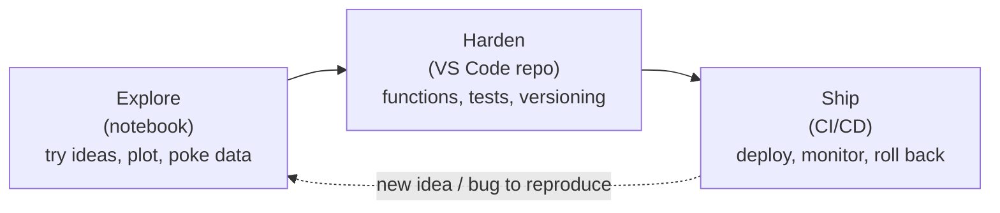
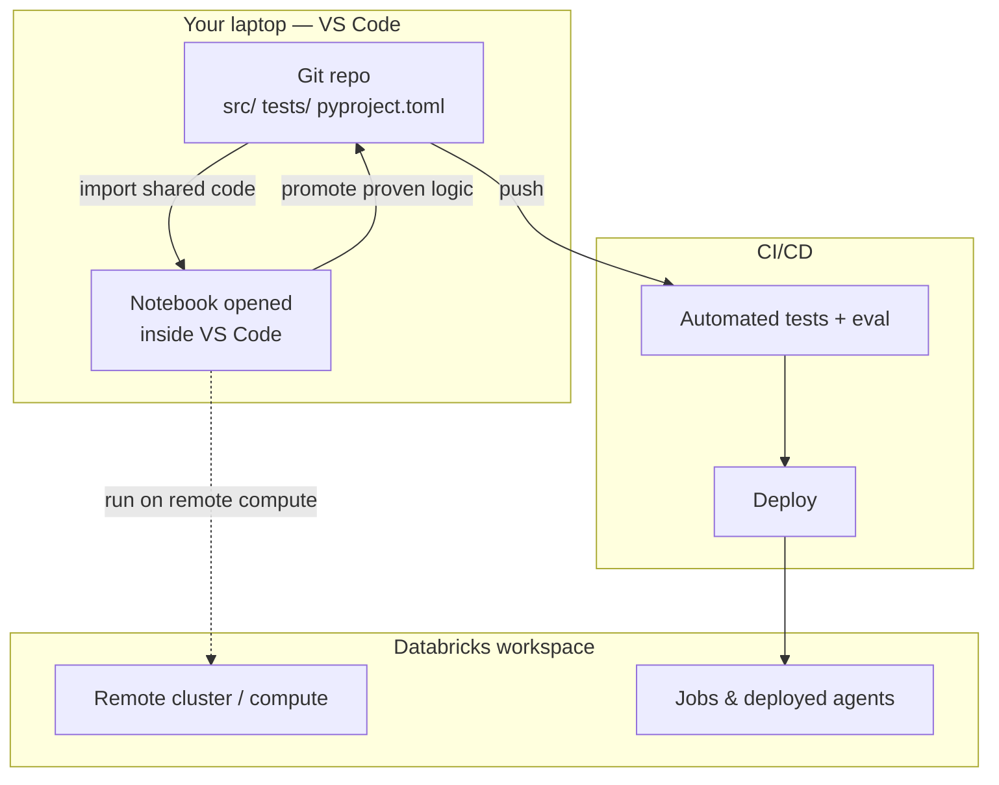

# Notebooks vs. the IDE: When to Graduate to VS Code

> Think of a workshop sketch versus an engineered blueprint. A sketch on the back of a napkin is how every good idea starts — fast, messy, disposable, exactly right for figuring out *whether* something could work. But you don't build a bridge from a napkin. Before steel gets poured, someone redraws the idea as a blueprint: measured, versioned, reviewable, something a whole crew can build from without guessing. A notebook is your napkin sketch. VS Code is where the blueprint lives.

You already live in notebooks. They're where you poke at a DataFrame, plot a distribution, and try three prompt variations before lunch. That instinct is correct — notebooks are *superb* for exploration, and nothing in this lesson asks you to give that up.

But there's a moment, on every real AI project, when the notebook that got you started quietly starts working against you. You copy a helper function into a fourth notebook. A cell gives a different answer than it did yesterday and you can't say why. A teammate asks "which version of this agent is in production?" and you don't have a clean answer. That moment is the subject of this lesson.

We're going to name exactly what notebooks are great at, exactly where they break down for production AI, and — the part people miss — how notebooks and the IDE *coexist* rather than compete. This is not an anti-notebook lesson. It's a "right tool, right stage" lesson.

## Learning Objectives

By the end of this lesson, you will be able to:

- Explain what notebooks are genuinely great at, and why they earned their place in data work.
- Name the specific ways a notebook-only workflow breaks down as an AI project grows: multi-file reuse, testing, code review, version-control diffs, dependency pinning, CI/CD, collaboration, and hidden out-of-order state.
- Describe the "hidden state" problem and why it makes notebook results hard to trust.
- Articulate how notebooks and VS Code work *together* — explore in notebooks, harden in the repo — including running notebooks from inside VS Code.
- Decide, for a given piece of work, whether it belongs in a notebook or in a versioned codebase.

## Prerequisites

Before this lesson, it helps to have:

- Skimmed the [Databricks AI track intro](/docs/intro) so you know the kind of agents and pipelines we're building toward.
- Read the [VS Code subtopic intro](/agentic-coding/vscode/intro) for where this lesson fits in the plan.

No setup is required yet — you don't install anything in this lesson. The next lesson handles setup. This one is about *why*.

## Estimated Reading Time

About 18 to 22 minutes. There's nothing to run; read it gently. The goal is a clear mental model, not memorized commands.

## Business Motivation

Let's ground this in a story you'll recognize.

At **Northwind Trust**, the mid-sized financial services firm we follow across this site, **Maya** — a data engineer — is asked to prototype a support agent. It should answer customer questions about account status and policy, using the Unity Catalog functions and Vector Search index her team already built.

She does the right thing: she opens a notebook. Within two days she has something that *works*. Cell 3 loads the tools, cell 7 builds the prompt, cell 12 runs the agent against a handful of test questions, and the outputs look great in the little rendered tables. Her manager is thrilled. Ship it.

And this is where the sketch meets reality.

- Compliance needs to **review** the exact logic before it touches customers. Reviewing a notebook is painful — the diff is a wall of JSON and cell metadata, not readable code.
- A second engineer, **Raj**, is assigned to help. He copies Maya's notebook, tweaks the prompt, and now there are *two* prototypes drifting apart. Which one is real?
- Maya reruns her notebook for a demo, and the agent gives a *different* answer than last week. She can't reproduce the old result. Nobody changed the code — but a cell had been run out of order weeks ago, and the notebook's live state was never the same as its saved cells.
- Nobody can say which package versions produced the "good" demo, so the results aren't reproducible on anyone else's machine.

None of this means the notebook was a mistake. The notebook was *exactly right* for the first two days. The problem is that a production agent is **software**, and software needs the things software has always needed: version control, tests, review, pinned dependencies, and automated deployment. That's the business case for graduating to the IDE — not taste, but reproducibility, auditability, and the ability for a team to build together without stepping on each other. For a regulated firm like Northwind, "we can't reproduce or review it" isn't an inconvenience; it's a blocker.

## Intuition

Here's the whole idea in one picture: a project moves left-to-right through stages, and each stage has a home.



*Diagram 1: The lifecycle of a piece of AI work. Exploration starts in a notebook. Once an idea proves out, it moves into a versioned repo in VS Code to be hardened. From there it ships through CI/CD. And the loop is real — a production bug often sends you right back to a notebook to reproduce it. Neither tool "wins"; they hand off.*

The trap that hurts teams is trying to stretch **one** stage's tool across **all** stages. A notebook stretched all the way to production carries hidden state, resists review, and can't be tested cleanly. An IDE forced to do rapid visual exploration feels heavy and slow. Use each where it's strong, and hand off at the boundary.

Keep that diagram in your head for the rest of the lesson. Everything below is just detail on the two boxes and the arrow between them.

## Core Concepts

Let's define the terms plainly so the deep dive is easy.

- **Notebook** — a document of runnable **cells** interleaved with output (tables, plots, text). You run cells in any order, and the outputs are saved right alongside the code. Its superpower is the tight *edit → run → see result* loop.
- **IDE (VS Code)** — an editor for **plain source files** (`.py`, `.yaml`, `.md`) organized in a folder (a **repo**). Its superpower is everything *around* the code: search across files, refactoring, a debugger, tests, git integration, and extensions.
- **Hidden state** — the invisible in-memory variables a notebook accumulates as you run cells. Because you can run cells out of order (and delete cells without deleting their effects), what the notebook *shows* can quietly disagree with what a fresh top-to-bottom run would produce.
- **Reproducibility** — the ability for someone else (or future-you) to get the *same* result from the *same* inputs. It requires that the code, the run order, and the dependency versions are all captured.

Hold onto **hidden state** especially. It's the single most under-appreciated reason notebook results are hard to trust, and we'll return to it.

## Deep Dive

Let's be fair to both tools, in order. First the case *for* notebooks, then the specific places they break down.

### What notebooks are genuinely great at

Notebooks earned their place. Don't let anyone shame you out of them.

- **Exploration and fast iteration.** Change a line, hit shift-enter, see the result in a second. For "what does this data even look like?" nothing beats it.
- **Inline visualization.** Plots, tables, and rich output render right under the cell that made them. This is fantastic for EDA, checking a model's outputs, and eyeballing an agent's responses.
- **Narrative + code together.** Markdown cells let you tell the story of an analysis alongside the code. Great for a one-off investigation or a shared finding.
- **Zero ceremony.** No project scaffolding, no imports to organize, no build step. You're computing in ten seconds.

For **exploratory prompt engineering** — trying five system prompts and reading the outputs side by side — a notebook is arguably the *best* tool that exists. Keep doing that.

### Where notebooks break down for real agent projects

The strengths above are all about a **single person exploring a single throwaway artifact**. Production AI is the opposite: multiple people, reused code, results that must be trusted and repeated. Here's where the seams show.

- **Multi-file reuse.** The moment two notebooks need the same `build_prompt()` helper, you copy-paste it. Now there are two copies that drift. Real software factors shared logic into a module that everything imports once. Notebooks fight this.
- **Unit and eval tests.** You cannot easily point `pytest` at a notebook cell. Agents *especially* need tests — unit tests for your tool-calling glue, and **eval** tests that score the agent's answers on a dataset. Those live naturally as test files in a repo, not as cells you rerun by hand.
- **Code review.** A pull request should show a clean, line-by-line diff of what changed. A `.ipynb` file is JSON with embedded outputs and execution counts; its raw diff is noise. Reviewers can't see that you changed one line of prompt logic under all that metadata.
- **Version-control diffs.** Same root cause: because outputs and metadata are stored inside the notebook file, git shows enormous, unreadable diffs, and merge conflicts become nightmares. Plain `.py` files diff and merge cleanly.
- **Dependency pinning.** "It worked in my notebook" often means "it worked with whatever versions happened to be on that cluster that day." A repo pins exact versions in a lockfile so everyone — and production — runs the same stack.
- **CI/CD.** Continuous integration runs your tests automatically on every change and blocks a broken one from shipping. That pipeline needs source files, a test command, and a lockfile — the repo shape, not the notebook shape.
- **Collaboration.** Two engineers editing the same notebook is a recipe for clobbered work. Git's branch-and-merge model, built for source files, is how teams actually work in parallel.
- **Hidden state / out-of-order execution.** This is the big one. Because you can run cells in any order, the notebook's live memory can hold variables from code you've since edited or deleted. The notebook *looks* consistent but isn't. A colleague opening it and running top-to-bottom may get a different result — or an error. Your "working" demo might not survive a **Restart & Run All**.

:::warning The restart test
The fastest way to feel the hidden-state problem: in any notebook you trust, hit **Restart Kernel & Run All**. If it doesn't produce the same results — or fails partway — your notebook depended on invisible state, not on the code you can see. Production cannot run on invisible state.
:::

None of these is a moral failing of notebooks. They're the natural cost of a tool optimized for exploration being asked to do the job of engineered software.

## Architecture

Here's how the two environments actually fit together in a healthy AI project. Notice that VS Code doesn't *replace* the notebook — it can host it.



*Diagram 2: The repo is the center of gravity. Shared logic lives in versioned source files; a notebook (even one opened inside VS Code) imports that code for exploration and can run against remote Databricks compute. Proven logic gets promoted back into the repo, where CI runs tests and deploys. Later lessons cover the dotted-line pieces — the Databricks extension and Connect for remote compute, and Asset Bundles for deployment.*

The key architectural idea: **the repo is the source of truth, and the notebook is a workbench that borrows from it.** Exploration doesn't disappear; it just stops being the place your production logic *lives*.

## Step-by-Step Walkthrough

Let's replay Maya's project the way it should go — no code yet, just the shape of the workflow.

1. **Explore in a notebook.** Maya opens a notebook and tries prompt variations against Northwind's tools. She plots which questions the agent gets wrong. This is fast and visual — exactly right. The napkin sketch.
2. **Spot the reusable core.** She notices the same `build_prompt()`, `call_tools()`, and `score_answer()` logic being copied between cells. That's the signal: this is no longer throwaway. Time to promote it.
3. **Create a repo in VS Code.** She makes a project folder — `src/` for the agent code, `tests/` for tests, a `pyproject.toml` to pin dependencies — and moves the proven functions into real modules.
4. **Write tests.** Unit tests check the tool-calling glue; an eval test runs the agent over a small dataset of graded questions and asserts a minimum score. Now "does it still work?" is a command, not a vibe.
5. **Commit and open a PR.** Because the code is plain `.py`, the diff is clean and readable. Compliance and Raj can actually review the logic. Git branches let Raj work in parallel without clobbering Maya.
6. **Keep exploring — from the repo.** Maya still opens a notebook (right inside VS Code) to try new ideas, but now it `import`s the shared module. When an idea proves out, it graduates into `src/` with a test.
7. **Ship through CI/CD.** On every push, CI runs the tests and eval; if they pass, the agent deploys. A bad change is caught before customers see it, and rolling back is a git operation, not a scramble.

Feel the difference from the first version of the story? Nothing about step 1 changed — she still explored in a notebook. Everything after it became *software*.

## Hands-on Examples

Let's make the "notebook vs. repo" contrast concrete. These are shapes to recognize, not commands to memorize.

**A copied-around notebook helper (the thing that hurts):**

```python
# In notebook_A, cell 4 — and also pasted into notebook_B, cell 6...
def build_prompt(question, context):
    return f"Answer using only this context:\n{context}\n\nQ: {question}"
```

Two copies means two things to fix when the prompt format changes, and no test on either.

**The same logic, promoted to a module in the repo:**

```python
# src/northwind_agent/prompts.py
def build_prompt(question: str, context: str) -> str:
    """Build the grounded support-agent prompt. One definition, imported everywhere."""
    return f"Answer using only this context:\n{context}\n\nQ: {question}"
```

```python
# tests/test_prompts.py
from northwind_agent.prompts import build_prompt

def test_build_prompt_includes_context():
    out = build_prompt("Is account 42 active?", "Account 42: active")
    assert "Account 42: active" in out
    assert "Is account 42 active?" in out
```

Now every notebook and every deployed job imports the *one* definition, and a test guards it. Change the format once, and CI tells you if anything broke.

**Pinning dependencies so results reproduce** (tooling evolves — verify current commands in the docs):

```bash
# A lockfile records EXACT versions, so your machine, Raj's, and production all match.
# Using uv as an example; your team may use a different tool — verify in the docs.
uv add databricks-sdk mlflow pytest
uv lock       # writes exact versions to a lockfile you commit
uv sync       # anyone can reproduce the exact environment
```

**Running a notebook from inside VS Code** — the coexistence point. You don't abandon notebooks; you open them in the editor, next to your source files:

```bash
# VS Code opens .ipynb files natively (with the Python/Jupyter extensions).
# The notebook can import your repo's code and run against remote Databricks compute.
code notebook_explore.ipynb
```

:::tip Best of both worlds
Opening notebooks inside VS Code means you keep the fast, visual explore loop *and* sit right next to your version-controlled source, your tests, and your git tools. Explore in the notebook cell; promote the keeper into `src/` a folder away. Setting this up is the next lesson.
:::

:::note Databricks specifics evolve
Exact CLI commands, extension menu names, and lockfile tooling change over time. Where this lesson shows specific commands, confirm the current form in the official Databricks and tool docs before relying on them.
:::

## Production Considerations

When work is headed for production, the repo isn't optional. A few habits:

- **Promote, don't copy.** The instant a notebook helper gets pasted a second time, move it into a module and import it. Copy-paste is how drift starts.
- **Everything that ships has a test.** For agents that means unit tests for glue *and* eval tests that score answers on a dataset. See the [agent development lifecycle](/docs/building-agents/agent-dev-lifecycle) for how testing and evaluation fit the broader flow.
- **Pin dependencies with a lockfile, and commit it.** "Works on my cluster" is not a deployment strategy.
- **Make Restart & Run All part of your definition of done** for any notebook you hand off. If it can't survive that, it has hidden state.
- **Let CI be the gate.** Tests and eval run automatically on every change; a red build doesn't ship. This is what makes rollback and audit possible.

## Team & Collaboration Considerations

The single biggest reason to graduate to a repo is *other people*.

- **Readable reviews.** Plain source files produce clean diffs, so reviewers see the actual logic change — critical when compliance or a senior engineer must sign off.
- **Parallel work without clobbering.** Git branches let Maya and Raj work at the same time and merge deliberately. Shared notebooks overwrite each other.
- **One source of truth.** A repo answers "which version is in production?" with a commit hash. A folder of near-duplicate notebooks cannot.
- **Onboarding.** A new teammate clones the repo, runs `sync`, and has the exact environment. There's no "ask Maya which notebook is the real one."
- **The concepts port beyond Databricks.** Repos, tests, review, and CI are how *all* professional software is built. This is the same discipline the [Claude Code](/agentic-coding/claude-code/intro) subtopic leans on, and it applies to non-Databricks AI work just as much.

## Security Considerations

Moving to a repo *improves* your security posture — if you do it deliberately.

- **No secrets in cells.** Notebooks tempt you to paste a token into a cell "just for now," and it gets saved into the file and its output. A repo pushes you toward environment variables and secret scopes. Never commit credentials.
- **Auditability.** Git history plus CI logs give you a reviewable record of what changed, when, and who approved it — exactly what a regulated firm like Northwind needs. A live-mutated notebook has no such trail.
- **Least-privilege compute.** When a notebook or job runs against remote Databricks compute, it should run as an identity with only the access it needs — the same governance you'd apply to any agent, carried into local development.
- **Mind notebook outputs.** Saved cell outputs can capture real customer data or PII into the file. Clear sensitive outputs before committing, or keep such runs out of version control entirely.

## Common Mistakes

- **Treating the prototype notebook as the deliverable.** It was the sketch. Shipping the sketch is how hidden state and un-reviewable code reach production.
- **Copy-pasting helpers between notebooks.** The first paste is the moment to promote the code into a module.
- **Trusting results you never restart-and-ran.** If you haven't run top-to-bottom from a fresh kernel, you don't actually know the code produces those outputs.
- **Committing `.ipynb` files as your primary source.** Their diffs are unreadable and merges conflict. Keep production logic in `.py`; use notebooks for exploration.
- **Skipping dependency pinning.** Unpinned environments make "it worked yesterday" unreproducible.
- **Swinging to the other extreme.** Refusing to touch notebooks and doing all exploration in an IDE is just as wrong — you lose the fast visual loop. Use both.

## Best Practices

A short checklist you can lean on:

- **Explore in notebooks; harden in the repo.** Match the tool to the stage.
- **Promote on the second use.** Shared logic becomes an imported module the moment it's reused.
- **Test what ships** — unit tests for glue, eval tests for agent quality.
- **Pin and commit a lockfile** so every environment matches.
- **Keep notebooks restart-clean** and free of secrets and sensitive outputs before handoff.
- **Open notebooks inside VS Code** so exploration sits next to your versioned code.
- **Let CI gate deploys** so a broken change can't reach customers.

## Interview Questions

1. **What are notebooks genuinely good at, and where do they break down for production AI?**
   Look for: strengths in exploration, fast iteration, inline viz, narrative. Breakdowns in multi-file reuse, testing, review, VC diffs, dependency pinning, CI/CD, collaboration, and hidden state. Bonus: the candidate is *balanced*, not anti-notebook.

2. **Explain the "hidden state" problem in notebooks and why it undermines trust in results.**
   Look for: out-of-order execution and deleted-but-still-in-memory variables mean the displayed output can disagree with a fresh top-to-bottom run. The "Restart & Run All" test surfaces it. Production can't depend on invisible state.

3. **Why is reviewing and version-controlling a `.ipynb` file harder than a `.py` file?**
   Look for: notebooks are JSON with embedded outputs and execution metadata, so diffs are noisy and merges conflict. Plain source files diff cleanly, making PR review and parallel work practical.

4. **How do notebooks and an IDE coexist in a mature workflow?**
   Look for: explore in notebooks, harden proven logic in a versioned repo; notebooks import shared modules and can be opened *inside* VS Code and run on remote compute. The repo is the source of truth.

5. **A teammate says "my agent demo works, let's ship the notebook." What's your response?**
   Look for: validate the exploration, then explain what production needs — tests/eval, review, pinned deps, CI/CD, reproducibility — and propose promoting the logic into a repo while keeping the notebook for continued exploration.

6. **What signals tell you it's time to move a piece of work from a notebook into a repo?**
   Look for: copy-pasting helpers, needing tests, needing review/sign-off, multiple people collaborating, or the work heading for deployment.

## Quiz

**Q1.** Name three things notebooks are genuinely great at.

<details>
<summary>Show answer</summary>

Any three of: fast exploration / iteration, inline visualization, narrative-plus-code storytelling, and zero setup ceremony. They shine for a single person exploring throwaway work — especially exploratory prompt engineering.

</details>

**Q2.** What is "hidden state," and how do you test for it?

<details>
<summary>Show answer</summary>

Hidden state is the invisible in-memory variables a notebook accumulates when cells are run out of order (or edited/deleted after running), so the displayed output can disagree with the actual code. Test for it with **Restart Kernel & Run All** — if the results change or it errors, the notebook depended on invisible state.

</details>

**Q3.** Why does moving production logic into `.py` files in a repo make code review and collaboration easier?

<details>
<summary>Show answer</summary>

Plain source files produce clean, line-by-line diffs (unlike `.ipynb` JSON with embedded outputs/metadata), so reviewers see the real change and git branches let people work in parallel and merge without clobbering each other. The repo also gives one source of truth for "what's in production."

</details>

**Q4.** True or false: graduating to VS Code means you should stop using notebooks.

<details>
<summary>Show answer</summary>

**False.** They coexist. You keep exploring in notebooks — often opened *inside* VS Code, importing your repo's shared code and running against remote compute — and promote proven logic into the versioned repo. Right tool, right stage.

</details>

## Summary

Notebooks and the IDE aren't rivals; they're different stages of the same journey. A notebook is your workshop sketch — unbeatable for exploration, fast iteration, and inline visualization. But a production AI project is *software*, and software needs what a napkin can't provide: multi-file reuse, tests and evals, reviewable diffs, clean version control, pinned dependencies, CI/CD, real collaboration, and freedom from hidden, out-of-order state.

The move to VS Code isn't about taste — it's about reproducibility, auditability, and letting a team build together. And crucially, you don't leave notebooks behind. You explore in them, harden proven logic in the repo, and can even run notebooks right inside the editor. Maya's support agent didn't get worse when it left the notebook; it became something Northwind Trust could review, trust, and ship. Next, you'll set up VS Code to be that home.

## Key Takeaways

- **Notebooks are great at exploration** — fast iteration, inline viz, narrative, zero ceremony. Keep using them for that.
- **They break down for production AI** on reuse, testing, review, VC diffs, dependency pinning, CI/CD, collaboration, and **hidden state**.
- **Hidden state** means displayed outputs can disagree with a fresh top-to-bottom run; the "Restart & Run All" test exposes it.
- **A repo in VS Code is the source of truth** for production logic — clean diffs, tests, pinned deps, and CI gating deploys.
- **The two coexist:** explore in notebooks (even inside VS Code), promote proven logic into the repo. Match the tool to the stage.
- **The discipline is portable** — repos, tests, review, and CI apply well beyond Databricks.

## Glossary

- **Notebook:** A document of runnable cells interleaved with saved output; optimized for interactive exploration.
- **IDE / VS Code:** An editor for plain source files in a repo, with search, refactoring, a debugger, tests, and git integration.
- **Repo:** A version-controlled folder of source files that is the single source of truth for a project.
- **Hidden state:** Invisible in-memory variables from out-of-order or deleted cell runs, which can make notebook output disagree with the code.
- **Reproducibility:** Getting the same result from the same inputs — requires captured code, run order, and dependency versions.
- **Lockfile:** A file recording exact dependency versions so every environment matches.
- **Eval test:** An automated test that scores an agent's answers against a graded dataset.
- **CI/CD:** Continuous integration/delivery — automation that runs tests on every change and deploys passing ones.
- **Restart & Run All:** Clearing a notebook's memory and running every cell top-to-bottom to check it works without hidden state.

## Further Reading

- [VS Code documentation](https://code.visualstudio.com/docs)
- [Python in VS Code — tutorial](https://code.visualstudio.com/docs/python/python-tutorial)
- [pytest documentation](https://docs.pytest.org/)
- [uv — Python packaging & lockfiles](https://docs.astral.sh/uv/)
- [Ruff — linting](https://docs.astral.sh/ruff/)

## Next Lesson

You know *why* the IDE matters. Now let's make it yours — install the extensions, wire up Python, and get a clean AI-engineering setup.

➡️ [Setting Up VS Code for AI Engineering](/agentic-coding/vscode/setup-vscode-for-ai)
