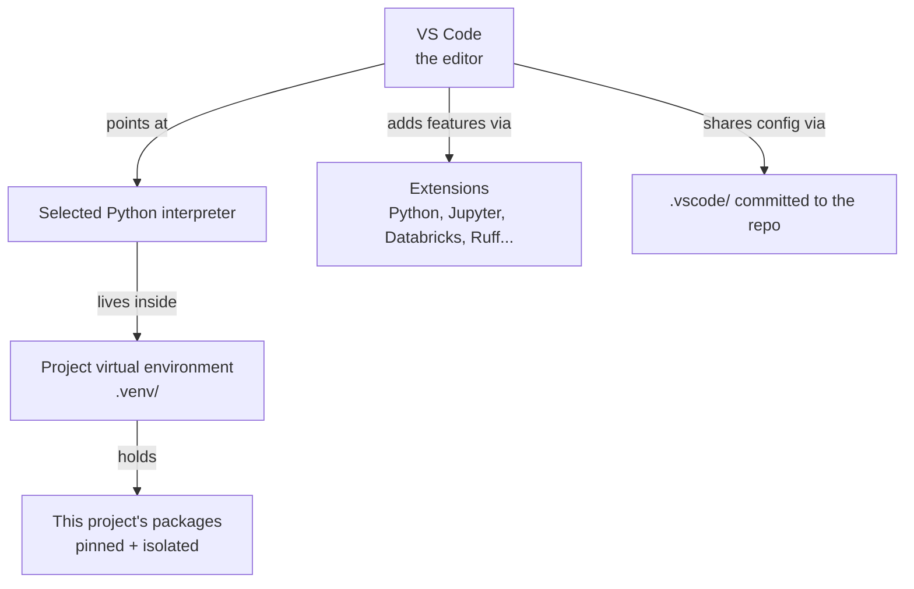
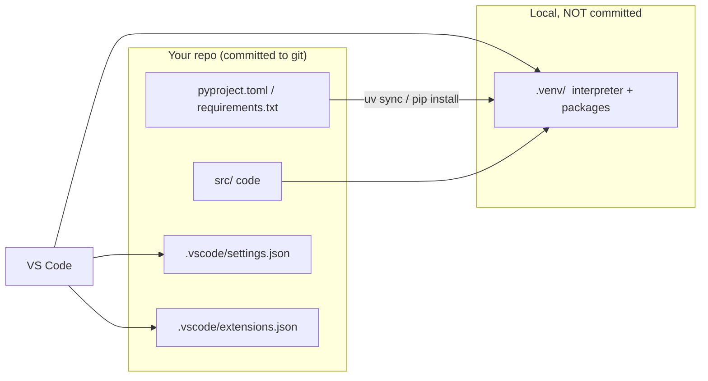

# Setting Up VS Code for AI Engineering

> Watch a good cook before the burners even come on. They measure the flour, dice the onion, line up little bowls of salt and spice, and wipe the counter clear. Chefs call it *mise en place* — everything in its place. When the heat is on, they never scramble for a knife; the work flows because the station was set. Setting up VS Code is your mise en place. Ten quiet minutes now, and every project after flows.

You already know this feeling from Databricks. A job fails at 2am not because the logic was wrong but because the cluster had the wrong library version, or a notebook silently picked up a package that only lived on one machine. Environment problems are the quiet tax on data work. A well-set-up editor is how you stop paying it.

This lesson turns a blank VS Code install into a professional Python and AI workbench. We will pick an interpreter, create an isolated virtual environment, meet the integrated terminal, handle workspace trust, and install the handful of extensions that actually earn their place. Nothing here is Databricks-only — most of it is exactly how you would set up for *any* serious AI project — but we will anchor each piece to the Databricks work ahead.

## Learning Objectives

By the end of this lesson, you will be able to:

- Install VS Code and select a **Python interpreter** for a project.
- Create and activate a **virtual environment** with `venv` or `uv`, and explain why isolation mirrors a reproducible cluster.
- Use the **integrated terminal** without leaving the editor, and understand **workspace trust**.
- Install and reason about the **essential extensions** — Python + Pylance, Jupyter, Databricks, Ruff, GitLens, YAML, and optionally Docker.
- Commit a shared `.vscode/settings.json` and `.vscode/extensions.json` so your whole team gets the same setup.

## Prerequisites

Before this lesson, it helps to have read:

- [Why VS Code Over Notebooks](/agentic-coding/vscode/why-vscode-over-notebooks) — the case for treating AI work as real software, which motivates everything here.

If you know what a Python package is and have opened a terminal before, you are ready. We will explain the rest as it comes up.

## Estimated Reading Time

About 20 to 25 minutes, plus 15 minutes at your keyboard to actually set things up. Do it once, and every future lesson in this subtopic starts from a clean, shared baseline.

## Business Motivation

Meet **Maya**, a data engineer at **Northwind Trust**, a mid-sized financial services firm. She has spent two years living in Databricks notebooks, and she is good at it. Now the team wants to ship *agents* — governed AI services, not one-off analyses — and her lead has asked her to build them like real software: in a repo, with tests, reviewed and deployed through CI.

Maya opens VS Code on a fresh laptop and hits the wall everyone hits. She `pip install`s a library, it lands in her system Python, and a week later a teammate cannot run her code because their system Python is different. Sound familiar? It is the exact same failure mode as a Databricks job that only works on one cluster because someone installed a package by hand.

The fix is boring and powerful: give every project its own isolated environment, pin what it needs, and make the setup shareable so the whole team is identical. That is what a proper VS Code station buys Northwind Trust — fewer "works on my machine" fire drills, faster onboarding, and code that behaves the same locally, in CI, and on Databricks. Ten minutes of mise en place pays for itself the first time a new engineer clones the repo and it just runs.

## Intuition

Here is the whole setup in one picture. VS Code is the workbench. It does not *contain* Python; it *points at* a Python interpreter you choose per project. That interpreter lives inside a virtual environment so each project's tools stay separate.



*Diagram 1: The workbench model. VS Code stays thin and points at a per-project interpreter inside a virtual environment. Extensions add capabilities; the committed `.vscode/` folder makes the setup reproducible for the team.*

The key mental shift: **the editor is generic, the environment is specific.** One VS Code install works across dozens of projects, and each project brings its own isolated Python. This is the same discipline as never installing packages directly on a shared cluster — you keep environments reproducible and per-workload.

## Core Concepts

A few plain definitions so the rest of the lesson reads easily.

- **VS Code:** A free, cross-platform code editor from Microsoft. Lightweight on its own; you shape it with extensions.
- **Python interpreter:** The actual `python` executable that runs your code. A machine can have several (system Python, a Homebrew Python, one inside each virtual environment). VS Code lets you pick which one a project uses.
- **Virtual environment (venv):** A self-contained folder (conventionally `.venv/`) holding a copy of a Python interpreter plus only the packages that project needs. Activating it makes `python` and `pip` resolve to that folder instead of your system.
- **`uv`:** A fast, modern Python package and environment manager (from Astral, the makers of Ruff). It creates virtual environments and installs packages far faster than `pip`, and can pin exact versions in a lockfile.
- **Extension:** A plugin that teaches VS Code a new skill — language support, a linter, remote Databricks integration.
- **Workspace trust:** VS Code's safety gate. Opening a folder in "restricted mode" until you confirm you trust its contents, so a repo you cloned cannot silently run code.

Why isolation matters, stated once and clearly: without a virtual environment, every `pip install` mutates one shared Python, and projects fight over versions. With one, each project is a sealed box. This is the local mirror of what you already do on Databricks — a cluster or job environment with pinned libraries, so a run is reproducible. Same principle, same payoff.

## Deep Dive

Let's go one level deeper on the two choices that trip people up: which interpreter, and `venv` versus `uv`.

**Choosing the interpreter.** After you create an environment, you tell VS Code to use it. The command is `Python: Select Interpreter` from the Command Palette (open it with `Cmd+Shift+P` on macOS, `Ctrl+Shift+P` on Windows/Linux). Pick the interpreter whose path ends in your project's `.venv`. Once selected, VS Code remembers it per workspace and uses it for running, debugging, linting, and the terminal. Getting this wrong is the number-one cause of "but I installed it!" confusion — you installed into one interpreter and VS Code is pointing at another.

**`venv` versus `uv`.** Both give you an isolated environment; they differ in speed and ergonomics.

- **`venv`** ships with Python itself. Zero to install, universally understood, perfect for a first project or a minimal machine.
- **`uv`** is a separate tool you install once, then use everywhere. It resolves and installs dependencies dramatically faster, manages Python versions for you, and produces a lockfile (`uv.lock`) that pins *exact* versions — the reproducibility Northwind Trust wants for code that must behave identically in CI and on Databricks.

A fair rule of thumb: reach for `venv` when you want zero setup, and `uv` when the project is real and shared. We will show both. The commands and flags below are stable today, but tooling moves fast — verify anything version-specific in the [`uv` docs](https://docs.astral.sh/uv/).

:::tip
You do not have to choose forever. A project can start on `venv` and move to `uv` later — both just produce a `.venv/` folder that VS Code points at the same way.
:::

## Architecture

Here is how the pieces connect once a project is set up, and where each piece of configuration lives.



*Diagram 2: What is shared versus what is local. The `.vscode/` config and dependency files are committed so teammates share the setup; the `.venv/` folder is generated locally and git-ignored. A teammate clones, runs one install command, points at the interpreter, and matches you exactly.*

The load-bearing idea: **commit the recipe, not the meal.** You commit `pyproject.toml`/`requirements.txt` (what to install) and `.vscode/` (how the editor should behave), but you `.gitignore` the `.venv/` folder itself. Everyone rebuilds an identical environment from the same recipe.

## Step-by-Step Walkthrough

Follow along as Maya sets up her new machine. No screenshots — UI details drift — just the durable steps.

1. **Install VS Code.** Download from [code.visualstudio.com](https://code.visualstudio.com/docs) and install. On first launch, pick a color theme and move on.
2. **Install Python** (if needed). VS Code does not include it. Get it from python.org, your OS package manager, or let `uv` manage it.
3. **Open the project folder.** `File → Open Folder`. VS Code is folder-centric: the open folder *is* your workspace.
4. **Handle workspace trust.** For your own folder, click **Trust**. Restricted mode is a feature, not an annoyance — leave repos you did not write untrusted until you have looked at them.
5. **Create a virtual environment** (commands in the next section).
6. **Select the interpreter.** `Cmd/Ctrl+Shift+P → Python: Select Interpreter → the `.venv` one`.
7. **Install extensions** (the curated list below).
8. **Add `.vscode/settings.json` and `.vscode/extensions.json`**, then commit them.

At the end, Maya can close everything, reopen the folder, and VS Code snaps back to exactly this state. That repeatability is the point.

## Hands-on Examples

Concrete commands. Run these in the integrated terminal (open it with ``Ctrl+` `` — the backtick key). The terminal opens *inside* your project folder and, once you have selected the interpreter, VS Code auto-activates the environment for new terminals.

**Option A — `venv` (built in, zero install):**

```bash
# From your project folder. python3 on macOS/Linux, python on Windows.
python3 -m venv .venv

# Activate it:
source .venv/bin/activate        # macOS / Linux
# .venv\Scripts\Activate.ps1     # Windows PowerShell

# Your prompt now shows (.venv). Install what you need:
pip install ruff pytest databricks-sdk

# Capture the recipe so teammates and CI match you:
pip freeze > requirements.txt
```

**Option B — `uv` (fast, lockfile-backed):**

```bash
# Install uv once (see the docs for the current installer for your OS):
#   curl -LsSf https://astral.sh/uv/install.sh | sh    # macOS / Linux

# Start (or adopt) a project — creates pyproject.toml:
uv init            # skip if the project already has pyproject.toml

# Add dependencies; uv creates .venv/ and writes uv.lock automatically:
uv add ruff pytest databricks-sdk

# A teammate reproduces your exact environment with one command:
uv sync
```

*Verify the `uv` installer command and flags in the [current docs](https://docs.astral.sh/uv/) — install scripts and subcommands evolve.*

Either way you end up with a `.venv/` folder. Now point VS Code at it:

```text
Cmd/Ctrl+Shift+P  →  Python: Select Interpreter  →  choose ./.venv/bin/python
```

:::warning
Add `.venv/` to your `.gitignore`. It is large, machine-specific, and regenerated from your dependency files. Committing it bloats the repo and causes cross-platform breakage. Commit `requirements.txt` / `pyproject.toml` + `uv.lock` instead — the recipe, not the meal.
:::

## Code Examples

Two small files make your setup a team asset. Put both in a `.vscode/` folder at the repo root and commit them.

**`.vscode/settings.json` — how the editor behaves in this repo:**

```json
{
  // Format automatically when you save, using Ruff.
  "editor.formatOnSave": true,
  "editor.defaultFormatter": "charliermarsh.ruff",
  "editor.codeActionsOnSave": {
    "source.organizeImports": "explicit"
  },
  // Use the project's own environment, not system Python.
  "python.defaultInterpreterPath": "${workspaceFolder}/.venv/bin/python",
  // Run tests with pytest.
  "python.testing.pytestEnabled": true,
  // Trim noise; keep files tidy.
  "files.trimTrailingWhitespace": true,
  "files.insertFinalNewline": true
}
```

These settings apply only to this workspace, so different projects can differ — and because the file is committed, every teammate who opens the repo gets format-on-save and pytest wired up for free. (Setting *keys* occasionally change between extension versions; if one is ignored, check the extension's page.)

**`.vscode/extensions.json` — the extensions this repo recommends:**

```json
{
  "recommendations": [
    "ms-python.python",
    "ms-python.vscode-pylance",
    "ms-toolsai.jupyter",
    "databricks.databricks",
    "charliermarsh.ruff",
    "eamodio.gitlens",
    "redhat.vscode-yaml"
  ]
}
```

When a teammate opens the folder, VS Code shows a gentle "this workspace recommends these extensions — install?" prompt. One click and their editor matches yours. This is the quiet backbone of a consistent team.

Here is what each recommended extension earns:

| Extension | Why it is here |
| --- | --- |
| **Python** (`ms-python.python`) | Core language support: run, debug, environment selection. |
| **Pylance** | Fast type-aware IntelliSense, autocomplete, and inline errors. |
| **Jupyter** | Run notebooks and `# %%` cells inside VS Code — the bridge from your notebook past. |
| **Databricks** | Connect to your workspace, browse Unity Catalog, run on a cluster, sync code. The next lesson. |
| **Ruff** | Lightning-fast linter *and* formatter in one — replaces several older tools. |
| **GitLens** | Rich git: blame, history, and who-changed-what inline. |
| **YAML** | Schema-aware editing for `databricks.yml`, CI configs, and bundles. |
| **Docker** *(optional)* | Add it if you build or run containers for local services or deployment. |

*Extension IDs and names occasionally change; if one will not install by ID, search the Marketplace by name and verify the publisher.*

## Production Considerations

Setup is not a one-time personal chore — it is part of how the team ships reliably.

- **Commit `.vscode/` and dependency files.** The environment recipe is project infrastructure, exactly like CI config. Review it in PRs.
- **Match local, CI, and Databricks.** Pin versions (`uv.lock` or a fully pinned `requirements.txt`) so the environment that passes tests locally is the one CI runs and the one your Databricks job or Asset Bundle uses. This is the whole reproducibility story that leads into a [repo-first project](/agentic-coding/vscode/repo-first-project).
- **Pin the Python version too.** "Python 3.11" is not enough if CI runs 3.12 and a dependency behaves differently. `uv` can pin the interpreter version in `pyproject.toml`.
- **Keep the extension list intentional.** A short, agreed `extensions.json` beats forty personal extensions no one else has. Recommend the ones the project needs; leave taste to individuals.

## Team & Collaboration Considerations

A shared setup is how a team of engineers acts like one engineer with many hands.

- **Onboarding becomes a checklist, not a rite of passage.** Clone → `uv sync` (or `pip install -r requirements.txt`) → select interpreter → accept recommended extensions. A new hire is productive in minutes, not a day.
- **Fewer "works on my machine" tickets.** When everyone runs the same pinned environment with the same formatter, diffs are clean and bugs are real bugs, not whitespace or version drift.
- **Format-on-save ends style debates.** Ruff reformats consistently, so code review discusses *logic*, not spacing. The diff you push is the diff a teammate would have produced.
- **Document the setup once.** A short "Getting started" in the repo README that points here saves every future teammate the same questions.

## Security Considerations

A workbench is also an attack surface. A few habits keep it clean.

- **Respect workspace trust.** When you open an unfamiliar cloned repo, leave it in restricted mode until you have skimmed it. A malicious `.vscode/` or task can run code the moment you trust the folder.
- **Review recommended extensions and their publishers.** Extensions run with your privileges. Install from known publishers (Microsoft, Databricks, Astral/`charliermarsh`) and be wary of typosquatted look-alikes.
- **Never commit secrets in `.vscode/` or the environment.** No workspace tokens, no PATs, no connection strings in `settings.json`. Use environment variables or the Databricks CLI's profile store, and keep `.env` files git-ignored.
- **Vet dependencies you add.** Every `uv add` or `pip install` pulls third-party code into your environment. A lockfile at least makes *what* you pulled auditable and repeatable.

## Common Mistakes

Almost everyone hits a few of these early.

- **Installing into system Python.** `pip install` with no environment active mutates the global interpreter and starts version wars. Always create and activate a `.venv` first.
- **Selecting the wrong interpreter.** VS Code points at system Python while your packages live in `.venv`, so imports "mysteriously" fail. Re-run `Python: Select Interpreter`.
- **Committing `.venv/`.** Bloats the repo and breaks across OSes. Git-ignore it; commit the recipe.
- **Forgetting to reopen the terminal after selecting an interpreter.** New terminals auto-activate the environment; a terminal you opened *before* selecting will not. Open a fresh one.
- **Extension sprawl.** Forty extensions slow startup and muddy the shared setup. Keep the project's `extensions.json` lean.
- **Skipping `.vscode/` in the repo.** Then every teammate reinvents the config, and consistency evaporates.

## Best Practices

A short checklist you can lean on:

- **One virtual environment per project**, named `.venv`, git-ignored.
- **Pin everything** — packages and Python version — with a lockfile so local, CI, and Databricks match.
- **Commit `.vscode/settings.json` and `.vscode/extensions.json`** so the team shares one setup.
- **Turn on format-on-save with Ruff** and let the tool end style debates.
- **Prefer `uv` for real projects**, `venv` for quick throwaways.
- **Verify version-specific details** — installer commands, extension IDs, setting keys — in current docs, because they drift.

## Interview Questions

Practice saying these out loud; teaching a thing simply proves you know it.

1. **Why does each project get its own virtual environment?**
   Look for: isolation prevents version conflicts between projects; it makes environments reproducible; it mirrors pinned cluster/job environments on Databricks so code behaves the same everywhere.

2. **What is the difference between `venv` and `uv`, and when would you pick each?**
   Look for: `venv` is built into Python, zero install, great for quick work; `uv` is a faster external tool that manages Python versions and produces a lockfile for exact reproducibility — preferred for real, shared projects.

3. **You `pip install`ed a package but VS Code says it cannot import it. What is likely wrong?**
   Look for: VS Code is pointed at a different interpreter than the one you installed into. Fix with `Python: Select Interpreter`, choose the `.venv`, and open a fresh terminal.

4. **What do you commit for a shared setup, and what do you deliberately not commit?**
   Look for: commit `pyproject.toml`/`requirements.txt` (+ lockfile) and `.vscode/settings.json` and `extensions.json`; git-ignore `.venv/` and any secrets/`.env`. Commit the recipe, not the meal.

5. **What is workspace trust and why does it matter?**
   Look for: VS Code opens unfamiliar folders in restricted mode so a repo cannot silently run code; you trust a folder only after reviewing it. It is a real security control, not a nuisance.

## Quiz

Try to answer before opening each toggle.

**Q1.** You run `pip install pandas` with no environment active. Where does it go, and why is that a problem?

<details>
<summary>Show answer</summary>

It installs into your **system (global) Python**. That is a problem because every project then shares one Python, so their package versions collide, and your setup is no longer reproducible for teammates or CI. Create and activate a `.venv` first.

</details>

**Q2.** Which file makes VS Code prompt teammates to install the same extensions, and where does it live?

<details>
<summary>Show answer</summary>

`.vscode/extensions.json`, at the repo root, with a `"recommendations"` list of extension IDs. When a teammate opens the folder, VS Code offers to install them. Commit it so the whole team shares one setup.

</details>

**Q3.** True or false: you should commit the `.venv/` folder so teammates get the exact same packages.

<details>
<summary>Show answer</summary>

**False.** Commit the *recipe* — `pyproject.toml`/`requirements.txt` plus a lockfile — and git-ignore `.venv/`. The folder is large, machine- and OS-specific, and regenerated with `uv sync` or `pip install -r requirements.txt`.

</details>

**Q4.** How is a local virtual environment conceptually like a Databricks cluster or job environment?

<details>
<summary>Show answer</summary>

Both isolate and pin the exact packages a workload needs so runs are reproducible. A `.venv` does this for your local code; a cluster/job environment does it on Databricks. Pinning both so they match is what makes code behave the same locally, in CI, and in production.

</details>

## Summary

You turned a blank editor into a professional workbench. VS Code stays thin and points at a per-project **Python interpreter** that lives inside an isolated **virtual environment** — `venv` for quick work, `uv` when reproducibility matters. You met the **integrated terminal** and **workspace trust**, installed the extensions that earn their place (Python + Pylance, Jupyter, Databricks, Ruff, GitLens, YAML, optionally Docker), and — most importantly — captured it all in a committed `.vscode/` folder plus a pinned dependency recipe so your whole team is identical.

The through-line is the one you already know from clusters: **isolate, pin, and make it reproducible.** Do that locally and your code will behave the same on your laptop, in CI, and on Databricks. Your station is set. Now the heat can come on.

## Key Takeaways

- The editor is **generic**; the environment is **specific**. One VS Code, one isolated `.venv` per project.
- **Isolation mirrors reproducible clusters** — the same discipline that keeps Databricks jobs from breaking.
- Use **`venv`** for zero-setup work and **`uv`** for fast, lockfile-backed, shareable projects.
- Always **select the right interpreter**; a mismatch is the top cause of "but I installed it!"
- Commit **`.vscode/settings.json`**, **`.vscode/extensions.json`**, and a **pinned dependency recipe**; git-ignore `.venv/` and secrets.
- Respect **workspace trust** and vet extensions — the workbench is also an attack surface.

## Glossary

- **VS Code:** A free, extensible code editor; thin on its own, shaped by extensions.
- **Python interpreter:** The `python` executable that runs your code; VS Code lets you pick one per project.
- **Virtual environment (`.venv`):** An isolated folder holding a project's own interpreter and packages.
- **`venv`:** Python's built-in tool for creating virtual environments.
- **`uv`:** A fast Python package/environment manager that pins versions in a lockfile.
- **Ruff:** A fast Python linter and formatter, configured here to run on save.
- **Pylance:** The language server providing type-aware IntelliSense for Python in VS Code.
- **Integrated terminal:** A shell embedded in VS Code, opened inside the current project.
- **Workspace trust:** VS Code's safety gate that restricts an unfamiliar folder until you trust it.
- **`.vscode/`:** A committed folder of per-workspace settings and extension recommendations.

## Further Reading

- [VS Code documentation](https://code.visualstudio.com/docs)
- [VS Code: Getting started with Python](https://code.visualstudio.com/docs/python/python-tutorial)
- [`uv` documentation (Astral)](https://docs.astral.sh/uv/)
- [Ruff documentation (Astral)](https://docs.astral.sh/ruff/)
- [The Databricks AI track — what you'll be coding](/docs/intro)

## Next Lesson

Your workbench is set. Next, plug it into Databricks: connect to your workspace, browse Unity Catalog, and run code on remote compute — all from the editor.

➡️ [The Databricks Extension for VS Code](/agentic-coding/vscode/databricks-extension)
