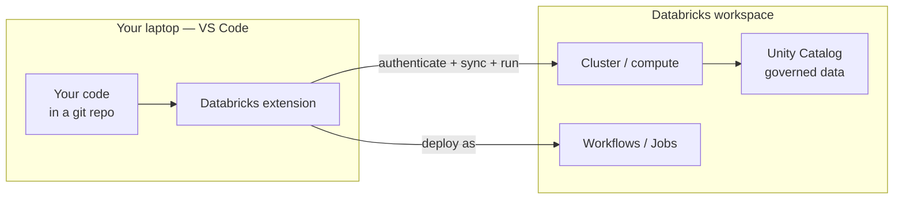
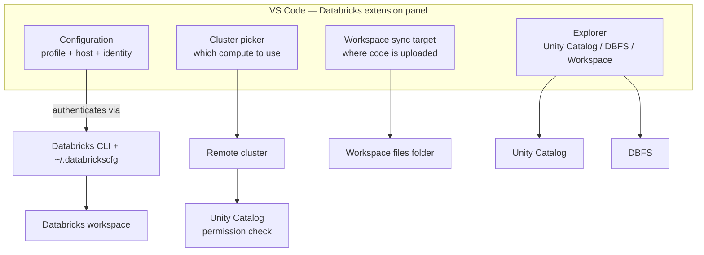

# The Databricks Extension for VS Code

> Think of a garage-door remote. The heavy machinery — the motor, the rails, the door itself — lives in the garage. The little remote in your car does not *contain* any of that; it just proves who you are and sends a signal. Press the button, and the real machinery moves. The Databricks extension for VS Code is that remote. Your laptop stays light; the compute, the data, and the governance all live in the workspace. The extension is the bridge that lets you press the button from your editor.

You have spent your career editing code in one place and running it somewhere heavier — Spark on a cluster, jobs on a schedule, ETL against tables you do not keep on your laptop. Notebooks in the Databricks UI blurred that line: the editor and the engine were the same web page. Moving to VS Code seems to break the connection. How does a file on your MacBook run against a cluster in the cloud?

The answer is the **Databricks extension for VS Code**. It is the official bridge from your local editor into your Databricks workspace. It handles the boring-but-critical parts — proving who you are, picking which cluster to use, keeping your local files in step with the workspace — so you can keep writing code the way software engineers do while still reaching production-grade compute and governed data.

Take this slowly. Nothing here replaces what you know about clusters or Unity Catalog. It just puts a remote control in your hand.

## Learning Objectives

By the end of this lesson, you will be able to:

- Explain what the Databricks extension for VS Code does and why it pairs with **Databricks Connect**.
- Install and configure the extension, and authenticate using a **configuration profile** in `~/.databrickscfg`.
- Choose between **OAuth (U2M)** and **personal access tokens**, and select a workspace host.
- Navigate the extension's UI panels: Configuration, Cluster picker, Workspace sync target, and the Explorer for Unity Catalog, DBFS, and the Workspace.
- Run a Python file or notebook on a remote cluster with **Run on Databricks** / **Upload and Run**, and run code as a **Workflow (job)**.
- Explain how governance still applies: everything runs under **your workspace identity** and **Unity Catalog permissions**.

## Prerequisites

Before this lesson, it helps to have:

- Set up VS Code for AI work — see [Set up VS Code for AI](/agentic-coding/vscode/setup-vscode-for-ai). You want Python, a virtual environment, and the basic editor comforts in place.
- A Databricks workspace you can log into, and at least one cluster or SQL warehouse you are allowed to use.
- A working familiarity with [Unity Catalog](/docs/intro) as Databricks' governance layer.

If you have ever run a notebook in the Databricks UI, you already have the mental model this lesson builds on.

## Estimated Reading Time

About 20 to 25 minutes, plus 10 minutes if you follow the setup on your own machine. There is a little installation, but no heavy theory.

## Business Motivation

Let's ground this in a story we'll keep returning to across the site.

**Northwind Trust** is a mid-sized financial services firm. **Maya** is a data engineer there, and she has just been asked to build an AI agent that answers questions about customer transactions. For years, Maya's team did everything in the Databricks notebook UI. It was convenient — click a cell, run it on the cluster — but it did not feel like *software*. There were no pull requests worth the name, no local unit tests, no linters, and reviewing a notebook diff was miserable.

Maya wants to work the way her application-engineer colleagues do: in VS Code, with a git repo, tests, and a real debugger. But her code still needs to run against Northwind's cluster and read governed tables in Unity Catalog. She cannot copy the transactions table to her laptop — it is large, sensitive, and regulated.

The Databricks extension solves exactly this tension. Maya keeps her code local, in a proper repo, and uses the extension as a bridge: authenticate once, pick the cluster, and run her file *on Databricks* with one command. The heavy lifting stays in the workspace, under Northwind's existing governance, while her development experience becomes modern and testable.

That is the payoff: the ergonomics of a real editor, without giving up the compute, the data, or the guardrails that live in the workspace.

## Intuition

Here is the whole idea in one picture. Your laptop is light. The workspace is heavy. The extension is the bridge between them.



*Diagram 1: The extension bridges your local editor and the remote workspace. You edit locally; the code runs on the cluster; the data never leaves Unity Catalog's governance.*

Notice what does *not* happen: the data does not come to your laptop, and the cluster does not live on your laptop. Only two lightweight things cross the bridge — your *identity* (so the workspace knows it is you) and your *code* (synced up so the cluster can run it). Everything else stays where it belongs.

If you have used SSH to run a command on a remote server, this will feel familiar. The extension is a friendlier, Databricks-aware version of that idea, with governance baked in.

## Theory

Let's put names to the pieces so the rest of the lesson reads easily.

**The Databricks extension for VS Code** is an official extension, published by Databricks on the VS Code Marketplace, that connects your editor to a workspace. It gives you three core abilities:

1. **Authenticate** — prove who you are to the workspace, using a stored configuration profile.
2. **Sync** — keep your local project in step with a folder in the workspace, so the cluster can see your code.
3. **Run** — execute a Python file or notebook on remote compute, or deploy it as a job — all from the editor.

Under the hood, the extension leans on two companions you should know by name:

- **The Databricks CLI** — a command-line tool that talks to the workspace's REST APIs. The extension uses it (and shares its configuration file) to authenticate and manage resources. You can also drive the CLI directly.
- **Databricks Connect** — a library that lets your *local* Python process open a remote Spark session on a cluster. The extension pairs with it. We tease this in the [next lesson](/agentic-coding/vscode/databricks-connect); for now, just know the extension and Databricks Connect are two halves of a whole. The extension handles connection, sync, and "run the whole file remotely"; Databricks Connect handles "run just this Spark code against the cluster, interactively, from my local interpreter."

:::note Two ways to "run remotely"
Do not confuse them. **Run on Databricks** (via the extension) uploads your file and runs the *entire* file as a job or on the cluster, then streams results back. **Databricks Connect** runs your local Python locally, but ships the *Spark parts* to the cluster as you go. Same goal — remote compute — different mechanism. This lesson covers the first; the next covers the second.
:::

## Deep Dive

Let's open up authentication, because it is where most people get stuck, and where governance begins.

### Configuration profiles and `~/.databrickscfg`

Both the Databricks CLI and the extension read authentication from a plain text file in your home directory: `~/.databrickscfg`. It holds one or more **configuration profiles**. A profile is a named bundle of "which workspace, and how do I prove who I am." A minimal file looks like this:

```ini
[DEFAULT]
host  = https://northwind.cloud.databricks.com

[northwind-oauth]
host       = https://northwind.cloud.databricks.com
auth_type  = databricks-cli

[northwind-pat]
host  = https://northwind.cloud.databricks.com
token = dapi0123456789abcdef...
```

*The exact keys evolve — verify field names in the [Databricks CLI docs](https://docs.databricks.com/aws/en/dev-tools/cli/).*

Each `[bracketed]` name is a profile. The `host` is the workspace URL. The rest describes the authentication method. You will usually let a tool *write* this file for you rather than hand-editing it.

### OAuth (U2M) vs personal access tokens

There are two common ways to authenticate as a human being:

- **OAuth user-to-machine (U2M).** You run a login command, a browser window opens, you log in to Databricks the normal way (including your company's SSO and MFA), and the tool receives a short-lived token it refreshes automatically. Nothing long-lived is written to disk. This is the **recommended** path for interactive development.
- **Personal access token (PAT).** You generate a long-lived token string in the workspace UI and paste it into your profile. It is simple and works everywhere, but it is a static secret: if it leaks, someone else can act as you until it is revoked. Treat it like a password.

For Maya at a regulated firm, OAuth (U2M) is the clear default — it inherits Northwind's SSO and MFA, and there is no durable secret sitting in a file on her laptop. PATs are a fallback for environments where the browser flow is awkward, or for automation where a **service principal** (a non-human identity) is more appropriate.

:::warning Tokens are secrets
Never commit `~/.databrickscfg` or any PAT to git. Never paste a token into a notebook, a log, or a chat. If a PAT ever appears somewhere it should not, revoke it in the workspace immediately. OAuth avoids this whole class of mistake.
:::

### The identity is the point

Whichever method you pick, you are authenticating **as a specific identity** — you, or a service principal. That identity is what Unity Catalog checks on every query. The extension does not grant you new powers; it carries your existing ones across the bridge. If you cannot read the `transactions` table in the workspace UI, you cannot read it from VS Code either. Hold onto that — it is the security spine of this whole lesson, and it mirrors the governance model you saw with [MCP](/docs/agents-tools-mcp/mcp): the tool standardizes *how* you reach the resource; Unity Catalog still decides *whether* you may.

## Architecture

Now let's see how the panels and the workspace connect. When you open the Databricks view in VS Code's sidebar, you get a small control panel; behind it sits the workspace.



*Diagram 2: The extension's panels map onto real workspace concepts. Configuration establishes identity; the Cluster picker chooses compute; the sync target chooses where code lands; the Explorer browses governed data. Every data access still passes a Unity Catalog check.*

The four panels are worth knowing by name, because the Databricks docs and the UI use these terms:

- **Configuration** — shows the active profile, workspace host, and the identity you are logged in as. This is where you switch profiles or re-authenticate.
- **Cluster picker** — lets you attach to an existing cluster (or start one). This is the compute your code runs on.
- **Workspace sync target** — the folder *in the workspace* where the extension uploads a mirror of your local project so the cluster can see it. Think of it as the remote landing zone for your code.
- **Explorer** — a tree view to browse **Unity Catalog** (catalogs → schemas → tables), **DBFS**, and the **Workspace** file tree, without leaving the editor.

*Panel names and layout change between extension versions — verify against the [extension docs](https://docs.databricks.com/aws/en/dev-tools/vscode-ext/).*

## Step-by-Step Walkthrough

Let's follow Maya connecting her laptop to Northwind's workspace. No code yet — just the story, so the shape is clear.

1. **Install the extension.** Maya opens the Extensions view in VS Code, searches for "Databricks," and installs the official one published by Databricks.
2. **Open her project folder.** She opens her agent repo as the VS Code workspace folder. The extension asks to initialize Databricks configuration for this project.
3. **Pick a workspace host.** The extension prompts for the workspace URL. Maya enters `https://northwind.cloud.databricks.com`.
4. **Authenticate with OAuth.** She chooses OAuth (U2M). A browser opens, she logs in through Northwind's SSO with MFA, and the extension confirms she is connected as `maya@northwind.com`. A profile is saved to `~/.databrickscfg`.
5. **Pick a cluster.** In the Cluster picker, she attaches to the shared `analytics-dev` cluster she is allowed to use.
6. **Confirm the sync target.** The extension proposes a workspace folder to mirror her code into. She accepts the default.
7. **Browse Unity Catalog.** In the Explorer, she expands `main` → `northwind` → `transactions` and confirms she can see the table she needs — proof her identity carried across correctly.
8. **Run a file.** She opens `explore_transactions.py` and clicks **Run on Databricks**. The extension syncs her code up, runs it on `analytics-dev`, and streams the output back into VS Code.

That is the entire first-run experience. After this, day-to-day it is just: open the file, press run, read the output — like any other editor, except the engine is a cluster.

## Hands-on Examples

Let's make the setup concrete. These commands and clicks reflect the current shape of the tools; **CLIs and extensions change often**, so confirm exact syntax in the [CLI docs](https://docs.databricks.com/aws/en/dev-tools/cli/) and [extension docs](https://docs.databricks.com/aws/en/dev-tools/vscode-ext/) before you rely on them.

**1 — Install the Databricks CLI (the extension's companion).**

```bash
# macOS / Linux (Homebrew)
brew tap databricks/tap
brew install databricks

# verify
databricks --version
```

**2 — Authenticate with OAuth (U2M) and create a profile.**

```bash
# Opens a browser to log in; writes a profile to ~/.databrickscfg
databricks auth login \
  --host https://northwind.cloud.databricks.com \
  --profile northwind-oauth
```

This is the same login the extension performs behind its "Sign in" button. Doing it once on the CLI means both the CLI and the extension share the credential. No token is stored in plain text — OAuth manages a short-lived, auto-refreshed token.

**3 — Confirm who you are.**

```bash
databricks current-user me --profile northwind-oauth
# -> shows your userName, e.g. maya@northwind.com
```

If this returns your identity, the bridge is up. Everything the extension does will run as this user, checked against Unity Catalog.

**4 — Run a Python file on the cluster from VS Code.**

Open the file in the editor and use the **Run on Databricks** command (from the Run menu, the top-right run control, or the command palette). Conceptually, the file might be:

```python
# explore_transactions.py — runs ON the cluster via the extension
from pyspark.sql import SparkSession

spark = SparkSession.builder.getOrCreate()

df = spark.table("main.northwind.transactions")
print("Row count:", df.count())
df.groupBy("account_tier").count().show()
```

When Maya clicks **Run on Databricks**, the extension uploads this file to the workspace sync target, executes it on `analytics-dev`, and streams `stdout` back into a VS Code terminal. The `spark.table(...)` call reads the governed table — and only succeeds because Maya's identity has `SELECT` on it.

**5 — Run a notebook remotely with "Upload and Run."**

For a `.py` notebook (or an `.ipynb`), the extension offers **Upload and Run File** — it pushes the notebook to the workspace and runs it there, so you see notebook-style cell outputs while keeping the source file in your local repo and git history.

**6 — Run your code as a Workflow (job).**

The same file can be launched as a **Workflow / job** run from the extension — it wraps your file in a one-off job on the cluster. This is the bridge between "I'm iterating interactively" and "this should run as a scheduled, retryable job." When the logic is stable, you graduate it into a proper, version-controlled job definition — which is exactly what [Asset Bundles](/agentic-coding/vscode/asset-bundles) are for.

## Production Considerations

A few habits that keep this smooth as you move past experiments.

- **Use one profile per workspace, named clearly.** `northwind-dev` and `northwind-prod` beat relying on `DEFAULT`. It prevents the classic "I ran that against production by accident" mistake.
- **Prefer OAuth (U2M) for humans, service principals for automation.** Interactive work should use the browser login. Anything unattended (CI, scheduled jobs) should authenticate as a service principal, not your personal token.
- **Keep the sync target boundaries clean.** The synced workspace folder is a mirror of your repo, not a shared scratchpad. Do not hand-edit files there; edit locally and let sync push them up.
- **Let git be the source of truth.** The extension is how you *run* code; git is how you *store* it. Commit locally, open PRs, and treat the workspace copy as disposable. This sets up the [repo-first workflow](/agentic-coding/vscode/repo-first-project).
- **Graduate stable work into Asset Bundles.** "Run as a job" from the extension is great for a quick check. For anything recurring, define it as code so it is reviewable and reproducible.

## Team & Collaboration Considerations

The extension changes how a team works together, mostly for the better.

- **Reviewable diffs.** Because code lives in a local repo as plain files, pull requests show real diffs — a night-and-day improvement over reviewing notebook JSON. Maya's teammates can actually review her agent code.
- **Shared vs. personal compute.** Decide as a team whether people attach to shared dev clusters or spin up personal ones. Shared clusters are cheaper but noisier; personal clusters isolate work. Document the convention.
- **Consistent profiles.** Agree on profile names across the team (`<company>-dev`, `<company>-prod`) so runbooks and docs are portable between laptops.
- **Onboarding is faster.** A new engineer installs the extension, runs one `databricks auth login`, and is productive — no bespoke notebook setup.
- **Portable skills.** Much of this — running local code against remote compute, keeping secrets out of the repo, reviewing real diffs — is standard software practice. It transfers to non-Databricks AI work too.

## Security Considerations

Read this part twice; it is reassuring once it clicks.

- **You act as yourself.** Every run and every query executes under your workspace identity. The extension carries your permissions across the bridge — it does not expand them. No access in the UI means no access from VS Code.
- **Unity Catalog governs data access.** When your remote code reads `main.northwind.transactions`, Unity Catalog checks your grants, exactly as it would in a notebook. Governance is not something the extension can bypass.
- **Prefer OAuth over PATs.** OAuth keeps only short-lived, auto-refreshed tokens and inherits your org's SSO/MFA. PATs are long-lived secrets — powerful and dangerous. If you must use one, scope it, expire it, and store it carefully.
- **Never commit credentials.** Add `~/.databrickscfg` to your global gitignore mindset. Keep tokens out of code, notebooks, logs, and screenshots.
- **Data stays in the workspace.** By design, the heavy data does not land on your laptop. Query results you print will surface locally, so be mindful of displaying sensitive rows — the same care you would take in any tool.
- **Audit trails still work.** Because you run as an identifiable identity, the workspace's audit logs record who did what. For a regulated firm like Northwind, that traceability is not optional.

## Common Mistakes

Everyone hits a few of these early. Spotting them saves hours.

- **Confusing "Run on Databricks" with Databricks Connect.** The extension runs the *whole file* remotely; Databricks Connect runs local Python that ships *Spark calls* to the cluster. Different mechanisms — pick the one that fits.
- **Editing files in the synced workspace folder.** That folder is a mirror. Edit locally; let sync push. Hand-editing the remote copy leads to confusing drift.
- **Committing `~/.databrickscfg` or a PAT.** A leaked token is a real incident. Use OAuth and keep secrets out of git.
- **Wrong or ambiguous profile.** Running against `DEFAULT` when you meant `dev` — or worse, `prod` — is a classic. Name profiles clearly and check the active one.
- **Assuming the extension grants access.** It does not. If a query fails with a permission error, that is Unity Catalog doing its job; the fix is a grant in the workspace, not a workaround in VS Code.
- **Forgetting the cluster is off.** If your run hangs, the attached cluster may be terminated and starting up. Check the Cluster picker.

## Best Practices

A short checklist to lean on:

- **Authenticate with OAuth (U2M)** for interactive work; reserve PATs and service principals for automation.
- **One clearly named profile per workspace/environment.** Never guess which one is active.
- **Keep code in git, run it through the extension.** Local repo is the source of truth; the workspace copy is disposable.
- **Browse Unity Catalog in the Explorer** to confirm access before you write the query — it is faster than debugging a permission error later.
- **Pair the extension with Databricks Connect** for a tight interactive loop, and with **Asset Bundles** for deployable jobs.
- **Verify current specifics.** The extension and CLI evolve; confirm command and menu names in the [official docs](https://docs.databricks.com/aws/en/dev-tools/vscode-ext/) before you script around them.

## Interview Questions

Practice saying these out loud. If you can explain it simply, you understand it.

1. **What does the Databricks extension for VS Code actually do?**
   Look for: it bridges a local editor to a remote workspace — authenticate, sync local code to a workspace folder, and run files/notebooks on remote compute or as jobs. It carries your identity across, so governance still applies.

2. **OAuth (U2M) vs personal access token — when and why?**
   Look for: OAuth is the recommended interactive method — short-lived, auto-refreshed, inherits SSO/MFA, no durable secret on disk. PATs are long-lived static secrets, a fallback or for simple automation; service principals are better for unattended work.

3. **What is `~/.databrickscfg` and what is a configuration profile?**
   Look for: a home-directory file, shared by the CLI and the extension, holding named profiles. Each profile bundles a workspace host and an auth method. Clear per-environment naming prevents running against the wrong workspace.

4. **How does the extension relate to Databricks Connect?**
   Look for: they pair. The extension handles connection, sync, and running whole files remotely / as jobs. Databricks Connect runs local Python and ships the Spark parts to a remote cluster for an interactive loop. Different mechanisms, same goal of remote compute.

5. **A colleague worries VS Code lets people bypass Unity Catalog. Reassure them.**
   Look for: it cannot. Every run executes under the user's identity; Unity Catalog checks permissions on every access, exactly as in a notebook. The extension carries existing permissions, never expands them, and audit logs still record who did what.

6. **What are the four main panels of the extension and what does each do?**
   Look for: Configuration (profile/host/identity), Cluster picker (which compute), Workspace sync target (where code is uploaded), and Explorer (browse Unity Catalog, DBFS, and the Workspace tree).

## Quiz

Try to answer before opening each toggle.

**Q1.** True or false: the Databricks extension lets you read tables you do not have permission to read in the workspace UI.

<details>
<summary>Show answer</summary>

**False.** You run as your own identity, and Unity Catalog checks permissions on every access. The extension carries your existing permissions across the bridge — it never expands them.

</details>

**Q2.** Which authentication method is recommended for interactive development, and why?

<details>
<summary>Show answer</summary>

**OAuth (U2M).** It opens a browser login (inheriting your org's SSO and MFA) and stores only a short-lived, auto-refreshed token — no long-lived secret sitting in a file. Personal access tokens are a static-secret fallback.

</details>

**Q3.** What is the difference between "Run on Databricks" (via the extension) and Databricks Connect?

<details>
<summary>Show answer</summary>

**Run on Databricks** uploads and runs your *entire file* remotely (on the cluster or as a job), then streams results back. **Databricks Connect** runs your Python *locally* but ships the *Spark parts* to a remote cluster for an interactive session. Same goal — remote compute — different mechanism.

</details>

**Q4.** Where are configuration profiles stored, and why does it matter that the CLI and extension share them?

<details>
<summary>Show answer</summary>

In `~/.databrickscfg` in your home directory. Because the CLI and the extension read the same file, authenticating once (e.g., `databricks auth login`) makes both tools work — and clear, per-environment profile names keep you from running against the wrong workspace.

</details>

## Summary

The Databricks extension for VS Code is the official bridge from your local editor into your workspace — the remote control for the heavy machinery that lives in the cloud. It does three things: authenticates you (via configuration profiles in `~/.databrickscfg`, preferably with OAuth U2M rather than a personal access token), syncs your local code up to a workspace folder, and runs your files or notebooks on remote compute — or as Workflows/jobs — without leaving the editor.

Its UI gives you a Configuration panel (profile, host, identity), a Cluster picker (compute), a Workspace sync target (where code lands), and an Explorer for Unity Catalog, DBFS, and the Workspace. The extension pairs with **Databricks Connect** for a tighter interactive loop, which is the next lesson. Throughout, the security story holds: you act as your own identity, and Unity Catalog governs every data access exactly as it would in a notebook. Maya at Northwind Trust gets a modern, testable, reviewable development experience without giving up the workspace's compute, data, or guardrails.

## Key Takeaways

- The extension is a **bridge**: edit locally, run on remote compute, keep data governed in the workspace.
- **Authenticate via configuration profiles** in `~/.databrickscfg`; **OAuth (U2M)** is preferred over long-lived **personal access tokens**.
- Four panels: **Configuration**, **Cluster picker**, **Workspace sync target**, and **Explorer** (Unity Catalog / DBFS / Workspace).
- **Run on Databricks / Upload and Run** executes whole files or notebooks remotely; you can also run code **as a Workflow (job)**.
- It **pairs with Databricks Connect** — extension for connect/sync/run, Databricks Connect for interactive local-to-remote Spark.
- **Governance is intact**: everything runs under your identity, checked by Unity Catalog, with audit trails.

## Glossary

- **Databricks extension for VS Code:** The official extension that connects VS Code to a Databricks workspace for authentication, code sync, and remote runs.
- **Databricks CLI:** A command-line tool that talks to workspace REST APIs; shares `~/.databrickscfg` with the extension.
- **`~/.databrickscfg`:** A home-directory file holding one or more named configuration profiles.
- **Configuration profile:** A named bundle of workspace host + authentication method (e.g., `[northwind-oauth]`).
- **OAuth (U2M):** User-to-machine authentication via a browser login; stores short-lived, auto-refreshed tokens and inherits SSO/MFA.
- **Personal access token (PAT):** A long-lived secret string used to authenticate; simple but must be guarded like a password.
- **Cluster picker:** The extension panel for choosing which remote cluster your code runs on.
- **Workspace sync target:** The workspace folder the extension mirrors your local code into so the cluster can run it.
- **Run on Databricks / Upload and Run:** Extension commands that upload and execute a file or notebook on remote compute.
- **Workflow (job):** A Databricks job; the extension can run your file as a one-off job.
- **Databricks Connect:** A library that opens a remote Spark session from your local Python process.
- **Unity Catalog:** Databricks' governance layer that controls who can access which data and functions.
- **Service principal:** A non-human identity used for automation instead of a personal account.

## Further Reading

- [Databricks extension for VS Code (Marketplace)](https://marketplace.visualstudio.com/items?itemName=databricks.databricks)
- [Databricks: VS Code extension documentation](https://docs.databricks.com/aws/en/dev-tools/vscode-ext/)
- [Databricks: CLI documentation](https://docs.databricks.com/aws/en/dev-tools/cli/)

## Next Lesson

You now have a bridge into the workspace. Next, tighten the loop: keep your Python running locally while its Spark calls execute on a remote cluster — interactive, fast, and still governed.

➡️ [Databricks Connect: Local Code, Remote Spark](/agentic-coding/vscode/databricks-connect)
