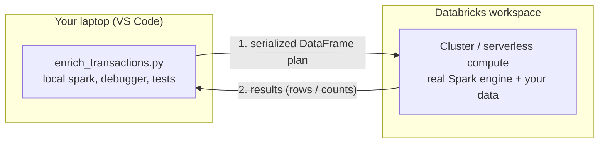
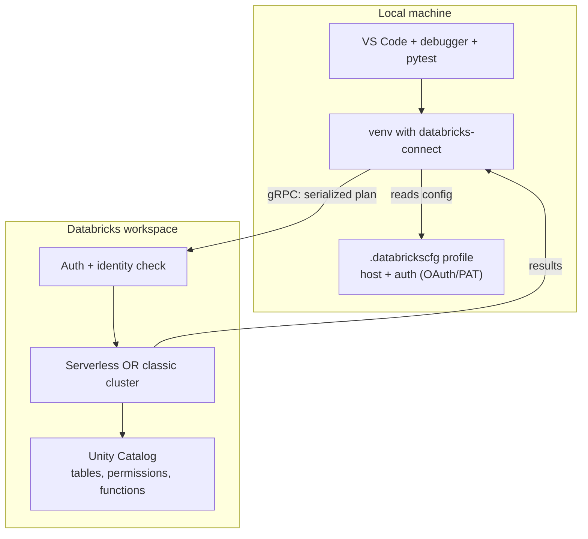

# Databricks Connect: Local Code, Remote Spark

> Picture a construction site with a tower crane lifting steel beams thirty floors up. The operator isn't riding on the hook. They stand on the ground with a remote control, watching the load, nudging a lever. The crane does the heavy lifting; the human does the thinking, close at hand and comfortable. Databricks Connect is that remote control. Your laptop is the ground. The Databricks cluster is the crane.

You already know how to run code on remote compute *through* the Databricks extension — hit "Run on Databricks" and your file executes up in the workspace. That's great for a quick run. But the moment you want to set a breakpoint, inspect a DataFrame mid-transformation, or run a fast unit test, you feel the distance. Your code lives up there; your tools live down here.

Databricks Connect closes that gap. It's a client library that makes a local `spark` object behave as if it were running on a remote cluster. You write ordinary PySpark in your editor. When you call an action, the work is shipped to Databricks, runs on real cluster-scale compute, and the results come back to your laptop — where your debugger, your tests, and your `print()` statements are waiting.

Take a breath. If you've ever used a JDBC connection to run SQL against a remote database, you already have the right instinct. This is that idea, but for the entire DataFrame API, with local debugging on top.

## Learning Objectives

By the end of this lesson, you will be able to:

- Explain what Databricks Connect is: a client library that turns a local `spark` session into a remote session on a Databricks cluster or serverless compute.
- Describe how it works — DataFrame and Spark operations are serialized, sent to the remote cluster, executed there, and only results travel back.
- Install the `databricks-connect` package into a virtual environment and match its version to the cluster's runtime.
- Configure a connection that reuses the same auth profile and cluster the Databricks extension already set up.
- Write and run a `DatabricksSession` that executes a DataFrame query against remote compute.
- Choose between serverless and classic cluster compute for a Connect session.
- Decide when to reach for Databricks Connect versus running through the extension versus deploying as a job.
- Recognize the limitations: not every API is supported, versions must align, and some behaviors differ from a notebook.

## Prerequisites

Before this lesson, it helps to have:

- Set up the [Databricks extension for VS Code](/agentic-coding/vscode/databricks-extension) — you'll reuse the auth profile and cluster it configured.
- Comfort with PySpark DataFrames (reads, filters, joins, aggregations) — the kind of ETL you already write.
- A Python virtual environment in your project (we'll assume `uv` or `venv`).

If the extension is connected and you can browse Unity Catalog from the sidebar, you're ready.

## Estimated Reading Time

About 20 to 25 minutes, plus a few minutes to install the package and run the example. Read gently; the mental model matters more than memorizing flags.

## Business Motivation

Meet **Maya**, a data engineer at **Northwind Trust**, the mid-sized financial services firm. She's rewriting a transaction-enrichment transformation: read raw card transactions, join to a merchant-category lookup, flag anything that looks like a duplicate, and write the cleaned result to a Delta table. The logic is subtle — the duplicate rule has three edge cases — and the source table has 400 million rows.

Yesterday, Maya's loop looked like this: edit a notebook cell, run the whole cell, squint at the output, add a `display()`, run again, wait, repeat. When something broke deep in the join, she couldn't step into it. She sprinkled `print()` statements like breadcrumbs and re-ran the cell for the tenth time. Each run woke the cluster, shuffled data, and cost her three minutes of staring.

Today, with Databricks Connect, Maya opens `enrich_transactions.py` in VS Code. She sets a breakpoint right before the duplicate-flag logic. She runs the file under the debugger. Execution pauses at her breakpoint — locally — while the 400-million-row DataFrame lives on the cluster. She inspects the query plan, tweaks the join condition, and reruns just the function under a `pytest` test. Same data, same Spark, but her whole professional toolbox is now within reach.

The payoff isn't magic; it's *proximity*. The heavy compute stays remote where it belongs. The feedback loop comes home to where Maya thinks fastest. That's the difference between "notebook experiment" and "software you can trust with money."

## Intuition

Here's the whole idea in one picture. Your code runs locally and builds up a description of the work. When you finally ask for a result, that description is sent to the cluster, executed there, and the answer flows back.



*Diagram 1: The remote-controlled crane. You operate from the laptop; the heavy lifting happens on the cluster. Only the plan goes up and only the results come down — the 400M rows never touch your machine.*

The key insight: a PySpark DataFrame is **lazy**. When you write `df.filter(...).join(...).groupBy(...)`, nothing runs yet — you're just describing a plan. Databricks Connect takes advantage of that. It lets you build the plan locally, and only when you call an **action** (`.show()`, `.count()`, `.collect()`, `.write`) does it ship the plan to the cluster and run it.

If you've used a database driver, this will feel familiar: you compose a query on the client, the server does the work, you get rows back. Databricks Connect is that pattern — but the "query language" is the full Spark DataFrame API, and the client is your real Python process with breakpoints in it.

## Theory

Let's put a few precise words on it.

**Databricks Connect** is a client library (the `databricks-connect` PyPI package) that implements the Spark Connect protocol. You import it, create a session, and code against it exactly as you would code against `spark` in a notebook. The difference is where execution happens.

Under the hood, Spark work is expressed as an **unresolved logical plan** — a language-agnostic description of the transformations. Databricks Connect serializes that plan and sends it over a gRPC connection to the remote Spark engine. The engine resolves it against the real catalog, optimizes it, executes it on the cluster, and streams results back to your client.

Two consequences follow directly, and they explain almost every quirk you'll meet:

- **Only the plan and the results cross the wire.** Your laptop never holds the full dataset. A `.count()` on a billion rows returns a single number. A `.show(20)` returns twenty rows. A `.collect()` returns *everything* — so be careful with that one.
- **Your Python driver code runs locally.** The Python that builds the plan — your loops, your `if` statements, your helper functions — runs on your laptop. Only the Spark operations run remotely. This is why the debugger works: you're stepping through *your* code, not the cluster's internals.

:::note[Spark Connect vs. the old model]
Older "Databricks Connect v1" replaced parts of the local Spark installation and was famously fragile about versions. The modern version is built on **Spark Connect**, a thin gRPC client. It's far more robust, but the version-matching rule (below) still matters. If a tutorial talks about editing `spark-defaults` or replacing JARs locally, it's describing the old world — verify against the current docs.
:::

## Deep Dive

Let's walk through what actually happens when Maya runs one line.

She writes:

```python
result = (
    spark.table("northwind.raw.card_transactions")
         .filter("amount > 0")
         .join(merchants, "merchant_id")
         .groupBy("category")
         .count()
)
result.show()
```

1. **Lines 1-5 build a plan, locally.** `spark.table(...)`, `.filter(...)`, `.join(...)`, `.groupBy(...).count()` don't execute anything. They construct a logical plan object in your Python process. No data moves. This is instant.
2. **`.show()` is an action.** This is the trigger. Databricks Connect serializes the accumulated plan and sends it to the cluster.
3. **The cluster resolves and runs it.** The remote Spark engine looks up `northwind.raw.card_transactions` in Unity Catalog, checks Maya's permissions, optimizes the plan (predicate pushdown, join strategy, the usual), and executes it across the cluster's workers.
4. **A small result comes back.** `.show()` only needs the first rows of the aggregated result, so a tiny payload returns to the laptop and prints in Maya's terminal.

Now the part that makes this *developmentally* powerful. Because steps 1 and 2 are separated by an action, and because your Python driver runs locally, you can do this:

```python
import pdb

df = spark.table("northwind.raw.card_transactions").filter("amount > 0")
pdb.set_trace()   # or a VS Code breakpoint on this line
enriched = enrich(df)   # step INTO this function locally
enriched.show()
```

Execution pauses at the breakpoint. You can inspect `df` (it's a DataFrame handle — cheap, no data pulled), step into `enrich()`, watch how it builds the plan, and check intermediate `.count()` or `.printSchema()` calls interactively. The cluster only wakes up when you hit an action. You get notebook-scale data with IDE-scale tooling.

## Architecture

Here's how the pieces connect, and how Databricks Connect reuses what the extension already gave you.



*Diagram 2: The Databricks extension already created the `.databrickscfg` profile and picked a cluster. Databricks Connect reads that same config, so you rarely re-enter credentials. The gRPC channel carries plans up and results down; Unity Catalog governs what the session can touch.*

The important architectural point: **Databricks Connect does not invent its own auth or compute.** It leans on the profile the extension configured (host, OAuth or token) and can target either the classic cluster you selected in the extension or serverless compute. Your identity — and therefore your Unity Catalog permissions — is the same whether you run through the extension or through Connect.

## Step-by-Step Walkthrough

Let's get Maya from nothing to a running remote query.

1. **Confirm the cluster's runtime version.** In the workspace (or the extension's cluster view), note the Databricks Runtime — say, `15.4`. This number drives the next step.
2. **Install a matching `databricks-connect`.** The package version must line up with the runtime's Spark version. For runtime 15.4, Maya installs `databricks-connect==15.4.*`. (Matching rule detailed below — verify current guidance in the docs.)
3. **Reuse the existing auth profile.** The extension already wrote a profile to `~/.databrickscfg`. Connect reads it — no new login.
4. **Pick compute.** Either point at the classic cluster id the extension selected, or request serverless. Serverless needs no cluster id.
5. **Create the session and run something small.** A `spark.range(5).show()` proves the wire is live before she touches real tables.
6. **Point at real data.** Swap in `northwind.raw.card_transactions`, set a breakpoint, and start developing.

## Hands-on Examples

:::note
Package versions, config keys, and CLI flags evolve. Treat the snippets below as the *shape* to recognize, and confirm exact details in the [Databricks Connect docs](https://docs.databricks.com/aws/en/dev-tools/databricks-connect/).
:::

**Step 1 — Install into your project's virtual environment.**

```bash
# From your project root, with a venv already active.
# Match the MAJOR.MINOR to your cluster's Databricks Runtime.
# Runtime 15.4  ->  databricks-connect 15.4.x

uv pip install "databricks-connect==15.4.*"
# or, with plain pip:
# pip install "databricks-connect==15.4.*"
```

:::warning[Do not install plain `pyspark` alongside it]
`databricks-connect` provides its own Spark client. Having a separate `pyspark` in the same environment causes confusing import clashes. Install Connect into a clean venv, and if `pyspark` is already there, remove it first.
:::

**Step 2 — Create a remote session (classic cluster).**

```python
from databricks.connect import DatabricksSession

# Reuses your ~/.databrickscfg profile (the one the extension made).
# Provide the cluster id of the classic cluster you want to run on.
spark = (
    DatabricksSession.builder
    .profile("DEFAULT")                 # named profile from .databrickscfg
    .clusterId("0921-xxxxxx-abcde123")  # your cluster id — verify in the docs
    .getOrCreate()
)

# Prove the connection before touching real data.
spark.range(5).show()
# +---+
# | id|
# +---+
# |  0|
# ...
```

That `DatabricksSession` object *is* your `spark`. Everything you know about DataFrames works against it.

**Step 3 — Serverless instead of a classic cluster.**

```python
from databricks.connect import DatabricksSession

# No cluster id needed — serverless compute spins up on demand.
spark = (
    DatabricksSession.builder
    .profile("DEFAULT")
    .serverless(True)     # request serverless; exact API may vary — verify
    .getOrCreate()
)

spark.range(5).show()
```

Serverless is the fastest path to "it just works": no cluster to keep warm, low startup latency, nothing to manage. Classic clusters give you control over instance types, libraries, and Spark configs when a workload needs it.

**Step 4 — Run a real transformation (Maya's actual task).**

```python
from databricks.connect import DatabricksSession
from pyspark.sql import functions as F

spark = DatabricksSession.builder.profile("DEFAULT").serverless(True).getOrCreate()

txns = spark.table("northwind.raw.card_transactions").filter(F.col("amount") > 0)
merchants = spark.table("northwind.ref.merchant_categories")

enriched = (
    txns.join(merchants, on="merchant_id", how="left")
        .withColumn("is_high_value", F.col("amount") > 10_000)
)

# Actions — these run on the cluster:
print("row count:", enriched.count())     # a single number comes back
enriched.groupBy("category").count().show()   # a few rows come back
```

Notice how little crosses the wire: a count is one integer; a grouped `.show()` is a handful of rows. The 400 million raw rows never leave Databricks.

**Step 5 — Debug it locally (the whole point).**

Set a breakpoint on the `enriched = ...` line in VS Code, choose "Python: Current File" in the Run and Debug panel, and start. Execution pauses locally. Inspect `txns` in the debugger, evaluate `txns.printSchema()` in the Debug Console, step into your helper functions. When you continue past an action, the cluster does the work and the result returns to your paused session. We go deeper on this in [Debugging & Testing](/agentic-coding/vscode/debugging-and-testing).

## Production Considerations

Databricks Connect is a **development-time** tool. Keep that framing and you'll make good choices.

- **Don't ship a laptop as your scheduler.** For anything that must run on a schedule or in CI, deploy the code as a Databricks **job** (typically via [Asset Bundles](/agentic-coding/vscode/asset-bundles)). Connect is how you *build and debug* the transformation; a job is how you *run it in production*.
- **Write code that runs the same way both places.** Because a `DatabricksSession` behaves like the notebook/job `spark`, well-structured transformations (pure functions that take a DataFrame and return one) run unchanged whether invoked via Connect locally or inside a job. Aim for that portability.
- **Keep the version pin in your project config.** Record `databricks-connect==<runtime>.*` in your `requirements`/`pyproject` so teammates and CI match the cluster automatically.
- **Prefer serverless for interactive dev.** Fast to start, nothing to babysit. Reserve classic clusters for when you need specific instance types or cluster-scoped libraries.

## Team & Collaboration Considerations

- **Standardize the runtime across the team.** If everyone targets the same Databricks Runtime, everyone pins the same `databricks-connect` version and "works on my machine" stops being a phrase. Pin it in the repo, not in each person's head.
- **Commit config, not secrets.** The cluster id and profile *name* can live in a checked-in config or docstring; the actual tokens live only in `~/.databrickscfg` on each machine. New teammates run the extension's login once and inherit the same setup.
- **Make transformations testable, not notebook-shaped.** Structure code as importable functions so a colleague can run your `pytest` suite via Connect without reconstructing a notebook. This is the repo-first habit the [next lesson](/agentic-coding/vscode/repo-first-project) builds on.
- **Document the "how to connect" in the README.** One short block — which profile, serverless or which cluster, which runtime — saves every new engineer an afternoon.

## Security Considerations

- **Your identity is your identity.** A Connect session authenticates as *you* through the profile the extension configured. It sees exactly the Unity Catalog tables and functions your account is permitted to see — no more. There's no backdoor around governance.
- **Prefer OAuth over long-lived tokens.** The extension's OAuth (U2M) flow issues short-lived credentials. A personal access token stuffed in an env var is a standing liability; if you must use one, scope and rotate it.
- **Never hardcode credentials in code.** Read from the profile or environment. A cluster id in source is fine; a token in source is a leak waiting to happen. Keep `.databrickscfg` out of git.
- **Mind what `.collect()` and `.toPandas()` pull local.** These bring real data onto your laptop. For regulated data at Northwind Trust, that can mean sensitive rows leaving governed compute. Filter and aggregate *before* you collect, and collect only what you truly need locally.

## Common Mistakes

- **Version mismatch.** Installing `databricks-connect` at a version that doesn't match the cluster's runtime is the number-one failure. The errors are cryptic. Check the runtime, pin the matching major.minor.
- **`pyspark` and `databricks-connect` in the same venv.** They fight over the `pyspark` namespace. Use a clean environment.
- **Collecting a giant DataFrame.** `.collect()` or `.toPandas()` on a billion rows tries to haul everything to your laptop and falls over. Aggregate first; collect small.
- **Expecting notebook globals.** There's no automatic `spark`, no `dbutils` magic exactly as in a notebook, no `display()`. You create the session yourself, and some notebook-only helpers behave differently or need explicit imports — verify what's supported.
- **Assuming 100% API parity.** Most DataFrame and Spark SQL works, but some APIs (certain RDD operations, some Spark context internals, a few streaming or ML paths) aren't supported over Connect. When something errors oddly, check the supported-features list before assuming your code is wrong.
- **Treating Connect as production runtime.** It's for developing and debugging. Schedule the real thing as a job.

## Best Practices

- **Match the version, pin it in the repo.** `databricks-connect==<runtime>.*`, recorded in project config.
- **Start with `spark.range(5).show()`.** Prove the wire before debugging your logic — it isolates connection problems from code problems.
- **Use serverless for interactive dev** unless a workload needs a specific cluster.
- **Write pure DataFrame functions.** `f(df) -> df` runs identically via Connect, in tests, and in a job. This is your ticket to local debugging *and* clean deployment.
- **Filter and aggregate before collecting.** Keep big data remote; bring small results home.
- **Reuse the extension's profile.** Don't invent a second auth path — one login, one identity, one governance story.
- **Verify evolving specifics in the docs.** Package names, builder methods, and serverless flags change; the [official docs](https://docs.databricks.com/aws/en/dev-tools/databricks-connect/) are the source of truth.

## Interview Questions

1. **What is Databricks Connect, and what problem does it solve for a data engineer?**
   Look for: a client library that runs a local `spark`/DataFrame session against remote Databricks compute, so you get full IDE tooling (debugger, tests, refactoring) while the heavy compute and the data stay on the cluster. It closes the feedback-loop gap that notebooks leave open.

2. **Walk me through what happens when you call `df.filter(...).groupBy(...).count().show()` under Databricks Connect.**
   Look for: the transformations are lazy and build a logical plan locally; `.show()` is the action that serializes the plan, sends it over gRPC to the remote engine, which resolves against Unity Catalog, optimizes, executes on the cluster, and returns only the small result. Bonus: only plans and results cross the wire; the dataset stays remote.

3. **Why does the `databricks-connect` package version need to match the cluster runtime, and how do you handle that on a team?**
   Look for: the client and the remote Spark engine must speak compatible protocol/Spark versions; mismatches cause obscure failures. On a team, standardize the runtime and pin `databricks-connect==<runtime>.*` in the repo so everyone and CI align.

4. **When would you use Databricks Connect versus "Run on Databricks" via the extension versus deploying as a job?**
   Look for: Connect for interactive development, debugging, and unit/eval tests where local tooling matters; the extension's run for a quick whole-file execution on remote compute without local session setup; a job (via Asset Bundles) for scheduled, production, governed execution. Connect is dev-time, jobs are run-time.

5. **What are the security implications of using Databricks Connect, especially around data movement?**
   Look for: the session runs as your identity under Unity Catalog governance (no privilege escalation); prefer OAuth over static tokens; never hardcode credentials; and be careful with `.collect()`/`.toPandas()`, which pull real (possibly sensitive) data onto the local machine — filter and aggregate first.

6. **Name two things that behave differently under Databricks Connect than in a notebook.**
   Look for: no automatic `spark`/notebook globals or `display()`; some `dbutils` behavior and certain APIs (RDD internals, some streaming/ML paths) differ or aren't supported. The candidate should know to check the supported-features list rather than assume parity.

## Quiz

**Q1.** Under Databricks Connect, where does the 400-million-row dataset live while you run `df.count()` from your laptop?

<details>
<summary>Show answer</summary>

On the **cluster (remote compute)**. The plan is sent to Databricks, executed there, and only the single count value comes back to your laptop. The full dataset never touches your machine.

</details>

**Q2.** You installed `databricks-connect==14.3.*` but your cluster runs Databricks Runtime 15.4. What's likely to happen, and how do you fix it?

<details>
<summary>Show answer</summary>

You'll hit **version-mismatch errors** — often cryptic. Fix it by installing a `databricks-connect` version whose major.minor matches the runtime, i.e. `databricks-connect==15.4.*`. Standardize the runtime across the team and pin the matching version in your project config.

</details>

**Q3.** Which of these triggers actual execution on the cluster: `df.filter(...)`, `df.join(...)`, or `df.show()`?

<details>
<summary>Show answer</summary>

`df.show()`. `filter` and `join` are **transformations** — lazy, they only build the plan. `show()` is an **action** that ships the plan to the cluster and runs it. `.count()`, `.collect()`, and `.write` are other actions.

</details>

**Q4.** Maya wants her enrichment logic to run on a nightly schedule for production. Should she leave Databricks Connect running on her laptop overnight?

<details>
<summary>Show answer</summary>

No. Databricks Connect is a **development-time** tool. For scheduled production runs she should deploy the code as a Databricks **job**, typically via Asset Bundles. If she wrote the logic as pure DataFrame functions, the same code runs unchanged in the job.

</details>

## Summary

Databricks Connect is the remote control for the crane: you operate from your laptop while the cluster does the lifting. It's a client library that makes a local `DatabricksSession` behave like the `spark` you know, but every action ships a serialized plan to remote Databricks compute and brings only results back. That single design choice — plan up, results down, driver code local — is what lets you keep IDE tooling (breakpoints, tests, refactoring) while working over cluster-scale data.

You install `databricks-connect` matched to your cluster's runtime, reuse the auth profile and cluster the extension already configured, and choose serverless (fast, hands-off) or a classic cluster (controllable). You reach for it during interactive development, debugging, and testing — and you deploy the finished work as a job for production. Mind the limits: match versions, keep `pyspark` out of the venv, don't collect giant DataFrames, and check the supported-features list when an API acts strange.

Maya's transformation went from a notebook guessing game to real software she can step through, test, and trust. That's the whole point.

## Key Takeaways

- **Databricks Connect** = a client library that runs a local `spark`/DataFrame session against **remote** Databricks compute.
- **Plan up, results down.** Transformations are lazy and build a plan locally; an **action** ships it to the cluster; only small results return. Big data stays remote.
- **Your driver code runs locally**, which is why the debugger and tests work — you step through your Python, not the cluster's internals.
- **Match the version.** Pin `databricks-connect==<runtime>.*` to the cluster's Databricks Runtime, and keep plain `pyspark` out of the same venv.
- **Reuse the extension's profile and cluster;** choose **serverless** for easy interactive dev or a **classic cluster** for control.
- **Dev-time tool, not a scheduler.** Use Connect to build/debug/test; deploy the real thing as a **job** via Asset Bundles.
- **Governance and safety hold:** the session is your identity under Unity Catalog; be careful with `.collect()`/`.toPandas()` pulling data local.

## Glossary

- **Databricks Connect:** The `databricks-connect` client library that executes local Spark/DataFrame code against remote Databricks compute.
- **DatabricksSession:** The Connect entry point; the `spark` object you build and code against locally.
- **Spark Connect:** The gRPC-based protocol underneath modern Databricks Connect that carries serialized query plans between client and remote engine.
- **Transformation vs. action:** Transformations (`filter`, `join`, `select`) are lazy and build a plan; actions (`show`, `count`, `collect`, `write`) trigger remote execution.
- **Logical plan:** The language-agnostic description of DataFrame operations that gets serialized and sent to the cluster.
- **Serverless compute:** On-demand Databricks compute with no cluster to manage; a common target for Connect sessions.
- **Classic cluster:** A cluster you configure and (optionally) keep running; targeted by cluster id.
- **Databricks Runtime:** The versioned Spark-plus-libraries image a cluster runs; its version must match your `databricks-connect` version.
- **`.databrickscfg` profile:** The named host + auth configuration (written by the extension's login) that Connect reuses.

## Further Reading

- [Databricks Connect documentation](https://docs.databricks.com/aws/en/dev-tools/databricks-connect/)
- [Databricks extension for VS Code](https://docs.databricks.com/aws/en/dev-tools/vscode-ext/)

## Next Lesson

You can now write, run, and debug remote Spark from your local editor. Next, let's structure a whole AI project the way real software is built — repo-first, linted, tested, and versioned.

➡️ [A Repo-First AI Project](/agentic-coding/vscode/repo-first-project)
