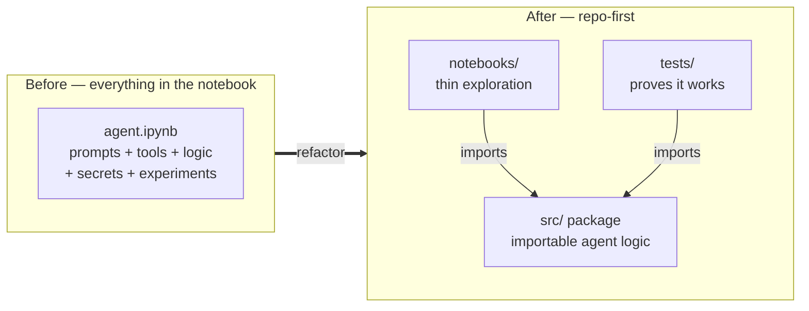
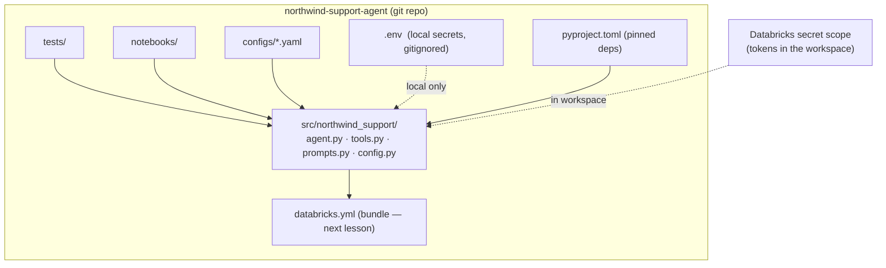

# A Repo-First AI Agent Project

> Picture two kitchens. In the first, every utensil, spice, and half-used sauce lives in one crammed junk drawer — you can cook, technically, but you spend ten minutes hunting for the whisk and you knock over the salt every time. In the second, there is a drawer for knives, a rack for spices, a shelf for pots, all labeled. A stranger could walk in and find the whisk in five seconds. A repo-first AI project is the second kitchen: a place where you, your teammates, and your CI system can all find exactly what they need, exactly where they expect it.

You have spent the last few lessons wiring VS Code into a real editor for Databricks work — the extension, Databricks Connect, and soon Asset Bundles. Now we zoom out from "how do I run this code" to "how do I *organize* it." Because a demo agent that lives in one 800-line notebook cell is not something you can test, review, or ship. A repository is.

Here is the good news: you already know how to do this. You have structured ETL projects, wired up CI, pinned dependencies, and reviewed pull requests. An AI agent is not exotic — it is a Python project with a model call in the middle. The same instincts that make a data pipeline maintainable make an agent maintainable. This lesson is about pointing those instincts at agent code.

And almost none of it is Databricks-specific. A clean repo layout, pinned dependencies, and secrets kept out of git are portable to *any* AI work, on Databricks or off. We will note the Databricks touchpoints as they come, but treat this as software engineering first.

## Learning Objectives

By the end of this lesson, you will be able to:

- Lay out an AI agent as a proper repository, separating importable **agent logic** from throwaway **notebook glue**.
- Explain why a `src/` package, `tests/`, `notebooks/`, and `configs/` each earn their place.
- Manage and **pin dependencies** with `uv`, `pip`, or `requirements.txt`, and connect that to reproducible cluster environments.
- Handle **configuration and secrets** correctly — `.env` locally, Databricks secret scopes in the workspace, and never a hardcoded token.
- Apply basic **git hygiene** — branches, meaningful commits, and pull-request review — to an agent project.
- Recognize where a `databricks.yml` will slot in later, without needing it yet.

## Prerequisites

Before this lesson, it helps to have:

- Completed [Set up VS Code for AI](/agentic-coding/vscode/setup-vscode-for-ai) — you will want Python, git, and the terminal working in the editor.
- A working mental model of what an agent *is*. If it is fuzzy, skim [Authoring Agents](/docs/building-agents/authoring-agents) for the shape of the code we will be organizing.

If you have ever structured a Python project or a data pipeline repo, you are already 80% of the way there. This lesson just adds the agent-specific bits.

## Estimated Reading Time

About 20 to 25 minutes, plus a few minutes to sketch the tree for your own project. Nothing to install — you can apply this to a repo you already have.

## Business Motivation

Let's return to **Northwind Trust**, our mid-sized financial services firm. Their engineer **Maya** built a support agent that answers customer questions about account status and policy. It works beautifully — in her notebook.

Then three things happen, as they always do.

First, a teammate wants to help. He opens Maya's notebook and finds prompt strings, a tool definition, a database call, and three experiments all tangled together in one file. He cannot tell what is load-bearing and what is a scratch experiment. He is afraid to touch anything.

Second, the agent gives a wrong answer in a demo, and nobody can reproduce it — the notebook ran against whatever library versions happened to be installed that day, and Maya has since upgraded three of them.

Third, a security review asks where the workspace token lives. It is pasted in cell 4. In plain text. In a notebook that got shared over Slack.

None of these are AI problems. They are *structure* problems. A repo-first layout fixes all three at once: the teammate can find the agent logic and its tests, the pinned dependencies make runs reproducible, and secrets live outside the code entirely. Maya's agent becomes something the *team* owns and ships, not a personal artifact that only runs on her laptop on a good day. That is the difference between a clever demo and production software — and it is what makes the later lessons on bundles, testing, and deployment even possible.

## Intuition

Here is the core mental shift, in one picture. On the left, everything lives in the notebook. On the right, the notebook becomes a thin *client* of a real package.



*Diagram 1: The repo-first move. Agent logic graduates out of the notebook into an importable package, so notebooks and tests both depend on one source of truth instead of copy-pasting cells.*

The single most important idea in this whole lesson: **agent logic should be importable.** If you can write `from northwind_support.agent import answer_question` from a notebook, a test, and a deployment script alike, you have won. Everything else — the folders, the config files, the pinning — exists to support that one property.

Why does "importable" matter so much? Because you cannot test a notebook cell, but you *can* test a function. You cannot code-review a 300-line cell cleanly, but you *can* review a small module. You cannot deploy an experiment, but you *can* deploy a package. Import-ability is the hinge everything swings on.

## Theory

Let's name the pieces of a well-structured agent repo and why each one exists. Think of these as the labeled drawers in the organized kitchen.

- **`src/` package** — your actual agent code, as an installable Python package. This is the "product." It holds the agent orchestration, the tools it can call, and the prompts it uses. Nothing in here should depend on being run inside a notebook.
- **`tests/`** — unit and evaluation tests that import from `src/` and prove the agent behaves. Covered in depth in [Debugging & Testing](/agentic-coding/vscode/debugging-and-testing); here we just make room for it.
- **`notebooks/`** — exploration and demos. This is where a notebook belongs: for *trying things*, not for holding the real logic. Notebooks import from `src/`.
- **`configs/`** — configuration files (model names, endpoints, retrieval settings) kept separate from code, so you can change behavior without editing logic.
- **`pyproject.toml`** (or `requirements.txt`) — the dependency manifest and package definition.
- **`README.md`** — how to set up and run the project. The front door.
- **`.gitignore`** — what git should *never* track (caches, virtual environments, and crucially, secrets).
- **`.env`** — local secrets and settings, **never committed**. Loaded at runtime for local development only.
- **`databricks.yml`** — the Asset Bundle definition. We tease it here and build it fully in the [next lesson](/agentic-coding/vscode/asset-bundles).

The guiding principle behind all of these is **separation of concerns**: logic separate from experiments, configuration separate from code, and secrets separate from everything. Each drawer holds one kind of thing.

:::tip[The "src layout"]
Putting your package under a `src/` directory (rather than at the repo root) is a well-worn Python convention. It forces you to *install* your package to import it, which means your tests exercise the same code path as a real deployment — no accidental "it only works because the files happen to be in the current directory."
:::

## Deep Dive

Let's look harder at the two decisions that trip people up most: **separating logic from glue**, and **pinning dependencies**.

### Separating agent logic from notebook glue

A notebook is a wonderful place to *think*. It is a terrible place to *keep* production logic, because a notebook is stateful, order-dependent, and nearly impossible to unit-test or diff in a pull request.

The fix is a discipline, not a tool: **the moment a piece of code is worth keeping, move it into `src/` and import it back.** Your notebook cell shrinks from thirty lines of logic to one line: `answer_question("Is account 42 active?")`. The logic now lives somewhere a test can reach it and a reviewer can read it.

A useful litmus test: *if this code disappeared from the notebook, would something break in production?* If yes, it does not belong in the notebook — it belongs in the package.

### Pinning dependencies (and why a Data Engineer already gets this)

You have felt the pain of "works on my cluster, breaks on yours." Pinning dependencies is the cure, and it maps directly onto something you already know.

When you configure a Databricks cluster, you specify a runtime version and a set of libraries so that every run gets the *same* environment. A `pyproject.toml` or `requirements.txt` with pinned versions is the exact same idea for your local and deployed Python environment. `langchain==0.2.16` behaves the same today and next month; `langchain` (unpinned) is a coin flip. AI libraries move *fast* — a model client or agent framework can change its API between minor versions — so pinning matters even more here than in a stable ETL stack.

The mental link to lock in: **your dependency manifest is to your code what a cluster's library spec is to a job.** Both exist so that "reproducible" is a property you get for free instead of a debugging session you pay for later.

:::info[uv, pip, or requirements.txt?]
`uv` is a fast, modern package and environment manager that reads `pyproject.toml` and produces a lockfile (`uv.lock`) capturing exact versions of *every* transitive dependency — the strongest reproducibility. Plain `pip` with a pinned `requirements.txt` is simpler and universally understood. Either is fine; the non-negotiable is that versions are **pinned**, not floating. Exact commands evolve — verify current usage in the [uv docs](https://docs.astral.sh/uv/).
:::

## Architecture

Here is how the pieces connect. Notice that `src/` sits at the center — everything else either feeds it (config, dependencies) or depends on it (notebooks, tests, deployment).



*Diagram 2: The agent package is the single source of truth. Config and pinned dependencies feed it; notebooks, tests, and the deployment bundle all depend on it. Secrets arrive from `.env` locally and a secret scope in the workspace — never from the code itself.*

The shape to internalize: **one package, many consumers.** Change the agent logic in one place and every consumer — your notebook, your tests, your deployed job — picks up the change. That is the opposite of the copy-pasted-cell world.

## Step-by-Step Walkthrough

Let's follow Maya as she promotes her notebook agent into a real repo. No code yet — just the moves, so the shape is clear.

1. **Create the repo and layout.** She makes a git repository `northwind-support-agent` and scaffolds the directories: `src/northwind_support/`, `tests/`, `notebooks/`, `configs/`.
2. **Extract the logic.** She copies the agent orchestration into `src/northwind_support/agent.py`, the tool functions into `tools.py`, and the prompt strings into `prompts.py`. Her notebook cells shrink to imports and calls.
3. **Declare dependencies.** She writes a `pyproject.toml` listing the libraries her agent needs, with pinned versions, and installs the package in editable mode so imports resolve.
4. **Externalize config.** Model name, endpoint, and retrieval settings move from hardcoded values into `configs/dev.yaml`, read by a small `config.py`.
5. **Rip out the secrets.** The workspace token in cell 4 gets deleted. Locally, it now comes from a `.env` file that git ignores. In the workspace, it will come from a Databricks secret scope.
6. **Add git hygiene.** A `.gitignore` keeps `.env`, `__pycache__`, and the virtual environment out of version control. She commits on a branch and opens a pull request so her teammate can review.
7. **Tease the bundle.** She drops a placeholder `databricks.yml`, knowing the [next lesson](/agentic-coding/vscode/asset-bundles) will turn it into a real deployment definition.

Notice that not one of these steps changed *what the agent does*. They changed who can safely work on it — which is the entire point.

## Hands-on Examples

Let's make it concrete. Here is a recommended directory tree for Northwind Trust's support agent. Adapt the names, keep the shape.

```
northwind-support-agent/
├── README.md                  # how to set up and run
├── pyproject.toml             # dependencies (pinned) + package metadata
├── uv.lock                    # exact resolved versions (if using uv)
├── .gitignore                 # keeps secrets & junk out of git
├── .env.example               # documents required vars (committed)
├── .env                       # real local secrets (NEVER committed)
├── databricks.yml             # Asset Bundle — placeholder for next lesson
├── configs/
│   ├── dev.yaml               # model, endpoint, retrieval settings (dev)
│   └── prod.yaml              # same knobs, prod values
├── src/
│   └── northwind_support/
│       ├── __init__.py
│       ├── agent.py           # orchestration: the answer_question entrypoint
│       ├── tools.py           # account_lookup, policy_search, ...
│       ├── prompts.py         # system + task prompts as constants
│       └── config.py          # loads configs/ + env vars into a typed object
├── tests/
│   ├── test_tools.py          # unit tests for each tool
│   └── test_agent.py          # eval-style tests for the agent
└── notebooks/
    └── explore.ipynb          # scratch/demo — imports from src/, holds no logic
```

*A place for everything. A reviewer can guess where any given concern lives without being told.*

A minimal `pyproject.toml` with **pinned** dependencies:

```toml
[project]
name = "northwind-support"
version = "0.1.0"
description = "Northwind Trust customer support agent"
requires-python = ">=3.11"

# Pin versions so every environment resolves the same way.
# (Exact package names/versions are illustrative — verify current releases.)
dependencies = [
    "databricks-sdk==0.30.0",
    "mlflow==2.16.2",
    "pydantic==2.9.2",
    "python-dotenv==1.0.1",
]

[project.optional-dependencies]
dev = [
    "pytest==8.3.3",
    "ruff==0.6.9",
]

[build-system]
requires = ["hatchling"]
build-backend = "hatchling.build"

[tool.hatch.build.targets.wheel]
packages = ["src/northwind_support"]
```

Install it in editable mode so `from northwind_support.agent import ...` just works:

```bash
# With uv (fast, produces uv.lock):
uv sync --extra dev

# Or with plain pip:
pip install -e ".[dev]"
```

A minimal `.gitignore` — the line that matters most is `.env`:

```gitignore
# Secrets — NEVER commit these
.env
*.key

# Python
__pycache__/
*.pyc
.venv/
venv/

# Tooling caches
.pytest_cache/
.ruff_cache/
.ipynb_checkpoints/

# Build artifacts
dist/
build/
*.egg-info/
```

And the pattern that keeps tokens out of your code entirely — read them from the environment, with `.env` feeding them locally:

```python
# src/northwind_support/config.py
import os
from dotenv import load_dotenv   # loads .env in local dev only

load_dotenv()  # no-op in the workspace, where real secrets come from a scope

# NEVER: TOKEN = "dapi123abc..."   <- hardcoded secret, don't do this
DATABRICKS_HOST = os.environ["DATABRICKS_HOST"]
DATABRICKS_TOKEN = os.environ["DATABRICKS_TOKEN"]  # from .env locally
MODEL_ENDPOINT = os.environ.get("MODEL_ENDPOINT", "databricks-meta-llama")
```

You commit a `.env.example` (with empty or dummy values) to *document* which variables are required, and never the real `.env`:

```bash
# .env.example  — safe to commit; copy to .env and fill in real values
DATABRICKS_HOST=https://your-workspace.cloud.databricks.com
DATABRICKS_TOKEN=
MODEL_ENDPOINT=databricks-meta-llama
```

## Production Considerations

- **Config per environment, not per person.** `configs/dev.yaml` and `configs/prod.yaml` let the same code run against different endpoints and settings. Select which one to load via an environment variable, so promotion from dev to prod is a config switch, not a code edit.
- **Secrets come from a scope in the workspace.** Locally you use `.env`; in Databricks the same environment variables are populated from a **secret scope** rather than a file. Your code stays identical — it just reads `os.environ` either way. This is the bridge to the deployment lifecycle covered in [Agent Development Lifecycle](/docs/building-agents/agent-dev-lifecycle).
- **The package is the deliverable.** When you deploy (via an Asset Bundle in the [next lesson](/agentic-coding/vscode/asset-bundles)), you ship the installable `src/` package with its pinned dependencies — not a notebook. Reproducibility follows the package.
- **Keep notebooks out of the critical path.** A notebook is fine for a demo or an exploration, but nothing production depends on should live only in one. If a notebook is the only place a behavior exists, that behavior is not yet real.

## Team & Collaboration Considerations

Structure is, at bottom, a *social* technology — it exists so humans can work on the same code without stepping on each other.

- **Branches over "one big main."** Each change starts on its own branch. Small, focused branches are easy to review and easy to revert.
- **Meaningful commits.** `git commit -m "fix account_lookup off-by-one on closed accounts"` tells a story; `git commit -m "wip"` tells nothing. Your future self, reading `git log` during an incident, will thank you.
- **Pull-request review is your first evaluation.** Before any automated test, a teammate reading your diff catches the leaked token, the missing pin, the prompt that says the wrong thing. Because the logic lives in small modules and not a giant cell, the diff is actually *reviewable*.
- **A README that lets a stranger start.** "Clone, `uv sync`, copy `.env.example` to `.env`, run the tests." If a new teammate can go from clone to green tests in ten minutes, your structure is working.

## Security Considerations

This is the section to read twice, because a leaked token in a git history is genuinely hard to undo.

- **Never hardcode secrets.** No tokens, keys, or passwords in `.py` files, notebooks, or config files that get committed. This is the single most common and most damaging mistake.
- **`.env` is gitignored, always.** Add `.env` to `.gitignore` *before* you create the file, so you can never accidentally stage it. Commit only `.env.example` with blank values.
- **Databricks secret scopes in the workspace.** In production, secrets live in a **secret scope** and are injected as environment variables or fetched via the SDK — the workspace, not your code, holds the sensitive value. Verify current secret-scope commands in the Databricks docs, as tooling evolves.
- **A committed secret is a compromised secret.** If a token ever lands in git history, rotate it immediately. Scrubbing history is possible but the safe assumption is that it has already been seen — revoke and reissue.
- **Least privilege.** The identity your agent runs as should have only the access it needs. A support agent rarely needs write access to production tables.

## Common Mistakes

- **Leaving logic in the notebook.** The classic. If it is worth keeping, it belongs in `src/`. A notebook that holds production logic cannot be tested or reviewed.
- **Unpinned dependencies.** `dependencies = ["langchain"]` is a future outage. Pin the version.
- **Hardcoding the token "just for now."** "Now" has a way of becoming "in the commit forever." Use `.env` from the very first line of code.
- **Committing `.env`.** Add it to `.gitignore` first. Check `git status` before your first commit and confirm `.env` is not listed.
- **A repo root full of loose scripts.** Twenty `.py` files at the top level with no package is just the junk drawer again. Group them under `src/`.
- **No README.** If onboarding a teammate requires a screen-share, the structure is incomplete.

## Best Practices

- **Make logic importable.** `from your_package.agent import answer_question` should work from a notebook, a test, and a deploy script alike.
- **Pin every dependency**, and prefer a lockfile (`uv.lock`) for full transitive reproducibility.
- **Config out of code; secrets out of git.** `configs/*.yaml` for behavior, `.env` (local) and secret scopes (workspace) for secrets.
- **Small branches, meaningful commits, real PR review.** Treat the agent like the production software it is becoming.
- **One package, many consumers.** Notebooks, tests, and bundles all depend on the same `src/` — never copy-paste logic between them.
- **Write the README for a stranger.** Clone-to-green-tests in minutes is the target.
- **Verify tool specifics.** `uv`, the Databricks CLI, and secret-scope commands change — confirm exact syntax in current docs before you rely on it.

## Interview Questions

1. **Why should agent logic live in an importable package instead of a notebook?**
   Look for: notebooks are stateful, order-dependent, hard to diff and impossible to unit-test cleanly. A package can be imported by tests, notebooks, and deployment alike — one source of truth — which makes the agent testable, reviewable, and deployable.

2. **How does pinning dependencies relate to cluster reproducibility?**
   Look for: a pinned `pyproject.toml`/`requirements.txt` is the local-and-deployed analog of a cluster's fixed runtime and library spec. Both ensure every run gets the same environment, so "works here, breaks there" disappears. Bonus: a lockfile pins transitive deps too.

3. **Walk me through how you'd handle a workspace token in this project.**
   Look for: never hardcoded. Locally in a gitignored `.env` loaded at runtime; in the workspace via a Databricks secret scope injected as an environment variable. Code reads `os.environ` either way, so it is environment-agnostic. `.env.example` documents required vars.

4. **What goes in `src/` versus `notebooks/`, and how do you decide?**
   Look for: anything load-bearing — orchestration, tools, prompts, config loading — goes in `src/`. Notebooks are for exploration and demos and import from `src/`. Litmus test: if it disappeared from the notebook, would production break? If yes, it belongs in the package.

5. **You find a hardcoded token in a merged commit. What do you do?**
   Look for: treat it as compromised — rotate/revoke the token immediately. Optionally scrub history, but assume it has been seen. Then add `.env` to `.gitignore` and move the value to `.env`/secret scope so it cannot recur.

6. **Why does repo structure matter for a *team*, not just for you?**
   Look for: predictable layout makes diffs reviewable and onboarding fast; separation of concerns lets people work without collisions; PR review becomes a real quality gate. Structure is a social technology as much as a technical one.

## Quiz

**Q1.** What is the single most important property a repo-first refactor should give your agent code?

<details>
<summary>Show answer</summary>

**Importability.** If `from your_package.agent import answer_question` works from notebooks, tests, and deploy scripts, everything else — testing, review, deployment — becomes possible. It is the hinge the whole structure swings on.

</details>

**Q2.** True or false: it's fine to hardcode a workspace token in a config file as long as the file isn't the main code.

<details>
<summary>Show answer</summary>

**False.** Secrets never belong in committed files of any kind. Use a gitignored `.env` locally and a Databricks secret scope in the workspace; the code reads them from environment variables.

</details>

**Q3.** How does pinning dependencies in `pyproject.toml` mirror something you already do on Databricks?

<details>
<summary>Show answer</summary>

It mirrors specifying a cluster's runtime version and libraries. Both fix the environment so every run is reproducible — the manifest is to your code what the cluster library spec is to a job. Unpinned versions are a future outage.

</details>

**Q4.** A teammate opens your repo. Where should they expect to find the tool functions the agent calls, and where should they *not* find production logic?

<details>
<summary>Show answer</summary>

Tool functions live in the `src/` package (e.g., `src/northwind_support/tools.py`). Production logic should **not** live in `notebooks/` — notebooks are for exploration and import from `src/`.

</details>

## Summary

A repo-first AI project is the organized kitchen: a labeled place for every concern, so you, your team, and your CI can all find what they need. The central move is making agent logic **importable** — graduating it out of the notebook into a `src/` package that notebooks, tests, and deployments all depend on.

Around that package sit the supporting drawers: `tests/` to prove it works, `notebooks/` for exploration only, `configs/` for behavior you tune without editing code, a **pinned** `pyproject.toml` (or `requirements.txt`) that mirrors a reproducible cluster environment, a `README` as the front door, and a `.gitignore` that keeps `.env` and other secrets out of git forever. Secrets come from `.env` locally and a Databricks secret scope in the workspace — never from the code. Basic git hygiene (branches, meaningful commits, PR review) turns the agent into something the team owns and ships.

None of this is exotic. It is the software engineering you already know, aimed at agent code — and it is what makes the bundles, testing, and deployment in the coming lessons possible at all.

## Key Takeaways

- **Make agent logic importable** — a `src/` package is the single source of truth for notebooks, tests, and deployment.
- **Separate logic from glue:** if code is load-bearing, it leaves the notebook and enters the package.
- **Pin dependencies.** A pinned manifest is the local/deployed analog of a cluster's fixed environment.
- **Config out of code, secrets out of git:** `configs/*.yaml`, `.env` locally, secret scopes in the workspace, never a hardcoded token.
- **`.gitignore` your `.env` before you create it**, and commit only `.env.example`.
- **Git hygiene is teamwork:** small branches, meaningful commits, real PR review.
- Almost all of this is **portable to non-Databricks AI work** — it is software engineering first.

## Glossary

- **Repo-first:** Treating an AI project as a structured software repository from the start, rather than as notebook cells.
- **`src/` layout:** A convention placing your package under `src/`, so it must be installed to import — matching how it runs when deployed.
- **Importable logic:** Code organized so it can be `import`ed by notebooks, tests, and deploy scripts alike, instead of being trapped in a notebook.
- **Pinning:** Specifying exact dependency versions (e.g., `mlflow==2.16.2`) so environments resolve identically everywhere.
- **Lockfile:** A file (e.g., `uv.lock`) capturing exact versions of every direct and transitive dependency for full reproducibility.
- **`.env`:** A local file holding secrets and settings as environment variables; loaded at runtime and never committed.
- **`.env.example`:** A committed template documenting which environment variables are required, with blank/dummy values.
- **Secret scope:** A Databricks-managed store for secrets in the workspace, injected into code without appearing in it.
- **`.gitignore`:** A file listing paths git must never track — caches, virtual environments, and secrets.
- **`pyproject.toml`:** The modern Python manifest declaring a package's metadata and dependencies.
- **Databricks Asset Bundle (`databricks.yml`):** A declarative definition of jobs, agents, and endpoints as code, deployed via the CLI — covered next.

## Further Reading

- [uv — a fast Python package & project manager](https://docs.astral.sh/uv/)
- [VS Code documentation](https://code.visualstudio.com/docs)
- [Databricks: Authoring Agents](/docs/building-agents/authoring-agents)
- [Databricks: Agent Development Lifecycle](/docs/building-agents/agent-dev-lifecycle)

## Next Lesson

You have a clean repo. Now let's turn that `databricks.yml` placeholder into a real, deployable definition — jobs, agents, and endpoints as code, straight from the editor.

➡️ [Databricks Asset Bundles from the Editor](/agentic-coding/vscode/asset-bundles)
