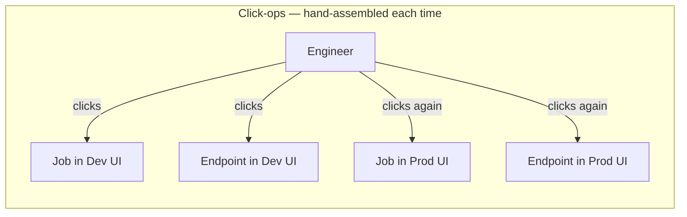
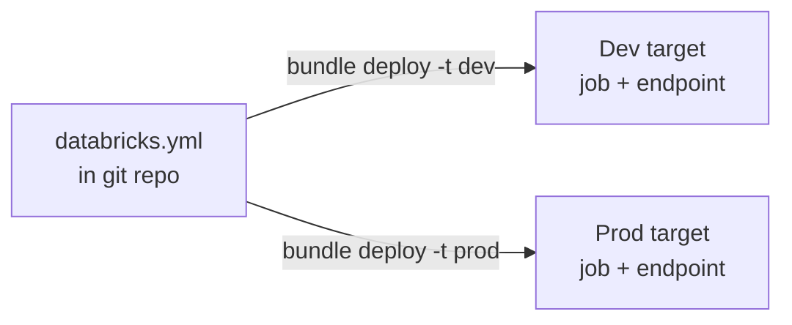
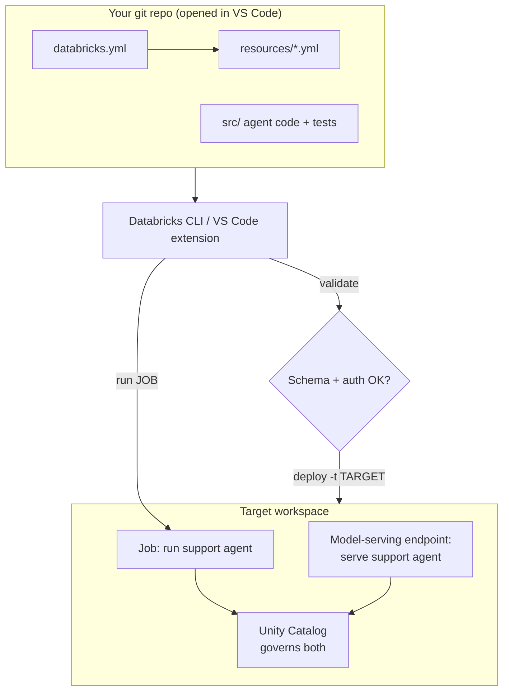

# Databricks Asset Bundles from the Editor

> Think of a good building blueprint paired with a bill of materials. Anyone can take those two documents to an empty lot and put up the exact same building — same beams, same wiring, same room layout — as many times as they like. Compare that to a crew that shows up and hand-assembles the structure on site from memory each time: no two builds come out quite the same, and nobody can tell you why. A **Databricks Asset Bundle** is the blueprint-plus-bill-of-materials for your AI project. It declares, in a file, exactly what should exist in your workspace — and you can rebuild it, identically, on demand.

You already version your *code* in git. You already know that "it works on my laptop" is not a deployment strategy. But when it comes to the *stuff around* your code — the jobs that run it, the endpoints that serve it, the schedules, the permissions — many teams still click buttons in a web UI and hope they remember what they did. That gap is where Asset Bundles live.

This lesson is about closing that gap without leaving VS Code. You will learn what a bundle is, how to read and write a `databricks.yml`, and how the validate → deploy → run loop lets you promote the same definition from your personal dev sandbox all the way to production. No new cloud primitives — just a disciplined, reproducible way to describe what you already build.

Take it slowly. By the end this will feel like the natural next step after putting your project in a repo.

## Learning Objectives

By the end of this lesson, you will be able to:

- Explain what a **Databricks Asset Bundle** is and the one problem it solves: reproducible, version-controlled deployment of Databricks resources.
- Read the anatomy of a `databricks.yml` — bundle name, `include` globs, `resources`, `variables`, and `targets`.
- Initialize a new bundle from a template with `databricks bundle init`, and use the DABs support in the Databricks VS Code extension.
- Run the core workflow: `databricks bundle validate` → `deploy` → `run`.
- Describe the difference between `mode: development` and `mode: production` targets, and why dev mode isolates resources per user.
- Declare a job that runs an agent — and, conceptually, a model-serving endpoint that deploys it — in a bundle.
- Explain how bundles fit into CI/CD: promoting the same definition from dev to prod.

## Prerequisites

This lesson builds directly on:

- [A Repo-First Databricks Project](/agentic-coding/vscode/repo-first-project) — a bundle assumes your project already lives in a well-structured git repo. If you have not read it, start there; the whole point of a bundle is to make that repo deployable.
- [The Databricks Extension for VS Code](/agentic-coding/vscode/databricks-extension) — the extension surfaces bundle commands and target selection in the editor. Helpful, not strictly required.

A working [Databricks CLI](https://docs.databricks.com/aws/en/dev-tools/cli/) install with an authenticated profile is assumed. If `databricks --version` prints something recent, you are set.

## Estimated Reading Time

About 25 to 30 minutes, plus 15 minutes if you follow along and deploy a small bundle yourself. Read once for the shape, then keep the `databricks.yml` example open when you build your own.

## Business Motivation

Let's return to **Northwind Trust**, our mid-sized financial services firm, and to **Maya**, one of their data engineers. Maya's team has built a customer-support agent — the same governed, tool-using agent from earlier in the track. It works beautifully in her notebook.

Now the hard question lands in a planning meeting: *how do we ship it?* The agent needs to run as a scheduled job that batch-processes overnight support tickets, and it needs a **model-serving endpoint** so the live chat widget can call it in real time. It needs to exist in a **dev** workspace where Maya experiments, and in a locked-down **prod** workspace that faces customers.

The old way — the way Northwind did it last year — was click-ops. Someone opened the Jobs UI, filled in a form, pasted a cluster spec, set a schedule, clicked save. Someone else opened the Serving UI and did the same. When prod drifted from dev, nobody could say what changed or when. When the one engineer who "knew the setup" went on leave, deployments stalled. When an auditor asked "what exactly is running in production?", the honest answer was "let me go click through and check."

For a regulated financial firm, that is not acceptable. Maya needs the deployment itself to be **code**: reviewed in a pull request, versioned in git, identical every time, and promotable from dev to prod by changing one flag. That is exactly what a bundle gives her. The job, the endpoint, the schedule, the permissions — all declared in `databricks.yml`, all in the repo, all reproducible.

The payoff is the same one you already trust from infrastructure-as-code: no more snowflake deployments, no more tribal knowledge, no more "who changed this?" A new engineer clones the repo and can recreate the entire deployment with one command.

## Intuition

Here is the whole idea in one picture. On the left, the click-ops world: a human hand-configuring each resource in a UI, once per environment, with no shared source of truth. On the right, the bundle world: one declarative file in git, deployed by a command to any target.



*Diagram 1: Before bundles. Each resource is hand-built in a UI, separately per environment. Dev and prod drift apart, and nothing records what was done.*



*Diagram 2: With a bundle. One declarative file describes the resources. The same file deploys to dev or prod by choosing a target — identical definition, different destination.*

The mental shift is this: you stop *doing* the deployment and start *describing* it. The `databricks bundle deploy` command reads your description and makes the workspace match it. Like a blueprint handed to a construction crew, the file is the single source of truth, and the build is repeatable.

## Theory

A few precise definitions so the rest of the lesson reads easily.

A **Databricks Asset Bundle** (DAB, or just "bundle") is a project folder containing a `databricks.yml` configuration file that **declares Databricks resources as code** — jobs, pipelines, model-serving endpoints, agents, and more — along with the variables and deployment targets needed to deploy them. It is Databricks' native infrastructure-as-code format, driven by the Databricks CLI.

The resources a bundle can declare include, among others:

- **Jobs** — scheduled or triggered workflows that run notebooks, Python files, or wheels.
- **Pipelines** — Delta Live Tables / Lakeflow declarative pipelines.
- **Model-serving endpoints** — the HTTP endpoints that serve a model or agent for real-time inference.
- **Registered models and experiments**, apps, and other workspace objects.

:::info Bundles are the deployment layer, not the authoring layer
A bundle does not *write* your agent. You author the agent with the Agent Framework (see [Authoring Agents](/docs/building-agents/authoring-agents) and [Deploying Agents](/docs/llmops/deploy-agents)). The bundle is how you *ship* it — the job that runs it, the endpoint that serves it, the target it lands in.
:::

The two ideas that make bundles powerful:

- **Targets** — named deployment destinations (typically `dev` and `prod`), each with its own workspace host, mode, and variable overrides. One file, many destinations.
- **Modes** — a target runs in `mode: development` or `mode: production`. Development mode **isolates and prefixes** resources per user so many engineers can deploy to the same workspace without colliding. Production mode deploys the resources as declared, for real.

:::note Verify exact schema in the current docs
The set of resource types, and the exact field names inside each, evolve with the platform. Treat every YAML key in this lesson as *the shape to recognize*, not gospel to copy. Confirm current schema in the [Asset Bundles documentation](https://docs.databricks.com/aws/en/dev-tools/bundles/).
:::

## Deep Dive

Let's open up a `databricks.yml` and name every part. This is the anatomy you will see in every bundle.

**1. The bundle header.** Every bundle has a name. This name seeds the paths and prefixes used when resources are deployed.

```yaml
bundle:
  name: northwind-support-agent
```

**2. Includes.** Rather than cram everything into one file, you split resource definitions into their own YAML files and pull them in with glob patterns. This keeps the top-level file readable and lets you organize by resource type.

```yaml
include:
  - resources/*.yml
```

**3. Variables.** Named values you can reference elsewhere and override per target. Think of them like environment variables for your deployment — the catalog name, a warehouse ID, a model name.

```yaml
variables:
  catalog:
    description: Unity Catalog catalog to read/write.
    default: northwind_dev
  model_name:
    description: Registered model backing the agent.
    default: northwind.support.agent
```

**4. Resources.** The heart of the bundle — the declared objects. You reference variables with `${var.name}` and target-scoped values with `${bundle.target}`, `${workspace.current_user.userName}`, and similar substitutions.

**5. Targets.** The deployment destinations. Each names a workspace host, a mode, and any overrides. Here is where dev and prod diverge:

```yaml
targets:
  dev:
    mode: development
    default: true
    workspace:
      host: https://dev.cloud.databricks.com   # verify your workspace URL

  prod:
    mode: production
    workspace:
      host: https://prod.cloud.databricks.com  # verify your workspace URL
    variables:
      catalog: northwind_prod
      model_name: northwind.support.agent
```

Notice what each part is doing. The `dev` target is marked `default: true`, so commands run against dev unless you say otherwise. It runs in `development` mode. The `prod` target points at a different host and **overrides** the `catalog` variable so the same resource definitions read and write production data. You changed *where* and *which data*, not *what* — the job and endpoint definitions are shared.

**Development vs. production mode, concretely.** In `development` mode, the CLI prepends a prefix like `[dev maya]` to resource names and deploys them under your own user path, and it can pause schedules. Ten engineers can each `deploy -t dev` into the same workspace and get ten isolated copies that never step on each other. In `production` mode, no prefixing happens — resources deploy exactly as named, which is what you want for the one true customer-facing deployment. This is why dev mode is safe to spam and prod mode is guarded behind review.

## Architecture

Here is how the pieces connect — from your repo, through the CLI, into a workspace target.



*Diagram 3: The bundle flow. Your repo holds the declaration; the CLI (or the VS Code extension wrapping it) validates it, deploys it to a chosen target, and can run the deployed resources. Everything that lands in the workspace stays governed by Unity Catalog.*

The key architectural point: the CLI is a thin, deterministic translator. It reads your files, computes what the workspace should look like for the chosen target, and makes it so. The workspace becomes a *projection* of your repo — not a place you edit by hand.

## Step-by-Step Walkthrough

Let's follow Maya deploying Northwind's support agent, no code yet — just the shape of the process.

1. **She starts from the repo.** The agent code, tests, and project structure already exist from the repo-first lesson. The bundle is one more set of files in that same repo.
2. **She initializes a bundle.** `databricks bundle init` scaffolds a `databricks.yml` and a `resources/` folder from a template, so she does not start from a blank file.
3. **She declares the resources.** A job that runs the agent on a schedule, and a model-serving endpoint that serves it. Both reference variables so they can differ by target.
4. **She defines two targets.** `dev` (her sandbox, development mode) and `prod` (customer-facing, production mode) with different hosts and catalog overrides.
5. **She validates.** `databricks bundle validate` checks the YAML against the schema and confirms her auth works — catching typos before anything touches the cloud.
6. **She deploys to dev.** `databricks bundle deploy -t dev` creates `[dev maya] northwind-support-agent` resources in the dev workspace, isolated from her teammates.
7. **She runs it.** `databricks bundle run support_agent_job -t dev` triggers the job and streams logs right in her terminal.
8. **She opens a pull request.** The `databricks.yml` change is reviewed like any code. Once merged, CI deploys the *same* file to prod with `-t prod`. Dev and prod can no longer silently drift, because they came from one reviewed source.

Feel the difference from click-ops? Nothing was configured by hand in a UI. The deployment is a reviewable, repeatable artifact.

## Hands-on Examples

We'll build up the same scenario in commands and YAML. Keep the [CLI docs](https://docs.databricks.com/aws/en/dev-tools/cli/) open in another tab to confirm exact flags — they change.

**Initialize a bundle from a template.**

```bash
# Scaffold a new bundle interactively from a built-in template.
databricks bundle init

# Or pick a specific template (names/paths evolve — verify in docs):
databricks bundle init default-python
```

`bundle init` prompts you for a project name and a few choices, then writes a `databricks.yml` plus a `resources/` folder with example definitions. It is the fastest way to get a working skeleton you then edit down to what you need.

**The core workflow — the three commands you will run constantly.**

```bash
# 1. Validate: check schema, resolve variables, confirm auth. Touches nothing.
databricks bundle validate -t dev

# 2. Deploy: make the target workspace match your files.
databricks bundle deploy -t dev

# 3. Run: trigger a deployed resource (a job here) and stream its output.
databricks bundle run support_agent_job -t dev
```

Think of these as the deployment analog of `git status` → `git push` → run-the-thing. `validate` is your safety net (run it often and in CI), `deploy` is the state-changing step, and `run` exercises what you deployed. Swap `-t dev` for `-t prod` to act on production — a one-flag promotion.

:::tip Run `validate` in your PR checks
`databricks bundle validate` is cheap and catches most mistakes — bad field names, unresolved variables, broken references — before deploy. Wire it into CI so a malformed bundle can never merge. It is the bundle equivalent of running your linter on every push.
:::

**Using the VS Code extension.** The [Databricks extension for VS Code](/agentic-coding/vscode/databricks-extension) detects a `databricks.yml` in your workspace and adds a Bundle view. From it you can pick the active **target** from a dropdown, and trigger validate/deploy/run as commands instead of typing them — the extension shells out to the same CLI underneath. Exact menu labels shift between extension versions, so **verify in the [extension docs](https://docs.databricks.com/aws/en/dev-tools/vscode-ext/)**; the capability (target picker + bundle commands in the editor) is the stable part.

## Code Examples

:::note Illustrative shape, not exact schema
The YAML below shows the *structure* of a bundle that runs and serves an agent. Field names inside `resources` — especially for model-serving endpoints and any agent-specific resource types — evolve. Confirm current keys in the [Asset Bundles docs](https://docs.databricks.com/aws/en/dev-tools/bundles/) before deploying.
:::

**The top-level `databricks.yml`.**

```yaml
bundle:
  name: northwind-support-agent

include:
  - resources/*.yml

variables:
  catalog:
    description: Unity Catalog catalog for the agent.
    default: northwind_dev
  model_name:
    description: Registered model backing the support agent.
    default: northwind.support.agent
  warehouse_id:
    description: SQL warehouse the job uses.
    default: ""   # set per target

targets:
  dev:
    mode: development
    default: true
    workspace:
      host: https://dev.cloud.databricks.com   # verify

  prod:
    mode: production
    workspace:
      host: https://prod.cloud.databricks.com  # verify
    variables:
      catalog: northwind_prod
```

**`resources/job.yml` — a job that runs the agent.**

```yaml
resources:
  jobs:
    support_agent_job:
      name: "Support Agent — nightly ticket triage"
      schedule:
        quartz_cron_expression: "0 0 2 * * ?"   # 02:00 daily — verify format
        timezone_id: "UTC"
      tasks:
        - task_key: run_agent
          spark_python_task:
            python_file: ../src/run_agent.py
            parameters:
              - "--catalog"
              - "${var.catalog}"
              - "--model"
              - "${var.model_name}"
          # Serverless or a job cluster — verify the current field shape.
```

This declares the batch side: every night at 02:00, run `src/run_agent.py` against the target's catalog. Because `catalog` is a variable, the *same* job definition triages `northwind_dev` in dev and `northwind_prod` in prod.

**`resources/serving.yml` — a model-serving endpoint that deploys the agent (conceptual).**

```yaml
resources:
  model_serving_endpoints:
    support_agent_endpoint:
      name: "northwind-support-agent"
      config:
        served_entities:
          - entity_name: "${var.model_name}"
            entity_version: "latest"   # or a pinned version — verify
            workload_size: "Small"
            scale_to_zero_enabled: true
```

This declares the real-time side: an endpoint that serves the registered agent model so the live chat widget can call it over HTTP. The exact `model_serving_endpoints` schema is the most likely to drift, so treat this as the shape and confirm keys in the docs. Conceptually, though, it is the same win — the endpoint that used to be hand-built in the Serving UI is now a reviewable block of YAML.

**Promote dev → prod with one flag.**

```bash
# What you ran while iterating:
databricks bundle deploy -t dev

# What CI runs after the PR merges — same file, same command, different target:
databricks bundle deploy -t prod
databricks bundle run support_agent_job -t prod   # optional smoke run
```

Nothing about the resource definitions changed between these commands. Only the target changed, and the target carried the different host and catalog. That is the whole promotion story, and it is why bundles are the backbone of Databricks CI/CD.

:::info Bundles are the unit of CI/CD
In a pipeline, the job checks out the repo, runs `bundle validate`, then `bundle deploy -t prod` — often gated behind tests and an approval. See [CI/CD and Rollback](/docs/llmops/cicd-and-rollback) for how promotion, versioning, and rollback fit together, and [Deploying Agents](/docs/llmops/deploy-agents) for the serving side in depth.
:::

## Production Considerations

Practical habits for when the bundle stops being a toy.

- **Lock down who can deploy prod.** The `prod` target should be deployable only by CI (a service principal), not by individual laptops. Humans deploy to dev; the pipeline deploys to prod after review.
- **Pin versions in prod, float in dev.** `latest` is convenient in dev but dangerous in prod. Pin the served model version in the prod target so a deploy is deterministic and rollback is a version bump.
- **Keep secrets out of the YAML.** Reference Databricks secrets or workspace-scoped values; never hardcode tokens or connection strings into `databricks.yml`, which lives in git.
- **One bundle per deployable unit.** Resist a mega-bundle that deploys everything the company owns. Scope a bundle to a project (the support agent) so its blast radius and review surface stay small.
- **Let dev mode isolate you.** Lean on `mode: development` prefixing so a whole team can share one dev workspace. It is designed for exactly this.
- **Validate in CI, always.** A broken bundle should fail the pipeline, not fail in production.

## Team & Collaboration Considerations

Bundles change how a *team* works, not just an individual.

- **Deployment lives in code review.** A change to how the agent is served is now a diff in a pull request. Reviewers see the schedule change, the workload size bump, the new variable — and can block it. This is the single biggest cultural win over click-ops.
- **Onboarding collapses to a clone.** A new engineer clones the repo, authenticates, and runs `bundle deploy -t dev`. They get a full, isolated copy of the deployment without asking anyone to "set them up." No tribal knowledge required.
- **Dev isolation prevents collisions.** Because development mode prefixes resources per user, Maya's `[dev maya]` job and a teammate's `[dev sam]` job coexist in the same workspace. Nobody overwrites anyone.
- **The repo is the source of truth, not the UI.** Agree as a team that if it is not in the bundle, it does not exist in prod. Manual UI edits to prod resources will be silently reverted on the next deploy — treat that as a feature, and stop hand-editing.

## Security Considerations

For a regulated firm like Northwind, this is where bundles genuinely help.

- **Everything deployed stays governed by Unity Catalog.** A bundle does not create a governance side-door. The job's catalog access, the endpoint's model access, and the identities involved are all subject to the same Unity Catalog permissions.
- **Deploy as a service principal in prod.** Production deploys should run under a dedicated identity with least-privilege access, not a personal token. This keeps the audit trail clean: "the pipeline deployed this," not "someone's laptop did."
- **Auditability comes for free.** Because prod is a projection of a reviewed, versioned file, "what is running in production and who approved it?" is answered by git history and the PR record — exactly the question an auditor asks.
- **No secrets in the file.** `databricks.yml` is committed to git. Anything sensitive belongs in Databricks secrets or a secret scope, referenced by name.
- **Least privilege per target.** The dev service identity and the prod service identity should differ, so a dev credential can never touch production data.

## Common Mistakes

The traps almost everyone hits once.

- **Editing prod in the UI after deploying.** The next `bundle deploy -t prod` reverts your change. If it belongs in prod, put it in the bundle.
- **Skipping `validate`.** Deploying an unvalidated bundle turns a typo into a failed production deploy. Validate first, every time.
- **Forgetting `-t`.** Without an explicit target you hit the `default` one. Be deliberate — especially so you never mean dev and hit prod.
- **Hardcoding environment values in `resources`.** If the catalog or host is baked into the job definition, you have lost the "one file, many targets" benefit. Push environment differences into `targets` and `variables`.
- **Using `latest` model versions in prod.** Convenient, but it makes deploys non-deterministic and rollback murky. Pin.
- **One giant bundle for the whole org.** Huge blast radius, unreviewable diffs. Scope bundles to projects.
- **Treating `databricks.yml` as final syntax.** The schema evolves. When a key does not work, check the current docs rather than assuming the file is corrupt.

## Best Practices

A checklist you can lean on.

- **Init from a template**, then trim to what you need — do not start from a blank file.
- **validate → deploy → run**, in that order, always. Wire `validate` into CI.
- **Split resources into `resources/*.yml`** and include them, so files stay readable.
- **Push all environment differences into `targets` + `variables`.** Resource definitions should be target-agnostic.
- **Humans deploy dev; CI deploys prod** under a service principal, gated by review and tests.
- **Pin versions and keep secrets external** in production.
- **Keep bundles project-scoped**, one deployable unit each.
- **Verify current schema** in the [official docs](https://docs.databricks.com/aws/en/dev-tools/bundles/) whenever a field surprises you.

## Interview Questions

Practice saying these out loud.

1. **What is a Databricks Asset Bundle, and what problem does it solve?**
   Look for: a `databricks.yml`-based, version-controlled way to declare Databricks resources (jobs, pipelines, serving endpoints) as code, deployed via the CLI. It replaces click-ops with reproducible, reviewable, environment-parameterized deployment.

2. **Walk through the core bundle workflow.**
   Look for: `validate` (schema + auth check, no changes) → `deploy -t <target>` (make the workspace match the files) → `run` (trigger a deployed resource). Bonus: validate belongs in CI.

3. **Explain `mode: development` versus `mode: production`.**
   Look for: development mode prefixes/isolates resources per user (e.g., `[dev maya]`) and can pause schedules, so a team shares one workspace safely; production mode deploys resources exactly as named for the real, customer-facing deployment. Bonus: prod is guarded behind review/CI.

4. **How does a bundle support promoting from dev to prod?**
   Look for: multiple `targets` with different hosts and variable overrides; the same resource definitions deploy to any target by changing `-t`. Environment differences live in targets/variables, not in the resource definitions.

5. **How do bundles fit into CI/CD, and why do they help a regulated firm?**
   Look for: CI checks out the repo, validates, and deploys to prod under a service principal after review/tests. It gives auditability (prod is a projection of a reviewed, versioned file), determinism (pinned versions), and clean identity/audit trails.

6. **Why keep environment values out of the `resources` section?**
   Look for: baking host/catalog into resources breaks the "one file, many targets" model. Using `variables` overridden per target keeps definitions reusable and promotion a one-flag operation.

## Quiz

Try to answer before opening each toggle.

**Q1.** Which three commands make up the core bundle workflow, and what does each do?

<details>
<summary>Show answer</summary>

`databricks bundle validate` (check schema, resolve variables, confirm auth — changes nothing), `databricks bundle deploy -t <target>` (make the target workspace match your files), and `databricks bundle run <resource> -t <target>` (trigger a deployed resource, such as a job).

</details>

**Q2.** In `mode: development`, why can ten engineers deploy the same bundle to one workspace without colliding?

<details>
<summary>Show answer</summary>

Development mode **prefixes and isolates** resources per user (e.g., `[dev maya] ...`) and deploys them under the user's own path. Each engineer gets their own isolated copy, so deployments never overwrite each other.

</details>

**Q3.** Where should the difference between dev's catalog and prod's catalog live — in the job definition or somewhere else?

<details>
<summary>Show answer</summary>

Somewhere else: define a `catalog` **variable** and **override it per target**. The job references `${var.catalog}`, so the same job definition reads dev data in the dev target and prod data in the prod target. Baking the catalog into the job would break the one-file-many-targets model.

</details>

**Q4.** Northwind deployed the support-agent endpoint via a bundle, then someone bumped its workload size in the Serving UI. What happens on the next `bundle deploy -t prod`?

<details>
<summary>Show answer</summary>

The manual UI change is reverted — the deploy makes the workspace match the bundle, which still says the old size. Prod is a projection of the file, so the fix is to change `databricks.yml` (in a reviewed PR), not the UI.

</details>

## Summary

A Databricks Asset Bundle turns your deployment into code. Instead of hand-assembling jobs and endpoints in a UI — a snowflake process no two people repeat identically — you declare them in a `databricks.yml`: a bundle name, `include` globs, `variables`, `resources`, and `targets`. The CLI then validates that file, deploys it to whichever target you choose, and runs what it deployed.

The magic is in targets and modes. Dev and prod are just two targets pointing at different hosts with different variable overrides, so the *same* resource definitions promote from your sandbox to production by changing one flag. Development mode isolates resources per user so a team shares a workspace safely; production mode deploys them for real, guarded behind review and CI. The result is reproducibility, auditability, and the end of tribal-knowledge click-ops — exactly what Maya needed to ship Northwind's support agent as both a nightly job and a live endpoint.

You have now connected the repo you built earlier to a real, reviewable deployment. That is a genuine milestone.

## Key Takeaways

- A **bundle** is a `databricks.yml` that declares Databricks resources — jobs, pipelines, model-serving endpoints, agents — plus **variables** and **targets**, deployed via the CLI.
- The core loop is **`validate` → `deploy` → `run`**; run `validate` in CI.
- **Targets** are named destinations (dev/prod) with their own host and variable overrides; the same definitions promote across them by changing `-t`.
- **`mode: development`** prefixes/isolates resources per user; **`mode: production`** deploys them as declared for the real deployment.
- Keep environment differences in **targets + variables**, never baked into `resources`.
- Bundles are the **unit of CI/CD**: humans deploy dev, CI deploys prod under a service principal after review — giving reproducibility, auditability, and an end to click-ops.
- Everything deployed stays **governed by Unity Catalog**; keep secrets out of the file and pin versions in prod.
- **Verify exact schema** in the current docs — resource fields evolve.

## Glossary

- **Databricks Asset Bundle (DAB):** A project defined by a `databricks.yml` that declares Databricks resources as code, deployed with the Databricks CLI.
- **`databricks.yml`:** The bundle's root configuration file — bundle name, includes, variables, resources, and targets.
- **Resource:** A Databricks object declared in a bundle — a job, pipeline, model-serving endpoint, registered model, app, and more.
- **Target:** A named deployment destination (e.g., `dev`, `prod`) with its own workspace host, mode, and variable overrides.
- **Mode:** A target setting — `development` (prefixes/isolates resources per user) or `production` (deploys resources as declared).
- **Variable:** A named value referenced with `${var.name}`, overridable per target.
- **`include`:** Glob patterns that pull additional YAML files (e.g., `resources/*.yml`) into the bundle.
- **Model-serving endpoint:** An HTTP endpoint that serves a model or agent for real-time inference.
- **`bundle init`:** The CLI command that scaffolds a new bundle from a template.
- **Promotion:** Deploying the same bundle definition from one target to another (dev → prod).

## Further Reading

- [Databricks Asset Bundles documentation](https://docs.databricks.com/aws/en/dev-tools/bundles/)
- [Databricks CLI documentation](https://docs.databricks.com/aws/en/dev-tools/cli/)
- [Databricks extension for VS Code](https://docs.databricks.com/aws/en/dev-tools/vscode-ext/)
- Related on this site: [Deploying Agents](/docs/llmops/deploy-agents), [CI/CD and Rollback](/docs/llmops/cicd-and-rollback), and [Databricks Apps](/docs/building-agents/databricks-apps).

## Next Lesson

You can now describe a deployment as code and ship it reproducibly. Next, let's make sure it actually *works* — stepping through agent logic, writing tests, and reproducing failures outside a notebook.

➡️ [Debugging & Testing Agents Locally](/agentic-coding/vscode/debugging-and-testing)
