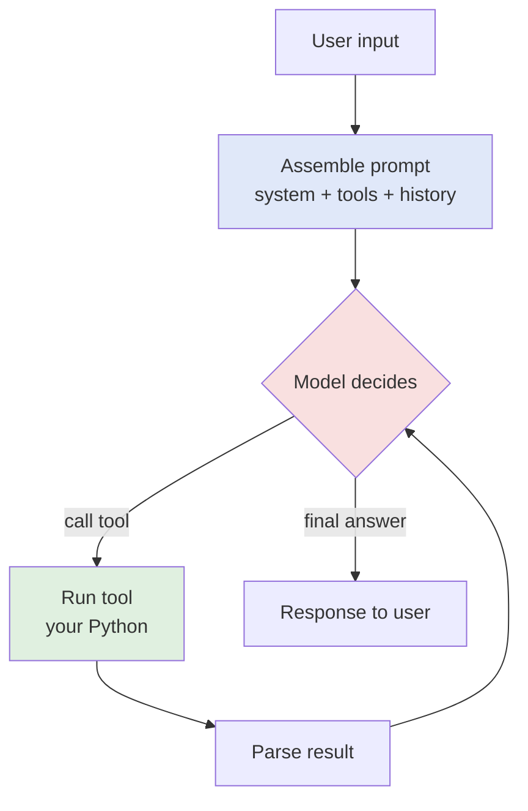
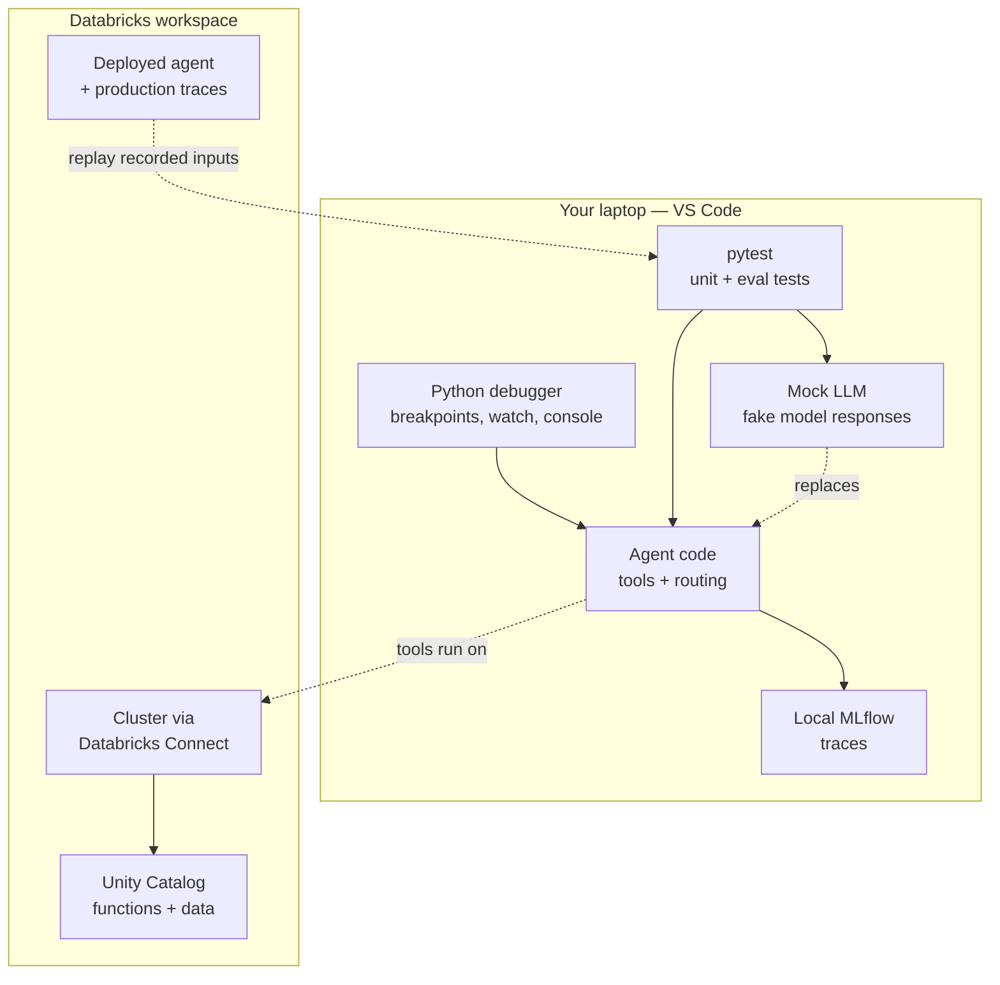

# Debugging & Testing Agents Locally

> Picture two engines on a workbench. The first is sealed in black steel — no window, no dipstick, no way in. When it misbehaves you can only shake it, listen for a rattle, and guess. The second sits behind glass, and better still, you can *pause it mid-stroke*: freeze the pistons, read every gauge, turn the crankshaft by hand one degree at a time. A notebook running an agent is the black box. VS Code with a debugger is the glass-walled engine. This lesson is about moving your agent from the first bench to the second.

You already debug data pipelines. When a Spark job produces wrong numbers, you do not just rerun it and hope — you inspect the DataFrame, check the join keys, add a `display()`, narrow it down. Agents deserve the same rigor. But agents feel harder, because they are **nondeterministic**: the same input can produce different tool calls, different phrasing, different failures. That scares people into treating agents as unknowable magic.

They are not magic. An agent is ordinary Python that happens to call a model. The model is nondeterministic; the *code around it* — your tools, your routing, your parsing — is perfectly deterministic and perfectly debuggable. This lesson shows you how to pause that code mid-run, test the deterministic parts with `pytest`, mock the model so tests are fast and repeatable, and replay a real production failure on your laptop until you understand it.

Take a breath. By the end you will trust your agent the way you trust a well-tested pipeline.

## Learning Objectives

By the end of this lesson, you will be able to:

- Use the **VS Code Python debugger** — breakpoints, step over/into/out, the Watch panel, and the Debug Console — and configure it with a `launch.json`.
- Explain *why* agents are hard to debug (nondeterminism, tool calls, hidden prompts) and how a debugger plus local tracing cut through the fog.
- Write **unit tests** with `pytest` for the deterministic parts of an agent — tools and pure functions.
- **Mock or stub the LLM call** so your tests run in milliseconds and give the same answer every time.
- Distinguish **eval tests** (offline datasets scored by judges) from unit tests, and run a small eval locally.
- Use **local MLflow tracing** to see every step the agent took.
- **Reproduce a production failure** locally by replaying its recorded inputs.

## Prerequisites

- [A repo-first AI project](/agentic-coding/vscode/repo-first-project) — this lesson assumes your agent lives in a proper Python package with a `tests/` folder, not in a notebook. That structure is what makes everything below possible.
- [Databricks Connect](/agentic-coding/vscode/databricks-connect) — helpful when your tools touch Spark or Unity Catalog and you want to run them against real compute from local code.

If those feel comfortable, you are ready. If not, skim them first — the payoff compounds here.

## Estimated Reading Time

About 25 to 30 minutes, plus time to try the debugger and run the sample tests yourself. This is a hands-on lesson; the value is in doing, not just reading.

## Business Motivation

Northwind Trust shipped a **support agent** that answers customer questions about accounts and policies. It calls two tools: `account_lookup` (a Unity Catalog function) and `policy_search` (a Vector Search retrieval tool). It worked in the demo.

Then a ticket lands on Maya's desk. A customer asked, *"Can I increase my gold-tier limit?"* — a **policy** question. The agent instead called `account_lookup`, returned the customer's balance, and confidently answered a question nobody asked. The customer was confused; the support rep was embarrassed.

In a notebook, Maya's options are grim. She can rerun the cell and hope it misbehaves again — but it is nondeterministic, so maybe it does, maybe it does not. She can sprinkle `print()` statements and squint at the output. She can stare at the prompt and theorize. Every one of these is "shake the black box and listen."

Maya wants the glass-walled engine. She wants to **pause the agent the instant before it chooses a tool**, read exactly what the model saw, and watch which branch of her routing code fired. She wants a **test that reproduces the bug every single time** so she knows when it is fixed. And she wants that test to run in the CI pipeline so it never regresses.

That is the difference between "we think we fixed it" and "we proved we fixed it." For a financial services firm, that difference is the whole job.

## Intuition

Why are agents genuinely harder to debug than a normal function? Three reasons, and each has a fix.

1. **Nondeterminism.** The model can answer differently on identical input. A bug that appears one run in five is agony to chase by rerunning.
2. **Tool calls.** The agent's behavior emerges from a *loop* — model decides, tool runs, model reads the result, decides again. The bug might be in the model's choice, in the tool, or in how you parsed the tool's output. You need to see *which*.
3. **Hidden prompts.** The model does not see your Python variables. It sees a prompt string you assembled — system message, tool descriptions, conversation history. Half of all "the model is dumb" bugs are actually "the prompt was wrong and I never looked at it."

Here is the mental model of the loop you are trying to make visible:



*Diagram 1: The agent loop. The pink box (model decision) is nondeterministic. The green box (tool) and blue box (prompt assembly) are your deterministic code — fully testable and debuggable. Most bugs live in the boxes you control, not in the model.*

The insight that unlocks everything: **isolate the deterministic from the nondeterministic.** Debug and unit-test the boxes you own. For the one pink box, either freeze it (mock the model) or observe it (trace what it saw and chose). Do that and the agent stops feeling like magic.

## Theory

Two categories of test do different jobs, and confusing them is a classic mistake.

**Unit tests** check deterministic code: given input X, the function returns exactly Y. Your tools are perfect unit-test targets — `account_lookup(42)` should always return account 42's status. Pure helper functions (prompt assembly, output parsing, routing logic) are too. Unit tests are fast, run offline, and either pass or fail — no judgment call. They belong in every commit and every CI run.

**Eval tests** check the *quality* of the agent's overall behavior, which is nondeterministic and has no single right answer. You cannot assert `agent("increase my limit") == "exact string"`, because the phrasing varies and still be correct. Instead you build an **evaluation dataset** — a set of representative inputs, often with reference answers or graded criteria — and score the agent's outputs with a **judge** (frequently another LLM, or a rule). Eval gives you a *score* ("87% of policy questions routed correctly"), not a green check. It answers "did the agent get *better or worse*?" — the question unit tests cannot.

You need both. Unit tests keep the machinery correct; eval keeps the behavior good. This lesson lives mostly in unit-test land, because that is where the IDE and debugger shine, but we run a small eval too so you feel the difference. Eval is deep enough to have its own track — see [Why Evaluation Is Hard](/docs/evaluation/why-eval-is-hard) and [Evaluation Datasets](/docs/evaluation/evaluation-datasets).

The third leg is **tracing**: a record of every step the agent took — each prompt, each tool call, each result. Tracing does not pass or fail; it *shows you what happened*. When a unit test cannot reproduce a bug and an eval score dips, the trace tells you the story. We use local MLflow tracing here; the full treatment is in [MLflow Tracing](/docs/tracing/mlflow-tracing) and [Instrumenting Agents](/docs/tracing/instrumenting-agents).

## Deep Dive

Let's get concrete about the VS Code Python debugger, because it is the tool most data engineers underuse.

A **breakpoint** is a red dot you click in the gutter next to a line number. When execution reaches that line, it *stops* — before running the line — and hands you the controls. No more `print()` archaeology. You are now standing inside the running program.

Once paused, the toolbar gives you:

- **Continue** (`F5`) — run until the next breakpoint.
- **Step Over** (`F10`) — run the current line and stop on the next one, treating any function call as a single step. Use this to move through a function you trust.
- **Step Into** (`F11`) — if the current line calls a function, *go inside it* and stop on its first line. Use this to descend into your tool or your parser.
- **Step Out** (`Shift+F11`) — finish the current function and stop where it was called. Use this when you have seen enough of a function and want back up.

While paused, three panels are your instruments:

- **Variables** — every local and global in scope, expandable. See exactly what `messages`, `tool_name`, and `args` hold *right now*.
- **Watch** — pin an expression like `len(messages)` or `response.tool_calls[0].name` and VS Code re-evaluates it at every stop. This is the dipstick for the value you care about most.
- **Debug Console** — a live Python REPL *in the paused frame*. Type `messages[-1]["content"]` and read the actual prompt text the model saw. Call `json.dumps(args, indent=2)` to pretty-print. This is where hidden-prompt bugs die.

:::tip[The Debug Console is the single most powerful anti-agent-mystery tool]
Pause right before the model call and print the fully assembled prompt from the Debug Console. Nine times out of ten, "the model chose the wrong tool" turns out to be "the tool descriptions were ambiguous" or "the history I passed was stale." You cannot fix a prompt you have never read.
:::

The debugger is configured with a **`launch.json`** file in a `.vscode/` folder. It tells VS Code *how* to start your program under the debugger — which file, which arguments, which environment variables, whether to stop inside library code. You can keep several named configurations (run the agent, run one test, attach to a process) and pick from a dropdown. We show a real one in the walkthrough.

None of this is Databricks-specific — it is the standard Python debugger, portable to any AI work you do. When your tools use Spark via [Databricks Connect](/agentic-coding/vscode/databricks-connect), the debugger pauses in your local code while the Spark work runs on the remote cluster, so you can inspect a DataFrame's plan locally and still step through your routing logic. That combination is exactly why VS Code beats a notebook for this.

## Architecture

Here is how the pieces fit together around one agent under development.



*Diagram 2: The local development surface. The debugger and pytest drive your agent code; the mock LLM replaces the nondeterministic model during tests; MLflow captures traces. Tools can reach real Databricks compute via Databricks Connect, and recorded production inputs flow back down to reproduce failures locally.*

The theme: pull as much as possible onto your laptop where you have full control, and connect to the remote workspace only for the parts that truly need it (real data, real Spark). Testing and debugging happen where the glass wall is.

## Step-by-Step Walkthrough

Follow Maya as she hunts the wrong-tool bug. No new code yet — just the sequence, so the shape is clear.

1. **Reproduce it deterministically.** She grabs the failing input — *"Can I increase my gold-tier limit?"* — from the production trace and writes a test that runs the agent on exactly that input. First she must stop the nondeterminism from hiding the bug: she **mocks the model** to replay the same decision the trace showed.
2. **Set a breakpoint.** She clicks the gutter on the line in her routing code that reads the model's chosen tool, just before the tool runs.
3. **Launch under the debugger.** Using a `launch.json` config, she runs the agent (or the test) with debugging enabled. Execution stops at her breakpoint.
4. **Read what the model saw.** In the Debug Console she prints the assembled prompt. There it is: the tool descriptions listed `account_lookup` as *"look up account details and limits"* — the word "limits" pulled the model toward the account tool for a policy question.
5. **Watch the decision.** She adds `response.tool_calls[0].name` to the Watch panel and confirms it says `account_lookup`. The bug is not the tool or the parser — it is the ambiguous description feeding the model's choice.
6. **Fix and prove it.** She rewrites the description to *"look up a customer's current balance and account status (not policy rules)."* She turns the reproduction into a permanent **unit test on the routing logic** and a small **eval** over ten policy questions to confirm the fix generalizes, not just passes the one case.
7. **Guard it in CI.** The tests go into the repo. Now the pipeline fails if anyone reintroduces the ambiguity. Proven, not hoped.

Feel the difference from shaking the black box? Every step produced evidence.

## Hands-on Examples

Everything below is realistic but illustrative — library names and MLflow APIs evolve, so verify current specifics in the [pytest docs](https://docs.pytest.org/) and the [MLflow tracing track](/docs/tracing/mlflow-tracing) before you rely on exact syntax. Assume the repo layout from the [repo-first lesson](/agentic-coding/vscode/repo-first-project):

```
support_agent/
  agent.py          # the agent loop + routing
  tools.py          # account_lookup, policy_search
  prompts.py        # prompt assembly
tests/
  test_tools.py
  test_routing.py
  eval/
    dataset.jsonl
    test_eval.py
.vscode/
  launch.json
```

## Code Examples

**1 — A `launch.json` for debugging the agent and the tests.**

```json
{
  "version": "0.2.0",
  "configurations": [
    {
      "name": "Debug: run agent on one input",
      "type": "debugpy",
      "request": "launch",
      "program": "${workspaceFolder}/support_agent/agent.py",
      "args": ["--question", "Can I increase my gold-tier limit?"],
      "console": "integratedTerminal",
      "justMyCode": true,
      "env": { "MLFLOW_TRACKING_URI": "file:./mlruns" }
    },
    {
      "name": "Debug: current pytest file",
      "type": "debugpy",
      "request": "launch",
      "module": "pytest",
      "args": ["${file}", "-v"],
      "console": "integratedTerminal",
      "justMyCode": false
    }
  ]
}
```

The first config launches the agent on a single question so Maya can step through the live loop. The second runs `pytest` on whatever test file is open — invaluable for stepping *into* a failing test. Note `justMyCode`: `true` skips library internals (usually what you want); set it `false` when you must step into a dependency. The `debugpy` type is the current Python debugger; verify the exact field names in the [VS Code Python tutorial](https://code.visualstudio.com/docs/python/python-tutorial) as they occasionally shift.

**2 — A pytest unit test for a tool (deterministic, no model involved).**

```python
# tests/test_tools.py
import pytest
from support_agent.tools import account_lookup, policy_search

def test_account_lookup_returns_status_for_known_id():
    result = account_lookup(customer_id=42)
    assert result["account_id"] == 42
    assert result["status"] in {"active", "closed", "suspended"}
    assert "tier" in result

def test_account_lookup_rejects_unknown_id():
    with pytest.raises(KeyError):
        account_lookup(customer_id=-1)

@pytest.mark.parametrize("query,expected_topic", [
    ("gold tier limit increase", "limits"),
    ("how do I close my account", "account_closure"),
])
def test_policy_search_finds_relevant_topic(query, expected_topic):
    hits = policy_search(query, k=3)
    assert any(h["topic"] == expected_topic for h in hits)
```

No LLM here at all. These test the *tools* — the deterministic engine parts. They are fast, repeatable, and belong in every CI run. If a tool touches Unity Catalog or Spark, you either point it at a small test fixture or run it against a dev cluster via Databricks Connect; keep the slow ones marked (e.g. `@pytest.mark.integration`) so the fast suite stays fast.

**3 — Mocking the LLM so a routing test is fast and repeatable.**

```python
# tests/test_routing.py
from unittest.mock import MagicMock
from support_agent.agent import decide_tool

def make_fake_model(tool_name, args):
    """A stand-in model that always 'chooses' the given tool."""
    fake = MagicMock()
    fake.invoke.return_value = MagicMock(
        tool_calls=[{"name": tool_name, "args": args}]
    )
    return fake

def test_policy_question_routes_to_policy_search():
    # We control the model's decision, so the test is deterministic.
    model = make_fake_model("policy_search", {"query": "gold-tier limit"})
    choice = decide_tool(
        question="Can I increase my gold-tier limit?",
        model=model,
    )
    assert choice.name == "policy_search"

def test_prompt_includes_unambiguous_tool_descriptions():
    # Guard the exact bug Maya fixed: the description must steer
    # policy questions away from account_lookup.
    from support_agent.prompts import build_tool_descriptions
    text = build_tool_descriptions()
    assert "not policy rules" in text.lower()
```

This is the key move. By passing the model in (dependency injection) and replacing it with a `MagicMock`, the test never calls a real LLM — so it runs in milliseconds and gives the *same answer every time*. The first test pins your routing behavior; the second is a regression guard on the actual prompt string, freezing Maya's fix in place. Note how testable code makes this easy: because `decide_tool` accepts a `model` argument instead of reaching for a global, we can swap in a fake. If your agent hardcodes the model, refactor it to accept one — your future testing self will thank you.

**4 — A small local eval (nondeterministic behavior, scored not asserted).**

```python
# tests/eval/test_eval.py
import json, pathlib
from support_agent.agent import run_agent

CASES = [json.loads(l) for l in
         pathlib.Path("tests/eval/dataset.jsonl").read_text().splitlines()]

def judge_correct_tool(output, expected_tool):
    """A cheap rule-based judge: did the agent call the expected tool?"""
    return expected_tool in [c["name"] for c in output["tool_calls"]]

def test_policy_routing_accuracy_meets_threshold():
    correct = 0
    for case in CASES:
        output = run_agent(case["question"])   # real model here
        if judge_correct_tool(output, case["expected_tool"]):
            correct += 1
    accuracy = correct / len(CASES)
    # Eval yields a SCORE and a threshold, not an exact-match assert.
    assert accuracy >= 0.9, f"policy routing accuracy {accuracy:.0%} < 90%"
```

Notice the difference from the unit tests: this one runs the *real* model over a dataset and produces a **score** with a threshold, because there is no single correct string. A real judge is often another LLM grading answer quality, not just a tool-name rule — that is where the [evaluation track](/docs/evaluation/why-eval-is-hard) goes deep. Run this locally before you ship, and again in CI on a schedule; it catches quality regressions unit tests never could.

**5 — Local MLflow tracing to see the agent's steps.**

```python
# support_agent/agent.py (excerpt)
import mlflow

mlflow.set_tracking_uri("file:./mlruns")   # local, no workspace needed
mlflow.openai.autolog()                    # auto-capture model calls; verify current API

@mlflow.trace
def run_agent(question: str) -> dict:
    prompt = build_prompt(question)
    decision = model.invoke(prompt)         # captured as a span
    ...
```

With autologging on and `@mlflow.trace`, each run records a **trace** — the prompt, the model's decision, every tool call and result — that you can open in the local MLflow UI (`mlflow ui`). When a bug will not reproduce under the debugger, the trace shows you exactly what happened on the run that failed. Tracing works the same locally and in production; see [Instrumenting Agents](/docs/tracing/instrumenting-agents) for the full pattern. Confirm the exact autolog/trace API in the [MLflow tracing lesson](/docs/tracing/mlflow-tracing), as these helpers evolve.

**6 — Reproducing a production failure locally by replaying its inputs.**

```python
# tests/test_reproductions.py
import json
from support_agent.agent import run_agent

def test_replay_ticket_4817():
    # Recorded from the production trace that generated the bad answer.
    recorded = json.loads(open("tests/fixtures/ticket_4817.json").read())
    output = run_agent(recorded["question"])
    # Assert the FIXED behavior, so this becomes a permanent regression guard.
    assert "policy_search" in [c["name"] for c in output["tool_calls"]]
    assert "account_lookup" not in [c["name"] for c in output["tool_calls"]]
```

This is the payoff of tracing plus tests. Maya exported the failing production trace's input into a fixture file, wrote a test that replays it, and asserted the *corrected* behavior. The bug that once required a customer complaint to notice is now caught automatically, forever, on her laptop and in CI. That is the black box becoming glass.

## Production Considerations

- **Run the fast suite on every commit.** Unit tests and mocked-LLM tests are cheap; wire them into pre-commit and CI (see [CI/CD and Rollback](/docs/llmops/cicd-and-rollback) is on the docs track for the deployment side). Keep the whole fast suite under a few seconds so people actually run it.
- **Run eval on a schedule and before release.** Eval is slower and costs model calls. Gate releases on an eval threshold rather than exact matches, and track the score over time so you see drift.
- **Turn every production incident into a reproduction test.** Like ticket 4817. A bug without a test is a bug that will come back. This is your regression net growing itself.
- **Keep test fixtures out of live systems.** Recorded inputs may contain customer data — scrub or synthesize PII before it lands in the repo (more in Security below).
- **Separate fast and slow tests with markers.** `@pytest.mark.integration` and `@pytest.mark.eval` let you run `pytest -m "not integration"` for the quick loop and the full set in CI.

## Team & Collaboration Considerations

- **Commit `.vscode/launch.json`.** Shared debug configs mean a teammate can hit "Debug: current pytest file" without reinventing it. It is documentation that runs.
- **Make the model injectable everywhere.** If one person hardcodes the model and another mocks it, tests fight each other. Agree as a team that agent code takes the model (and other clients) as arguments.
- **Share the eval dataset like a fixture.** The dataset *is* your definition of "good behavior." Version it, review changes to it in PRs, and treat adding a case as a first-class contribution.
- **Traces are a shared vocabulary.** When someone says "the agent did the wrong thing," ask for the trace. It replaces "it felt off" with a concrete artifact everyone can read.

## Security Considerations

- **Never mock away security checks in a way that ships.** Mocking the *model* is fine; mocking out a Unity Catalog permission check and forgetting to restore it is how a test double becomes a production hole. Keep mocks in `tests/` only.
- **Scrub recorded inputs.** Production traces and replay fixtures can carry account numbers, names, balances. Redact or synthesize before committing — a repo is not a governed store. For a financial firm like Northwind Trust this is non-negotiable.
- **Do not put credentials in `launch.json`.** Use environment variables or a profile (as set up in the Databricks extension lesson), never hardcoded tokens in a file you commit.
- **Keep local traces local.** `file:./mlruns` writes traces to disk; make sure that path is gitignored and does not sync anywhere it shouldn't. Production tracing belongs in the governed workspace, not a laptop.

## Common Mistakes

- **Trying to unit-test the model's exact words.** `assert response == "Yes, your limit is..."` will flake forever. Assert on the deterministic decision (which tool, which args), or score with eval.
- **Debugging by rerunning and hoping.** Nondeterminism means a rerun may hide the bug. Reproduce it by mocking the model to replay the failing decision, *then* debug.
- **Never reading the actual prompt.** Blaming the model before printing the assembled prompt in the Debug Console. Read it first — the bug is usually there.
- **No dependency injection.** Hardcoding the model client so you cannot mock it. Refactor to pass it in.
- **Confusing eval with unit tests.** Expecting eval to give a green check, or expecting unit tests to measure quality. They answer different questions.
- **Letting the test suite get slow.** If the fast loop takes a minute because it calls real models, people stop running it. Mock aggressively; mark the slow ones.

## Best Practices

- **Isolate deterministic from nondeterministic.** Unit-test and debug the code you own; mock or eval the model. This one principle organizes everything.
- **Make the LLM injectable and mock it in fast tests.** Fast, repeatable, offline. Save real model calls for eval.
- **Set a breakpoint before the model call and read the prompt.** Highest-leverage debugging habit for agents.
- **Turn every failure into a reproduction test.** Grow your regression net from real incidents.
- **Trace locally while developing.** `file:./mlruns` costs nothing and shows you what happened when the debugger cannot.
- **Keep two suites: fast (every commit) and full (eval + integration, before release).** Speed for the loop, thoroughness for the gate.
- **Verify evolving APIs.** MLflow tracing helpers, `debugpy` fields, and framework mocking hooks change — check current docs before depending on exact syntax.

## Interview Questions

1. **Why are agents harder to debug than ordinary functions, and how do you make them tractable?**
   Look for: nondeterminism, tool-call loops, hidden prompts. The fix: isolate deterministic code (tools, routing, parsing) and unit-test/debug it; mock or trace the model. Bonus: reproduce nondeterministic bugs by replaying recorded inputs with a mocked decision.

2. **What is the difference between a unit test and an eval test for an agent?**
   Look for: unit tests check deterministic code and pass/fail; eval tests measure nondeterministic behavior quality over a dataset, producing a score against a threshold, often scored by a judge. Both are needed; they answer different questions.

3. **How would you write a fast, repeatable test for an agent's tool-routing logic?**
   Look for: dependency-inject the model, replace it with a mock that returns a fixed tool decision, assert on the chosen tool/args. No real model call, runs in milliseconds, deterministic.

4. **Walk me through using the VS Code debugger to find why an agent chose the wrong tool.**
   Look for: breakpoint before the model call or tool dispatch, launch via launch.json, inspect Variables/Watch, print the assembled prompt in the Debug Console, identify whether the fault is the prompt, the model's choice, the tool, or the parser.

5. **A production run gave a bad answer. How do you reproduce and fix it without shipping guesses?**
   Look for: pull the input from the production trace, write a replay test, mock the decision if needed to make it deterministic, debug to root cause, fix, then assert the corrected behavior so the test becomes a permanent regression guard in CI.

6. **When and why would you mock the LLM, and what should you *not* mock?**
   Look for: mock the model in unit/routing tests for speed and determinism; do not mock security/permission checks in anything that could ship, and keep mocks confined to the test suite. Real model calls belong in eval.

## Quiz

**Q1.** Your test asserts `agent("increase my limit") == "Yes, you can raise your gold-tier limit."` and it keeps flaking. What is wrong, and what should you do instead?

<details>
<summary>Show answer</summary>

You are asserting the model's exact wording, which is nondeterministic — correct answers vary in phrasing. Either assert on the deterministic part (which tool was called, with which arguments) in a unit test, or measure quality with an **eval** that scores outputs against a threshold using a judge, rather than an exact-match assertion.

</details>

**Q2.** Why mock the LLM in a routing test, and how do you make the model mockable in the first place?

<details>
<summary>Show answer</summary>

Mocking makes the test fast (no network/model latency) and **repeatable** (the model "decides" the same thing every run), so it can pass or fail deterministically. You make it mockable with **dependency injection**: have the agent accept the model as an argument instead of reaching for a global, then pass a `MagicMock` (or similar) in the test.

</details>

**Q3.** The agent chose the wrong tool. Which VS Code debugger feature lets you see the exact prompt the model received, and why is that often where the bug is?

<details>
<summary>Show answer</summary>

The **Debug Console** — a live REPL in the paused frame — lets you print the fully assembled prompt (e.g. `messages[-1]["content"]` or the tool descriptions). It is often the bug because the model only sees the prompt string you built, not your variables; ambiguous tool descriptions or stale history steer the wrong choice, and you cannot fix a prompt you have never read.

</details>

**Q4.** What is the difference between what a *trace* gives you and what a *test* gives you?

<details>
<summary>Show answer</summary>

A **test** gives a verdict (pass/fail for unit tests, a score for eval) — it tells you *whether* behavior is correct or good. A **trace** gives a record of what actually happened on a run — every prompt, tool call, and result — so it tells you *why*. Traces are how you diagnose a failure a test flagged but cannot explain, and how you capture a production input to replay locally.

</details>

## Summary

Agents feel unknowable because of nondeterminism, tool-call loops, and hidden prompts — but the code around the model is ordinary, deterministic Python you can pause, inspect, and test. The move that unlocks everything is isolating the deterministic parts from the one nondeterministic box.

You learned to drive the **VS Code Python debugger** — breakpoints, step over/into/out, Variables, Watch, and the Debug Console — configured with a `launch.json`, and to read the actual assembled prompt where most "dumb model" bugs hide. You write **unit tests** with pytest for tools and pure functions, and you **mock the LLM** (via dependency injection) so routing tests are fast and repeatable. You distinguish those from **eval tests**, which score nondeterministic behavior over a dataset against a threshold. You capture **local MLflow traces** to see what happened, and you **replay recorded production inputs** to reproduce a failure and freeze the fix as a permanent regression test.

Maya moved her support agent from a sealed black box to a glass-walled engine she can pause mid-run. You can do the same — and prove your fixes instead of hoping.

## Key Takeaways

- Agents are hard to debug because of **nondeterminism, tool-call loops, and hidden prompts** — but the code around the model is deterministic and fully testable.
- **Isolate deterministic from nondeterministic**: debug and unit-test tools/routing/parsing; mock or trace the model.
- The **VS Code debugger** (breakpoints, step controls, Watch, Debug Console, `launch.json`) lets you pause the agent and read exactly what the model saw.
- **Mock the LLM** via dependency injection so unit/routing tests are fast and repeatable; keep mocks out of anything that ships.
- **Eval tests differ from unit tests**: they score nondeterministic behavior over a dataset with a judge, against a threshold — not exact matches.
- **Local MLflow traces** show what happened; **replaying recorded production inputs** reproduces failures and turns them into permanent regression tests.

## Glossary

- **Breakpoint:** A marker on a line that pauses execution *before* that line runs, handing you the debugger controls.
- **Step over / into / out:** Debugger commands to run the current line without descending, to descend into a called function, or to finish the current function and return to its caller.
- **Watch:** A debugger panel that re-evaluates a pinned expression at every stop.
- **Debug Console:** A live Python REPL that runs in the paused frame, letting you print and evaluate anything in scope — including the assembled prompt.
- **`launch.json`:** A VS Code file in `.vscode/` that defines named configurations for how to start a program under the debugger.
- **Unit test:** A fast, deterministic test that checks a specific input produces a specific output; ideal for tools and pure functions.
- **Mock / stub:** A fake stand-in for a real dependency (like the LLM) that returns fixed values, making tests fast and repeatable.
- **Dependency injection:** Passing a dependency (e.g. the model client) into code as an argument rather than hardcoding it, so it can be replaced in tests.
- **Eval test:** A test that scores nondeterministic agent behavior over a dataset using a judge, reported as a score against a threshold.
- **Judge:** A rule or (often) an LLM that scores an agent's output for correctness or quality in an eval.
- **Evaluation dataset:** A curated set of representative inputs (often with reference answers or criteria) used to score agent behavior.
- **Trace:** A recorded sequence of an agent's steps — prompts, tool calls, results — used to see *what happened* on a run.
- **Reproduction test:** A test built from a real failing input (often from a production trace) that asserts the corrected behavior, guarding against regression.

## Further Reading

- [pytest documentation](https://docs.pytest.org/) — fixtures, parametrization, markers, and mocking patterns.
- [VS Code: Python tutorial](https://code.visualstudio.com/docs/python/python-tutorial) — configuring the Python debugger and `launch.json`.
- [MLflow Tracing (docs track)](/docs/tracing/mlflow-tracing) and [Instrumenting Agents](/docs/tracing/instrumenting-agents) — the full local-and-production tracing story.
- [Why Evaluation Is Hard](/docs/evaluation/why-eval-is-hard) and [Evaluation Datasets](/docs/evaluation/evaluation-datasets) — how to build and score offline evals properly.

## Next Lesson

You can now pause, test, mock, trace, and reproduce — your agent is debuggable. Next, bring AI *into the editor itself*: assistants and MCP servers that help you write and reason about this very code.

➡️ [AI Assistants & MCP in Your Editor](/agentic-coding/vscode/ai-assistants-and-mcp)
