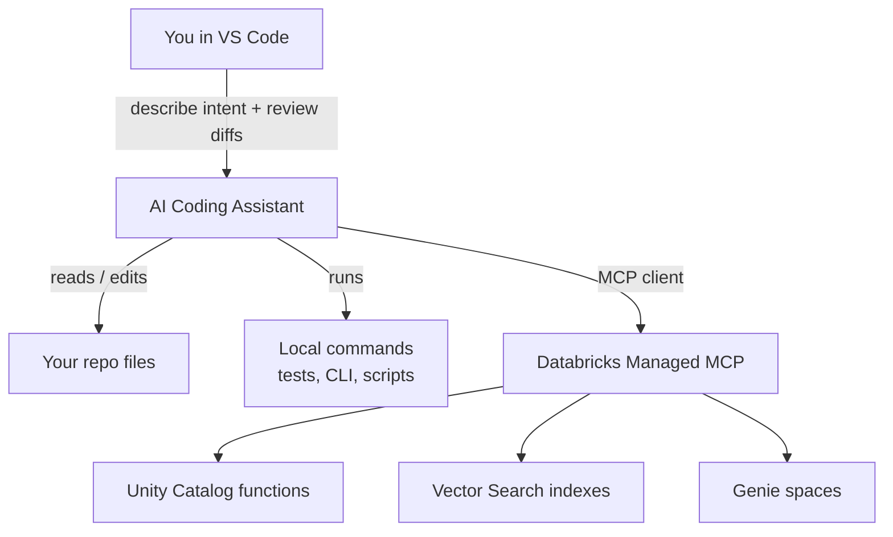
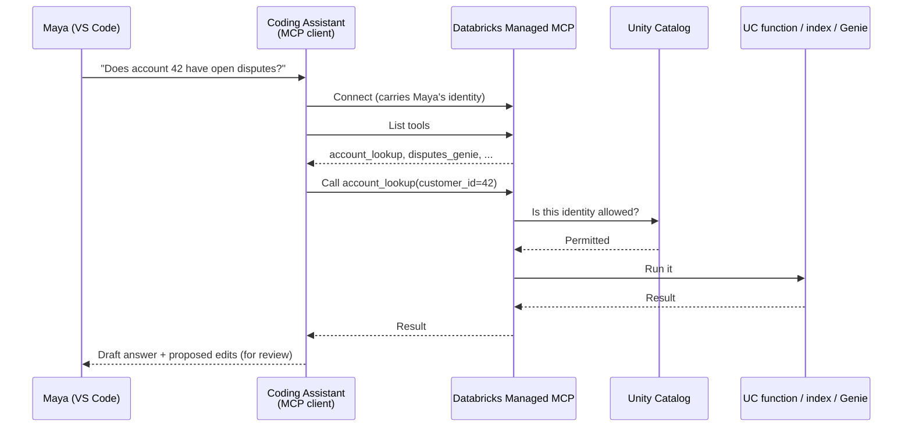

# AI Assistants & MCP in Your Editor

> Imagine hiring a sharp new teammate on their first morning. In minutes they've read your entire codebase — every module, every test, every half-finished TODO — faster than any human could. They're eager and fast. But you would never hand them production keys and walk away. You review their pull requests, and you give them only the credentials the job requires. An AI coding assistant in your editor is exactly that teammate: astonishingly well-read, genuinely useful, and best kept on a short, governed leash.

You've spent this subtopic turning VS Code into a real engineering environment — the Databricks extension, Databricks Connect, Asset Bundles, a repo-first project, and a debugging-and-tests workflow. Now we add the last layer: an **AI coding assistant** that works *inside* that environment, and a way to let it reach your **governed Databricks tools** over MCP.

Two ideas, tightly connected. First, what an agentic coding assistant actually does in the editor. Second, how connecting it to Databricks managed MCP servers lets it call Unity Catalog functions, Vector Search indexes, and Genie spaces — as tools, under your identity, governed by Unity Catalog. Take a breath; you already know most of the pieces.

## Learning Objectives

By the end of this lesson, you will be able to:

- Explain what an **agentic coding assistant** does in VS Code — read the repo, edit files, run code, and drive multi-step changes with a human in the loop.
- Distinguish the main **categories** of assistant: the Databricks Assistant, general assistants like GitHub Copilot, and agentic CLIs/assistants like Claude Code.
- Recap MCP in one paragraph and describe how an editor assistant acts as an **MCP client**.
- Wire a coding assistant to Databricks **managed MCP servers** so it can discover and call Unity Catalog functions, Vector Search, and Genie as governed tools.
- Explain why the assistant runs **under your identity**, why **Unity Catalog** still governs every call, and why **human review of diffs** is non-negotiable.

## Prerequisites

Before this lesson, it helps to have read:

- [Debugging & Testing in VS Code](/agentic-coding/vscode/debugging-and-testing) — the local run/test loop an assistant will drive on your behalf.
- [MCP: A Universal Plug for Tools](/docs/agents-tools-mcp/mcp) — the standard we lean on here. We'll recap it, but the full lesson makes this click faster.
- [What Is an Agent?](/docs/agents-tools-mcp/what-is-an-agent) and [How Function Calling Works](/docs/agents-tools-mcp/function-calling) — the reasoning loop the assistant uses to decide which tool to call.

If those feel comfortable, you're ready. If not, skim them — this lesson stands on its own and reminds you of the key ideas as they come up.

## Estimated Reading Time

About 20 to 25 minutes, plus a few minutes to skim the config examples. Nothing to install to follow along.

## Business Motivation

Back to **Northwind Trust**, our mid-sized financial services firm, and **Maya**, the data engineer who's been building their agent platform from VS Code.

Maya's team ships a lot of small, similar changes: a new Unity Catalog function here, a tweak to an Asset Bundle target there, a fix to an eval test that keeps flaking. Each is quick on its own, but the context-switching is expensive — open the right files, remember the schema, recall the CLI flag, run it, read the traceback, try again.

An AI coding assistant collapses that loop. Maya describes the change in plain English — "add a `dispute_status` function to the `northwind` schema and a unit test for it" — and the assistant reads the surrounding code, drafts the function and the test, and offers to run the test. Maya reviews the diff, approves, and moves on. The tedious middle is gone; her judgment stays firmly in the loop.

But here's the Northwind-specific twist. Their assistant is far more useful if it can *reach their governed tools*. When Maya asks "does account 42 have any open disputes?", she doesn't want the assistant to hallucinate — she wants it to actually call the `account_lookup` Unity Catalog function, or query the `disputes` Genie space, and answer from real data. That's what MCP buys her: the same governed toolset the production agents use, now available to the assistant in her editor. Build once, use everywhere — including at the keyboard.

The payoff is speed *without* loosening governance. A regulated firm can't hand an AI tool a master key. With MCP and Unity Catalog, it doesn't have to.

## Intuition

Picture two layers. The **assistant** lives in your editor and can see your repo and run your local commands. **MCP** is the extra door it can walk through to reach governed Databricks tools — the same door your production agents use.



*Diagram 1: The assistant sits between you and your work. Locally it reads and edits the repo and runs commands. Over MCP it reaches your governed Databricks tools — the same ones production agents use. You stay in the loop, approving what it does.*

That's the whole shape. The assistant is a fast, well-read teammate. MCP is the standard plug that lets it use your real tools instead of guessing. And everything it reaches through MCP is still governed by Unity Catalog, exactly as it would be for any other agent.

## Theory

Let's put names to the two ideas.

**An agentic coding assistant** is more than autocomplete. Older assistants suggested the next line of code. An *agentic* one operates in a loop: it reads relevant files, proposes a plan, edits multiple files, runs a command (a test, a build, a CLI call), reads the result, and iterates — pausing for your approval at the steps that matter. It's the same agent loop you learned in the docs track (perceive, decide, act, observe), pointed at *your codebase and terminal* instead of a chat window.

There are three broad **categories** you'll meet. This is a pattern, not a product ranking — the categories matter more than any one tool.

- **The Databricks Assistant.** Built into Databricks surfaces (and available through the Databricks extension for VS Code). It's Databricks-aware: it knows about your catalogs, notebooks, and workspace context. Reach for it when the work is squarely Databricks-flavored.
- **General coding assistants**, like **GitHub Copilot**. Editor-native, language-agnostic, great at everyday code across any stack. Not Databricks-specific, but excellent for the 80% of work that's just software.
- **Agentic CLIs and assistants**, like **Claude Code**. These lean hardest into the multi-step, run-and-observe loop — driving your terminal, editing across many files, and orchestrating whole tasks. We cover this style in depth in its own subtopic: [Claude Code](/agentic-coding/claude-code/intro).

**MCP**, briefly. The Model Context Protocol is an open standard — a universal plug — for how an agent discovers and calls tools. An **MCP server** offers tools and describes them; an **MCP client** connects, asks "what tools do you have?", and calls the ones it needs. Databricks **managed MCP servers** expose your existing Unity Catalog functions, Vector Search indexes, and Genie spaces as tools with no glue code. (The full story is in [MCP: A Universal Plug for Tools](/docs/agents-tools-mcp/mcp).)

The connection between the two ideas: **your editor's assistant is just another MCP client.** Point it at an MCP server and it discovers those tools the same standard way a production agent would. MCP is not Databricks-only, either — the same client config connects to non-Databricks MCP servers (GitHub, filesystem, a web-search tool, your own internal service).

## Deep Dive

Let's separate what the assistant can do locally from what it reaches over MCP, because the governance story is different for each.

**Locally**, the assistant works within your machine and your editor's permissions. It reads files you've opened or that live in the workspace, proposes edits as diffs, and runs commands in your terminal. Its power here is bounded by *your operating-system account* and whatever approval gates the assistant enforces (many will ask before running a command or writing a file). This is ordinary developer power — the assistant is typing what you might have typed.

**Over MCP**, the story changes in an important way: the assistant now touches *governed platform resources*, and it does so **under an identity**. When it calls `account_lookup` through a Databricks managed MCP server, that call carries a credential — typically your own workspace identity when you're developing, or a service principal in automated setups. Unity Catalog checks that identity on *every* call. The assistant doesn't get a backdoor; it gets exactly the access its identity permits, and no more.

That single fact is what makes this safe for a firm like Northwind Trust. The assistant can *see* a tool in the discovered list and still be refused when it calls — because listing is not permission. Governance is enforced at call time, tied to identity, the same as for any agent. (See the [MCP lesson](/docs/agents-tools-mcp/mcp) for the full permission flow.)

The kinds of tools an editor assistant reaches over Databricks managed MCP are the same three you already know:

- **Unity Catalog functions** — your SQL/Python functions become callable tools. Great for "look up X" and "compute Y" during development.
- **Vector Search indexes** — retrieval tools. The assistant can ground an answer in your policy handbook or design docs instead of guessing.
- **Genie spaces** — natural-language questions over your tables. "How many disputes were opened last week?" answered from real data, in your editor.

And because MCP is a standard, the *same* client configuration also connects to non-Databricks MCP servers. One config file, many tools, all discovered the same way.

## Architecture

Here's how the pieces connect when Maya asks her assistant a data question from VS Code.



*Diagram 2: A data question, end to end. The assistant connects to the managed MCP server as an MCP client carrying Maya's identity, discovers tools, and calls one. Unity Catalog checks permission before anything runs. The answer — and any code the assistant wants to change — comes back to Maya for review.*

The architectural point: the assistant is a client, the managed MCP server is the port, and Unity Catalog is the lock. Nothing the assistant does over MCP escapes governance, and nothing it does in your repo escapes your review.

## Step-by-Step Walkthrough

Let's follow Maya wiring her assistant to Northwind's governed tools. No config yet — just the story.

1. **She picks an assistant.** For this task she wants tool-calling and multi-file edits, so she uses an agentic assistant in VS Code that supports MCP. (The Databricks Assistant and general assistants like Copilot fit other moments; the *pattern* is the same.)
2. **She confirms the tools already exist.** Northwind built `account_lookup` (a UC function), a `policy_handbook` Vector Search index, and a `disputes` Genie space in earlier work. Nothing new to build — managed MCP already exposes them.
3. **She adds an MCP server to the assistant's config.** She points the client at the Databricks managed MCP server URL for the `northwind` schema's functions, plus the Vector Search and Genie endpoints. (Exact URL shapes — verify in the docs.)
4. **She authenticates as herself.** During development, the assistant connects using Maya's own workspace identity via her Databricks profile/OAuth. Unity Catalog will scope everything to what Maya is allowed to touch.
5. **The assistant discovers the tools.** On connect, it lists what's available and reads each tool's description — no hardcoding.
6. **Maya works.** She asks a data question; the assistant calls `disputes_genie`. She asks for a code change; the assistant edits files and offers to run the test. **She reviews every diff** before accepting, and approves tool calls that touch anything sensitive.
7. **Later, in automation.** When the same flow runs unattended (say, in CI), the identity switches from Maya to a **service principal** with least-privilege grants. Same tools, different, tightly-scoped identity.

Notice the two leashes stayed on the whole time: identity + Unity Catalog for platform access, and human review for code changes.

## Code Examples

:::note
The following is **illustrative**. MCP client config formats, extension names, and Databricks MCP URL shapes evolve. Before you build anything, verify current details in the [Databricks MCP docs](https://docs.databricks.com/aws/en/generative-ai/mcp/) and the [MCP spec](https://modelcontextprotocol.io/). The point is the *shape*, not exact syntax.
:::

**A conceptual MCP client config.** Most editor assistants read a JSON (or similar) config that lists the MCP servers they should connect to. The shape looks like this:

```json
{
  "mcpServers": {
    "databricks-northwind-functions": {
      "url": "https://your-workspace.cloud.databricks.com/api/2.0/mcp/functions/main/northwind",
      "auth": "databricks-oauth",
      "//comment": "URL shape + auth key names: verify in Databricks docs"
    },
    "databricks-northwind-genie": {
      "url": "https://your-workspace.cloud.databricks.com/api/2.0/mcp/genie/your-genie-space-id",
      "auth": "databricks-oauth"
    },
    "github": {
      "command": "npx",
      "args": ["-y", "@modelcontextprotocol/server-github"],
      "//comment": "A NON-Databricks MCP server — same config file, same discovery"
    }
  }
}
```

Two Databricks managed servers and one non-Databricks server, all declared the same way. The assistant connects to each as an MCP client, lists their tools, and makes them available while you work. Notice you deploy nothing for the Databricks entries — the managed servers already expose your resources. (Verify the exact URL and auth keys in the docs; they change.)

**What discovery looks like from the assistant's side.** Conceptually, once connected the assistant sees a list like:

```text
From databricks-northwind-functions:
  account_lookup   - Returns status and tier of a customer account by id
  dispute_status   - Returns open disputes for an account id

From databricks-northwind-genie:
  disputes_genie   - Answers natural-language questions about the disputes table

From github:
  create_pull_request, list_issues, ...
```

The assistant never had these hardcoded. The servers published them, and the model reads the descriptions to decide which to call — the same function-calling reasoning you already know, with the tool list supplied by MCP.

**A realistic in-editor exchange (paraphrased):**

```text
You:   Does account 42 have open disputes? If so, add a `has_open_disputes`
       helper to utils.py and a unit test.

Asst:  Calling dispute_status(customer_id=42) ...
       -> 1 open dispute (id 88123, status "under_review")

       Proposed changes:
         + utils.py        (new function has_open_disputes)
         + tests/test_utils.py (new test)
       [Review diff]  [Run tests]  [Reject]
```

You review the diff, click Run tests, and stay in control. The assistant did the reading, the drafting, and the tool call; you kept the judgment.

## Production Considerations

- **Use the right assistant for the moment.** Databricks Assistant for Databricks-aware help, a general assistant for everyday code, an agentic CLI for big multi-step tasks. Don't force one tool to be all three.
- **Prefer managed MCP servers first.** For UC functions, Vector Search, and Genie, the managed servers are the least work and the most maintained path. Build custom servers only for logic that doesn't fit those buckets.
- **Separate dev and automated identities.** In your editor, connecting as yourself is fine and keeps audit trails honest. For anything unattended, use a **service principal** with least-privilege grants — never a shared human login.
- **Keep the toolset each assistant sees small and relevant.** A wall of overlapping tools makes the model choose worse and slower. Curate.
- **Pin and review what you install.** MCP servers you run locally (like the GitHub example) are code executing on your machine. Treat them like any dependency: known source, pinned version.

## Team & Collaboration Considerations

- **Check the MCP config into the repo, not the secrets.** Share the *shape* of the setup (which servers, which tools) so the team is consistent; keep tokens and profiles out of version control.
- **Agree on review norms.** "AI wrote it" is not a reason to skip review — it's a reason to review carefully. Decide as a team which actions always require human approval (schema changes, deletes, deploys).
- **Document which tools are safe to expose.** Not every Genie space or function belongs in an editor assistant. Curate a blessed list, and note why.
- **Onboard newcomers with the config.** A well-documented MCP setup turns "how do I reach our tools?" into a one-line answer, the same way Northwind reuses one governed toolset across all its agents.

## Security Considerations

Read this part twice — it's what makes editor assistants safe in a regulated shop.

- **The assistant runs under an identity, and Unity Catalog governs every call.** Over MCP, access is checked on each call against your (or the service principal's) identity. Seeing a tool in the discovered list is never the same as being allowed to call it.
- **Least privilege, always.** Grant the identity only the tools it needs. Your editor identity probably shouldn't be able to modify production accounts, even if you *can* read them.
- **Human-in-the-loop for diffs and destructive actions.** Never auto-accept edits or auto-run commands that write, delete, or deploy. Review the diff. Approve the tool call. This is the leash that catches confident mistakes.
- **Local tool calls carry your OS permissions.** A locally-run MCP server or a shell command the assistant executes has whatever access *your account* has. Be as careful as you'd be running the command yourself.
- **Guard secrets and prompt-injection surfaces.** An assistant that reads files or fetches web content can be fed malicious instructions. Don't put credentials in files the assistant reads, and be skeptical of tool output that tries to steer the assistant.
- **Auditability.** Because MCP calls flow through the platform and Unity Catalog, you get a governed, inspectable trail of what was accessed — exactly what Northwind Trust needs to answer "who touched what."

One-line summary: MCP standardizes *how* the assistant reaches tools; Unity Catalog decides *whether* it may; and you decide *whether the diff ships*.

## Common Mistakes

- **Auto-accepting edits.** The fastest way to ship a confident bug. Review diffs; that's the whole point of human-in-the-loop.
- **Connecting automated flows as a human.** Blurs audit trails and over-grants. Use a scoped service principal for anything unattended.
- **Assuming MCP grants access.** It doesn't. It's the plug; Unity Catalog is the lock. A tool appearing in the list is not permission to call it.
- **Building custom glue when a managed server exists.** If your tool is a UC function, an index, or a Genie space, managed MCP already exposes it — don't write a server.
- **Exposing everything.** Dumping every function and Genie space at the assistant makes tool choice worse and widens the blast radius. Curate.
- **Treating a general assistant as Databricks-aware (or vice versa).** Copilot is great at code; it doesn't know your catalog. The Databricks Assistant does. Match the tool to the task.

## Best Practices

- **Right assistant for the moment; MCP for the tools.** Pick the assistant that fits the task, and let MCP give it your governed toolset.
- **Managed servers first; build custom only when needed.**
- **One identity per context, least privilege.** You in the editor, a service principal in automation — each scoped tightly.
- **Review every diff; gate destructive actions.** Non-negotiable.
- **Curate a small, well-described toolset.** Clear tool descriptions drive good tool choices; fewer sharp tools beat many vague ones.
- **Check config into the repo, secrets out.** Consistent, shareable, safe.
- **Verify current specifics.** MCP on Databricks and editor integrations evolve fast — confirm URLs, auth, and extension names in the [official docs](https://docs.databricks.com/aws/en/generative-ai/mcp/).

## Interview Questions

1. **What makes a coding assistant "agentic," and how is that different from autocomplete?**
   Look for: it runs a loop — reads the repo, plans, edits multiple files, runs commands, reads results, iterates — with human approval at key steps, rather than just suggesting the next line.

2. **Name the categories of AI coding assistant and when you'd reach for each.**
   Look for: Databricks Assistant (Databricks-aware work), general assistants like GitHub Copilot (everyday code, any stack), and agentic CLIs/assistants like Claude Code (big multi-step, terminal-driven tasks). Bonus: it's a pattern, not a product ranking.

3. **How does an editor assistant use MCP, and what does connecting to Databricks managed MCP give it?**
   Look for: the assistant is an MCP client; it connects, discovers tools, and calls them. Managed MCP exposes existing UC functions, Vector Search indexes, and Genie spaces as governed tools with no glue code.

4. **When an assistant calls a Databricks tool over MCP, what governs whether the call succeeds?**
   Look for: the assistant runs under an identity (your workspace identity in dev, a service principal in automation), and Unity Catalog checks that identity on every call. Listing a tool is not permission.

5. **Why is human-in-the-loop review essential even when the assistant is usually right?**
   Look for: confident mistakes, hallucinated changes, destructive actions, and prompt-injection risk. Reviewing diffs and gating writes/deploys is the safety leash; "AI wrote it" is a reason to review more, not less.

6. **How would you set this up for an unattended CI job versus your editor?**
   Look for: same tools over MCP, but switch identity from the human to a least-privilege service principal, keep secrets out of the repo, and gate or disallow destructive tool calls in automation.

## Quiz

**Q1.** In the editor, is the AI coding assistant an MCP *server* or an MCP *client*?

<details>
<summary>Show answer</summary>

An MCP **client**. It connects to MCP servers (like Databricks managed MCP), discovers their tools, and calls them — the same role a production agent plays.

</details>

**Q2.** True or false: once an assistant can *see* a Databricks tool in its discovered list, it is allowed to call it.

<details>
<summary>Show answer</summary>

**False.** Unity Catalog checks the connecting identity on every call. Discovery lists what exists; permission decides what runs. Seeing a tool is not the same as being allowed to use it.

</details>

**Q3.** Name the three broad categories of AI coding assistant discussed, with a one-line example of each.

<details>
<summary>Show answer</summary>

The **Databricks Assistant** (Databricks-aware, in the workspace and extension), **general assistants** like **GitHub Copilot** (everyday code, any stack), and **agentic CLIs/assistants** like **Claude Code** (multi-step, terminal-driven tasks).

</details>

**Q4.** Maya's assistant connects to Databricks MCP as herself while developing, but the same flow in CI should connect differently. How, and why?

<details>
<summary>Show answer</summary>

In CI it should connect as a **service principal** with least-privilege grants, not as a human login. That keeps audit trails clean, scopes access tightly to what the automated job needs, and avoids tying unattended runs to a person's credentials.

</details>

## Summary

An AI coding assistant is a fast, well-read teammate living in VS Code: it reads your repo, edits files, runs code, and drives multi-step changes — with you approving the steps that matter. You met three categories — the Databricks Assistant, general assistants like GitHub Copilot, and agentic CLIs/assistants like Claude Code — and saw that the *pattern* matters more than any product.

The second half was the connection: your assistant is just another **MCP client**. Point it at Databricks **managed MCP servers** and it discovers and calls your Unity Catalog functions, Vector Search indexes, and Genie spaces as governed tools — no glue code — and the same config reaches non-Databricks MCP servers too. Crucially, the assistant runs **under an identity**, **Unity Catalog governs every call**, and **you review every diff**. Speed with the leashes on. Maya gets a teammate who read the whole codebase in seconds and can query real data — while Northwind Trust keeps the keys and the audit trail.

## Key Takeaways

- An **agentic coding assistant** runs a read-plan-edit-run-observe loop in your editor, with a human approving key steps.
- Three categories: **Databricks Assistant** (Databricks-aware), **general assistants** like **GitHub Copilot**, and **agentic CLIs** like **Claude Code**. Match the tool to the task.
- The assistant is an **MCP client**; connecting to **managed MCP servers** gives it UC functions, Vector Search, and Genie as governed tools with no glue.
- The same MCP config connects to **non-Databricks** servers too — one standard plug.
- The assistant runs **under an identity** (you in dev, a **service principal** in automation) and **Unity Catalog governs every call** — listing a tool is not permission.
- **Human review of diffs and gating of destructive actions is non-negotiable.**

## Glossary

- **AI coding assistant:** An AI tool in your editor that helps write and change code. *Agentic* ones read files, edit, run commands, and iterate in a loop with human approval.
- **Databricks Assistant:** Databricks' built-in, workspace-aware assistant, available through Databricks surfaces and the VS Code extension.
- **GitHub Copilot:** A general, editor-native coding assistant; language-agnostic, not Databricks-specific.
- **Agentic CLI / assistant:** A terminal-driven assistant (e.g., Claude Code) built for multi-step tasks across many files. See the [Claude Code](/agentic-coding/claude-code/intro) subtopic.
- **MCP (Model Context Protocol):** An open standard for how agents discover and call tools. See [MCP: A Universal Plug for Tools](/docs/agents-tools-mcp/mcp).
- **MCP client / server:** The client (here, the assistant) connects and calls tools; the server offers and describes them.
- **Managed MCP server:** A Databricks-hosted MCP server exposing UC functions, Vector Search indexes, and Genie spaces automatically.
- **Human-in-the-loop:** A workflow where a person reviews and approves the assistant's proposed changes and sensitive tool calls.
- **Service principal:** A non-human identity used for automated flows, granted least-privilege access.
- **Unity Catalog:** Databricks' governance layer that decides, per identity per call, what a tool can access.

## Further Reading

- [Databricks: Model Context Protocol (MCP) overview](https://docs.databricks.com/aws/en/generative-ai/mcp/)
- [Model Context Protocol — official site and spec](https://modelcontextprotocol.io/)
- [Databricks extension for VS Code](https://docs.databricks.com/aws/en/dev-tools/vscode-ext/)

## Next Lesson

You've reached the last core lesson of the VS Code subtopic. Time to consolidate and get ready to talk about all of it with confidence.

➡️ [Interview Prep: VS Code & Agentic Coding](/agentic-coding/vscode/interview-prep)
