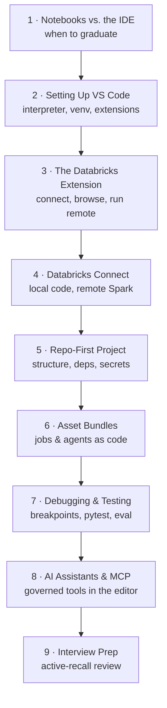

# VS Code for Databricks & AI

> A notebook is a sketchbook — perfect for a quick idea. But you don't ship a
> sketchbook; you ship a *building*, drawn from blueprints, inspected, and assembled the
> same way every time. This subtopic is about turning **VS Code** into the place where
> your AI sketches become shippable software.

Databricks gives you a great in-browser notebook experience, and for exploration it's
hard to beat. But real AI projects are *software* — with repositories, tests, reviews,
dependency pinning, and CI/CD. Many engineers also split their week across Databricks and
non-Databricks work, and want **one** professional editor for all of it. That editor, for
a huge share of the industry, is **VS Code**.

This subtopic teaches an AI engineer — or a Databricks AI engineer — to build agents
*efficiently* in VS Code: connect to your workspace, run cluster-scale code locally,
structure an agent as a real repo, deploy it as code, debug and test it outside a
notebook, and pair with AI coding assistants that use your governed tools.

:::note Dual audience by design
Almost everything here is portable. The Databricks-specific lessons (the extension,
Databricks Connect, Asset Bundles) make VS Code a first-class Databricks environment; the
rest (setup, repo structure, debugging, testing, AI assistants) applies to *any* AI work,
Databricks or not.
:::

## The learning path

The lessons are ordered as a journey — explore → harden → connect → structure → verify →
deploy → accelerate. Go in order the first time; each builds on the last.

*The VS Code subtopic, end to end. Each lesson uses the same running example — Maya, an
engineer at "Northwind Trust," turning a notebook prototype into a production agent.*

## Lessons

1. **[Notebooks vs. the IDE: When to Graduate to VS Code](/agentic-coding/vscode/why-vscode-over-notebooks)** — what notebooks are great at, where they break down for real agent projects, and how the two work together.
2. **[Setting Up VS Code for AI Engineering](/agentic-coding/vscode/setup-vscode-for-ai)** — interpreter, virtual environments, the integrated terminal, and the extensions worth installing.
3. **[The Databricks Extension for VS Code](/agentic-coding/vscode/databricks-extension)** — authenticate, browse Unity Catalog, sync code, and run files or notebooks on remote compute.
4. **[Databricks Connect: Local Code, Remote Spark](/agentic-coding/vscode/databricks-connect)** — write Spark and Databricks code locally and execute it against remote compute, with full IDE tooling.
5. **[A Repo-First AI Agent Project](/agentic-coding/vscode/repo-first-project)** — structure, dependency management, configuration, and secrets that make an agent testable and deployable.
6. **[Databricks Asset Bundles from the Editor](/agentic-coding/vscode/asset-bundles)** — define jobs, agents, and endpoints as code, then validate, deploy, and run across dev and prod.
7. **[Debugging & Testing Agents Locally](/agentic-coding/vscode/debugging-and-testing)** — the debugger, pytest, mocking LLM calls, local eval, and reproducing failures outside a notebook.
8. **[AI Assistants & MCP in Your Editor](/agentic-coding/vscode/ai-assistants-and-mcp)** — pair with AI coding assistants and connect them to governed Databricks tools over MCP.
9. **[Interview Prep: VS Code & Agentic Coding](/agentic-coding/vscode/interview-prep)** — a relaxed, active-recall review of the whole subtopic.

## How it connects to the rest of the site

- Pairs with the **[Claude Code](/agentic-coding/claude-code/intro)** subtopic — this one
  sets up the *environment*; that one goes deep on the *agentic assistant* you work with
  inside it.
- Builds on the **[Databricks AI](/docs/intro)** track, which teaches *what* you'll be
  coding — LLM foundations, RAG, agents, evaluation, and production LLMOps. This subtopic
  teaches *how to build it fast and professionally*.
- Reinforces **[Beyond Databricks](/docs/beyond-databricks/concepts-are-portable)** — a
  good editor-plus-agent workflow travels with you across any AI stack.

Ready? Start with **[Notebooks vs. the IDE](/agentic-coding/vscode/why-vscode-over-notebooks)**.

:::info Independent project
Databrickster is a free, independent educational resource. It is **not affiliated with,
endorsed by, or sponsored by Databricks, Inc.** "Databricks" and related marks belong to
their respective owners.
:::
