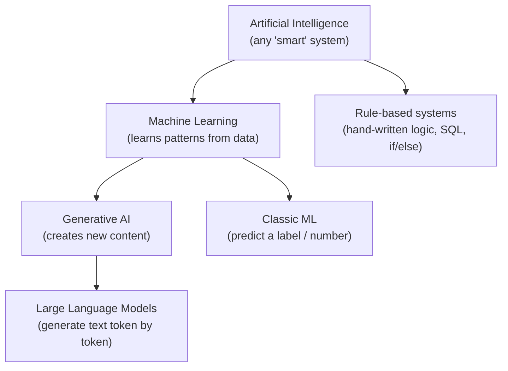
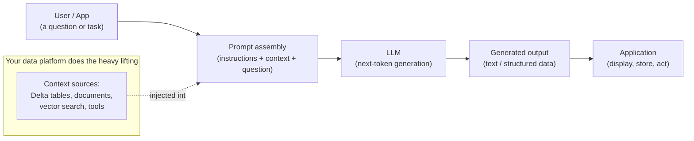

# What Is Generative AI? A Data Engineer's Mental Model

> You already build systems that move and transform data with total precision.
> Generative AI asks you to build systems that are *usually right* — and that one
> idea changes how you design, test, deploy, and operate everything.

## Learning Objectives

By the end of this lesson you will be able to:

- Define **Generative AI** and a **Large Language Model (LLM)** in plain terms, without hand-waving.
- Explain the core difference between a **deterministic** data pipeline and a **probabilistic** AI system — and why it matters for every downstream decision.
- Place Generative AI correctly next to the **classic Machine Learning** you may have heard about, and next to the **rule-based systems** you already build.
- Describe, at a high level, what happens when you "ask an LLM a question."
- Recognize why AI systems need new approaches to **testing, monitoring, and governance** — the themes that run through the rest of this course.

## Prerequisites

- Comfort with SQL, Spark, and ETL/ELT pipelines (the audience assumption for this whole course).
- No AI knowledge required. This is the true starting point.

## Estimated Reading Time

~18 minutes.

## Business Motivation

Meet **Northwind Trust**, a fictional mid-sized asset-management firm. Every
morning, analysts wade through hundreds of pages: earnings-call transcripts,
regulatory filings, internal research memos, and client emails. A single question
from a portfolio manager — *"What did management say about supply-chain risk last
quarter, and how does it compare to their guidance a year ago?"* — can take an
analyst two hours to answer.

Northwind's data platform is excellent. They have a pristine medallion
architecture on Databricks: bronze ingestion, silver cleansing, gold marts, the
works. But none of it helps with that question, because the answer lives in
**unstructured text** and requires **reading, reasoning, and summarizing** — not
joining and aggregating.

This is the gap Generative AI fills. And it's a gap that sits right on top of the
data platform you already know how to run. The question for you, as the Data
Engineer, is no longer *"Can we store and serve this data?"* (you can) — it's
*"Can we build a reliable system around a component that thinks in probabilities
instead of guarantees?"* That is what the rest of this course teaches. This lesson
builds the mental model everything else hangs on.

## Intuition

Here is the fastest way to understand Generative AI if you come from Data
Engineering. Think about the two kinds of logic you already write:

**A stored procedure / a SQL query is deterministic.**
`SELECT SUM(amount) FROM trades WHERE dt = '2026-07-15'` returns the *exact same
number* every single time, given the same data. If it returns a different number
tomorrow, that's a bug. You rely on this. Your tests assert exact equality. Your
pipelines are idempotent. Your whole mental world is built on *the same input
always produces the same output*.

**A Large Language Model is probabilistic.**
Ask it the same question twice and you may get two differently-worded (though
usually similar) answers. It does not *look up* an answer in a table; it
*generates* one, token by token, by predicting what text is most likely to come
next. It is less like a query engine and more like an extraordinarily
well-read consultant who answers from experience — fast, fluent, usually right,
occasionally confidently wrong, and never word-for-word identical twice.

:::tip The one-sentence mental model
**A classic pipeline retrieves facts; a generative model produces its best guess.**
Everything strange about building AI systems — evaluation, hallucinations,
guardrails, tracing — flows from that difference.
:::

<figure style={{textAlign: 'center', margin: '1.75rem 0'}}>
<svg role="img" aria-label="Side-by-side comparison: a deterministic SQL pipeline returns an identical result every run, while a probabilistic LLM returns a slightly different answer each run." viewBox="0 0 720 300" style={{width: '100%', maxWidth: '680px', height: 'auto', fontFamily: 'var(--ifm-font-family-base)'}}>
  <defs>
    <marker id="arrowDet" markerWidth="8" markerHeight="8" refX="4" refY="4" orient="auto">
      <path d="M0,0 L8,4 L0,8 z" fill="var(--ifm-color-success)" />
    </marker>
    <marker id="arrowProb" markerWidth="8" markerHeight="8" refX="4" refY="4" orient="auto">
      <path d="M0,0 L8,4 L0,8 z" fill="var(--ifm-color-primary)" />
    </marker>
  </defs>

  {/* Divider */}
  <line x1="360" y1="20" x2="360" y2="280" stroke="var(--ifm-color-emphasis-300)" strokeWidth="1" strokeDasharray="4 4" />

  {/* ---- Left: deterministic ---- */}
  <text x="180" y="30" textAnchor="middle" fontSize="17" fontWeight="700" fill="var(--ifm-font-color-base)">Deterministic pipeline</text>
  <text x="180" y="49" textAnchor="middle" fontSize="12" fill="var(--ifm-color-emphasis-700)">SQL / stored procedure</text>
  <rect x="60" y="68" width="240" height="42" rx="8" fill="var(--ifm-color-emphasis-100)" stroke="var(--ifm-color-emphasis-400)" strokeWidth="1.5" />
  <text x="180" y="94" textAnchor="middle" fontSize="13" fontFamily="var(--ifm-font-family-monospace)" fill="var(--ifm-font-color-base)">SELECT SUM(amount)</text>
  <line x1="180" y1="110" x2="180" y2="146" stroke="var(--ifm-color-success)" strokeWidth="2" markerEnd="url(#arrowDet)" />
  <rect x="60" y="150" width="240" height="34" rx="8" fill="var(--ifm-color-emphasis-100)" stroke="var(--ifm-color-success)" strokeWidth="1.5" />
  <text x="180" y="172" textAnchor="middle" fontSize="13" fontFamily="var(--ifm-font-family-monospace)" fill="var(--ifm-font-color-base)">42.00</text>
  <rect x="60" y="192" width="240" height="34" rx="8" fill="var(--ifm-color-emphasis-100)" stroke="var(--ifm-color-success)" strokeWidth="1.5" />
  <text x="180" y="214" textAnchor="middle" fontSize="13" fontFamily="var(--ifm-font-family-monospace)" fill="var(--ifm-font-color-base)">42.00</text>
  <text x="180" y="256" textAnchor="middle" fontSize="13" fontWeight="600" fill="var(--ifm-color-success)">✓ identical every run</text>

  {/* ---- Right: probabilistic ---- */}
  <text x="540" y="30" textAnchor="middle" fontSize="17" fontWeight="700" fill="var(--ifm-font-color-base)">Probabilistic LLM</text>
  <text x="540" y="49" textAnchor="middle" fontSize="12" fill="var(--ifm-color-emphasis-700)">next-token generation</text>
  <rect x="420" y="68" width="240" height="42" rx="8" fill="var(--ifm-color-emphasis-100)" stroke="var(--ifm-color-emphasis-400)" strokeWidth="1.5" />
  <text x="540" y="94" textAnchor="middle" fontSize="13" fontFamily="var(--ifm-font-family-monospace)" fill="var(--ifm-font-color-base)">Summarize this filing</text>
  <line x1="540" y1="110" x2="540" y2="146" stroke="var(--ifm-color-primary)" strokeWidth="2" markerEnd="url(#arrowProb)" />
  <rect x="420" y="150" width="240" height="34" rx="8" fill="var(--ifm-color-emphasis-100)" stroke="var(--ifm-color-primary)" strokeWidth="1.5" />
  <text x="540" y="172" textAnchor="middle" fontSize="12" fill="var(--ifm-font-color-base)">“Q3 revenue rose on strong…”</text>
  <rect x="420" y="192" width="240" height="34" rx="8" fill="var(--ifm-color-emphasis-100)" stroke="var(--ifm-color-primary)" strokeWidth="1.5" />
  <text x="540" y="214" textAnchor="middle" fontSize="12" fill="var(--ifm-font-color-base)">“Revenue grew in Q3, driven…”</text>
  <text x="540" y="256" textAnchor="middle" fontSize="13" fontWeight="600" fill="var(--ifm-color-primary)">≈ varies each run</text>
</svg>
<figcaption style={{fontSize: '0.85rem', color: 'var(--ifm-color-emphasis-700)', marginTop: '0.5rem'}}>
Same input, two worlds. The pipeline <em>retrieves</em> a fact and returns it exactly; the LLM <em>generates</em> its best guess, which can differ each time.
</figcaption>
</figure>

An analogy that lands for most engineers: a deterministic system is a **vending
machine** — press B4, get the item in slot B4, every time. An LLM is a **seasoned
concierge** — ask for "somewhere nice for dinner nearby" and you get a thoughtful,
context-aware recommendation that will vary with phrasing, mood, and what they
remember of the conversation. Both are useful. You would not test them the same
way, and you would not trust them with the same tasks.

## Theory

Let's define the terms precisely.

**Artificial Intelligence (AI)** is the broad field of building systems that
perform tasks we'd associate with human intelligence — perception, language,
decision-making.

**Machine Learning (ML)** is the subset of AI where systems *learn patterns from
data* instead of being explicitly programmed with rules. Classic ML is likely
familiar in spirit: you train a model on labeled examples (say, fraud / not-fraud)
and it predicts a label or a number for new inputs. Think of it as *"fit a
function to historical data, then apply it."*

**Generative AI** is a subset of ML whose models *generate new content* —
text, code, images, audio — rather than only predicting a label or a value. Given
a prompt, they produce an original artifact.

**A Large Language Model (LLM)** is the workhorse of text-based Generative AI. It
is a very large neural network trained on an enormous amount of text, whose one
fundamental skill is deceptively simple:

> Given a sequence of text, predict the next chunk of text (a **token**) that is
> most likely to follow.

That's it. Everything an LLM appears to "know" or "reason" about is an emergent
consequence of doing next-token prediction extremely well, at massive scale. When
you ask a question, the model isn't querying a database of facts — it's continuing
your text in the most statistically plausible way, based on patterns absorbed
during training. (We open this black box properly in **Part 1**; for now, "a
next-token predictor" is the correct and sufficient model.)

Here's the taxonomy in one picture:



Note where **rule-based systems** sit — off to the side, *not* under Machine
Learning. Your SQL transformations and business-rule engines are AI in the loosest
historical sense but they don't *learn*; they execute logic you wrote. That's the
world you're an expert in. Generative AI is a different branch entirely.

## Deep Dive

Why does the deterministic-vs-probabilistic distinction matter so much? Because it
breaks assumptions you've relied on for your entire career. Let's make it concrete.

**1. "Correctness" is no longer binary.**
For `SUM(amount)`, an answer is right or wrong. For *"Summarize this earnings call
in three bullet points,"* there are many acceptable answers and no single correct
one. You can't assert equality against a golden output. This is why an entire
discipline — **evaluation** (Part 6) — exists to measure quality in shades of grey,
often using *another* model as a judge.

**2. The same input can produce different outputs.**
LLMs sample from a probability distribution over next tokens. A setting called
**temperature** controls how much randomness is allowed. This means your system is
not idempotent by default. Reproducibility — something you take for granted —
becomes something you must *engineer* (by fixing parameters, caching, versioning
prompts, and tracing every call, which is why Parts 5 and 8 exist).

**3. The model can be confidently wrong — this is called a hallucination.**
Because it generates plausible text rather than retrieving verified facts, an LLM
can produce fluent, authoritative-sounding statements that are simply false. A
`JOIN` never invents a row that isn't there; an LLM can invent a citation, a number,
or a policy. Managing this is the whole motivation for **RAG** (Part 2) and
**guardrails** (Part 9).

**4. The model has no memory and no live data by default.**
An LLM's knowledge is frozen at training time (its "knowledge cutoff") and it
forgets everything the moment a request ends. It doesn't know today's date, your
company's data, or what you asked it two minutes ago — unless you *supply that
context with every request*. For a Data Engineer this is actually good news: **the
model is stateless and the interesting work is in the data plumbing around it** —
retrieving the right context, feeding it in, and capturing what comes out. That
plumbing is your home turf.

Here's a comparison table that will anchor the rest of the course:

| Dimension | Deterministic pipeline (what you know) | Generative AI system (what you're learning) |
|---|---|---|
| Output for same input | Identical every time | May vary (probabilistic) |
| Notion of correctness | Exact / binary | Graded / subjective |
| Failure mode | Errors, nulls, crashes | Plausible-but-wrong answers |
| Testing | Assert equality vs golden data | Evaluate quality with judges & datasets |
| State | Whatever you persist | Stateless; context supplied per request |
| Knowledge | Whatever's in your tables | Frozen at training + whatever you inject |
| Cost driver | Compute (DBUs), storage | Tokens processed (in + out) |
| Debugging | Logs, query plans | Traces of prompts, tool calls, outputs |

If you internalize this table, you already understand *why* this course is
structured the way it is. Every later Part is essentially a response to one of
these rows.

## Architecture

At the highest level, using a generative model looks like this — and notice how
much of it is data movement, which is exactly your strength:



Read this diagram carefully, because it reframes the whole job. The LLM is a single
box in the middle. The **art and engineering** are in everything *around* it:
assembling the right prompt, injecting the right context from your data
(retrieval), routing the output somewhere useful, and observing the whole thing.
Databricks' AI products (which we map in the next lesson) are almost entirely about
that surrounding machinery — because that's where reliability comes from.

## Internal Working

What actually happens, step by step, when you "ask an LLM a question"? A simplified
but accurate view:

```
1. Your text is broken into TOKENS.
   "Summarize this filing"  ->  ["Summar", "ize", " this", " filing"]
   (Tokens are sub-word chunks. Detail in Part 1.)

2. Each token becomes a vector of numbers (an EMBEDDING) the model can process.

3. The model processes the whole sequence and produces a PROBABILITY DISTRIBUTION
   over what the next token should be — e.g.
      " Here"   -> 41%
      " The"    -> 22%
      " Based"  -> 12%
      ...thousands more...

4. It SAMPLES one token from that distribution (how greedily depends on
   temperature), appends it to the sequence, and repeats from step 3.

5. This loop continues — token, token, token — until the model emits a special
   "stop" token or hits a length limit. The concatenation of sampled tokens is
   your answer.
```

That step-4 sampling loop is the source of everything probabilistic. At
`temperature = 0` the model (near-)always takes the highest-probability token, and
behavior becomes *almost* deterministic — a fact you'll exploit constantly when you
want reproducibility. At higher temperatures it takes more chances, which is great
for creative drafting and dangerous for factual accuracy.

:::note You don't train these models
As a Data Engineer building applications, you almost never train an LLM from
scratch (that costs millions of dollars and enormous compute). You *use* a
pre-trained **foundation model** through an API and shape its behavior with prompts,
context, and tools. This course is about **building systems with** LLMs, not
building LLMs.
:::

## Step-by-Step Walkthrough

Let's walk Northwind Trust's question through the mental model end to end,
conceptually (we build the real version across Parts 2–4):

1. **The question arrives:** *"What did management say about supply-chain risk last quarter?"*
2. **The system can't just ask the LLM directly** — the model has never seen Northwind's private transcripts, and even if it had, it might hallucinate specifics. So first we *retrieve* the relevant passages from the transcript stored in Delta / a vector index. (That's RAG — Part 2.)
3. **We assemble a prompt:** an instruction ("Answer only from the provided context, cite sources"), the retrieved passages (the context), and the analyst's question.
4. **The LLM generates** a grounded, cited summary — token by token.
5. **The system captures a trace** of exactly what was retrieved and what was produced (Part 5), so it can be evaluated (Part 6), monitored, and audited (Part 9).
6. **The analyst gets an answer in seconds**, with citations they can verify — instead of spending two hours.

Every numbered step maps to a later Part. This lesson is the frame that makes those
Parts make sense.

## Hands-on Examples

You don't need any of the advanced machinery to *see* a generative model work.
Because Databricks exposes foundation models through **AI Functions** you can call
in SQL, your very first taste of AI uses a language you already know cold.

- **Simple:** Ask a model a one-off question from a SQL cell.
- **Intermediate:** Summarize a column of free-text customer reviews in a Delta table with a single query.
- **Enterprise:** Run that summarization across millions of rows as a batch job feeding a gold table — same `ai_query`, scaled by Spark.

We'll do the real, parameterized versions in **Part 1**. Here's the teaser so the
idea is concrete now.

## Code Examples

**Your first AI call — in SQL you already write.** On a Databricks workspace with
Foundation Model APIs enabled, this runs as-is in a SQL cell:

```sql
-- Ask a Databricks-hosted foundation model a question, straight from SQL.
-- `ai_query` sends the prompt to a serving endpoint and returns the generated text.
SELECT ai_query(
  'databricks-meta-llama-3-3-70b-instruct',                 -- a hosted foundation model endpoint
  'In two sentences, explain what supply-chain risk means for an asset manager.'
) AS answer;
```

**Now the Data Engineer's "aha" moment** — the same function, applied to a whole
Delta table, is just a column expression. Spark parallelizes it for you:

```sql
-- Summarize every analyst memo in a table. This is an ETL job that "reads and
-- reasons" — something no amount of SQL aggregation could ever do before.
SELECT
  memo_id,
  ai_query(
    'databricks-meta-llama-3-3-70b-instruct',
    CONCAT('Summarize this research memo in 3 bullet points:\n\n', memo_text)
  ) AS summary
FROM prod.research.analyst_memos
WHERE created_date = current_date();
```

The equivalent from Python (the path you'll use for applications and agents) talks
to the same kind of endpoint through an OpenAI-compatible client. Don't worry about
the details yet — just notice it's a plain function call that returns text:

```python
# Minimal foundation-model call from a Databricks notebook.
# Full setup (auth, client, parameters) is covered in Part 1.
from databricks.sdk import WorkspaceClient

w = WorkspaceClient()
client = w.serving_endpoints.get_open_ai_client()   # OpenAI-compatible client

response = client.chat.completions.create(
    model="databricks-meta-llama-3-3-70b-instruct",
    messages=[
        {"role": "system", "content": "You are a concise financial analyst assistant."},
        {"role": "user", "content": "Explain supply-chain risk for an asset manager in two sentences."},
    ],
    temperature=0.2,   # low temperature -> more focused, more repeatable answers
)

print(response.choices[0].message.content)
```

:::info What to notice, not memorize
Three things: (1) you called AI from **SQL you already know**; (2) scaling from one
row to millions was *the same function*, parallelized by Spark — a pattern you've
used a thousand times; (3) the Python call took a `temperature` — a probability
knob that has no equivalent in any query you've ever written. That knob is the
whole paradigm shift in one parameter.
:::

## Production Considerations

Even at this conceptual stage, three production realities are worth planting:

- **Nondeterminism must be designed around.** If a downstream process depends on stable output, pin `temperature=0`, cache results, and version your prompts (Part 8). Never assume two calls return identical text.
- **Every call is a dependency on an external service** with latency, rate limits, and the possibility of failure. Treat model calls like network I/O, not like local function calls — with retries, timeouts, and fallbacks (Parts 7 and 9).
- **Cost scales with tokens, not rows.** A million short reviews can be cheaper than a thousand giant documents. Cost estimation is a first-class design activity here, not an afterthought (Part 9).

## Performance Considerations

- **Latency is dominated by output length.** Generating 500 tokens takes far longer than generating 20, because tokens are produced one at a time. Ask for concise output when you can.
- **Batch vs. interactive are different worlds.** `ai_query` over a Delta table is throughput-oriented (Spark parallelism); a chatbot is latency-oriented (one user waiting). The right serving option differs (Part 7).
- **Bigger models are smarter but slower and pricier.** Model choice is a performance/cost/quality trade-off you'll make deliberately, not a default.

## Security Considerations

- **Prompts and context are data leaving your control boundary** into a model endpoint. What you put in the prompt matters for privacy and compliance — especially PII. Databricks keeps foundation-model traffic within your governance boundary via Unity Catalog and the AI Gateway, but *you* decide what to send. (Part 9.)
- **Outputs are untrusted by default.** A generated answer might contain injected instructions, leaked context, or fabricated claims. Never wire raw model output directly into a system that takes consequential action without validation and guardrails.
- **Access to models is a governed resource.** Who can call which model, how often, and at what budget are all things you'll manage with Unity Catalog permissions and the AI Gateway — the same governance muscle you already use for tables.

## Common Mistakes

- ❌ **Treating the LLM like a database.** *"Why did it give a different answer?!"* → ✅ Expect variation; engineer for it with low temperature, caching, and evaluation.
- ❌ **Trusting fluent output as correct.** Confidence is not accuracy. → ✅ Ground answers in retrieved data (RAG) and verify with evaluation and citations.
- ❌ **Skipping the fundamentals** and jumping straight to "build an agent." → ✅ You can't debug what you don't understand. Tokens, embeddings, and prompting (Part 1) come first for a reason.
- ❌ **Assuming AI replaces your data platform.** → ✅ It sits *on top of it*. Your pipelines, Delta tables, and governance are the foundation that makes AI reliable.

## Best Practices

- ✅ **Anchor every new AI concept to something you already know.** That's how this whole course teaches — do it in your own head too.
- ✅ **Start with the cheapest tool that works.** Often that's an AI Function in SQL, not a full agent.
- ✅ **Log everything from day one.** Prompts in, outputs out. You'll need it for evaluation and debugging.
- ✅ **Keep a human in the loop** for consequential decisions until evaluation proves the system is trustworthy.

## Interview Questions

1. **Q:** What is the fundamental difference between a rule-based data pipeline and a generative AI system?
   **A:** A pipeline executes explicit logic and is deterministic — same input, same output, exact correctness. A generative AI system produces probabilistic output by sampling from a learned distribution, so the same input can yield different, graded-quality answers. This changes how you test (evaluation vs. equality assertions), operate (tracing, caching), and govern (guardrails) the system.

2. **Q:** In one sentence, what does an LLM actually do?
   **A:** It predicts the next token in a sequence, repeatedly, based on patterns learned from massive text training data — everything else is emergent from that.

3. **Q:** What is a hallucination and why does it happen?
   **A:** A fluent but false model output. It happens because the model *generates plausible continuations* rather than retrieving verified facts, so it can produce confident text unsupported by any real source.

4. **Q:** Why is an LLM described as "stateless," and what's the implication for system design?
   **A:** It retains nothing between requests and its knowledge is frozen at training time, so any needed context (history, private data, current facts) must be supplied with every call — which is why data retrieval and prompt assembly are central engineering tasks.

5. **Q:** What does `temperature` control, and when would you set it to 0?
   **A:** It controls randomness in token sampling. Setting it near 0 makes output focused and (nearly) reproducible — use it for factual, structured, or test-sensitive tasks; raise it for creative or exploratory generation.

## Quiz

**1.** True or false: given identical input, a well-behaved LLM will always return byte-for-byte identical output.

<details>
<summary>Show answer</summary>

False. LLMs sample probabilistically; output can vary unless you constrain it (e.g. temperature 0 plus caching), and even then it's "nearly," not "guaranteed," deterministic.

</details>

**2.** Which of these is *not* under Machine Learning in the taxonomy: (a) Generative AI, (b) Classic ML classifiers, (c) A hand-written SQL business-rule engine, (d) LLMs?

<details>
<summary>Show answer</summary>

(c). Rule-based systems execute logic you wrote; they don't learn from data.

</details>

**3.** Northwind wants to summarize 5 million customer emails nightly into a gold table. Which tool from this lesson is the natural first choice, and why?

<details>
<summary>Show answer</summary>

An AI Function like `ai_query` in SQL — it applies a model per row and Spark parallelizes it, matching the batch/throughput shape of an ETL job you already know how to run.

</details>

**4.** Why does grounding an answer in retrieved documents (RAG) reduce hallucination?

<details>
<summary>Show answer</summary>

It supplies the model with real, relevant source text in the prompt and instructs it to answer only from that context, so it generates from evidence instead of from unconstrained plausibility.

</details>

## Summary

Generative AI is a branch of Machine Learning whose models *create* content, and
the Large Language Model — a next-token predictor trained on massive text — is its
text-based workhorse. The one idea that reorganizes your entire mental model is
that these systems are **probabilistic, not deterministic**: same input, possibly
different output; correctness is graded, not binary; and confident-but-wrong
answers are a real failure mode. That single shift is the reason AI systems need
new approaches to evaluation, tracing, and governance — the throughline of this
course. Crucially, the LLM is just one box in the middle; most of the engineering
is the data plumbing *around* it, which is exactly where your Data Engineering
skills transfer directly.

## Key Takeaways

- **Generative AI ⊂ Machine Learning ⊂ AI.** LLMs are next-token predictors; "knowledge" and "reasoning" are emergent from that.
- **Deterministic → probabilistic** is the core shift. It reshapes testing, operations, and governance.
- **LLMs are stateless and frozen in time** — you must supply context every call, which makes the surrounding data pipeline the real work (your strength).
- **Correctness is graded**, hallucinations are real, and cost scales with **tokens**.
- Your **first, easiest** entry point is calling a model from **SQL** with AI Functions.

## Glossary

- **Artificial Intelligence (AI)** — the broad field of building systems that perform tasks associated with intelligence.
- **Machine Learning (ML)** — AI systems that learn patterns from data rather than following hand-written rules.
- **Generative AI** — ML models that generate new content (text, code, images, audio).
- **Large Language Model (LLM)** — a large neural network that generates text by predicting the next token.
- **Token** — a sub-word chunk of text; the unit an LLM reads and generates (and the unit you're billed on).
- **Foundation model** — a large, pre-trained model you use via an API rather than training yourself.
- **Prompt** — the input text (instructions + context + question) you send to a model.
- **Temperature** — a parameter controlling randomness in token sampling; lower is more focused and repeatable.
- **Hallucination** — a fluent but factually incorrect or unsupported model output.
- **Knowledge cutoff** — the point in time after which a model has no built-in knowledge, because its training data ends there.

## Further Reading

- [Concepts: Generative AI on Databricks](https://docs.databricks.com/aws/en/agents/concepts/)
- [Key challenges in generative AI](https://docs.databricks.com/aws/en/agents/gen-ai-challenges)
- [Enrich data using AI Functions (`ai_query`)](https://docs.databricks.com/aws/en/large-language-models/ai-functions)

## Next Lesson

➡️ **[The Databricks AI Platform Map](/docs/orientation/databricks-ai-platform-map)** —
now that you know *what* Generative AI is, we'll lay out *where* every Databricks AI
product fits: Mosaic AI, Agent Bricks, MLflow 3, Model Serving, AI Gateway, AI
Search, and Unity Catalog — so the rest of the course has a home for every concept.
