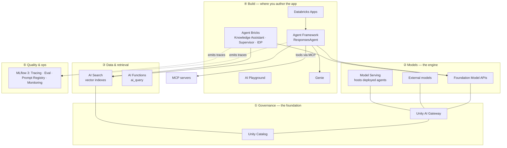
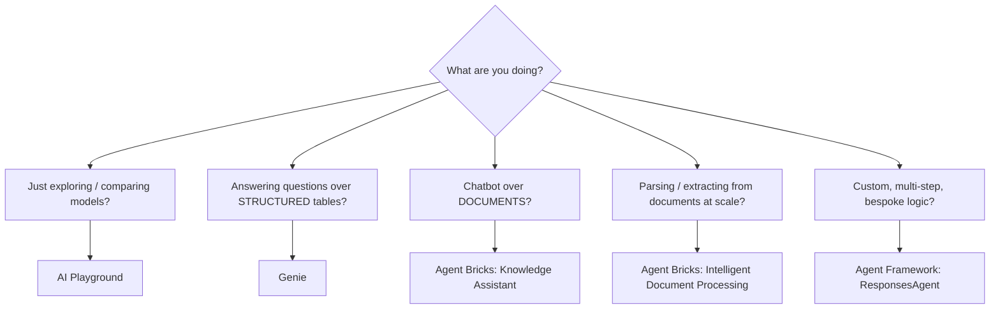

# The Databricks AI Platform Map

> Before you build anything, you need a map. This lesson gives every Databricks AI
> product a home in your head — as clean a mental model as the medallion
> architecture is for your data platform — so nothing in the rest of the course
> feels like it appears from nowhere.

## Learning Objectives

By the end of this lesson you will be able to:

- Name the major Databricks AI products and state, in one sentence each, what they do.
- Organize them into **five layers** (governance, models, data/retrieval, build, quality/ops) and explain how a request flows through them.
- Map each product to a **Data Engineering equivalent** you already understand.
- Explain the difference between **Mosaic AI**, **Agent Framework**, **Agent Bricks**, and **Foundation Model APIs** — four names people constantly confuse.
- Point to exactly **which Part of this course** teaches each product in depth.

## Prerequisites

- [Lesson 1 — What Is Generative AI? A Data Engineer's Mental Model](/docs/orientation/what-is-generative-ai). You need the deterministic-vs-probabilistic mental model before this map will make sense.

## Estimated Reading Time

~20 minutes.

## Business Motivation

Back at **Northwind Trust** (our fictional asset manager from Lesson 1), leadership
has approved an "AI initiative." As the Data Engineer, you're handed the Databricks
AI documentation and immediately hit a wall — not of difficulty, but of *naming*.
The docs mention Mosaic AI, Agent Framework, Agent Bricks, Foundation Model APIs,
Model Serving, Vector Search / AI Search, Genie, MCP, MLflow, Unity Catalog, and the
AI Gateway. Which of these do you actually *use*? Which are features of others?
Where does a request even start?

This is the single most common source of early confusion, and it's pure
vocabulary — not concepts. Once you can place each product on a map, the platform
stops feeling like a pile of brand names and starts feeling like what it is: a
coherent stack that mirrors the data platform you already run. That map is this
lesson.

## Intuition

You already carry a layered mental model of the Databricks **data** platform, even
if you've never drawn it. It looks roughly like this:

```
Governance  ── Unity Catalog (who can touch what)
Storage     ── Delta Lake (the tables)
Compute      ── Spark / clusters / SQL warehouses (the engine)
Author/Orchestrate ── Jobs, DLT/Lakeflow, notebooks (the pipelines you build)
Consume/Observe ── Dashboards, system tables, lineage (BI + operations)
```

The Databricks **AI** platform has the *exact same shape*. Each AI product slots
into one of five layers, and the layers line up almost one-to-one with the data
layers you know:

| Data platform layer | AI platform layer | The AI products that live here |
|---|---|---|
| Governance (Unity Catalog) | **Governance** | Unity Catalog + **Unity AI Gateway** |
| Compute engine (Spark) | **Models** | **Foundation Model APIs**, external models, **Model Serving** |
| Storage + indexes (Delta) | **Data & retrieval** | **AI Search** (Vector Search), **AI Functions** |
| Pipelines you author (Jobs/DLT) | **Build** | **Agent Framework**, **Agent Bricks**, **Genie**, **MCP**, **Databricks Apps**, AI Playground |
| Dashboards + ops (system tables) | **Quality & ops** | **MLflow 3 for GenAI** (tracing, evaluation, prompt registry, monitoring) |

:::tip The reframe
You are not learning a brand-new platform. You're learning the **AI-shaped version
of the platform you already operate.** Same governance foundation, same
"engine + storage + pipelines + observability" spine — just with models where
Spark sits and retrieval where indexes sit.
:::

## Theory

Let's define each product precisely, one layer at a time. Keep the table above open
in your mind; every product below belongs to exactly one layer.

### Layer 1 — Governance (the foundation everything sits on)

- **Unity Catalog (UC)** — Databricks' unified governance layer. You already use it
  for tables and volumes; in AI it *also* governs **models, functions (tools),
  vector indexes, and agents**. Everything you build is a securable object with
  permissions, lineage, and lineage-aware auditing. This is why "governance" is
  the *foundation* layer, not an afterthought.
- **Unity AI Gateway** — a governance and control plane specifically for **model
  traffic**. It sits in front of model endpoints and enforces guardrails (blocking
  unsafe content, masking PII), rate limits, budgets, traffic splitting/fallbacks,
  and it logs every request/response to inference tables for audit and cost
  tracking. Think of it as an **API gateway + policy engine for AI**.

### Layer 2 — Models (the engine that generates)

- **Foundation Model APIs** — Databricks-hosted access to large language (and
  embedding) models. Two flavors: **pay-per-token** (serverless, per-request
  billing, great for prototyping and spiky workloads) and **provisioned
  throughput** (dedicated capacity with predictable latency for production).
- **External models** — a proxy that lets you call third-party providers (OpenAI,
  Anthropic, Google, etc.) *through* Databricks, so they inherit the same
  governance, gateway, and logging as native models.
- **Mosaic AI Model Serving** — the serving system that hosts models **and agents**
  as scalable REST endpoints (with scale-to-zero). When you "deploy an agent," it
  becomes a Model Serving endpoint.

### Layer 3 — Data & retrieval (grounding the model in your data)

- **Databricks AI Search** (formerly **Vector Search**) — a managed vector database.
  It stores **embeddings** of your documents in an index that syncs from Delta
  tables, and answers similarity queries. This is the retrieval engine behind RAG.
- **AI Functions** — SQL-native generative AI: `ai_query`, `ai_classify`,
  `ai_extract`, `ai_parse_document`, and friends. The batch/at-scale way to apply a
  model to a table using the language you already know. (Your on-ramp from Lesson 1.)

### Layer 4 — Build (where you author the application)

- **AI Playground** — a no-code UI to chat with models, compare them, and prototype
  tool-calling agents before writing a line of code.
- **Mosaic AI Agent Framework** — the **code-first** way to build agents. You author
  an agent in Python (the recommended interface is **`ResponsesAgent`**; the older
  `ChatAgent` still works), give it tools, log it to Unity Catalog, and deploy it.
  Maximum control.
- **Agent Bricks** — the **low-code, auto-optimized** way to build agents. You
  describe the task and provide data; Databricks builds and tunes the agent for you.
  Includes **Knowledge Assistant** (a doc-grounded chatbot), **Multi-agent
  Supervisor** (orchestrates several agents/Genie spaces), **Custom LLM**
  (optimized text tasks), and **Intelligent Document Processing** (parse / extract /
  classify documents).
- **Genie** — a conversational analytics agent that answers natural-language
  questions over your **structured** data (governed tables) by generating SQL. It
  can be used standalone or plugged into a larger agent as a tool.
- **MCP (Model Context Protocol)** — an open standard for connecting agents to
  **tools and data sources**. Databricks offers managed MCP servers (Genie, AI
  Search, UC functions) and lets you host custom ones.
- **Databricks Apps** — a platform for hosting interactive web apps (e.g. a chat UI)
  that front your agents.

### Layer 5 — Quality & ops (making it trustworthy and observable)

- **MLflow 3 for GenAI** — the observability and quality stack for AI apps. It
  bundles four things you'll use constantly:
  - **Tracing** — records every step of an agent run (prompts, tool calls, outputs) — your "query plan + logs" for AI.
  - **Evaluation** — measures quality with datasets, LLM judges, and custom scorers.
  - **Prompt Registry** — versions, evaluates, and optimizes prompts (like a Git for prompts).
  - **Human feedback / Review App** — collects expert and end-user judgments.
  - Plus **production monitoring** for deployed apps.

## Deep Dive

Four names cause 90% of the confusion. Let's kill that confusion directly.

**"Mosaic AI" is an umbrella brand, not a single product.** It's Databricks'
marketing name for the whole AI platform — Model Serving, Agent Framework, AI
Search, and more are all "Mosaic AI *something*." When someone says "we use Mosaic
AI," they mean "we use the Databricks AI stack." Don't look for a button labeled
just "Mosaic AI."

**Agent Framework vs. Agent Bricks** — same goal (build an agent), opposite
philosophies:

| | Agent Framework | Agent Bricks |
|---|---|---|
| Style | Code-first (Python) | Low-code / declarative |
| Control | Maximum — you write the logic | Databricks auto-builds & tunes |
| Best for | Custom, complex, bespoke agents | Common patterns, fast time-to-value |
| DE analogy | Hand-written Spark job | A managed, config-driven pipeline |
| Course coverage | Part 4 (core) | Part 4 (the Bricks lessons) |

You'll learn **both**, and when to reach for each. A good rule: start with Agent
Bricks if your use case matches a pattern it supports; drop to Agent Framework when
you need control it can't give you.

**Foundation Model APIs vs. Model Serving** — one is *what you call*, the other is
*how it's hosted*. Foundation Model APIs are the pre-built model endpoints
Databricks gives you. Model Serving is the general system that hosts endpoints —
including the agent *you* build and deploy. Your agent, once deployed, is served by
Model Serving and may internally call a Foundation Model API. Both, ultimately, are
governed by Unity Catalog and fronted by the AI Gateway.

## Architecture

Here is the whole platform as one picture. Read it top-to-bottom as layers, and
notice the request arrow that threads through them.



The one sentence to remember: **you build in Layer 4, grounding on Layer 3, powered
by Layer 2, all governed by Layer 1, and observed by Layer 5.**

## Internal Working

Let's trace a single real request through the map — Northwind's analyst asking
*"What did management say about supply-chain risk last quarter?"* — and label each
product as it's touched:

```
1. Analyst types the question into a chat UI hosted on DATABRICKS APPS.           [Layer 4]
2. The app calls the agent, built with the AGENT FRAMEWORK and deployed on
   MODEL SERVING.                                                                 [Layer 4/2]
3. The agent decides it needs context, so it calls a retrieval tool backed by
   AI SEARCH, which returns the most relevant transcript passages.               [Layer 3]
4. The agent assembles a prompt and calls a FOUNDATION MODEL API to generate a
   grounded, cited answer.                                                        [Layer 2]
5. Every step above — the retrieval, the prompt, the model output — is recorded
   as a trace by MLFLOW.                                                          [Layer 5]
6. The whole path is permitted, rate-limited, and logged by the AI GATEWAY, and
   every object involved is governed by UNITY CATALOG.                            [Layer 1]
7. The answer returns to the analyst in seconds.
```

Every numbered step is a product on the map, and every product maps to a Part of
this course. Nothing is left over — that's the sign of a good map.

## Step-by-Step Walkthrough

How do you *decide* which build-layer tool to use? Follow this decision path:



This is not the final word (you'll refine it across Part 4), but it's enough to stop
you from reaching for a hand-coded agent when a Knowledge Assistant would do — a
very common early mistake.

## Hands-on Examples

There's no code to run in this orientation lesson — it's a map, not a build. But
here's how to make the map concrete in your own workspace:

- **Simple:** Open **AI Playground** in your Databricks workspace and send one message. You've now touched Layers 2 (a Foundation Model API) and 1 (the Gateway) without writing anything.
- **Intermediate:** In Unity Catalog, browse to a schema and note that **models, functions, and volumes** are securable objects right next to your tables. That's Layer 1 governing Layer 2/3/4 artifacts.
- **Enterprise:** Sketch (on paper) where each of Northwind's requirements — "answer over filings," "extract fields from PDFs," "chat over policies" — lands on the five-layer map. This planning step is exactly what a lead engineer does before a project kicks off.

## Code Examples

Orientation lesson — no code. The first real code arrives in **Part 1**, where you
call Foundation Model APIs (Layer 2) from both SQL and Python. If you want a
one-line taste right now, this is the whole of Layer 2 from SQL:

```sql
SELECT ai_query('databricks-meta-llama-3-3-70b-instruct', 'Say hello to a Data Engineer.');
```

## Production Considerations

- **Governance is not optional and not last.** In production, Layer 1 (UC + Gateway) is configured *first* — who can call which model, at what budget, with what guardrails. Retrofitting governance onto a live AI app is painful; design it in from day one (Part 9).
- **Layers have independent scaling and cost profiles.** Model Serving scales with traffic; AI Search scales with index size and QPS; AI Functions scale with Spark. Knowing which layer a cost comes from is how you control the bill.
- **Most production systems use multiple build-layer tools together** — e.g. an Agent Framework agent that calls a Genie space *and* an AI Search retriever *and* a Foundation Model API. The map is how you keep that composition straight.

## Performance Considerations

- **The layer you optimize depends on your bottleneck.** Slow retrieval → tune AI Search (Layer 3). Slow generation → change model or use provisioned throughput (Layer 2). Slow because of too many agent steps → simplify the agent (Layer 4). The map tells you *where to look*.
- **Interactive vs. batch cuts across layers.** A chatbot (latency-sensitive) and a nightly `ai_query` job (throughput-sensitive) use overlapping products with very different tuning. (Part 7.)

## Security Considerations

- **The AI Gateway is your security choke point.** Routing all model traffic through it means guardrails, PII masking, and audit logging apply uniformly — a single place to enforce policy (Part 9).
- **Unity Catalog permissions extend to AI objects.** A tool (UC function) or a vector index an agent can use is governed exactly like a table. If a user can't see the underlying data, the agent acting on their behalf shouldn't either (on-behalf-of-user auth, Part 9).
- **External models still leave your provider boundary.** Proxying OpenAI/Anthropic through Databricks adds governance, but the request still goes to a third party — a data-residency and compliance decision, not just a technical one.

## Common Mistakes

- ❌ **Thinking "Mosaic AI" is one product to learn.** → ✅ It's the umbrella brand; learn the *specific* products under it.
- ❌ **Reaching for a hand-coded agent for a standard use case.** → ✅ Check Agent Bricks / Genie first; drop to Agent Framework only when you need the control.
- ❌ **Confusing "the model" with "the agent."** → ✅ A Foundation Model API is the engine; an agent is the application you build around it, hosted on Model Serving.
- ❌ **Treating governance and observability as "later" concerns.** → ✅ Layers 1 and 5 are designed in from the start, exactly like UC and monitoring on your data platform.

## Best Practices

- ✅ **Keep the five-layer map in your head** and place every new term on it as you learn.
- ✅ **Start at the highest-level tool that fits**, then descend toward Agent Framework only as needed.
- ✅ **Decide governance (Layer 1) before building (Layer 4).**
- ✅ **Assume you'll compose multiple tools** — the interesting systems always do.

## Interview Questions

1. **Q:** Is "Mosaic AI" a single product? What is it?
   **A:** No — it's Databricks' umbrella brand for its AI platform (Model Serving, Agent Framework, AI Search, etc.). Naming something "Mosaic AI X" signals it's part of that stack.

2. **Q:** What's the difference between the Agent Framework and Agent Bricks?
   **A:** Agent Framework is the code-first, maximum-control way to build agents (Python, `ResponsesAgent`); Agent Bricks is the low-code, auto-optimized way for common patterns (Knowledge Assistant, Supervisor, IDP). Use Bricks when your case fits a pattern; use Framework when you need custom control.

3. **Q:** A Foundation Model API and Model Serving — how do they relate?
   **A:** Foundation Model APIs are pre-built model endpoints you call; Model Serving is the hosting system for endpoints in general, including the custom agent you deploy. Your deployed agent runs on Model Serving and may itself call a Foundation Model API.

4. **Q:** Where does governance live in the AI stack, and why does it matter that it's the foundation?
   **A:** Unity Catalog governs all AI objects (models, functions, indexes, agents) and the Unity AI Gateway governs model traffic (guardrails, rate limits, budgets, audit). It's the foundation because AI objects are securables like tables, and enforcing policy at a single choke point (the Gateway) is far more reliable than bolting it on per-app.

5. **Q:** What does MLflow provide for GenAI apps, in one breath?
   **A:** Tracing (step-by-step observability), evaluation (quality measurement with datasets and judges), a prompt registry (versioning/optimization), human feedback collection, and production monitoring.

## Quiz

**1.** Match the layer to the product: (a) AI Search, (b) Unity AI Gateway, (c) MLflow Tracing, (d) Agent Bricks.

<details>
<summary>Show answer</summary>

(a) Data & retrieval (Layer 3), (b) Governance (Layer 1), (c) Quality & ops (Layer 5), (d) Build (Layer 4).

</details>

**2.** Northwind wants a chatbot that answers questions over a folder of PDF policy documents, with minimal custom code. Which build-layer tool is the natural first choice?

<details>
<summary>Show answer</summary>

Agent Bricks **Knowledge Assistant** — it's purpose-built for a doc-grounded chatbot and auto-handles retrieval, so you avoid hand-coding an agent for a standard pattern.

</details>

**3.** True or false: when you deploy an agent you built with the Agent Framework, it becomes a Model Serving endpoint.

<details>
<summary>Show answer</summary>

True. Deployed agents are hosted on Mosaic AI Model Serving as scalable REST endpoints.

</details>

**4.** Why is it a good idea to configure Unity Catalog permissions and AI Gateway policies *before* building the agent, not after?

<details>
<summary>Show answer</summary>

Because governance applies to the objects and traffic your agent uses; designing it in from the start avoids painful retrofits, ensures the agent can only access what it should, and gives you audit/cost control from day one — the same discipline you apply to data pipelines.

</details>

## Summary

The Databricks AI platform mirrors the data platform you already run, in five
layers: **governance** (Unity Catalog + AI Gateway), **models** (Foundation Model
APIs, external models, Model Serving), **data & retrieval** (AI Search, AI
Functions), **build** (AI Playground, Agent Framework, Agent Bricks, Genie, MCP,
Databricks Apps), and **quality & ops** (MLflow 3). "Mosaic AI" is the umbrella
brand over all of it. You build in Layer 4, ground on Layer 3, power it with Layer
2, govern with Layer 1, and observe with Layer 5. With this map in hand, every
product in the rest of the course has a home — and you can already reason about
which tool a given problem calls for.

## Key Takeaways

- The AI stack has the **same shape** as the data stack: governance · engine · storage/retrieval · pipelines · observability.
- **Mosaic AI = umbrella brand.** **Agent Framework = code-first**, **Agent Bricks = low-code**. **Foundation Model APIs = the model you call**, **Model Serving = how endpoints (incl. your agent) are hosted**.
- **Unity Catalog + AI Gateway** are the always-on foundation; **MLflow 3** is the always-on observability/quality layer.
- Reach for the **highest-level tool that fits**, and expect real systems to **compose several** tools.

## Glossary

- **Mosaic AI** — Databricks' umbrella brand for its AI platform.
- **Foundation Model API** — a Databricks-hosted model endpoint (pay-per-token or provisioned throughput).
- **External model** — a third-party model (OpenAI, Anthropic, …) proxied through Databricks.
- **Mosaic AI Model Serving** — the system that hosts models and deployed agents as scalable endpoints.
- **AI Search / Vector Search** — managed vector index for similarity retrieval (RAG).
- **AI Functions** — SQL-native generative AI functions like `ai_query`.
- **Agent Framework** — the code-first Python way to author agents (`ResponsesAgent`).
- **Agent Bricks** — low-code, auto-optimized agents (Knowledge Assistant, Supervisor, Custom LLM, IDP).
- **Genie** — a conversational analytics agent over structured data.
- **MCP (Model Context Protocol)** — an open standard for connecting agents to tools/data.
- **Databricks Apps** — hosting for interactive web frontends.
- **Unity Catalog** — unified governance for data and AI objects.
- **Unity AI Gateway** — governance/control plane for model traffic (guardrails, rate limits, budgets, audit).
- **MLflow 3 for GenAI** — tracing, evaluation, prompt registry, human feedback, and monitoring.

## Further Reading

- [Concepts: Generative AI on Databricks](https://docs.databricks.com/aws/en/agents/concepts/)
- [Mosaic AI Model Serving](https://docs.databricks.com/aws/en/machine-learning/model-serving/)
- [AI governance with Unity AI Gateway](https://docs.databricks.com/aws/en/ai-gateway/)
- [Evaluate and monitor AI agents (MLflow 3)](https://docs.databricks.com/aws/en/mlflow3/genai/eval-monitor/)

## Next Lesson

➡️ **[Part 0 · Interview Prep](/docs/orientation/interview-prep)** — check yourself
against the questions covering both Part 0 lessons before moving on. Then we begin
**Part 1 — LLM Foundations**, descending into Layer 2 to open the black box: what a
token really is, how embeddings turn text into numbers, and how to call your first
Foundation Model API from both SQL and Python.
