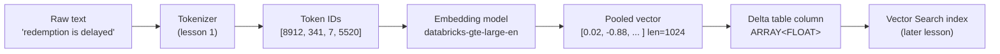

# Embeddings: Turning Text into Vectors

> An embedding is the moment fuzzy human meaning becomes a column of numbers you can actually compute with.

## Learning Objectives

By the end of this lesson, you will be able to:

- Explain what an embedding is: a fixed-length vector of floating-point numbers that captures the *meaning* of a piece of text (or image, audio, etc.).
- Articulate the problem embeddings solve and why keyword matching (`LIKE '%...%'`, exact joins) fundamentally cannot understand meaning.
- Distinguish an **embedding model** (outputs a vector) from an **LLM** (outputs text), and explain what "dimensions" means.
- Describe, at a light-internals level, how text flows from tokens to a single pooled vector.
- Reason about the **semantic vector space**: why nearby vectors mean similar things, and why topics form clusters.
- Map embeddings onto Data Engineering concepts you already know: feature vectors, computed columns, "semantic hashes", and similarity joins.
- Generate embeddings on Databricks in both SQL (`ai_query`) and Python (OpenAI-compatible client), and store them in a Delta table column.

## Prerequisites

- [Tokens & Tokenization](/docs/llm-foundations/tokens-and-tokenization) — you need to understand how raw text becomes tokens before it can become a vector.
- Comfort with Spark SQL, Delta Lake tables, and the concept of an `ARRAY<FLOAT>` column.
- Basic linear-algebra vocabulary is helpful but not required — we define everything as we go.

## Estimated Reading Time

Approximately 30-35 minutes, plus 15 minutes if you run the hands-on code in a Databricks workspace.

## Business Motivation

Let's ground this in a fictional company. **Northwind Trust** is an asset manager. Their client-services team fields thousands of support emails and chat messages, and their compliance team maintains a knowledge base of internal policy documents.

Two very real business problems land on the data engineering team's desk:

1. **"Find me all the tickets where a client complained about withdrawal delays."** The word "withdrawal" appears in maybe 20% of the relevant tickets. Clients write "I can't get my money out," "redemption is stuck," "my transfer never arrived," "cashing out is taking forever." A keyword search for `withdrawal` misses almost all of them.

2. **"When an advisor asks a question, surface the three most relevant policy paragraphs."** The policy says "liquidation of holdings requires a T+2 settlement window." The advisor asks "how long until my client gets their cash after selling?" Zero words overlap. Exact matching returns nothing.

Both problems are the *same* problem: the business cares about **meaning**, and every tool a data engineer traditionally reaches for — `=`, `IN`, `LIKE`, `JOIN ON key`, full-text indexes — operates on **surface form** (the literal characters), not meaning.

Embeddings are the bridge. They let Northwind Trust convert "my money is stuck" and "redemption is delayed" into two vectors that sit right next to each other in a numeric space, so a similarity computation finds them both. Every AI feature you will build later in this course — semantic search, Retrieval-Augmented Generation (RAG), recommendations, deduplication, clustering — stands on embeddings. This is the foundational primitive. Get it wrong and everything downstream is noise.

## Intuition

Imagine you had to place every word in the English language onto a giant map — a flat sheet of paper — with one rule: **words that mean similar things go near each other.**

You would end up putting "cat," "dog," and "hamster" in one neighborhood (pets). "Bank," "loan," and "mortgage" in another (finance). "Withdrawal," "redemption," "cash-out," and "transfer" would huddle together. "King" and "queen" would be close, and interestingly, the *direction* you travel from "king" to "queen" would be roughly the same direction you travel from "man" to "woman" — a shift along a "gender" axis.

That map is exactly what an embedding is, except:

- Instead of a 2D sheet of paper (2 numbers per word: an x and a y), we use hundreds or thousands of dimensions.
- Instead of just words, we can place entire sentences, paragraphs, or documents on the map.

The coordinates of a point on that map — the list of numbers `[0.021, -0.88, 0.13, ...]` — **are** the embedding. "Nearby" means "similar meaning." That is the whole idea. Everything else is detail.

Here is the mental unlock for a data engineer: you already trust that a **hash** turns arbitrary data into a fixed-length value. An embedding is like a hash — fixed length regardless of input size — but with a magical property a hash deliberately does *not* have. A hash scatters similar inputs to wildly different outputs (that's the point of a hash). An embedding does the *opposite*: similar inputs produce *nearby* outputs. Think of it as a "semantic hash" or, better, a **meaning-preserving fingerprint**.

## Theory

Let's define the concept precisely.

**An embedding is a function that maps a piece of content to a fixed-length vector of real numbers, such that semantic similarity between contents corresponds to geometric closeness between their vectors.**

Break that down:

- **Fixed-length vector**: An ordered list of numbers, e.g. 768 or 1024 floats. The length is called the **dimensionality** of the embedding and is a property of the model, not the input. A one-word input and a 500-word paragraph both come out as the *same length* vector. (Just like `MD5` always returns 128 bits whether you hash a byte or a gigabyte.)

- **Real numbers (floats)**: Each element is typically a 32-bit float, often small, e.g. between roughly -1 and 1. The individual numbers are not human-interpretable — dimension 412 does not mean "formality" in any clean way. Meaning is distributed across all dimensions.

- **Semantic similarity → geometric closeness**: This is the load-bearing property. If two texts mean similar things, their vectors point in nearly the same direction / sit near each other. We measure that closeness with a distance or similarity metric (cosine similarity, dot product, Euclidean distance) — the subject of the *next* lesson.

### Embedding models vs. LLMs

This distinction trips up nearly everyone new to AI, so let's nail it.

| Aspect | Embedding model | LLM (generative) |
|---|---|---|
| Input | Text | Text |
| Output | A **vector** of floats (e.g. length 1024) | **Text** (the next tokens) |
| Question it answers | "What does this *mean*, as coordinates?" | "What text should come *next*?" |
| Typical use | Search, retrieval, clustering | Chat, summarization, generation |
| Example on Databricks | `databricks-gte-large-en`, `databricks-bge-large-en` | `databricks-meta-llama-3-...` |

Both are neural networks trained on huge amounts of text, and internally they share a lot of machinery (both process tokens, both build up rich internal representations). But they have different **heads** — the final layer — and different jobs. An embedding model's job is done the moment it has produced a single vector that summarizes the input's meaning. An LLM's job is to keep predicting the next token.

A useful DE framing: an embedding model is a **feature-extraction transform** (`text → numeric features`), while an LLM is a **generative transform** (`text → more text`). You will frequently use them *together* (that's RAG), but they are different tools.

### Dimensionality

Why 768 or 1024 and not 2? Because meaning is high-dimensional. Language encodes topic, sentiment, formality, tense, entities, relationships, and countless subtler signals simultaneously. Two dimensions cannot hold all of that without collapsing distinct concepts on top of each other. More dimensions give the model "room" to keep different concepts apart. The trade-off: bigger vectors cost more storage and more compute to compare. Common production sizes land in the 384-1536 range. `databricks-gte-large-en` and `databricks-bge-large-en` both produce **1024**-dimensional vectors.

## Deep Dive

### The semantic vector space

Picture the vectors living in a high-dimensional space. A few properties of this space are worth internalizing:

**1. Direction encodes meaning.** For text embeddings, what usually matters is the *direction* a vector points, not its length. Two vectors pointing the same way are "the same meaning" even if one is slightly longer. That's why cosine similarity (the angle between vectors) is the go-to metric.

**2. Meaning is compositional — sometimes strikingly so.** The famous illustration is that vector arithmetic can capture relationships:

```text
vec("king") - vec("man") + vec("woman") ≈ vec("queen")
```

Read that as: "start at king, remove the 'man-ness', add 'woman-ness', and you land near queen." This does not always work perfectly with modern contextual models, but it captures the right intuition: **relationships between concepts show up as consistent directions in the space.** "Paris - France + Italy ≈ Rome" is the classic capital-city version.

**3. Similar things cluster.** All the "withdrawal / redemption / cash-out" phrasings from Northwind Trust's tickets land in one region. All the "onboarding / new account / KYC" phrasings land in another. If you projected the space down to 2D and plotted it, you'd see visible blobs by topic.

**4. Context matters (modern models are contextual).** Older embedding techniques (like `word2vec`) gave every word one fixed vector. Modern transformer-based models like GTE and BGE are **contextual**: the word "bank" gets a different vector in "river bank" than in "savings bank," because the model reads the whole sentence before producing the vector. This is a big deal for real business text where the same word means different things.

### The Data Engineering analogy, expanded

You have built feature vectors before, even if you didn't call them that. When you engineer features for a model — `customer_age`, `days_since_last_login`, `avg_order_value`, `region_onehot_1..N` — you are hand-crafting a numeric vector that represents an entity. An embedding is the same idea, but:

- The features are **learned automatically** by the model, not hand-crafted by you.
- They capture **meaning** rather than tabular attributes.
- You don't get to name them — they're just `dim_0 ... dim_1023`.

Another sharp analogy: an embedding is a **computed column that captures semantics**. In a Delta table you might add `total_amount = quantity * unit_price` — a derived column. An embedding column is `meaning_vector = embed(description)` — a derived column whose value is a vector representing what the row's text *means*.

And the most important operational analogy: **comparing embeddings is a similarity join, not an equality join.** Traditional SQL joins on exact key equality:

```sql
-- Equality join: rows match only if keys are identical
FROM a JOIN b ON a.ticket_id = b.ticket_id
```

Embedding-based retrieval is conceptually:

```sql
-- Similarity join (conceptual): rows "match" if their meanings are close
FROM query q JOIN docs d ON cosine_similarity(q.vec, d.vec) > 0.8
```

That single shift — from "keys equal" to "meanings close" — is what unlocks semantic search and RAG. (Doing this efficiently at scale needs a vector index, which is Databricks Vector Search — we foreshadow it here and cover it in depth later.)

## Architecture

Here is the end-to-end flow from raw text to a stored, queryable embedding.



**Explanation of the diagram:** Raw text enters on the left. The tokenizer (from the previous lesson) splits it into subword tokens and maps them to integer token IDs. Those IDs feed the embedding model, which reads the full sequence and produces one fixed-length vector — the "pooled" vector representing the whole input's meaning. We then store that vector in a Delta table as an `ARRAY<FLOAT>` column, right alongside the original text and its business keys. Finally, that column becomes the source for a Databricks Vector Search index, which makes similarity queries fast at scale. Notice the embedding is not a throwaway — it's persisted like any other derived column and becomes part of your data model.

## Internal Working

Let's peek behind the curtain — lightly, because full transformer internals are a later topic.

When text hits an embedding model, roughly this happens:

1. **Tokenize.** "redemption is delayed" becomes token IDs (recall the previous lesson — subword tokens, not words).

2. **Look up token embeddings.** Each token ID indexes into a big learned table (the "embedding matrix"), producing an initial per-token vector. Think of this exactly like a **dimension-table lookup / join**: token ID is the key, the vector is the value. At this stage each token has its *own* vector and there's no context yet.

3. **Contextualize (the transformer layers).** The model passes all token vectors through many layers of **self-attention**. Each token's vector gets updated based on every other token in the input. After these layers, the vector for "bank" has absorbed information from "river" or "savings" nearby. This is why the model is *contextual*. (Attention gets its own lesson; for now: "every token looks at every other token and updates itself.")

4. **Pool into one vector.** We now have one contextualized vector *per token*, but we want *one* vector for the whole input. The model **pools** them — commonly by taking a special `[CLS]` token's vector, or by averaging all token vectors ("mean pooling"). The result is a single fixed-length vector.

5. **Normalize (usually).** Many models scale the vector to unit length so that cosine similarity behaves cleanly. After this, comparing two embeddings is just a dot product.

The critical takeaway: **the fixed output length comes from pooling.** No matter how many tokens went in (3 or 3,000), pooling collapses them to one vector of the model's dimensionality. That's the "hash-like fixed length" property, and now you know the mechanism behind it.

A subtle but important operational consequence: models have a **maximum input length** (a token limit). Text longer than that gets truncated before embedding, silently dropping meaning from the tail. We'll return to this in Common Mistakes — it's a classic production bug.

## Step-by-Step Walkthrough

Let's trace Northwind Trust's ticket "I can't get my money out, redemption is stuck" from text to a usable embedding, then compare it to a policy sentence.

1. **Input text:** `"I can't get my money out, redemption is stuck"`.

2. **Tokenize:** the model's tokenizer produces, say, ~12 token IDs. (Contractions like "can't" may split into multiple subword tokens.)

3. **Embed:** `databricks-gte-large-en` reads the tokens and returns a length-1024 vector, e.g. `[0.014, -0.221, 0.087, ..., 0.003]`.

4. **Store:** we write a Delta row: `(ticket_id=90210, body="I can't get my money out...", embedding=[...1024 floats...])`.

5. **Embed a query:** an advisor asks `"how long to withdraw funds?"`. We embed that too, getting another length-1024 vector.

6. **Compare:** we compute cosine similarity between the query vector and every ticket's embedding. The "money out / redemption stuck" ticket scores high (say 0.82) even though it shares almost no words with the query. A ticket about "updating my mailing address" scores low (say 0.11).

7. **Rank & return:** sort by similarity, return the top matches. The business question — "find withdrawal complaints" — is answered by *meaning*, not keywords.

Steps 5-7 are the essence of semantic search and, later, RAG retrieval. The only thing that makes it feel like magic is step 3, which you now understand mechanically.

## Hands-on Examples

Before the full code, here's the smallest possible mental model of each call you'll make:

- **SQL:** `ai_query('databricks-gte-large-en', text_column)` → returns an `ARRAY<FLOAT>` — the embedding. Perfect for embedding an entire Delta column in one set-based statement, exactly the way you already think about SQL.
- **Python:** `client.embeddings.create(model='databricks-gte-large-en', input=[...])` → returns objects whose `.embedding` attribute is the list of floats. Perfect for application code and batching.

We will (1) embed a single string, (2) embed a whole Delta column and persist the result, and (3) do the same from Python. Then we sanity-check that similar sentences really do get similar vectors.

## Code Examples

### 1. SQL — embed a single string (smoke test)

```sql
-- Quickest possible check that the endpoint works.
-- ai_query calls the serving endpoint 'databricks-gte-large-en'
-- and returns the embedding as an ARRAY<FLOAT> (length 1024).
SELECT ai_query(
         'databricks-gte-large-en',      -- the embedding foundation-model endpoint
         'redemption is delayed'          -- the text to embed
       ) AS embedding;
-- Result: [0.021, -0.88, 0.13, ... ]  (1024 floats)
```

### 2. SQL — embed a whole Delta column and store the vectors

```sql
-- Assume we already have a bronze table of raw support tickets.
-- We create a silver table that adds a semantic 'embedding' column
-- right next to the business keys and original text.

CREATE OR REPLACE TABLE northwind.silver.support_tickets_embedded AS
SELECT
  ticket_id,
  client_id,
  created_at,
  body,
  -- The embedding is just a derived column: meaning-as-numbers.
  -- Type is ARRAY<FLOAT>; one 1024-length vector per row.
  ai_query('databricks-gte-large-en', body) AS embedding
FROM northwind.bronze.support_tickets
WHERE body IS NOT NULL;      -- never embed NULLs

-- Inspect what we produced:
SELECT ticket_id,
       size(embedding) AS dims,     -- should be 1024 for gte-large-en
       body
FROM   northwind.silver.support_tickets_embedded
LIMIT  5;
```

Notice how natural this feels as a data engineer: it's a plain `CREATE TABLE AS SELECT`. The embedding is one more computed column. Spark parallelizes the calls across your cluster, and the vectors land in Delta with full versioning, time travel, and governance — no special infrastructure yet.

### 3. Python — OpenAI-compatible client, with batching

```python
# Databricks exposes its serving endpoints through an OpenAI-compatible client.
# This is ideal for application code, incremental jobs, or when you need to
# batch inputs and control error handling explicitly.

from databricks.sdk import WorkspaceClient

# get_open_ai_client() returns a client that speaks the OpenAI API shape
# but is wired to your Databricks serving endpoints and auth.
w = WorkspaceClient()
client = w.serving_endpoints.get_open_ai_client()

# You can send a BATCH of inputs in one call — far more efficient than
# one request per row. Keep batches modest (e.g. 16-96) to stay within limits.
texts = [
    "I can't get my money out, redemption is stuck",
    "How long until my client receives cash after selling?",
    "Please update the mailing address on my account",
]

response = client.embeddings.create(
    model="databricks-gte-large-en",   # the embedding endpoint
    input=texts,                        # a list -> one embedding per element
)

# response.data preserves input order. Each item has an .embedding (list[float]).
embeddings = [item.embedding for item in response.data]

print(f"Number of vectors: {len(embeddings)}")   # 3
print(f"Dimensions each:  {len(embeddings[0])}")  # 1024
```

### 4. Python — persist embeddings back to a Delta table with a Spark UDF

```python
# Pattern for embedding a Spark DataFrame column in application code.
# For very large tables, prefer the SQL ai_query approach (section 2),
# which Databricks optimizes; this UDF pattern is great for flexibility
# and custom batching/retry logic.

from pyspark.sql import functions as F
from pyspark.sql.types import ArrayType, FloatType
from databricks.sdk import WorkspaceClient

@F.udf(returnType=ArrayType(FloatType()))
def embed_text(text: str):
    if text is None:
        return None
    # Note: creating the client per-call is simplistic; in production use
    # mapInPandas / pandas_udf to reuse the client and batch rows.
    w = WorkspaceClient()
    client = w.serving_endpoints.get_open_ai_client()
    resp = client.embeddings.create(
        model="databricks-gte-large-en",
        input=[text],
    )
    return resp.data[0].embedding

tickets = spark.table("northwind.bronze.support_tickets").where("body IS NOT NULL")

embedded = tickets.withColumn("embedding", embed_text(F.col("body")))

(embedded
    .write
    .mode("overwrite")
    .saveAsTable("northwind.silver.support_tickets_embedded"))
```

### 5. Sanity check — do similar sentences get similar vectors?

```python
# A tiny cosine-similarity check. (Full treatment is the NEXT lesson.)
import numpy as np

def cosine(a, b):
    a, b = np.array(a), np.array(b)
    return float(a @ b / (np.linalg.norm(a) * np.linalg.norm(b)))

# embeddings[0] = "money out / redemption stuck"
# embeddings[1] = "how long to receive cash after selling"
# embeddings[2] = "update mailing address"
print("similar meaning:   ", cosine(embeddings[0], embeddings[1]))  # high, e.g. ~0.8
print("unrelated meaning: ", cosine(embeddings[0], embeddings[2]))  # low,  e.g. ~0.15
```

The two "money out" sentences share almost no words yet score high; the address sentence scores low. That result *is* the payoff of this entire lesson.

## Production Considerations

- **Model consistency (this is the big one).** A query embedding and the stored document embeddings **must come from the same model and same version**. Vectors from `databricks-gte-large-en` and `databricks-bge-large-en` live in *different* spaces and are not comparable — comparing them yields garbage similarities, silently. Pin the model name everywhere and treat a model change as a full re-embed of your corpus.

- **Re-embedding on model upgrades.** When you upgrade the embedding model, every stored vector is now in the "old" space. You must regenerate all embeddings. Design your pipeline so a full re-embed is a routine, repeatable job, not a heroic effort. Store the model name/version in the table so you always know what produced a vector.

- **Idempotency & incrementality.** Embedding is expensive (a model call per row). Don't re-embed unchanged rows. Use a hash of the source text (`sha2(body, 256)`) as a change key; only embed rows whose text hash changed. This is classic incremental ETL thinking applied to embeddings.

- **Storage.** A 1024-dim float32 vector is ~4 KB per row (1024 × 4 bytes). Ten million rows ≈ 40 GB just for vectors. Delta handles this fine, but budget for it and consider it when planning your Vector Search index.

- **Chunking long documents.** Because of the token limit, you rarely embed a whole 40-page policy PDF as one vector — it would truncate and blur meaning. You **chunk** the document into passages and embed each chunk. Chunking strategy is a topic in the RAG lessons; just know now that "one row = one chunk" is the common shape.

## Performance Considerations

- **Batch, don't loop.** One embedding request per row is the number-one performance killer. Send batches (SQL `ai_query` over a column, or Python `input=[...]` lists). Throughput improves by an order of magnitude.

- **Prefer set-based SQL for bulk embedding.** `ai_query` over a Delta column lets Databricks manage parallelism and endpoint concurrency for you. Reach for per-row Python UDFs only when you need custom logic.

- **Right-size the model.** `large` models produce richer 1024-dim vectors but cost more per call and more to store/compare. If a smaller/faster embedding endpoint meets your recall needs, the savings compound across millions of rows and every query. Measure retrieval quality, don't assume bigger is always better.

- **Similarity compute is the next bottleneck.** Comparing a query against millions of stored vectors with a brute-force scan is slow. That's precisely why **Vector Search** builds an approximate-nearest-neighbor index — foreshadowed here, covered later. Don't hand-roll a full-scan cosine similarity in production.

## Security Considerations

- **Embeddings can leak information.** A vector is derived from the source text and, while not human-readable, is *not* anonymization. Research shows text can sometimes be partially reconstructed from embeddings. Treat an embedding of sensitive data (PII, PHI, MNPI) with the **same** access controls as the source text. Apply Unity Catalog governance to the embedding column/table.

- **Governance travels with the data.** Because embeddings sit in Delta tables under Unity Catalog, you get column/row-level security, lineage, and audit for free — use them. Don't export vectors to an ungoverned external store just because "they're just numbers."

- **PII handling.** Decide deliberately whether to embed PII at all. Sometimes you redact or mask before embedding (e.g. replace account numbers with a placeholder) so the vector captures the complaint's meaning without encoding the identifier.

- **Endpoint access.** Calls to `databricks-gte-large-en` are authenticated via your Databricks identity. Grant serving-endpoint access on a least-privilege basis; embedding at scale can incur real cost, so treat the endpoint as a controlled resource.

## Common Mistakes

- **Mixing models/versions between indexing and querying.** Documents embedded with one model, queries with another. Silent garbage. The most common and most damaging mistake.

- **Ignoring the token limit / truncation.** Feeding a 20-page document as one input; the model truncates it and the tail's meaning vanishes. Chunk long text.

- **Embedding NULLs or empty strings.** Produces meaningless or error-prone vectors. Filter them out (`WHERE body IS NOT NULL AND length(trim(body)) > 0`).

- **Expecting embeddings to be human-interpretable.** Trying to read `dim_412` as "sentiment." Meaning is distributed across all dimensions; individual numbers are not features you can name.

- **Comparing raw vectors with `=`.** Two embeddings of the *same* text can differ in the last decimal places, and near-synonyms are *close* not *equal*. You never test embeddings with equality — you measure similarity.

- **Storing vectors as strings.** Serializing to a comma-separated string instead of `ARRAY<FLOAT>` breaks downstream math and Vector Search ingestion. Keep the native array type.

- **Re-embedding everything every run.** Ignoring incrementality and paying full cost nightly. Use a text-hash change key.

## Best Practices

- **Pin the model name and record it in the data.** Add a `embedding_model` column so every vector is self-describing.
- **Keep the source text next to its vector.** Store `body` and `embedding` in the same row — you'll need the text for display, debugging, and RAG.
- **Embed incrementally** using a content hash as the change key.
- **Normalize your comparison metric across the project** (typically cosine) and use it everywhere.
- **Chunk long documents** into coherent passages before embedding.
- **Batch requests** for throughput; prefer `ai_query` for bulk column embedding.
- **Validate dimensionality** right after generation (`size(embedding) = 1024`) as a cheap data-quality gate.
- **Govern embeddings like the sensitive source data they're derived from.**

## Interview Questions

**1. What is an embedding, and what problem does it solve that keyword search cannot?**
An embedding is a fixed-length vector of floats that represents the *meaning* of content, such that similar meanings map to nearby vectors. Keyword/exact search matches surface form (literal characters), so it misses paraphrases and synonyms ("money out" vs "redemption"). Embeddings enable *semantic* matching by turning meaning into numbers you can compute similarity over — effectively a similarity join instead of an equality join.

**2. How does an embedding model differ from an LLM?**
An embedding model outputs a single fixed-length vector representing meaning; an LLM outputs text (predicts next tokens). They share internal transformer machinery but have different final layers and jobs. Embedding models power search/retrieval/clustering; LLMs power generation/chat. In RAG you use both together: embeddings retrieve relevant context, the LLM generates the answer.

**3. Why is the output vector a fixed length regardless of input length, and how is that achieved?**
Because of **pooling**. The model produces one contextualized vector per token, then pools them (e.g. `[CLS]` token or mean pooling) into a single vector of the model's fixed dimensionality (1024 for `databricks-gte-large-en`). So a 3-token input and a 300-token input both yield a length-1024 vector — analogous to how a hash function returns fixed-length output for any input size.

**4. Two teams built a semantic search feature; retrieval quality is terrible. What's the first thing you check?**
Whether the query embeddings and the document embeddings were produced by the *same model and version*. Vectors from different models occupy different spaces and are not comparable, producing meaningless similarities with no error thrown. Also check for truncation of long documents and whether the same similarity metric is used on both sides.

**5. How would you design an incremental, cost-efficient embedding pipeline on Databricks for millions of rows that change daily?**
Store source text, its embedding, a content hash (`sha2(text,256)`), and the model name in a Delta table. On each run, compute the hash of incoming rows and only embed rows whose hash is new or changed (a MERGE/anti-join against existing hashes). Use `ai_query` over the column for batched, parallel embedding. Record dimensionality and model version for validation and to support future re-embeds when the model is upgraded.

## Quiz

**Q1.** True or false: individual dimensions of an embedding (like dimension 412) correspond to human-nameable features such as "sentiment" or "formality."

<details>

**False.** Meaning is *distributed* across all dimensions. No single dimension cleanly maps to a nameable concept. You interpret embeddings only in aggregate, via similarity between whole vectors.

</details>

**Q2.** You embed your document corpus with `databricks-gte-large-en` but embed incoming search queries with `databricks-bge-large-en`. What happens?

<details>

Retrieval quality collapses, silently. The two models produce vectors in *different* spaces, so similarity scores between a query vector and document vectors are meaningless — no error is raised. Query and documents must use the same model and version.

</details>

**Q3.** Why does a 5-word sentence and a 500-word paragraph produce embeddings of the *same* length?

<details>

Because the model **pools** its per-token vectors into a single vector of the model's fixed dimensionality (e.g. 1024). Pooling collapses any number of token vectors into exactly one vector, giving the fixed-length, hash-like property.

</details>

**Q4.** In Data Engineering terms, how does embedding-based retrieval differ from a normal SQL join?

<details>

A normal join matches on **key equality** (`a.id = b.id`). Embedding retrieval is a **similarity join**: rows "match" when their meaning vectors are *close* (e.g. cosine similarity above a threshold), not when values are identical. This is what lets it match paraphrases with no shared words.

</details>

## Summary

An embedding turns the meaning of text (or images, audio) into a fixed-length vector of floats, engineered so that similar meanings land near each other in a high-dimensional space. This solves the core limitation of keyword and exact matching, which only ever compares surface form. Embedding models differ from LLMs: they emit a vector, not text, and serve search, retrieval, clustering, dedup, and recommendations. Internally, text is tokenized, each token is looked up and contextualized through transformer layers, then pooled into one fixed-length vector — which is why any input length yields the same output dimensionality (1024 for `databricks-gte-large-en` and `databricks-bge-large-en`). On Databricks you generate embeddings with `ai_query` in SQL or the OpenAI-compatible client in Python, and store them as an `ARRAY<FLOAT>` column in Delta — a computed column capturing semantics. Comparing embeddings is a similarity join, not an equality join, and doing it fast at scale is the job of Vector Search, which we'll cover soon.

## Key Takeaways

- An embedding is a **fixed-length float vector representing meaning**; nearby vectors mean similar things.
- Embeddings solve the "computers can't compare meaning with `=`" problem; they replace `LIKE`/exact matching with **semantic similarity**.
- **Embedding model → vector**; **LLM → text**. Different heads, different jobs, often used together (RAG).
- Fixed length comes from **pooling**; `databricks-gte-large-en` / `databricks-bge-large-en` produce **1024-dim** vectors.
- DE mental models: **feature vector / semantic hash / computed column**; comparison is a **similarity join**.
- Generate via SQL `ai_query('databricks-gte-large-en', col)` or Python `client.embeddings.create(...)`; store as `ARRAY<FLOAT>` in Delta.
- Same model+version on both sides, chunk long text, embed incrementally, and govern vectors like sensitive data.

## Glossary

- **Embedding**: A fixed-length vector of real numbers representing the meaning of a piece of content.
- **Embedding model**: A neural model that maps input content to an embedding vector (e.g. `databricks-gte-large-en`).
- **Dimensionality**: The length of the embedding vector (e.g. 1024). A property of the model, not the input.
- **Semantic (vector) space**: The high-dimensional space embeddings live in, where geometric closeness reflects semantic similarity.
- **Pooling**: Combining per-token vectors into a single fixed-length vector (e.g. `[CLS]` token or mean pooling).
- **Contextual embedding**: An embedding where a word's vector depends on its surrounding text (modern transformer models).
- **Cosine similarity**: A measure of the angle between two vectors, used to score semantic closeness (covered next lesson).
- **Chunking**: Splitting long documents into smaller passages before embedding, to respect token limits and improve retrieval.
- **`ai_query`**: A Databricks SQL function that calls a serving endpoint (including embedding endpoints) over data.
- **Vector Search**: Databricks' indexed approximate-nearest-neighbor service for fast similarity retrieval (later lesson).

## Further Reading

- Databricks foundation model APIs and supported models: https://docs.databricks.com/aws/en/machine-learning/foundation-model-apis/
- Query foundation models (including embeddings) with `ai_query`: https://docs.databricks.com/aws/en/large-language-models/ai-query
- AI Functions in Databricks SQL: https://docs.databricks.com/aws/en/large-language-models/ai-functions

## Next Lesson

➡️ [Vector Similarity: How Machines Compare Meaning](/docs/llm-foundations/vector-similarity)
