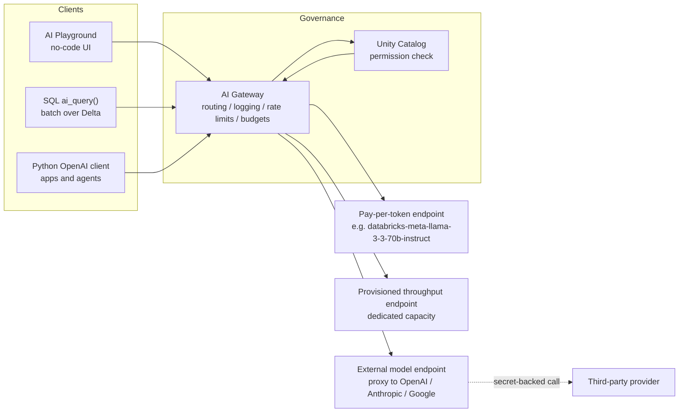

# Calling Foundation Models on Databricks

> You have learned what tokens are, how to prompt, how sampling shapes the output, and how the context window bounds it. This is the lesson where all four become a real API call — governed, billed, and parallelized — on the platform you already run.

## Learning Objectives

By the end of this lesson you will be able to:

- List the **three ways to call a foundation model on Databricks** — AI Playground, SQL `ai_query`, and the Python OpenAI-compatible client — and choose the right one for a given job.
- Explain **pay-per-token vs provisioned throughput** and pick the correct mode for prototyping, spiky traffic, or steady production.
- Run a **batch inference job** over a Delta table with `ai_query`, exactly as you would apply a UDF in your existing ETL.
- Make an **interactive chat call** from Python with a system prompt, `temperature`, and `max_tokens`, including basic error handling.
- Generate **embeddings** for a batch of text.
- Describe **external models** and why you would route OpenAI or Anthropic through Databricks instead of calling them directly.

## Prerequisites

- [Tokens & Tokenization](/docs/llm-foundations/tokens-and-tokenization) — you bill and budget in tokens, so you need to think in them.
- [Prompting Fundamentals](/docs/llm-foundations/prompting-fundamentals) — the system and user messages you will send here.
- [Sampling & Decoding](/docs/llm-foundations/sampling-and-decoding) — `temperature`, `top_p`, and why the same prompt can return different text.
- [The Context Window](/docs/llm-foundations/context-window) — the hard ceiling on how much you can pack into one request.
- [The Databricks AI Platform Map](/docs/orientation/databricks-ai-platform-map) — where Foundation Model APIs, the AI Gateway, and Model Serving sit in the stack.

## Estimated Reading Time

~30 minutes.

## Business Motivation

Back at **Northwind Trust**, our fictional asset manager, the compliance team has a
backlog. Every quarter, analysts receive thousands of unstructured documents —
fund fact sheets, counterparty disclosures, client emails — and someone has to read
each one, classify it, and pull out a two-line summary. Today that is a room full of
people and a shared spreadsheet.

You already own the data. It lands in a Delta table through your normal ingestion
pipeline. What you have been missing is a way to say "for each row, read this text and
tell me its category" without standing up a GPU cluster, managing model weights, or
signing a separate contract with a model vendor. That capability already exists in your
workspace: it is the **Foundation Model APIs**, and you can call them from a SQL cell,
a notebook, or an application.

The reframe for a Data Engineer is this: **calling a model is not a new discipline.**
It is a new *function* you apply to rows — one that happens to be probabilistic instead
of deterministic. The parallelism, the governance, the billing, and the observability
are the Databricks machinery you already trust. This lesson connects the model to that
machinery.

## Intuition

Here is the single most useful mental model in this entire lesson.

**`ai_query` is a UDF that calls a model, applied per row, and parallelized by Spark.**

Think about what you already do when you write:

```sql
SELECT customer_id, upper(trim(name)) AS clean_name
FROM raw.customers;
```

Spark takes the `upper(trim(...))` expression, applies it to every row, and spreads the
work across the executors in your warehouse. You never think about the loop — the engine
handles fan-out. `ai_query` slots into exactly that position:

```sql
SELECT document_id, ai_query('databricks-meta-llama-3-3-70b-instruct',
                             'Classify this document: ' || body) AS category
FROM compliance.documents;
```

Same shape. Same per-row semantics. Same Spark parallelism. The only difference is that
`upper()` returns a deterministic string computed on CPU, while `ai_query()` sends the
row's text to a model endpoint over the network and returns generated text. Everything
you know about batch processing — partitioning, cost of shuffles, writing results back to
a Delta table — still applies.

The second analogy covers billing:

**Pay-per-token vs provisioned throughput is serverless SQL vs a dedicated warehouse.**

When you run a serverless SQL query you pay per query, spin up nothing, and accept that a
noisy neighbor might add a little latency. When you run a provisioned cluster, you pay for
dedicated capacity that is always warm and gives you predictable performance. Foundation
Model billing has the exact same two shapes, for the exact same reasons — and you choose
between them for the exact same reasons.

## Theory

A foundation model on Databricks lives behind a **serving endpoint** — a named,
network-addressable resource (for example `databricks-meta-llama-3-3-70b-instruct`).
You never touch the GPUs, the weights, or the container. You send a request to the
endpoint name and get a response. That indirection is what makes all three calling
methods possible: they are just different clients pointed at the same endpoint.

There are three families of endpoints you will meet:

1. **Foundation Model APIs (pay-per-token)** — Databricks-hosted, pre-provisioned
   endpoints shared across the platform. They already exist in your workspace; you just
   call them. Names are prefixed `databricks-` (for example `databricks-gte-large-en`).
2. **Provisioned throughput** — a foundation model (base or fine-tuned) that you deploy
   onto dedicated capacity you reserve, for predictable latency and throughput.
3. **External models** — a Databricks endpoint that is really a *proxy* to a third-party
   provider (OpenAI, Anthropic, Google, Bedrock, Cohere). The model runs at the provider;
   Databricks fronts it so it inherits your governance and logging.

All three are queried the same way, through the same front door. That front door is the
**AI Gateway**, and access is governed by **Unity Catalog** permissions on the endpoint —
just as table access is governed by UC grants. If a user cannot query the endpoint, the
request is refused before it ever reaches a model.

:::note Model names change; the pattern does not
The exact model names available in your workspace vary by **region** and change over time
as providers ship new versions and retire old ones. Throughout this lesson we use names
that are commonly available on Databricks AWS at time of writing — for example
`databricks-meta-llama-3-3-70b-instruct` (chat) and `databricks-gte-large-en`
(embeddings), with Anthropic Claude models such as `databricks-claude-sonnet-5` also
available. Always confirm the live list in your own workspace under **Serving**, or in the
[supported models documentation](https://docs.databricks.com/aws/en/machine-learning/foundation-model-apis/supported-models). The calling *code* does not change when the model name does.
:::

## Deep Dive

### The three ways to call a model, and when to use each

| Method | Interface | Best for | DE analogy |
|---|---|---|---|
| **AI Playground** | Web UI, no code | Prototyping a prompt, comparing models side by side, sanity-checking before you automate | The SQL editor scratchpad where you draft a query before you schedule it |
| **`ai_query` (SQL)** | SQL function | Batch / at-scale inference over a Delta table; anything that is naturally set-based | A UDF in a scheduled ETL job |
| **Python OpenAI client** | Python SDK | Interactive apps, agents, request/response services, streaming, tool calls | A row-at-a-time application or microservice |

The mistake to avoid is reaching for Python when the work is set-based. If your input is
"a table of 400,000 documents," that is `ai_query`, not a Python `for` loop — for the same
reason you would not `SELECT *` a million rows into pandas and iterate. Let the engine
fan the work out.

Conversely, do not force an interactive chatbot into SQL. A single-turn, low-latency,
one-user-at-a-time interaction is what the OpenAI-compatible client is for.

### Pay-per-token vs provisioned throughput

This is the cost/latency decision, and it mirrors serverless vs dedicated compute exactly.

| Dimension | Pay-per-token | Provisioned throughput |
|---|---|---|
| **What it is** | Shared, always-on endpoints hosted by Databricks | Dedicated model capacity you reserve |
| **Billing** | Per token consumed (input + output), no idle cost | For the provisioned capacity over time, whether or not you use it |
| **Latency** | Good, but shared — can vary under load | Predictable, SLA-backed |
| **Setup** | None — the endpoint already exists | You deploy the endpoint and choose its size |
| **Fine-tuned / custom weights** | No | Yes |
| **Compliance (e.g. HIPAA)** | Standard | Available |
| **Best for** | Prototyping, spiky/low-volume, proof-of-concept, ad-hoc analysis | Steady production traffic, high throughput, strict latency guarantees, regulated workloads |
| **Serverless-SQL analogy** | Serverless SQL warehouse: pay per query, zero idle | Dedicated/provisioned warehouse: reserved, always warm, predictable |

The rule of thumb: **start on pay-per-token.** It is the fastest path to a working call
and you pay only for what you use. Move a workload to provisioned throughput when it has
graduated to steady production traffic, when its latency must be guaranteed, when its
volume makes per-token pricing more expensive than reserved capacity, or when you need a
fine-tuned model or a compliance certification that pay-per-token does not offer.

### External models: third-party models through the front door

Your risk and compliance teams have one non-negotiable requirement: every model call must
be logged, governed, and free of scattered API keys. But the business also wants to use,
say, a specific OpenAI or Anthropic model that is not in the pay-per-token catalog.

**External models** resolve this tension. You create a Databricks serving endpoint whose
"served entity" is really a third-party model. The provider's API key is stored once in a
**Databricks secret**, never in application code. Every request routes through the
**AI Gateway**, so the external model inherits the same governance, usage tracking, rate
limiting, and guardrails as a Databricks-hosted model.

The payoff: your application code calls one endpoint name and does not know or care
whether the model runs at Databricks or at OpenAI. You can swap providers without touching
the app, and you get one governance surface for every model in the company.

## Architecture

Here is the path every request takes, regardless of which of the three methods sent it.



**How to read this diagram.** All three clients on the left are just different ways to
form a request. They all arrive at the **AI Gateway**, which is the single front door.
The Gateway checks **Unity Catalog** to confirm the caller is allowed to query the target
endpoint — the same permission model that guards your tables. Only then does it route the
request to one of the three endpoint types on the right. Notice that the external-model
endpoint (E3) forwards to a third-party provider using a stored secret, but from the
client's perspective it looks identical to a Databricks-hosted endpoint. The logging,
rate limiting, and budget enforcement all happen at the Gateway, which is why *every*
call — no matter the client or the backend — is governed and observable.

## Internal Working

What actually happens when a Spark executor evaluates `ai_query` on a partition of rows?

```
Driver plans the query
      │
      ▼
Rows distributed across executors (normal Spark fan-out)
      │
      ├── Executor 1 ── row → HTTP request → AI Gateway → endpoint → tokens back → row result
      ├── Executor 2 ── row → HTTP request → AI Gateway → endpoint → tokens back → row result
      └── Executor N ── ... (many concurrent in-flight requests)
      │
      ▼
Results collected, written to Delta (or returned to the cell)
```

**Explanation.** `ai_query` is evaluated like any other expression in the query plan, so
Spark's usual partitioning determines how many rows each executor processes and how much
concurrency you get. Each row becomes a network call to the endpoint through the Gateway.
Because these are I/O-bound HTTP calls rather than CPU work, many can be in flight at once;
Databricks manages the concurrency and applies the endpoint's rate limits. This is why a
batch of 100,000 rows does not run 100,000 times slower than one row — it runs with high
parallelism, bounded by the endpoint's throughput rather than your CPU.

Under the hood the request payload is the same OpenAI-style chat structure the Python
client sends: a `messages` array, plus decoding parameters like `temperature` and
`max_tokens`. `ai_query` builds that payload for you from the string request and the
`modelParameters` struct. The response is a completion whose text `ai_query` extracts and
returns as your column value (or, with `responseFormat`, as structured JSON you can parse).

Two behaviors are worth internalizing:

- Because the model is **probabilistic** (see [Sampling & Decoding](/docs/llm-foundations/sampling-and-decoding)), re-running the same batch can yield slightly different text unless you pin `temperature` to `0`. This is unlike every deterministic UDF you have written — plan your idempotency and testing around it.
- Every row consumes **input + output tokens**, and you are billed on both in pay-per-token mode. A verbose prompt template multiplied across a million rows is a real cost line. Keep prompts tight.

## Step-by-Step Walkthrough

Let us walk Northwind Trust's compliance backlog from idea to production.

1. **Prototype in the AI Playground.** Open **Serving → AI Playground**. Paste one real
   document into the chat, write a system prompt ("You are a compliance classifier..."),
   and try a couple of models. Tune the wording until the classification is reliable. No
   code yet — this is your scratchpad.
2. **Lock the prompt and pick a model.** Choose based on quality, cost, latency, and
   context length (see Deep Dive on model choice below). For classification, a mid-size
   instruct model like `databricks-meta-llama-3-3-70b-instruct` is usually plenty.
3. **Test at small scale with `ai_query`.** Run the SQL against `LIMIT 20` rows. Confirm
   the output column looks right and the categories are clean.
4. **Run the batch.** Drop the `LIMIT`, write results to a new Delta table, and schedule
   it as a job — identical to any ETL you already operate.
5. **Add the interactive path (optional).** If analysts also need an on-demand "summarize
   this one document now" button in an internal app, that surface calls the Python
   OpenAI-compatible client against the same endpoint.
6. **Govern and observe.** Confirm the right groups have `CAN QUERY` on the endpoint in
   Unity Catalog, and set an AI Gateway budget so a runaway job cannot surprise finance
   (full detail in Part 9).

## Hands-on Examples

Before you run anything, a quick orientation:

- The SQL examples run in any Databricks **SQL editor cell** or notebook SQL cell on a
  serverless SQL warehouse or a cluster with a recent Databricks Runtime.
- The Python examples need the **Databricks SDK** and the **OpenAI** library, both
  pre-installed on recent Databricks Runtime for ML. Inside a Databricks notebook,
  authentication is automatic — `WorkspaceClient()` picks up your identity.
- Replace endpoint names with ones live in your workspace if these differ.

## Code Examples

### (1) SQL — a single call, then a governed batch over Delta

```sql
-- ---------------------------------------------------------------------------
-- Example 1a: A SINGLE ai_query call.
-- ai_query(endpoint, request [, returnType, failOnError, modelParameters,
--          responseFormat, files]) -- request is a STRING for foundation models.
-- Think of this as calling a scalar UDF once.
-- ---------------------------------------------------------------------------
SELECT ai_query(
  'databricks-meta-llama-3-3-70b-instruct',              -- serving endpoint name
  'In one sentence, classify this document as one of ' ||
  '[fund_factsheet, counterparty_disclosure, client_email, other]. ' ||
  'Document: The Northwind Global Bond Fund reported a 4.2% net return...'
) AS classification;


-- ---------------------------------------------------------------------------
-- Example 1b: BATCH inference over a Delta table, written back to a new table.
-- This is the payoff: one query classifies every row, parallelized by Spark,
-- exactly like applying a UDF in an ETL job.
--
-- Notes:
--  * modelParameters pins temperature to 0 for repeatable classification
--    and caps output length to control cost (input + output are both billed).
--  * failOnError => false makes ai_query resilient: instead of failing the
--    whole job on one bad row, it returns a STRUCT with `result` and
--    `errorMessage` fields so you can inspect failures afterward.
-- ---------------------------------------------------------------------------
CREATE OR REPLACE TABLE compliance.documents_classified AS
SELECT
  document_id,
  body,
  ai_query(
    'databricks-meta-llama-3-3-70b-instruct',
    'Classify this compliance document into exactly one of: ' ||
    'fund_factsheet, counterparty_disclosure, client_email, other. ' ||
    'Return only the label. Document: ' || body,
    modelParameters => named_struct('temperature', 0.0, 'max_tokens', 10),
    failOnError => false
  ) AS classification          -- STRUCT: classification.result / classification.errorMessage
FROM compliance.documents;

-- Inspect any rows that errored (empty result set means a clean run):
SELECT document_id, classification.errorMessage
FROM compliance.documents_classified
WHERE classification.errorMessage IS NOT NULL;
```

For **structured output** — say you want a category *and* a one-line summary as JSON
rather than free text — use `responseFormat` to force a schema:

```sql
-- Structured extraction: the model must return JSON matching this schema.
-- Requires a recent Databricks Runtime (responseFormat is supported on 15.4+).
SELECT
  document_id,
  ai_query(
    'databricks-meta-llama-3-3-70b-instruct',
    'Extract the category and a one-line summary. Document: ' || body,
    responseFormat => '{
      "type": "json_schema",
      "json_schema": {
        "name": "doc_extract",
        "schema": {
          "type": "object",
          "properties": {
            "category": {"type": "string"},
            "summary":  {"type": "string"}
          }
        },
        "strict": true
      }
    }'
  ) AS extracted_json          -- a JSON STRING you can parse with from_json / :
FROM compliance.documents
LIMIT 100;
```

### (2) Python — interactive chat with system + user, temperature, max_tokens

```python
# ---------------------------------------------------------------------------
# Example 2: An interactive chat call using the OpenAI-compatible client.
# Use this path for apps, agents, and request/response services -- NOT for
# batch over a table (use ai_query for that).
#
# get_open_ai_client() returns a standard OpenAI client already pointed at
# your workspace's serving endpoints and authenticated as you. The endpoint
# name goes in `model`.
# ---------------------------------------------------------------------------
import time
from databricks.sdk import WorkspaceClient
from openai import APIError, RateLimitError, APITimeoutError

# In a Databricks notebook this authenticates automatically.
openai_client = WorkspaceClient().serving_endpoints.get_open_ai_client()

ENDPOINT = "databricks-meta-llama-3-3-70b-instruct"

def summarize_document(body: str, max_retries: int = 4) -> str:
    """Summarize one document. Retries on rate limits / transient errors
    with exponential backoff -- essential once you are calling at volume."""
    messages = [
        # The SYSTEM message sets role and rules (see Prompting Fundamentals).
        {"role": "system",
         "content": "You are a compliance analyst. Summarize documents in one "
                    "neutral sentence. Never invent facts not in the text."},
        # The USER message carries the actual task input.
        {"role": "user",
         "content": f"Summarize this document:\n\n{body}"},
    ]

    for attempt in range(max_retries):
        try:
            response = openai_client.chat.completions.create(
                model=ENDPOINT,
                messages=messages,
                temperature=0.2,   # low but not zero: fluent, mostly stable
                max_tokens=120,    # cap output length -> caps cost and latency
            )
            return response.choices[0].message.content.strip()

        except (RateLimitError, APITimeoutError) as e:
            # Transient: back off and retry (1s, 2s, 4s, 8s ...).
            if attempt == max_retries - 1:
                raise
            wait = 2 ** attempt
            print(f"Transient error ({type(e).__name__}); retrying in {wait}s")
            time.sleep(wait)

        except APIError as e:
            # Non-transient (bad request, auth, permission): do not retry.
            raise RuntimeError(f"Model call failed: {e}") from e

# Usage
print(summarize_document(
    "The Northwind Global Bond Fund returned 4.2% net of fees in Q2, "
    "outperforming its benchmark by 60 basis points..."
))
```

:::tip Retries and rate limits
Endpoints enforce rate limits, and network calls occasionally fail transiently. In
production, always wrap model calls with **retry + exponential backoff** on rate-limit and
timeout errors, and never retry on genuine client errors (bad request, missing permission).
For large *batches*, prefer `ai_query`, which handles concurrency and limits for you rather
than making you build a retry loop by hand.
:::

### (3) Python — embeddings with `databricks-gte-large-en`

```python
# ---------------------------------------------------------------------------
# Example 3: Generate embeddings (vectors) for text. Embeddings are the
# foundation of semantic search / RAG (covered in a later Part). The client
# is the same one from Example 2.
# ---------------------------------------------------------------------------
EMBED_ENDPOINT = "databricks-gte-large-en"

texts = [
    "Quarterly fund performance summary.",
    "Counterparty credit risk disclosure.",
    "Client onboarding email thread.",
]

# `input` accepts a single string or a list -- send a list to embed a batch
# in one round trip.
resp = openai_client.embeddings.create(model=EMBED_ENDPOINT, input=texts)

vectors = [item.embedding for item in resp.data]
print(f"Got {len(vectors)} vectors, each of dimension {len(vectors[0])}")
# Each vector is a fixed-length list of floats you would store in a vector
# index or a Delta column for similarity search.
```

### (4) External models — routing a third-party provider through Databricks

```python
# ---------------------------------------------------------------------------
# Example 4: Create an EXTERNAL MODEL endpoint that proxies a third-party
# provider through Databricks. The provider's key lives in a Databricks
# secret (never in code), and every call inherits AI Gateway governance.
#
# Once created, you query this endpoint by name with the SAME OpenAI client
# as Example 2 -- the app cannot tell it is not Databricks-hosted.
# ---------------------------------------------------------------------------
import mlflow.deployments

deploy_client = mlflow.deployments.get_deploy_client("databricks")

deploy_client.create_endpoint(
    name="northwind-anthropic-chat",
    config={
        "served_entities": [
            {
                "external_model": {
                    "name": "claude-sonnet-4-5",        # provider's model id
                    "provider": "anthropic",
                    "task": "llm/v1/chat",
                    "anthropic_config": {
                        # Reference a secret; do NOT paste the key here.
                        "anthropic_api_key": "{{secrets/northwind/anthropic_key}}"
                    },
                }
            }
        ]
    },
)

# Now callable exactly like any other endpoint:
#   openai_client.chat.completions.create(model="northwind-anthropic-chat", ...)
```

:::note Why bother proxying?
Calling Anthropic or OpenAI directly from app code scatters API keys, bypasses your
logging, and gives finance no single place to cap spend. Routing through an external-model
endpoint gives you **one governed front door** for every model — Databricks-hosted or not.
:::

### Choosing a model

Four axes, and they trade off against each other:

- **Quality** — larger / newer models reason better. A 70B instruct model or a frontier Claude/GPT model beats a small model on hard tasks.
- **Cost** — bigger models cost more per token. For a million-row batch, a smaller model that is "good enough" can save real money.
- **Latency** — smaller models respond faster; matters for interactive apps, less for overnight batch.
- **Context length** — how much text you can send at once (see [Context Window](/docs/llm-foundations/context-window)). Summarizing long documents needs a large context window.

Rule of thumb: **prototype on a strong model to establish the quality ceiling, then step
down to the cheapest/fastest model that still meets the bar** — especially for batch, where
per-token cost multiplies across every row.

## Production Considerations

- **Prefer `ai_query` for anything set-based.** It gives you Spark parallelism, built-in
  concurrency management, and `failOnError => false` for row-level resilience. A Python
  `for` loop over a DataFrame is an anti-pattern at scale.
- **Write results to Delta and make the job idempotent.** Because output is probabilistic,
  pin `temperature => 0` for classification/extraction so re-runs are stable, and key your
  writes so a re-run overwrites cleanly.
- **Budget in tokens.** Estimate `(rows × (prompt_tokens + expected_output_tokens))` before
  launching a large batch. Trim prompt templates; cap `max_tokens`.
- **Set AI Gateway budgets and rate limits** so a runaway or looping job cannot generate a
  surprise bill (full detail in Part 9).
- **Handle partial failure.** With `failOnError => false`, always query the `errorMessage`
  field after a batch and decide whether to reprocess those rows.

## Performance Considerations

- **Concurrency, not CPU, is your throughput.** `ai_query` batches are bounded by the
  endpoint's rate limits and the model's speed, not your warehouse cores. Larger warehouses
  help by keeping more requests in flight, up to the endpoint's limit.
- **Batch the embeddings call.** Sending a list to `embeddings.create` amortizes network
  overhead across many texts versus one call per text.
- **Choose the smallest adequate model** for latency-sensitive interactive paths.
- **Provisioned throughput for steady, latency-critical load.** If a production endpoint
  needs predictable p95 latency, reserve capacity instead of sharing a pay-per-token pool.
- **Cap `max_tokens`.** Output generation dominates latency; shorter outputs are faster and
  cheaper.

## Security Considerations

- **Unity Catalog governs who can query an endpoint.** Grant `CAN QUERY` to the right groups
  and no one else — the same discipline you apply to table grants. Access is denied at the
  Gateway before a model is ever reached.
- **Never hard-code API keys.** For external models, store provider keys in Databricks
  secrets and reference them as `{{secrets/scope/key}}`.
- **Do not send PII casually.** Text you put in a prompt leaves your table and goes to a
  model. Mask, tokenize, or redact sensitive fields before they enter a request, and confirm
  the endpoint's data-handling terms meet your compliance obligations. Prefer Databricks-hosted
  or provisioned endpoints (with appropriate certifications) for regulated data.
- **Log and monitor through the Gateway.** Centralized request logging is a governance
  feature, not an afterthought — use it for audit and anomaly detection.

## Common Mistakes

- **Looping in Python over a whole table** instead of using `ai_query`. Slow, ungoverned,
  and hard to make resilient.
- **Leaving `temperature` at its default for classification.** You get inconsistent labels
  across runs. Pin it to `0`.
- **Forgetting output tokens in cost estimates.** You pay for both input and output; a
  chatty model on a big batch is expensive.
- **Hard-coding a model name and assuming it is permanent.** Models get retired. Centralize
  the endpoint name in one config value so a swap is a one-line change.
- **Using `failOnError` default (true) on a huge batch.** One malformed row fails the whole
  job. Use `failOnError => false` and inspect errors afterward.
- **Pasting third-party API keys into notebooks.** Use secrets and external-model endpoints.

## Best Practices

- Prototype in the **Playground**, automate with **`ai_query`**, serve interactively with the
  **Python client**.
- **Start pay-per-token; graduate to provisioned throughput** when volume, latency SLAs, or
  compliance demand it.
- Pin `temperature => 0` for deterministic tasks; keep `max_tokens` tight.
- Use `responseFormat` when you need structured, parseable output instead of scraping free text.
- Route **all** third-party models through **external-model endpoints** for one governance surface.
- Keep prompts short — they are multiplied across every row.
- Set **budgets and rate limits** at the Gateway before running large jobs.

## Interview Questions

1. **How would you classify a Delta table of 500,000 documents with a foundation model on Databricks, and why is that approach better than a Python loop?**
   Use `ai_query` in SQL. It applies the model per row as a governed UDF and is parallelized
   by Spark, so it fans work across the warehouse and manages concurrency and rate limits
   automatically. A Python loop is serial (or hand-parallelized), ungoverned, and far harder
   to make resilient. Set `failOnError => false` for row-level fault tolerance and write
   results back to a new Delta table.

2. **Explain pay-per-token vs provisioned throughput and when you would choose each.**
   Pay-per-token is shared, always-on, billed per token with no idle cost — ideal for
   prototyping and spiky or low-volume work (the serverless-SQL analogy). Provisioned
   throughput reserves dedicated capacity with predictable, SLA-backed latency, supports
   fine-tuned models and compliance certifications, but costs for the reserved capacity
   regardless of use (the dedicated-warehouse analogy). Choose provisioned for steady, high-
   throughput, latency-critical, or regulated production.

3. **What are external models and why route a third-party model through Databricks instead of calling it directly?**
   An external-model endpoint proxies a provider like OpenAI or Anthropic through Databricks.
   The provider key lives in a Databricks secret, and every request passes through the AI
   Gateway, inheriting Unity Catalog governance, centralized logging, rate limits, and budgets.
   Direct calls scatter keys and bypass governance; the proxy gives one auditable front door
   and lets you swap providers without changing app code.

4. **A classification job returns slightly different labels each time it runs. Why, and how do you fix it?**
   Foundation models sample probabilistically, so with a non-zero temperature the same prompt
   can produce different tokens. Set `temperature => 0` (greedy decoding) for repeatable output,
   constrain the label set in the prompt, and optionally use `responseFormat` to force a schema.

5. **How is access to a model endpoint controlled, and how does that connect to what you already know?**
   Endpoints are governed by Unity Catalog permissions (for example `CAN QUERY`), enforced at
   the AI Gateway before any model is invoked — the same permission model that guards your
   Delta tables. If the caller lacks the grant, the request is refused at the front door.

## Quiz

**Q1.** You need to embed 10,000 product descriptions from a Delta table for semantic search. Which calling method and which endpoint type fits best?

<details>

Batch is set-based, so use `ai_query` (or a batched `embeddings.create` for smaller jobs) against an embedding endpoint such as `databricks-gte-large-en`. It parallelizes across the table like any UDF, and embeddings billing works on pay-per-token by default. A per-row Python loop would be the wrong tool.

</details>

**Q2.** Your interactive summarization app occasionally errors with a rate-limit exception under load. What is the correct handling, and what would you do differently at batch scale?

<details>

For the interactive path, catch the rate-limit/timeout errors and retry with exponential backoff, while never retrying genuine client errors (bad request, permission). At batch scale, do not hand-roll this — use `ai_query`, which manages concurrency and endpoint rate limits for you.

</details>

**Q3.** Finance is worried about a surprise bill from a nightly `ai_query` job over a large table. Name two things you would do.

<details>

(1) Estimate token cost up front — roughly `rows × (prompt_tokens + max_tokens)` — and trim the prompt template plus cap `max_tokens`. (2) Set an AI Gateway budget and rate limit on the endpoint so runaway usage is capped (full detail in Part 9). Pinning `temperature => 0` also avoids re-runs caused by nondeterministic output.

</details>

**Q4.** Why is `ai_query` a natural fit for a Data Engineer's mental model, and where does the analogy to a normal UDF break down?

<details>

`ai_query` is applied per row and parallelized by Spark, exactly like a scalar UDF in your ETL — same fan-out, same write-back-to-Delta pattern. The analogy breaks down because the function is probabilistic (the same input can yield different output unless temperature is 0), it is billed per input+output token, and it is an I/O-bound network call bounded by endpoint rate limits rather than CPU.

</details>

## Summary

Calling a foundation model on Databricks is not a new discipline — it is a governed function
you apply to data. You have three clients for the same endpoints: the **AI Playground** for
prototyping, **`ai_query`** for batch inference over Delta (a UDF parallelized by Spark), and
the **Python OpenAI-compatible client** for apps and agents. You choose a billing mode the way
you choose compute: **pay-per-token** (serverless, spiky, prototyping) or **provisioned
throughput** (dedicated, steady, SLA-backed). **External models** extend the same governed
front door to third-party providers. Every call — whatever the client, whatever the backend —
passes through the **AI Gateway** and is authorized by **Unity Catalog**, which is why this
whole capability slots cleanly into the platform you already operate.

## Key Takeaways

- **`ai_query` = a governed UDF, per row, parallelized by Spark.** Use it for anything set-based.
- **Three clients, one set of endpoints:** Playground (prototype), `ai_query` (batch), Python client (apps/agents).
- **Pay-per-token vs provisioned throughput = serverless SQL vs a dedicated warehouse.** Start with the former; graduate to the latter for steady, latency-critical, or regulated load.
- **Pin `temperature => 0`** for deterministic classification/extraction; cap `max_tokens` for cost and latency.
- **Use `failOnError => false`** on large batches and inspect the error field afterward.
- **External models** route third-party providers through the AI Gateway for one governance surface.
- **Unity Catalog governs endpoint access; the AI Gateway enforces it** — the same model as table grants.
- **Model names change; the calling code does not.** Centralize the endpoint name in config.

## Glossary

- **Foundation Model APIs** — Databricks-hosted access to large pre-trained models, available in pay-per-token and provisioned-throughput modes.
- **Serving endpoint** — a named, callable resource that fronts a model; you call the name, not the GPUs.
- **`ai_query`** — the SQL function that calls a serving endpoint per row: `ai_query(endpoint, request [, returnType, failOnError, modelParameters, responseFormat, files])`.
- **Pay-per-token** — billing per input/output token on shared, always-on endpoints; no idle cost.
- **Provisioned throughput** — reserved dedicated model capacity with predictable, SLA-backed latency.
- **External model** — a Databricks endpoint that proxies a third-party provider (OpenAI, Anthropic, Google, Bedrock, Cohere) so it inherits Databricks governance.
- **AI Gateway** — the governed front door that routes, logs, rate-limits, and budgets model requests.
- **`modelParameters`** — a struct of decoding parameters passed to `ai_query` (for example `named_struct('temperature', 0.0, 'max_tokens', 10)`).
- **`responseFormat`** — an `ai_query` parameter that forces structured JSON output against a schema.
- **Embedding** — a fixed-length numeric vector representing text meaning, used for semantic search / RAG.

## Further Reading

- [Foundation Model APIs overview](https://docs.databricks.com/aws/en/machine-learning/foundation-model-apis/)
- [Supported foundation models](https://docs.databricks.com/aws/en/machine-learning/foundation-model-apis/supported-models)
- [Model Serving foundation model overview](https://docs.databricks.com/aws/en/machine-learning/model-serving/foundation-model-overview)
- [Batch inference with `ai_query`](https://docs.databricks.com/aws/en/large-language-models/ai-query)
- [External models in Model Serving](https://docs.databricks.com/aws/en/machine-learning/foundation-models/external-models/)

## Next Lesson

➡️ [AI Functions: Enrich Data with SQL](/docs/llm-foundations/ai-functions) — the most comfortable on-ramp of all: GenAI over whole Delta tables, in plain SQL you already know.
