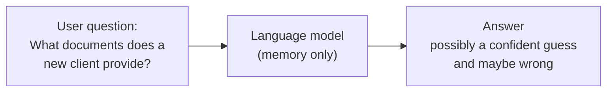
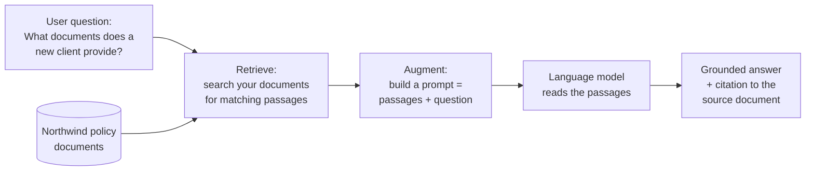

# What Is RAG? Giving the Model Your Data

> Give the model an open book, and it stops guessing.

Imagine a brilliant new hire on their first day.

They are sharp. They have read half the internet. Ask them almost anything about the world and they will give you a confident, polished answer.

But ask them, "What is our firm's policy on client withdrawals over $1 million?" and they go quiet. They have never seen your policy binder. So they do the worst possible thing: they make up an answer that *sounds* right.

That is a large language model on day one. And by the end of this lesson, you will know exactly how to hand it the binder.

Take a breath. You already know more than you think. The retrieval part of this is just search over data, and you have been doing search over data your whole career.

## Learning Objectives

By the end of this lesson, you will be able to:

- Explain, in plain words, why a language model does not know your company's private data.
- Describe what "hallucination" means and why it happens.
- Define RAG (Retrieval-Augmented Generation) and its three simple steps: retrieve, augment, generate.
- Point to exactly where embeddings, similarity, prompting, and the context window fit into RAG.
- Sketch the difference between answering *without* RAG and *with* RAG.

## Prerequisites

This lesson builds on four ideas from Part 1. If any feel shaky, a quick review will make everything here click:

- [Embeddings](/docs/llm-foundations/embeddings) — turning text into numbers that capture meaning.
- [Vector Similarity](/docs/llm-foundations/vector-similarity) — measuring how "close" two pieces of text are.
- [Prompting Fundamentals](/docs/llm-foundations/prompting-fundamentals) — how you talk to the model.
- [Context Window](/docs/llm-foundations/context-window) — the limited space the model can "see" at once.

You do not need any prior AI-building experience. If you can write a SQL `JOIN`, you have the mental muscles for this.

## Estimated Reading Time

About 20 minutes.

## Business Motivation

Here is the situation every company hits.

You have a language model. It is genuinely useful. But your business does not run on general knowledge from the public internet. It runs on *your* data: your policies, your contracts, your product docs, yesterday's numbers.

The model has never seen any of it.

Meet **Northwind Trust**, a fictional asset manager we will use all the way through this course. Northwind has thousands of internal policy documents: compliance rules, client onboarding steps, withdrawal limits, fee schedules. Their support team spends hours hunting through PDFs to answer client questions.

They want to ask an AI, in plain English:

> "What documents does a new institutional client need to provide before their first trade?"

And they want a correct answer, drawn from *their* actual policy documents, with a note saying which document it came from.

That last part matters enormously in finance. An answer you cannot trace back to a source is an answer you cannot trust. RAG gives you both: the answer *and* the receipt.

Get this right and you turn a room full of PDFs into something people can simply talk to. That is the payoff.

## Intuition

Think about two kinds of exam.

**A closed-book exam.** You walk in with nothing. Every answer comes from memory. If you did not study a topic, you guess and hope. That is a plain language model: everything it says comes from what it memorized during training.

**An open-book exam.** You bring the textbook. When a hard question comes up, you flip to the right page, read it, and answer from what is in front of you. You are not smarter, you just stopped guessing.

RAG turns a closed-book exam into an open-book exam.

That is the whole idea. Before the model answers, we quietly slip the right pages onto its desk. Same model. But now it is reading instead of remembering.

Hold on to that picture. Everything below is just the plumbing that fetches the right pages.

## Theory

Let's name the problem precisely, then name the fix.

**The problem, part one: frozen knowledge.** A language model learns from a giant pile of text at one moment in time. After that, its knowledge is frozen. It does not know today's news. It does not know your internal wiki. It never saw your data at all, because your data was private.

**The problem, part two: confident guessing.** When you ask about something the model does not know, it usually does not say "I don't know." Instead it produces a fluent, confident answer that may be completely wrong. The polite industry word for this is **hallucination** — the model inventing facts that sound plausible.

Hallucination is not a bug you can scold away. The model's job is to produce likely-sounding text. When it lacks facts, likely-sounding is all you get.

**The fix: give it the facts, right in the question.** Instead of hoping the answer is buried in the model's memory, we *find* the relevant text ourselves and paste it into the prompt. Now the model does not have to remember. It just has to read and summarize what we handed it.

That fix has a name: **Retrieval-Augmented Generation**, or **RAG**. Let's break the name apart, because the name *is* the recipe:

- **Retrieval** — go find the most relevant passages from your own data.
- **Augmented** — add (augment) those passages into the prompt.
- **Generation** — let the model generate an answer using them.

Retrieve. Augment. Generate. Three steps. That is RAG.

## Deep Dive

Let's slow down on each of the three steps, because the "how" is where your existing skills show up.

**Step 1 — Retrieval.** You need to find the passages in your documents that best match the user's question. But "match" here does not mean keyword match. If someone asks about "pulling money out" and your policy says "withdrawals," a keyword search misses it.

This is exactly where [Embeddings](/docs/llm-foundations/embeddings) and [Vector Similarity](/docs/llm-foundations/vector-similarity) come in. You convert every passage into an embedding (a list of numbers that captures meaning), convert the question into an embedding too, and then find the passages whose embeddings are *closest* to the question's. "Pulling money out" and "withdrawals" land near each other in meaning-space, so similarity search finds them even though the words differ.

Think of it as a very smart librarian. You describe what you need in your own words, and they walk straight to the right page, even if the book uses different words than you did.

**Step 2 — Augment.** Once you have those top passages, you build a prompt that includes them. Something like: "Using only the text below, answer the question. [paste passages] Question: [the user's question]." This is just [Prompting Fundamentals](/docs/llm-foundations/prompting-fundamentals) with the retrieved text stitched in.

There is a limit to how much you can paste, and that limit is the [Context Window](/docs/llm-foundations/context-window). It is the model's desk — only so many pages fit. So you send the *best* passages, not every passage. (In the next lesson you will see why we cut documents into small chunks; this is why.)

**Step 3 — Generate.** The model reads your prompt — question plus passages — and writes an answer grounded in that text. Because you included the source passages, you can also show *which* document each fact came from. That is your citation, your receipt.

:::note Going deeper (optional)
"Grounded" is a term you will hear a lot. It means the answer is tied to real source text you provided, rather than floating free from the model's memory. A grounded answer is one you can check. This is why RAG is popular in regulated industries like finance and healthcare — being able to trace every claim back to a document is often a hard requirement, not a nice-to-have.
:::

Notice what RAG did *not* require: no retraining the model, no feeding it your data during training. You keep your data in your own store and hand over just the relevant slice, only at question time. For a data engineer, that should feel comforting — it is a data pipeline problem, and pipelines are your home turf.

## Architecture

Here are the two pictures worth burning into memory. First, life without RAG.



*Without RAG: the question goes straight to the model, which answers purely from memory. If it never learned your policy, it guesses — and sounds just as confident either way.*

Now, life with RAG.



*With RAG: before the model sees anything, we search your own documents, pull the matching passages, and paste them into the prompt. The model answers from that text and can point back to the source.*

Put simply: without RAG, the arrow goes question to model. With RAG, we sneak a trip to your data in between. That one extra hop is the entire difference.

## Internal Working

Let's trace one real question through the machine, end to end, so nothing feels like magic.

A Northwind client asks: *"What do I need to hand over before my first trade?"*

```
1. QUESTION IN
   "What do I need to hand over before my first trade?"
        |
        v
2. EMBED THE QUESTION
   Turn it into a vector (a list of numbers capturing its meaning).
        |
        v
3. SEARCH BY SIMILARITY
   Compare that vector against the vectors of every stored passage.
   Keep the top few closest matches.
        |
        v
   Best matches found:
     - "Institutional Onboarding: required documents..." (Policy 4.2)
     - "KYC checklist for new accounts..."             (Policy 4.5)
        |
        v
4. BUILD THE PROMPT (AUGMENT)
   "Using only the text below, answer the question.
    [Policy 4.2 text] [Policy 4.5 text]
    Question: What do I need to hand over before my first trade?"
        |
        v
5. MODEL GENERATES
   Reads the passages, writes a grounded answer.
        |
        v
6. ANSWER OUT (+ CITATION)
   "Before your first trade you must provide: a signed
    onboarding form, proof of identity, and... (Source: Policy 4.2)"
```

*A single question flows top to bottom: embed it, search for close passages, paste them into a prompt, let the model answer, return the answer with its source.*

Notice how little the model itself changed. Steps 2, 3, and 4 are all *your* pipeline — embed, search, assemble. The model only shows up at step 5, and by then the hard thinking (finding the right facts) is already done. RAG is mostly good data engineering with a language model bolted on the end. You have got this.

## Step-by-Step Walkthrough

Let's rebuild the same flow in words, one decision at a time, and say *why* each step exists.

1. **Start with the documents.** Northwind gathers its policy PDFs. *Why:* the whole point is answering from these, so they are the source of truth.

2. **Cut them into small chunks.** Each document becomes many small passages. *Why:* the context window is limited, and small passages let you retrieve just the relevant paragraph instead of a 40-page PDF. (Full detail in the next lesson.)

3. **Embed every chunk.** Turn each passage into a vector and store it. *Why:* so you can later search by meaning, not just keywords.

4. **A question arrives.** Embed the question the same way. *Why:* to compare it against the chunks, both sides must be in the same numeric form.

5. **Find the closest chunks.** Use similarity to grab the top few. *Why:* those are your most relevant "pages" for this question.

6. **Assemble the prompt.** Paste the top chunks plus the question. *Why:* this is how you hand the model its open book.

7. **Generate and cite.** The model answers from the pasted text, and you attach the source of each chunk. *Why:* grounded, checkable answers.

Read that list again and you will notice steps 1 through 5 are pure data work — ingest, transform, index, query. That is your world. Only steps 6 and 7 touch the model.

## Hands-on Examples

You do not need to run anything yet. Let's just *read* what good versus bad looks like, so you know what you are aiming for.

**Without RAG (closed book):**

> **Q:** What documents does a new institutional client need before their first trade?
>
> **A:** New clients typically need to provide a government ID and a bank statement.

That answer sounds fine. It is also generic and possibly wrong for Northwind. The model guessed from general knowledge. There is no source. You cannot trust it, and you cannot check it.

**With RAG (open book):**

> **Q:** What documents does a new institutional client need before their first trade?
>
> **A:** Per Northwind policy, a new institutional client must provide: (1) a signed institutional onboarding agreement, (2) proof of entity registration, (3) authorized-signatory identification, and (4) a completed KYC questionnaire. *(Source: Policy 4.2, Institutional Onboarding.)*

Same model. Same question. But this answer is specific, correct for Northwind, and comes with a citation you can open and verify.

That gap between the two answers is the entire reason RAG exists. Feel the difference? That is what you are building toward.

## Code Examples

We are keeping code light in this lesson — the real, runnable build comes in later lessons. But a tiny sketch helps the shape sink in. Read it as pseudocode, not something to run today.

```python
# A conceptual sketch of RAG. Details are simplified on purpose.

# Step 1: embed the user's question into a vector.
question = "What documents does a new institutional client need?"
question_vector = embed(question)

# Step 2: retrieve the most similar passages from your own data.
top_passages = vector_index.search(question_vector, top_k=3)

# Step 3: augment — build a prompt that includes those passages.
prompt = f"""
Answer using ONLY the context below. Cite the source.

Context:
{top_passages}

Question: {question}
"""

# Step 4: generate — the model answers from the pasted text.
answer = model.generate(prompt)
print(answer)
```

Walking through it: `embed()` turns the question into a vector, the same trick you learned with embeddings. `vector_index.search(..., top_k=3)` is the librarian fetching the 3 closest passages. The `prompt` string is where we *augment* — notice the instruction "Answer using ONLY the context below," which tells the model to stop relying on memory. Finally `model.generate()` produces the grounded answer.

What to notice: the model call is the *last* line. Everything above it is retrieval and prompt-building — the parts you, a data engineer, will feel right at home writing.

:::note Going deeper (optional)
On Databricks, you will not hand-roll most of this. Databricks provides Mosaic AI Vector Search to store and search your embeddings, and Foundation Model APIs to do the generation. The `embed()` and `vector_index.search()` steps map to a managed vector search index; the `model.generate()` step maps to a served model endpoint. You will meet both in later lessons. Full details live in the [Databricks documentation](https://docs.databricks.com/aws/en/generative-ai/retrieval-augmented-generation).
:::

## Production Considerations

When Northwind moves this from a demo to something real, a few things start to matter:

- **Your data changes.** Policies get updated. Your embeddings must be refreshed when documents change, or you will confidently answer from an old rule. This is a pipeline you will schedule — again, your comfort zone.
- **Retrieval quality is everything.** If step 1 fetches the wrong passages, the model answers from wrong text. Good retrieval beats a fancier model almost every time.
- **Freshness and permissions.** Different users may be allowed to see different documents. Retrieval has to respect that, or you leak information. More on this under Security.
- **Cost and latency.** Every question now does an embedding lookup plus a model call. That is more work than a plain query. Usually well worth it, but worth measuring.

None of these are blockers. They are just the normal "make it production-grade" checklist, and you have run that checklist for every pipeline you have ever shipped.

## Performance Considerations

A few knobs affect how fast and how good this feels:

- **How many passages you retrieve (`top_k`).** More passages give the model more to work with, but they eat context-window space and add cost. Start small (3 to 5) and tune.
- **Chunk size.** Passages that are too big waste context; too small and they lose meaning. The next lesson is entirely about getting this right.
- **Index type.** Searching millions of vectors exactly is slow, so vector search uses clever approximate methods to stay fast. Managed services like Mosaic AI Vector Search handle this for you.
- **Caching.** If the same question comes up often, you can cache the answer and skip the whole trip.

The headline: retrieval is usually the cheap, fast part; the model call is usually the slow, pricey part. Optimize with that in mind.

## Security Considerations

Because RAG pulls from your real, private data, security is not optional:

- **Access control on retrieval.** The retrieval step must only return documents the current user is allowed to see. If it does not filter by permission, a user could get facts from a document they should never read. On Databricks, Unity Catalog governance helps enforce this.
- **Sensitive data in prompts.** Whatever you retrieve gets pasted into the prompt and sent to the model. Be deliberate about what documents are in scope.
- **Citations reduce risk.** Showing sources lets a human verify before acting on an answer — a healthy safety net in finance.
- **Prompt injection.** A malicious document could contain text like "ignore your instructions." Since you paste document text into the prompt, you must be aware retrieved content can try to hijack the model. You will learn defenses later.

For a beginner, the one rule to remember: retrieval must respect the same permissions your database already enforces. Never widen access just because an AI is asking.

## Common Mistakes

- **Expecting the model to "just know" your data.** It does not, and it never will without retrieval. This is the number-one beginner surprise.
- **Trusting an answer with no source.** If you cannot see where a fact came from, treat it as a guess.
- **Dumping entire documents into the prompt.** You will blow past the context window and pay for tokens you do not need. Retrieve the relevant slice.
- **Forgetting to refresh embeddings.** Stale embeddings mean stale answers. Old policy, wrong answer.
- **Skipping the "use only this context" instruction.** Without it, the model may quietly fall back to its memory and hallucinate anyway.

If you have made a few of these already in your head while reading — good. Spotting them now means you will not ship them later.

## Best Practices

- **Always ask for citations.** An answer you can trace is an answer you can trust.
- **Tell the model to answer only from the provided context**, and to say "I don't know" if the context does not cover it. This is your single strongest anti-hallucination move.
- **Start simple.** Get a basic retrieve-augment-generate loop working before you optimize anything.
- **Measure retrieval separately from generation.** If answers are bad, first check whether you fetched the right passages. Usually that is where the problem lives.
- **Keep your data pipeline honest.** Refresh embeddings when source documents change, just like any other ETL job.

Follow these five and your first RAG system will already be better than most demos. That is a strong place to start.

## Interview Questions

**1. In one sentence, what problem does RAG solve?**
It lets a language model answer using your private or up-to-date data by retrieving relevant passages and inserting them into the prompt, instead of relying only on what the model memorized during training.

**2. What does RAG stand for, and what are its three steps?**
Retrieval-Augmented Generation. Retrieve the most relevant passages from your data, augment the prompt by adding them, then generate an answer grounded in that text.

**3. Why do language models hallucinate, and how does RAG reduce it?**
A model produces likely-sounding text; when it lacks facts, it invents plausible ones. RAG reduces this by supplying the real facts in the prompt, so the model reads rather than guesses — and citations let humans verify.

**4. Where do embeddings and vector similarity fit into RAG?**
In the retrieval step. You embed both the passages and the question into vectors, then use similarity to find the passages closest in meaning to the question, catching matches even when the wording differs.

**5. Why is RAG often preferred over retraining a model on your data?**
RAG needs no retraining: your data stays in your own store and only the relevant slice is sent at question time. It is cheaper, updates instantly when documents change, and keeps data governed and access-controlled.

## Quiz

**Question 1.** A user asks the model about a company policy it was never trained on. Without RAG, what is the most likely outcome?

<details>
<summary>Show answer</summary>

The model gives a confident but possibly wrong answer (a hallucination), because it is guessing from general memory rather than reading your actual policy.

</details>

**Question 2.** Put the three RAG steps in order and name what each does.

<details>
<summary>Show answer</summary>

Retrieve (find the most relevant passages from your data), Augment (add those passages into the prompt), Generate (the model writes an answer grounded in that text).

</details>

**Question 3.** Which Part 1 concepts power the *retrieval* step, and how?

<details>
<summary>Show answer</summary>

Embeddings turn passages and the question into vectors, and vector similarity finds the passages whose meaning is closest to the question — matching by meaning, not exact keywords.

</details>

**Question 4.** Why is including a citation with a RAG answer valuable, especially at a firm like Northwind Trust?

<details>
<summary>Show answer</summary>

A citation lets a human trace the answer back to a real source document and verify it. In regulated fields like finance, traceable, checkable answers are often a hard requirement, not a nice-to-have.

</details>

## Summary

A language model only knows what it learned during training. It does not know your private documents or today's facts, and when it does not know something, it tends to guess confidently — that is hallucination.

RAG fixes this by turning a closed-book exam into an open-book one. Before the model answers, you **retrieve** the most relevant passages from your own data (using embeddings and similarity), **augment** the prompt by pasting them in, and let the model **generate** a grounded, citable answer.

The beautiful part for you: most of RAG is a data pipeline — ingest, embed, index, search, assemble. The model only shows up at the very end. You already know how to do the hard parts.

## Key Takeaways

- A plain language model does not know your data and will confidently make things up.
- RAG = Retrieve, Augment, Generate.
- Retrieval uses embeddings + vector similarity to find passages by meaning.
- The prompt carries the passages; the context window limits how many fit.
- Grounded answers can cite their source, which makes them trustworthy and checkable.
- No retraining needed — your data stays in your store and is used only at question time.

## Glossary

- **Language model (LLM):** an AI trained on lots of text that generates human-like responses.
- **Hallucination:** a confident, fluent answer that is actually made up.
- **RAG (Retrieval-Augmented Generation):** retrieving relevant text from your data and adding it to the prompt so the model answers from it.
- **Retrieval:** finding the most relevant passages for a question.
- **Embedding:** a list of numbers representing the meaning of a piece of text.
- **Vector similarity:** a measure of how close two embeddings are in meaning.
- **Grounded answer:** an answer tied to real source text you provided.
- **Citation:** a pointer to the source document a fact came from.
- **Context window:** the limited amount of text a model can read at once.
- **Chunk:** a small passage a document is cut into for retrieval.

## Further Reading

- [Databricks: Retrieval-Augmented Generation (RAG) on Databricks](https://docs.databricks.com/aws/en/generative-ai/retrieval-augmented-generation)
- [Databricks: Mosaic AI Vector Search](https://docs.databricks.com/aws/en/generative-ai/vector-search)
- [Databricks: Foundation Model APIs](https://docs.databricks.com/aws/en/machine-learning/foundation-model-apis/)

## Next Lesson

➡️ [Chunking: Cutting Documents into Retrievable Pieces](/docs/rag-and-ai-search/chunking)
