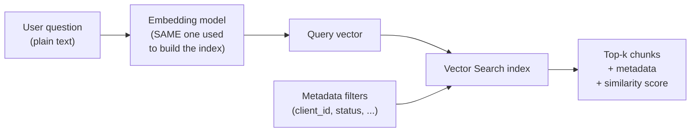
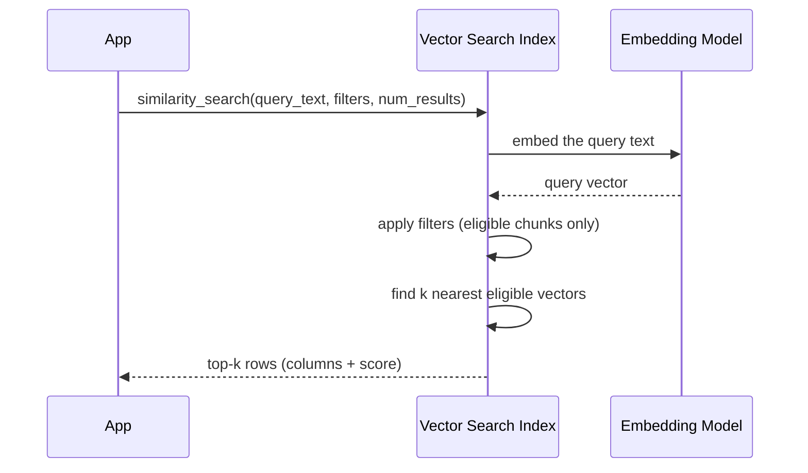

# Retrieving the Right Context

> You have already built the index. Now comes the fun part: asking it questions and getting back exactly the right pages. Think of it as walking up to a well-organized library and saying, "Just show me the few pages that answer this."

Take a breath. If you have spent years writing `SELECT ... WHERE ... JOIN`, you already have most of the instincts you need here. Retrieval is just a different kind of lookup, and you are going to be good at it.

## Learning Objectives

By the end of this lesson, you will be able to:

- Explain what happens when you "query" a Vector Search index.
- Embed a user's question with the **same** model used to build the index, and understand why that matters.
- Choose a sensible value for **k** (how many chunks to retrieve) and reason about the trade-offs.
- Apply **metadata filters** to keep results correct and secure.
- Read and interpret a **similarity score**.
- Write both the Python and SQL versions of a retrieval query.

## Prerequisites

You should be comfortable with the ideas from these two lessons first:

- [Building a Vector Search Index](/docs/rag-and-ai-search/vector-search-index) — how the index got created in the first place.
- [Vector Similarity](/docs/llm-foundations/vector-similarity) — what "close" means for vectors.

If you have read those, you are ready. If not, they are short, and they will make this lesson click much faster.

## Estimated Reading Time

About 20 to 25 minutes, plus a little time to try the code.

## Business Motivation

Let's ground this in something real.

Imagine you work at **Northwind Trust**, a fictional wealth-management firm. Your customers ask questions like *"What's the penalty for withdrawing from my retirement account early?"* Northwind has thousands of policy documents, client handbooks, and regulatory notices.

A chatbot that just guesses is dangerous. A chatbot that quotes the **wrong client's** documents is a compliance nightmare. What you actually want is simple to say and important to get right: for each question, fetch the handful of truly relevant, truly allowed passages, and hand those to the AI so it can answer from facts.

That fetching step is called **retrieval**, and it is the heart of every Retrieval-Augmented Generation (RAG) system. Get retrieval right, and the rest of the pipeline mostly takes care of itself. Get it wrong, and no amount of clever prompting will save you.

## Intuition

Here is the whole idea in one picture.

You walk into a library. You do not want the entire building. You do not even want a whole shelf. You want to ask the librarian:

> "Please bring me the **3 most relevant pages** about early withdrawals, and only from the **current** employee handbook."

That single sentence contains everything this lesson teaches:

- **"most relevant pages"** — the search finds passages by meaning, not exact keywords.
- **"3"** — that's your **k**, the number of results.
- **"early withdrawals"** — that's the **query**, which gets turned into a vector.
- **"only from the current handbook"** — that's a **filter**.

The librarian does not read every book to you. She hands you a small, focused stack. That's retrieval.

## Theory

Let's slow down and name the moving parts. Don't worry, there are only four.

**1. The query.** This is the user's question, as plain text. For example: *"penalty for early 401k withdrawal"*.

**2. Embedding the query.** An **embedding** is a list of numbers (a vector) that captures the *meaning* of some text. Your index already stored an embedding for every chunk of every document. To search, you turn the **query** into an embedding too, using the **same embedding model** that built the index. Same model in, same "coordinate system" out. If you used a different model, it would be like measuring the shelves in centimeters but the books in inches. Nothing would line up.

**3. Nearest-neighbor search.** Once your question is a vector, the index finds the chunk vectors that sit **closest** to it. Closeness means similar meaning. This is the "similarity search" you keep hearing about.

**4. Top-k.** You do not want every nearby chunk. You want the top few. The number you ask for is **k** (as in `num_results=k`). Ask for the top 3, the top 5, the top 10 — your call, and we will talk about how to choose.

That's the entire theory. Question in, vector out, closest chunks back.

## Deep Dive

Now let's add the two ideas that separate a toy demo from a production system: **filters** and **scores**.

### Metadata filters

Every chunk in your index can carry **metadata** — extra columns like `client_id`, `doc_type`, `department`, or `effective_date`. This should feel familiar: it is just columns on a table.

A **filter** says "only consider chunks where the metadata matches this condition" *before* ranking by similarity. It is the vector-search cousin of a SQL `WHERE` clause.

Filters matter for two very different reasons:

- **Correctness.** If a policy was replaced last year, you do not want the AI quoting the old one. Filter to `status = 'current'`.
- **Security.** This is the big one. If user A asks a question, you must **never** retrieve documents that belong to user B. A filter like `client_id = 'A'` enforces that at query time. We'll come back to this in the Security section, because it is the single most important habit to build.

:::note Going deeper (optional)
Under the hood, filtering can happen before or alongside the nearest-neighbor scan depending on the index type and how selective the filter is. You do not need to manage any of that — Databricks handles it. Just know that a filter genuinely restricts *what is eligible* to be returned, not just what is displayed afterward.
:::

### The similarity score

Every result comes back with a **similarity score** — a number that says how close that chunk was to your query. Higher generally means "more relevant."

You will use the score to sanity-check your results. If your top result has a low score, that's a hint the index might not contain a good answer at all, and you may want your app to respond with "I don't have information on that" instead of forcing a weak answer.

:::note Going deeper (optional)
The exact scale of the score depends on the distance metric your index uses (for example, cosine similarity versus L2 distance). Because of that, treat scores as **relative** within one set of results, not as absolute percentages you compare across different indexes. A score of 0.82 in one index is not directly comparable to 0.82 in another.
:::

## Architecture

Here is how the pieces fit together at query time. Notice that the user's question and the stored chunks both pass through the **same** embedding model.



*Figure 1: A retrieval query. The question becomes a vector, filters narrow the candidates, and the index returns the top-k closest chunks with their scores.*

The chunks that come back are then handed to a language model to write the final answer — but that step belongs to the next lesson. For now, our job ends at "the right chunks came back."

## Internal Working

Let's trace a single query end to end, the way you'd trace a SQL plan.



*Figure 2: Step-by-step, from your call to the returned rows.*

A nice detail: when your index is set up to **manage embeddings for you** (a "Delta Sync" index with an embedding model attached), you can pass **`query_text`** — plain words — and Databricks embeds the query for you, automatically using the correct model. That removes a whole category of mistakes. If instead you manage embeddings yourself, you would embed the query in your own code and pass a `query_vector`. We'll use the friendlier `query_text` path in our examples.

## Step-by-Step Walkthrough

Here's the mental checklist for writing any retrieval query:

1. **Get a handle to the index.** Connect and fetch the index object by name.
2. **Decide which columns you want back.** Almost always the chunk text, plus a few metadata columns and the score.
3. **Write the user's question** as `query_text`.
4. **Pick k** via `num_results`. Start with 3 to 5.
5. **Add filters** for correctness and security. This is not optional in production.
6. **Read the results** — inspect the text and the scores.

Now let's turn that checklist into code.

## Hands-on Examples

We'll retrieve context for a Northwind Trust customer question:

> *"What is the penalty for withdrawing from my retirement account early?"*

We want passages that are (a) about early withdrawals, (b) from **current** policies only, and (c) belonging to **this** client. Let's build it up.

## Code Examples

### Python: a basic retrieval query

```python
from databricks.vector_search.client import VectorSearchClient

# 1. Connect and get a handle to your existing index.
client = VectorSearchClient()
index = client.get_index(
    endpoint_name="northwind_vs_endpoint",
    index_name="northwind.rag.policy_chunks_index",
)

# 2. Ask the index for the most relevant chunks.
results = index.similarity_search(
    query_text="What is the penalty for withdrawing from my retirement account early?",
    columns=["chunk_text", "doc_title", "effective_date"],
    num_results=3,
)

print(results)
```

Let's walk through what just happened.

- We created a `VectorSearchClient` and called `get_index(...)` to get a handle to the index we built in the previous lesson. Think of this like opening a connection and pointing at one table.
- `similarity_search(...)` is the query. We passed `query_text` as plain English — because the index manages embeddings, Databricks turns that text into a vector for us, using the exact same model that built the index. No mismatch possible.
- `columns=[...]` lists what we want back for each hit: the chunk text plus a couple of metadata columns to show our work.
- `num_results=3` is our **k**. We asked for the three closest chunks.

The `results` object contains the matching rows along with a similarity score for each. That's already a working retriever. But it is missing something important: filters.

### Python: adding metadata filters

```python
results = index.similarity_search(
    query_text="What is the penalty for withdrawing from my retirement account early?",
    columns=["chunk_text", "doc_title", "effective_date"],
    num_results=3,
    filters={
        "client_id": "NW-10432",
        "status": "current",
    },
)
```

Here's the important change. The `filters` dictionary tells the index: *only consider chunks where `client_id` is `NW-10432` **and** `status` is `current`.*

Read that twice, because it is doing two jobs at once:

- **Correctness:** `status = "current"` keeps retired, superseded policies out of the answer.
- **Security:** `client_id = "NW-10432"` guarantees we never pull another client's documents into this user's session. The filter is applied *during* the search, so ineligible chunks can't be returned even if they are a great semantic match.

This is the single most important line in the whole lesson. In production, the `client_id` value should come from the authenticated user's session — never from anything the user typed.

:::note Going deeper (optional)
Filter syntax supports more than exact matches. Databricks lets you express conditions like ranges and set membership using operator suffixes on the key (for example `"effective_date >="` with a date value, or an `"IN"`-style list of allowed values). The exact operators evolve, so when you need something fancier than equality, check the current [Vector Search query docs](https://docs.databricks.com/aws/en/generative-ai/vector-search). For most RAG apps, equality filters on a few columns get you most of the way.
:::

### Python: reading the results and the scores

```python
for row in results["result"]["data_array"]:
    # Each row is a list of the requested columns, followed by the score.
    chunk_text, doc_title, effective_date, score = row
    print(f"score={score:.3f}  title={doc_title}")
    print(chunk_text[:200], "...")
    print("-" * 40)
```

Now we're reading what came back.

- The results arrive as rows in `results["result"]["data_array"]`. Each row lists the columns you asked for, and the **similarity score is appended as the last value**. That ordering is the part people forget, so unpack carefully.
- We print the score first so we can eyeball relevance. If the top score looks weak, that's your app's cue to say "I couldn't find this" rather than answer from thin air.
- We print the first 200 characters of each chunk just to peek. In a real pipeline, you'd pass the full `chunk_text` values on to the language model.

That's the complete Python retriever: connect, search with a k and filters, read the scored rows.

### SQL: the same query with `vector_search()`

You do not have to leave SQL to do this. Databricks exposes retrieval as a table function.

```sql
SELECT
  chunk_text,
  doc_title,
  effective_date,
  search_score
FROM vector_search(
  index => 'northwind.rag.policy_chunks_index',
  query_text => 'What is the penalty for withdrawing from my retirement account early?',
  num_results => 3
)
WHERE client_id = 'NW-10432'
  AND status = 'current';
```

Here's the SQL walkthrough, and notice how familiar it feels.

- `vector_search(...)` is a **table function** — it returns rows, so you can put it right in the `FROM` clause and treat the result like any other table.
- We pass the same three ideas: which `index` to hit, the `query_text`, and `num_results` for k.
- Each returned row includes a `search_score` column you can select and sort on, just like the Python score.
- The `WHERE` clause filters the results by metadata — the SQL-native way to express what the Python `filters` dict did.

For your team, this is often the easiest on-ramp: analysts who already live in SQL can retrieve context without touching Python at all.

:::note Going deeper (optional)
For maximum efficiency with very selective filters, some teams prefer to pass filters into the function itself (so the engine narrows candidates as early as possible) rather than only filtering afterward. The `vector_search()` function accepts a filters argument for this; the outer `WHERE` shown above is the simplest correct version. When precision on large indexes matters, review the current [SQL `vector_search()` reference](https://docs.databricks.com/aws/en/generative-ai/vector-search).
:::

## Production Considerations

- **Filters come from identity, not input.** In a live app, derive `client_id` (and any access scopes) from the authenticated session. Treat user-typed text as the question only, never as a source of filter values.
- **Handle the empty and the weak case.** Sometimes the index has nothing good. Decide in advance what your app does when the top score is low or when zero rows come back. "I don't have that information" is a perfectly good answer.
- **Keep k small and stable.** A fixed, modest k (3 to 5 to start) keeps behavior predictable and costs flat. Only raise it when you can measure that answers improve.
- **Log queries and scores.** Store the question, the filters applied, the returned chunk IDs, and the scores. When someone reports a bad answer, this log is how you debug it.

## Performance Considerations

- **Bigger k costs more.** More chunks means more tokens sent to the language model downstream, which means more money and more latency. It also invites **noise** — irrelevant passages that can distract the model. More is not better.
- **Selective filters can speed things up.** A tight filter (say, one client's docs) shrinks the candidate set the index has to consider.
- **Right-size the returned columns.** Only request the columns you actually use. Dragging huge unused columns back on every query is wasted I/O — the same instinct you already have from `SELECT *` avoidance.
- **Reuse the index handle.** In a service, fetch the index handle once and reuse it across requests rather than reconnecting per call.

## Security Considerations

This section is short on purpose, because there is really one rule.

**Never retrieve what the user is not allowed to see.**

Vector search does not know your permission model. If you do not filter, it will happily return the single most relevant chunk in the entire index — even if that chunk belongs to a different client, department, or clearance level. The filter is your access-control boundary at query time.

Concretely:

- Always attach a filter that scopes results to the current user's allowed data (`client_id`, `tenant_id`, `department`, etc.).
- Source those filter values from the authenticated session, never from the prompt.
- Combine query-time filters with the platform's own access controls (Unity Catalog governance on the underlying tables) so you have defense in depth, not a single point of failure.

If you remember one thing from this lesson, make it this rule.

## Common Mistakes

- **Using a different embedding model for the query than for the index.** Meanings won't line up and results turn to nonsense. Using `query_text` on a managed index avoids this entirely.
- **Forgetting filters.** The demo works, so it ships — and then it returns another client's document. Filters are not a "later" feature.
- **Setting k too high.** People assume more chunks means safer answers. Usually it means more noise, more cost, and slower responses.
- **Setting k too low.** Ask for just 1 chunk and you may miss the sentence that actually answers the question. Start around 3 to 5.
- **Trusting the score as an absolute percentage.** Scores are relative within one result set and depend on the distance metric. Compare within, not across.
- **Unpacking rows wrong.** Remember the similarity score is appended after your requested columns in the Python result rows.

## Best Practices

- Prefer `query_text` on a managed (Delta Sync) index so Databricks embeds the query with the correct model for you.
- Always pass a **security filter** scoped to the authenticated user.
- Add **correctness filters** (like `status = 'current'`) to avoid stale documents.
- Start with `num_results` between 3 and 5, then tune with evaluation, not vibes.
- Return only the columns you need, and always include the score.
- Have a graceful fallback for low-score or empty results.

## Interview Questions

1. **Why must the query be embedded with the same model used to build the index?**
   Because embeddings from different models live in different "coordinate systems." A query vector from model B cannot be meaningfully compared to chunk vectors from model A, so nearest-neighbor results become unreliable.

2. **How do metadata filters improve both correctness and security in retrieval?**
   Correctness: they exclude stale or irrelevant documents (for example, superseded policies) before ranking. Security: they restrict results to data the user is permitted to see, so the search can't return another user's documents even if those are a strong semantic match.

3. **How would you choose the value of k, and what are the trade-offs?**
   Start small (3 to 5). Too few risks missing the passage that holds the answer; too many adds noise, cost, and latency, and can distract the downstream model. Tune k using an evaluation set rather than guessing.

4. **What does the similarity score tell you, and what should you be careful about when interpreting it?**
   It indicates how close a chunk is to the query — higher usually means more relevant. Be careful: the scale depends on the distance metric, so treat scores as relative within one result set, not as absolute or cross-index comparable percentages.

5. **Compare retrieving context in Python via `similarity_search` versus SQL via `vector_search()`. When would you reach for each?**
   Both do the same job: embed the query, filter, return top-k with scores. Python fits application/service code and programmatic pipelines; SQL suits analysts and set-based workflows where the results feed directly into other queries. Choose based on where the rest of your logic already lives.

## Quiz

**Q1.** Your retriever returns a chunk from a *different* client's handbook. What is the most likely cause, and the fix?

<details>
<summary>Show answer</summary>

The query is missing a security filter (or the filter value came from user input instead of the session). Add a `filters={"client_id": ...}` in Python (or a `WHERE client_id = ...` in SQL) sourced from the authenticated user.

</details>

**Q2.** You set `num_results=25` to "be safe," and answers get worse and slower. Why?

<details>
<summary>Show answer</summary>

A large k pulls in many marginally relevant chunks. That extra noise can distract the downstream model, and sending more chunks costs more tokens and adds latency. Lower k back to a small number (3 to 5) and tune from there.

</details>

**Q3.** In the Python results, you unpacked each row as `chunk_text, score` but got wrong values. What went wrong?

<details>
<summary>Show answer</summary>

The score is appended *after* all the columns you requested. If you asked for three columns, the row has four values (three columns plus the score). Unpack all requested columns first, then the score last.

</details>

**Q4.** You want only policies effective this year. Which mechanism handles that, and is it about correctness or security?

<details>
<summary>Show answer</summary>

A metadata filter on the date column (for example `effective_date`), applied via `filters` in Python or `WHERE` in SQL. This is a correctness filter — it keeps stale documents out of the answer.

</details>

## Summary

Retrieval is how you ask your Vector Search index for the few most relevant passages to answer a question. You embed the query with the same model that built the index, ask for the top-k nearest chunks, and — crucially — apply metadata filters so results stay both correct and secure. Each result comes back with the chunk text, its metadata, and a similarity score you can use to judge relevance. You can do all of this in Python with `similarity_search(...)` or in SQL with the `vector_search()` table function.

## Key Takeaways

- Same embedding model for query and index — always.
- **k** is a dial: too few misses answers, too many adds noise and cost. Start at 3 to 5.
- **Filters** are not optional. They protect correctness and, above all, security.
- Never retrieve what the user isn't allowed to see; scope filters from the authenticated session.
- Scores are relative signals, useful for sanity checks and fallbacks.
- Python and SQL give you the same capability — pick the one your app lives in.

## Glossary

- **Retrieval** — fetching the most relevant stored chunks for a query.
- **Query vector / embedding** — the numeric representation of the user's question.
- **Top-k** — the number of nearest chunks you ask for (`num_results`).
- **Metadata filter** — a condition on non-text columns that restricts which chunks are eligible.
- **Similarity score** — a number indicating how close a chunk is to the query; higher usually means more relevant.
- **Delta Sync index** — a managed index where Databricks keeps embeddings in sync and can embed your `query_text` for you.

## Further Reading

- [Databricks Vector Search — query an index](https://docs.databricks.com/aws/en/generative-ai/vector-search)

## Next Lesson

You can now fetch the right context. Next, you'll feed that context to a language model and produce grounded answers, wiring the whole thing together.

➡️ [Building a RAG Pipeline End to End](/docs/rag-and-ai-search/rag-pipeline)
