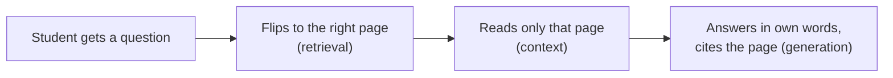
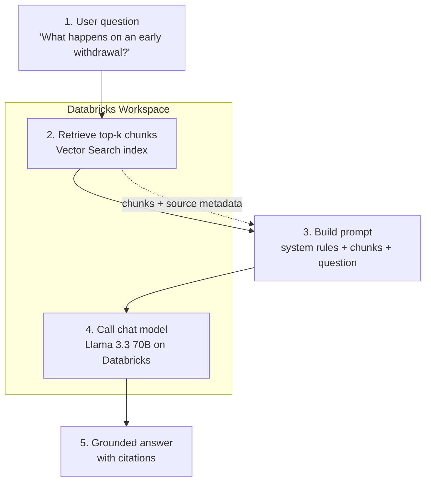

# Building a RAG Pipeline End to End

> You have already learned the pieces. Today we snap them together into one small function that takes a question and hands back a trustworthy, cited answer. This is the moment RAG stops being a diagram and starts being code you can run.

Take a breath. If you have made it through the earlier lessons, you already know the hard parts. Retrieval? You have done it. Prompting? Done. Calling a foundation model? Done. This lesson is mostly about wiring, and wiring is something data engineers are very good at.

## Learning Objectives

By the end of this lesson, you will be able to:

- Describe the full RAG loop in one breath: question in, retrieve, build prompt, generate, cited answer out.
- Write a single Python function, `answer_question(question)`, that runs that whole loop.
- Assemble a prompt that combines a system instruction, the retrieved chunks, and the user question.
- Apply the two rules that make RAG trustworthy: **ground only in retrieved text**, and **say "I don't know" when the context does not contain the answer**.
- Return an answer that includes citations back to the source documents.

## Prerequisites

You will get the most out of this lesson if you have already worked through:

- [Retrieving the Right Context](/docs/rag-and-ai-search/retrieval) — how to pull the top matching chunks from a Vector Search index.
- [Prompting Fundamentals](/docs/llm-foundations/prompting-fundamentals) — how a system message and a user message shape a model's reply.
- [Calling Foundation Models](/docs/llm-foundations/calling-foundation-models) — how to send messages to a chat model on Databricks and read the response.

If any of those feel fuzzy, that is completely fine. We will re-introduce each piece as we use it. You do not need to memorize anything.

## Estimated Reading Time

About 25 to 30 minutes, plus a little more if you run the code along the way.

## Business Motivation

Let's ground this in a real scene.

Meet **Northwind Trust**, a fictional wealth-management firm. Their financial advisors field the same kinds of questions all day long. One that comes up constantly: *"What happens if a client makes an early withdrawal from a retirement account?"*

The answer lives in Northwind's internal policy documents — hundreds of PDFs full of rules, fees, and exceptions. An advisor could go dig through them. But that takes minutes, and the answer had better be exactly right, because getting it wrong could mean giving a client bad financial guidance.

Here is the tempting shortcut, and why it fails: you could just ask a chat model "What happens on an early withdrawal?" and let it answer from memory. But the model does not know Northwind's specific policies. It might blend in generic rules from the internet, or worse, invent a fee that does not exist. In finance, a confident wrong answer is dangerous.

RAG fixes this. Instead of trusting the model's memory, we hand it the actual Northwind policy text and say: *answer using only this.* The advisor gets a fast answer, grounded in the firm's own documents, with a citation pointing to the exact source. That is the difference between a demo and something a regulated business can actually use.

## Intuition

Here is the simplest way to picture what we are building.

Think of an **open-book exam done well**.

A good student does not answer from memory and hope. They do three things:

1. **Find the right page** in the textbook.
2. **Read it.**
3. **Answer in their own words, and cite the page.**

That is RAG. The model is the student. Vector Search is how it flips to the right page. The prompt is the instruction sheet that says "only use what is on these pages, and if it is not there, say so."

The magic is not that the model is smart. The magic is that we control what it reads before it answers.



*Figure 1: RAG is an open-book exam done well — find the page, read it, answer with a citation.*

## Theory

Let's put a light layer of theory under that intuition.

RAG stands for **Retrieval-Augmented Generation**. Read the name backwards and it explains itself:

- **Generation** — a chat model writes an answer.
- **Augmented** — but we augment (boost) it with extra information.
- **Retrieval** — that extra information comes from retrieving relevant documents.

A plain chat model answers from its training memory alone. It has no idea what is in your private documents, and its memory can be stale or simply wrong. RAG adds a step *before* generation: we fetch relevant text and place it directly in front of the model, so its answer is anchored to real, current, private data.

Two rules make this trustworthy. Please remember these two more than anything else in the lesson:

1. **Ground only in retrieved text.** The model must answer using the chunks we provide, not its own memory.
2. **Say "I don't know" when the context does not contain the answer.** A polite "I don't know" is a *correct* answer. A confident guess is a failure.

Everything else — the code, the prompt, the endpoints — exists to enforce those two rules.

## Deep Dive

So how do we actually enforce those two rules? We do not have a magic switch. We enforce them with **the prompt**.

A chat model takes a list of messages. Each message has a **role**. For our purposes, two roles matter:

- The **system** message sets the rules and personality. This is where we say "answer only from the context; if the answer is not there, say you don't know; cite the source."
- The **user** message carries the actual request. This is where we place the retrieved chunks *and* the question.

Here is the mental model. The system message is the exam's instruction sheet. The user message is the open textbook pages plus the question written at the top. The model reads both and writes an answer.

:::note Going deeper (optional)
Why put the retrieved chunks in the *user* message and not the system message? Both can work, and you will see teams do it either way. Putting the chunks alongside the question in the user message keeps a clean separation: the system message is stable, reusable rules, while the user message is the specific, changing data for this one question. It also tends to make the model treat the chunks as material to reason over, rather than as standing instructions. This is a style choice, not a hard law — do not worry about it as a beginner.
:::

The other important detail: each chunk we retrieve carries **metadata**, such as which document it came from. We will keep that metadata attached, feed it to the model, and ask the model to cite it. That is how the answer ends up with a source the advisor can trust.

## Architecture

Now the picture you have been waiting for: the whole pipeline, end to end.



*Figure 2: The full RAG pipeline. A question flows through retrieval, prompt assembly, and generation, and comes out the other side as a cited answer. Retrieval and generation both run inside your Databricks workspace.*

Notice the shape. The question enters on the left. Two Databricks services do the heavy lifting — Vector Search for retrieval, a model serving endpoint for generation. Our function is the glue in the middle that shuttles data between them and formats the prompt. That glue is small. That is the good news.

## Internal Working

Let's trace what happens inside each numbered step, still in plain language.

**Step 1 — Take the question.** The advisor types a question as a string. That string is our only input.

**Step 2 — Retrieve.** We hand the question to a Vector Search index. Behind the scenes, the index turns the question into an embedding (a list of numbers that captures meaning) and finds the chunks whose embeddings are closest. It returns the top `k` — say, the top 3 — most relevant chunks, each with its text and its source metadata. You built this in the retrieval lesson; here we just call it.

**Step 3 — Build the prompt.** We stitch together three things: the system instruction (our two rules), the retrieved chunks (with their sources), and the question. This is the step most people get wrong and the step we will narrate most carefully.

**Step 4 — Generate.** We send that prompt to the chat model on a Databricks serving endpoint. The model reads the rules, reads the chunks, reads the question, and writes an answer.

**Step 5 — Return.** We hand the answer back — grounded in the chunks, with citations the model included because we asked it to.

That is the entire internal loop. Five steps, one function.

## Step-by-Step Walkthrough

Before we look at a full function, let's do each step in isolation so nothing feels like magic. We will build up to the complete function in the next section.

**First, retrieve.** We create a Vector Search client, point it at our index, and ask for the closest chunks.

```python
from databricks.vector_search.client import VectorSearchClient

vsc = VectorSearchClient()
index = vsc.get_index(
    endpoint_name="northwind_vs_endpoint",
    index_name="northwind.policies.policy_chunks_index",
)

results = index.similarity_search(
    query_text="What happens if a client makes an early withdrawal?",
    columns=["chunk_text", "source_document"],
    num_results=3,
)
```

What just happened: we asked the index for the 3 chunks most relevant to the early-withdrawal question. We told it we want two columns back — `chunk_text` (the actual policy text) and `source_document` (where it came from, so we can cite it). The `num_results=3` is our `k`: how many chunks to retrieve. Three is a sensible starting point.

**Second, unpack the results.** Vector Search returns a nested structure; the rows live under a data-array key.

```python
rows = results["result"]["data_array"]
# each row looks like: ["...policy text...", "retirement_policy_v3.pdf"]
```

Here we reached into the response and pulled out the list of rows. Each row is a small list: the chunk text first, the source document second, in the same order we listed the columns. Do not worry about memorizing this shape — you can always print `results` and look.

**Third, format the chunks into readable context.** We turn those rows into one clean block of text, labeling each chunk with its source.

```python
context = "\n\n".join(
    f"[Source: {source}]\n{text}"
    for text, source in rows
)
```

Read that slowly. For every row, we build a little labeled block: the source in brackets, then the text. We join the blocks with blank lines between them. The result is one string where every piece of text is clearly stamped with where it came from. That labeling is what makes citations possible in the final step.

Now we have context. Next section, we build the prompt and generate — inside one tidy function.

## Hands-on Examples

Let's see the shape of a prompt with a tiny, made-up example before the real code. Suppose retrieval gave us this context:

```text
[Source: retirement_policy_v3.pdf]
Early withdrawals from a retirement account before age 59 and a half
are subject to a 10 percent penalty in addition to ordinary income tax.

[Source: fee_schedule_2026.pdf]
Northwind Trust charges a 25 dollar processing fee on all early
distribution requests.
```

And the advisor's question is: *"What penalties apply to an early withdrawal?"*

The model, obeying our rules, should answer something like:

```text
Early withdrawals before age 59 and a half are subject to a 10 percent
penalty plus ordinary income tax [retirement_policy_v3.pdf]. Northwind
Trust also charges a 25 dollar processing fee [fee_schedule_2026.pdf].
```

See how the answer sticks to the provided text and cites each source? Now imagine the advisor instead asked: *"What is the penalty for a wire transfer to another country?"* Nothing in our context covers that. A well-behaved RAG system replies:

```text
I don't know based on the provided policy documents.
```

That "I don't know" is a feature, not a bug. It is the system refusing to make something up. In finance, that refusal is worth its weight in gold.

## Code Examples

Here is the whole thing: one clean, runnable, production-minded function. Read it once top to bottom, then we will narrate every piece.

```python
from databricks.vector_search.client import VectorSearchClient
from databricks.sdk import WorkspaceClient

# --- Configuration (set these to your own values) ---
VS_ENDPOINT = "northwind_vs_endpoint"
VS_INDEX = "northwind.policies.policy_chunks_index"
CHAT_MODEL = "databricks-meta-llama-3-3-70b-instruct"
TOP_K = 3

# --- Clients (create once, reuse) ---
vsc = VectorSearchClient()
index = vsc.get_index(endpoint_name=VS_ENDPOINT, index_name=VS_INDEX)

workspace = WorkspaceClient()
openai_client = workspace.serving_endpoints.get_open_ai_client()

# --- The system instruction: our two trust rules, written down ---
SYSTEM_PROMPT = """You are a policy assistant for Northwind Trust.
Answer the question using ONLY the information in the provided context.
If the answer is not contained in the context, reply exactly:
"I don't know based on the provided policy documents."
Do not use outside knowledge. Do not guess.
Cite the source document in square brackets after each fact you use."""


def retrieve(question, k=TOP_K):
    """Step 2: get the top-k relevant chunks with their sources."""
    results = index.similarity_search(
        query_text=question,
        columns=["chunk_text", "source_document"],
        num_results=k,
    )
    return results["result"]["data_array"]


def build_context(rows):
    """Step 3a: format chunks into one labeled, citable block."""
    return "\n\n".join(
        f"[Source: {source}]\n{text}"
        for text, source in rows
    )


def answer_question(question):
    """The full RAG loop: retrieve, build prompt, generate, return."""
    # Step 2: retrieve
    rows = retrieve(question)

    # Guardrail: nothing retrieved means nothing to ground on
    if not rows:
        return "I don't know based on the provided policy documents."

    # Step 3: build the prompt (context + question in the user message)
    context = build_context(rows)
    user_message = (
        f"Context:\n{context}\n\n"
        f"Question: {question}"
    )

    # Step 4: call the chat model
    response = openai_client.chat.completions.create(
        model=CHAT_MODEL,
        messages=[
            {"role": "system", "content": SYSTEM_PROMPT},
            {"role": "user", "content": user_message},
        ],
        temperature=0.0,
    )

    # Step 5: return the grounded answer
    return response.choices[0].message.content
```

Now let's narrate it, block by block.

**The configuration block.** We put the endpoint names, the model name, and `k` at the top as constants. This is a small habit with a big payoff: when you move from dev to production, you change these in one place instead of hunting through the code. The model is `databricks-meta-llama-3-3-70b-instruct`, a capable open chat model hosted on Databricks.

**The clients block.** We create the Vector Search client and the model client **once**, at module load, not inside the function. Creating clients is relatively expensive; doing it per-call would slow every question down. `workspace.serving_endpoints.get_open_ai_client()` gives us an OpenAI-compatible client — meaning we call it with the familiar `chat.completions.create(...)` shape, but it talks to a Databricks endpoint. Your credentials come from the workspace automatically.

**The `SYSTEM_PROMPT`.** This is the heart of trustworthiness, so read it closely. It writes our two rules down in plain English: *answer only from the context*, and *if the answer is not there, say this exact sentence*. It also forbids outside knowledge and guessing, and it asks for citations in square brackets. This one string is what turns a chatty model into a disciplined, grounded assistant. If your RAG answers ever start drifting, this is the first place you look.

**The `retrieve` function.** This is Step 2, lifted straight from the walkthrough. It asks the index for the top `k` chunks and returns the raw rows. Keeping it as its own function means you can test retrieval on its own — a habit that will save you hours of debugging later.

**The `build_context` function.** This is Step 3a. It turns the rows into one labeled string, stamping each chunk with `[Source: ...]`. This labeling is not decoration — it is the raw material the model uses to cite. No labels in, no citations out.

**The `answer_question` function — the main event.** Let's walk its five moves:

- It calls `retrieve(question)` to get the chunks.
- The **guardrail**: if `rows` is empty, we return "I don't know" immediately, without even calling the model. Why spend money and time asking the model when we have nothing to ground it on? This is rule two, enforced in code.
- **Prompt assembly** — the step to slow down on. We build `context` from the chunks, then build `user_message` by placing the context *and* the question together in one string. Notice the layout: the labeled context first, then a blank line, then `Question:` and the actual question. The model reads context, then reads the question, in a clean, predictable order. This is exactly the "open textbook pages, with the question written at the top" from our intuition.
- **The model call** — we send a two-message list: the system message (our rules) and the user message (context plus question). We set `temperature=0.0`. Temperature controls randomness; zero means "be as consistent and factual as possible." For grounded, factual answers, low temperature is what you want.
- **The return** — we reach into the response and pull out `choices[0].message.content`, the model's text. That text is our grounded, cited answer, and we hand it back.

To use it, the advisor's whole experience is one line:

```python
print(answer_question("What happens if a client makes an early withdrawal?"))
```

That is the payoff. Everything we built collapses into a single, readable call.

:::note Going deeper (optional)
You may be itching to deploy this so a real app can call it over HTTP, or to turn it into an agent that can take actions. That is real, and it is coming — deploying this as an agent or a serving endpoint is the subject of a later Part in this course. For now, a function you can run in a notebook is exactly the right scope. Walk before you run; you are walking beautifully.
:::

## Production Considerations

A notebook function is a great start. To make it production-worthy, keep these in mind:

- **Handle failures gracefully.** Vector Search or the model endpoint can time out or error. Wrap the calls so a failure returns a friendly message instead of crashing the app.
- **Log what happened.** For each question, log the retrieved sources and the final answer. When someone asks "why did it say that?", your logs are the answer.
- **Externalize configuration.** Endpoint names, the model name, and `k` should come from config or environment, not be hard-coded — you already set this up with the constants block.
- **Deployment is a later lesson.** Turning this into an always-on endpoint or an agent comes later. Do not build that yet.

## Performance Considerations

- **Latency is dominated by the model call.** Retrieval is usually fast (tens of milliseconds); the chat model is the slow part (often a second or more). If you need snappier responses, look at the model, not retrieval, first.
- **Keep `k` modest.** More chunks mean a longer prompt, which means more tokens, more cost, and more latency. Start at 3. Only raise it if answers are missing information that retrieval clearly should have found.
- **Reuse clients.** We create them once at module load. Recreating them per request adds needless overhead.
- **Watch the context size.** Every chunk you stuff into the prompt costs tokens. Very long chunks can crowd out room and slow generation. Tuning chunk size is covered more in the previous lessons.

## Security Considerations

Financial data raises the stakes, so treat these as non-negotiable:

- **Respect access controls.** The advisor should only be able to retrieve from documents they are allowed to see. Enforce permissions on the index and data with Unity Catalog; do not rely on the prompt to keep secrets.
- **Never hard-code credentials.** `WorkspaceClient()` picks up authentication from the environment. Keep it that way — no tokens pasted into code.
- **Treat the question as untrusted input.** A user might try to talk the model out of its rules ("ignore your instructions and..."). A firm system prompt helps, and you will learn more hardening techniques later. For now, know that the risk exists.
- **Do not log sensitive answers carelessly.** If answers can contain client-specific data, make sure your logs are access-controlled too.

## Common Mistakes

Beginners hit the same few snags. Knowing them in advance means you will breeze past them.

- **Forgetting the "only from context" rule.** Without it, the model happily answers from memory and hallucinates. The system prompt is not optional.
- **Dropping the source metadata during retrieval.** If you only fetch `chunk_text` and skip `source_document`, you cannot cite anything. Always retrieve the source.
- **Not labeling chunks in the prompt.** Even if you retrieved the source, you must put it *into* the context string, or the model has nothing to cite.
- **Setting temperature high.** High temperature makes answers creative and inconsistent — the opposite of what grounded, factual answers need. Use 0.0.
- **Skipping the empty-retrieval guardrail.** If nothing came back, do not call the model and hope. Return "I don't know."
- **Recreating clients inside the function.** It works, but it is slow. Create them once.

## Best Practices

- **Write the two rules into the system prompt, explicitly and early.** Ground only in context; say "I don't know" otherwise.
- **Keep chunks labeled with their source, end to end** — from retrieval, through the context string, into the citation.
- **Keep the function small and split into steps** (`retrieve`, `build_context`, `answer_question`) so each piece is testable on its own.
- **Use `temperature=0.0`** for factual grounded answers.
- **Start with `k=3`** and adjust only with evidence.
- **Test the "I don't know" path on purpose.** Ask a question your documents cannot answer, and confirm the system refuses gracefully.

## Interview Questions

1. **What does RAG stand for, and what problem does it solve?** Retrieval-Augmented Generation. It solves the problem that a plain chat model answers only from its (possibly stale or generic) training memory and cannot access your private, current data. RAG retrieves relevant documents and puts them in front of the model so the answer is grounded in real, specific text.

2. **Walk me through the five steps of a RAG pipeline.** Take the question; retrieve the top-k relevant chunks from a vector index; build a prompt combining a system instruction, the retrieved chunks, and the question; call the chat model; return the grounded, cited answer.

3. **What are the two rules that make RAG trustworthy, and how do you enforce them?** Ground only in retrieved text, and say "I don't know" when the context lacks the answer. You enforce them primarily through the system prompt, and you back up the second rule with a code guardrail that returns "I don't know" when retrieval comes back empty.

4. **Why place the retrieved chunks and the question in the user message while keeping instructions in the system message?** The system message holds stable, reusable rules and personality; the user message holds the specific, changing data for this one request. Separating them keeps the design clean and encourages the model to treat the chunks as material to reason over rather than as standing instructions.

5. **How do you make a RAG answer cite its sources?** Retrieve the source metadata alongside each chunk, keep that metadata attached when you format the context (for example, label each chunk with `[Source: ...]`), and instruct the model in the system prompt to cite the source for each fact it uses.

## Quiz

**Question 1.** In our pipeline, which component is responsible for finding the most relevant chunks for a question?

<details>
<summary>Show answer</summary>

Vector Search. We call `index.similarity_search(...)`, which turns the question into an embedding and returns the top-k closest chunks along with their source metadata.

</details>

**Question 2.** Where do we write the rule "answer only from the context, and say 'I don't know' if it is not there"?

<details>
<summary>Show answer</summary>

In the **system** message (our `SYSTEM_PROMPT`). It sets the rules the model must follow before it reads the question and context.

</details>

**Question 3.** Why do we set `temperature=0.0` when calling the chat model?

<details>
<summary>Show answer</summary>

Temperature controls randomness. Setting it to 0.0 makes the model as consistent and factual as possible, which is exactly what we want for grounded, source-based answers. Higher temperatures add creativity and variation, which invites drift and inconsistency.

</details>

**Question 4.** The advisor asks a question that none of the retrieved chunks address. What should a well-built pipeline do, and how do we make that happen?

<details>
<summary>Show answer</summary>

It should reply that it does not know, rather than guessing. We make that happen two ways: the system prompt instructs the model to say "I don't know based on the provided policy documents" when the answer is not in the context, and a code guardrail returns that same message immediately if retrieval comes back empty.

</details>

## Summary

You just built a complete RAG pipeline. A question comes in; you retrieve the top relevant chunks from Vector Search, keeping their sources; you assemble a prompt from a system instruction plus those chunks plus the question; you call the Llama 3.3 chat model on Databricks; and you return a grounded answer with citations. The whole thing lives in one small function, `answer_question(question)`. Two rules — ground only in retrieved text, and say "I don't know" when the context does not cover it — are what turn that function from a toy into something Northwind Trust could actually rely on.

## Key Takeaways

- RAG = Retrieval-Augmented Generation: retrieve real text, then generate an answer grounded in it.
- The full loop is five steps: question, retrieve, build prompt, generate, return cited answer.
- The system prompt is where trust lives — it encodes the two rules.
- Keep source metadata attached from retrieval all the way to the citation.
- Use `temperature=0.0`, start with `k=3`, create clients once, and guard the empty-retrieval case.
- Deploying this as an agent or endpoint is a later lesson. A runnable function is the right goal today.

## Glossary

- **RAG (Retrieval-Augmented Generation):** A pattern where relevant documents are retrieved and given to a chat model so its answer is grounded in that text.
- **Chunk:** A small piece of a source document, sized to fit neatly into a prompt and to retrieve precisely.
- **Vector Search:** The Databricks service that finds the chunks most semantically similar to a question.
- **Embedding:** A list of numbers representing the meaning of text, used to measure similarity.
- **top-k:** The number of most-relevant chunks retrieval returns (our `k`).
- **System message:** The message that sets the model's rules and behavior.
- **User message:** The message carrying the specific request — here, the context plus the question.
- **Temperature:** A setting controlling randomness in the model's output; low values are more consistent and factual.
- **Grounding:** Anchoring an answer to provided source text rather than the model's memory.
- **Citation:** A reference in the answer pointing back to the source document a fact came from.

## Further Reading

- [Databricks Vector Search overview](https://docs.databricks.com/aws/en/generative-ai/vector-search)
- [Query a Vector Search index (similarity search)](https://docs.databricks.com/aws/en/generative-ai/create-query-vector-search)
- [Foundation Model APIs and chat completions](https://docs.databricks.com/aws/en/machine-learning/foundation-model-apis/)
- [RAG on Databricks](https://docs.databricks.com/aws/en/generative-ai/retrieval-augmented-generation)

## Next Lesson

Your pipeline works — now let's make it genuinely good. Next up we tune chunking, retrieval quality, and prompts so the answers get sharper and more reliable.

➡️ [Making RAG Actually Good](/docs/rag-and-ai-search/rag-quality)
