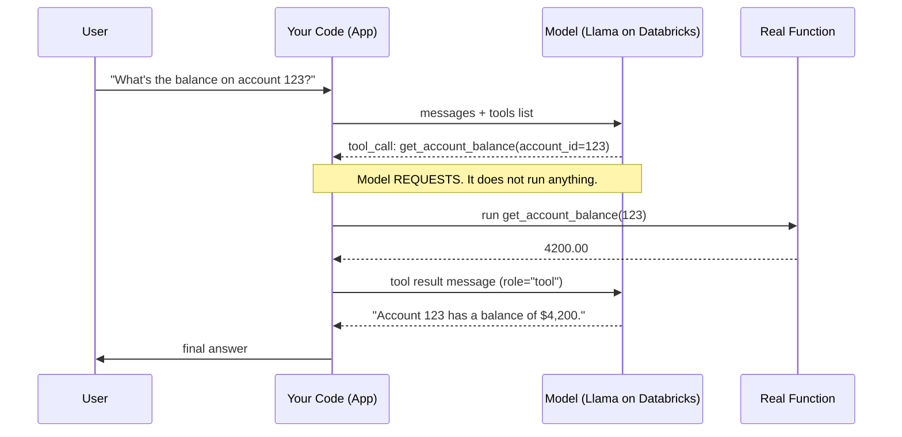
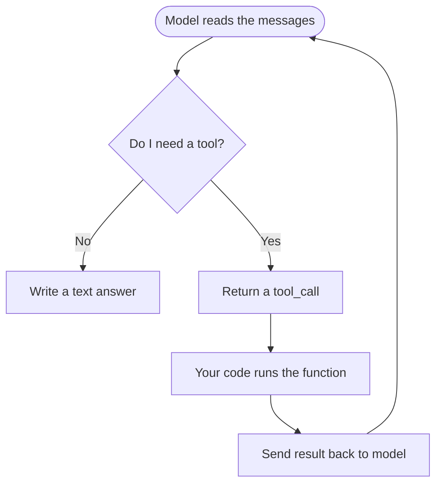

# How Function Calling Works

> You know how a good waiter never cooks your food? They take your order, carry it to the kitchen, and bring back the plate. A language model works the same way with tools. It decides what needs to happen, but it never touches the stove. Your code is the kitchen. Let's see exactly how that hand-off works.

Take a breath. This lesson sounds technical, but the core idea is something you already do every day: someone asks for something, you fill out a form, hand it to a helper, and get an answer back. By the end you'll understand the whole loop, and you'll have read a complete working example. You've got this.

## Learning Objectives

By the end of this lesson, you will be able to:

- Explain what "function calling" means in plain language.
- Describe the four steps of a tool-call round trip.
- Understand who does what: the model decides, your code acts.
- Define a tool for the model using a name, a description, and a JSON schema.
- Read a Databricks code example that completes one full round trip.
- Explain why your code, not the model, must check permissions before doing anything.

## Prerequisites

Before this lesson, it helps to have read:

- [What Is an AI Agent?](/docs/agents-tools-mcp/what-is-an-agent) — the big picture of agents.
- [Prompting Fundamentals](/docs/llm-foundations/prompting-fundamentals) — how you talk to a model.

If you've seen those, you're ready. If not, this lesson still stands on its own, so don't worry.

## Estimated Reading Time

About 20 minutes.

## Business Motivation

Let's start with why anyone bothers.

A language model on its own is like a very smart colleague locked in a room with no phone and no computer. They can reason, explain, and write beautifully. But they can't look up today's account balance. They can't query your data warehouse. They can't send an email.

For a data engineer, that limit is a big deal. Your value is in the data. A model that can't reach the data can only guess.

Function calling is the phone line into that room. It lets the model ask for real information and real actions, while your code stays firmly in control of what actually runs. That combination, smart reasoning plus safe access to your systems, is what turns a chatbot into something genuinely useful at work.

Here's a concrete picture. Imagine a support tool for a fictional bank, **Northwind Trust**. A customer asks, "What's the balance on account 123?" A plain model would have to make something up. A model with function calling can say, "I need to call `get_account_balance` for account 123," let your code fetch the real number, and then answer with the true balance. That's the difference between a demo and a product.

## Intuition

Let's build the mental model before any code.

Picture yourself at a help desk. You have a stack of **labeled request forms** on the counter. One form says "Look up account balance — fill in the account number." Another says "Reset password — fill in the username."

A helper sits across from you. This helper is clever but can't reach the filing cabinet. When a customer asks a question, the helper looks at your forms, picks the right one, and fills it in:

> "Please look up the balance for account 123."

The helper hands you that filled-in form. **You** walk to the cabinet, find the answer, and hand it back:

> "Account 123 has a balance of $4,200."

The helper reads that and gives the customer a friendly answer.

In this story:

- **The helper is the model.** It decides which form to use and what to write on it.
- **The forms are your tools.** Each one has a name and a list of blanks to fill in.
- **You are your code.** You do the actual looking-up. The helper never touches the cabinet.

That last point is the whole lesson. The model chooses; your code does. Keep that picture in your head and everything else is just detail.

## Theory

Now the slightly more formal version. Take it slowly; it's still the same idea.

Function calling works over a standard chat API. On Databricks, this is the OpenAI-compatible chat API, which means it follows the same shape many tools already use.

When you call the model, you can pass an extra list called `tools`. Each tool in that list has three parts:

1. A **name** — like `get_account_balance`.
2. A **description** — plain English telling the model what the tool does and when to use it.
3. A **parameters** schema — a JSON schema describing the inputs the tool needs, such as an `account_id`.

You send the user's message plus this `tools` list. Now the model has a choice. It can:

- Answer directly in text, like a normal reply. Or
- Respond with one or more **`tool_calls`** instead. Each tool call names a tool and gives the arguments as JSON, for example `get_account_balance` with `account_id` set to `123`.

That's the key move. When the model returns `tool_calls`, it is **not** giving you a final answer. It is saying, "please run this for me." The model cannot run anything itself. It only requests.

Your code then runs the real function, takes the result, and sends it back to the model as a new message with the role `"tool"`. You call the model again. Now, armed with the real data, the model writes its final answer, or asks for another tool if it needs more.

## Deep Dive

Let's zoom in on each of the four steps, because getting these clear now saves confusion later.

**Step 1 — You describe the tools.** Before any conversation, you tell the model what's available. You do this by building the `tools` list. Think of it as laying out your labeled forms on the counter. The model reads the descriptions to understand its options. Good descriptions matter a lot here; the model uses them to decide.

**Step 2 — The model decides.** You send the user's request along with the tools. The model reads everything and judges whether a tool would help. If the user asks a factual question the model can answer alone (like "what is an interest rate?"), it just replies. If the question needs live data (like "what's my balance?"), it returns a `tool_call` instead.

**Step 3 — Your code acts.** Your program looks at the requested tool name and arguments, checks that they're valid and allowed, and runs the matching Python function. This is where your real system does its work: a database query, an API call, a calculation. The model is waiting.

**Step 4 — The model continues.** You send the result back as a `"tool"` message and call the model again. The model reads the result and decides what's next. Usually it writes the final answer. Sometimes it needs another tool, and the loop repeats.

:::note Going deeper (optional)
The model can request **several** tool calls at once when a request needs multiple independent lookups. Your code runs each one and sends back one `"tool"` message per call, matched by a `tool_call_id`. You don't need this for your first agent, so feel free to skip it for now. Just know it exists.
:::

## Architecture

Here's the whole round trip in one picture. This is the loop that powers every agent you'll ever build.



*Figure 1: The full tool-call round trip. Notice the model bounces the request back to your code twice — once to ask for the tool, once to deliver the final answer.*

Let's also draw the simple decision the model makes each turn.



*Figure 2: The model's per-turn choice. Answer directly, or ask for a tool. When a tool runs, control comes right back to the model.*

## Internal Working

What's actually moving under the hood? Just messages. That's reassuring, because messages are simple.

A conversation is a list of messages, each with a role. You already know `"user"` and `"assistant"`. Function calling adds two things:

- When the model wants a tool, its assistant message carries a `tool_calls` field. Each entry has an `id`, the function `name`, and the `arguments` as a JSON string.
- Your reply is a message with role `"tool"`, and it references the same `tool_call_id` so the model knows which request it answers.

So the "magic" is really just a growing list of messages that you pass back in full on every call. The model has no memory of its own between calls; it re-reads the whole list each time. Your job is to keep that list accurate: append the model's tool request, then append your tool result, then ask again.

:::note Going deeper (optional)
The `arguments` come back as a JSON **string**, not a ready-made Python object, so your code parses it with something like `json.loads`. This matters because the model generated that string, which means it could occasionally be malformed or contain unexpected values. Always parse defensively. We'll come back to this in Security.
:::

## Step-by-Step Walkthrough

Let's follow one request through Northwind Trust, in words, before we look at code.

1. A user asks: "What's the balance on account 123?"
2. Your code sends that message plus a `tools` list containing `get_account_balance`.
3. The model reads it and thinks, "I can't know this myself; I'll use the tool." It returns a tool call: `get_account_balance` with `account_id` = `123`.
4. Your code sees the tool call. It checks the account id looks valid, confirms this user is allowed to see that account, then runs the real `get_account_balance(123)` function against the database. It gets back `4200.00`.
5. Your code appends the model's request message, then appends a `"tool"` message with the result `4200.00`.
6. Your code calls the model again with the updated message list.
7. The model reads the real number and writes: "Account 123 has a balance of $4,200."
8. Your code shows that answer to the user. Done.

Read that list twice. Every function-calling program you meet is a version of these eight steps.

## Hands-on Examples

Before the full code, let's warm up with a tiny thought exercise. No typing needed.

Suppose you defined two tools: `get_account_balance(account_id)` and `list_recent_transactions(account_id, days)`.

- User asks: "Hi, how are you?" → The model needs no tool. It just replies warmly.
- User asks: "What's my balance on 123?" → The model requests `get_account_balance` with `account_id` = `123`.
- User asks: "Show me the last 7 days of activity on 123." → The model requests `list_recent_transactions` with `account_id` = `123` and `days` = `7`.

See the pattern? The model matches the request to the best-fitting form and fills in the blanks. That's all "deciding" means here. Now let's make it real.

## Code Examples

We'll build one complete round trip on Databricks. We'll go one block at a time, and I'll explain each block right after it. Nothing here is as scary as it looks.

First, we connect to the model and define our real function.

```python
import json
from databricks.sdk import WorkspaceClient

# Get an OpenAI-compatible client from Databricks.
client = WorkspaceClient().serving_endpoints.get_open_ai_client()

MODEL = "databricks-meta-llama-3-3-70b-instruct"

# This is the REAL function. In production it would query a database.
# Here we fake it with a small lookup so the example runs on its own.
def get_account_balance(account_id: str) -> float:
    fake_balances = {"123": 4200.00, "456": 88.50}
    return fake_balances.get(account_id, 0.0)
```

Here we set up two things. `client` is our connection to the model, obtained the Databricks way with `WorkspaceClient().serving_endpoints.get_open_ai_client()`. And `get_account_balance` is the actual Python function that does real work. Notice this function is plain Python; the model has no idea how it's written. It only knows the name and inputs we advertise next.

Now we describe that function to the model as a tool.

```python
tools = [
    {
        "type": "function",
        "function": {
            "name": "get_account_balance",
            "description": "Get the current balance for a Northwind Trust account. "
                           "Use this whenever a user asks about their balance.",
            "parameters": {
                "type": "object",
                "properties": {
                    "account_id": {
                        "type": "string",
                        "description": "The account number, e.g. '123'.",
                    }
                },
                "required": ["account_id"],
            },
        },
    }
]
```

This is the labeled form. The `name` matches our Python function. The `description` tells the model when to reach for it. The `parameters` block is a JSON schema saying, "this tool needs one input, `account_id`, and it's a string, and it's required." The model reads all of this to decide whether and how to call the tool. Clear descriptions here directly improve the model's choices.

Now we start the conversation and make the first call.

```python
messages = [
    {"role": "user", "content": "What's the balance on account 123?"}
]

response = client.chat.completions.create(
    model=MODEL,
    messages=messages,
    tools=tools,
)

reply = response.choices[0].message
```

We send the user's question together with our `tools` list. This is step 2 from the walkthrough. The model now has a choice: answer in text, or ask for a tool. We grab its reply so we can inspect it next.

Let's check whether the model asked for a tool, and if so, run it.

```python
if reply.tool_calls:
    # The model wants a tool. Add its request to the conversation.
    messages.append(reply)

    for call in reply.tool_calls:
        args = json.loads(call.function.arguments)   # arguments arrive as JSON text
        account_id = args["account_id"]

        # --- SAFETY: your code checks before it acts ---
        if not account_id.isdigit():
            result = "Error: invalid account id."
        else:
            result = get_account_balance(account_id)  # run the REAL function

        # Send the result back as a "tool" message.
        messages.append({
            "role": "tool",
            "tool_call_id": call.id,
            "content": str(result),
        })
```

This is the heart of it. We check `reply.tool_calls`. If it's there, the model requested a tool instead of answering. We parse the JSON `arguments` into a Python dict, pull out `account_id`, and, crucially, **validate it before running anything**. Only then do we call the real `get_account_balance`. Finally we append a `"tool"` message carrying the result, tagged with the same `call.id` so the model can match it. Notice we appended two things to `messages`: the model's request and our answer.

Now we ask the model again, so it can use the result.

```python
    final = client.chat.completions.create(
        model=MODEL,
        messages=messages,   # now includes the tool result
    )
    print(final.choices[0].message.content)
    # -> "The balance on account 123 is $4,200.00."
else:
    # No tool needed; the model already answered.
    print(reply.content)
```

We call the model a second time with the fuller message list, the one that now contains the real balance. The model reads it and writes a proper, true answer. That's the round trip complete. And if the model hadn't wanted a tool at all, the `else` branch would simply print its direct reply. Take a moment to appreciate this: you just wired a model into a real system, safely.

## Production Considerations

A few things to think about once you move past a demo.

- **Loop, don't assume one call.** The model might ask for a tool, get the result, then ask for another. Wrap the "check for tool_calls, run, call again" logic in a loop that repeats until the model returns a plain text answer. Set a sensible maximum number of turns so it can't loop forever.
- **Register every tool your code can run.** The model can only request tools you put in the `tools` list, but your executor code must also know how to run each one. Keep the list of advertised tools and the map of runnable functions in sync.
- **Handle unknown tool names.** If the model somehow returns a tool name you don't recognize, return a clear error as the tool result rather than crashing. The model can recover from an error message.
- **Log the tool calls.** Recording which tool ran with which arguments is invaluable for debugging and audits.

## Performance Considerations

Function calling means more than one call to the model per user question. A single round trip is at least two model calls: one to get the tool request, one to get the final answer. Each call adds latency.

Keep this in mind:

- **Fewer tools, clearer descriptions.** A giant tool list makes each request larger and can slow the model's decision. Offer only the tools that fit the job.
- **Run independent tool calls together.** When the model requests several tools at once and they don't depend on each other, run them in parallel in your code rather than one after another.
- **Cap the turns.** Each extra loop is another model round trip. A turn limit protects both your latency and your budget.

## Security Considerations

This is the most important section, so read it carefully. It's also simple.

**The model can request anything. Your code decides what actually runs.**

Remember the mental model: the model is the helper who fills out forms; your code is the one with the keys to the cabinet. The model has no power of its own. So every safety check lives in **your** code, in the moment between receiving a tool call and executing it.

Concretely, before you run a function:

- **Validate the arguments.** The `arguments` are JSON text the model generated. Parse them safely and check types and ranges. In our example we confirmed `account_id.isdigit()` before touching the database. Never pass model-generated text straight into a query.
- **Enforce permissions.** Just because the model asked for account 123 does not mean the current user is allowed to see it. Check the logged-in user's rights yourself, every time. The model neither knows nor enforces who is allowed to do what.
- **Limit what tools can do.** Give each tool the narrowest possible power. A balance-lookup tool should be able to read one balance, not run arbitrary SQL.
- **Treat tool results as untrusted too.** If a tool returns data that came from users (like a name or a note), remember the model will read it. Don't let it smuggle in instructions you didn't intend.

If you take one thing from this whole lesson, take this: the model requests, your code enforces. That boundary is your safety net.

## Common Mistakes

Gentle warnings, all easy to avoid once you know them.

- **Forgetting the second model call.** After you run the tool, you must call the model again with the result. If you stop after running the function, you have the data but no answer for the user.
- **Not appending the model's request message.** You must add the assistant's `tool_calls` message to `messages` before adding your `"tool"` reply. Skip it and the model loses track of what it asked.
- **Mismatched `tool_call_id`.** The `"tool"` message must carry the same id as the request. Otherwise the model can't match answer to question.
- **Trusting the arguments blindly.** Running model-generated arguments without validation is the number one security slip. Always check first.
- **Assuming a tool will be called.** The model decides. Your code must handle the case where it just answers in text.
- **Tool name mismatch.** The `name` in your schema must exactly match how your executor looks up the function.

## Best Practices

- Write **clear, specific descriptions** for each tool. This is the single biggest lever on whether the model calls the right tool.
- Keep **one Python function per tool**, small and focused.
- **Validate and authorize** inside every function before doing real work.
- **Loop** until the model returns a text answer, with a turn cap.
- Start with **one or two tools**. Add more only as you need them.
- **Return helpful errors** as tool results so the model can adapt.
- **Log** every tool call and its arguments.

## Interview Questions

Try answering these out loud before reading the hint.

1. **In function calling, who runs the actual function code, the model or your application?**
   Your application. The model only requests a call by returning `tool_calls`; it cannot execute anything itself.

2. **What are the three parts of a tool definition you pass to the model?**
   A name, a plain-language description, and a JSON schema of its parameters.

3. **Walk me through one full tool-call round trip.**
   You send the user message plus tools; the model returns a tool call; your code validates and runs the real function; you append the result as a `"tool"` message; you call the model again; it produces the final answer.

4. **Why must security checks live in your code rather than in the model?**
   Because the model can request any tool with any arguments and has no power to enforce permissions. Only your code stands between the request and the real system, so validation and authorization must happen there.

5. **What role does the `tool_call_id` play?**
   It links your `"tool"` result message back to the specific tool call the model requested, so the model can match each answer to its question, which matters especially when several tools are called at once.

## Quiz

Test yourself. Answers are hidden; think first, then peek.

**Question 1:** When the model returns `tool_calls`, what has it actually done?

<details>
<summary>Show answer</summary>

It has **requested** that your code run one or more tools, giving the tool name and arguments. It has not run anything and has not produced a final answer yet.

</details>

**Question 2:** What role do you use for the message that carries a tool's result back to the model?

<details>
<summary>Show answer</summary>

The role `"tool"`. That message also includes the matching `tool_call_id`.

</details>

**Question 3:** Which Databricks client method gives you the OpenAI-compatible client, and which model id does the lesson use?

<details>
<summary>Show answer</summary>

`WorkspaceClient().serving_endpoints.get_open_ai_client()`, and the model id is `databricks-meta-llama-3-3-70b-instruct`.

</details>

**Question 4:** A user asks for account 999's balance, and the model dutifully requests `get_account_balance` for 999. Should your code just run it? Why or why not?

<details>
<summary>Show answer</summary>

No. First validate the argument, then check that the current user is actually authorized to see account 999. The model's request is not permission to act. Your code enforces the rules.

</details>

## Summary

Function calling is the mechanism that lets a language model use real tools. You describe your tools with a name, a description, and a JSON schema. The model reads a request and either answers directly or returns a structured `tool_call` asking your code to run a function. Your code validates the arguments, checks permissions, runs the real function, and sends the result back as a `"tool"` message. Then the model, now holding real data, writes the final answer. On Databricks you do all this through the OpenAI-compatible chat API using `get_open_ai_client()` and a model like `databricks-meta-llama-3-3-70b-instruct`. The golden rule: the model decides, your code acts.

## Key Takeaways

- Function calling connects a model to real data and actions.
- A tool is defined by a **name**, a **description**, and a **JSON schema** of inputs.
- The model returns `tool_calls` to **request** a function; it never runs code itself.
- Your code runs the function and returns the result as a `"tool"` message.
- One round trip is at least two model calls.
- **Security lives in your code**: validate arguments and enforce permissions before executing.
- The mental model to remember: **the model is the decision-maker, your code is the hands.**

## Glossary

- **Function calling** — the mechanism by which a model requests that your code run a named function with given arguments.
- **Tool** — a function you make available to the model, described by a name, description, and parameter schema.
- **JSON schema** — a structured description of what inputs a tool expects (types, which are required).
- **`tool_calls`** — the field in a model's reply listing the functions it wants run, with arguments as JSON.
- **`"tool"` message** — the message, tagged with a `tool_call_id`, that carries a function's result back to the model.
- **Round trip** — one full cycle: model requests a tool, your code runs it, the model produces a final answer.
- **`tool_call_id`** — an identifier linking a tool result to the specific request it answers.

## Further Reading

- [Databricks documentation](https://docs.databricks.com/aws/en/) — the official docs for Databricks features and APIs.

## Next Lesson

You now understand the mechanism. Next, let's see the cleanest way to create real tools on Databricks without writing all the plumbing yourself.

➡️ [Tools from Unity Catalog Functions](/docs/agents-tools-mcp/unity-catalog-tools)
