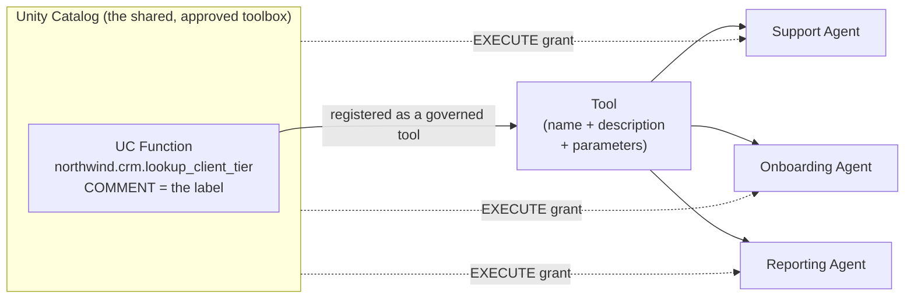
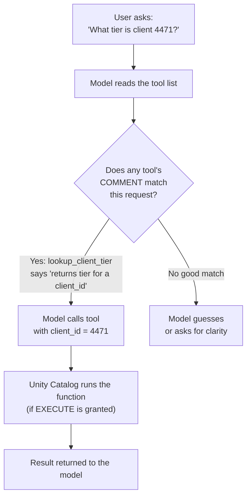
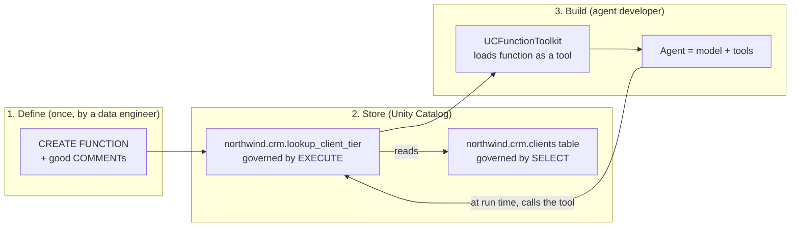

# Tools from Unity Catalog Functions

> Write the tool once. Govern it like a table. Let every agent borrow it.

Picture the toolbox in a good workshop.

There is one shared cabinet on the wall. Every tool inside has a label, so you know what it does before you pick it up. There is a sign-out sheet, so you know who used what and when. And a few tools — the dangerous ones — are locked, and only certain people hold the key.

Now picture the opposite: every worker forging their own tools in secret, at their own bench, with no labels and no lock. Two people build the same wrench. One builds a saw with no guard. Nobody can tell who used what. That is chaos.

That second picture is what happens when every agent app hand-writes its own tool functions in code. This lesson shows you the shared, approved toolbox instead — and the good news is, you already run one. It is called Unity Catalog.

Take a breath. You have governed tables and permissions for years. We are about to govern *actions* the exact same way. This will feel familiar fast.

## Learning Objectives

By the end of this lesson, you will be able to:

- Explain what it means to define an agent tool as a Unity Catalog (UC) function instead of hand-writing it in app code.
- Write a UC function with a clear `COMMENT` and describe why that comment is really the tool's instructions to the model.
- Grant and reason about `EXECUTE` permission so the right agents (and only them) can run a tool.
- Load UC functions as agent tools in Python with `UCFunctionToolkit` and pass them to a model.
- Describe why UC function tools are reusable, shareable, versioned, and audited — and when to prefer them.

## Prerequisites

This lesson builds directly on one earlier idea. If it feels shaky, a quick review will make everything here click:

- [How Function Calling Works](/docs/agents-tools-mcp/function-calling) — how a model decides to call a tool, and what a "tool" looks like to the model.

It also helps to be comfortable with two things you already know as a Data Engineer:

- Unity Catalog basics — catalogs, schemas, and `GRANT` statements.
- Writing a simple SQL or Python function.

You do not need any prior AI-building experience. If you have ever written `CREATE FUNCTION` and `GRANT SELECT`, you have the exact muscles this lesson uses.

## Estimated Reading Time

About 18 to 22 minutes, plus a little more if you try the hands-on examples.

## Business Motivation

Let us start with why anyone at your firm would care.

Imagine a fictional bank, **Northwind Trust**. Northwind is building several AI agents:

- A support agent that answers client questions.
- An onboarding agent that helps new advisors.
- A reporting agent that drafts account summaries.

All three need the same small action: "given a client ID, look up that client's service tier (Standard, Premium, or Private)." That is a tiny lookup against a governed table.

Without a shared toolbox, each team writes that lookup by hand, inside their own app. Now Northwind has three copies of the same logic. When the tier rules change, someone has to remember all three. One team forgets. One team accidentally lets the tool read a column it should not. Nobody can prove, during an audit, who ran the lookup and when.

Here is the business case in one line: **a tool is a piece of business logic, and business logic deserves the same governance as your data.** Northwind already trusts Unity Catalog to say who can read which table. If the *tool* lives in Unity Catalog too, then:

- **Write once, reuse everywhere.** All three agents point at the same function. Fix it in one place.
- **Governed access.** `EXECUTE` permission decides who — or which agent — may run the tool. Same model as `SELECT` on a table.
- **Auditable.** Unity Catalog records usage, so compliance can answer "who ran this?"
- **Versioned and discoverable.** The function has a name, a home, and a history. People can find it instead of rebuilding it.

That is the whole pitch. Governance you already trust, now covering actions, not just data.

## Intuition

Let us make the mental picture concrete before any code.

A **tool**, from the model's point of view, is just "a thing I can call, with a name, a description, and some inputs." In the previous lesson, that thing was a function written inside the app. That works, but it lives *inside one app*. Nobody else can see it. Nobody governs it.

A **Unity Catalog function** is a function that lives in your data platform, right next to your tables. It has a full name like `catalog.schema.function_name`. You already know functions like this — you may have written SQL UDFs for years.

The insight of this lesson is that these two ideas are the same thing. A UC function *is* a tool. You just have to register it so an agent can see it.



*Figure 1: One Unity Catalog function is registered once as a governed tool, and many different agents reuse it. The `EXECUTE` grant is the lock that decides who may borrow each tool.*

Notice the shape. The function is defined **once**. Three different agents **share** it. And a dotted `EXECUTE` grant controls access — that is the sign-out sheet and the lock, together.

One more piece of intuition, and it is the most important one in the whole lesson: **the function's `COMMENT` is the label on the tool.** The model does not read your function's body. It reads the comment and the parameter descriptions to decide *when* to reach for this tool and *how* to fill in the inputs. A clear comment is a well-labeled tool. A vague comment is a mystery tool the model will use wrong. We will come back to this again — it matters that much.

## Theory

Now the slightly more formal version. Nothing here is scary; it is mostly names for things you just saw.

**What a UC function tool is.** A Unity Catalog function is a user-defined function (UDF) stored in Unity Catalog. Its body can be SQL or Python. Once defined, an agent framework can turn it into a tool the model can call. When the model calls it, Databricks runs the function and hands the result back to the model.

**Three parts the model actually sees:**

1. **The name** — the fully qualified function name, like `northwind.crm.lookup_client_tier`.
2. **The description** — the function-level `COMMENT`. This tells the model what the tool is for.
3. **The parameters** — each parameter's name, type, and its own `COMMENT`. This tells the model what to pass in.

The model never sees the function body. This is a feature, not a limitation. You can change *how* the tool works without changing what the model understands about it, as long as the comments stay accurate.

**Governance by `EXECUTE`.** Running a UC function requires the `EXECUTE` privilege, exactly the way reading a table requires `SELECT`. So the question "which agent can use this tool?" becomes a normal Unity Catalog grant. No new permission system to learn.

**Reusable, versioned, audited.** Because the function lives in Unity Catalog:

- Many agents can point at the same function (reusable and shareable).
- Changes are tracked and the object has a history (versioned).
- Usage is recorded (audited).

:::note Going deeper (optional)
Under the hood, when a UC function is exposed to an agent, the framework generates a machine-readable tool schema (a JSON description of the name, description, and parameter types) from the function's metadata. That schema is what gets sent to the model alongside your prompt. If you have read the function-calling lesson, this is the same tool schema you saw there — it is just being generated from Unity Catalog metadata instead of hand-written in Python. You do not need to write that JSON yourself; the toolkit does it for you.
:::

## Deep Dive

Let us slow down on the one idea that trips beginners up the most: **why the `COMMENT` is so powerful.**

When a model is deciding what to do, it is given a list of tools. For each tool it sees roughly this:

- Tool name: `lookup_client_tier`
- What it does: *(your COMMENT goes here)*
- Inputs it needs: `client_id` — *(your parameter COMMENT goes here)*

That is all the model has. It cannot open the function and read the SQL. So it makes its decision — "should I call this? what do I pass?" — purely from those words.

Compare two versions of the same tool.

**A weak comment:**

- `COMMENT 'gets tier'`

The model has to guess. Tier of what? A client? A product? What do I pass in — a name, a number, an email? It may call the tool at the wrong time, or pass the wrong thing.

**A strong comment:**

- `COMMENT 'Returns the service tier (Standard, Premium, or Private) for a Northwind Trust client, given their numeric client_id. Use this when a user asks about a specific client''s tier or eligibility.'`

Now the model knows exactly what the tool returns, what to pass, and *when* to use it. That last part — "use this when..." — is gold. It steers the model toward calling the tool at the right moment.

Here is the reframe for a Data Engineer: **you are used to comments being optional documentation for humans.** For an agent tool, the comment is not optional and it is not just for humans. It is a functional part of the tool. Writing a bad comment is like shipping code with a bug. Writing a great comment is part of the engineering.



*Figure 2: The model chooses a tool by matching the request against each tool's `COMMENT`. A clear comment leads straight to the right call; a vague one leads to guessing.*

## Architecture

Here is how the pieces sit together at Northwind Trust, end to end.



*Figure 3: The lifecycle. A data engineer defines the function once (1). Unity Catalog stores and governs it (2). An agent developer loads it as a tool and gives it to a model (3). At run time the agent calls back into the governed function.*

The clean separation is the point:

- **Data engineers** own step 1 and 2 — the function and its governance. This is your home turf.
- **Agent developers** own step 3 — wiring the tool into an agent.
- The two roles meet at the Unity Catalog function, which is the shared, approved contract between them.

## Internal Working

Let us trace exactly what happens when the support agent answers "What tier is client 4471?"

1. **Startup.** The agent app calls `UCFunctionToolkit` and names the functions it wants, like `northwind.crm.lookup_client_tier`. The toolkit reads that function's metadata from Unity Catalog and builds a tool schema (name, the `COMMENT` as description, and each parameter with its `COMMENT`).
2. **Prompt time.** The user's question and the tool schema are sent to the model together.
3. **Decision.** The model reads the tool descriptions, sees that `lookup_client_tier` matches, and emits a request to call it with `client_id = 4471`. (The model does not run anything itself — it just says "please call this.")
4. **Permission check.** The framework asks Unity Catalog to run the function. Unity Catalog checks that the identity running it has `EXECUTE` on the function (and the function's owner has access to the underlying `clients` table). No grant, no run.
5. **Execution.** Unity Catalog runs the function body, which reads the `clients` table and returns, say, `"Premium"`.
6. **Back to the model.** The result `"Premium"` is handed back to the model, which turns it into a friendly sentence for the user.
7. **Audit.** Unity Catalog records that the function ran.

Notice steps 4 and 7. Those are free, and you did not write a line of extra code for them. That is the whole reason to put the tool in Unity Catalog.

## Step-by-Step Walkthrough

Here is the recipe you will follow for any UC function tool. We will fill in real code in the next sections.

1. **Decide the action.** One tool, one clear job. "Look up a client's tier." Keep it narrow.
2. **Write the function.** SQL or Python body. Add a strong function `COMMENT` and a `COMMENT` on every parameter.
3. **Grant `EXECUTE`.** Give the agent's identity permission to run it — and nothing more than it needs.
4. **Load it as a tool.** Use `UCFunctionToolkit` in Python, naming the function.
5. **Give it to the model.** Pass the toolkit's tools into your agent.
6. **Test the comment, not just the code.** Ask the agent questions and check it calls the tool at the right moments. If it does not, the comment usually needs work.

Keep that list nearby. Every example below is just one of these steps in detail.

## Hands-on Examples

If you want to follow along, you will need a Databricks workspace where you can create Unity Catalog functions, and a notebook. If you cannot run these right now, reading them still teaches the pattern — the code is short on purpose.

For all examples we use the fictional catalog and schema `northwind.crm`, with a `clients` table that has at least `client_id` and `tier` columns.

## Code Examples

### Example 1 — A SQL Unity Catalog function

Let us build the client-tier lookup as a SQL function.

```sql
CREATE OR REPLACE FUNCTION northwind.crm.lookup_client_tier(
  client_id INT COMMENT 'The numeric ID of the Northwind Trust client to look up, e.g. 4471.'
)
RETURNS STRING
COMMENT 'Returns the service tier (Standard, Premium, or Private) for a Northwind Trust client, given their numeric client_id. Use this when a user asks about a specific client''s tier, level, or eligibility.'
RETURN
  SELECT tier
  FROM northwind.crm.clients
  WHERE clients.client_id = lookup_client_tier.client_id;
```

Let us read this together, line by line:

- `CREATE OR REPLACE FUNCTION northwind.crm.lookup_client_tier(...)` — we create the function with a fully qualified name, so it lives in a known home in Unity Catalog. `OR REPLACE` lets us update it later.
- `client_id INT COMMENT '...'` — one input parameter, typed as `INT`, with its own comment. That comment tells the model what to pass. Notice it even gives an example value.
- `RETURNS STRING` — the model will get back a string, the tier.
- `COMMENT '...'` — this is the star of the show. It says what the tool returns *and* when to use it. This is the tool's instruction to the model. (The doubled `''` inside is just how SQL escapes a single quote in `client''s`.)
- `RETURN SELECT ...` — the body. It reads the governed `clients` table. The model never sees this part.

That is a complete, governed agent tool. No app code yet — this lives in your data platform.

### Example 2 — A Python Unity Catalog function

Some logic is easier in Python. Here is the same idea, expressed as a Python UC function, plus a small bit of computation to show why you might reach for Python.

```python
from unitycatalog.ai.core.databricks import DatabricksFunctionClient

client = DatabricksFunctionClient()

def lookup_client_tier_py(client_id: int) -> str:
    """
    Returns the service tier for a Northwind Trust client.

    Use this when a user asks about a specific client's tier,
    level, or eligibility. Tiers are: Standard, Premium, Private.

    Args:
        client_id: The numeric ID of the client to look up, e.g. 4471.
    """
    from databricks.sdk import WorkspaceClient
    w = WorkspaceClient()
    rows = w.statement_execution.execute_statement(
        statement=f"SELECT tier FROM northwind.crm.clients "
                  f"WHERE client_id = {int(client_id)}",
        warehouse_id="YOUR_WAREHOUSE_ID",
    )
    data = rows.result.data_array if rows.result else None
    return data[0][0] if data else "Unknown"

# Register the Python function as a UC function (a governed tool)
client.create_python_function(
    func=lookup_client_tier_py,
    catalog="northwind",
    schema="crm",
    replace=True,
)
```

Walking through it:

- We create a `DatabricksFunctionClient`. This is the object that registers Python functions into Unity Catalog.
- `def lookup_client_tier_py(client_id: int) -> str:` — note the **type hints**. Databricks requires them; they become the parameter and return types the model sees.
- The **docstring** plays the same role the SQL `COMMENT` did. It is the tool's description and its parameter notes. Write it as carefully as you would the SQL comment — it is what steers the model.
- Imports go **inside** the function body (`from databricks.sdk import WorkspaceClient`). This is a UC Python function rule: the function must be self-contained.
- `int(client_id)` — a small safety habit. We coerce the input rather than trust it blindly. More on safety in Security Considerations.
- `client.create_python_function(...)` — this registers the Python function into `northwind.crm` as a governed UC function, exactly like the SQL one. `replace=True` updates it if it already exists.

Now you have the same tool, written in Python, living in the same governed toolbox.

:::note Going deeper (optional)
Which should you pick, SQL or Python? Rule of thumb: if the logic is "read from a table with a query," SQL is simplest and fastest. If you need branching, string manipulation, date math, or a small algorithm, Python is friendlier. Both end up as the same kind of governed UC function tool, so the choice is about comfort, not capability. Avoid `*args`/`**kwargs` in Python UC functions — the tool schema needs concrete, named parameters.
:::

### Example 3 — Loading UC functions as agent tools

Now the agent developer's step. We load the function as a tool and hand it to a model.

```python
from databricks_langchain import UCFunctionToolkit, ChatDatabricks
from langgraph.prebuilt import create_react_agent

# 1. Load one or more UC functions as governed tools
toolkit = UCFunctionToolkit(
    function_names=[
        "northwind.crm.lookup_client_tier",
        # add more functions here — the same toolbox, more tools
    ]
)
tools = toolkit.tools  # ready-to-use tool objects

# 2. Pick a model hosted on Databricks
llm = ChatDatabricks(endpoint="databricks-meta-llama-3-3-70b-instruct")

# 3. Build an agent = model + tools
agent = create_react_agent(model=llm, tools=tools)

# 4. Ask it something
result = agent.invoke(
    {"messages": [{"role": "user",
                   "content": "What service tier is client 4471 on?"}]}
)
print(result["messages"][-1].content)
```

Step by step:

- `UCFunctionToolkit(function_names=[...])` — we name the UC functions we want. The toolkit reads their metadata from Unity Catalog and builds the tool schemas for us. This is where the `COMMENT`s become the descriptions the model sees.
- `tools = toolkit.tools` — a plain list of tool objects, ready to pass to an agent.
- `ChatDatabricks(endpoint=...)` — the model that will do the reasoning. It lives on a Databricks model serving endpoint.
- `create_react_agent(model=llm, tools=tools)` — this wires the model and tools into an agent that can call tools in a loop. (This is one common pattern; your framework may differ. The key line is that `tools` came from Unity Catalog.)
- `agent.invoke(...)` — we ask a question. Behind the scenes: the model reads the tool's comment, decides to call `lookup_client_tier`, Unity Catalog checks `EXECUTE` and runs it, and the answer flows back.

That is the full loop. Notice that the agent developer wrote no lookup logic at all. They borrowed a tool from the shared toolbox.

:::note Going deeper (optional)
Databricks also offers a **managed MCP endpoint** for UC functions, at a URL shaped like `https://&lt;workspace-hostname&gt;/api/2.0/mcp/functions/{catalog}/{schema}`. Point an MCP-aware agent at it and every function in that schema becomes discoverable as a tool automatically, with authentication handled for you. We cover MCP in a later lesson — for now, just know this path exists and is the recommended way to expose whole schemas of tools. The `UCFunctionToolkit` shown above is the direct-in-Python alternative.
:::

## Production Considerations

A few things to get right before an agent tool goes live at a place like Northwind Trust.

- **One tool, one job.** Narrow functions are easier for the model to choose correctly and easier to govern. Resist the urge to build a do-everything function.
- **Own the function with a service identity.** In production, the agent usually runs as a service principal, not as you. Make sure *that* identity has the grants it needs, and that the function owner can read the underlying tables.
- **Serverless compute.** Running UC functions as tools in production typically requires serverless compute (Spark Connect serverless) to be enabled in the workspace. Check this early so it does not surprise you at deploy time.
- **Version deliberately.** `CREATE OR REPLACE` changes the tool for every agent using it at once. Treat a comment change like a code change — review it, because it changes model behavior.
- **Return small, clean results.** The result goes back into the model's limited context window. Return the tier string, not the client's entire row.

## Performance Considerations

- **Every tool call is a round trip.** The model calls the tool, waits for the result, then continues. A slow function means a slow agent. Make the underlying query fast — index or optimize the `clients` table as you normally would.
- **Fewer tools, clearer choices.** Handing the model 40 tools makes its choice harder and its prompt bigger. Expose the tools an agent actually needs. This is both a performance and an accuracy win.
- **Watch the result size.** Large returns cost tokens and can crowd out the conversation. Filter and aggregate inside the function.
- **Reuse pays off.** Because the function is defined once and cached as metadata, the toolkit does not rebuild the tool schema on every request. Shared functions are cheap to reuse across agents.

## Security Considerations

This is where the shared, approved toolbox really earns its keep. As a Data Engineer, this section should feel like home.

- **`EXECUTE` is the lock.** An agent can only run a UC function if its identity has `EXECUTE` on it. Grant it explicitly:

```sql
GRANT EXECUTE ON FUNCTION northwind.crm.lookup_client_tier
TO `northwind-support-agent`;
```

  Read that as: "the support agent may borrow this one tool." Same shape as `GRANT SELECT` on a table.

- **Least privilege, always.** Grant `EXECUTE` on the specific functions an agent needs — never blanket-grant a whole schema of tools to every agent. Give each agent the smallest toolbox that does its job.
- **Be very careful with destructive tools.** A read-only lookup like `lookup_client_tier` is low risk. A function that *writes*, *deletes*, or *sends money* is a power tool with no guard. Do not casually expose those to an agent. If you must, restrict `EXECUTE` tightly, add confirmation steps, and consider whether an agent should be allowed to do it at all.
- **Do not trust the model's inputs blindly.** The model fills in the parameters, and it can be wrong or be manipulated by a user's prompt. Validate and coerce inside the function (recall the `int(client_id)` in Example 2), and never build unsafe dynamic SQL from raw model input.
- **Audit is your friend.** Unity Catalog records who ran what. When compliance asks "did any agent look up this client?", you can answer. Keep that trail.

## Common Mistakes

- **Vague comments.** `COMMENT 'gets data'` gives the model nothing to work with. This is the number one cause of an agent calling the wrong tool or the right tool at the wrong time. Write comments that say *what it returns* and *when to use it*.
- **No parameter comments.** The model has to guess what to pass. Comment every parameter, ideally with an example value.
- **Over-granting `EXECUTE`.** Handing every agent access to every function defeats the governance you came here for. Least privilege.
- **Exposing destructive functions casually.** A delete-or-transfer tool in a chatty agent is a real risk. Treat it as one.
- **Giant, do-everything functions.** One function that "does client stuff" confuses the model. Split into small, single-purpose tools.
- **Returning huge results.** Dumping a whole table into the model's context wastes tokens and can degrade answers. Return only what is needed.
- **Forgetting type hints (Python).** Databricks needs them to build the tool schema. Missing hints means the tool will not register correctly.

## Best Practices

- **Treat the `COMMENT` as production code.** Review it. It changes model behavior as much as the body does.
- **Name functions like actions.** `lookup_client_tier`, `calculate_late_fee`, `find_open_tickets`. A good name is half the description.
- **Keep each tool narrow and read-only when you can.** Read tools are safe to share widely; write tools deserve extra scrutiny.
- **Grant `EXECUTE` per agent, least privilege.** Match the toolbox to the job.
- **Define once, reuse across agents.** If two agents need the same action, they should share one function, not copy it.
- **Test by talking to the agent.** Ask it real questions and confirm it reaches for the tool at the right moments. If it does not, fix the comment first.
- **Use serverless and a service principal in production**, and confirm grants for that identity, not just for yourself.

## Interview Questions

**1. Why would you define an agent tool as a Unity Catalog function instead of writing it directly in your application code?**
Because it makes the tool governed, reusable, versioned, and auditable. `EXECUTE` permission controls who can run it (same model as `SELECT` on tables), many agents can share one definition, changes are tracked, and Unity Catalog records usage. Hand-written app tools are private to one app and have none of that governance.

**2. What exactly does the model see about a UC function tool, and why does the `COMMENT` matter so much?**
The model sees the function name, the function-level `COMMENT` as the description, and each parameter's name, type, and `COMMENT`. It does not see the body. So it decides whether and how to call the tool purely from those comments. A vague comment leads to wrong or mistimed calls; a clear one that states what the tool returns and when to use it steers the model correctly.

**3. How is access to a UC function tool controlled?**
Through the `EXECUTE` privilege in Unity Catalog, granted to the agent's identity (often a service principal). It is the same permission model as `SELECT` on a table. Best practice is least privilege — grant `EXECUTE` only on the specific functions an agent needs.

**4. How do you load a UC function as a tool for an agent in Python?**
Use `UCFunctionToolkit(function_names=[...])` from `databricks-langchain`, take its `.tools`, and pass that list into your agent (for example, into `create_react_agent` alongside a `ChatDatabricks` model). The toolkit reads the function metadata and builds the tool schema automatically.

**5. What are the security risks of exposing UC functions as tools, and how do you mitigate them?**
The main risks are over-granting `EXECUTE`, exposing destructive (write/delete/transfer) functions, and trusting model-supplied inputs. Mitigate with least-privilege grants, keeping shared tools read-only, validating and coercing inputs inside the function, avoiding unsafe dynamic SQL, restricting or avoiding destructive tools, and relying on Unity Catalog's audit trail.

## Quiz

**Question 1:** When a model decides whether to call `lookup_client_tier`, what information about the function does it actually read?

<details>
<summary>Show answer</summary>

The function's name, its `COMMENT` (the description), and each parameter's name, type, and `COMMENT`. It does **not** read the function body. This is why the comments must clearly state what the tool does and when to use it.

</details>

**Question 2:** Northwind wants only its support agent to run `lookup_client_tier`. What is the right way to allow that?

<details>
<summary>Show answer</summary>

Grant the `EXECUTE` privilege on that specific function to the support agent's identity:

`GRANT EXECUTE ON FUNCTION northwind.crm.lookup_client_tier TO \`northwind-support-agent\`;`

This is least privilege — the specific tool, the specific agent — and mirrors granting `SELECT` on a table.

</details>

**Question 3:** True or false: writing the tool as a UC function means each agent team still has to copy the lookup logic into their own app.

<details>
<summary>Show answer</summary>

**False.** That is the whole point of the shared toolbox. The function is defined once in Unity Catalog, and every agent loads the same function as a tool. Fix it in one place and all agents get the fix.

</details>

**Question 4:** An agent keeps calling a tool at the wrong time. The code works fine. What should you check first?

<details>
<summary>Show answer</summary>

The `COMMENT` (and parameter comments). The model chooses tools based on those descriptions, not the body. A vague or misleading comment is the most common cause of wrong or mistimed calls. Rewrite it to say clearly what the tool returns and when to use it.

</details>

## Summary

A Unity Catalog function *is* an agent tool. Instead of hand-writing tool logic inside every app, you define the action once as a UC function — SQL or Python — with a clear `COMMENT`, grant `EXECUTE` to the agents that should use it, and load it with `UCFunctionToolkit`. Because the tool lives in Unity Catalog, it inherits the governance you already trust for tables: permissions, versioning, sharing, and audit. The single most important habit is writing strong comments, because the comment is the tool's instruction to the model. Think of it as one shared, approved toolbox with a lock and a sign-out sheet, instead of everyone forging tools in secret.

## Key Takeaways

- A UC function can be exposed to an agent as a **governed tool** — no separate tool code needed.
- The model reads the **name, `COMMENT`, and parameter comments** — not the body. Write those comments as carefully as code.
- **`EXECUTE`** permission controls who/what can run a tool, exactly like `SELECT` on a table. Use least privilege.
- Tools are **reusable, shareable, versioned, and audited** because they live in Unity Catalog.
- Load them in Python with **`UCFunctionToolkit`** and pass `.tools` to your agent.
- Keep tools **narrow and read-only** when you can; treat destructive tools with real caution.

## Glossary

- **Unity Catalog (UC):** Databricks' governance layer for data and AI assets — catalogs, schemas, tables, functions, permissions, and audit.
- **UC function (UDF):** A user-defined function stored in Unity Catalog, with a SQL or Python body, addressable as `catalog.schema.name`.
- **Tool:** Something a model can call, defined by a name, a description, and parameters. A UC function becomes one.
- **`COMMENT`:** The description text on a function or parameter. For an agent tool, it is the model's instruction on what the tool does and when to use it.
- **`EXECUTE`:** The Unity Catalog privilege that lets an identity run a function. The lock on each tool.
- **`UCFunctionToolkit`:** A Python class (from `databricks-langchain` / `unitycatalog-ai`) that loads UC functions as ready-to-use agent tools.
- **Service principal:** A non-human identity an agent runs as in production. Grants should target this, not your personal account.
- **Tool schema:** The machine-readable description (name, description, parameter types) the framework generates from function metadata and sends to the model.
- **Managed MCP endpoint:** A Databricks-provided URL that exposes all functions in a schema as discoverable tools with built-in authentication.

## Further Reading

- [Create a custom agent tool with Unity Catalog functions](https://docs.databricks.com/aws/en/generative-ai/agent-framework/create-custom-tool)

## Next Lesson

You now know how to turn a governed function into a reusable tool. Next, we look at tools whose job is to *fetch information* — pulling back documents and structured data for the model to reason over.

➡️ [Retrieval Tools: Documents and Data](/docs/agents-tools-mcp/retrieval-tools)
