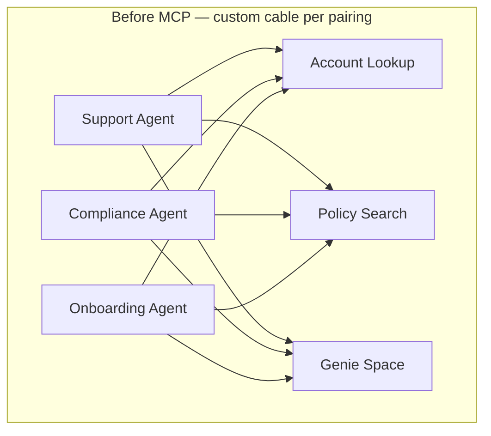
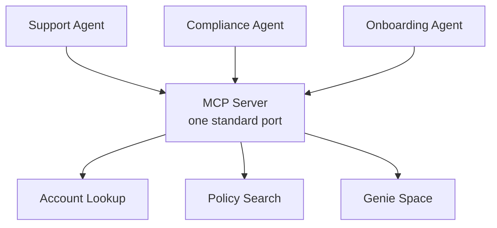
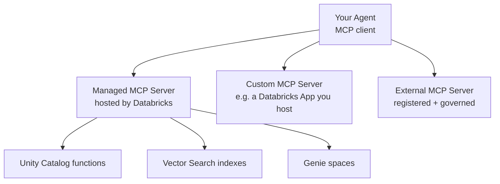
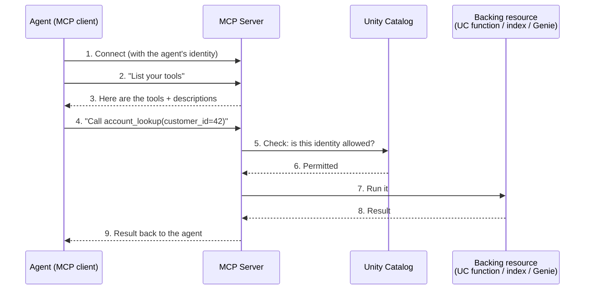

# MCP: A Universal Plug for Tools

> Imagine your desk five years ago. One cable for the phone, another for the camera, a fat one for the printer, a round one for the mouse. Every device came with its own plug, and you kept a drawer full of tangled cords "just in case." Then USB-C arrived — one shape, one port, everything just fits. MCP is that same idea, but for connecting AI agents to your tools and data.

You already know how agents call tools. You have seen function calling, and you have wired an agent to a Unity Catalog function or a retrieval tool. This lesson answers the next natural question: what happens when you have *many* agents and *many* tools, and you do not want to rewire everything by hand every time?

Take a breath. This is a friendly, standards-based idea, and by the end of this lesson it will feel obvious. No new math, no scary theory. Just a better plug.

## Learning Objectives

By the end of this lesson, you will be able to:

- Explain, in plain words, what the Model Context Protocol (MCP) is and the one problem it solves.
- Describe the two roles in MCP: an **MCP server** (which offers tools) and an **MCP client** (an agent that uses them).
- Recognize what Databricks **managed MCP servers** expose — Unity Catalog functions, Vector Search indexes, and Genie spaces — with no custom glue code.
- Understand at a high level how an agent connects to an MCP server, discovers its tools, and calls one.
- Know when to use a managed server, host your own **custom MCP server**, or register an **external** one.
- Explain why MCP tools stay governed by Unity Catalog.

## Prerequisites

Before this lesson, it helps to have read:

- [How Function Calling Works](/docs/agents-tools-mcp/function-calling) — how a model decides to call a tool and reads the result back.
- [Retrieval Tools](/docs/agents-tools-mcp/retrieval-tools) — how agents fetch structured and unstructured data as tools.

If those two feel comfortable, you are more than ready. If not, that is fine too — this lesson stands on its own and reminds you of the key ideas as they come up.

## Estimated Reading Time

About 20 to 25 minutes, plus a few minutes to skim the code examples. There is nothing to install. Read gently; you do not need to memorize anything.

## Business Motivation

Let's start with why anyone bothered to invent MCP.

Picture a company — we'll call it **Northwind Trust**, a mid-sized financial services firm. Their data engineering team (that's people like you) built some genuinely useful tools:

- A Unity Catalog function that looks up a customer's account status.
- A Vector Search index over the policy handbook.
- A Genie space that answers questions about the transactions table in plain English.

Now the business wants agents. Lots of them:

- A **support agent** for the call center.
- A **compliance agent** that checks policy questions.
- An **onboarding agent** for new clients.

Here is the trap. Without a standard, each agent needs *custom code* to reach each tool. Three agents times three tools is nine little integrations to write, test, and maintain. Add a fourth tool and a fourth agent, and the mess grows faster than you'd like. Every team reinvents the same wiring. When a tool changes, you hunt down every agent that used it.

That tangle is expensive, slow, and fragile. It is exactly the "drawer full of cables" problem — just in software.

MCP fixes this by agreeing on **one standard shape**. Build a tool once, expose it through MCP, and *any* agent that speaks MCP can discover and use it — the same way, every time. Northwind Trust wires up its governed toolset once and reuses it across all its agents. That is the payoff: less glue code, faster delivery, one place to govern.

## Intuition

Here is the whole idea in one picture. Before a universal standard, connecting agents to tools looks like a tangle. After, it looks like one clean port.



*Diagram 1: Before MCP. Every agent needs its own custom wiring to every tool. Three agents and three tools already means nine integrations — a tangle that grows fast.*



*Diagram 2: After MCP. Every agent connects the same way, through one standard port. The MCP server offers the tools; the agents just plug in. Add a tool once and every agent can use it.*

That's it. MCP is a **universal plug** for AI tools. Think USB-C: one shape instead of a custom cable per device. You do not need to know the deep protocol details to benefit from it, just like you do not need to understand USB-C's wiring to charge your laptop.

## Theory

Let's put a few words on the idea so the rest of the lesson is easy to follow. Nothing here is complicated.

**MCP** stands for **Model Context Protocol**. It is an **open standard** — a shared, published agreement — for how AI agents connect to tools and data. "Open" means no single vendor owns it; anyone can build tools or agents that speak it, and they interoperate. That is the same reason USB works across brands.

There are two roles:

- **MCP server** — the thing that *offers* tools. It says, in effect, "here are the tools I have, here is what each one does, and here is how to call it."
- **MCP client** — usually an *agent*. It connects to a server, asks "what tools do you have?", and then calls the ones it needs.

The magic word is **discovery**. Because every MCP server describes its tools in the same standard way, a client can ask for the list and understand it without any custom code written ahead of time. This is different from plain function calling, where *you* hand the model a fixed list of tool definitions you wrote yourself. With MCP, the server publishes that list, and the agent picks it up.

:::note Going deeper (optional)
Under the hood, MCP defines a small set of message types over a transport (such as HTTP). A client and server exchange structured messages like "list your tools" and "call this tool with these arguments," and the server replies with results. It also has room for other things like resources and prompts. You do **not** need any of this to use MCP on Databricks — the platform and the client libraries handle it. Come back to it only if you ever build a server from scratch.
:::

## Deep Dive

Now the part that makes MCP genuinely useful on Databricks: you mostly do not build the servers yourself.

Databricks provides **managed MCP servers**. These are servers that Databricks hosts and runs for you. They automatically expose resources you already have as MCP tools — with no custom glue code. Out of the box, the managed servers cover:

- **Unity Catalog functions** — your SQL and Python functions registered in Unity Catalog become callable tools.
- **Vector Search indexes** (also called AI Search) — your indexes become retrieval tools an agent can query.
- **Genie spaces** — a Genie space, which answers natural-language questions over your tables, becomes a tool.

So the tools you built in earlier lessons? They can be exposed through MCP without you writing a server. That is the "no glue" promise.

You have two more options when the managed servers are not enough:

- **Host your own custom MCP server.** If you have logic that isn't a Unity Catalog function or a Vector Search index — say, a call to an internal pricing service — you can build a small MCP server and host it, for example as a **Databricks App**. Your custom server speaks the same standard, so agents connect to it exactly like they connect to a managed one.
- **Register an external MCP server.** Tools that live outside Databricks can be connected too, authenticated and governed through Unity Catalog connections.

Here is the mental model of the three flavors:



*Diagram 3: One agent, three kinds of MCP servers. All connect the same standard way. Managed servers cover your existing Databricks resources for free; custom and external servers extend the reach when you need it.*

The beautiful part: to the agent, all three look the same. Connect, list tools, call a tool. The universal plug does not care what's behind the port.

## Architecture

Let's zoom in on a single connection so you can see the moving pieces. This is the "agent-connects-to-MCP-server" picture.



*Diagram 4: A single MCP call, step by step. Notice steps 5 and 6 — Unity Catalog checks permission before anything runs. The agent only ever gets what its identity is allowed to touch.*

The key architectural idea: the MCP server sits between the agent and the real resource, and every call passes through governance. The agent does not get a magic backdoor. It gets exactly the access its identity permits — no more.

## Internal Working

Let's narrate the same flow in plain language, because the sequence diagram packs a lot in.

1. **Connect.** The agent opens a connection to the MCP server URL, carrying its identity (a credential or token). Think of plugging the cable in — but the plug also proves who you are.
2. **Discover.** The agent asks the server to list its tools. The server returns each tool's name, a description of what it does, and the shape of its inputs. This is how the agent *learns* what it can do without you hardcoding it.
3. **Decide.** The agent's underlying model reads the tool descriptions and decides which tool fits the user's request. (This is the function-calling reasoning you already know — MCP just supplied the tool list.)
4. **Call.** The agent sends a "call this tool with these arguments" message.
5. **Govern.** Before running anything, the platform checks the agent's identity against Unity Catalog permissions. If the identity isn't allowed, the call is refused. This happens every time, not just once.
6. **Execute.** If permitted, the server runs the backing resource — the Unity Catalog function, the Vector Search query, or the Genie question.
7. **Return.** The result travels back to the agent, which reads it and continues the conversation.

That's the entire loop. Discover, decide, call, govern, execute, return. The same loop works for one tool or a hundred, and for managed, custom, or external servers alike.

## Step-by-Step Walkthrough

Let's follow Northwind Trust setting this up. No code yet — just the story, so the shape is clear in your head.

1. **They already have the tools.** An `account_lookup` Unity Catalog function, a `policy_handbook` Vector Search index, and a `transactions` Genie space. Built in earlier lessons.
2. **They turn on managed MCP.** They point at the Databricks-hosted managed MCP server URLs for those resources. Nothing new to build — the resources are already exposed as MCP tools.
3. **They grant permissions in Unity Catalog.** The support agent's identity gets access to `account_lookup` and `policy_handbook`. The compliance agent gets `policy_handbook` and the `transactions` Genie space. Each agent sees only what it's allowed to.
4. **Each agent connects as an MCP client.** On startup, every agent connects to the managed MCP server, lists the tools it can see, and is ready to go.
5. **A user asks a question.** "What's the status of account 42?" The support agent discovers `account_lookup` is available, calls it, Unity Catalog confirms permission, the function runs, and the answer comes back.
6. **Reuse, not rewiring.** When Northwind adds a fourth agent, they don't write new integration code. The new agent connects to the same MCP server and inherits the same governed toolset. One toolset, many agents.

Feel the difference from the tangle? They built once and reused everywhere. That is the whole point.

## Hands-on Examples

Let's make it concrete with a scenario you can picture. We'll keep it conceptual — the exact URLs and API calls evolve, and you should always confirm current specifics in the [Databricks MCP documentation](https://docs.databricks.com/aws/en/generative-ai/mcp/). Treat the snippets below as a shape to recognize, not gospel to copy.

**Scenario:** Northwind Trust's support agent needs to answer "Is account 42 active?" using the managed MCP server that exposes their Unity Catalog functions.

We'll walk through it in three small steps in the next section: connect, list tools, call a tool. Read each block, then read the narration underneath it. Go slowly — each block does one small thing.

## Code Examples

:::note
The following is **illustrative pseudocode** to build intuition. Library names, function signatures, and URL formats change as MCP matures on Databricks. Before you build anything, verify the current details at the [Databricks generative AI MCP docs](https://docs.databricks.com/aws/en/generative-ai/mcp/). The point here is the *shape* of the interaction, not exact syntax.
:::

**Step 1 — Point at a managed MCP server URL.**

```python
# Managed MCP server URLs follow a predictable pattern.
# The exact format may change — verify in the Databricks docs.

workspace = "https://your-workspace.cloud.databricks.com"

# Unity Catalog functions exposed as MCP tools, for one catalog/schema:
uc_functions_url = f"{workspace}/api/2.0/mcp/functions/main/northwind"

# Vector Search (AI Search) indexes as MCP tools:
vector_search_url = f"{workspace}/api/2.0/mcp/vector-search/main/northwind"

# A Genie space as an MCP tool:
genie_url = f"{workspace}/api/2.0/mcp/genie/your-genie-space-id"
```

We are just naming the ports. Each URL points at a managed MCP server that Databricks hosts. Notice how little there is here — no server to deploy, no glue to write. The resources you built earlier are already reachable at these addresses. (Again: confirm the exact URL shapes in the docs, since they can change.)

**Step 2 — Connect and list the available tools.**

```python
# Conceptual: connect as an MCP client, carrying the agent's identity.
from databricks_mcp import MCPClient  # library name may vary — verify

client = MCPClient(
    server_url=uc_functions_url,
    credential=my_agent_identity,   # the agent connects AS an identity
)

# Discovery: ask the server what tools it offers.
tools = client.list_tools()

for tool in tools:
    print(tool.name, "-", tool.description)
# e.g. -> account_lookup - Returns the status of a customer account
```

Here is the discovery step in action. We connect using the agent's identity, then ask "what tools do you have?" The server answers with a list — each tool's name and a plain-English description. We never hardcoded that list; the server published it. That is the difference MCP makes.

**Step 3 — Call one of the discovered tools.**

```python
# The agent (or its model) picks a tool from the discovered list and calls it.
result = client.call_tool(
    name="account_lookup",
    arguments={"customer_id": 42},
)

print(result)
# -> {"account_id": 42, "status": "active", "tier": "gold"}
```

We call the tool by the name we discovered, passing arguments in the shape the server described. Behind the scenes, Unity Catalog checks that our identity is allowed to run `account_lookup`. If yes, the function runs and the result comes back. If our identity had no permission, the call would be refused — governance is not optional.

**Step 4 — Give the whole toolset to an agent.**

```python
# Most agent frameworks let you hand them an MCP server and
# they auto-discover its tools. Conceptual example:

agent = build_agent(
    model="your-foundation-model",
    mcp_servers=[uc_functions_url, vector_search_url],
)

agent.run("Is account 42 active, and what does our policy say about gold-tier limits?")
```

In real projects you rarely call tools by hand. You point the agent at one or more MCP server URLs, and the framework handles discovery, decision, and calling for you. The agent figures out that "Is account 42 active?" needs `account_lookup` and the policy question needs the Vector Search tool — all from the standard tool descriptions MCP provided.

## Production Considerations

A few gentle, practical notes for when you move past experiments. Nothing alarming — just good habits.

- **Prefer managed servers first.** For Unity Catalog functions, Vector Search, and Genie, the managed servers are the least work and the most maintained path. Reach for custom servers only when you have logic that doesn't fit those buckets.
- **Give each agent its own identity.** Agents should connect as a service principal or similar, not as a shared human account. This keeps permissions clean and auditable.
- **Reuse one toolset across agents.** Like Northwind Trust, expose your governed tools once and let every agent connect to the same server. Resist the urge to rebuild per team.
- **Version and document custom servers.** If you host your own MCP server as a Databricks App, treat it like any service: version it, monitor it, and write clear tool descriptions (the agent reads those descriptions to decide what to call).
- **Keep tool descriptions clear and honest.** The model chooses tools based on their descriptions. A vague description leads to wrong tool choices. This is your highest-leverage, lowest-effort win.

## Performance Considerations

Performance with MCP is mostly the performance of the tools behind it, plus a little network overhead. Keep these in mind:

- **Discovery has a cost, but it's small.** Listing tools happens when an agent connects. Do it once at startup, not on every user turn.
- **The backing resource dominates.** A slow Genie query or a large Vector Search is slow whether or not MCP is in front of it. Tune the resource, not the protocol.
- **Fewer, sharper tools beat many vague ones.** If a server exposes dozens of overlapping tools, the model spends more effort deciding and may choose poorly. Curate the toolset each agent sees.
- **Network hops add latency.** An external MCP server across the internet will be slower than a managed one inside your workspace. Factor that in for latency-sensitive flows.
- **Cache where it's safe.** For read-only lookups that rarely change, caching results can save repeated round-trips — but never cache anything where freshness or permission checks matter.

## Security Considerations

This is the part to read twice, because it is genuinely reassuring.

- **Everything stays governed by Unity Catalog.** MCP does not create a side door. When an agent calls an MCP tool, the same Unity Catalog permissions that protect the underlying function, index, or Genie space still apply.
- **The agent gets only what its identity permits.** If the support agent's identity has no access to a sensitive function, the MCP call fails — even if the tool appears in a list. Access is checked on every call, tied to identity.
- **Least privilege by default.** Grant each agent's identity only the tools it truly needs. The compliance agent probably shouldn't be able to modify accounts.
- **External servers are governed too.** Registering an external MCP server goes through Unity Catalog connections with managed authentication, so external tools are brought under the same governance umbrella rather than bypassing it.
- **Auditability.** Because calls flow through the platform and Unity Catalog, you have a governed, inspectable path — important for a firm like Northwind Trust that must answer "who accessed what."

The one-line summary: MCP standardizes *how* agents reach tools; Unity Catalog still decides *whether* they may. Those two facts together are what make MCP safe to adopt at scale.

## Common Mistakes

Everyone new to MCP hits a few of these. Spotting them early saves hours.

- **Confusing the two roles.** The **server** offers tools; the **client** (agent) uses them. If you're building a tool, you're thinking about a server. If you're building an agent, you're a client.
- **Assuming MCP grants access.** It does not. MCP is the plug; Unity Catalog is the lock. Listing a tool is not the same as being allowed to call it.
- **Writing custom glue when a managed server exists.** If your tool is a Unity Catalog function, a Vector Search index, or a Genie space, you likely don't need to build anything — the managed server already exposes it.
- **Vague tool descriptions.** The model can't choose a tool it doesn't understand. "Does stuff with accounts" is not a description; "Returns the status and tier of a customer account by id" is.
- **Sharing one human identity across agents.** This blurs permissions and audit trails. Give each agent its own service identity.
- **Hardcoding tool lists anyway.** The whole point of MCP is discovery. If you find yourself pasting fixed tool definitions, ask whether the server could publish them instead.

## Best Practices

A short checklist you can lean on:

- **Start managed.** Use Databricks managed MCP servers for Unity Catalog functions, Vector Search, and Genie before building anything custom.
- **Build the toolset once, reuse everywhere.** One governed set of tools, many agents. This is the reuse win MCP was made for.
- **One identity per agent, least privilege.** Grant only what each agent needs, and audit it.
- **Write tool descriptions for the model, not for humans.** Clear, specific, action-oriented. The description *is* the interface.
- **Keep each agent's toolset small and relevant.** Fewer, sharper tools mean better decisions and faster responses.
- **Verify current specifics.** MCP on Databricks is newer and evolving. Check the [official docs](https://docs.databricks.com/aws/en/generative-ai/mcp/) for exact URLs, libraries, and options before building.
- **Treat custom servers like production services.** Version, monitor, document.

## Interview Questions

Practice explaining these out loud. If you can teach it simply, you understand it.

1. **What problem does MCP solve, and why is the "universal plug" analogy apt?**
   Look for: without a standard, each agent needs custom code to reach each tool, which grows into an unmaintainable tangle. MCP is one standard way for any agent to discover and use any MCP-exposed tool — like USB-C replacing a drawer of custom cables.

2. **Explain the two roles in MCP and how they interact.**
   Look for: an MCP **server** exposes tools and describes them; an MCP **client** (the agent) connects, discovers the tool list, and calls tools. Bonus: mention that discovery is what removes the need for hardcoded tool definitions.

3. **What do Databricks managed MCP servers expose, and why does that matter?**
   Look for: Unity Catalog functions, Vector Search (AI Search) indexes, and Genie spaces — with no custom glue. It matters because existing Databricks resources become agent tools for free, and you avoid building and maintaining servers.

4. **How does MCP stay secure? Does it grant agents new access?**
   Look for: no. MCP standardizes how agents reach tools; Unity Catalog still governs whether they may. Access is checked per call against the agent's identity, and external servers are brought under Unity Catalog governance too.

5. **When would you build a custom MCP server or register an external one instead of using a managed server?**
   Look for: custom when the logic isn't a UC function, index, or Genie space (e.g., an internal service) — host it, for instance, as a Databricks App. External when useful tools already live outside Databricks, registered and governed through Unity Catalog connections.

## Quiz

Test yourself. Try to answer before opening each toggle.

**Q1.** In MCP, which side *offers* the tools — the client or the server?

<details>
<summary>Show answer</summary>

The **server**. An MCP server exposes tools and describes them. The **client** (usually an agent) connects, discovers those tools, and calls them.

</details>

**Q2.** True or false: turning on a managed MCP server automatically gives every agent access to all the tools it lists.

<details>
<summary>Show answer</summary>

**False.** MCP standardizes *how* agents reach tools, but Unity Catalog still decides *whether* an agent's identity is allowed to call each one. Seeing a tool in the list is not the same as having permission to run it.

</details>

**Q3.** Name the three kinds of Databricks resources that managed MCP servers can expose as tools.

<details>
<summary>Show answer</summary>

**Unity Catalog functions**, **Vector Search (AI Search) indexes**, and **Genie spaces** — all with no custom glue code.

</details>

**Q4.** Northwind Trust has 3 agents that each need the same 3 tools. Why is MCP better than writing custom integrations?

<details>
<summary>Show answer</summary>

Custom integrations would mean up to 9 separate wirings to build and maintain, growing worse as agents and tools multiply. With MCP, the tools are exposed once through a standard port, and every agent connects the same way and discovers them — one governed toolset reused across all agents. Less code, easier maintenance, one place to govern.

</details>

## Summary

MCP — the Model Context Protocol — is a universal plug for connecting AI agents to tools and data. Instead of custom cables for every agent-tool pairing (a tangle that grows fast), MCP gives one standard shape: any agent that speaks MCP can discover and use any MCP-exposed tool the same way.

Two roles: an **MCP server** offers tools and describes them; an **MCP client** (an agent) connects, lists the tools, and calls them. On Databricks, **managed MCP servers** expose your existing Unity Catalog functions, Vector Search indexes, and Genie spaces as tools with no glue code. When you need more, you can **host a custom MCP server** (for example as a Databricks App) or **register an external one** — and both are brought under Unity Catalog governance. Every call is checked against the agent's identity, so agents get exactly the access they're permitted and nothing more.

You've earned a real milestone here: you now understand the standard that ties together everything you learned about agents, function calling, and retrieval tools. Nicely done.

## Key Takeaways

- MCP is an **open standard** — a universal plug — for connecting agents to tools and data, so a tool built once can be used by many agents.
- The two roles are **server** (offers tools) and **client** (the agent that discovers and calls them). **Discovery** removes the need for hardcoded tool lists.
- Databricks **managed MCP servers** expose **Unity Catalog functions, Vector Search indexes, and Genie spaces** with no custom glue.
- You can also **host a custom MCP server** (e.g., a Databricks App) or **register external servers**; to the agent, all look the same.
- **Unity Catalog still governs everything.** MCP standardizes *how* agents reach tools; permissions decide *whether* they may. Agents get only what their identity allows.
- Reuse one governed toolset across many agents — that's the payoff.

## Glossary

- **MCP (Model Context Protocol):** An open standard for exposing tools and data to AI agents in a consistent way, so any MCP client can use any MCP-exposed tool.
- **MCP server:** The component that offers tools and describes them (name, purpose, inputs).
- **MCP client:** Usually an agent; connects to a server, discovers its tools, and calls them.
- **Managed MCP server:** A Databricks-hosted MCP server that exposes existing resources (Unity Catalog functions, Vector Search indexes, Genie spaces) as tools automatically.
- **Custom MCP server:** An MCP server you build and host yourself (for example, as a Databricks App) for logic the managed servers don't cover.
- **External MCP server:** An MCP server outside Databricks that you register and govern through Unity Catalog connections.
- **Discovery:** The step where a client asks a server for its list of tools and their descriptions.
- **Unity Catalog:** Databricks' governance layer that controls who and what can access data and functions — and, by extension, MCP tools.
- **Genie space:** A Databricks feature that answers natural-language questions over your tables; can be exposed as an MCP tool.
- **Vector Search index (AI Search):** A searchable index over embeddings used for retrieval; can be exposed as an MCP tool.

## Further Reading

- [Databricks: Model Context Protocol (MCP) overview](https://docs.databricks.com/aws/en/generative-ai/mcp/)
- [Databricks: Managed MCP servers](https://docs.databricks.com/aws/en/generative-ai/mcp/managed-mcp)
- [Databricks: Custom MCP servers](https://docs.databricks.com/aws/en/generative-ai/mcp/custom-mcp)

## Next Lesson

Nicely done — you've reached the end of Part 3's core lessons. Next, put it all together and get ready to talk about it with confidence.

➡️ [Part 3 · Interview Prep](/docs/agents-tools-mcp/interview-prep)
