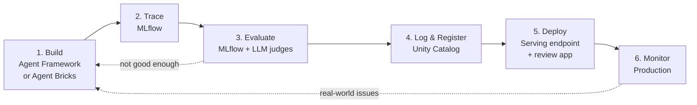
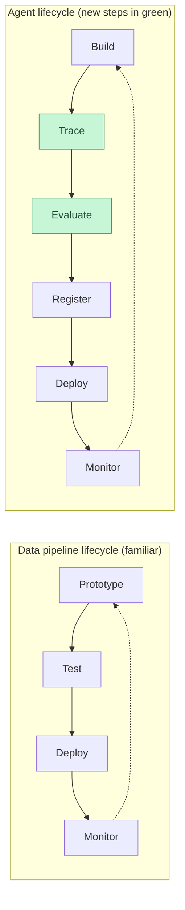
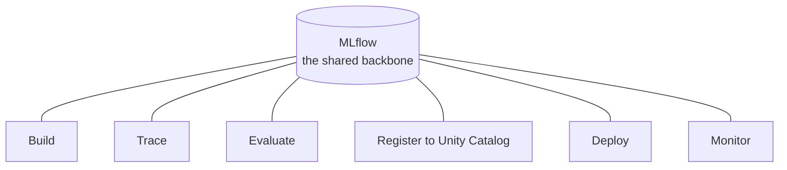

# The Agent Development Lifecycle

> You have shipped data pipelines before. You know the rhythm: prototype something small, test it, deploy it, then watch it in production. Building an AI agent follows almost the same rhythm — with two new steps in the middle. This lesson is your map of that whole loop. No deep dives yet, just the shape of the road ahead.

Take a breath. If you have ever built and shipped a pipeline, you already understand most of what is coming. We are just going to add a couple of new habits that AI needs. By the end of this lesson you will be able to name every stage of the loop and know exactly which later Part explains it in depth.

## Learning Objectives

By the end of this lesson, you will be able to:

- Describe the six stages of the agent development lifecycle on Databricks in plain language.
- Explain why AI agents need two extra steps — tracing and evaluation — that classic pipelines do not.
- Map each stage to the later Part of this course that covers it in depth.
- Explain why the lifecycle is a loop, not a straight line.
- Read a tiny log-register-deploy code sketch and understand what each call does at a high level.

## Prerequisites

Before starting this lesson, you should understand:

- [What Is an AI Agent?](/docs/agents-tools-mcp/what-is-an-agent) — what an agent is and why it is different from a plain chatbot.
- [How Function Calling Works](/docs/agents-tools-mcp/function-calling) — how an agent decides to call a tool.

You do not need any prior AI or machine learning experience. Your data engineering background is more than enough.

## Estimated Reading Time

About 15 minutes.

## Business Motivation

Imagine a fictional company: **Northwind Trust**, a mid-sized bank. Their support team is drowning. Customers ask the same questions all day — "What is my balance?", "How do I reset my card PIN?", "Why was I charged this fee?" — and human agents copy-paste answers from a dozen internal systems.

Northwind wants to build an **AI support agent**: a program that reads a customer question, looks up the right information, and drafts a helpful reply. Sounds great. But here is the catch that makes their engineers nervous.

A pipeline that computes a daily revenue number is **deterministic**. Same input, same output, every time. You can write a test that says "assert total equals 42" and trust it forever.

An AI agent is **probabilistic** (its answers can vary run to run). Ask it the same question twice and the wording may differ. It might be right, mostly right, or confidently wrong. For a bank, "confidently wrong" is a serious problem.

So Northwind needs a repeatable, safe way to build this thing, prove it is good enough, ship it, and keep watching it. That repeatable way is the **agent development lifecycle**. It is the difference between a cool demo and something a bank can actually put in front of customers.

## Intuition

Here is the whole idea in one sentence: **building an agent is just the pipeline lifecycle you already know, with two AI-specific steps bolted into the middle.**

Let us line them up side by side.

| Data pipeline lifecycle | Agent lifecycle |
| --- | --- |
| Prototype the transformation | **Build** the agent |
| *(nothing — output is fixed)* | **Trace** each run so you can see what happened |
| Test with assertions | **Evaluate** quality with AI judges |
| Package and version | **Log and register** to Unity Catalog |
| Deploy to production | **Deploy** as a serving endpoint |
| Monitor dashboards and alerts | **Monitor** in production |

The two new rows — **trace** and **evaluate** — exist for one reason: because the output is probabilistic, you cannot just glance at it and trust it. You need to record what the agent did (trace) and score how good it was (evaluate). Everything else maps neatly onto habits you already have.

That is the entire lesson in a nutshell. The rest just walks each stage slowly.

## Theory

The agent development lifecycle on Databricks has **six stages**:

1. **Build** — write the agent, or assemble it with low-code tools.
2. **Trace** — record every step of a run so you can inspect and iterate.
3. **Evaluate** — measure the quality of the agent's answers.
4. **Log and register** — package the agent as a versioned model in Unity Catalog.
5. **Deploy** — serve it behind an endpoint so apps can call it.
6. **Monitor** — watch quality and cost once real users arrive.

Two things to hold in your head from the start.

**First: it is a loop, not a line.** You will not march from step 1 to step 6 and finish. You will build a bit, trace it, evaluate it, notice it is weak, and jump back to build. This happens constantly. That is normal and healthy — exactly like tuning a pipeline until the numbers look right.

**Second: this lesson is the map, not the territory.** Each stage gets its own deep dive later in the course. Here you are learning the shape of the journey so nothing surprises you later.

:::note Going deeper (optional)
The two "extra" steps come from a field called **LLMOps** (operations practices for large language model applications). It borrows heavily from MLOps and DevOps, which you may already know. If those terms are new, do not worry — you will meet them naturally as the course goes on.
:::

## Deep Dive

Let us walk each stage in plain language and, importantly, point to where you will learn it deeply.

### 1. Build

You create the agent. On Databricks you have two paths:

- **Code-first** with the **Agent Framework** — you write Python, define the agent's behavior and tools, and have full control. This is the path most data engineers take.
- **Low-code** with **Agent Bricks** — you describe what you want in a guided interface and Databricks assembles a lot of it for you.

Think of this like choosing between hand-writing a Spark job versus using a visual pipeline builder. Same goal, different amount of control.

*Covered deeply in the rest of Part 4.*

### 2. Trace

When your agent runs, a lot happens under the hood: it reads the question, maybe calls a tool to look up a balance, thinks, then answers. A **trace** is a detailed recording of all those steps — like a run log or a query plan, but for an agent.

On Databricks you get tracing through **MLflow** (an open-source platform for managing the machine learning lifecycle). Traces let you ask "why did the agent say that?" and actually see the answer.

*Covered deeply in Part 5.*

### 3. Evaluate

Now you measure quality. Because you cannot write "assert answer equals X" for free-form text, you use **evaluation** tools in MLflow, including **LLM judges** — a second AI model that scores your agent's answers against criteria like "Is this correct?" and "Is this relevant?".

This feels strange at first (using AI to grade AI), but it is just an automated, scaled-up version of a human reviewer reading sample outputs. You will get comfortable with it.

*Covered deeply in Part 6.*

### 4. Log and register

Once the agent is good enough, you **log** it (save the model plus its code and dependencies) and **register** it into **Unity Catalog** as an **MLflow model**. Unity Catalog is Databricks' governance layer — the same place your tables and permissions live.

This is your versioning and packaging step. Every registered version is tracked, so you can always roll back. Think "git tag plus artifact registry," but for your agent.

### 5. Deploy

You **deploy** the registered agent as a **Model Serving endpoint** — a live URL that apps can send questions to. On Databricks this is one call, `agents.deploy(...)`, and it does more than just serve traffic. It also spins up a **review app** (a simple web UI where colleagues can try the agent and leave feedback) and **feedback capture** (it records that feedback for you).

So a single deploy gives you: the live endpoint, a place for humans to test it, and a pipeline collecting their reactions.

*Covered deeply in Part 8.*

### 6. Monitor

Finally, you **monitor** the agent in production — tracking quality, cost, latency, and whether answers are drifting worse over time. This is exactly like watching a pipeline's dashboards and alerts, except you are also watching answer quality, not just row counts.

*Covered deeply in Part 8.*

## Architecture

Here is the loop as one picture. Notice the arrows going backward — that is the iteration that never really stops.



*Figure 1: The six-stage agent development lifecycle. Solid arrows are the forward path; dotted arrows are the loops back to Build that happen all the time.*

Now compare it to the pipeline lifecycle you already run, so you can see how little is truly new.



*Figure 2: The agent lifecycle is the pipeline lifecycle with two extra steps (Trace and Evaluate, highlighted) added because agent output is probabilistic.*

## Internal Working

What actually connects these stages together? One tool, mostly: **MLflow**.

- During **Build**, MLflow is watching and can auto-record your runs.
- During **Trace**, MLflow stores the detailed step-by-step recordings.
- During **Evaluate**, MLflow runs your judges and stores the scores next to the traces.
- During **Log and register**, MLflow packages the agent and writes it to Unity Catalog.
- During **Deploy**, the `agents.deploy(...)` helper reads that registered MLflow model and stands up the endpoint.
- During **Monitor**, production traces flow back into MLflow so you can see quality over time.

So MLflow is the shared thread running through the whole loop. You do not have to stitch six different tools together — Databricks gives you one backbone.



*Figure 3: MLflow ties every stage together, so runs, traces, scores, and versions all live in one place.*

## Step-by-Step Walkthrough

Let us follow Northwind Trust's team through one full pass of the loop for their support agent.

1. **Build.** An engineer writes a first version of the support agent with the Agent Framework. It can look up a customer balance and answer basic questions. It is rough, but it runs.
2. **Trace.** They run a few sample questions. MLflow records each run. They open a trace and see the agent called the balance tool but ignored the fee-lookup tool — useful to know.
3. **Evaluate.** They collect 50 real past questions with known good answers and run MLflow evaluation with an LLM judge. The judge scores correctness at 72 percent. Not good enough for a bank.
4. **Loop back to Build.** They improve the prompt and add the missing fee-lookup tool. Re-trace, re-evaluate. Now correctness is 91 percent. Better.
5. **Log and register.** Happy enough for a pilot, they log the agent and register version 1 into Unity Catalog.
6. **Deploy.** One `agents.deploy(...)` call gives them a serving endpoint plus a review app. They invite ten colleagues to try it and leave feedback.
7. **Monitor.** Feedback and production traces reveal the agent stumbles on questions about international transfers. Back to **Build** they go for version 2.

Notice how many times they looped back. That is the job. The loop is the work.

## Hands-on Examples

You will write real agent code in the next lessons. For now, just picture the Northwind team's day-one checklist — no code, just the mindset:

- "Can I get a rough version running at all?" (Build)
- "Can I see what it did on one question?" (Trace)
- "Is it right often enough to trust?" (Evaluate)
- "Have I saved a version I can roll back to?" (Register)
- "Can a colleague click a link and try it?" (Deploy)
- "Will I notice if it gets worse next week?" (Monitor)

If you can answer yes to all six, you have completed one healthy trip around the loop.

## Code Examples

Here is a tiny sketch of the middle-to-end of the loop: log, register, and deploy. Do not worry about memorizing it — the real details come in later lessons. Read it like a story.

```python
import mlflow
from databricks import agents

# Point MLflow at a Unity Catalog location for our registered model.
mlflow.set_registry_uri("databricks-uc")
UC_MODEL_NAME = "northwind.support.support_agent"

# 1. LOG + REGISTER: save the agent as a versioned model in Unity Catalog.
with mlflow.start_run():
    logged_agent = mlflow.pyfunc.log_model(
        name="agent",
        python_model="support_agent.py",   # the file holding our agent code
        registered_model_name=UC_MODEL_NAME,
    )

# 2. DEPLOY: stand up a serving endpoint (plus a review app + feedback capture).
deployment = agents.deploy(
    model_name=UC_MODEL_NAME,
    model_version=logged_agent.registered_model_version,
)

print("Agent is live at:", deployment.endpoint_url)
```

Let us narrate what just happened, line by line in spirit:

- We told MLflow to use Unity Catalog as the home for our model, and picked a three-part name (`catalog.schema.model`) — the same naming you already use for tables.
- Inside `mlflow.start_run()`, `log_model(...)` packaged our agent's code and dependencies and registered it as a new version in Unity Catalog. That is stages 4 combined into a few lines.
- `agents.deploy(...)` took that registered version and served it. Behind the scenes it also created the review app and started capturing feedback — you did not have to ask for those separately.
- Finally we printed the live endpoint URL, which apps (like Northwind's support portal) can now call.

That is the backbone of the loop in about a dozen lines. Everything before it — writing the agent, tracing, evaluating — you will learn to do properly in the coming Parts.

## Production Considerations

- **Register before you deploy, always.** A deployed agent should trace back to a specific, versioned model in Unity Catalog. That is how you roll back cleanly when version 2 misbehaves.
- **Use the review app.** Human feedback from real colleagues is gold, and the deploy step hands it to you for free. Do not skip it.
- **Automate the loop over time.** Northwind will eventually want tracing and evaluation to run on every code change, like CI for pipelines. Start manual, automate later.

## Performance Considerations

- **Latency matters to users.** An agent that takes 30 seconds to answer a balance question feels broken, even if the answer is perfect. Monitoring (stage 6) should watch response time, not just correctness.
- **Cost scales with calls.** Every agent run may call a language model one or more times, and each call costs money. Evaluation runs cost money too. Keep evaluation datasets focused rather than enormous.
- **Traces add a little overhead but are worth it.** The visibility you gain far outweighs the small cost of recording runs.

## Security Considerations

- **Governance lives in Unity Catalog.** Registering your agent there means the same permissions, lineage, and auditing you already trust for tables now cover your agent. Use it.
- **Mind what the agent can reach.** Northwind's agent can look up balances — that is sensitive data. Which users and tools the agent may touch must be controlled, not assumed.
- **Watch for confident wrong answers in production.** Monitoring is a security and trust concern, not just a quality one. A bank cannot afford an agent that invents account details.

## Common Mistakes

- **Treating it as a straight line.** Beginners expect to finish at "deploy." The loop back from evaluate and monitor is where the real quality comes from.
- **Skipping evaluation.** "It looked good in my three test questions" is not evaluation. Probabilistic output needs measured scoring.
- **Skipping tracing.** Without traces, debugging a wrong answer is guesswork. With them, you can see exactly which step went sideways.
- **Deploying an unregistered agent.** You lose versioning, rollback, and governance. Register first.
- **Expecting deterministic tests.** Do not write "assert answer equals exact string." Score quality instead.

## Best Practices

- **Start small and loop fast.** Get a rough agent running, then improve it in tight build-trace-evaluate cycles.
- **Let MLflow be your backbone.** Lean on it for tracing, evaluation, and registration rather than gluing together separate tools.
- **Keep a fixed evaluation set.** A stable set of question-and-answer pairs lets you compare version 1 against version 2 fairly.
- **Register meaningful versions.** Treat each registered version like a release you might have to defend or roll back.
- **Monitor from day one.** Turn on production monitoring before real users arrive, not after something breaks.

## Interview Questions

<details>
<summary>1. What are the six stages of the agent development lifecycle on Databricks?</summary>

Build, Trace, Evaluate, Log and register, Deploy, and Monitor. Building creates the agent (code-first with the Agent Framework or low-code with Agent Bricks); tracing records each run with MLflow; evaluation scores quality with MLflow and LLM judges; logging and registering package the agent into Unity Catalog as an MLflow model; deploying serves it as a Model Serving endpoint; monitoring watches it in production.

</details>

<details>
<summary>2. Why does the agent lifecycle include tracing and evaluation when a classic data pipeline does not?</summary>

Because an agent's output is probabilistic — the same question can produce different wording, and answers can be right or wrong. You cannot rely on a simple exact-match assertion. Tracing lets you see what the agent actually did on each run, and evaluation measures answer quality (often with LLM judges) so you can prove it is good enough before shipping.

</details>

<details>
<summary>3. Why is the lifecycle described as a loop rather than a straight line?</summary>

Because you constantly jump backward. If evaluation shows the agent is not good enough, you return to Build. If monitoring reveals real-world problems, you return to Build. Quality comes from repeating the cycle, not from a single pass through it.

</details>

<details>
<summary>4. What does the single `agents.deploy(...)` call give you beyond a live endpoint?</summary>

It also creates a review app — a simple web UI where colleagues can try the agent — and sets up feedback capture that records their reactions. So one call gives you the serving endpoint, a place for humans to test it, and a feedback pipeline.

</details>

<details>
<summary>5. Why register an agent to Unity Catalog before deploying it?</summary>

Registration gives you versioning, rollback, lineage, and governance using the same controls you already apply to tables. A deployed agent should always trace back to a specific registered version so you can audit it and roll back cleanly if a new version misbehaves.

</details>

## Quiz

<details>
<summary>1. Which two stages are the "AI-specific" additions compared with a normal data pipeline lifecycle?</summary>

**Trace** and **Evaluate**. They exist because agent output is probabilistic and cannot be trusted from a glance or a simple equality check.

</details>

<details>
<summary>2. Which tool acts as the shared backbone across every stage of the loop?</summary>

**MLflow**. It records runs, stores traces, runs evaluations, packages and registers the model to Unity Catalog, and collects production traces for monitoring.

</details>

<details>
<summary>3. True or false: once you deploy the agent, the lifecycle is finished.</summary>

**False.** Monitoring in production regularly sends you back to Build to fix issues real users uncover. The lifecycle is a loop.

</details>

<details>
<summary>4. Where does the agent get registered, and as what?</summary>

It gets registered into **Unity Catalog** as an **MLflow model**, using a three-part `catalog.schema.model` name — the same governance layer that holds your tables.

</details>

## Summary

Building an AI agent on Databricks follows a familiar rhythm: it is the data pipeline lifecycle you already run, plus two new steps. You **build** the agent, **trace** its runs, **evaluate** its quality, **log and register** it to Unity Catalog, **deploy** it as a serving endpoint, and **monitor** it in production. The two extra steps — tracing and evaluation — exist because agent output is probabilistic, so you must record what happened and measure how good it was. MLflow ties the whole loop together, and the loop is genuinely a loop: you circle back to Build again and again. This lesson was the map; the deep dives come in Parts 5, 6, and 8.

## Key Takeaways

- The agent lifecycle has six stages: Build, Trace, Evaluate, Log and register, Deploy, Monitor.
- It is the pipeline lifecycle you know, plus Trace and Evaluate — added because agent output is probabilistic.
- MLflow is the shared backbone across every stage.
- Register to Unity Catalog before deploying, so you get versioning and governance.
- `agents.deploy(...)` also gives you a review app and feedback capture.
- The lifecycle is a loop — you circle back to Build constantly.

## Glossary

- **Agent Framework** — Databricks' code-first way to build agents in Python with full control.
- **Agent Bricks** — Databricks' low-code, guided way to assemble an agent.
- **MLflow** — an open-source platform for managing the machine learning lifecycle; the backbone of the agent loop.
- **Trace** — a detailed recording of every step an agent took during a run.
- **Evaluation** — measuring the quality of an agent's answers.
- **LLM judge** — a language model used to automatically score another agent's answers.
- **Unity Catalog** — Databricks' governance layer for data and AI assets, including registered models.
- **Model Serving endpoint** — a live URL that serves your deployed agent to applications.
- **Review app** — a simple web UI, created at deploy time, where people can test the agent and leave feedback.
- **LLMOps** — operational practices for running language-model applications in production.
- **Probabilistic** — producing outputs that can vary run to run, rather than a fixed result.

## Further Reading

- [Agent development on Databricks (Mosaic AI Agent Framework)](https://docs.databricks.com/aws/en/generative-ai/agent-framework/build-genai-apps)
- [Deploy an agent for generative AI applications](https://docs.databricks.com/aws/en/generative-ai/agent-framework/deploy-agent)
- [Mosaic AI Agent Evaluation](https://docs.databricks.com/aws/en/generative-ai/agent-evaluation/)

## Next Lesson

➡️ [Authoring an Agent with ResponsesAgent](/docs/building-agents/authoring-agents)
