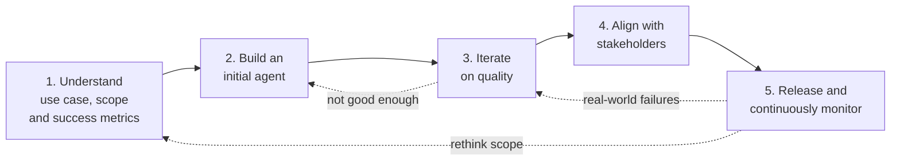
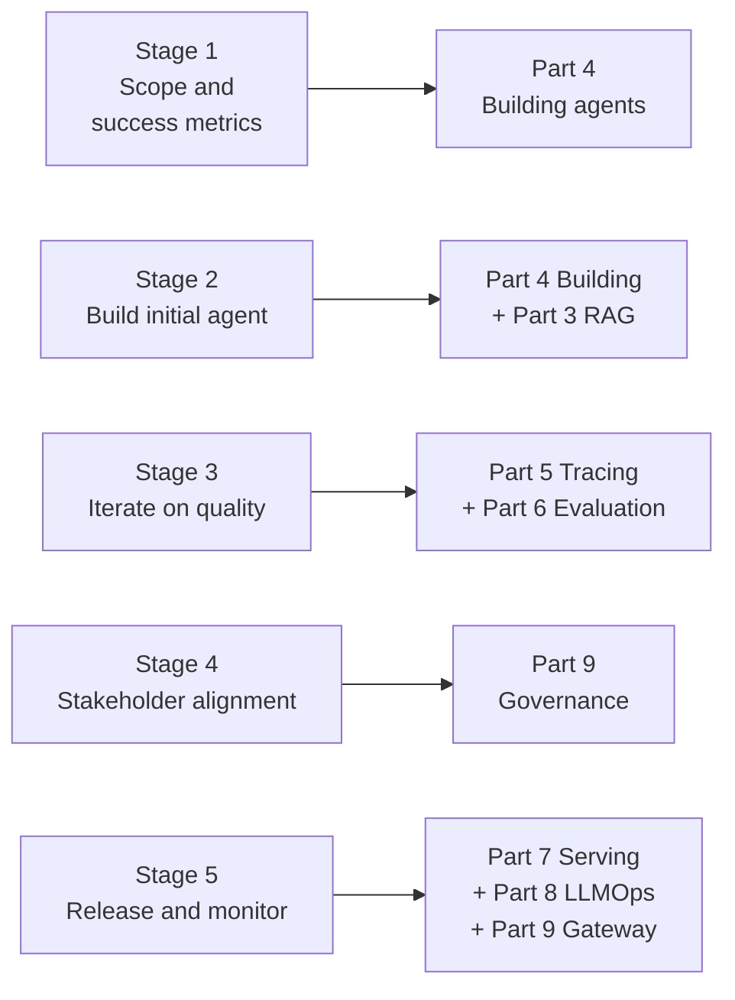
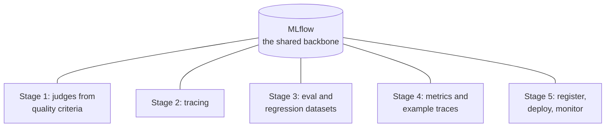

# The Agent Development Lifecycle

> Think about the last product you shipped. You did not just build it and throw it over the wall. You scoped it, made a rough version, refined it, got someone to sign off, then launched and kept an eye on it. Building an AI agent follows that exact same rhythm. This lesson is your map of the whole journey — the five official stages Databricks lays out — and it points you to the later Part that goes deep on each one.

Take a breath. You already know how to ship things responsibly. If you have ever launched a data product and lived with it in production, you understand most of what is coming. We are just going to give that instinct a clear five-stage shape, and gently spotlight the two stages that beginners almost always skip. By the end you will be able to name every stage and know exactly where in the course each one is taught in depth.

## Learning Objectives

By the end of this lesson, you will be able to:

- Name and describe Databricks' official five stages of the agent development lifecycle in plain language.
- Explain why the two easy-to-skip stages — scoping with success metrics, and stakeholder sign-off — matter most for a real product.
- Map each stage to the later Part of this course that covers it in depth.
- Explain why the lifecycle is a loop that feeds real-world failures back into your tests.
- Read a tiny log-register-deploy code sketch and understand what each call does at a high level.

## Prerequisites

Before starting this lesson, you should understand:

- [What Is an AI Agent?](/docs/agents-tools-mcp/what-is-an-agent) — what an agent is and why it is different from a plain chatbot.
- [How Function Calling Works](/docs/agents-tools-mcp/function-calling) — how an agent decides to call a tool.

You do not need any prior AI or machine learning experience. Your data engineering background is more than enough.

## Estimated Reading Time

About 16 minutes.

## Business Motivation

Imagine a fictional company: **Northwind Trust**, a mid-sized bank. Their support team is drowning. Customers ask the same questions all day — "What is my balance?", "How do I reset my card PIN?", "Why was I charged this fee?" — and human agents copy-paste answers from a dozen internal systems.

Northwind wants to build the **Northwind Trust Advisor Assistant**: a program that reads a customer question, looks up the right information, and drafts a helpful reply. Sounds great. But here is the catch that makes their engineers nervous.

A pipeline that computes a daily revenue number is **deterministic**. Same input, same output, every time. You can write a test that says "assert total equals 42" and trust it forever.

An AI agent is **probabilistic** (its answers can vary run to run). Ask it the same question twice and the wording may differ. It might be right, mostly right, or confidently wrong. For a bank, "confidently wrong" is a serious problem.

So Northwind needs a repeatable, safe way to decide what "good" means, build the thing, prove it is good enough, get a human to sign off, ship it, and keep watching it. That repeatable way is the **agent development lifecycle**. It is the difference between a cool demo and something a bank can actually put in front of customers.

## Intuition

Here is the whole idea in one sentence: **building an agent is just shipping any product responsibly — scope it, prototype it, refine it, get sign-off, then launch and watch.**

Let us line up the five stages against how you would ship any product.

| Shipping any product | Agent lifecycle stage |
| --- | --- |
| Decide what "good" looks like before you build | **1. Understand use case, scope & success metrics** |
| Make a rough first version | **2. Build an initial agent** |
| Refine it until the quality is there | **3. Iterate on quality** |
| Get a human to sign off before launch | **4. Align with stakeholders before production** |
| Launch it and keep watching | **5. Release to production & continuously monitor** |

That is the entire lesson in a nutshell. Nothing here is exotic. The two stages beginners rush past are the first and the fourth — deciding what "good" means up front, and getting a real sign-off before launch. We will keep coming back to those two, because they are exactly the ones that separate a demo from a product.

## Theory

Databricks defines the agent development lifecycle as **five stages**:

1. **Understand use case, scope & success metrics** — before writing any code, decide what the agent is for and what "good" means.
2. **Build an initial agent** — prepare your data and tools, then stand up a rough first version.
3. **Iterate on quality** — validate, test with real users, evaluate systematically, fix, and re-check.
4. **Align with stakeholders before production** — translate your results into business language and get a human sign-off.
5. **Release to production & continuously monitor** — launch, watch live quality, roll back if needed, and feed failures back into your tests.

Two things to hold in your head from the start.

**First: it is a loop, not a line.** You will not march from stage 1 to stage 5 and finish. Inside stage 3 you loop constantly, and once you are live in stage 5, real-world failures flow back into your tests and send you around again. That is normal and healthy — exactly like tuning a data product until the numbers look right, then tuning again when reality surprises you.

**Second: this lesson is the map, not the territory.** Each stage gets its own deep dive later in the course. Here you are learning the shape of the journey so nothing surprises you later.

:::note Going deeper (optional)
This five-stage lifecycle is Databricks' own framing, and it borrows heavily from a field called **LLMOps** (operations practices for large language model applications), which itself grows out of MLOps and DevOps. If those terms are new, do not worry — you will meet them naturally as the course goes on.
:::

## Deep Dive

Let us walk each stage in plain language and, importantly, point to where you will learn it deeply.

### Stage 1: Understand use case, scope & success metrics

This is the stage beginners skip — and the one that saves you the most pain. Before you build anything, you decide what "good" looks like. For the Northwind Advisor Assistant that means:

- **Scope and inputs.** What kinds of questions is the agent for, and who are its users? What is out of scope?
- **Ideal-response characteristics and quality criteria.** Spell out what a great answer looks like: tone, accuracy, completeness, length, safety, and whether it must cite its sources.
- **Constraints.** How fast must it answer (latency), how much can each answer cost, and how far must it scale?
- **Likely failure modes.** Where might it go wrong — and what will you do when it does?
- **Data sources and tools.** Which systems and tools will the agent need to reach to answer well?
- **Initial instructions.** Draft the agent's first prompt reflecting the behavior you want.
- **People and judges.** Pick your domain experts and testers, and create your first **automated judges** — simple rules or scoring prompts that encode your quality criteria.

Think of it as the product brief you would write before building anything. Skipping it is like coding a feature nobody agreed on.

*Covered deeply throughout the rest of Part 4 (this Part), and its quality criteria feed [evaluation](/docs/evaluation/why-eval-is-hard) in Part 6.*

### Stage 2: Build an initial agent

Now you make a rough first version. Two sub-steps.

**Prepare data and tools.** You gather what the agent needs: search existing assets in **Unity Catalog**, prepare structured and unstructured data for retrieval, and connect tools — **AI Search indexes**, **Unity Catalog functions**, or **MCP servers** (standardized tool connectors). Retrieval over your unstructured documents is a big topic on its own.

**Build the first version.** You can prototype with no code in the **AI Playground**, use a **Knowledge Assistant** or **AI functions**, or write it with the **Agent Framework** for full control. Whatever the path, you add **MLflow Tracing** so every run is recorded, and you pick an authentication method so the agent can safely reach its tools.

Think of this as the rough prototype — good enough to look at, not yet good enough to ship.

*The building itself is covered deeply in the rest of Part 4. Retrieval over your documents is [RAG and AI Search](/docs/rag-and-ai-search/what-is-rag) in Part 3, and tracing is [observability](/docs/tracing/why-observability) in Part 5.*

### Stage 3: Iterate on quality

This is where most of the real work happens, and it is a tight loop of its own.

- **Validate early.** Do a quick "vibe check" — run a few questions, read the traces in the **MLflow Tracing UI**, and try the agent in the **Review App**. Attach feedback right onto the traces.
- **Expand testing.** Invite beta users and domain experts, capture their feedback through **Review App labeling sessions**, and use it (plus **synthetic generation**) to build an **evaluation dataset** — your fixed set of questions with known-good answers.
- **Evaluate systematically.** Score new versions against that dataset with **LLM judges** and **code-based scorers**, and keep a **regression dataset** so a fix does not quietly break something else.
- **Fix and re-verify.** Improve prompts (including data-driven **DSPy tuning**), improve tools, retrieval, and routing, add **guardrails** and **fallbacks**, version everything in the **Prompt Registry**, then re-run evaluation to confirm the fix.

Think of this as refining the product until it clears the bar you set in stage 1.

*Covered deeply in Part 6, [evaluation](/docs/evaluation/why-eval-is-hard), and Part 5, [tracing](/docs/tracing/why-observability).*

### Stage 4: Align with stakeholders before production

This is the other stage beginners skip — the human sign-off gate. Your evaluation numbers mean nothing to a bank executive until you translate them. So you:

- **Speak business language.** Summarize accuracy, stability, safety, and known limitations in words a stakeholder understands, backed by a few example traces.
- **Run standardized quality checks** and confirm your evaluation and regression thresholds pass.
- **Do an operational-readiness review.** Confirm monitoring and guardrails are actually configured.
- **Plan the rollout, document the risks, and agree the acceptance criteria** — then get the sign-off.

Think of this as the launch review you would hold before pushing any product customers depend on.

*The governance and gateway pieces that make this real are covered in Part 9, [governance and the AI Gateway](/docs/governance/unity-ai-gateway).*

### Stage 5: Release to production & continuously monitor

You launch — and the work does not stop. You:

- **Collect end-user feedback** and link it back to specific traces.
- **Route traffic through the AI Gateway** for consistent guardrails, routing, and logging.
- **Monitor quality on live traffic** by running evaluation on sampled production traces, comparing versions on **dashboards** with **Databricks SQL alerts**.
- **Enable automated (or gated) rollback** for critical issues.
- **Convert real-world failures back into evaluation data** — which closes the loop, sending you back to stages 1 and 3.

Think of this as launching the product and watching your monitoring, then feeding every surprise back into your tests so it never surprises you twice.

*Covered deeply in Part 7, [model serving](/docs/serving/model-serving); Part 8, [LLMOps and the log-register-deploy flow](/docs/llmops/log-and-register); and Part 9, [the AI Gateway](/docs/governance/unity-ai-gateway).*

## Architecture

Here is the loop as one picture. Notice the arrows going backward — that is the iteration that never really stops, and the way production failures feed back into your tests.



*Figure 1: The official five-stage agent development lifecycle. Solid arrows are the forward path; dotted arrows are the loops back that happen all the time — quality iteration, and production failures feeding back into your tests and even your scope.*

Now here is the map you will care about most: which Part of this course goes deep on each stage. Keep this picture in mind as you move through the second half of the course.



*Figure 2: Each of the five stages maps to the Part(s) of this course that teach it in depth. This lesson is the overview; the pointers show you where the detail lives.*

## Internal Working

What actually connects these stages together? One tool shows up again and again: **MLflow** (an open-source platform for managing the machine learning lifecycle).

- In **stage 1**, your quality criteria become MLflow **judges**.
- In **stage 2**, **MLflow Tracing** records every run of your rough agent.
- In **stage 3**, MLflow stores your traces, runs your evaluations, and holds your evaluation and regression datasets and prompt versions.
- In **stage 4**, the metrics and example traces you show stakeholders all come from MLflow.
- In **stage 5**, MLflow packages and registers the agent, and production traces flow back into it for monitoring — which reopens the loop.

So MLflow is the shared thread running through the whole lifecycle. You do not have to stitch five different tools together; Databricks gives you one backbone, with the **AI Gateway** sitting in front of production traffic in stage 5.



*Figure 3: MLflow ties every stage together, so judges, traces, scores, versions, and production monitoring all live in one place.*

## Step-by-Step Walkthrough

Let us follow the Northwind team through one full pass of the lifecycle for their Advisor Assistant.

1. **Understand scope and success metrics.** Before any code, they write a one-page brief: the agent answers balance, PIN, and fee questions only; answers must be accurate, polite, under 120 words, and cite the internal policy used; latency under three seconds; each answer under a set cost. They pick two senior support reps as domain experts and draft an initial judge that checks "Is this answer correct and does it cite a source?"
2. **Build an initial agent.** An engineer prepares the account and policy data in Unity Catalog, connects a balance-lookup tool, and writes a first version with the Agent Framework. They switch on MLflow Tracing. It is rough, but it runs.
3. **Iterate on quality.** They vibe-check a few questions in the Tracing UI, then invite ten colleagues through the Review App to build a 50-question evaluation dataset. The LLM judge scores correctness at 72 percent — not good enough for a bank. They fix the prompt, add a fee-lookup tool, add a guardrail against giving financial advice, version the prompt, and re-evaluate. Now correctness is 91 percent.
4. **Align with stakeholders.** They summarize the results for the head of support in plain language — "91 percent correct on our test set, known weak spot on international transfers, guardrails in place" — show three example traces, confirm monitoring is configured, and agree the acceptance criteria. The head of support signs off for a limited pilot.
5. **Release and continuously monitor.** They deploy behind the AI Gateway, watch live quality on sampled traces with a dashboard and SQL alerts, and enable rollback. A week in, monitoring reveals the agent stumbles on international-transfer questions. That failure becomes a new test case — sending them back to stage 3 for version 2.

Notice the two stages they did not skip: the scoping in stage 1 gave them a bar to hit, and the sign-off in stage 4 kept a human accountable before customers saw anything. That is the whole discipline.

## Hands-on Examples

You will write real agent code in the next lessons. For now, picture the Northwind team's five-question readiness checklist — no code, just the mindset:

- "Have we written down what a good answer looks like, and how we will measure it?" (Stage 1)
- "Can we get a rough version running with tracing on?" (Stage 2)
- "Is it right often enough, measured against a fixed test set?" (Stage 3)
- "Has a human who owns the risk signed off?" (Stage 4)
- "Once live, will we notice quality slipping — and can we roll back?" (Stage 5)

If you can answer yes to all five, you have completed one healthy trip around the lifecycle.

## Code Examples

Most of these stages are about thinking and testing, not code. The one clearly code-shaped moment sits at the end of stage 5: packaging the agent and putting it live. Here is a tiny sketch of that log-register-deploy step. Do not worry about memorizing it — the real details come in Part 8. Read it like a story.

```python
import mlflow
from databricks import agents

# Point MLflow at a Unity Catalog location for our registered model.
mlflow.set_registry_uri("databricks-uc")
UC_MODEL_NAME = "northwind.support.advisor_assistant"

# LOG + REGISTER: save the agent as a versioned model in Unity Catalog.
with mlflow.start_run():
    logged_agent = mlflow.pyfunc.log_model(
        name="agent",
        python_model="advisor_assistant.py",   # the file holding our agent code
        registered_model_name=UC_MODEL_NAME,
    )

# DEPLOY: stand up a serving endpoint (plus a Review App + feedback capture).
deployment = agents.deploy(
    model_name=UC_MODEL_NAME,
    model_version=logged_agent.registered_model_version,
)

print("Agent is live at:", deployment.endpoint_url)
```

Let us narrate what just happened, in spirit:

- We told MLflow to use Unity Catalog as the home for our model, and picked a three-part name (`catalog.schema.model`) — the same naming you already use for tables.
- Inside `mlflow.start_run()`, `log_model(...)` packaged our agent's code and dependencies and registered it as a new version in Unity Catalog. That gives us versioning and clean rollback.
- `agents.deploy(...)` took that registered version and served it. Behind the scenes it also created the Review App and started capturing feedback — you did not have to ask for those separately.
- Finally we printed the live endpoint URL, which apps (like Northwind's support portal) can now call.

That is the backbone of stage 5's launch in about a dozen lines. Everything before it — scoping, building, iterating, and getting sign-off — is where you spend most of your time, and you will learn each part properly in the coming Parts.

## Production Considerations

- **Do stage 1 before you touch a keyboard.** A written scope with success metrics is what lets you say "done" later. Without it, you will build forever and never know if the agent is good enough.
- **Never skip the stage 4 sign-off.** A named human should accept the risk before customers see the agent. This is a governance requirement, not a nicety, especially in a regulated business like a bank.
- **Automate the loop over time.** Northwind will eventually want tracing and evaluation to run on every code change, like CI for pipelines. Start manual, automate later.
- **Register before you deploy, always.** A deployed agent should trace back to a specific, versioned model in Unity Catalog so you can roll back cleanly.

## Performance Considerations

- **Set latency and cost targets in stage 1.** An agent that takes 30 seconds to answer a balance question feels broken even if the answer is perfect. Decide the target early so you can measure against it.
- **Cost scales with calls.** Every agent run may call a language model one or more times, and each call costs money. Evaluation and monitoring runs cost money too. Keep evaluation datasets focused rather than enormous.
- **Sample production traces in stage 5.** You do not need to evaluate every single live request. Sampling keeps monitoring affordable while still catching drift.

## Security Considerations

- **Governance lives in Unity Catalog and the AI Gateway.** Registering your agent and routing traffic through the gateway means the same permissions, lineage, logging, and auditing you already trust now cover your agent. Learn more in [governance and the AI Gateway](/docs/governance/unity-ai-gateway).
- **Mind what the agent can reach.** Northwind's agent can look up balances — that is sensitive data. Which users and tools the agent may touch must be controlled in stage 1 and enforced through deployment, not assumed.
- **Guardrails and rollback are safety features.** Confirming guardrails in stage 4 and enabling automated rollback in stage 5 are how you keep a confidently-wrong answer from reaching a customer.

## Common Mistakes

- **Skipping stage 1.** Jumping straight to building with no written scope or success metric. You will not know when you are done, and stakeholders will not either.
- **Skipping stage 4.** Deploying because "it looked good to me" with no human sign-off. That is how demos leak into production and cause incidents.
- **Treating it as a straight line.** The loops back from iteration and monitoring are where quality actually comes from.
- **Evaluating on three hand-picked questions.** Probabilistic output needs a fixed evaluation dataset and measured scoring, not vibes alone.
- **Deploying an unregistered agent.** You lose versioning, rollback, and governance. Register first.

## Best Practices

- **Write the brief first.** Scope, quality criteria, constraints, failure modes, and success metrics on one page before you build.
- **Loop fast in stage 3.** Get a rough agent running, then improve it in tight validate-evaluate-fix cycles against a fixed dataset.
- **Translate before you present.** In stage 4, turn eval numbers into accuracy, stability, safety, and known-limitations language your stakeholders understand.
- **Let MLflow be your backbone.** Lean on it for judges, tracing, evaluation, versioning, and monitoring rather than gluing together separate tools.
- **Close the loop.** In stage 5, turn every real-world failure into a new test case so the agent gets sturdier over time.

## Interview Questions

<details>
<summary>1. What are the five official stages of the Databricks agent development lifecycle?</summary>

(1) Understand use case, scope, and success metrics; (2) build an initial agent; (3) iterate on quality; (4) align with stakeholders before production; and (5) release to production and continuously monitor quality. Stage 1 defines scope, quality criteria, constraints, failure modes, data and tools, initial prompts, testers, and first judges. Stage 2 prepares data and tools and stands up a first version with MLflow Tracing. Stage 3 validates, tests with users, evaluates with judges and scorers against a fixed dataset, and fixes issues. Stage 4 translates results into business language and gets a human sign-off. Stage 5 launches behind the AI Gateway, monitors live quality, enables rollback, and feeds failures back into the tests.

</details>

<details>
<summary>2. Which two stages do beginners most often skip, and why do they matter?</summary>

Stage 1 (scope and success metrics) and stage 4 (stakeholder alignment). Stage 1 matters because without a written definition of "good," you cannot tell when the agent is finished or prove it to anyone. Stage 4 matters because a named human should accept the risk before customers see the agent — it is a governance gate that separates a demo from a shipped product, especially in a regulated business.

</details>

<details>
<summary>3. Why is the lifecycle described as a loop rather than a straight line?</summary>

Because you circle back constantly. Within stage 3 you iterate build-evaluate-fix many times, and in stage 5 real-world failures on live traffic are converted into new evaluation data, sending you back to stages 3 and even 1. Quality comes from repeating the cycle, not from a single pass.

</details>

<details>
<summary>4. In stage 3, how do you evaluate quality when you cannot write an exact-match assertion?</summary>

You build a fixed evaluation dataset (from real user feedback, labeled traces, and synthetic generation), then score new versions with LLM judges and code-based scorers against it, keeping a regression dataset so a fix does not silently break something else. You start with built-in judges and align custom judges using human feedback to cut false positives and negatives.

</details>

<details>
<summary>5. What happens in stage 5 to make the agent safe and self-improving in production?</summary>

Traffic is routed through the AI Gateway for consistent guardrails, routing, and logging. Quality is monitored on live traffic by evaluating sampled production traces, comparing versions on dashboards with Databricks SQL alerts. Automated or gated rollback handles critical issues, and real-world failures are converted back into evaluation data — closing the loop to stages 1 and 3.

</details>

## Quiz

<details>
<summary>1. Which stage defines success metrics and quality criteria before any code is written?</summary>

**Stage 1: Understand use case, scope, and success metrics.** This is where you set scope, ideal-response characteristics, quality criteria (tone, accuracy, completeness, length, safety, citations), constraints, failure modes, data and tools, initial instructions, testers, and your first automated judges.

</details>

<details>
<summary>2. Which stage is the human sign-off gate before launch?</summary>

**Stage 4: Align with stakeholders before production.** You translate technical signals into business language, run standardized quality checks and an operational-readiness review, confirm monitoring and guardrails, plan the rollout, document risks, and agree acceptance criteria — then get sign-off.

</details>

<details>
<summary>3. True or false: once you release the agent in stage 5, the lifecycle is finished.</summary>

**False.** Stage 5 converts real-world failures on live traffic into new evaluation data, sending you back to stages 3 and even 1. The lifecycle is a loop.

</details>

<details>
<summary>4. Which tool acts as the shared backbone across the whole lifecycle?</summary>

**MLflow.** It holds your judges, records traces, runs evaluations, stores evaluation and regression datasets and prompt versions, packages and registers the model to Unity Catalog, and collects production traces for monitoring — with the AI Gateway sitting in front of live traffic.

</details>

## Summary

Building an AI agent on Databricks follows the same rhythm as shipping any product responsibly, laid out as five official stages. You **understand the use case, scope, and success metrics**; **build an initial agent**; **iterate on quality**; **align with stakeholders before production**; and **release to production and continuously monitor**. The two stages beginners skip — scoping with success metrics up front, and getting a human sign-off before launch — are the ones that turn a demo into a product a bank can trust. MLflow ties the whole thing together, and the lifecycle is genuinely a loop: production failures feed back into your tests. This lesson was the map; the deep dives come across Parts 3 through 9.

## Key Takeaways

- The lifecycle has five official stages: scope and success metrics, build initial agent, iterate on quality, stakeholder alignment, and release and monitor.
- Beginners skip stage 1 (scoping) and stage 4 (sign-off) — those two matter most for a real product.
- It is a loop: production failures in stage 5 become new tests, sending you back to stages 3 and 1.
- MLflow is the shared backbone; the AI Gateway fronts production traffic.
- Register to Unity Catalog before deploying, so you get versioning, rollback, and governance.
- Each stage maps to a later Part of this course — use Figure 2 as your map.

## Glossary

- **Success metrics** — the measurable quality criteria you define in stage 1 to decide when the agent is good enough.
- **Automated judge (LLM judge)** — a scoring prompt or model used to grade an agent's answers against your criteria.
- **Code-based scorer** — a deterministic check (like a rule or function) used alongside judges to score answers.
- **Evaluation dataset** — a fixed set of questions with known-good answers used to measure quality across versions.
- **Regression dataset** — a set of known-good cases you re-run to make sure a fix does not break something else.
- **Vibe check** — an informal early look at a few runs in the MLflow Tracing UI or Review App.
- **Review App** — a Databricks web UI where colleagues try the agent and leave feedback that attaches to traces.
- **MLflow** — an open-source platform for managing the ML lifecycle; the backbone across all five stages.
- **DSPy tuning** — a data-driven way to optimize prompts and multi-step reasoning.
- **Prompt Registry** — where prompt versions are tracked, like version control for prompts.
- **AI Gateway** — the Databricks layer that fronts production traffic with guardrails, routing, and consistent logging.
- **Unity Catalog** — Databricks' governance layer for data and AI assets, including registered models.
- **Probabilistic** — producing outputs that can vary run to run, rather than a fixed result.

## Further Reading

- [Agent development lifecycle](https://docs.databricks.com/aws/en/agents/agents-dev-lifecycle)
- [Build generative AI apps with Mosaic AI Agent Framework](https://docs.databricks.com/aws/en/generative-ai/agent-framework/build-genai-apps)
- [Deploy an agent for generative AI applications](https://docs.databricks.com/aws/en/generative-ai/agent-framework/deploy-agent)

## Next Lesson

➡️ [Authoring an Agent with ResponsesAgent](/docs/building-agents/authoring-agents)
