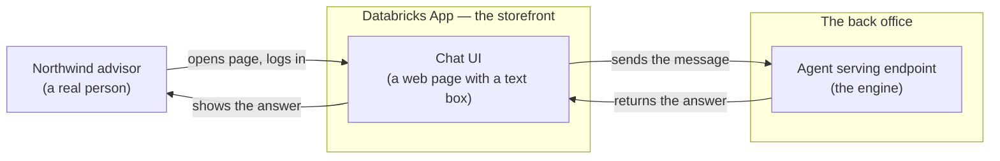
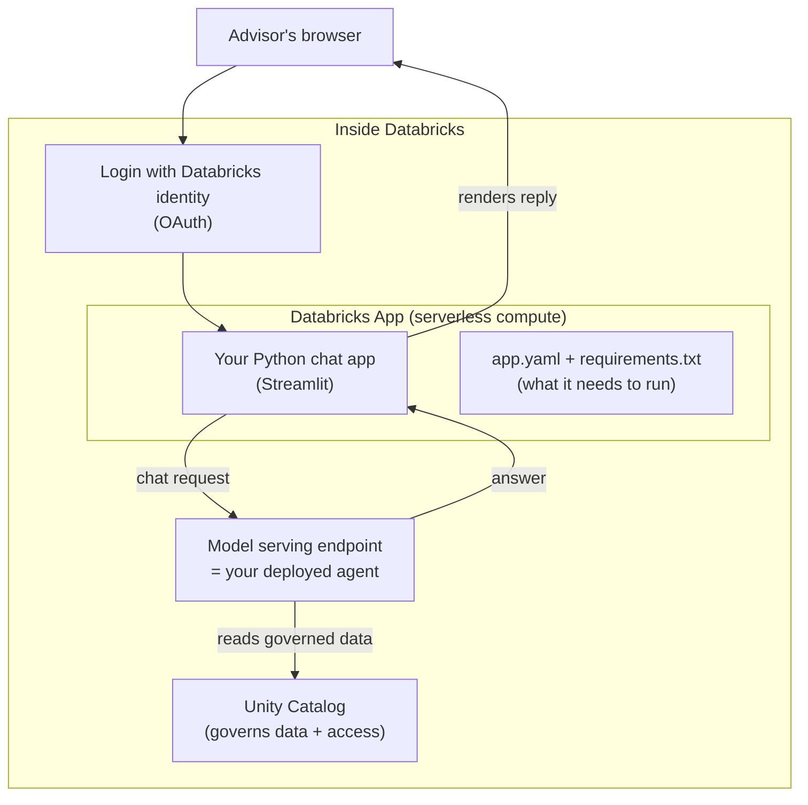

# Shipping a Chat UI with Databricks Apps

> Think about the last time you walked into a bank branch. You did not go into the back room where the vault, the servers, and the paperwork live. You walked up to the reception desk. A friendly person greeted you, checked who you were, and handled your request. The heavy machinery stayed in the back. Databricks Apps is that reception desk for your agent — the front door that real people actually see and use.

You have done the hard part already. You authored an agent, tested it, and deployed it as a serving endpoint. But right now, the only way to talk to that agent is with code or an API call. Your colleagues in the business are not going to open a notebook and write Python to ask a question.

They need a **front door**. A simple web page with a chat box, where they log in, type a question, and get an answer. That is exactly what this lesson builds.

Take a breath. There is nothing scary here. If you can write a short Python script, you can ship a chat UI. Let's go.

## Learning Objectives

By the end of this lesson, you will be able to:

- Explain, in plain words, what **Databricks Apps** is and the one problem it solves.
- Describe the "storefront and engine" split: the App is the front door; the agent endpoint is the engine in the back.
- Trace the flow: a user opens the App, logs in with their Databricks identity, types a message, the App calls the agent's serving endpoint, and the answer appears.
- Recognize why hosting the UI *inside* Databricks is a governance and authentication win.
- Read and understand a minimal Streamlit chat app that calls a serving endpoint.
- Know what goes in the app config (dependencies) and, at a high level, how you deploy the App.

## Prerequisites

Before this lesson, it helps to have read:

- [Authoring an Agent with ResponsesAgent](/docs/building-agents/authoring-agents) — how you write an agent in code and deploy it as a serving endpoint.
- [Knowledge Assistant](/docs/building-agents/knowledge-assistant) — a low-code way to stand up an agent you might want to put a UI in front of.

If those feel comfortable, you are ready. If not, no problem — this lesson stands on its own. The key thing to remember is that a **deployed agent** lives behind a **serving endpoint** (a URL you can send messages to), and this lesson is about giving humans a nice way to reach it.

## Estimated Reading Time

About 20 to 25 minutes, plus a few minutes to skim the code. There is nothing to install to follow along. Read gently — you do not need to memorize anything.

## Business Motivation

Let's start with why this matters, using our familiar fictional company, **Northwind Trust**, a mid-sized financial services firm.

Their data engineering team (people like you) built an **internal advisor agent**. Ask it "What is our policy on wiring funds over $50,000?" or "Summarize this client's recent account activity," and it answers using the firm's own governed data.

The agent works beautifully — in a notebook. But the people who actually need it are the client advisors, the compliance officers, and the support desk. They are not engineers. They will never call an API.

Here is the trap teams fall into. They think, "Fine, we'll build a little web app to wrap the agent." So they spin up a separate server somewhere, wire up a login system, figure out how to safely store the credentials that let the app reach the agent, worry about who is allowed to see what, and then babysit that server forever. That is a lot of plumbing, and most of it is about **security and identity**, not about the chat box.

Databricks Apps removes almost all of that plumbing. You write a small Python app, declare what it needs, and deploy it *inside* Databricks. Users log in with the **same Databricks identity** they already have. Governance through Unity Catalog still applies. You did not build a login system, and you did not stand up a server. You built a chat box.

That is the payoff: your agent gets a friendly, secure front door in a fraction of the time.

## Intuition

Here is the whole idea in one picture: a storefront out front, an engine in the back.



*Figure 1: The App is the reception desk customers walk up to. The agent endpoint is the machinery in the back. Users only ever touch the storefront.*

Notice what the user never sees: the endpoint URL, the model, the credentials, the data. They just see a text box and an answer. That separation is the entire mental model. The App's whole job is to be a polite receptionist — greet the user, pass the message to the back, and bring the answer forward.

## Theory

Let's define the pieces plainly.

**Databricks Apps** is a feature that lets you build and host interactive web applications *inside* Databricks. You write the app in Python using a popular framework — **Streamlit**, **Dash**, or **Gradio** are the common Python choices (Node.js frameworks like React are supported too). You declare the app's dependencies, and Databricks runs it on managed, serverless compute.

Three properties make it a natural fit for putting a UI in front of an agent:

1. **It is governed by Unity Catalog.** The same data governance you already rely on continues to apply.
2. **It uses your workspace identity for auth.** Users log in with their existing Databricks account. You do not build or run a login system.
3. **It can securely call your model serving endpoints.** The App can reach your deployed agent without you hardcoding secrets into the code.

Put those together and you get the headline benefit: **the person's identity carries through**. Because the user logged in as themselves, the App knows who they are, and access can be checked against *their* permissions — not some shared, all-powerful service account. This is often called **on-behalf-of** access, and Apps make it natural.

:::note Going deeper (optional)
"On-behalf-of" means the App can act using the logged-in user's own identity when it reaches downstream resources, rather than one shared identity for everyone. The practical effect: if Alice is not allowed to see a certain table, the answer she gets respects that — even though the App code is the same for everyone. You can also run an App under a dedicated service principal for some flows. If this feels abstract right now, that is fine; the takeaway is simply "permissions follow the person."
:::

## Deep Dive

Let's slow down on the one relationship that matters: the App versus the agent endpoint.

Beginners often blur these two together. Keep them separate in your head:

| | The agent endpoint (engine) | The Databricks App (storefront) |
|---|---|---|
| What it is | A deployed model/agent behind a URL | A small web application with a UI |
| Its job | Think: take a message, return an answer | Present: show a text box and the reply |
| Who talks to it | Other software (like the App) | Humans, in a browser |
| Contains the "brains"? | Yes — the model, tools, RAG | No — it just relays messages |
| You built it in | The authoring lesson | This lesson |

This split is good design, not extra work. Because the engine is separate, you can:

- Reuse **one** agent endpoint behind **many** front doors (a chat App, a Slack bot, a batch job).
- Upgrade the agent without touching the UI, and vice versa.
- Test the engine on its own before anyone builds a storefront.

So the App is deliberately thin. If you ever feel tempted to put the model logic *inside* the App, stop — that belongs in the endpoint. The App only greets, relays, and displays.

## Architecture

Here is a slightly fuller picture, showing where identity and governance sit.



*Figure 2: The App and the endpoint both live inside Databricks. Login happens with the user's own identity, and Unity Catalog governs what the agent can reach on their behalf.*

Two things to notice. First, **everything lives inside Databricks** — there is no separate cloud server you rent and patch. Second, the App does not reach around governance; the agent still pulls data through Unity Catalog, so the same rules apply as anywhere else on the platform.

## Internal Working

What actually happens, step by step, when an advisor uses the App?

1. The advisor opens the App's URL in a browser.
2. Databricks checks their identity. If they are not logged in, they log in with their Databricks account (OAuth). No separate password to manage.
3. The App page loads — a chat box, maybe a title and a bit of help text.
4. The advisor types "What is our wire transfer policy?" and hits enter.
5. The App code takes that text and sends it to the agent's serving endpoint. It uses credentials that Databricks provides at runtime — you never typed a secret into the code.
6. The endpoint (the agent) does its thinking: it may call tools, run retrieval, and ask the model — all governed by Unity Catalog.
7. The endpoint returns an answer.
8. The App displays the answer in the chat window, and the conversation continues.

The App itself holds almost no intelligence. It is a loop: *show the box, take the text, call the endpoint, show the reply.* That simplicity is exactly what makes it safe and quick to build.

## Step-by-Step Walkthrough

If you were building the Northwind Trust internal advisor App from scratch, here is the whole path at a glance:

1. **Have a deployed agent.** You need a serving endpoint name, for example `northwind-advisor`. (That came from the authoring lesson.)
2. **Create an App project.** A small folder with your Python code and a couple of config files.
3. **Write the chat UI.** A short Streamlit script — we will read it line by line below.
4. **Declare dependencies.** List the Python packages your app needs so Databricks can install them.
5. **Point the App at the endpoint.** Tell the App which serving endpoint to call, ideally via config rather than hardcoding.
6. **Deploy.** Push the App to Databricks; it runs on managed compute and gives you a URL.
7. **Share it.** Give your advisors the link. They log in and start chatting.

Only step 3 is real "coding," and it is short. Let's look at it.

## Hands-on Examples

Imagine you are sitting with a Northwind teammate who has never built a web app. You would say something like:

"See this text box? When you type in it, our code grabs your words. It sends them to the advisor agent — the same one we tested in the notebook. The agent answers, and we print the answer right under your question. Then we wait for your next question. That's the entire app. Ready to see the code?"

That framing — box, send, show, repeat — is all you need to hold in your head as we read the code next.

## Code Examples

Let's build the minimal App. It has three files. We will narrate each one.

### File 1: `app.py` — the chat UI

This is the storefront. We use **Streamlit** because it turns plain Python into a web page with almost no ceremony.

```python
import os
import streamlit as st
from openai import OpenAI

# 1. Which agent are we talking to? Read it from config, not hardcoded.
ENDPOINT_NAME = os.environ["SERVING_ENDPOINT"]

# 2. Build a client that speaks to Databricks model serving.
#    Databricks provides the host + token at runtime — no secrets in code.
client = OpenAI(
    base_url=f"{os.environ['DATABRICKS_HOST']}/serving-endpoints",
    api_key=os.environ["DATABRICKS_TOKEN"],
)

# 3. Give the page a title and a friendly intro.
st.title("Northwind Trust — Internal Advisor")
st.caption("Ask about policies, accounts, and procedures. Answers respect your access.")

# 4. Keep the conversation in memory so the page can show the full chat.
if "messages" not in st.session_state:
    st.session_state.messages = []

# 5. Re-draw the whole conversation each time the page runs.
for msg in st.session_state.messages:
    with st.chat_message(msg["role"]):
        st.markdown(msg["content"])

# 6. Show the input box. When the user submits, this block runs.
if prompt := st.chat_input("Type your question..."):
    # Save and show the user's message.
    st.session_state.messages.append({"role": "user", "content": prompt})
    with st.chat_message("user"):
        st.markdown(prompt)

    # 7. Call the agent endpoint with the whole conversation so far.
    with st.chat_message("assistant"):
        response = client.chat.completions.create(
            model=ENDPOINT_NAME,
            messages=st.session_state.messages,
        )
        answer = response.choices[0].message.content
        st.markdown(answer)

    # 8. Save the agent's answer so it stays on screen.
    st.session_state.messages.append({"role": "assistant", "content": answer})
```

Let's narrate it, block by block:

- **Block 1** reads the endpoint name from an environment variable. We do *not* type `"northwind-advisor"` into the code — config keeps it flexible and safe.
- **Block 2** creates an OpenAI-compatible client. Databricks model serving speaks the same "chat completions" language as the OpenAI API, so we can reuse that familiar client. Notice the host and token come from the environment — Databricks supplies them at runtime, so there are no secrets in the file.
- **Block 3** sets the page title and a one-line description. This is the "welcome sign" on the storefront.
- **Block 4** creates a place to remember the conversation. Streamlit re-runs the whole script on every interaction, so we stash messages in `session_state` to keep them around.
- **Block 5** re-draws every message we have so far, so the user sees the full back-and-forth.
- **Block 6** is the text box. The walrus `:=` grabs whatever the user typed. When they submit, we record and display it.
- **Block 7** is the important one: we send the entire conversation to the endpoint and read back the reply. Sending the whole list (not just the last line) is what lets the agent remember context within the chat.
- **Block 8** saves the answer so it stays on screen for the next round.

That is the complete UI. Box, send, show, repeat — exactly as promised.

### File 2: `requirements.txt` — the dependencies

Databricks needs to know which Python packages to install. You list them here:

```text
streamlit
openai
```

Short and honest. Only what the app imports. Keeping this list minimal means faster installs and fewer surprises.

### File 3: `app.yaml` — how to run the app

This tells Databricks how to start your App and passes in configuration, such as which endpoint to use.

```yaml
command: ["streamlit", "run", "app.py"]

env:
  - name: "SERVING_ENDPOINT"
    value: "northwind-advisor"
```

Reading it:

- `command` is how Databricks launches your app — here, "run `app.py` with Streamlit."
- `env` sets environment variables the app can read. We pass the endpoint name here, which is why `app.py` could read `SERVING_ENDPOINT` from the environment instead of hardcoding it.

:::note Going deeper (optional)
Exact config keys and the cleanest way to wire credentials can evolve. In current Databricks Apps, host and token for reaching serving endpoints are typically made available to the app automatically, and you can bind resources (like a serving endpoint) to the app so access is managed for you rather than passed as raw tokens. When you build for real, check the official docs for the current recommended pattern. The shape above is the stable idea: a run command plus configuration, kept out of your source code.
:::

### Deploying it

You do not run this on your laptop for real users. You deploy it to Databricks, which hosts it on managed compute and gives you a URL to share. In practice you create the App in the workspace, upload or sync your three files, and deploy — commonly with the Databricks CLI or the workspace UI. The result is a running web page your advisors can open. See the official docs for the exact commands, since the CLI evolves.

## Production Considerations

A quick, friendly checklist before you invite real users:

- **Bind the endpoint as a resource.** Rather than passing tokens around, attach the serving endpoint to the App so Databricks manages access. Cleaner and safer.
- **Handle errors gracefully.** Endpoints can be slow or briefly unavailable. Wrap the call and show a kind message ("Sorry, I could not reach the advisor just now — please try again") instead of a stack trace.
- **Mind the conversation length.** Very long chats mean very long requests. Consider trimming old turns so you stay within the model's context window.
- **Show a "thinking" indicator.** A spinner while the endpoint works makes the app feel responsive.
- **Keep the App thin.** Resist adding business logic to the UI. New capabilities belong in the agent endpoint.

## Performance Considerations

- **Most of the wait is the agent, not the UI.** The App relays quickly; the thinking time is the endpoint's. Optimize the agent if answers feel slow.
- **Stream if you can.** If the endpoint supports streaming, show tokens as they arrive so users see progress immediately instead of staring at a blank screen.
- **Compute scales with use.** Apps run on managed compute billed by time. A busy App uses more; a quiet one uses little. Right-size rather than over-provision.
- **Avoid resending everything forever.** Trimming old messages keeps each request smaller and faster, and cheaper too.

## Security Considerations

This is where Databricks Apps really earns its keep. Keep these front of mind:

- **Never hardcode secrets.** No tokens, no passwords in `app.py`. Read them from the environment or, better, bind resources so Databricks handles credentials for you.
- **Lean on Databricks auth.** Users log in with their own identity. Do not build a side login system.
- **Respect endpoint permissions.** The App calling the endpoint does not override who is allowed to use it. Grant access deliberately.
- **Let permissions follow the person.** Because the user is authenticated, access to governed data can be checked against *their* rights. Do not defeat that by routing everything through one all-powerful identity unless you have a clear, reviewed reason.
- **Control who can open the App.** Share the App with the right groups. A chat box is still a door; decide who holds the key.

## Common Mistakes

- **Putting the model logic in the App.** The App is a storefront. The brains live in the endpoint. Mixing them makes both harder to change.
- **Hardcoding the endpoint name or secrets.** Use config and environment variables. Your future self, and your security reviewer, will thank you.
- **Sending only the latest message.** If you drop the earlier turns, the agent forgets the conversation. Send the running list.
- **Forgetting `session_state`.** Streamlit re-runs top to bottom on every click. Without saving messages, the chat vanishes each time.
- **Skipping error handling.** A raw exception on screen is confusing and can leak details. Catch it and say something human.
- **Assuming the App bypasses governance.** It does not. If a user cannot see certain data, the agent should not surface it to them.

## Best Practices

- **Keep the App small and boring.** Boring is good. Box, send, show, repeat.
- **Config over hardcoding.** Endpoint names, feature flags, and the like belong in `app.yaml` or environment variables.
- **Bind resources instead of passing tokens.** Let the platform manage credentials.
- **Give friendly, honest feedback.** Spinners while waiting, kind messages on failure.
- **Reuse one endpoint across front doors.** Build the engine once; put many storefronts in front of it if you need to.
- **Test the endpoint alone first.** Confirm the engine works before you judge the storefront.

## Interview Questions

1. **In your own words, what is Databricks Apps, and what problem does it solve for an agent you have deployed?**
   Look for: a way to build and host an interactive web app *inside* Databricks; it gives a deployed agent a human-facing, governed, authenticated front door without standing up a separate server or login system.

2. **Explain the split between a Databricks App and a model serving endpoint. Why keep them separate?**
   Look for: the App is the UI/storefront that relays messages; the endpoint is the engine with the model, tools, and RAG. Separation lets you reuse one endpoint behind many UIs, upgrade each independently, and test the engine on its own.

3. **How does authentication and on-behalf-of access work with Databricks Apps, and why does it matter?**
   Look for: users log in with their Databricks identity via OAuth; the App does not need a custom login; because the user is authenticated, access to governed data can be checked against *their* permissions, so answers respect who is asking.

4. **Walk me through what happens, end to end, when a user sends a message in the chat App.**
   Look for: open App, log in, type message, App sends the conversation to the serving endpoint using runtime-provided credentials, endpoint does the thinking (tools/retrieval/model, governed by Unity Catalog), returns an answer, App displays it.

5. **What are two security practices you would insist on for a chat App in front of an agent, and why?**
   Look for: never hardcode secrets (use env/resource binding); respect endpoint and data permissions / let identity carry through; control who can open the App. Reasoning should connect to governance and least-privilege.

## Quiz

**Question 1:** In the "storefront and engine" analogy, which part holds the model, tools, and retrieval logic?

<details>
<summary>Show answer</summary>

The **engine** — the agent's serving endpoint. The Databricks App is the storefront: it only greets the user, relays the message, and shows the answer. Keeping the brains in the endpoint is deliberate, so you can reuse and upgrade each side independently.

</details>

**Question 2:** Why should you read the serving endpoint name and credentials from configuration or the environment rather than typing them into `app.py`?

<details>
<summary>Show answer</summary>

For **security and flexibility**. Hardcoding secrets is a leak risk and is hard to rotate; hardcoding the endpoint name makes the app rigid. Reading from `app.yaml` or environment variables — or better, binding the endpoint as a resource so Databricks manages credentials — keeps secrets out of your code and lets you point the same app at different endpoints.

</details>

**Question 3:** In the Streamlit chat app, why do we send the whole `st.session_state.messages` list to the endpoint instead of just the latest message?

<details>
<summary>Show answer</summary>

So the agent has the **conversation context**. Sending only the last line would make the agent forget everything said earlier in the chat. Passing the running list lets it answer follow-up questions coherently.

</details>

**Question 4:** A user who is not allowed to see a certain table asks the App a question that would require it. Why does hosting the UI in Databricks Apps help here?

<details>
<summary>Show answer</summary>

Because users log in with their **own Databricks identity**, and Unity Catalog governance still applies. Access can be checked against that user's permissions (on-behalf-of), so the App does not become a backdoor around governance. The same rules that protect the data everywhere else on the platform continue to hold.

</details>

## Summary

Your agent needed a front door for humans, and Databricks Apps is it. You write a small Python app — a chat box — declare its dependencies, and deploy it *inside* Databricks. Users log in with their own identity, type a question, and the App relays it to your agent's serving endpoint and shows the answer.

The mental model is a storefront in front of an engine: the App greets and relays, the endpoint thinks. Because everything lives inside Databricks, you skip building a server and a login system, and Unity Catalog governance carries through to whoever is asking. That combination — quick to build, governed, authenticated — is what makes Apps the natural last step in shipping an agent to real people.

## Key Takeaways

- **Databricks Apps** hosts interactive web apps *inside* Databricks, governed by Unity Catalog and using your workspace identity.
- Think **storefront (App) and engine (endpoint)**: the App relays messages; the endpoint holds the intelligence.
- The flow is: **user → App (chat UI) → agent endpoint → answer.**
- Users **log in with their Databricks identity**, so permissions can follow the person (on-behalf-of).
- Write the UI in **Streamlit** (or Dash/Gradio), list packages in `requirements.txt`, and configure startup in `app.yaml`.
- **Never hardcode secrets**; read config from the environment or bind the endpoint as a resource.
- Keep the App **thin** — new capability belongs in the endpoint, not the UI.

## Glossary

- **Databricks Apps:** A feature for building and hosting interactive web applications inside Databricks, on managed serverless compute, governed by Unity Catalog.
- **Serving endpoint:** A URL that hosts a deployed model or agent; other software sends it messages and gets answers back. The "engine."
- **Streamlit:** A Python framework that turns a plain script into a web page, popular for quick chat and data UIs.
- **Unity Catalog:** Databricks' governance layer for data and AI assets — controls who can access what.
- **OAuth:** The standard login mechanism Apps use so users authenticate with their existing Databricks identity.
- **On-behalf-of access:** Reaching downstream resources using the logged-in user's own identity, so their permissions apply.
- **`app.yaml`:** The config file that tells Databricks how to start your App and passes in environment settings.
- **`session_state`:** Streamlit's per-session memory, used here to keep the conversation on screen across re-runs.

## Further Reading

- [Databricks Apps documentation](https://docs.databricks.com/aws/en/dev-tools/databricks-apps/) — the authoritative guide to building, configuring, and deploying Apps, including current auth and resource-binding patterns.

## Next Lesson

You have now built agents, given them tools, and shipped a front door for real people to use. Time to make sure it all sticks and that you can talk about it confidently.

➡️ [Part 4 · Interview Prep](/docs/building-agents/interview-prep)
