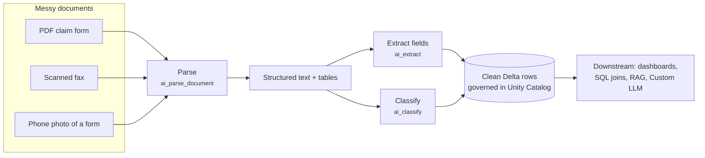
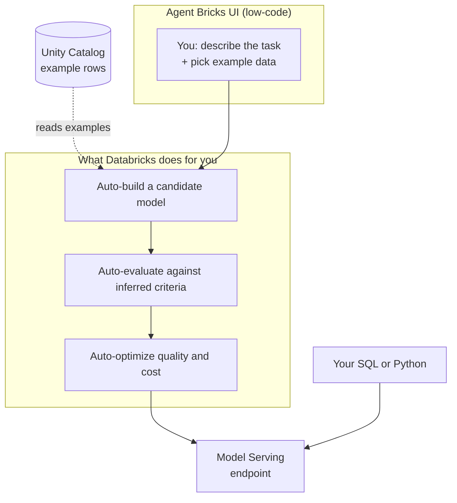

# Agent Bricks: Custom LLM & Document Processing

> Two more low-code Agent Bricks doors: one builds a specialist model for a single repeated text job, and one is an assembly line that reads messy documents and hands you a clean spreadsheet.

Think about the difference between a general handyman and a specialist. The handyman can do a bit of everything, which is wonderful when your problems keep changing. But if you had the *exact same* small repair to do a thousand times a day, you would not hire a general handyman for each one. You would train one person to do that single repair perfectly, quickly, and cheaply. That is the whole idea behind the first tool in this lesson.

And think about a pile of paperwork on a desk: crumpled forms, scanned PDFs, photos of receipts. Somebody has to read each one and type the important bits into a spreadsheet. That tedious, error-prone job is exactly what the second tool automates.

You already met the four Agent Bricks offerings in the overview lesson. This lesson finishes the tour by going deep on the two we have not covered yet: **Custom LLM** and **Intelligent Document Processing (IDP)**. Both are low-code, both are auto-optimized, and both are very beginner-friendly. You have got this.

## Learning Objectives

By the end of this lesson, you will be able to:

- Explain in plain English what a Custom LLM is and when a purpose-built model beats a general one.
- Describe the five kinds of text task a Custom LLM handles (classify, extract, summarize, transform, generate).
- Explain what Intelligent Document Processing does, stage by stage: parse, extract, classify.
- Connect IDP to the SQL AI Functions (`ai_parse_document`, `ai_extract`, `ai_classify`) you met earlier, and to RAG ingestion.
- Query a deployed Custom LLM endpoint from SQL and from Python.
- Sketch an IDP pipeline that turns messy documents into governed Delta rows.

## Prerequisites

You will get the most out of this lesson if you have already worked through:

- [Agent Bricks: Low-Code Agents](/docs/building-agents/agent-bricks), which introduces all four offerings and the "describe it, feed it data, let Databricks build it" idea. This lesson assumes you have that big picture.
- [AI Functions: Enrich Data with SQL](/docs/llm-foundations/ai-functions), because IDP is essentially those same SQL functions, packaged into a guided, low-code pipeline.

If either of those feels fuzzy, that is okay. The core ideas here stand on their own, and we will re-explain the important bits as we go.

## Estimated Reading Time

About 16 to 20 minutes.

## Business Motivation

Let's ground both tools in real work at two fictional companies.

**Cascade Mutual** is an insurance company. Every day, thousands of **claim forms** arrive: some as clean PDFs, some as phone photos of paper forms, some as scanned faxes (yes, still). Two painful jobs follow. First, a team of people reads each form and types the key fields (claimant name, policy number, date of loss, amount claimed) into a system. Second, another task keeps coming up: every incoming support message needs to be sorted by topic so it reaches the right team. Both jobs are high-volume, repetitive, and expensive to do by hand.

**Northwind Trust**, the asset manager you met earlier, has a similar headache with **account-opening documents**: identity documents, signature forms, and disclosures that must be read, checked, and filed.

Here is the insight that makes this lesson matter for your career. When you have *one narrow task repeated at high volume*, you do not need a big, general, expensive model reasoning from scratch every time. A small, purpose-built model that has been tuned for that one job is often **higher quality and cheaper**. That is Custom LLM. And when the raw input is *messy documents*, you need something that reliably turns them into clean, structured data before anyone can use them. That is IDP. Together they cover a huge slice of real enterprise work.

## Intuition

Two everyday pictures to hold in your head.

**Custom LLM is training one specialist for a repeated job.** Imagine you run a busy mailroom. Instead of asking a brilliant generalist to figure out where each letter goes from first principles every single time, you train one clerk who does nothing but sort mail into the right bins, all day, extremely well. You showed that clerk a stack of already-sorted examples, and now they are fast, consistent, and cheap. A Custom LLM is that trained clerk, but for a text task.

**IDP is an assembly line that reads a pile of forms and hands you a clean spreadsheet.** Messy documents go in one end. Along the belt, one station flattens each document into readable text and tables, another station pulls out the specific fields you care about, and another station stamps each document with a category. Clean, structured rows come out the other end, ready for you to query. You did not read a single page by hand.

Keep those two pictures close. Everything below is just detail on top of them.

## Theory

Let's put slightly more precise words on each tool, one idea at a time.

### Custom LLM

**A Custom LLM is an auto-optimized model built for one specific, repeated text task.** You do not write model code. In the Databricks UI you describe the task in plain language, point at some example data, and Databricks builds, evaluates, and tunes a specialized model for you, then deploys it as an endpoint.

It is designed for a single **text task**, and the common shapes are:

- **Classify** — sort text into categories. "Which team should this support ticket go to?"
- **Extract** — pull specific facts out of free text. "Find the order number and the complaint reason in this email."
- **Summarize** — shorten text while keeping the point. "Give me a two-line summary of this call transcript."
- **Transform** — rewrite text into a different form. "Turn these rough notes into a polished paragraph."
- **Generate** — produce new text from inputs. "Write a press release from these bullet points."

The payoff: for one narrow, high-volume job, a tuned specialist can beat a general model on both **quality** and **cost**.

### Intelligent Document Processing (IDP)

**IDP is a low-code pipeline that turns messy documents into structured data.** It has three main stages you will care about:

- **Document parsing** — take a PDF, image, scan, or slide and turn it into structured text, tables, and figure descriptions. This is the "flatten the mess into readable content" step.
- **Information extraction** — pull out the specific fields you define in a schema (for example: `claimant_name`, `policy_number`, `amount`).
- **Classification** — assign each document to a category (for example: `auto_claim`, `home_claim`, `medical_claim`). It can handle a large number of labels, hundreds of categories if you need them.

Everything runs inside Unity Catalog and lands in **Delta** tables, so the output is clean, governed data that you, a data engineer, can immediately query and join.

:::note Going deeper (optional)
IDP is the guided, low-code packaging of AI Functions you already met in SQL. Under the hood the stages map to `ai_parse_document` (parse), `ai_extract` (extract), and `ai_classify` (classify). There is also an `ai_prep_search` step (in Beta at the time of writing) that chunks parsed documents for semantic search. If you ever outgrow the guided UI, you can drop down and call these functions directly in SQL. Same engine, more control.
:::

## Deep Dive

Let's slow down on the decision that trips up beginners: **which of these two do I reach for?** They sound similar because both process text, but they solve different problems.

Ask yourself two questions.

1. **Is my input a messy document (PDF, scan, image, form)?** If yes, you almost certainly start with **IDP**, because you first need to turn that mess into clean data.
2. **Do I have one narrow, repeated text task on data that is already text?** If yes, reach for **Custom LLM**.

They also team up beautifully. A very common real pattern at Cascade Mutual: **IDP first** turns the claim-form PDFs into clean rows with a `claim_description` text column, and **Custom LLM second** classifies each `claim_description` by fraud risk. IDP cleans the input, Custom LLM does the specialized judgment. You do not have to choose one forever.

Here is a quick comparison table.

| Question | Custom LLM | Intelligent Document Processing |
| --- | --- | --- |
| What is the input? | Text you already have (in a table) | Messy documents (PDF, image, scan) |
| What does it produce? | A tuned model behind an endpoint | Clean, structured Delta rows |
| Best for | One narrow, repeated text task | Reading documents into data |
| Core verbs | classify, extract, summarize, transform, generate | parse, extract, classify |
| You give it | A task description + examples | Documents + a field schema / categories |

One more clarification, because the word "extract" appears in both. In **Custom LLM**, extraction pulls facts out of a text column you already have. In **IDP**, extraction pulls fields out of a *document* you first had to parse. Different starting point, similar spirit.

## Architecture

Where do these sit in the Databricks world you already know? Neither is a separate island. Both are friendly front doors onto the same governed platform: your data in **Unity Catalog**, results in **Delta**, and (for Custom LLM) a **Model Serving** endpoint.

Here is the IDP pipeline, the diagram you will want to remember.



<p align="center"><em>Diagram 1: The IDP assembly line. Messy documents go in, get parsed into structured text and tables, then fields are extracted and each document is classified. Clean, governed rows land in Delta for anything downstream.</em></p>

Now the Custom LLM shape, which is the familiar Agent Bricks flow.



<p align="center"><em>Diagram 2: Custom LLM follows the standard Agent Bricks flow. You describe the task and point at example rows in Unity Catalog; Databricks auto-builds, auto-evaluates, and auto-optimizes a specialized model and deploys it as an endpoint you query from code.</em></p>

The key takeaway: your data never leaves the governed platform. IDP outputs land in Delta; a Custom LLM becomes a standard Model Serving endpoint. Same building blocks you have used all course.

## Internal Working

You do not need the internals to use either tool, but a light peek makes the "auto" words feel less like magic.

**For Custom LLM**, after you click Create:

1. **It reads your task description and example data.** From your plain-language task and your example rows, it figures out what a good output looks like.
2. **It infers evaluation criteria.** Instead of asking you to hand-write test cases, it derives a yardstick from your data and guidelines.
3. **It builds and tunes candidate models.** This is the specialization step. Databricks compares strategies, which can include fine-tuning a foundation model, and scores each against the criteria from step 2.
4. **It keeps the best-scoring setup and deploys it** as a governed Model Serving endpoint you can query.

**For IDP**, each document flows through stages that call the AI Functions in sequence: parse turns the file into structured text and tables, extract reads your schema and pulls those fields, classify assigns a category. Each stage's output feeds the next without you writing glue code, and the final result is written to Delta.

:::note Going deeper (optional)
Databricks recommends giving a Custom LLM a decent amount of example data, on the order of 100 or more representative inputs, so the optimizer has enough to learn from. You can build one with as few as around three manual examples to try it out, but more representative examples generally mean a better-tuned, more accurate model. Optimization compares multiple strategies and can take several hours to finish; that is normal and it runs for you in the background.
:::

## Step-by-Step Walkthrough

Let's walk through what building each one *feels* like. Both are UI flows, so imagine clicking along. No code yet.

**Building a Custom LLM** to classify Cascade Mutual's support messages by topic:

1. **Open Agent Bricks and pick Custom LLM.** In the workspace left navigation, choose the Custom LLM offering.
2. **Describe the task in plain language.** For example: "Classify each incoming support message into one of: `billing`, `claims`, `policy_change`, `technical`, `other`."
3. **Point at example data.** Select a Unity Catalog table of past messages. Pick the input column (the message text) and, if you have them, the output column (the correct label). Labeled examples help a lot.
4. **Name your agent** (say, `cascade-ticket-classifier`) and click Create.
5. **Let it build, evaluate, and optimize.** Databricks tunes a specialized model and shows you a quality report.
6. **Test it in the UI**, review the quality report, add more examples if quality is not high enough, and re-run.
7. **Use the endpoint.** When you are happy, the model is a governed endpoint you call from SQL or Python.

**Building an IDP pipeline** to process Cascade Mutual's claim forms:

1. **Ingest the documents.** Land the PDFs, scans, and images in a Unity Catalog volume (a Lakeflow pipeline can do this on a schedule).
2. **Parse.** Apply document parsing to turn each file into structured text and tables.
3. **Define your extraction schema.** List the fields you want: `claimant_name`, `policy_number`, `date_of_loss`, `amount_claimed`.
4. **Add classification categories.** For example: `auto_claim`, `home_claim`, `medical_claim`.
5. **Run the pipeline.** Each document is parsed, its fields extracted, and its category assigned.
6. **Read the Delta output.** The results are clean rows in a governed Delta table, ready for you to query, join, and feed downstream.

Notice what you did *not* do in either flow: no model code, no OCR wiring, no parsing library to babysit. That is the low-code promise.

## Hands-on Examples

Two concrete scenarios to make it stick.

**Scenario A (Custom LLM): Northwind Trust summarizing call transcripts.** Northwind records support calls and already has transcripts as text in a table. They have one repeated job: produce a two-sentence summary of each call for the account record. That is a single, narrow, high-volume text task, a perfect Custom LLM fit. They describe the summarize task, point at a table of transcripts, and deploy `northwind-call-summarizer`. Now every new transcript can be summarized in a batch SQL query overnight, cheaply.

**Scenario B (IDP then Custom LLM together): Cascade Mutual end to end.** First, IDP parses the incoming claim-form PDFs and extracts fields into a Delta table `claims_structured`, including a free-text `claim_description` column. Then a Custom LLM (`cascade-fraud-triager`) reads `claim_description` and classifies each claim into `low_risk`, `review`, or `high_risk`. The messy PDFs became clean rows, and the specialized model added a judgment column, all governed, all in the Lakehouse.

## Code Examples

Wait, code? For low-code tools? Here is the distinction that trips up beginners:

> You **build** both tools in the **UI**. But their results, a Custom LLM endpoint and IDP's Delta output, are things you **use** from ordinary code and SQL.

So there is no "model code" to show. What you write is the code that *calls* the endpoint or *reads* the output. Let's narrate each block.

**Option A: Query a deployed Custom LLM with SQL using `ai_query`.** This is lovely because you can classify a whole table in one statement, no Python needed.

```sql
-- Classify a whole table of support messages using the deployed Custom LLM.
SELECT
  message_id,
  message_text,
  ai_query(
    'cascade-ticket-classifier',   -- the endpoint name from the Agent Bricks UI
    message_text                   -- the input text for each row
  ) AS predicted_topic
FROM cascade.support.incoming_messages;
```

Step by step: `ai_query` takes your endpoint name as the first argument and the input text as the second. Because this is plain SQL, Databricks runs the model across *every row* of the table at once and returns a new `predicted_topic` column. This is the efficient, batch-friendly way to use a Custom LLM, far better than looping one call at a time.

**Option B: Query the same endpoint from Python with the OpenAI-compatible client.** Agent Bricks endpoints speak the widely used OpenAI chat format, so this looks like any chat call you have made.

```python
# Query the deployed Custom LLM endpoint from Python.
from openai import OpenAI

client = OpenAI(
    api_key="dapi-your-databricks-token",   # your Databricks token (keep it secret)
    base_url="https://YOUR-WORKSPACE.databricks.com/serving-endpoints",
)

response = client.chat.completions.create(
    model="cascade-ticket-classifier",       # the endpoint name from the UI
    messages=[
        {"role": "user",
         "content": "My auto-pay was charged twice this month, please help."}
    ],
)

print(response.choices[0].message.content)   # e.g. "billing"
```

Narrating the Python: you create a `client` pointed at your workspace's `serving-endpoints` URL, set `model` to your Custom LLM's endpoint name, send the input text in the `messages` list, and read the answer off `response.choices[0].message.content`. To your code, a Custom LLM is just another chat endpoint.

**Option C: Read IDP's structured output from Delta.** Remember that IDP is built in the UI, but its result is a normal Delta table. So "using IDP" from a data engineer's seat is just querying that table.

```sql
-- IDP already parsed, extracted, and classified the claim forms into Delta.
-- Here we just read the clean, structured rows like any other table.
SELECT
  claimant_name,
  policy_number,
  date_of_loss,
  amount_claimed,
  claim_category           -- assigned by the classification stage
FROM cascade.claims.claims_structured
WHERE claim_category = 'auto_claim'
  AND amount_claimed > 10000;
```

The point of this block: the messy PDFs are gone. What is left is queryable, joinable, governed data. That is the whole payoff of IDP for a data engineer.

**Optional: the SQL cousins of IDP.** If you ever want the parsing step directly (for example, to feed a RAG pipeline), you can call the AI Function yourself.

```sql
-- The parse stage, as a direct SQL function call (IDP's low-code cousin).
-- Turns each document file into structured text and tables.
SELECT
  path,
  ai_parse_document(content) AS parsed   -- structured text, tables, figures
FROM READ_FILES('/Volumes/cascade/claims/raw_pdfs/', format => 'binaryFile');
```

Narrating this: `READ_FILES` reads the raw document bytes from a Unity Catalog volume, and `ai_parse_document` turns each file into structured content. This is exactly the first station of the IDP assembly line, exposed as a function. The parsed text is also what feeds RAG ingestion: parse first, then chunk, then index, as you saw in the RAG lessons.

:::note Going deeper (optional)
The exact `base_url`, token type, and whether you use a personal access token versus an OAuth machine identity depend on your workspace setup. Treat those values as placeholders; your Databricks admin gives you the real workspace URL and the right credential. The *shape* of the call, endpoint name plus input, stays the same.
:::

## Production Considerations

Even though these tools do the heavy lifting, shipping to real users is still your job.

- **Test before you trust.** Review the Custom LLM quality report and spot-check IDP output with a human who knows the documents. Auto-evaluation is a great start, not a final sign-off.
- **Keep it fresh.** A Custom LLM reflects the examples you gave it; if the world shifts (new ticket types, new form layouts), add examples and re-optimize.
- **Name endpoints and tables clearly.** Stable names like `cascade-ticket-classifier` and `claims_structured` keep downstream apps and queries from breaking.
- **Schedule the pipeline.** For high volume, run IDP and batch `ai_query` on a schedule with Lakeflow rather than one document at a time.
- **Handle the hard cases.** Some documents will be too blurry or too unusual. Plan a human-review lane for low-confidence extractions rather than trusting every row blindly.

## Performance Considerations

- **A specialist can be faster and cheaper than a generalist.** That is the point of Custom LLM: for one narrow task, a tuned model often gives higher quality at lower cost per call than a big general model.
- **More examples usually means better quality.** Databricks suggests around 100 or more representative inputs for a Custom LLM. Start with what you have and add more over time.
- **Batch, do not loop.** Calling `ai_query` across a whole table is far more efficient than a Python loop making one request per row.
- **Optimization takes time up front.** Building or re-optimizing a Custom LLM can take several hours. That is a one-time cost that pays off across millions of fast, cheap calls later.
- **Parsing scans is heavier than parsing clean PDFs.** Low-quality images take more work and may extract less reliably. Budget for it.

## Security Considerations

- **Governance comes along for free-ish.** Both tools build on Unity Catalog, so data access, lineage, and permissions use the same system you already know. IDP keeps documents in place; nothing is shipped to an outside service.
- **Protect your tokens.** The token in the Python example is a secret. Never hard-code it in a notebook or commit it to git. Use Databricks secrets or a secure environment variable.
- **Mind sensitive fields in documents.** Claim forms and account-opening docs contain personal data. Control who can read the resulting Delta tables and consider masking sensitive columns.
- **Least privilege on endpoints.** Grant query access to a Custom LLM endpoint only to the apps and people that need it.

## Common Mistakes

- **Using a Custom LLM for a moving target.** It shines on *one narrow, stable* task. If the task keeps changing shape, a general model or an agent may fit better.
- **Feeding IDP one document at a time by hand.** It is a pipeline. Point it at a volume and let it process in bulk on a schedule.
- **Skipping evaluation because it is "auto."** Auto-generated evals are a starting point. A human who knows the domain should still spot-check.
- **Too few or unrepresentative examples.** Three examples get you a demo, not a tuned model. Give a Custom LLM enough varied, real examples.
- **Confusing the two extractions.** Custom LLM extraction works on text you already have; IDP extraction works on documents you first parse. Pick the tool that matches your *input*.
- **Trusting every extracted field blindly.** Messy scans produce mistakes. Build a review lane for low-confidence rows.

## Best Practices

- **Match the tool to the input.** Messy documents to clean data → IDP. One narrow, repeated text task on existing text → Custom LLM.
- **Chain them when it helps.** IDP to clean the input, then Custom LLM for the specialized judgment. That combo covers a lot of real work.
- **Give a Custom LLM plenty of representative examples,** and add more over time to lift quality.
- **Define a clear extraction schema and clear categories** so IDP knows exactly what to pull and how to sort.
- **Batch with `ai_query`** for high-volume scoring, and schedule pipelines with Lakeflow.
- **Use stable names** for endpoints and output tables so downstream code does not break.
- **Reuse parsed output for RAG.** The parse step is also step one of RAG ingestion; do not parse twice.

## Interview Questions

1. **What is a Custom LLM in Agent Bricks, and when would you use one instead of a general model?**
   A Custom LLM is a low-code, auto-optimized model built for one specific, repeated text task (classify, extract, summarize, transform, or generate). You describe the task and provide example data, and Databricks builds, evaluates, tunes, and deploys a specialized model. You use it when you have one narrow, high-volume task where a purpose-built model can beat a general model on both quality and cost.

2. **What is Intelligent Document Processing, and what are its main stages?**
   IDP is a low-code pipeline that turns messy documents (PDFs, images, scans) into structured data. Its main stages are document parsing (file into structured text, tables, and figures), information extraction (pull schema-defined fields), and classification (assign each document a category, supporting many labels). Output lands in governed Delta tables.

3. **How does IDP relate to the SQL AI Functions?**
   IDP is the guided, low-code packaging of AI Functions. Its stages map to `ai_parse_document` (parse), `ai_extract` (extract), and `ai_classify` (classify), with an `ai_prep_search` step for chunking. If you outgrow the UI, you can call these functions directly in SQL for more control.

4. **You built a Custom LLM in the UI. How does an application use it?**
   It is deployed as a governed Model Serving endpoint. You query it from code by endpoint name, either with `ai_query` in SQL (great for scoring a whole table at once) or with the OpenAI-compatible chat client in Python. Build in the UI, call from code.

5. **Give an example where Custom LLM and IDP work together.**
   Cascade Mutual uses IDP to parse claim-form PDFs and extract fields into a Delta table with a free-text description column, then a Custom LLM classifies each description by fraud risk. IDP cleans the input into structured data; the Custom LLM adds the specialized judgment. Neither required hand-written model code.

## Quiz

**Question 1:** In one sentence, what is a Custom LLM best for?

<details>

<summary>Show answer</summary>

One narrow, repeated text task (classify, extract, summarize, transform, or generate), where a purpose-built, auto-optimized model can be higher quality and cheaper than a general model.

</details>

**Question 2:** Cascade Mutual has thousands of scanned claim-form PDFs and needs the claimant name, policy number, and amount pulled into a table. Which tool, and what are the stages?

<details>

<summary>Show answer</summary>

Intelligent Document Processing. It parses each PDF into structured text and tables, extracts the schema-defined fields (claimant name, policy number, amount), and can also classify each form by type. The result lands as clean rows in a governed Delta table.

</details>

**Question 3:** True or false: because both tools are low-code, you can never use their output from your own SQL or Python.

<details>

<summary>Show answer</summary>

False. You *build* them in the UI, but the outputs are ordinary things you use from code: a Custom LLM becomes a Model Serving endpoint you query with `ai_query` or the OpenAI client, and IDP writes clean rows to a Delta table you query like any other.

</details>

**Question 4:** Which SQL AI Function corresponds to IDP's parsing stage, and why does it also matter for RAG?

<details>

<summary>Show answer</summary>

`ai_parse_document`. It turns a document file into structured text and tables. It matters for RAG because parsing is the first step of ingestion: you parse a document, then chunk it, then index it for retrieval. The same parsed output can feed both IDP extraction and RAG chunking.

</details>

## Summary

This lesson finished the Agent Bricks tour with its two remaining offerings. **Custom LLM** is a low-code, auto-optimized model for one narrow, repeated text task, classify, extract, summarize, transform, or generate. You describe the task, point at example data, and Databricks builds, evaluates, tunes, and deploys a specialist that can beat a general model on quality and cost. **Intelligent Document Processing** is an assembly line that turns messy documents into structured data through three stages, parse, extract, and classify, and writes clean, governed rows to Delta. IDP is the guided packaging of the SQL AI Functions you already met, and its parsing step is also the front of RAG ingestion. The two tools chain naturally: IDP cleans messy input into data, and a Custom LLM adds specialized judgment on top. Both are built in the UI and used from ordinary SQL and Python.

## Key Takeaways

- **Custom LLM = train one specialist for a repeated text job.** Auto-optimized, often higher quality and cheaper than a general model for that one task.
- **IDP = an assembly line for messy documents.** Parse into text and tables, extract schema fields, classify into categories, output clean Delta rows.
- **IDP is AI Functions, packaged.** Parse → `ai_parse_document`, extract → `ai_extract`, classify → `ai_classify`. Parsing also feeds RAG chunking.
- **Match the tool to the input.** Messy documents → IDP. One narrow text task on existing text → Custom LLM. Chain them when it helps.
- **Build in the UI, use from code.** Query a Custom LLM with `ai_query` or the OpenAI client; read IDP output straight from Delta.

## Glossary

- **Custom LLM** — an Agent Bricks offering: a low-code, auto-optimized model built for one specific, repeated text task (classify, extract, summarize, transform, generate), deployed as an endpoint.
- **Intelligent Document Processing (IDP)** — an Agent Bricks offering that turns messy documents into structured Delta data through parsing, extraction, and classification.
- **Document parsing** — turning a PDF, image, scan, or slide into structured text, tables, and figure descriptions; the first IDP stage.
- **Information extraction** — pulling schema-defined fields out of a document or text.
- **Classification** — assigning a category label to a document or piece of text; can handle many labels.
- **`ai_parse_document`** — the SQL AI Function that parses a document file into structured content; IDP's parse stage.
- **`ai_extract` / `ai_classify`** — the SQL AI Functions behind IDP's extraction and classification stages.
- **`ai_query`** — a Databricks SQL function that sends input to a serving endpoint (including a Custom LLM) and returns the response; ideal for batch scoring a table.
- **Model Serving endpoint** — the deployed, queryable home of a model or agent on Databricks.
- **Delta table** — the governed, structured table format where IDP writes its clean output.

## Further Reading

- [Custom LLM in Agent Bricks (Databricks docs)](https://docs.databricks.com/aws/en/generative-ai/agent-bricks/custom-llm)
- [Intelligent Document Processing (Databricks docs)](https://docs.databricks.com/aws/en/generative-ai/agent-bricks/intelligent-document-processing)
- [Agent Bricks overview (Databricks docs)](https://docs.databricks.com/aws/en/generative-ai/agent-bricks/)

## Next Lesson

➡️ [Part 4 · Interview Prep](/docs/building-agents/interview-prep)
