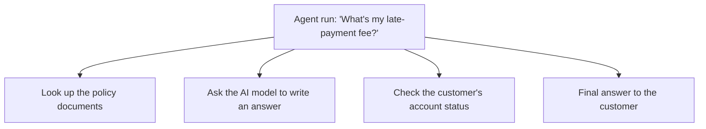
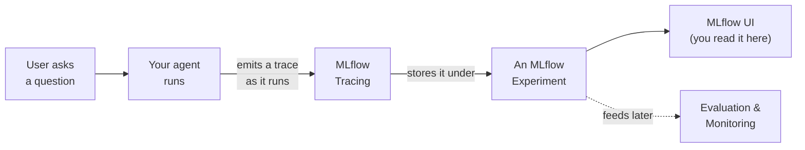
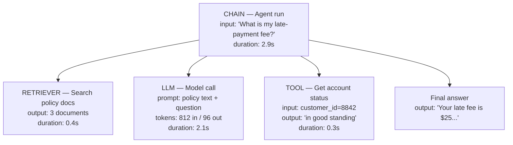

# MLflow Tracing: Your Agent's Flight Recorder

> Your agent gave a weird answer. A customer noticed. Now someone asks you: "What actually happened in there?" Wouldn't it be nice to have a recording of every single step the agent took, in order, with timestamps? That recording exists. It's called a trace.

You already know this feeling from data engineering. When a pipeline produces a bad row, you don't guess. You open the logs, you look at the query plan, you trace the row back through each transformation. You want the same thing for an AI agent. MLflow Tracing gives it to you, and reading a trace is a skill you can pick up in the next few minutes. No prior AI knowledge needed. If you can read a nested to-do list, you can read a trace.

## Learning Objectives

By the end of this lesson, you will be able to:

- Explain what an MLflow **trace** is and how it relates to a single run of your agent.
- Read a trace as a tree of **spans**, where each span is one step.
- Answer real debugging questions from a trace: what the retriever returned, and what exact prompt the model saw.
- Recognize the common **span types** (LLM, RETRIEVER, TOOL, CHAIN) and what each one means.
- Find where traces live (the MLflow UI, attached to an experiment) and pull basic numbers like token usage and latency from a span.

## Prerequisites

- [Why Observability Matters for AI](/docs/tracing/why-observability) — the "why" behind everything in this lesson.
- [Authoring an Agent with ResponsesAgent](/docs/building-agents/authoring-agents) — so the word "agent" already means something concrete to you.

You do **not** need to know how to turn tracing on yet. That is the next lesson. Here, we just learn to read what tracing produces. Think of it as learning to read a receipt before learning to run the cash register.

## Estimated Reading Time

About 15 minutes.

## Business Motivation

Let's be honest about why this matters, in plain business terms.

An AI agent is a black box by default. You send it a question, you get an answer. When the answer is wrong, expensive, or slow, "the agent did it" is not an explanation your team, your auditor, or your customer will accept.

Tracing turns that black box into a glass box. With a trace you can:

- **Debug faster.** Instead of re-running the agent ten times and squinting, you open one trace and see exactly which step went wrong.
- **Control cost.** Model calls cost money per token. A trace shows you token usage per step, so you can spot the step that is burning your budget.
- **Prove what happened.** For a regulated business like our running example, **Northwind Trust** (a financial services firm), being able to show *exactly* which documents an agent used to answer a customer is not a nice-to-have. It's compliance.
- **Build on it later.** Traces are the raw material for evaluation (Part 6) and production monitoring. If you can read a trace now, those later topics will feel easy.

:::note
Throughout this lesson we'll use **Northwind Trust**, a fictional financial services company whose support agent answers customer questions about their accounts and policies. It's just a friendly stand-in so the examples feel real.
:::

## Intuition

Here is the whole idea in one picture you already understand: **an itemized receipt.**

When you buy groceries, the receipt doesn't just say "you spent 47 dollars." It lists every item, its price, and adds up to the total. You can scan it and instantly see the one item that seemed too expensive.

A trace is an itemized receipt for one run of your agent. The "total" is the final answer. The "line items" are the individual steps the agent took to get there, each with its own inputs, outputs, and how long it took.

There's one twist: the steps are **nested**, like a to-do list with sub-tasks.



<p align="center"><em>Figure 1: One agent run, broken into the steps it took. Read it top to bottom, like a to-do list of what actually ran.</em></p>

That's it. A trace is the receipt. Each step on the receipt is called a **span**. Now let's give these plain words their real names.

## Theory

Two terms carry this entire lesson. Learn these two and you're most of the way there.

**Trace** — the record of *one complete run* of your GenAI app or agent. One question in, one answer out, one trace. If a customer asks Northwind's agent three questions, you get three traces.

**Span** — *one step* inside that run. A span captures four things about that step:

1. Its **inputs** (what went in)
2. Its **outputs** (what came out)
3. Its **timing** (when it started, how long it took)
4. Its **metadata** (extra details; for model-call steps this includes **token usage**)

Spans are arranged in a **tree**. The whole run is the root. Each step hangs off it, and steps can have their own sub-steps. That nesting is what makes a trace so readable: it shows you not just *what* ran, but *in what order* and *inside what*.

An easy way to hold both words in your head:

- A **trace** is the whole story.
- A **span** is one sentence in that story.

## Deep Dive

Spans come in **types**, and the type tells you what kind of work that step did. You'll see four types constantly. Here they are in plain words.

| Span type | Plain-English meaning | Northwind example |
|-----------|----------------------|-------------------|
| **CHAIN** | A step that *coordinates* other steps. A container. | The top-level "handle this customer question" step. |
| **RETRIEVER** | A step that *searches for and returns documents.* | "Find the policy pages about late fees." |
| **LLM** | A step that *calls the AI model* — sends a prompt, gets text back. | "Ask the model to write the answer." |
| **TOOL** | A step that *runs a function or calls an external system.* | "Look up this customer's account balance." |

You do not need to memorize this table. Just know that when you open a trace, each span will be labeled, and the label tells you what kind of step you're looking at. A RETRIEVER span is where you go to see *what documents were found*. An LLM span is where you go to see *the exact prompt and the model's reply* (and the token count).

:::note Going deeper (optional)
Span types are not just labels — some Databricks and MLflow features key off them. For example, the retrieval-quality parts of evaluation know to look at `RETRIEVER` spans specifically. So the type is both a hint for you and a signal for the tooling. You can skip this detail for now; it becomes relevant in the evaluation lessons.
:::

## Architecture

Where do traces come from, and where do they go? Here's the flow at a high level.



<p align="center"><em>Figure 2: A trace is produced automatically as your agent runs, saved to an MLflow experiment, and viewed in the MLflow UI. The same stored traces later power evaluation and monitoring.</em></p>

The key points:

- Traces are **attached to an experiment**. An MLflow experiment is just a named folder that groups related runs together — the same experiments concept you may know from classic ML tracking.
- You read traces in the **MLflow UI**, which is built into your Databricks workspace. There's a dedicated Traces view where each row is one trace, and clicking one opens the span tree.
- The same traces are the **foundation for later parts** of this course: evaluation scores agents by looking at their traces, and production monitoring watches traces from live traffic.

MLflow Tracing is part of **MLflow 3 for GenAI**, and it integrates with Model Serving and the review app, so traces from a deployed agent land in the same place as traces from your laptop.

## Internal Working

Let's peek at what a single trace looks like as a tree, using a realistic Northwind run. This is the diagram to really study.



<p align="center"><em>Figure 3: A trace tree for one Northwind agent run. The root CHAIN span contains the steps it ran: retrieve documents, call the model, call a tool, and produce the final answer. Each span shows its own inputs, outputs, timing, and (for the model call) token usage.</em></p>

Read that tree the way you'd read a nested to-do list:

- The **root** is the whole run. It took 2.9 seconds total.
- Under it, the **RETRIEVER** span found 3 documents in 0.4 seconds. If the agent's answer cited a wrong policy, *this is the span you open* — it shows you the exact documents that came back.
- The **LLM** span is the model call. It shows the prompt that was sent (the policy text plus the question) and the reply. It also shows 812 input tokens and 96 output tokens. *This is where you check both the exact prompt and the cost.*
- The **TOOL** span called a function to fetch the account status. Inputs and outputs are right there.
- Notice the durations add up to the story: the model call (2.1s) is by far the slowest step. If this agent felt sluggish, now you know why without guessing.

This is the superpower. You are no longer asking "why did the agent do that?" You are *reading* what it did.

## Step-by-Step Walkthrough

Here's how you'd actually use a trace to answer two real questions. No code yet — just the mental steps.

**Question 1: "What documents did the retriever actually return?"**

1. Open the Traces view in the MLflow UI.
2. Click the trace for the run you care about.
3. In the span tree, find the span labeled **RETRIEVER**.
4. Click it and read its **output**. That's the exact list of documents the agent had to work with.

If the answer was wrong and the right document *isn't* in that list, your problem is retrieval, not the model. That single insight saves hours.

**Question 2: "What exact prompt did the model see?"**

1. Same trace, same span tree.
2. Find the span labeled **LLM**.
3. Read its **input**. That's the literal prompt sent to the model — every instruction and every piece of context, exactly as the model received it.
4. While you're there, read the **token usage** in its metadata to see what that step cost.

If the prompt is missing context you assumed was there, you've found your bug. The model can only answer with what it was given.

## Hands-on Examples

Let's walk through a story end to end, the way it happens on a real team.

A Northwind customer complains: "The agent told me my late fee was 25 dollars, but it's actually 35." You open the trace for that conversation.

- You click the **RETRIEVER** span. It returned three documents. You read them — and one is an *old* fee schedule from last year that still says 25 dollars. 
- You click the **LLM** span. The prompt included that old document, so the model faithfully repeated 25 dollars. The model wasn't "wrong" — it answered correctly from bad input.
- **Diagnosis:** the knowledge base has a stale document. The fix is in the data, not the agent. You never would have known that by re-running the agent and shrugging.

That's the whole value of tracing in one story: it points you at the *real* cause.

## Code Examples

Good news: once tracing is enabled, traces appear **automatically** — you don't write logging code for every step. (Enabling it is the next lesson; here we just look at the results.)

The examples below show how you'd fetch and read a trace programmatically, in a notebook, once traces exist. Read them as a taste, not a task.

```python
import mlflow

# Point at the experiment where your agent's traces are stored.
mlflow.set_experiment("/Users/you/northwind-support-agent")

# Pull the most recent traces for this experiment as a table.
traces = mlflow.search_traces(max_results=5)

# Each row is one run of the agent. Peek at the columns available.
print(traces.columns.tolist())
```

Let's read what just happened. We told MLflow which experiment to look in — remember, traces live attached to an experiment. Then `search_traces` handed us back a table where **each row is one trace** (one agent run). We printed the column names so we can see what's available to inspect. Nothing here creates traces; we're only *reading* ones that already exist.

```python
# Grab a single trace object to look inside it.
trace = mlflow.get_trace(traces.iloc[0]["trace_id"])

# A trace holds a list of spans. Walk them and print the essentials.
for span in trace.data.spans:
    print(span.name, "|", span.span_type)
```

Here we pulled one specific trace by its ID, then looped over `trace.data.spans` — that's the list of steps we drew as a tree. For each span we printed its name and its **type** (the LLM / RETRIEVER / TOOL / CHAIN label from earlier). This is the code version of scanning the span tree in the UI.

```python
# Find the model-call span and read its cost and speed.
for span in trace.data.spans:
    if span.span_type == "LLM":
        usage = span.get_attribute("mlflow.chat.tokenUsage")
        latency_ms = (span.end_time_ns - span.start_time_ns) / 1_000_000
        print("Tokens:", usage)
        print(f"Latency: {latency_ms:.0f} ms")
```

This last snippet zeroes in on the **LLM** span — the model call — and pulls out two numbers you'll care about constantly: **token usage** (what the step cost) and **latency** (how long it took, computed from the span's start and end times). Those are exactly the numbers we read off Figure 3 by eye. In code, they're right there on the span.

:::note Going deeper (optional)
Exact attribute keys and helper methods can shift a little between MLflow versions, and the MLflow UI shows token usage and latency without you writing any of this. Treat the code as illustrative of the *shape* of the data — a trace is a list of spans, and each span carries inputs, outputs, timing, and metadata. That mental model won't change even if a method name does.
:::

## Production Considerations

- **Traces from deployed agents land in the same place.** When your agent runs on Model Serving, its traces flow into MLflow just like they do from a notebook. Your reading skills transfer directly to production.
- **Volume grows fast.** A busy agent produces a lot of traces. In production you'll rely on the Traces view's filtering and on monitoring (a later lesson) rather than eyeballing every one.
- **Traces are your incident record.** When something goes wrong in production, the trace for that exact request is what you pull up. Treat traces as part of your operational toolkit, not just a dev-time toy.

## Performance Considerations

- **Tracing adds a small overhead.** Recording spans is lightweight, but it isn't free. For the vast majority of agents this cost is negligible compared to the model calls themselves — which, as Figure 3 showed, dominate the time.
- **Traces help you *find* performance problems.** The per-span durations tell you which step is slow. Usually it's a model call or a slow tool, and the trace points right at it.
- Don't prematurely disable tracing to "save time." The visibility is almost always worth far more than the overhead.

## Security Considerations

- **Traces capture real data.** Inputs, outputs, and prompts can contain customer information — for Northwind, that might be account details. Treat traces with the same care as any sensitive data store.
- **Access is governed.** Because traces live in your Databricks workspace tied to experiments, workspace access controls apply. Make sure only the right people can read traces that may contain sensitive content.
- **Be mindful of what you log.** When you get to instrumenting agents, you'll have choices about what goes into a span. Avoid stuffing secrets (like API keys) into span inputs or outputs.

## Common Mistakes

- **Confusing a trace with a span.** A trace is the *whole run*; a span is *one step* inside it. When someone says "look at the trace," they mean the whole tree.
- **Blaming the model for a retrieval problem.** If the answer is wrong, check the RETRIEVER span *first*. Often the model answered correctly from bad or missing documents.
- **Ignoring token usage until the bill arrives.** The cost is right there on the LLM span. Glance at it early.
- **Assuming the prompt is what you think it is.** Read the actual LLM span input. Prompts are often assembled from many pieces, and the assembled result can surprise you.
- **Forgetting traces are tied to an experiment.** If you can't find your traces, you're probably looking in the wrong experiment.

## Best Practices

- **Read the tree top-down, then dive.** Start at the root to get the shape of the run, then open the one span that looks suspicious.
- **Let the span type guide you.** Wrong facts? RETRIEVER span. Weird wording or ignored instructions? LLM span input. Broken lookup? TOOL span.
- **Check duration and tokens as a habit,** even when nothing's wrong. It builds intuition for what "normal" looks like, so anomalies jump out later.
- **Save interesting traces.** A trace that captures a real bug is gold for building evaluation cases later.
- **Name your experiments clearly** so traces are easy to find.

## Interview Questions

1. **What is the difference between a trace and a span in MLflow Tracing?**  
   A trace is the record of one complete run of a GenAI app or agent. A span is a single step within that run, capturing its inputs, outputs, timing, and metadata. Spans are organized into a tree under the trace.

2. **You have an agent that returns a factually wrong answer. Which span do you inspect first, and why?**  
   The RETRIEVER span, because it shows the exact documents the agent had to work with. If the correct information isn't in the retrieved documents, the problem is retrieval, not the model — the model can only answer from what it was given.

3. **Name the common span types and what each represents.**  
   CHAIN (a coordinating/container step), RETRIEVER (searches for and returns documents), LLM (calls the AI model with a prompt and gets text back), and TOOL (runs a function or calls an external system).

4. **Where are traces stored, where do you view them, and what else consumes them?**  
   Traces are attached to an MLflow experiment and viewed in the MLflow UI inside the Databricks workspace. The same traces are the foundation for evaluation and production monitoring.

5. **From a single trace, how would you find out both what a model step cost and how long it took?**  
   Open the LLM span. Its metadata includes token usage (input and output tokens, which map to cost), and its start and end times give you the latency for that step.

## Quiz

<details>
<summary>1. A customer asks the Northwind agent one question and gets one answer. How many traces are produced?</summary>

One. A trace corresponds to one complete run of the agent — one question in, one answer out.

</details>

<details>
<summary>2. Which four pieces of information does every span capture?</summary>

Inputs, outputs, timing (start time and duration), and metadata. For model-call (LLM) spans, the metadata also includes token usage.

</details>

<details>
<summary>3. You want to see the exact prompt that was sent to the AI model. Which span type do you open, and which part do you read?</summary>

Open the LLM span and read its input. That is the literal prompt the model received, including all instructions and context.

</details>

<details>
<summary>4. True or false: you have to write logging code for each step of your agent to get a trace.</summary>

False. Once tracing is enabled, traces appear automatically. Enabling tracing is covered in the next lesson; this lesson is only about reading the traces that result.

</details>

## Summary

An MLflow trace is a recording of one run of your agent — an itemized receipt of everything it did. The receipt's line items are spans: nested steps, each showing its inputs, outputs, timing, and (for model calls) token usage. Spans come in types — CHAIN, RETRIEVER, LLM, TOOL — and the type tells you what kind of step you're looking at and where to go for a given question. Traces live in the MLflow UI, attached to an experiment, and they're the foundation for the evaluation and monitoring you'll learn later. You now know how to read one, which is the skill everything else in Part 5 and Part 6 builds on.

## Key Takeaways

- A **trace** = one whole agent run; a **span** = one step inside it.
- A trace is a **tree of spans** — read it like a nested to-do list.
- Each span shows **inputs, outputs, timing, and metadata**; model calls also show **token usage**.
- **Span types** (CHAIN, RETRIEVER, LLM, TOOL) tell you what each step did and where to look.
- Traces live in the **MLflow UI**, tied to an **experiment**, and appear **automatically** once tracing is on.
- Traces are the **foundation for evaluation and monitoring** later.

## Glossary

- **Trace** — the record of one complete run of a GenAI app or agent.
- **Span** — a single step within a trace, capturing inputs, outputs, timing, and metadata.
- **Span type** — a label for what a step did: CHAIN, RETRIEVER, LLM, or TOOL.
- **LLM span** — a step that calls the AI model; shows the prompt, the reply, and token usage.
- **RETRIEVER span** — a step that searches for and returns documents.
- **TOOL span** — a step that runs a function or calls an external system.
- **CHAIN span** — a coordinating step that contains other steps.
- **Experiment** — a named MLflow container that groups related runs and their traces.
- **Token usage** — the count of input and output tokens for a model call; maps to cost.
- **Latency** — how long a step took, derived from its start and end times.
- **MLflow UI** — the interface in your Databricks workspace where you view traces.

## Further Reading

- [Databricks docs: MLflow Tracing for GenAI](https://docs.databricks.com/aws/en/mlflow3/genai/tracing/)

## Next Lesson

➡️ [Instrumenting Your Agent](/docs/tracing/instrumenting-agents) — now that you can *read* a trace, you'll learn how to *turn tracing on* so your own agents produce them.
