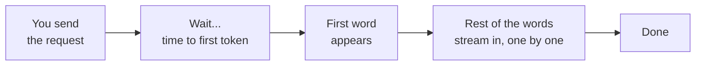
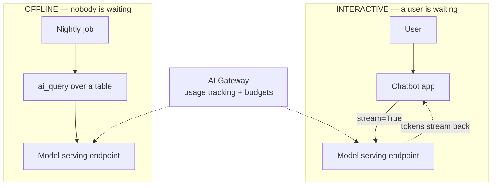

# Performance and Cost Tuning

> Your chatbot works. The demo was great. Then two things land in your inbox: a user says "it feels slow," and finance says "why did the AI line item triple last month?" Both are fixable, and neither needs a rewrite. They need the same instinct you already use on clusters and jobs: measure what's driving the number, then pull the right lever.

Take a breath. You do this every week. You look at a slow job and ask "where's the time actually going?" You look at a cloud bill and ask "what's the biggest line, and can I make it smaller?" Serving a model is the same game with new words. This lesson gives you the words and the levers. By the end, slow and expensive will feel like knobs you can turn, not mysteries.

## Learning Objectives

By the end of this lesson, you will be able to:

- Break latency into its two real parts: **time-to-first-token (TTFT)** and the **per-token streaming rate**.
- Explain why **output length** is the single biggest driver of total latency, because tokens are generated one at a time.
- Describe how **streaming** improves *perceived* speed without making the model any faster.
- Name the **tokens = the meter** rule: cost scales with input tokens plus output tokens.
- List and apply the main **cost levers**: shorter prompts, tight `max_tokens`, right-size the model, cache repeats, batch offline work with `ai_query`, choose pay-per-token vs provisioned throughput correctly, and scale-to-zero idle endpoints.
- Do a **back-of-envelope cost estimate** for a job before you run it.

## Prerequisites

- [Foundation Model APIs in Depth](/docs/serving/foundation-model-apis) — how you actually call a served model on Databricks.
- [Tokens and Tokenization](/docs/llm-foundations/tokens-and-tokenization) — tokens are both the speed unit and the billing unit, so this is the key one.
- [The Context Window](/docs/llm-foundations/context-window) — why prompt length has a ceiling and a cost.

You do **not** need to have tuned anything before. If you can read a query plan and spot the expensive step, you already have the mindset.

## Estimated Reading Time

About 17 minutes.

## Business Motivation

Let's be honest about why this matters, in plain business terms.

An AI feature that is slow or expensive is a feature that gets cut. Two forces push on you at once:

- **Speed keeps users.** For anything interactive, like a chatbot or an in-app assistant, waiting feels broken. If the answer takes six seconds to even *start*, people give up before it finishes. Perceived speed is a retention feature.
- **Cost decides whether it scales.** A prototype that costs a few cents per call feels free. Multiply by a million calls a night and it's a real budget line someone has to defend. The difference between a feature that ships to everyone and one that gets quietly capped is often just tuning.

Here's the good news. The levers are cheap to pull and mostly free of trade-offs when done thoughtfully. Trimming a bloated prompt, capping output length, and picking a right-sized model can cut a bill by more than half while making responses faster at the same time. Fast and cheap usually move together.

:::note
Throughout this lesson we'll use **Northwind Trust**, a fictional financial services company. They run a nightly job that summarizes thousands of support tickets, and an interactive chatbot that answers customer questions. We'll speed up the chatbot and trim the nightly bill.
:::

## Intuition

Two everyday pictures carry this whole lesson.

**Latency is like ordering food.** You place your order and wait. There's the time until the *first bite* arrives, and then how *fast the rest of the meal* comes out. A restaurant can feel fast because your appetizer hits the table quickly, even if the full meal takes a while. A model feels the same way: there's a wait until the first word appears, and then a rate at which the rest of the words stream in.

**Cost is like a metered utility bill.** Every token in and every token out ticks the meter, just like every kilowatt-hour. You don't lower the bill by praying; you lower it with a few habits. Turn off lights in empty rooms (scale-to-zero idle endpoints). Don't run the dryer for one sock (batch your work). Don't heat rooms you're not using (don't generate tokens you don't need). Small habits, big monthly difference.



*Figure 1: Latency, like a meal, has two parts: how long until the first bite (TTFT), and how fast the rest arrives (the streaming rate).*

## Theory

Let's name the parts precisely, because every lever hangs off one of them.

**Total latency has two components:**

1. **Time-to-first-token (TTFT).** The gap between sending your request and getting the *first* token back. During this window the model reads your whole prompt (the input) and gets ready to answer. Longer prompts and a cold or busy endpoint make TTFT bigger.
2. **Per-token streaming rate.** After the first token, the model produces the rest one token at a time. This rate (tokens per second) times the number of output tokens gives you the streaming portion of the wait.

So, roughly:

`total latency ≈ TTFT + (output tokens ÷ tokens-per-second)`

The punchline for data engineers: **output length is usually the biggest driver of total latency.** Tokens are generated *sequentially*, one after another, so a 500-token answer takes about five times as long to stream as a 100-token answer. You can't parallelize the words of a single response; word 200 can't be written until word 199 exists. This is why "please be concise" is a performance setting, not just a style note.

**Cost has its own simple rule: tokens are the meter.** In pay-per-token pricing, you pay for input tokens plus output tokens. That's it. A long prompt costs money every single call. A long answer costs money every single call. Cutting either cuts the bill directly.

:::note Going deeper (optional)
Input tokens and output tokens are often priced differently, and output tokens are frequently more expensive per token than input tokens. That's because generating each output token is the sequential, compute-heavy step, while reading the input is done in one efficient pass. Practically, this means a tight `max_tokens` cap can save more than an equal trim to the prompt. You don't need to memorize the ratio; just know output tokens tend to be the pricier half.
:::

## Deep Dive

Let's connect each part of the theory to a lever you can actually pull.

**Levers that cut latency:**

- **Shorten the prompt.** Less input to read means a smaller TTFT. Trim boilerplate, drop unused context, retrieve fewer or shorter documents.
- **Cap `max_tokens`.** This is the biggest one for total latency. If you only need a one-sentence answer, don't leave room for three paragraphs. Fewer output tokens, less streaming time.
- **Pick a smaller, faster model when it's good enough.** Bigger models are smarter but slower per token. For classification, extraction, or short summaries, a smaller model is often both faster and cheaper with no quality loss you'd notice.
- **Stream the response.** This doesn't make the model faster, but it makes it *feel* faster, which is often what matters. More on this next.

**Levers that cut cost:**

- **Shorten the prompt** (fewer input tokens, every call).
- **Cap `max_tokens`** (fewer output tokens, the pricier half).
- **Right-size the model** (cheaper per token).
- **Cache repeated answers** (don't pay twice for the same question).
- **Batch offline work with `ai_query`** (efficient bulk processing instead of one HTTP call per row).
- **Choose the right pricing mode** (pay-per-token vs provisioned throughput).
- **Scale-to-zero idle endpoints** (stop paying for an endpoint nobody is using).

Notice how many levers appear on *both* lists. Shortening the prompt and capping output help speed and cost at once. That's the happy path: the same tuning that makes Northwind's chatbot feel snappy also shrinks its bill.

### Streaming: faster feeling, same speed

**Streaming** means the endpoint sends each token as it's generated, instead of waiting for the whole answer and sending it in one lump. The total time to the *last* token is basically the same either way. But the time to the *first visible word* drops enormously, because the user sees text appear almost immediately and reads along as it grows.

Think of the meal again. Streaming is the waiter bringing each dish the moment it's ready, instead of holding everything in the kitchen until the whole order is plated. Same kitchen speed. Very different experience.

For interactive apps, always stream. For offline batch jobs, streaming does nothing useful, because no human is watching a token appear.

## Architecture

Here's how the pieces fit on Databricks. Nothing exotic, just where each lever lives.



*Figure 2: Interactive traffic streams from an endpoint so users see words immediately; offline traffic uses `ai_query` to process a whole table efficiently. The AI Gateway watches usage and budgets across both (covered in Part 9).*

The key architectural choice is matching the *tool* to the *shape of the work*. A human waiting on one answer wants streaming and low latency. A batch of ten thousand rows wants throughput, not per-request speed, and that's what `ai_query` is built for.

## Internal Working

A little more on why output length dominates, kept gentle.

When you send a prompt, the model first does a single pass over all the input tokens to "understand" the request. This pass is efficient; it reads the whole prompt roughly in parallel. That's most of your TTFT.

Then generation begins, and here's the catch: each output token is produced by feeding everything so far back through the model to predict the *next* token. Word by word, one pass per word. You cannot compute word 50 and word 51 at the same time, because word 51 depends on word 50 existing. This sequential step is the slow, expensive part.

That single fact explains most of the lesson:

- **Why output length drives latency:** more output tokens means more sequential passes.
- **Why output tokens often cost more:** each one is its own compute step.
- **Why capping `max_tokens` is such a strong lever:** it directly caps the number of sequential passes.
- **Why streaming helps perceived speed:** each pass finishes a token, so you can show it immediately rather than waiting for the last one.

:::note Going deeper (optional)
The efficient input pass is sometimes called "prefill," and the sequential output stage "decode." Providers optimize both heavily (batching many users' requests together, caching parts of prompts), which is part of why a managed endpoint can be faster and cheaper than running your own. You don't need these words for the job, but you'll see them in vendor docs, and now they won't be scary.
:::

## Step-by-Step Walkthrough

Let's watch one Northwind chatbot request, then reason about the nightly job.

1. **A customer asks a question.** "What documents do I need to open a trust account?" That's the input prompt, plus whatever context the app adds (system instructions, retrieved policy snippets).
2. **The endpoint reads the input.** During this window nothing is visible yet. This is TTFT. Northwind's prompt is bloated with 2,000 tokens of rarely-used boilerplate, so TTFT is sluggish.
3. **The first token appears.** Because the app enabled streaming, the user sees the answer begin almost immediately once generation starts, and reads along.
4. **The rest streams in, word by word.** The answer is 180 tokens. At the endpoint's streaming rate this takes a couple of seconds, but it *feels* fast because text has been flowing the whole time.
5. **Northwind trims the prompt.** They cut the boilerplate from 2,000 to 400 tokens. TTFT drops and every single call gets cheaper on the input side.
6. **Northwind caps `max_tokens`.** Answers rarely need more than 250 tokens, so they set the cap there. Now a rare rambling answer can't balloon into a slow, expensive one.

The chatbot now feels snappy and costs less, from three changes: stream, trim the prompt, cap the output. No model rewrite.

Now the nightly job. It summarizes 50,000 tickets. Speed per request barely matters (it runs at 2 a.m.), but total cost matters a lot. The right move is batching with `ai_query` over the table, plus a tight `max_tokens`, plus the smallest model that writes an acceptable summary. We'll estimate that bill in code next.

## Hands-on Examples

You don't need a running endpoint to follow along. Read the code as illustration; the reasoning is the point.

### Example: the same question, two prompt sizes

```text
Prompt A (bloated):  1,800 input tokens  ->  larger TTFT, higher input cost EVERY call
Prompt B (trimmed):    400 input tokens  ->  smaller TTFT, lower input cost EVERY call

Same answer quality. Same 180-token output. The only change is what you stopped sending.
```

The lesson from this sketch: input you send on every call is a recurring cost, like a subscription. Trimming it once pays off on every request forever. This is the cheapest lever there is, so pull it first.

## Code Examples

Three short examples: enable streaming, estimate a job's cost, and sketch caching.

```python
# 1) STREAMING a chat call, so the user sees words immediately.
#    Same total time to finish; much lower time-to-FIRST-word.
from openai import OpenAI

client = OpenAI(
    api_key="dbrx-...",                       # your Databricks token
    base_url="https://<workspace>.databricks.com/serving-endpoints",
)

stream = client.chat.completions.create(
    model="databricks-meta-llama-3-1-70b-instruct",
    messages=[{"role": "user", "content": "What documents open a trust account?"}],
    max_tokens=250,          # cap the answer: faster AND cheaper
    stream=True,             # <-- the one flag that changes the felt speed
)

for chunk in stream:
    piece = chunk.choices[0].delta.content or ""
    print(piece, end="", flush=True)   # print each token the moment it arrives
```

Step by step: we point the standard OpenAI client at a Databricks serving endpoint (Foundation Model APIs speak the same dialect). We set `max_tokens=250` so the answer can't run long, which helps both speed and cost. The one line that changes the *experience* is `stream=True`. Instead of waiting for the whole reply, the `for` loop prints each token as it lands, so the user reads along and the wait feels tiny. The total time to the last token is about the same; the time to the *first* word is dramatically shorter.

```python
# 2) BACK-OF-ENVELOPE cost estimate for a batch job, BEFORE you run it.
#    Cost scales with tokens: input tokens + output tokens, per row.

rows = 50_000                 # tickets to summarize
prompt_tokens = 600           # input tokens per ticket (instructions + ticket text)
max_output_tokens = 150       # your max_tokens cap = worst-case output per row

# Made-up per-1K-token prices for illustration ONLY. Check current pricing.
price_in_per_1k = 0.0005      # dollars per 1,000 INPUT tokens
price_out_per_1k = 0.0015     # dollars per 1,000 OUTPUT tokens (often pricier)

input_cost = rows * prompt_tokens / 1000 * price_in_per_1k
output_cost = rows * max_output_tokens / 1000 * price_out_per_1k
total = input_cost + output_cost

print(f"Input tokens cost : ${input_cost:,.2f}")
print(f"Output tokens cost: ${output_cost:,.2f}")
print(f"Worst-case total  : ${total:,.2f} per nightly run")
```

Step by step: we multiply rows by tokens-per-row to get total tokens, divide by 1,000 because prices are quoted per 1,000 tokens, and multiply by the price. We do this separately for input and output because they're priced differently. Using the `max_tokens` cap as the output count gives a **worst-case** estimate, which is exactly what you want before committing a nightly job to a budget. Now the levers are obvious in the arithmetic: halve `prompt_tokens` and the input cost halves; drop `max_output_tokens` and the output cost drops; pick a cheaper model and both prices fall. You just turned "the AI bill is scary" into a number you can defend and shrink.

```python
# 3) CACHING repeated answers, so you never pay twice for the same question.
#    Sketch only: a real cache would live in a table or a key-value store.
import hashlib

cache = {}   # in production: a Delta table or Redis, shared across runs

def answer(question: str) -> str:
    key = hashlib.sha256(question.strip().lower().encode()).hexdigest()
    if key in cache:
        return cache[key]                 # free + instant: no model call at all
    result = call_model(question)         # the paid path (an endpoint call)
    cache[key] = result
    return result
```

Step by step: we turn each question into a stable `key` by normalizing it (strip, lowercase) and hashing it. If we've seen that key before, we return the stored answer with **zero** tokens and zero latency. Only genuinely new questions hit the paid model call. For a support bot where the top questions repeat constantly ("how do I reset my password?"), caching can remove a large fraction of calls outright. The trade-off to respect: only cache answers that don't change per user or per day, and set an expiry so stale answers age out.

For batch work, the equivalent is `ai_query`, which applies a model across a whole table in one efficient operation instead of a Python loop making one HTTP call per row. See the [Databricks batch inference with ai_query docs](https://docs.databricks.com/aws/en/large-language-models/ai-query-batch-inference).

## Production Considerations

- **Match the tool to the workload.** Interactive traffic: stream, low latency, small prompts. Offline traffic: `ai_query`, batch, throughput over per-request speed.
- **Pick the pricing mode deliberately.** **Pay-per-token** is perfect for spiky or low-volume traffic: you pay only for what you use, nothing when idle. **Provisioned throughput** reserves capacity for steady, high-volume traffic, giving predictable performance and often a better rate at scale. Wrong choice, wasted money: reserving capacity for a bursty prototype, or paying per-token for a firehose.
- **Scale-to-zero for idle endpoints.** If an endpoint sits unused overnight, scale-to-zero stops the meter while it's idle. The cost is a **cold start**: the first request after idle waits for the endpoint to wake up. Great for dev and spiky internal tools; think twice for a customer-facing endpoint where that first slow request is a real user.
- **Set budgets and watch usage.** The **AI Gateway** gives you usage tracking and budget limits across endpoints, so a runaway job or a looping agent can't quietly 10x the bill. (Covered in Part 9.)
- **Right-size, then re-check.** The best model for a task changes as new ones ship. Revisit "is a smaller/cheaper model good enough now?" periodically.

## Performance Considerations

- **Output length is the dominant latency lever.** Before anything fancy, ask "does this answer need to be this long?" Cap `max_tokens`.
- **Stream everything interactive.** It's one flag and it transforms felt speed for free.
- **Shorten prompts to cut TTFT.** Long retrieved context and boilerplate system prompts inflate the wait before the first word.
- **Smaller models stream faster.** If latency is critical and the task is simple, a smaller model wins on both speed and cost.
- **Cold starts are a latency tax on scale-to-zero.** Know the trade: money saved while idle vs a slow first request. Choose per endpoint.
- **Batch is about throughput, not latency.** For `ai_query` jobs, total tokens processed per hour matters; the time for any single row does not.

## Security Considerations

- **Caches store real user content.** If you cache answers, the cache may hold personal or financial data (Northwind's answers certainly do). Treat the cache like a production table: access controls, encryption, and an expiry policy. Never cache anything user-specific under a shared key.
- **Budgets are a safety control, not just finance.** A runaway loop or a prompt-injection attack that triggers huge generations shows up as a cost spike. AI Gateway budget limits cap the blast radius.
- **Longer prompts mean more exposed context.** Every extra document you stuff into a prompt is more sensitive data sent to the endpoint. Trimming prompts is a small privacy win as well as a speed and cost win.
- **Governance covers endpoints too.** Use Unity Catalog and workspace permissions to control who can create endpoints and who can call expensive models.

## Common Mistakes

- **Leaving `max_tokens` at a huge default.** The single most common source of slow, pricey responses. Cap it to what you actually need.
- **Using the biggest model for everything.** A giant model to classify tickets is like a data-center cluster to filter a CSV. Right-size it.
- **Not streaming an interactive app.** Users stare at a blank box for seconds, then everything appears at once. Feels broken, and it's a one-line fix.
- **Looping one HTTP call per row for batch work.** Slow and needlessly expensive. Use `ai_query` over the table.
- **Provisioning throughput for spiky traffic (or paying per-token for a firehose).** Match the pricing mode to the traffic shape.
- **Never caching obvious repeats.** Paying full price for the same top-ten questions thousands of times a day.
- **Guessing at cost instead of estimating.** Ten lines of arithmetic before you run a job prevents a nasty surprise on the invoice.

## Best Practices

- **Cap `max_tokens` on every call.** Treat it as required, not optional.
- **Stream all interactive responses.** Perceived speed is a feature.
- **Trim prompts ruthlessly.** Recurring input is a recurring bill and a recurring wait.
- **Right-size the model per task**, and re-evaluate as new models ship.
- **Cache repeated, non-personalized answers** with an expiry.
- **Batch offline work with `ai_query`.** Throughput tool for throughput jobs.
- **Choose pricing mode by traffic shape:** pay-per-token for spiky/low, provisioned throughput for steady/high.
- **Scale-to-zero idle endpoints**, accepting cold starts where the first slow request is tolerable.
- **Estimate before you run**, and set AI Gateway budgets so surprises can't grow.

## Interview Questions

**1. What are the two components of LLM latency, and which one usually dominates total time?**
Time-to-first-token (TTFT), the wait while the model reads the prompt and produces the first token, and the per-token streaming rate, the speed of generating the rest one token at a time. Total latency is roughly TTFT plus output-tokens divided by tokens-per-second. Output length usually dominates, because tokens are generated sequentially: word N+1 can't be produced until word N exists, so a longer answer takes proportionally longer.

**2. Does streaming make the model faster? What does it actually improve?**
No, streaming doesn't change how fast tokens are generated, so the time to the last token is about the same. It improves *perceived* latency by sending each token as it's produced, so the user sees words appear almost immediately and reads along instead of staring at a blank screen. For interactive apps it's a near-free win; for offline batch jobs it does nothing useful.

**3. How does cost scale in pay-per-token serving, and what are the main levers to reduce it?**
Cost scales with tokens: input tokens plus output tokens per call, with output tokens often priced higher. The main levers are shortening the prompt (fewer input tokens), capping `max_tokens` (fewer, pricier output tokens), right-sizing to a smaller model (cheaper per token), caching repeated answers (skip the call entirely), and batching offline work with `ai_query`.

**4. When would you choose provisioned throughput over pay-per-token, and when would you use scale-to-zero?**
Provisioned throughput reserves capacity and suits steady, high-volume traffic where you want predictable performance and a better rate at scale. Pay-per-token suits spiky or low-volume traffic since you pay only for what you use. Scale-to-zero is for endpoints that sit idle (dev, spiky internal tools): it stops the meter while idle, at the cost of a cold-start delay on the first request after idling, so you avoid it where that first slow request is a real customer.

**5. A nightly job that summarizes 100,000 records is too expensive. Walk through how you'd cut the bill.**
First estimate it: rows times (prompt tokens plus max output tokens), split into input and output at their prices, using the `max_tokens` cap as worst case. Then pull levers in order of impact: trim the prompt (recurring input cost on every row), tighten `max_tokens` (the pricier output half), try the smallest model that still writes acceptable summaries, and make sure it runs as a batch `ai_query` over the table rather than one HTTP call per row. Re-estimate to confirm the savings before running.

## Quiz

<details>
<summary>1. Your chatbot's answers are correct but users complain it "feels slow" for the first few seconds. You measure that total response time is fine; the wait to the first word is the problem. What's the cheapest fix?</summary>

Enable streaming (`stream=True`). It sends each token as it's generated, so the first word appears almost immediately and the user reads along. It doesn't change total time or quality; it just removes the "blank screen" wait, which is exactly the complaint. Trimming the prompt also helps TTFT, but streaming is the one-line win.

</details>

<details>
<summary>2. Two changes are proposed for a job: (a) cut the prompt from 2,000 to 500 tokens, or (b) leave the prompt but lower `max_tokens` from 1,000 to 200. Which affects the bill on every single call, and which caps only long answers?</summary>

Change (a), trimming the prompt, lowers input cost on *every* call, because you send the shorter prompt every time. Change (b), lowering `max_tokens`, only bites when an answer *would* have run long; short answers were already under the cap. Both are worth doing, but (a) is a guaranteed per-call saving while (b) is a ceiling on the expensive tail.

</details>

<details>
<summary>3. An internal tool endpoint gets used a few times a day, mostly during business hours, and sits idle all night. Which serving choices fit best?</summary>

Pay-per-token pricing (you pay only for the handful of calls, nothing when idle) plus scale-to-zero (the endpoint stops costing money overnight). The trade-off is a cold start: the first request after an idle stretch waits for the endpoint to wake up. For an internal tool that's fine. Provisioned throughput would waste money reserving capacity for traffic that's mostly zero.

</details>

<details>
<summary>4. Why does a 400-token answer take roughly four times longer to stream than a 100-token answer, even on the same fast endpoint?</summary>

Because output tokens are generated *sequentially*, one at a time, each depending on the one before it. You can't produce token 200 before token 199 exists, so there's no way to parallelize the words of a single response. Four times the output tokens means roughly four times the sequential generation steps, hence about four times the streaming time. This is why capping `max_tokens` is the strongest latency lever.

</details>

## Summary

Making serving fast and affordable is the same discipline you already apply to clusters and jobs: find what drives the number, then pull the right lever. Latency splits into time-to-first-token (reading the prompt) and the per-token streaming rate (generating the answer one token at a time), and because generation is sequential, output length is usually the biggest driver of total time. Streaming doesn't speed up the model but dramatically improves *perceived* speed, so use it for anything interactive. Cost is metered in tokens, input plus output, so the levers are: shorten prompts, cap `max_tokens`, right-size the model, cache repeats, batch with `ai_query`, choose pay-per-token vs provisioned throughput by traffic shape, and scale-to-zero idle endpoints. A ten-line back-of-envelope estimate turns "the AI bill is scary" into a number you can defend and shrink.

## Key Takeaways

- **Latency = TTFT + streaming.** Time to the first token, then the per-token rate for the rest.
- **Output length dominates latency**, because tokens are generated sequentially. Cap `max_tokens`.
- **Streaming improves perceived speed for free.** One flag; use it for every interactive app.
- **Tokens are the meter.** Cost scales with input tokens plus output tokens; output tokens are often pricier.
- **The cost levers:** shorter prompts, tight `max_tokens`, right-size the model, cache repeats, batch with `ai_query`, right pricing mode, scale-to-zero idle endpoints.
- **Estimate before you run**, and let the AI Gateway track usage and enforce budgets.

## Glossary

- **Latency** — Total time from sending a request to receiving the full response.
- **Time-to-first-token (TTFT)** — The wait until the first output token appears, dominated by how long the model takes to read the input prompt.
- **Streaming rate** — How fast the model produces output tokens after the first one, in tokens per second.
- **Streaming** — Sending each token to the client as it's generated, improving perceived speed without changing total time.
- **`max_tokens`** — A cap on how many output tokens a response may contain; a primary lever for both latency and cost.
- **Token** — The unit models read and write, and the unit you're billed on (input tokens plus output tokens).
- **Pay-per-token** — Pricing where you pay per token used, ideal for spiky or low-volume traffic.
- **Provisioned throughput** — Reserved serving capacity for steady, high-volume traffic, giving predictable performance.
- **Scale-to-zero** — Letting an idle endpoint stop consuming resources (and cost) until the next request, at the price of a cold start.
- **Cold start** — The extra delay on the first request after an endpoint has been scaled to zero or idle.
- **`ai_query`** — A Databricks SQL function for running a model across a whole table efficiently, used for batch/offline inference.
- **AI Gateway** — The Databricks layer that provides usage tracking and budget limits across serving endpoints.

## Further Reading

- [Databricks: Foundation Model APIs](https://docs.databricks.com/aws/en/machine-learning/foundation-model-apis/)
- [Databricks: Provisioned throughput Foundation Model APIs](https://docs.databricks.com/aws/en/machine-learning/foundation-model-apis/deploy-prov-throughput-foundation-model-apis)
- [Databricks: Batch inference with ai_query](https://docs.databricks.com/aws/en/large-language-models/ai-query-batch-inference)
- [Databricks: Model serving and scale-to-zero](https://docs.databricks.com/aws/en/machine-learning/model-serving/)

## Next Lesson

You can now make a served model fast and affordable, and explain the trade-offs like an engineer. That rounds out Part 7. Time to pull the whole serving story together and get ready to talk about it out loud.

➡️ [Part 7 · Interview Prep](/docs/serving/interview-prep)
