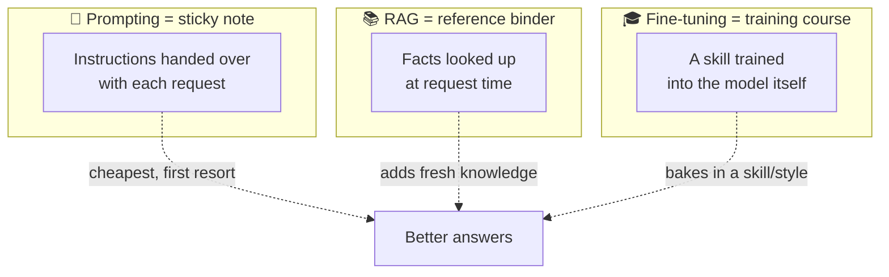
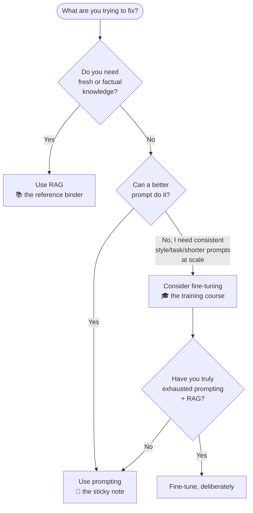
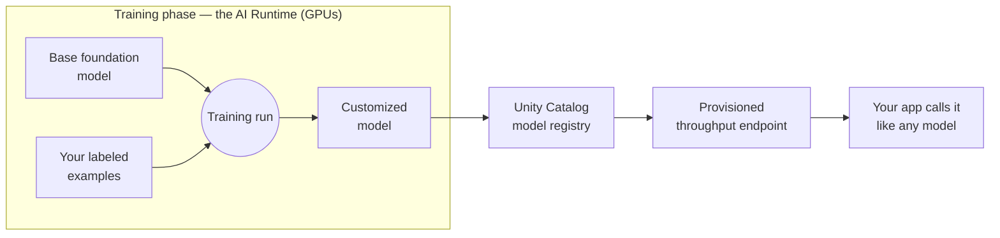
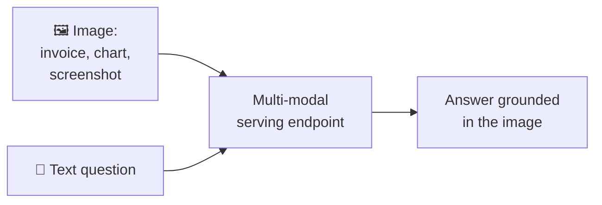

# Fine-Tuning & Model Customization

> You've got prompting working. You've maybe added RAG so the model can look things up. Now someone asks, "Can we make it always write in *our* house style?" You've just met the third lever. This lesson shows you all three side by side, so you always reach for the cheapest one that solves the problem.

Take a breath, because here's the reassuring part first: **most projects never need fine-tuning.** Prompting plus RAG go a very long way. Fine-tuning is a later, deliberate step you take once, on purpose, when the simpler tools have genuinely run out of room. So think of this lesson less as "a thing you must do this week" and more as "the map that tells you which tool to grab, and when." By the end, you'll be able to look at a request and confidently say "that's a prompt job," "that's a RAG job," or "that's the rare case where fine-tuning earns its keep."

## Learning Objectives

By the end of this lesson, you will be able to:

- Name the **three levers** for changing model behavior — **prompting**, **RAG**, and **fine-tuning** — and explain what each one changes and when it happens.
- Use a simple **decision guide** to pick the right lever for a given problem.
- Describe **fine-tuning at a high level**: a base model plus your labeled examples, trained on the **AI Runtime**, producing a customized model served via **provisioned throughput** — without any deep ML math.
- Explain what fine-tuning is **good for** (consistent style, task specialization, domain language, shorter prompts at scale) and what it is **not** for (fresh facts, one-off tweaks).
- Understand **multi-modal models** — models that also read images (and sometimes audio) — and how they connect to document processing.
- Sketch, conceptually, how you'd **prepare a dataset and launch a fine-tune** on Databricks, and recognize it as an advanced, GPU-backed workflow.

## Prerequisites

- [Foundation Model APIs in Depth](/docs/serving/foundation-model-apis) — how you call a served model, since a fine-tuned model is served the same way.
- [Performance and Cost Tuning](/docs/serving/performance-and-cost) — because "shorter prompts at scale" is one real reason to fine-tune, and this lesson builds on those cost instincts.
- [What Is RAG?](/docs/rag-and-ai-search/what-is-rag) — the middle lever, so you can tell RAG and fine-tuning apart cleanly.

You do **not** need any machine-learning background, and you will not train anything by hand here. If you can explain the difference between "give someone instructions" and "send someone on a course," you already have the core idea.

## Estimated Reading Time

About 16 minutes.

## Business Motivation

Let's be honest about why this matters in plain business terms.

Every way you change a model's behavior has a cost and a payoff, and picking the wrong one wastes money and time. Reach for fine-tuning when a cheaper prompt would have done the job, and you've spent GPU hours and weeks of effort for nothing. Reach for prompting when the problem really needed fresh data, and you'll fight the model forever, patching one bad answer at a time.

So the business value of this lesson is **knowing which lever to pull**, because that decision alone often decides whether an AI feature ships cheaply this month or drags on for a quarter.

There's also a genuine, real payoff when fine-tuning *is* the right call. Two examples:

- **Consistency at scale.** If every client summary must follow the same tone, structure, and disclaimers, teaching that style into the model once beats pasting a giant style guide into every single prompt.
- **Cost and speed at scale.** A long, elaborate prompt costs tokens and time on *every* call. If you can bake that instruction into the model, your prompts get short, and short prompts are cheaper and faster. Over millions of calls, that's a real budget line.

:::note
Throughout this lesson we'll use **Northwind Trust**, a fictional financial-services company. They want two different things, and they'll turn out to need two different levers. They want client summaries written in a **consistent house style** (a good fine-tuning case), and they want those summaries to include **today's account balances and this quarter's numbers** (a RAG case, not fine-tuning). Keeping these apart is the whole game.
:::

## Intuition

Here's the one picture to carry through the whole lesson. Imagine you've hired a capable new analyst. There are three different ways you can shape what they produce.

- **Prompting is a sticky note.** You write "summarize this in three bullets, formal tone" and hand it over with the task. Cheap, instant, and you can change it any time. It's your first resort for almost everything.
- **RAG is a reference binder on the desk.** The analyst is smart but doesn't know *your* facts, so you put a binder of current documents next to them: "look things up in here before you answer." The binder can be updated daily without retraining the person.
- **Fine-tuning is sending them on a training course.** After the course, a skill is *second nature* — they write in your house style automatically, without being reminded each time. It's the most effort and you don't do it for a one-off task, but once done, the skill is baked in.



*Figure 1: Three ways to shape a capable helper. Prompting and RAG act at request time; fine-tuning changes the helper itself, ahead of time.*

The key difference in one line: **prompting and RAG add something at request time; fine-tuning changes the model itself, ahead of time.**

## Theory

Let's make the three levers precise, because the difference is really about *where* and *when* the change lives.

- **Prompting** changes behavior through the **instructions and examples you send in the request.** Nothing about the model changes. You're steering a fixed model with words. It's the cheapest lever, instant to adjust, and your first resort.
- **RAG (Retrieval-Augmented Generation)** supplies **knowledge at request time.** You fetch relevant documents and paste them into the prompt so the model can read them before answering. The model still doesn't change; you're just handing it the right pages each time. This is how you get fresh, factual, or private knowledge into an answer.
- **Fine-tuning** further **trains a base model on your examples so the customization is baked into the model's weights.** After fine-tuning, you have a new, customized model. The behavior isn't supplied per request — it's part of the model now.

That last phrase, "baked into the weights," is the heart of it. A model's "weights" are just the millions of numbers that make it behave the way it does. Prompting and RAG leave those numbers untouched and steer from outside. Fine-tuning nudges those numbers using your examples, so the desired behavior comes out even with a short prompt.

Here's the crisp decision guide. Read it top to bottom and stop at the first row that fits.

| If the problem is... | Reach for... | Why |
|---|---|---|
| A behavior tweak: tone, format, "be more concise" | **Prompting** | Cheapest, instant, no training. Always try this first. |
| Missing knowledge, facts, freshness, private data | **RAG** | Supplies the right documents at request time; update the binder any time. |
| Consistent style/format/tone the model won't hold with a prompt | **Fine-tuning** | Bakes the style into the model so it's automatic. |
| Specializing on one narrow, repetitive task | **Fine-tuning** | Trains the model to do that one job reliably. |
| Teaching a domain's language or conventions | **Fine-tuning** | Exposes the model to how your field actually writes. |
| A long prompt you repeat millions of times (cost/latency) | **Fine-tuning** | Bake the instruction in, then send short, cheap prompts. |



*Figure 2: The decision diagram. Notice fine-tuning sits behind a gate: only after prompting and RAG have genuinely run out of room.*

:::note Going deeper (optional)
The three levers are not mutually exclusive — real systems often combine them. You might fine-tune a model for your house style **and** use RAG to feed it today's facts **and** still send a short prompt to steer the exact task. Fine-tuning shapes *how* the model writes; RAG controls *what* it knows. They solve different problems, so they stack nicely.
:::

## Deep Dive

Let's dig into the two questions beginners ask most: "what is fine-tuning *not* for?" and "how do I know it's actually the right call?"

**Fine-tuning is not for injecting fresh or factual knowledge.** This trips people up constantly. It feels like "if I train the model on our documents, it'll know our stuff." But fine-tuning teaches *patterns and behavior*, not a reliable, updatable fact store. Facts learned this way get stale the moment your data changes, and you'd have to retrain to update them. Worse, the model may still make things up. For anything factual, current, or private, **RAG is the right tool** — the binder can be refreshed daily without touching the model. Northwind Trust's "today's balances" requirement is squarely a RAG job.

**Fine-tuning is not for one-off tweaks.** If you just want "make this a bit more formal" for one report, that's a prompt. Fine-tuning is a project — data preparation, a training run, evaluation, deploying a new endpoint. You do it when the payoff repeats thousands or millions of times.

**So when *is* it the right call?** Four honest signals, and you usually want more than one:

1. **You need consistency a prompt can't hold.** You've written a careful style prompt, and the model still drifts — sometimes formal, sometimes chatty, sometimes forgetting a required disclaimer. Fine-tuning on many correct examples makes the style reliable.
2. **The task is narrow and repetitive.** One well-defined job done the same way, over and over (e.g., "turn a support ticket into a structured triage note").
3. **The domain has its own language.** Legal, medical, or financial phrasing the base model handles awkwardly.
4. **A long prompt is costing you at scale.** You're pasting a 1,500-token style guide into every call, a million times a night. Bake it in, and your prompts shrink dramatically.

If none of those ring true, you almost certainly don't need to fine-tune yet. That's not a failure — it's the common case.

## Architecture

Here's how the pieces fit together on Databricks, at a comfortable altitude. There are really just two phases: **training** (done once, on GPUs) and **serving** (the same as any other model).



*Figure 3: The fine-tuning flow. A base model plus your examples go through a training run on the AI Runtime, producing a customized model that's registered and then served via provisioned throughput.*

The important architectural facts:

- **Training runs on the AI Runtime**, Databricks' GPU training runtime for foundation model training and fine-tuning. This is where the heavy, GPU-backed work happens.
- **The output is a customized model**, registered in **Unity Catalog** like your other models, so it's governed and versioned alongside everything else.
- **Serving uses provisioned throughput.** A fine-tuned foundation model is typically served on a **provisioned throughput** endpoint, which reserves dedicated capacity. From your application's point of view, calling it looks exactly like calling any other served model — the customization is invisible at the API surface.

## Internal Working

Without any math, here's what actually happens during a training run so it isn't a black box.

You give the training process a set of **examples** — pairs of "here's an input" and "here's the ideal output." The training process shows the model an input, lets it predict an output, compares that prediction to your ideal answer, and nudges the model's weights slightly so its next prediction is a little closer. It repeats this across all your examples, many times over.

Think of it like coaching. You show the trainee thousands of "situation, correct response" pairs, and gradually their instinct shifts toward your preferred response. After enough repetition, the behavior becomes automatic — that's the "baked into the weights" part from the Theory section.

A few practical consequences fall out of this:

- **Your examples are everything.** The model learns the patterns in your data, good and bad. Sloppy or inconsistent examples teach sloppy, inconsistent behavior.
- **You need enough of them.** A handful won't shift the instinct; you generally want hundreds to thousands of clean, representative examples.
- **It's a snapshot in time.** The model learns from the examples you gave it that day. New facts or new style rules mean a new training run — which is exactly why facts belong in RAG, not in fine-tuning.

## Step-by-Step Walkthrough

Here's the whole lifecycle end to end, so you know the shape of a real fine-tuning project before you ever touch code.

1. **Confirm the lever.** Walk the decision guide. Is this really a style/task/scale problem that prompting and RAG can't solve? If yes, continue. If not, stop here and save the effort.
2. **Collect examples.** Gather many high-quality "input, ideal output" pairs. For Northwind Trust's house style, that's hundreds of past client summaries written the *right* way.
3. **Prepare the dataset.** Clean it, format each example the way the training job expects, and split off a small **held-out** set you won't train on (you'll use it to check quality later).
4. **Pick a base model.** Choose a foundation model to start from. Smaller bases are cheaper to train and serve; larger ones are more capable. Right-size, just like clusters.
5. **Launch the training run** on the AI Runtime. This is the GPU-backed step. You point it at your dataset and base model and let it train.
6. **Evaluate the result.** Compare the customized model against the base model on your held-out examples. Did the style actually improve? Did anything get worse?
7. **Register and serve.** Register the model in Unity Catalog and deploy it to a provisioned throughput endpoint.
8. **Call it like any model.** Your app hits the endpoint exactly as before — now with shorter prompts, because the style is baked in.

Notice steps 1, 2, 3, and 6 are where most of the *real* work lives. The training run itself is almost the easy part.

## Hands-on Examples

Let's make Northwind Trust concrete by separating their two needs, because this is the exact judgment call you'll make on the job.

**Need A: a consistent house style for client summaries.** They have three years of well-written summaries that all follow the same structure — a one-line headline, three bullet points, and a required risk disclaimer. Their style prompt keeps almost working, but the model occasionally drops the disclaimer or gets chatty. This is a **fine-tuning** case: consistent style, a narrow repetitive task, lots of clean examples, and it runs constantly, so shorter prompts save money. All four signals line up.

**Need B: today's account balances and this quarter's figures.** These change constantly and must be exact. Fine-tuning would bake in a stale snapshot and might still invent numbers. This is a **RAG** case: look the current figures up at request time and hand them to the model.

The punchline: **Northwind Trust fine-tunes for *how* the summary reads and uses RAG for *what* the summary contains.** Same feature, two levers, each doing the job it's actually good at. If you can make this split cleanly, you understand the lesson.

## Code Examples

A quick but important caveat before any code: **fine-tuning is an advanced, GPU-backed workflow.** The snippets below are deliberately conceptual sketches to show the *shape* of the steps, not copy-paste production code. The exact APIs evolve, so always check the current Databricks docs for precise function names and parameters. Beginners: you are not expected to run these. Reading them for the shape is the whole point.

**1. Preparing a fine-tuning dataset.** Fine-tuning learns from "input, ideal output" pairs. The most common shape is a table (or JSONL file) where each row is one training example. Here we sketch turning Northwind's past summaries into that format.

```python
# CONCEPTUAL SKETCH — shows the shape, not exact production code.
# Each training example is a prompt paired with the ideal response.

training_examples = [
    {
        "prompt": "Summarize this client update:\n" + raw_notes,
        "response": gold_summary,   # a past summary written in the RIGHT house style
    }
    # ... hundreds to thousands more clean, consistent examples ...
]

# In practice you'd build this from a governed table and write it out,
# holding back a small slice for evaluation.
train_set = training_examples[:-200]   # train on most of it
eval_set  = training_examples[-200:]   # keep some unseen for checking quality
```

Narration: we build a list where every entry has a `prompt` (the input the model will see) and a `response` (the ideal output, in our house style). The quality and consistency of these `gold_summary` values *is* what the model learns, so this step matters more than any other. At the end we split off 200 examples the model won't train on, so we can honestly test it later on data it hasn't seen.

**2. Launching a fine-tune (conceptual).** With a dataset ready, you point a training run at a base model. On Databricks this runs on the AI Runtime.

```python
# CONCEPTUAL SKETCH — real API names/params change; check current docs.
run = start_finetuning_run(
    base_model="a-foundation-model",      # right-size: smaller is cheaper
    train_data="catalog.schema.northwind_summaries_train",
    eval_data="catalog.schema.northwind_summaries_eval",
    task="chat_completion",               # the kind of task you're training
)
# This is the GPU-backed step. It runs on the AI Runtime and may take a while.
print(run.status)
```

Narration: we hand the training run three things — which base model to start from, where the training data lives, and where the evaluation data lives. We also tell it the task type. Then it trains on GPUs. The one habit to carry over from your cluster work: start with the *smallest* base model that might do the job, because it's cheaper to both train and serve.

**3. Serving and calling the result.** Once training finishes and the model is registered in Unity Catalog, you deploy it to a provisioned throughput endpoint and call it like any other model.

```python
# CONCEPTUAL SKETCH — serving a fine-tuned model via provisioned throughput.
# After deploying the customized model to a provisioned-throughput endpoint,
# the calling code looks just like calling any served model:

response = client.chat.completions.create(
    model="northwind-house-style-endpoint",
    messages=[
        # Notice: NO giant style guide here. The style is baked in now.
        {"role": "user", "content": "Summarize this client update:\n" + raw_notes},
    ],
)
print(response.choices[0].message.content)
```

Narration: the calling code is almost boringly familiar — it's the same chat-completions call you already know. The payoff shows up in what's *missing*: there's no long style-guide prompt anymore, because the model learned the style during training. Shorter prompt, same house style, lower cost per call. That "the prompt got short" moment is the whole reason you went to the trouble.

## Multi-Modal Models

So far we've talked as if models only read text. Many modern foundation models are **multi-modal** — they accept more than text, most commonly **images**, and sometimes **audio**. A vision-capable model can look at a scanned invoice, a chart, or a screenshot and answer questions about it.

The reassuring part: **you serve and call them the same way.** A multi-modal model lives behind a Model Serving endpoint just like a text model. The only difference is that your request can include an image alongside the text.

Where this shows up in real Databricks work:

- **Document understanding.** Reading scanned PDFs, forms, and invoices — pulling out the fields you care about. Databricks' document-processing capabilities, including `ai_parse_document` and intelligent document processing (IDP), lean on exactly these vision-capable models under the hood.
- **Chart and screenshot Q&A.** "What's the trend in this chart?" or "What error is shown in this screenshot?" — answered directly from the image.



*Figure 4: A multi-modal model takes an image plus a text question and answers about the image — served through Model Serving exactly like a text model.*

The connection to this lesson: multi-modal is about *what the model can take in*, while fine-tuning is about *baking in a skill*. They're independent choices — you can use a multi-modal model with plain prompting, no fine-tuning required. For most document-processing needs, prompting a capable vision model (or using the built-in `ai_parse_document` path) is plenty.

## Production Considerations

- **Fine-tuning is a maintained asset, not a one-time script.** When your style rules change or you gather better examples, you retrain and redeploy. Budget for that upkeep before you commit.
- **Version and govern the model.** Register the customized model in Unity Catalog so you have lineage, versions, and access control — the same governance you'd want for any production model.
- **Keep the base model's option open.** Always be able to fall back to the base model plus a prompt, in case a fine-tune underperforms.
- **Provisioned throughput means reserved capacity.** That's predictable performance, but it costs whether or not traffic arrives, so match it to real, steady volume.

## Performance Considerations

- **The point of fine-tuning is often shorter prompts.** If you fine-tuned to bake in a style guide, verify your prompts actually got shorter — that's where the latency and cost win lives.
- **Smaller fine-tuned models can beat bigger prompted ones.** A right-sized model that learned your task can be faster and cheaper than a large general model carrying a huge prompt every call.
- **Training itself costs GPU time.** That's an up-front investment you amortize over many inference calls. It only pays off at volume.

## Security Considerations

- **Your training data becomes part of the model.** Anything sensitive in your examples can influence outputs. Scrub secrets and personal data out of the dataset before training.
- **Don't fine-tune private facts you wouldn't want surfaced.** Since the behavior is baked in, you can't easily "un-teach" a leak. Private, sensitive facts belong in access-controlled RAG sources, not in weights.
- **Govern the endpoint.** Apply the same authentication, access control, and gateway policies to a fine-tuned endpoint as to any other served model.

## Common Mistakes

- **Fine-tuning to add facts.** The single most common error. Fresh or factual knowledge belongs in RAG; fine-tuning teaches patterns, not an updatable fact store.
- **Skipping prompting and RAG.** Jumping straight to fine-tuning for a problem a better prompt would have solved. Always exhaust the cheaper levers first.
- **Too few or messy examples.** A handful of inconsistent examples won't shift the model's instinct and may teach bad habits. Quality and quantity both matter.
- **No held-out evaluation.** Training without checking against unseen examples means you can't tell if it actually helped — or quietly got worse.
- **Forgetting the upkeep.** Treating a fine-tune as one-and-done, then being surprised when style rules change and the model is stale.

## Best Practices

- **Walk the decision guide first, every time.** Prompt, then RAG, then — only if truly needed — fine-tune.
- **Invest in the dataset.** Clean, consistent, representative examples are 80% of a good fine-tune.
- **Always keep a held-out set** and compare the fine-tuned model against the base model on it.
- **Right-size the base model.** Start small; go bigger only if quality demands it.
- **Combine levers deliberately.** Fine-tune for style, RAG for facts, prompt for the exact task — they stack.
- **Register and govern** the model in Unity Catalog, and treat retraining as planned maintenance.

## Interview Questions

**1. What are the three ways to change a model's behavior, and how do they differ?**
Prompting (instructions and examples sent in the request), RAG (knowledge supplied at request time by retrieving documents), and fine-tuning (further training the model on your examples so the behavior is baked into the weights). The key distinction: prompting and RAG act at request time and leave the model unchanged, while fine-tuning changes the model itself, ahead of time.

**2. When should you fine-tune, and when should you explicitly avoid it?**
Fine-tune for consistent style/format/tone a prompt can't hold, specializing on a narrow task, teaching domain language, or shortening long prompts at scale for cost and latency. Avoid it for injecting fresh or factual knowledge (use RAG) and for one-off tweaks (use prompting). And avoid it until prompting and RAG have genuinely run out of room.

**3. Why is RAG, not fine-tuning, the right tool for fresh or factual knowledge?**
Fine-tuning teaches patterns and behavior, and whatever facts it absorbs are a stale snapshot from training time; updating them requires retraining, and the model may still fabricate. RAG supplies current documents at request time, so the knowledge is always fresh and can be updated without touching the model — like refreshing a reference binder instead of re-schooling the person.

**4. Describe the high-level fine-tuning flow on Databricks.**
Start with a base foundation model and a dataset of labeled "input, ideal output" examples. Run training on the AI Runtime, the GPU training runtime, which produces a customized model. Register that model in Unity Catalog, then serve it via a provisioned throughput endpoint. Applications then call it exactly like any other served model.

**5. What are multi-modal models, and how does serving them differ from text models?**
Multi-modal models accept more than text — commonly images, sometimes audio — so a vision-capable model can answer questions about invoices, charts, or screenshots. Serving is the same: they sit behind a Model Serving endpoint like text models, and the only difference is the request can include an image. Databricks document-processing features like `ai_parse_document` and IDP use such capabilities.

## Quiz

<details>
<summary>1. Northwind Trust wants client summaries that always follow the same structure, tone, and required disclaimer, and they generate thousands a day. A careful style prompt keeps *almost* working but occasionally drifts. Which lever fits best, and why?</summary>

Fine-tuning. This hits multiple signals at once: consistent style a prompt can't reliably hold, a narrow repetitive task, plenty of clean past examples to train on, and high volume where shorter prompts save real money. Baking the house style into the model makes it automatic, and prompts get shorter and cheaper on every one of those thousands of daily calls.

</details>

<details>
<summary>2. The same summaries must include today's account balances and this quarter's exact figures. Should Northwind fine-tune on their financial data to teach the model these numbers?</summary>

No. Fine-tuning would bake in a stale snapshot the moment the numbers change, and the model might still invent figures. Current, exact, changing facts belong in RAG: look them up at request time and hand them to the model. Northwind fine-tunes for *how* the summary reads and uses RAG for *what* it contains.

</details>

<details>
<summary>3. A teammate says, "Let's fine-tune to make the chatbot a little more polite." Is that the right lever?</summary>

Almost certainly not — that's a prompt. "Be more polite" is a behavior tweak you can express in one line of instruction, adjust instantly, and change again tomorrow. Fine-tuning is a whole project (data, training, evaluation, deployment) reserved for problems the cheaper levers can't solve. Reach for the sticky note first.

</details>

<details>
<summary>4. Your team wants to build a feature that reads scanned invoices and pulls out the totals. Do you need to fine-tune?</summary>

No, not to start. This is a job for a multi-modal (vision-capable) model, which you can simply prompt — or use Databricks' built-in document processing like `ai_parse_document`. Multi-modal is about *what the model can take in* (images), which is independent of fine-tuning (*baking in a skill*). Try prompting the vision model first; fine-tuning would only enter the picture much later, for consistency or specialization, if ever.

</details>

## Summary

There are three levers for changing how a model behaves, and knowing which to pull is the whole skill. **Prompting** steers a fixed model with instructions — cheapest, instant, your first resort. **RAG** supplies knowledge at request time by handing the model the right documents — the tool for anything fresh, factual, or private. **Fine-tuning** further trains a base model on your examples so a skill or style is baked into the weights — the deliberate, later step for consistent style, narrow-task specialization, domain language, or shortening long prompts at scale. On Databricks, fine-tuning runs on the GPU-backed AI Runtime and the customized model is served via provisioned throughput, called just like any other model. Multi-modal models extend all of this to images and audio, served the same way, powering document understanding. And the most reassuring takeaway: most projects never need fine-tuning — prompting and RAG go a very long way.

## Key Takeaways

- **Three levers:** prompting (instructions, cheapest, first resort), RAG (knowledge at request time), fine-tuning (a skill baked into the weights).
- **Prompting and RAG act at request time; fine-tuning changes the model ahead of time.**
- **Fine-tune for** consistent style/format/tone, task specialization, domain language, or shorter prompts at scale.
- **Never fine-tune for** fresh facts (use RAG) or one-off tweaks (use prompting).
- **The flow:** base model + your labeled examples → training on the AI Runtime → customized model → served via provisioned throughput.
- **Multi-modal models** also read images (and sometimes audio), served the same way, and power document processing like `ai_parse_document`.
- **Most projects never need fine-tuning.** Exhaust prompting and RAG first.

## Glossary

- **Prompting** — Steering a fixed model with instructions and examples sent in the request; the cheapest lever and usual first resort.
- **RAG (Retrieval-Augmented Generation)** — Supplying knowledge at request time by retrieving relevant documents and including them in the prompt.
- **Fine-tuning** — Further training a base model on your examples so the customization is baked into the model's weights.
- **Base model** — The starting foundation model that fine-tuning further trains.
- **Weights** — The many numbers inside a model that determine its behavior; fine-tuning adjusts these.
- **Labeled examples** — Pairs of "input" and "ideal output" used to train a fine-tune; their quality drives the result.
- **Held-out set** — Examples kept out of training, used to honestly evaluate the fine-tuned model.
- **AI Runtime** — Databricks' GPU training runtime for foundation model training and fine-tuning.
- **Provisioned throughput** — A serving mode that reserves dedicated capacity; how a fine-tuned foundation model is typically served.
- **Unity Catalog** — The Databricks governance layer where models are registered, versioned, and access-controlled.
- **Multi-modal model** — A model that accepts more than text, commonly images and sometimes audio.
- **`ai_parse_document`** — A Databricks document-processing capability that uses vision-capable models to read documents.
- **IDP (Intelligent Document Processing)** — Extracting structured information from documents using such models.

## Further Reading

- [Databricks: Foundation Model Fine-tuning](https://docs.databricks.com/aws/en/machine-learning/foundation-model-training/)
- [Databricks: Provisioned throughput Foundation Model APIs](https://docs.databricks.com/aws/en/machine-learning/foundation-model-apis/deploy-prov-throughput-foundation-model-apis)
- [Databricks: Model serving](https://docs.databricks.com/aws/en/machine-learning/model-serving/)
- [Databricks: Parse documents with ai_parse_document](https://docs.databricks.com/aws/en/sql/language-manual/functions/ai_parse_document)

## Next Lesson

You can now place fine-tuning among the three levers, pick the right one for a problem, and explain the high-level flow like an engineer — plus you've met multi-modal models. That completes the serving story. Time to pull it all together and get ready to talk about it out loud.

➡️ [Part 7 · Interview Prep](/docs/serving/interview-prep)
