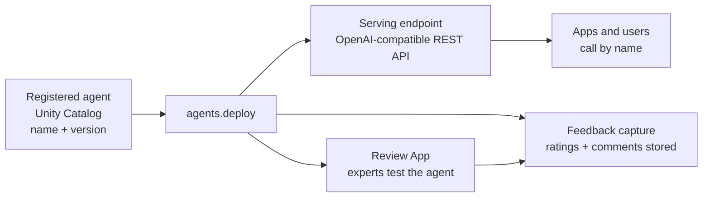
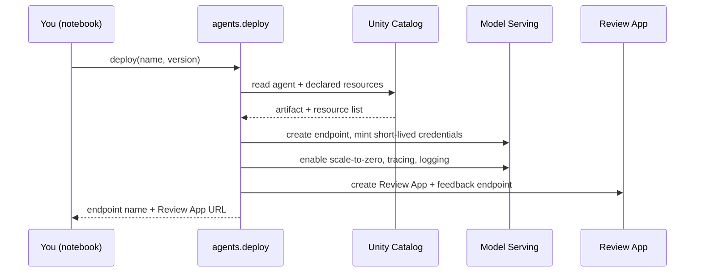

# Deploying Agents

> Think of a food truck that's been parked in the garage while you perfect the recipes. Deploying is the moment you drive it to the street corner, open the serving window, and let people walk up and order. Before the crowd arrives, you invite a few trusted friends to taste everything first. That tasting session is the Review App. `agents.deploy()` does both in one call.

Take a breath. This is one of the friendliest lessons in the whole course, because the hard part is already behind you.

In the last lesson you logged and registered your agent. That means the agent is packaged, versioned, and sitting safely in Unity Catalog, like a finished dish waiting in the kitchen. It's real, but nobody can order it yet.

This lesson is about the *one call* that opens the serving window. You'll see how a single Python line turns that parked, versioned agent into a live service that apps and people can actually reach. If you can register an artifact, you can deploy it. Let's walk through it gently.

## Learning Objectives

By the end of this lesson, you will be able to:

- Explain what "deploying an agent" means in plain terms, and why it's the natural next step after registering.
- Use `agents.deploy()` to promote a registered agent version to a live **Mosaic AI Model Serving** endpoint.
- List the **four things** you get automatically from one deploy call: a serving endpoint, wired-up credentials, scale-to-zero, and a Review App with feedback capture.
- Query the deployed endpoint using the familiar **OpenAI-compatible** client.
- Describe how the **Review App** lets experts test and rate the agent before real users arrive.
- Say how **Unity Catalog** and the **AI Gateway** keep the endpoint governed.

## Prerequisites

- [Logging and Registering Agents](/docs/llmops/log-and-register) — you must have an agent logged and registered in Unity Catalog before you can deploy it. Deploy takes a name and a version, and that's exactly what registering gives you.
- [Mosaic AI Model Serving](/docs/serving/model-serving) — the "front counter" your agent will run behind. Deploying an agent is really just creating one of these endpoints, with a lot of extra wiring done for you.

You do **not** need to have built any serving infrastructure yourself. That's the whole point of this lesson.

## Estimated Reading Time

About 14 minutes.

## Business Motivation

Let's be honest about why this step matters.

You've built something valuable. Say it's a support agent that can answer customer questions by looking up account details and policy documents. Right now it lives as a registered model in Unity Catalog. That's great for safekeeping, but a registered artifact can't answer anyone. It's a recipe, not a meal being served.

To create business value, the agent has to become something the rest of the company can *reach*:

- **Always on**, so an app can call it at any hour.
- **Reachable over HTTP**, the one language every app already speaks.
- **Safe to test first**, so subject-matter experts can try it and flag mistakes before a real customer ever sees it.
- **Governed**, so you control who can call it and you can watch what it does.

Doing all of that by hand, standing up a server, wiring credentials, adding autoscaling, building a feedback UI, is weeks of platform work. `agents.deploy()` gives it to you in one call.

:::note
Throughout this lesson we'll follow **Northwind Trust**, a fictional financial-services company. Their team has registered a customer-support agent. Now they want to deploy it to a **staging** endpoint so their support experts can review it before it ever touches a real customer.
:::

## Intuition

Here's the whole idea in one picture: **opening a service window.**

Your registered agent is a food truck parked in the garage. Fully built, recipes finalized, but the window is shut. Deploying is driving it to the corner and opening that window so customers can walk up and order.

And because you're careful, you don't open to the public first. You invite a handful of trusted tasters, your experts, to sample everything and tell you what's good and what's off. That tasting room is the **Review App**. Their notes and ratings get written down for you automatically. That's **feedback capture**.

So "deploy" really means two things at once:

1. Open the window (create a live endpoint apps can call).
2. Open the tasting room (create a Review App where experts try it and rate it).

One call does both.

## Theory

Let's connect this to ideas you already know as a data engineer.

You're used to a **promotion** flow: something is built and versioned, then promoted from dev to staging to prod. A registered agent is an artifact with a **name** (a Unity Catalog path like `catalog.schema.model`) and a **version** (an integer, like `3`). Deploying is promotion: you take one specific version of that named artifact and turn it into a running service.

The service it becomes is a **Mosaic AI Model Serving endpoint**, the same "front counter" you met in the serving lesson. An endpoint is a stable HTTP address that stays put while the thing behind it can change. You can point it at version 3 today and version 4 next week without callers changing a single line.

Two ideas make this specific to *agents*:

- **Declared resources.** When you logged the agent, you declared what it needs to do its job: a vector search index, a Unity Catalog function, another model endpoint. Deploy reads that declaration and provisions **short-lived credentials** so the running agent can reach exactly those resources, and nothing more.
- **Human feedback loop.** Agents are judged by humans, not just metrics. So deploy also stands up the Review App and a feedback endpoint, tying directly back to the human-feedback ideas from the evaluation part of the course.

## Deep Dive

Here is the one line that does everything:

```python
from databricks import agents

deployment = agents.deploy(
    uc_model_name="northwind.support.support_agent",
    model_version=3,
)
```

When you run that, Databricks does a lot of quiet work on your behalf. Let's name each piece.

- **Creates (or updates) a serving endpoint.** A scalable REST API that serves your agent, with load balancing handled for you.
- **Provisions credentials for declared resources.** The short-lived, least-privilege tokens we just described, so the agent can reach its vector index or SQL function safely.
- **Enables scale-to-zero.** When no one is calling, the endpoint spins down to zero compute so you stop paying. The first call after a quiet spell pays a small "cold start" wait; after that it's warm.
- **Creates a Review App.** A ready-made web page where experts chat with the agent and rate answers.
- **Captures feedback.** A feedback endpoint records those ratings and comments so you can review them later.
- **Turns on tracing and logging.** Requests and responses are logged to inference tables, and interactions are traced to MLflow, so you can audit and monitor from day one.

:::note Going deeper (optional)
The `deployment` object returned by the call is handy. It carries the endpoint name and a `query_endpoint` helper, and the deploy call surfaces the **Review App URL** you'll share with your experts. You don't have to memorize the object's shape right now, just know the deploy call hands you back the addresses you need.
:::

## Architecture

Let's look at the shape of what you just created. This is the diagram to hold in your head.



*Figure 1: One `agents.deploy()` call fans out into three things you get for free: a live serving endpoint apps can call, a Review App where experts test the agent, and feedback capture that records their ratings.*

Notice that everything downstream flows from that single node in the middle. You bring a name and a version; deploy produces the rest.

## Internal Working

You don't need to know these details to deploy, but a peek under the hood builds confidence.



*Figure 2: What happens inside a deploy call. It reads your artifact and its declared resources, stands up the endpoint with credentials and scale-to-zero, and creates the Review App, then hands the addresses back to you.*

The important idea: deploy is **reading the declaration you made at logging time**. That's why logging carefully pays off here. If you declared the right resources, the running agent gets exactly the access it needs, automatically.

## Step-by-Step Walkthrough

Here's the whole flow, start to finish, in plain steps.

1. **Confirm what you're deploying.** You need the Unity Catalog model name and the version number from the register step.
2. **Call `agents.deploy(name, version)`.** This kicks off endpoint creation. It can take a few minutes the first time.
3. **Wait for the endpoint to be ready.** Model Serving shows a status; "ready" means the window is open.
4. **Grab the Review App URL** from the deploy output and share it with your experts.
5. **Let experts test and rate** the agent in the Review App. Their feedback is captured for you.
6. **Query the endpoint** yourself to confirm it answers, using the OpenAI-compatible client.
7. **Iterate.** Register a new version, deploy again, and the same endpoint picks up the change.

## Hands-on Examples

Let's walk Northwind Trust through it.

Their support agent is registered at `northwind.support.support_agent`, and the version they want to review is `3`. They deploy it:

```python
from databricks import agents

deployment = agents.deploy(
    uc_model_name="northwind.support.support_agent",
    model_version=3,
)

print("Endpoint:", deployment.endpoint_name)
print("Review App:", deployment.review_app_url)
```

Step by step: they import the `agents` helper, call `deploy` with the name and version, and then print two addresses. The first is the serving endpoint, the front window apps will call. The second is the Review App URL, the tasting room they'll send to their support experts. That's the whole deploy. One call, two doors opened.

:::note
The exact attribute names on the returned object can vary by version. If `deployment.review_app_url` isn't available in your environment, the Review App link also appears in the deploy output and in the Serving UI for the endpoint. Check the [official deploy docs](https://docs.databricks.com/aws/en/generative-ai/agent-framework/deploy-agent) for the current shape.
:::

Now the experts open the Review App, chat with the agent, and click thumbs-up or thumbs-down with a comment. Those ratings land in a feedback table automatically. Northwind's team didn't build any of that UI, they got it from the deploy call.

## Code Examples

**1. Deploy with a couple of common options.**

```python
from databricks import agents

deployment = agents.deploy(
    uc_model_name="northwind.support.support_agent",
    model_version=3,
    scale_to_zero_enabled=True,
    tags={"env": "staging", "team": "support"},
)
```

Here Northwind is explicit about two things. `scale_to_zero_enabled=True` says "spin down to zero when idle so we don't pay for a quiet staging endpoint." The `tags` are just labels that make the endpoint easy to find and account for later. Neither is required, but both are good habits for a staging deploy.

**2. Query the deployed endpoint with the OpenAI client.**

The endpoint is **OpenAI-compatible**, which means you talk to it with the same client you'd use for any chat model. You already met this pattern in the serving lessons.

```python
from openai import OpenAI
from databricks.sdk import WorkspaceClient

# Get an authenticated OpenAI-compatible client pointed at your workspace
w = WorkspaceClient()
client = w.serving_endpoints.get_open_ai_client()

response = client.chat.completions.create(
    model="northwind_support_support_agent",  # the deployed endpoint name
    messages=[
        {"role": "user", "content": "How do I reset my online banking password?"}
    ],
)

print(response.choices[0].message.content)
```

Step by step: you get a pre-authenticated client from the Databricks SDK, then call `chat.completions.create` exactly as you would for any chat model. The `model` argument is the **endpoint name**, not a foundation-model id. The reply comes back in the familiar `choices[0].message.content` shape. Notice how little is new here, the agent behind the window doesn't change how you order.

**3. Note the Review App and feedback capture.**

```python
# Share this URL with subject-matter experts
print("Send experts here to test and rate:", deployment.review_app_url)
```

That single URL is the tasting room. Experts don't need notebooks or SDKs, they open the page, chat with the agent, and rate answers. Every rating and comment is captured to a feedback table tied to the endpoint, ready for you to analyze in the evaluation workflow.

## Production Considerations

A staging deploy for expert review, like Northwind's, is deliberately low-stakes. When you promote toward production, keep a few things in mind.

- **Separate endpoints per environment.** A staging endpoint for review and a production endpoint for customers. Don't let test traffic mix with real traffic.
- **Version discipline.** Deploy specific versions, not "whatever's latest." When you register a new version, deploy it explicitly so you always know what's live.
- **Scale-to-zero tradeoff.** Great for staging and bursty workloads because it saves money. For a customer-facing endpoint with steady traffic, you may keep it warm to avoid cold-start latency.
- **Watch the logs.** Inference tables and traces are on by default. Use them to catch bad answers and errors early.

## Performance Considerations

- **Cold starts.** With scale-to-zero on, the first request after an idle period waits while the endpoint wakes up. Subsequent requests are fast. If that first-request wait matters, keep a minimum of one replica warm.
- **Agents make multiple calls.** An agent may call a model, a search index, and a tool for a single answer. Its latency is the sum of those steps, so it's naturally slower than a plain model call. Plan timeouts accordingly.
- **Autoscaling.** The endpoint scales replicas up under load and back down when it quiets. You don't manage servers, but you should load-test staging before you trust production numbers.

## Security Considerations

This is where deploy quietly does you a big favor.

- **Governed by Unity Catalog.** The endpoint is a governed object. Access is controlled by UC permissions, so you decide who can call it, and that's auditable.
- **Fronted by the AI Gateway.** The same gateway controls you know from Model Serving apply here: rate limits, usage tracking, and guardrails.
- **Least-privilege credentials.** Deploy mints short-lived credentials scoped to only the resources you declared at logging time. The agent can reach its vector index and its SQL function, and nothing else.
- **Owner verification.** Before issuing those credentials, Databricks checks that the endpoint's owner actually has permission to the underlying resources. You can't accidentally hand the agent access you don't have.

:::note Going deeper (optional)
By default the running agent uses the deployer's (system) authorization to reach its resources. There's also an **on-behalf-of-user** mode, where the agent acts with the *calling user's* permissions instead, so it can only see data that user is allowed to see. That's a powerful governance feature, and we cover it properly in Part 9. For a staging expert-review deploy, the default is fine.
:::

## Common Mistakes

- **Deploying before registering.** `agents.deploy()` needs a name and version that already exist in Unity Catalog. If the register step didn't finish, deploy has nothing to promote.
- **Forgetting to declare resources at logging time.** If you didn't declare the vector index or SQL function when you logged the agent, deploy can't provision credentials for it, and the agent fails to reach it at runtime. Fix it at the logging step, not here.
- **Confusing the endpoint name with a model id.** When you query, `model=` is the *endpoint* name, not a foundation-model id like `databricks-meta-llama...`.
- **Expecting instant readiness.** The first deploy takes a few minutes to build the endpoint. "Not ready yet" is normal, not an error.
- **Sending real customers to a staging endpoint.** Staging is for experts in the Review App. Keep customer traffic on a separate, reviewed endpoint.

## Best Practices

- **Deploy to staging first.** Always let experts sample the agent in the Review App before real users arrive.
- **Pin the version.** Deploy an explicit version number so you always know what's live and can roll back cleanly.
- **Tag your endpoints.** Labels like `env=staging` make endpoints easy to find, govern, and cost-account.
- **Close the feedback loop.** The Review App captures ratings for a reason, actually read them, and fold them into your next evaluation and version.
- **Keep logging honest.** Everything deploy provisions flows from what you declared at logging time. Careful logging makes deploy effortless.

## Interview Questions

1. **What does `agents.deploy()` do, and what do you need before you can call it?** It promotes a registered agent version to a live Mosaic AI Model Serving endpoint. Beforehand you need the agent logged and registered in Unity Catalog, so you have a model name and a version to pass.

2. **Name the things a single deploy call provisions.** A serving endpoint (OpenAI-compatible REST API), short-lived credentials scoped to the agent's declared resources, scale-to-zero, and a Review App plus a feedback endpoint. Tracing and inference-table logging are turned on too.

3. **How do credentials for the agent's resources get set up?** Deploy reads the resources you declared when logging the agent and provisions least-privilege, short-lived credentials for exactly those resources. Databricks first verifies the endpoint owner has access to them.

4. **What is the Review App and why does it matter?** It's an auto-generated web interface where subject-matter experts chat with the deployed agent and rate answers. It matters because agents are judged by humans; the app captures that feedback so you can improve the agent before and after production.

5. **How do you query a deployed agent, and what's the one gotcha?** You use the OpenAI-compatible chat completions client pointed at your workspace. The gotcha: the `model` argument is the *endpoint name*, not a foundation-model id.

## Quiz

**Question 1:** What two things does `agents.deploy()` require as input?

<details>
<summary>Show answer</summary>

The Unity Catalog **model name** (like `catalog.schema.model`) and the **version** number of the registered agent. Deploy promotes that specific version to a live endpoint.

</details>

**Question 2:** Your experts want to test the agent before customers do. What does deploy give you for that, and where does their feedback go?

<details>
<summary>Show answer</summary>

It creates a **Review App**, a web page where experts chat with the agent and rate answers. Their ratings and comments are recorded automatically by the **feedback endpoint** into a feedback table you can analyze later.

</details>

**Question 3:** When you query the deployed endpoint with the OpenAI client, what goes in the `model` argument?

<details>
<summary>Show answer</summary>

The **name of the deployed serving endpoint**, not a foundation-model id. The endpoint is OpenAI-compatible, so the rest of the call looks like any chat completion.

</details>

**Question 4:** What is the tradeoff of enabling scale-to-zero, and when is that tradeoff a good deal?

<details>
<summary>Show answer</summary>

The tradeoff is a **cold-start delay**: the first request after an idle period waits while the endpoint wakes up. It's a good deal for **staging or bursty** workloads where saving money on idle time matters more than instant first-response latency. For steady customer traffic you may keep a replica warm instead.

</details>

## Summary

Deploying is the moment your agent stops being a stored artifact and becomes a service people can reach. You did the hard work already by logging and registering it. This step is one call: `agents.deploy(name, version)`.

That call opens the serving window, a live, OpenAI-compatible, Unity-Catalog-governed endpoint, and it opens the tasting room, a Review App with feedback capture where your experts sample the agent first. It wires up credentials for the resources you declared, turns on scale-to-zero, and starts logging, all without you building any of it. From here, you query the endpoint like any chat model, gather expert feedback, and iterate by deploying new versions.

## Key Takeaways

- **One call deploys.** `agents.deploy(name, version)` promotes a registered agent to a live Model Serving endpoint.
- **You get four things for free:** a serving endpoint, scoped short-lived credentials, scale-to-zero, and a Review App with feedback capture.
- **The endpoint is OpenAI-compatible.** Query it with the same client you use for any chat model; the `model` argument is the endpoint name.
- **Governance is built in.** Unity Catalog controls access and the AI Gateway applies rate limits and guardrails.
- **Deploy reflects your logging.** Credentials come from the resources you declared when logging, so careful logging makes deploy effortless.
- **Review before customers.** Deploy to staging, let experts rate the agent in the Review App, then promote.

## Glossary

- **Deploy:** Promoting a registered agent version to a running Model Serving endpoint.
- **Serving endpoint:** A stable HTTP address that serves the agent as a REST API. The thing behind it can change; the address stays put.
- **Review App:** An auto-generated web page where experts chat with the deployed agent and rate its answers.
- **Feedback capture:** The endpoint and table that record expert ratings and comments from the Review App.
- **Scale-to-zero:** Spinning the endpoint down to zero compute when idle to save money, at the cost of a cold start on the next call.
- **Declared resources:** The vector indexes, functions, and endpoints you told the agent it needs when logging it; deploy provisions credentials for exactly these.
- **OpenAI-compatible:** The endpoint speaks the same chat-completions API as OpenAI's client, so calling code barely changes.
- **AI Gateway:** The layer that applies rate limits, usage tracking, and guardrails to serving endpoints.
- **On-behalf-of-user auth:** A mode where the agent acts with the calling user's permissions, covered in Part 9.

## Further Reading

- [Deploy an agent for generative AI applications](https://docs.databricks.com/aws/en/generative-ai/agent-framework/deploy-agent) — the official deploy reference.
- [Mosaic AI Model Serving](/docs/serving/model-serving) — the endpoint your agent runs behind.
- [Logging and Registering Agents](/docs/llmops/log-and-register) — the step right before this one.

## Next Lesson

➡️ [Prompt Registry: Versioning Prompts](/docs/llmops/prompt-registry)

You've got a live, reviewed agent. Next we'll manage the prompts inside it the same disciplined way, versioned, tracked, and safe to change.
