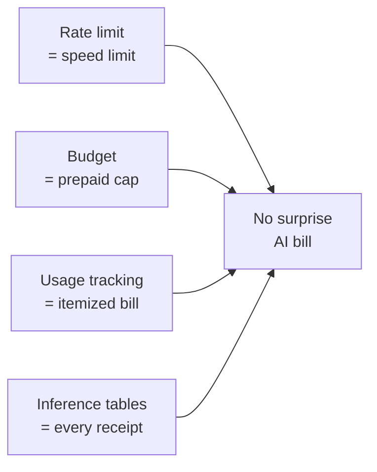
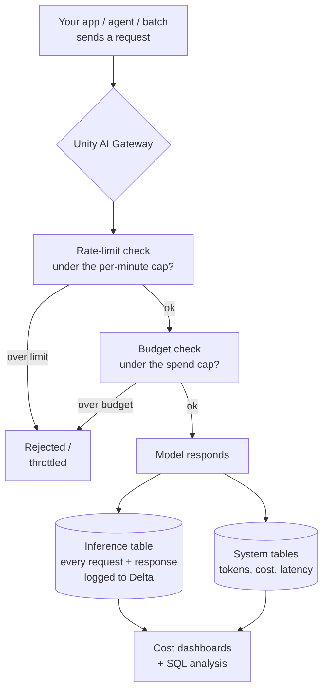

# Cost, Rate Limits, and Budgets

> The demo went great. So great that someone wired your model into an agent that calls itself in a loop, and someone else pointed a giant batch job at it overnight. You find out when finance forwards the bill with a lot of question marks. Here is the reassuring part: none of this is a mystery, and all of it is preventable with controls you set once at the Gateway.

Take a breath. You have solved this exact shape of problem before. A job that runs away and eats the cluster. A pipeline that quietly balloons the storage bill. You already know the moves: put a cap on it, watch the meter, and keep the receipts so you can explain what happened. AI cost is the same game with new words. This lesson gives you the words and the knobs. By the end, "how do we not get surprised by an AI bill" will feel like a checklist, not a worry.

## Learning Objectives

By the end of this lesson, you will be able to:

- Explain why AI cost can run away, and why a loop or a big batch is the usual culprit.
- Set a **rate limit** to cap how many requests or tokens flow per minute, per user or per endpoint.
- Set a **budget** to cap spend and get alerts before finance does.
- Read **usage tracking** and **cost observability** to see tokens and dollars by user, endpoint, and app.
- Query an **inference table** with plain SQL to compute spend by day and by user.
- Connect these Gateway controls to the tuning levers from Part 7 (the cheapest request is a shorter one).

## Prerequisites

- [The Unity AI Gateway](/docs/governance/unity-ai-gateway) — the front door where all of these controls live.
- [Performance and Cost Tuning](/docs/serving/performance-and-cost) — why tokens are the meter, and the levers that shrink each request.

You do **not** need to have set a single limit before. If you have ever put a max on a job or watched a cost dashboard, you already have the instinct.

## Estimated Reading Time

About 16 minutes.

## Business Motivation

Let's be honest about why this matters, in plain business terms.

AI spend has a nasty property: it can grow very fast, silently, and without anyone deciding to spend more. Three things make this real:

- **A loop can spend without a human in it.** An agent that decides its own next step can get stuck calling the model over and over. Each call costs money. A loop that would be a harmless bug in normal code becomes a bill in AI.
- **A batch can be huge before you notice.** Point `ai_query` at a table with ten million rows and you have just committed to ten million model calls. That might be exactly right, or it might be a typo in a `WHERE` clause.
- **Finance hates surprises more than they hate cost.** A predictable, explainable line item is fine. A mystery spike that nobody can account for erodes trust in the whole AI program.

Here is the good news. The controls are cheap to set and they mostly run themselves. You put a rate limit and a budget in place once, turn on logging, and now the runaway scenario simply cannot happen quietly. The meter is capped, the alerts fire early, and every request is on file.

:::note
Throughout this lesson we'll use **Northwind Trust**, a fictional financial services company. They just shipped a customer-support agent and a nightly ticket-summarization batch. We'll stop their agent from ever running away, and give finance a spend report they can actually read.
:::

## Intuition

Four everyday pictures carry this whole lesson. Hold onto these and the rest is detail.

- **A rate limit is a speed limit.** It doesn't care how far you're going. It just caps how *fast* you can go at any moment. Put a limit of "60 requests per minute per user" and no single user or runaway loop can floor it.
- **A budget is a prepaid spend cap.** Like a prepaid card or a phone plan with a data cap. You say "this endpoint gets $500 this month," and you get a warning as you approach it, and a hard stop if you hit the ceiling. Finance sleeps well.
- **Usage tracking is your itemized bill.** Not just "you spent $500," but "here's every line: this user, this endpoint, this many tokens, this many dollars." You can see exactly where the money went.
- **Inference tables are keeping every receipt.** Every single request and response, saved to a table. If anyone ever asks "what did the model actually do on Tuesday at 3am," you have the receipt.



*Figure 1: Four controls, one goal — spend that is capped, visible, and explainable.*

## Theory

Here is the core idea, stated plainly: **cost scales with tokens, so controlling cost means controlling how many tokens flow and knowing where they went.**

That splits into two jobs.

**Job one: prevent.** Stop bad spend before it happens. This is what rate limits and budgets do. A rate limit caps the *flow* — requests or tokens per minute. A budget caps the *total* — dollars per period. Prevention is proactive; the limit does the work whether or not anyone is watching.

**Job two: observe.** Know what you spent and why. This is what usage tracking and inference tables do. Usage tracking gives you the aggregated view (tokens and dollars, sliced by user, endpoint, and app). Inference tables give you the raw record (every request and response as rows in a Delta table). Observation is reactive; it tells you the story after the fact so you can tune, audit, and report.

A healthy setup uses both. Prevention keeps you safe. Observation keeps you honest.

One more rule to internalize, straight from Part 7: **the cheapest request is a shorter one.** Every control here caps or measures cost. None of them make an individual call cheaper. To make each call cheaper you still use the tuning levers — short prompts, tight `max_tokens`, right-size the model, cache repeats, batch offline work. Gateway controls and tuning levers are partners: tuning lowers the cost per call, the Gateway caps and watches the total.

## Deep Dive

Let's look at each of the four controls one at a time.

### Rate limits

A rate limit caps how many requests (and, where supported, how many tokens) can flow in a window of time — for example, per minute. You can scope it:

- **Per user** — so one person or one service principal can't hog capacity or run away in a loop.
- **Per endpoint** — so the whole endpoint has a ceiling no matter who's calling.

Rate limits do two jobs at once. They control **cost** (fewer requests per minute means fewer dollars per minute) and they control **abuse and stability** (no single caller can overwhelm the endpoint). For a runaway agent, the rate limit is your seatbelt: even if the loop never stops, it can only spend so fast, which gives your alerts time to fire and a human time to react.

### Budgets

A budget is a spend cap plus alerts, measured in dollars over a period. You point it at endpoints, users, or providers and say "this much, this month." As spend climbs, you get **alerts** (a warning at, say, 80%). Depending on how it's configured you can also set a **hard cap** that stops spend at the ceiling. Budgets work across both Databricks-hosted models and external providers, so a single view covers everything.

The key word is *no surprises*. A budget turns "we found out at month end" into "we got a heads-up on the 14th."

### Usage tracking and cost observability

This is your itemized bill. The Gateway (together with Databricks **system tables**) tracks requests, token usage, latency, and cost, and lets you attribute that cost to services, models, principals, and tags. You get dashboards that answer questions like:

- Which endpoint is the most expensive?
- Which user or app is driving spend this week?
- Are tokens per request creeping up over time?

For a data engineer this is the friendly part: it's just tables and dashboards, the tools you already live in.

### Inference tables

An inference table logs **every request and response** to a Unity Catalog Delta table. This is your audit trail and your analysis surface in one. Because it's just Delta, you analyze it with plain SQL — no new tool, no new language. Want spend by day? Group by date. Want the top spender? Group by user and order by tokens. This is the control a DE tends to love most, because it turns "AI cost" into a normal SQL problem.

:::note Going deeper (optional)
The exact columns in an inference table depend on your configuration and the model, but you'll generally find a timestamp, an identifier for the caller, the endpoint or model name, and token counts (input and output). Cost is often computed by joining or by multiplying token counts by a per-token price, since tokens are the true meter. Payload logging (the request and response text) can be enabled or disabled depending on how sensitive the content is — see Security Considerations below.
:::

## Architecture

Here is where the controls sit. Every request to a governed model goes through the Gateway. The Gateway is the one place that checks limits, enforces budgets, and records what happened. That single-front-door design is exactly why these controls are reliable: there's no side path around them.



*Figure 2: A request passes a rate-limit check and a budget check at the Gateway, then gets logged to inference and system tables that feed your cost dashboards.*

## Internal Working

Walk a single request through, step by step, because the order matters.

1. **A request arrives** at the Gateway from an app, an agent, or a batch job.
2. **The rate-limit check runs first.** The Gateway asks: has this user or endpoint already used up its allowance for this minute? If yes, the request is rejected or throttled right away — cheap and instant, before any model work happens.
3. **The budget check runs next.** The Gateway asks: is this endpoint or user still under its spend cap for the period? If the budget is blown (and a hard cap is set), the request is stopped.
4. **The model runs** only if both checks pass. Now tokens are actually spent.
5. **The result is logged.** The request and response land in the inference table; tokens, cost, and latency land in system tables.
6. **Dashboards and SQL read those tables** so humans can see spend and analysts can slice it.

Notice that the cheap checks (rate limit, budget) happen *before* the expensive work (the model call). That ordering is what makes prevention efficient — a blocked request costs almost nothing.

## Step-by-Step Walkthrough

Here's how Northwind Trust would roll this out, in the order a real team does it.

1. **Right-size first (Part 7).** Before capping anything, trim prompts and set a sane `max_tokens`. Cheaper calls mean your caps stretch further.
2. **Set a rate limit** on the agent's endpoint, per user, so a loop can only spend so fast.
3. **Set a budget** on the endpoint with an alert at 80% and, for the batch endpoint, a hard cap.
4. **Turn on the inference table** so every call is on file from day one.
5. **Build the cost dashboard** from usage tracking and the inference table.
6. **Point finance at the dashboard** and set up the alert to reach the right people.

Notice the order: tune, then cap, then observe. You cap and observe last because they're most useful once the per-call cost is already sensible.

## Hands-on Examples

Let's make Northwind Trust's runaway-agent nightmare concrete, then defuse it.

**The scenario.** Northwind ships a support agent. A bug makes it re-ask the model in a loop whenever an answer looks incomplete. Overnight, one stuck conversation calls the model thousands of times.

**Without controls:** the loop runs free until morning. The bill is a mystery spike. Nobody can say exactly what happened.

**With controls:**

- The **rate limit** (60 requests/minute per user) throttles the loop almost immediately — it can't spend fast.
- The **budget alert** at 80% fires that evening and pings the on-call engineer.
- The **hard cap** (if set) stops spend at the ceiling regardless.
- The next morning, the engineer opens the **inference table** and runs one SQL query to see exactly which conversation looped and what it cost.

Same bug. Completely different outcome. The controls turned a finance incident into a Tuesday-morning fix.

## Code Examples

These are shown conceptually — the exact UI, field names, and API surface evolve, so treat the structure as the lesson, not the literal syntax. Check the [AI Gateway docs](https://docs.databricks.com/aws/en/ai-gateway/) for current specifics.

**1. Set a rate limit and a budget on an endpoint (conceptual config).**

```yaml
# Conceptual Gateway config for Northwind Trust's support-agent endpoint.
endpoint: northwind-support-agent
ai_gateway:
  rate_limits:
    - key: user          # cap per calling user / service principal
      renewal_period: minute
      calls: 60          # no single caller floors the endpoint
    - key: endpoint      # a ceiling for the whole endpoint
      renewal_period: minute
      calls: 1000
  usage_tracking:
    enabled: true        # record tokens, cost, latency to system tables
  inference_table:
    enabled: true        # log every request + response to Delta
    catalog: northwind
    schema: ai_audit
```

Reading this top to bottom: we cap each user to 60 calls a minute (that's the seatbelt on the runaway loop), and the whole endpoint to 1000 a minute (a ceiling no matter who calls). We switch on usage tracking so tokens and cost flow to system tables, and we switch on the inference table so every request and response is saved to Delta under `northwind.ai_audit`. Setting this once is what makes the loop harmless.

:::note Going deeper (optional)
Budgets are often configured separately from the per-endpoint config above — at an account or workspace level where you set dollar thresholds, alert recipients, and (where supported) hard caps across many endpoints and providers at once. The idea is the same: a spend ceiling per period, with alerts before the ceiling.
:::

**2. Query the inference table to compute spend by day and by user (SQL).**

```sql
-- Token spend by day and user from Northwind's inference table.
-- Cost ~ tokens, so we sum tokens and convert to an estimated dollar figure.
SELECT
  date(request_time)                         AS day,
  requester                                  AS user,
  count(*)                                   AS num_requests,
  sum(input_token_count)                     AS input_tokens,
  sum(output_token_count)                    AS output_tokens,
  round(
    sum(input_token_count)  * 0.0000005 +    -- price per input token
    sum(output_token_count) * 0.0000015,     -- price per output token
    2
  )                                          AS est_cost_usd
FROM northwind.ai_audit.support_agent_payload
WHERE request_time >= current_date() - INTERVAL 7 DAYS
GROUP BY 1, 2
ORDER BY est_cost_usd DESC;
```

Reading this query: we group every logged request by day and by user, count the requests, and sum the input and output tokens. Then we turn tokens into dollars with a simple per-token price (swap in your real rates), and sort so the biggest spender floats to the top. This is the query that would instantly reveal the looping conversation — one user, one day, a wildly high request count. And notice: it's just SQL over Delta. Nothing new to learn.

## Production Considerations

- **Set limits before you need them, not after an incident.** The whole point is that the cap is already in place when the loop starts.
- **Give service principals their own limits.** Agents and batch jobs often call as a service principal, not a person — make sure that identity is capped too.
- **Watch out for false throttling.** A rate limit set too low will reject legitimate traffic during a spike. Size it to your real peak, then add headroom.
- **Turn on inference tables from day one.** You can't analyze receipts you never kept. Retroactive auditing is impossible.
- **Automate the report.** A dashboard finance never opens is no better than no dashboard. Schedule a summary or an alert so the number comes to them.
- **Beta status.** At the time of writing, some Unity AI Gateway features are in Beta and may not incur charges yet. Check current docs for availability and pricing before you depend on a specific behavior.

## Performance Considerations

- **The cheap checks come first, on purpose.** Rate-limit and budget checks run before the model, so a blocked request costs almost nothing. Prevention is cheap.
- **Rate limiting adds negligible latency** to allowed requests — it's a fast counter check, not a model call.
- **Inference table logging is asynchronous by design** so it doesn't slow your response. Do plan for the storage the logs consume, and manage it like any growing Delta table (partitioning, retention).
- **Batch is your friend for cost, not for rate limits.** Batching with `ai_query` lowers overhead per row, but a giant batch can still blow a budget — that's what the budget cap is for.

## Security Considerations

- **Inference tables can contain sensitive data.** If requests include customer PII, the logged payloads do too. Govern that table like any other sensitive dataset — Unity Catalog permissions, masking, and retention rules.
- **Decide whether to log payloads at all.** You can often track *usage* (tokens, cost) without logging the full request and response *text*. If content is sensitive and you only need cost, log metrics, not payloads.
- **Rate limits are an abuse control, not just a cost control.** They blunt denial-of-wallet attacks, where someone floods your endpoint specifically to run up your bill.
- **Budgets protect against compromised credentials.** If a key leaks, a hard cap limits how much damage the attacker can do before you notice.

## Common Mistakes

- **Only observing, never preventing.** A beautiful dashboard that shows a $40,000 spike is not a control — it's a post-mortem. Pair every dashboard with a cap.
- **Capping the endpoint but forgetting the service principal.** The runaway agent usually calls as a service identity. If only human users are limited, the loop still runs free.
- **Setting the rate limit too low and blaming the model.** Legitimate users get throttled, everyone assumes the endpoint is broken. Size limits to real peak traffic.
- **Turning on logging after the incident.** You get one chance to keep a receipt — while the request is happening.
- **Confusing a rate limit with a budget.** A speed limit does not cap the total distance. A caller under the rate limit can still spend all month and blow the budget. You need both.
- **Ignoring the tuning levers.** Caps limit the total; they don't make calls cheaper. A bloated prompt is expensive within budget.

## Best Practices

- **Layer the controls.** Rate limit (flow) + budget (total) + usage tracking (visibility) + inference table (audit). Each covers a gap the others don't.
- **Tune first, then cap.** Trim prompts and `max_tokens` before setting limits, so your caps go further.
- **Alert early, cap hard where it's safe.** An 80% alert on interactive endpoints; a hard cap on batch endpoints where a runaway is pure waste.
- **Attribute cost with tags.** Tag endpoints by team or app so the dashboard answers "whose spend is this?" instantly.
- **Make the cost query a saved dashboard.** Turn the SQL above into a scheduled view finance can trust.
- **Review limits quarterly.** Traffic grows; a cap that fit last quarter throttles this one.

## Interview Questions

1. **"An AI feature's cost tripled overnight with no traffic increase. Walk me through how you'd prevent and diagnose this."**
   Prevent with a per-user (and per-service-principal) rate limit so a loop can't spend fast, plus a budget with an early alert and a hard cap on batch endpoints. Diagnose by querying the inference table — group by user and day to find the anomalous request count. Root cause is usually a looping agent or a runaway batch.

2. **"What's the difference between a rate limit and a budget? Why would you need both?"**
   A rate limit caps *flow* (requests or tokens per minute); a budget caps *total spend* over a period. A rate limit alone lets a well-behaved caller spend steadily all month and blow the budget. A budget alone doesn't stop a fast loop from racing to the cap in minutes. Together: flow control plus total control.

3. **"How do you report AI spend to finance without them being surprised?"**
   Usage tracking and system tables for the aggregated view; an inference table for the detail. Build a dashboard attributing cost by user, endpoint, and tag, and schedule budget alerts so finance gets a heads-up at a threshold, not a shock at month end.

4. **"Why are inference tables valuable to a data engineer specifically?"**
   They log every request and response to Delta, so cost and behavior analysis becomes plain SQL over familiar tables — group by day, by user, by endpoint. No new tooling. They also serve as the audit trail for compliance.

5. **"You set a rate limit and users complain the endpoint is 'broken' during busy periods. What happened and how do you fix it?"**
   The limit is below real peak traffic, so legitimate requests are being throttled. Fix by measuring actual peak load, sizing the limit above it with headroom, and scoping limits per user rather than one tight endpoint-wide cap that everyone shares.

## Quiz

<details>
<summary>1. Your agent gets stuck in a loop. Which single control most directly stops it from spending fast?</summary>

A **rate limit**. It caps requests (or tokens) per minute, so even a non-stopping loop can only spend so fast — buying time for alerts to fire and a human to intervene. A budget helps too, but the rate limit is the immediate seatbelt on *speed*.

</details>

<details>
<summary>2. True or false: a good cost dashboard is enough to keep AI spend under control.</summary>

**False.** A dashboard *observes* spend; it doesn't *prevent* it. On its own it just tells you about a spike after the money is gone. Pair every dashboard with a cap — a rate limit and a budget — so prevention and observation work together.

</details>

<details>
<summary>3. You need spend by day and by user for last week. Where does that come from, and how do you get it?</summary>

From the **inference table** (and/or system tables via usage tracking). Because it's a Delta table, you query it with plain **SQL** — group by date and user, sum the token counts, and convert tokens to dollars. Tokens are the meter, so summing tokens gives you cost.

</details>

<details>
<summary>4. In what order does the Gateway run the rate-limit check, the budget check, and the model call — and why does the order matter?</summary>

**Rate-limit check, then budget check, then the model call.** The cheap checks run before the expensive work, so a blocked request costs almost nothing. Prevention is efficient precisely because rejection happens before any tokens are spent.

</details>

## Summary

AI cost can run away — a looping agent or an oversized batch can burn money fast and silently. The Unity AI Gateway gives you four controls that, together, make spend capped, visible, and explainable. **Rate limits** cap the flow (a speed limit). **Budgets** cap the total with alerts (a prepaid card). **Usage tracking** shows tokens and dollars by user, endpoint, and app (your itemized bill). **Inference tables** log every request and response to Delta (every receipt), so cost analysis is just SQL. Prevention (limits, budgets) keeps you safe; observation (tracking, tables) keeps you honest. And none of it replaces the Part 7 tuning levers — the cheapest request is still a shorter one.

## Key Takeaways

- **Cost scales with tokens**, so controlling cost means controlling and measuring token flow.
- **Rate limit = flow cap; budget = total cap.** You need both — one doesn't cover the other.
- **Prevent *and* observe.** A dashboard alone is a post-mortem; pair it with caps.
- **Inference tables turn AI cost into a SQL problem** — the DE-friendly superpower.
- **Cap the service principal, not just human users** — agents usually call as a service identity.
- **Cheap checks run before the model call**, so blocking a request is nearly free.
- **Tune first, then cap** — smaller calls make your caps stretch further.

## Glossary

- **Rate limit** — a cap on how many requests (or tokens) can flow in a time window, scoped per user or per endpoint. Like a speed limit.
- **Budget** — a spend cap over a period, with alerts and optionally a hard stop. Like a prepaid card.
- **Usage tracking / cost observability** — dashboards and system-table data showing tokens, cost, and latency, attributable by user, endpoint, model, and tag. Your itemized bill.
- **Inference table** — a Unity Catalog Delta table that logs every request and response for audit and SQL analysis. Every receipt.
- **System tables** — Databricks-managed tables that record platform usage and cost, including model serving.
- **Hard cap** — a budget setting that stops spend when the ceiling is reached, rather than only alerting.
- **Denial-of-wallet** — an attack that runs up your bill by flooding an endpoint; rate limits and budgets blunt it.
- **Service principal** — a non-human identity (used by apps, agents, jobs) that also needs its own limits.

## Further Reading

- [Databricks AI Gateway](https://docs.databricks.com/aws/en/ai-gateway/) — rate limits, budgets, usage tracking, and inference tables.
- [The Unity AI Gateway](/docs/governance/unity-ai-gateway) — the front door where these controls live.
- [Performance and Cost Tuning](/docs/serving/performance-and-cost) — the levers that make each request cheaper.

## Next Lesson

You now know how to keep AI spend capped, visible, and explainable — the last piece of governance. Time to pull the whole course together and get ready to talk about it out loud.

➡️ [Part 9 · Interview Prep](/docs/governance/interview-prep)
