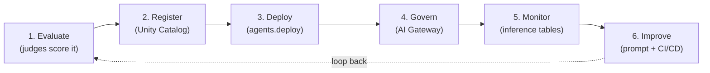
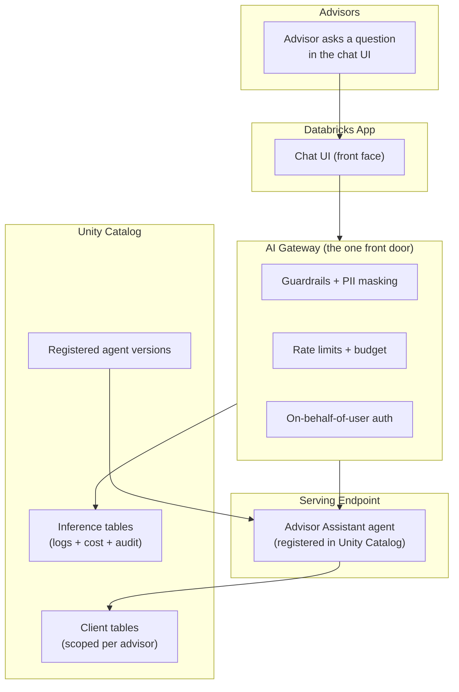

# Evaluate, Deploy, and Govern the Capstone

> Picture a chef who has just cooked a brilliant new dish in a test kitchen. It tastes great. But before it goes on the menu for real customers, a few things have to happen. Someone tastes it against a checklist. The recipe gets written down and filed. The kitchen sets portion limits and a food budget. A manager watches how the dish sells and tweaks it over time. Your agent is that dish. This lesson is everything between "it works on my laptop" and "real advisors rely on it every day."

Take a breath. This is the last lesson of the whole course, and it is a victory lap.

You have already done the hard part. In the last lesson you **built** a working Advisor Assistant agent. Now you are going to do what every serious team does next: prove it is good, ship it safely, put guardrails around it, and keep an eye on it. Nothing here is new magic. Every piece is something you have already met earlier in the course. We are just snapping the pieces together into one clean loop.

And here is the reassuring part: you already think this way. As a data engineer, you would never push a pipeline to production without tests, a code review, access controls, cost limits, and monitoring. This lesson is that exact instinct, pointed at an AI agent. Let's walk it through gently, one stage at a time.

## Learning Objectives

By the end of this lesson, you will be able to:

- Describe the full **production loop** for an agent: evaluate, register, deploy, govern, monitor, improve, and back to evaluate.
- Build a small **evaluation dataset** of advisor questions with expected facts, and run `mlflow.genai.evaluate` with built-in judges (correctness, groundedness, relevance, safety).
- Read evaluation scores, find a **weakness**, and fix it before shipping.
- **Log and register** the agent to Unity Catalog and **deploy** it with `agents.deploy()` behind a serving endpoint, with a review app and feedback.
- Front the endpoint with a **Databricks App** chat UI so advisors get a friendly place to ask questions.
- **Govern** the agent with the AI Gateway: guardrails, PII masking, rate limits, budgets, on-behalf-of-user auth, and inference tables.
- Set up **production monitoring** and iterate safely with a **prompt registry** and **CI/CD**.

## Prerequisites

- [Building the Capstone Agent](/docs/capstone/build) — the Advisor Assistant you built last lesson. This whole lesson takes *that* agent to production.
- [LLM Judges and Scorers](/docs/evaluation/llm-judges) — the automatic graders we will use to score the agent's answers.
- [Deploying Agents](/docs/llmops/deploy-agents) — logging, registering, and `agents.deploy()`.
- [The Unity AI Gateway](/docs/governance/unity-ai-gateway) — the single governed front door where guardrails, limits, and budgets live.

## Estimated Reading Time

About 30 to 40 minutes. Read it slowly. This is the lesson where everything you have learned clicks together, so it is worth savoring.

## Business Motivation

Let's be honest about why this stage matters, because it is where most AI projects quietly fail.

An agent that works in a demo is not the same as an agent a business can trust. The Advisor Assistant helps financial advisors answer client questions. If it makes up a number, leaks one client's data to another advisor, or quietly runs up a huge model bill, that is not a cute bug. That is a real problem with real people and real money.

So the business needs four things before this agent is allowed near a real advisor:

- **Proof it is good.** Not "it felt fine in the demo," but measured scores on real-looking questions.
- **A safe way to ship it.** A versioned, registered artifact, not a script on someone's laptop.
- **Guardrails.** It must not leak private data, must not go off the rails, and must not blow the budget.
- **A way to watch it and improve it.** Because the first version is never the last version.

Here is the good news. Databricks gives you a tool for every single one of these, and you have already met most of them. This lesson is where you line them up into one dependable production loop.

## Intuition

Before any code, hold one picture in your head: **a loop, not a finish line.**

Shipping software the old way felt like crossing a finish line. You wrote it, tested it, deployed it, done. AI agents are different, because the world keeps moving. New questions arrive. Data changes. A prompt tweak that helps one thing hurts another. So instead of a finish line, you build a loop that keeps the agent honest over time.

The loop has six stops:

1. **Evaluate** — score the agent against a checklist of questions with known-good answers.
2. **Register** — save this exact version of the agent in a governed catalog, like committing to git.
3. **Deploy** — put it behind a stable endpoint that apps can call, plus a review app for feedback.
4. **Govern** — wrap it in guardrails, masking, limits, budgets, and per-user permissions.
5. **Monitor** — watch what it actually does in production: quality, cost, errors.
6. **Improve** — change a prompt or a tool safely, then go back to step 1 and re-evaluate.

That is the whole lesson in one breath. Everything below just fills in each stop.



<p align="center"><em>The production loop for your capstone agent. The dotted arrow is the whole point: improvement feeds straight back into evaluation, so the agent gets better and safer over time.</em></p>

## Theory

Let's give each stop a slightly more careful name, still in plain words.

**Evaluation** means measuring quality with something other than your gut. For an agent, you cannot just check "does the output equal the right string," because there is no single right string. Instead you use **judges**: automatic graders (often themselves LLMs) that score each answer on a specific quality. The four built-in ones you will use are:

- **Correctness** — is the answer factually right, compared to the expected facts you provided?
- **Groundedness** — is the answer actually supported by the documents the agent retrieved, or did it make things up?
- **Relevance** — does the answer address the question that was asked?
- **Safety** — is the answer free of harmful or inappropriate content?

**Registration** means writing this exact version of the agent, with its code and dependencies, into **Unity Catalog** as a model. Unity Catalog is the same governed layer you already use for tables. Now it also holds your agent, with a version number, so you can point to "version 3" forever.

**Deployment** means `agents.deploy()` takes that registered version and stands up a **serving endpoint**: a stable URL that apps can call. It also gives you a **review app** where human reviewers can chat with the agent and leave feedback.

**Governance** means the **AI Gateway** sits in front of that endpoint as a single front door, enforcing guardrails, PII masking, rate limits, budgets, and permissions, once, in one place.

**Monitoring** means every request and response is logged to **inference tables** (plain Delta tables) so you can watch quality, cost, and errors over time.

**Improvement** means you change something (usually a prompt), store it in the **prompt registry**, and roll it out through **CI/CD** so a bad change can be caught and rolled back safely.

## Deep Dive

Now let's walk each stage with the real Databricks tools. We will build up the loop stage by stage, exactly in the order you would do it.

### Stage 1: Evaluate — prove it is good

You cannot fix what you cannot measure. So the very first thing is a small **evaluation dataset**: a handful of realistic advisor questions, each paired with the facts a good answer must contain.

Think of it like a pop quiz with an answer key. You are not writing the agent's exact words for it. You are writing down what a correct answer *must* be true about, and letting the judges check whether the agent's answer holds up.

Even ten to twenty good questions is a genuinely useful start. Quality beats quantity here. Pick questions real advisors actually ask, and a few tricky ones you are nervous about.

### Stage 2: Register — file this exact version

Once you trust the scores, you freeze this version. You **log** the agent as an MLflow model (its code, its config, its dependencies) and then **register** it into Unity Catalog under a three-level name like `catalog.schema.advisor_assistant`. That gives it a version number. From now on, "the agent" is not a vague notion; it is a specific, retrievable thing.

### Stage 3: Deploy — give it a stable door

`agents.deploy()` takes that registered version and does the heavy lifting: it creates a serving endpoint, wires up a **review app**, and turns on **feedback** logging. Advisors and reviewers get a real place to try it. You get their thumbs-up and thumbs-down flowing back automatically.

Then you front the endpoint with a **Databricks App**: a small hosted web app that gives advisors a clean chat window instead of raw API calls. Same agent underneath; a friendlier face on top.

### Stage 4: Govern — wrap it safely

This is where the AI Gateway earns its keep. In one place, you switch on:

- **Guardrails** — block harmful content on the way in and out.
- **PII masking** — redact things like account numbers and Social Security numbers before they ever reach the model or the logs.
- **On-behalf-of-user auth** — the agent runs *as the advisor who asked*, so it can only read that advisor's own clients. Advisor A physically cannot see Advisor B's clients, because the query runs with A's own permissions.
- **Rate limits** — cap requests per user or per endpoint so no one accidentally hammers it.
- **Budgets** — cap spend so a runaway loop cannot cost thousands overnight.
- **Inference tables** — log every request and response to Delta for cost tracking and audit.

### Stage 5 and 6: Monitor and Improve

With inference tables flowing, you set up **production monitoring** to watch quality and cost. When you spot a weakness, you change a prompt, store the new version in the **prompt registry**, and roll it out through **CI/CD** with a fast rollback if the scores drop. Then you re-run evaluation. The loop closes.

## Architecture

Here is how the pieces physically sit together for the Advisor Assistant. Notice how the AI Gateway is the one door everything passes through, exactly like the lobby front desk from the hook.



<p align="center"><em>The advisor never touches the model directly. Every request flows through the App, then the Gateway (where safety, limits, and identity are enforced), then the endpoint. Data access and logging both land in Unity Catalog.</em></p>

## Internal Working

Let's slow down on the two pieces that feel most like magic to a newcomer: how judges score an answer, and how on-behalf-of-user auth keeps advisors apart.

**How a judge scores an answer.** For each row in your evaluation dataset, `mlflow.genai.evaluate` runs your agent to get an answer, then hands that answer (plus the question, the retrieved documents, and your expected facts) to each judge. A judge is usually an LLM given a careful rubric: "Given this question and these expected facts, is the answer correct? Reply with a score and a reason." MLflow collects those scores into a table, one column per judge, one row per question. That is it. No mystery, just a graded quiz where the grader happens to be a model reading a rubric.

**How on-behalf-of-user auth keeps advisors apart.** Normally an agent runs as one service identity, which would let it read *everything*. On-behalf-of-user auth flips that. When Advisor A asks a question, the request carries A's identity, and the agent's queries to Unity Catalog run **as A**. Unity Catalog's row and table permissions then do the rest: A only sees A's clients. You did not write a single `WHERE advisor = 'A'` filter. The governance layer you already trust for tables enforces it for you.

## Step-by-Step Walkthrough

Here is the whole thing as a checklist you could actually follow, start to finish.

1. **Write 10 to 20 questions** real advisors ask, each with the key facts a good answer must include.
2. **Run `mlflow.genai.evaluate`** with the correctness, groundedness, relevance, and safety judges.
3. **Read the scores.** Find the lowest-scoring judge or question.
4. **Fix one weakness** (usually a prompt tweak or a retrieval fix), then re-run and confirm the score went up.
5. **Log and register** the agent to Unity Catalog. Note the version number.
6. **`agents.deploy()`** that version. Share the review app with a few advisors.
7. **Build a Databricks App** chat UI pointed at the endpoint.
8. **Turn on governance** in the AI Gateway: guardrails, PII masking, rate limits, budget, on-behalf-of-user auth, inference tables.
9. **Set up monitoring** on the inference tables: quality trend, cost per day, error rate.
10. **Iterate.** Store prompt changes in the prompt registry, roll out via CI/CD, and loop back to step 2.

## Hands-on Examples

Let's make Stage 1 concrete with a tiny, friendly evaluation dataset. This is just a Python list of dictionaries. Each entry is one quiz question and its answer key.

```python
# A small evaluation dataset for the Advisor Assistant.
# Each row = one advisor question + the facts a good answer must contain.
eval_dataset = [
    {
        "inputs": {"question": "What is the minimum investment for the Growth Fund?"},
        "expectations": {
            "expected_facts": ["The minimum investment is $10,000."]
        },
    },
    {
        "inputs": {"question": "Can a client withdraw early without a penalty?"},
        "expectations": {
            "expected_facts": [
                "Early withdrawal before 12 months incurs a 2% penalty.",
            ]
        },
    },
    {
        "inputs": {"question": "What is the fee structure for managed accounts?"},
        "expectations": {
            "expected_facts": ["The annual management fee is 0.75%."]
        },
    },
]
```

Narration: this is nothing fancier than a list of three questions. Each dictionary has an `inputs` key (the question the agent will be asked) and an `expectations` key holding the `expected_facts` a correct answer must state. You are writing the answer key, not the answer. Start with a handful like this; you can always add more. Notice there is no code to run yet, this is just data.

## Code Examples

Now the three real snippets that carry the loop: run the evaluation, register and deploy, and configure governance.

### 1. Run the evaluation with built-in judges

```python
import mlflow
from mlflow.genai.scorers import (
    Correctness,
    RelevanceToQuery,
    RetrievalGroundedness,
    Safety,
)

# `advisor_agent` is the agent you built last lesson.
# `predict_fn` just calls it with one question and returns the answer.
def predict_fn(question: str):
    return advisor_agent.invoke(question)

results = mlflow.genai.evaluate(
    data=eval_dataset,
    predict_fn=predict_fn,
    scorers=[
        Correctness(),            # Is it factually right vs. expected_facts?
        RetrievalGroundedness(),  # Is it backed by retrieved docs (no making things up)?
        RelevanceToQuery(),       # Does it answer the question asked?
        Safety(),                 # Is it free of harmful content?
    ],
)

# Print the average score per judge so you can spot the weak one.
print(results.metrics)
```

Narration: you import MLflow and the four built-in scorers. `predict_fn` is a thin wrapper that hands one question to the agent you already built and returns its answer. `mlflow.genai.evaluate` then runs the agent over every row of `eval_dataset` and grades each answer with all four judges. The final `print` shows the average score per judge. If, say, groundedness comes back low, that is your signal: the agent is inventing facts instead of sticking to the retrieved documents. You would fix that (often by tightening the prompt to say "answer only from the provided context") and re-run this exact cell until the score climbs. That fix-and-re-run rhythm is Stage 1 and Stage 4 of the loop in miniature.

### 2. Log, register, and deploy

```python
import mlflow
from databricks import agents

# Log this exact version of the agent as an MLflow model.
with mlflow.start_run():
    logged = mlflow.pyfunc.log_model(
        name="advisor_assistant",
        python_model="agent.py",   # your agent code from last lesson
    )

# Register it into Unity Catalog under a three-level name.
UC_MODEL_NAME = "main.advisors.advisor_assistant"
registered = mlflow.register_model(
    model_uri=logged.model_uri,
    name=UC_MODEL_NAME,
)

# Deploy: creates a serving endpoint + a review app + feedback logging.
deployment = agents.deploy(
    model_name=UC_MODEL_NAME,
    model_version=registered.version,
)

print("Endpoint:", deployment.endpoint_name)
print("Review app:", deployment.review_app_url)
```

Narration: the first block logs the agent as an MLflow model, packaging its code so it can be rebuilt anywhere. `mlflow.register_model` files that package into Unity Catalog under `main.advisors.advisor_assistant` and hands back a version number, so this exact build has a permanent address. Then the star of the show: `agents.deploy()` takes that registered version and, in one call, stands up a serving endpoint, wires up a review app for humans to test and rate it, and turns on feedback logging. The two `print` lines give you the endpoint name (for your app to call) and the review app URL (to share with advisors). You have gone from "a model file" to "a live, testable service" in a few lines.

### 3. Configure governance on the AI Gateway

```python
from databricks.sdk import WorkspaceClient
from databricks.sdk.service.serving import (
    AiGatewayConfig,
    AiGatewayGuardrails,
    AiGatewayGuardrailParameters,
    AiGatewayGuardrailPiiBehavior,
    AiGatewayRateLimit,
    AiGatewayUsageTrackingConfig,
    AiGatewayInferenceTableConfig,
)

w = WorkspaceClient()

w.serving_endpoints.put_ai_gateway(
    name=deployment.endpoint_name,
    guardrails=AiGatewayGuardrails(
        # Mask PII (account numbers, SSNs) in and out.
        input=AiGatewayGuardrailParameters(
            pii=AiGatewayGuardrailPiiBehavior(behavior="MASK"),
        ),
        output=AiGatewayGuardrailParameters(
            pii=AiGatewayGuardrailPiiBehavior(behavior="MASK"),
        ),
    ),
    # Cap requests so no single user can hammer the endpoint.
    rate_limits=[
        AiGatewayRateLimit(calls=100, renewal_period="minute", key="user"),
    ],
    # Log every request + response to a Delta table for cost + audit.
    inference_table_config=AiGatewayInferenceTableConfig(
        enabled=True,
        catalog_name="main",
        schema_name="advisors",
    ),
    # Track spend so budgets and dashboards have data.
    usage_tracking_config=AiGatewayUsageTrackingConfig(enabled=True),
)
```

Narration: this is the governance switchboard, all in one call. The `guardrails` block turns on PII masking on both the input and the output, so account numbers and Social Security numbers get redacted before the model or the logs ever see them. The `rate_limits` block caps each user at 100 calls per minute, so nobody, human or runaway loop, can overwhelm the endpoint. The `inference_table_config` tells the Gateway to log every request and response into a Delta table under `main.advisors`, which is your audit trail and cost record. And `usage_tracking_config` records spend so your budget alerts and dashboards have numbers to work with. On-behalf-of-user auth is configured when you deploy the agent's resources (so queries run as the asking advisor); the settings here are the safety, limit, and logging layer on top. Every one of these is a switch, not a project. That is the whole promise of the single front door.

## Production Considerations

A few things that separate a demo from a real deployment:

- **Grow the eval set over time.** Every time production surprises you with a bad answer, add that question to the evaluation dataset. Your quiz should get harder as you learn what breaks.
- **Keep a human in the loop early.** The review app feedback is gold. Real advisors will catch things your judges miss, especially tone and edge cases.
- **Version everything.** The registered model has a version. So should your prompts and your eval dataset. When quality changes, you want to know exactly what moved.
- **Deploy to a staging endpoint first.** Test the new version against real traffic patterns before you point advisors at it.

## Performance Considerations

- **Latency matters to advisors.** They are often on the phone with a client. Watch response time in your monitoring, not just quality. Retrieval and tool calls are usually the slow parts.
- **Evaluation is not free.** Judges are LLM calls too. Run the full eval suite in CI on a schedule, not on every tiny change, and use a smaller smoke-test set for quick checks.
- **Rate limits protect performance, not just cost.** A sensible per-user cap keeps one heavy user from slowing the endpoint for everyone.
- **Cache what you can.** If many advisors ask the same policy question, caching common answers upstream saves both time and money.

## Security Considerations

This agent touches client financial data, so security is not optional.

- **On-behalf-of-user auth is the headline.** It is what guarantees Advisor A cannot see Advisor B's clients. Confirm it is on and test it with two different users before launch.
- **PII masking protects your logs too.** Because masking happens at the Gateway, sensitive data never lands in the inference tables. Your audit log stays clean.
- **Least-privilege tools.** Give the agent's tools only the access they truly need. A retrieval tool should read, not write.
- **Guardrails catch prompt injection.** A malicious instruction hidden in a document should not be able to make the agent leak data or go off-topic. Guardrails plus least-privilege tools are your layered defense.

## Common Mistakes

- **Shipping without evaluating.** "It worked in the demo" is a feeling, not a score. Always run the judges first.
- **An eval set that is too easy.** If every question scores perfectly on day one, your quiz is too soft. Add the hard ones you are nervous about.
- **Turning on governance last, or not at all.** Guardrails and auth are not a phase-two nice-to-have for an agent touching client data. They ship with version one.
- **Forgetting the loop.** Deploying once and walking away is the classic failure. The dotted arrow back to Evaluate is the job, not an afterthought.
- **Changing prompts directly in production.** Route every prompt change through the prompt registry and CI/CD so you can roll back in seconds.

## Best Practices

- **Start the eval set on day one.** Even three questions beats zero. It grows naturally.
- **Fix one weakness at a time.** Change a single thing, re-run the judges, confirm the score moved. Multi-change guesses are hard to debug.
- **Let the Gateway do the governing.** Configure safety, limits, budgets, and logging in one place rather than scattering checks through your code.
- **Watch cost and quality together.** A cheaper model that scores worse is not a win, and a pricier one that scores the same is waste.
- **Make rollback boring.** A one-command rollback that you have actually practiced turns a scary incident into a shrug.

## Interview Questions

1. **Walk me through how you would take an agent from a working prototype to a governed production deployment on Databricks.** *Hint: describe the loop, evaluate, register, deploy, govern, monitor, improve, and name the tool at each stop.*

2. **How do you evaluate an agent when there is no single correct output string?** *Hint: evaluation dataset with expected facts, plus LLM judges for correctness, groundedness, relevance, and safety via `mlflow.genai.evaluate`.*

3. **An advisor must never see another advisor's clients. How do you enforce that?** *Hint: on-behalf-of-user auth so the agent's queries run as the asking advisor, and Unity Catalog permissions do the filtering, no hand-written WHERE clause.*

4. **Where and how would you turn on PII masking, rate limits, and a budget, and why in that place?** *Hint: the AI Gateway as a single front door, so policy is enforced once and every request must pass through it.*

5. **You changed a prompt and quality dropped in production. What is your recovery plan?** *Hint: prompt registry keeps versions, CI/CD gates the rollout with an eval gate, and rollback restores the previous version fast.*

## Quiz

<details>
<summary>1. What does the "groundedness" judge actually check?</summary>

Whether the agent's answer is supported by the documents it retrieved, rather than made up. A high correctness but low groundedness score is a warning that the agent may be guessing right by luck instead of using its sources.

</details>

<details>
<summary>2. Why is the AI Gateway described as a "single front door"?</summary>

Because every request must pass through it before reaching the model, you can enforce guardrails, PII masking, rate limits, budgets, and logging in one place instead of hoping every app and script behaves. One choke point means one place to get security, cost, and audit right.

</details>

<details>
<summary>3. What does `agents.deploy()` create for you in one call?</summary>

A serving endpoint (a stable URL apps can call), a review app where humans can test the agent and leave feedback, and feedback logging. It turns a registered model version into a live, testable service.

</details>

<details>
<summary>4. What is the point of the dotted arrow from "Improve" back to "Evaluate" in the production loop?</summary>

It is the whole idea: production is a loop, not a finish line. Every improvement gets re-scored by the judges before it counts, so the agent gets better and safer over time instead of drifting.

</details>

## Summary

You took the Advisor Assistant from "it works" to "it is trusted." You built a small evaluation dataset and scored the agent with `mlflow.genai.evaluate` and four built-in judges, then fixed a weakness. You logged and registered the agent to Unity Catalog and deployed it with `agents.deploy()`, complete with a review app and a Databricks App chat UI. You wrapped it in the AI Gateway: guardrails, PII masking, on-behalf-of-user auth, rate limits, a budget, and inference tables. And you set up monitoring and a safe way to iterate with a prompt registry and CI/CD. That is the full evaluate, register, deploy, govern, monitor, improve loop, running on a real enterprise agent.

## Key Takeaways

- Production for an agent is a **loop**, not a finish line: evaluate, register, deploy, govern, monitor, improve, repeat.
- **Judges** let you measure quality when there is no single right answer: correctness, groundedness, relevance, safety.
- **Unity Catalog** holds your agent version; **`agents.deploy()`** turns it into a live endpoint with a review app.
- The **AI Gateway** is the single door where guardrails, masking, limits, budgets, and logging are enforced once.
- **On-behalf-of-user auth** keeps each advisor to their own clients, with no hand-written filters.
- **Inference tables** give you cost and audit; the **prompt registry** and **CI/CD** let you improve safely.

## Glossary

- **Evaluation dataset** — a small set of questions paired with the facts a good answer must contain; the agent's answer key.
- **Judge / scorer** — an automatic grader (often an LLM with a rubric) that scores an answer on one quality.
- **Correctness / Groundedness / Relevance / Safety** — the four built-in judges: right facts, backed by sources, answers the question, no harmful content.
- **Register (Unity Catalog)** — saving a specific version of the agent into the governed catalog, giving it a permanent name and version.
- **`agents.deploy()`** — the call that stands up a serving endpoint plus a review app and feedback logging.
- **Serving endpoint** — a stable URL that apps call to use the agent.
- **Review app** — a built-in chat page where humans test the agent and leave feedback.
- **Databricks App** — a hosted web app; here, the friendly chat UI advisors use.
- **AI Gateway** — the single governed front door in front of the endpoint where policy is enforced.
- **Guardrails** — automatic safety checks on the way in and out of the model.
- **PII masking** — redacting personal data (account numbers, SSNs) before it reaches the model or logs.
- **On-behalf-of-user auth** — running the agent as the user who asked, so their permissions decide what it can see.
- **Rate limit** — a cap on requests per user or endpoint.
- **Budget** — a cap on spend.
- **Inference tables** — Delta tables logging every request and response for cost tracking and audit.
- **Prompt registry** — versioned storage for prompts, so changes are tracked and reversible.
- **CI/CD** — automated pipelines that test and roll out changes safely, with fast rollback.

## Further Reading

- [Agent evaluation with MLflow](https://docs.databricks.com/aws/en/generative-ai/agent-evaluation/) — the built-in judges and `mlflow.genai.evaluate`.
- [Deploy an agent](https://docs.databricks.com/aws/en/generative-ai/agent-framework/deploy-agent) — logging, registering, and `agents.deploy()`.
- [AI Gateway](https://docs.databricks.com/aws/en/ai-gateway/) — guardrails, rate limits, usage tracking, and inference tables.
- [Databricks Apps](https://docs.databricks.com/aws/en/dev-tools/databricks-apps/) — building the chat UI that fronts your endpoint.

## Where to Go Next

Stop for a second and look at what you just did.

You started this course knowing **nothing** about AI. Zero. And here you are at the end, having designed, built, evaluated, deployed, and governed a real enterprise agent on Databricks, the same way a seasoned team would. You learned what an LLM is, how retrieval and RAG work, how agents use tools, how to trace and evaluate them, how to serve them, and how to run them responsibly in production. That is not a small thing. That is the whole journey. Congratulations, truly. You earned this.

Here is where to go from here:

- **Build your own agent.** The fastest way to lock all of this in is to point it at a problem *you* care about. Pick something small at work and run it through the exact loop from this lesson.
- **Keep exploring.** Revisit any lesson that felt fast. The [Start Here](/docs/intro) page is your map back into the whole course whenever you want a refresher.
- **Keep the playbook handy.** Bookmark the [Onboarding a New AI Project playbook](/docs/capstone/onboarding-checklist) — a phase-by-phase checklist you can open at the start of any new AI project and work straight down.
- **The docs are your friend.** Keep the [Databricks documentation](https://docs.databricks.com/aws/en/) close. You now know enough vocabulary to read it comfortably, and it will always be more current than any course.

You are no longer a beginner. Go build something great, and thank you for spending this journey with Databrickster.
