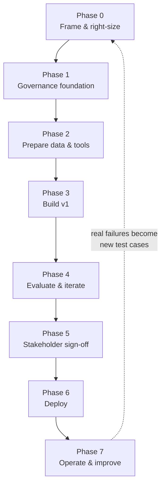

# Onboarding a New AI Project: The Playbook

> You've learned every piece. This is the field guide that puts them in order — a checklist you can open at the start of *any* new AI project and work straight down.

You finished the lessons. This page is different: it's a **reusable playbook**, not new theory. When your team greenlights a new AI project, open this, work top to bottom, and you'll hit the things that matter in the order that matters — with governance and cost set up *before* they become fire drills.

Every phase links to the lesson that goes deep, so this doubles as a map back into the course.

## Learning Objectives

By the end of this page you will be able to:

- Follow a repeatable, end-to-end sequence to onboard a new AI project on Databricks.
- Explain **why the order matters** — especially defining success metrics and setting up governance *early*.
- Right-size the solution (AI Function vs Knowledge Assistant vs Genie vs custom agent) instead of over-building.
- Use the one-page checklist as a real project kickoff artifact.

## Prerequisites

This is a capstone-level summary. It assumes you've met the ideas across the course. If a step is fuzzy, follow its link. A good pre-read is [The Agent Development Lifecycle](/docs/building-agents/agent-dev-lifecycle), which this playbook operationalizes.

## Estimated Reading Time

~15 minutes (and then it's a reference you'll reopen for years).

## Business Motivation

Most AI projects don't fail on the model — they fail on the *setup*. A team dives into prompts on day one, and three months later discovers there were no success metrics to prove it works, no governance to pass the audit, and a surprise bill because nobody set a budget. None of that is hard to avoid; it just has to happen **in the right order**. This playbook is that order.

## The shape of it



*The seven phases, in order. Notice the dotted loop: once you're live, real-world failures feed back into your success criteria and evaluation set — the project never truly "ends," it improves.*

Two habits separate smooth projects from painful ones, and both live early: **define success metrics before building (Phase 0)**, and **set up governance and cost controls before launch (Phase 1)**.

## Phase 0 — Frame it (before you touch a notebook)

The goal here is clarity, not code.

- [ ] Write down the **use case, the users, and how you'll measure success** — quality criteria (accuracy, groundedness, tone, citations) and constraints (latency, cost, safety). See [Why Evaluating AI Is Hard](/docs/evaluation/why-eval-is-hard).
- [ ] Confirm it's **actually a GenAI problem**. Sometimes plain SQL or classic ML wins. Don't build an agent when a dashboard would do.
- [ ] **Right-size the pattern** (start with the highest-level tool that fits):
  - SQL batch enrichment → [AI Functions](/docs/llm-foundations/ai-functions)
  - Q&A over documents → [Knowledge Assistant](/docs/building-agents/knowledge-assistant)
  - Questions over tables → [Genie](/docs/building-agents/genie-agents)
  - Messy documents → [Intelligent Document Processing](/docs/building-agents/agent-bricks-idp)
  - Custom, multi-step logic → [Agent Framework](/docs/building-agents/authoring-agents)
- [ ] List the **data sources and tools** the app will need.
- [ ] Name your **domain experts and testers** — you'll need them for evaluation and sign-off.

## Phase 1 — Lay the governance foundation (early, not later)

The single highest-leverage phase for a regulated shop. See [Part 9 · Governance](/docs/governance/unity-ai-gateway).

- [ ] Create the **Unity Catalog** structure — a catalog/schemas for the project (data *and* AI assets: models, functions, indexes, agents all live here).
- [ ] Set up a **service principal**, groups, and **least-privilege grants** (`USE`, `SELECT`, `EXECUTE`, endpoint access).
- [ ] Decide the **auth model** now: [on-behalf-of-user vs service principal](/docs/governance/auth-and-permissions) — critical if different users may see different data.
- [ ] Create **secret scopes** for any external API keys (never hardcode).
- [ ] Set initial **AI Gateway rate limits and a budget** so nothing can run away. See [Cost, Rate Limits, and Budgets](/docs/governance/cost-and-budgets).
- [ ] Set up the **repo, Databricks Asset Bundles, dev/staging/prod**, and an **MLflow experiment** for the project.

## Phase 2 — Prepare data & tools

- [ ] **Ingest** source data into Delta (bronze → silver) with your normal data-quality checks.
- [ ] **For RAG:** parse ([`ai_parse_document`](/docs/llm-foundations/ai-functions)/IDP) → [chunk](/docs/rag-and-ai-search/chunking) → build a [Vector Search index](/docs/rag-and-ai-search/vector-search-index) (Delta Sync + Change Data Feed).
- [ ] **For structured data:** model tables well, add clear **column comments**, and set up a [Genie space](/docs/building-agents/genie-agents) and/or [Unity Catalog function tools](/docs/agents-tools-mcp/unity-catalog-tools).
- [ ] **Choose model endpoints** — start on [pay-per-token](/docs/serving/foundation-model-apis).

## Phase 3 — Build v1

- [ ] **Prototype the prompt** in the [AI Playground](/docs/llm-foundations/calling-foundation-models) (no code).
- [ ] **Build the first version** — low-code [Agent Bricks](/docs/building-agents/agent-bricks) or code-first [`ResponsesAgent`](/docs/building-agents/authoring-agents).
- [ ] **Turn on [MLflow Tracing](/docs/tracing/mlflow-tracing) from day one** — you'll need it to debug.
- [ ] Wire **authentication** (on-behalf-of-user where per-user data access matters).

## Phase 4 — Evaluate & iterate

- [ ] Build an [evaluation dataset](/docs/evaluation/evaluation-datasets) (from traces, experts, and synthetic-then-reviewed examples).
- [ ] Run [`mlflow.genai.evaluate`](/docs/evaluation/llm-judges) with judges; diagnose **retrieval vs generation** failures separately (see [Making RAG Actually Good](/docs/rag-and-ai-search/rag-quality)).
- [ ] Collect [human feedback](/docs/evaluation/human-feedback) via the Review App; calibrate your judges against it.
- [ ] Version prompts in the [Prompt Registry](/docs/llmops/prompt-registry).

## Phase 5 — Align with stakeholders (the sign-off gate)

Don't skip this — it's [Stage 4 of the official lifecycle](/docs/building-agents/agent-dev-lifecycle).

- [ ] Translate eval and system metrics into **business language**.
- [ ] Run an **operational-readiness review**; confirm monitoring and guardrails are configured.
- [ ] **Document the risks** and agree **acceptance criteria** with stakeholders.

## Phase 6 — Deploy

- [ ] [Log + register](/docs/llmops/log-and-register) the agent to Unity Catalog.
- [ ] [`agents.deploy()`](/docs/llmops/deploy-agents) → a Model Serving endpoint (+ review app + feedback capture).
- [ ] Front it with a [Databricks App](/docs/building-agents/databricks-apps) chat UI.
- [ ] Turn on [guardrails, PII masking](/docs/governance/guardrails-and-safety), rate limits, and budgets at the AI Gateway.

## Phase 7 — Operate & improve

- [ ] Enable [production monitoring](/docs/evaluation/production-monitoring) (scorers on sampled live traces), dashboards, and SQL quality alerts.
- [ ] Set up [CI/CD with Asset Bundles](/docs/llmops/cicd-and-rollback), promoting dev → staging → prod **gated on evaluation**, with **canary rollout and rollback**.
- [ ] **Feed real-world failures back** into the evaluation dataset — the loop closes to Phase 0.

## The one-page checklist

Copy this into your project kickoff doc.

```text
PHASE 0 — FRAME
  [ ] Use case + users + success metrics written down
  [ ] Confirmed it's a GenAI problem (not SQL/classic ML)
  [ ] Right-sized the pattern (AI Function / KA / Genie / IDP / Agent)
  [ ] Data sources + tools listed; experts + testers named

PHASE 1 — GOVERNANCE FOUNDATION
  [ ] Unity Catalog catalog/schemas created (data + AI assets)
  [ ] Service principal + groups + least-privilege grants
  [ ] Auth model chosen (on-behalf-of-user vs service principal)
  [ ] Secret scopes for external keys
  [ ] AI Gateway rate limits + budget set
  [ ] Repo + Asset Bundles + dev/staging/prod + MLflow experiment

PHASE 2 — DATA & TOOLS
  [ ] Data ingested to Delta (bronze -> silver) + quality checks
  [ ] RAG: parse -> chunk -> Vector Search index (Delta Sync + CDF)
  [ ] Structured: modeled tables + comments + Genie / UC function tools
  [ ] Model endpoints chosen (start pay-per-token)

PHASE 3 — BUILD v1
  [ ] Prompt prototyped in AI Playground
  [ ] v1 built (Agent Bricks or ResponsesAgent)
  [ ] MLflow Tracing enabled
  [ ] Authentication wired

PHASE 4 — EVALUATE & ITERATE
  [ ] Evaluation dataset built
  [ ] mlflow.genai.evaluate run; retrieval vs generation diagnosed
  [ ] Human feedback collected; judges calibrated
  [ ] Prompts versioned in Prompt Registry

PHASE 5 — STAKEHOLDER SIGN-OFF
  [ ] Metrics translated to business language
  [ ] Operational-readiness review done
  [ ] Risks documented + acceptance criteria agreed

PHASE 6 — DEPLOY
  [ ] Logged + registered to Unity Catalog
  [ ] agents.deploy() -> serving endpoint (+ review app)
  [ ] Databricks App chat UI
  [ ] Guardrails + PII + rate limits + budgets on

PHASE 7 — OPERATE & IMPROVE
  [ ] Production monitoring + dashboards + alerts
  [ ] CI/CD (Asset Bundles), eval-gated, canary + rollback
  [ ] Real failures fed back into eval dataset
```

## Common Mistakes

- ❌ **Building before defining success metrics.** You can't tell if you're done, and neither can the auditor. → ✅ Phase 0 first.
- ❌ **Bolting on governance and budgets after launch.** Painful and risky. → ✅ Phase 1, before any building.
- ❌ **Hand-coding an agent for a standard pattern.** → ✅ Right-size: often a Knowledge Assistant or an AI Function is enough.
- ❌ **Skipping stakeholder sign-off (Phase 5).** The model can be great and still fail the business/compliance bar. → ✅ Make it a gate.
- ❌ **Treating launch as the finish line.** → ✅ Phase 7 is a loop; real failures are your best future test cases.

## Best Practices

- ✅ **Define success metrics before building**, and **set up governance + cost controls in Phase 1.** These two habits prevent most disasters.
- ✅ **Start with the highest-level tool that fits**, and only drop to custom code when you must.
- ✅ **Turn on tracing and pin a budget from day one.**
- ✅ **Keep a living evaluation dataset** — grow it with every real failure.
- ✅ **Gate production on evaluation**, and always have a rollback path.

## Summary

Onboarding an AI project on Databricks is a seven-phase sequence: **frame and right-size → lay the governance foundation → prepare data and tools → build v1 → evaluate and iterate → get stakeholder sign-off → deploy → operate and improve** (which loops back). The order is the point: metrics before building, governance and budgets before launch. Work down the one-page checklist and you'll do the right things in the right order — and pass the audit while you're at it.

## Key Takeaways

- Seven phases, in order: **Frame → Govern → Data/Tools → Build → Evaluate → Sign-off → Deploy → Operate.**
- **Metrics first (Phase 0), governance + cost first (Phase 1)** — the two habits that save projects.
- **Right-size** the solution; don't over-build.
- Production is a **loop**: feed real failures back into evaluation.
- Every phase maps to a Part of this course — use this page as your map.

## Glossary

- **Right-sizing:** choosing the simplest capability that solves the problem (AI Function, Knowledge Assistant, Genie, IDP, or a custom agent) rather than defaulting to the most complex.
- **Governance foundation:** the Unity Catalog structure, identities, permissions, secrets, and AI Gateway limits/budgets set up before building.
- **Sign-off gate:** the stakeholder/operational-readiness review that must pass before production.
- **Eval-gated deploy:** a CI/CD promotion that only proceeds if evaluation clears a quality bar.

## Further Reading

- [The Agent Development Lifecycle](/docs/building-agents/agent-dev-lifecycle) — the 5-stage model this playbook operationalizes.
- [Databricks: Agent development lifecycle](https://docs.databricks.com/aws/en/agents/agents-dev-lifecycle)
- [Databricks: Generative AI concepts](https://docs.databricks.com/aws/en/agents/concepts/)

## Next Lesson

🎉 That's the whole journey — from *"what is a token?"* to onboarding and shipping a governed, production AI project. Head back to **[Start Here](/docs/intro)** to revisit any part, and go build something. You're ready.
