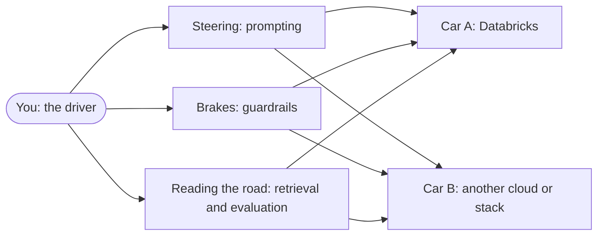
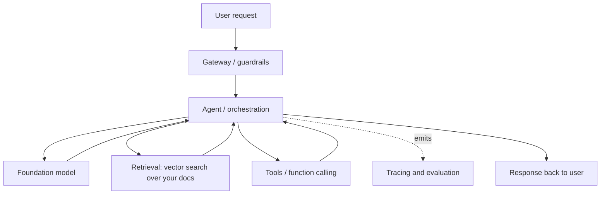

# The Concepts Are Portable

> You didn't learn "Databricks." You learned AI engineering. Databricks was the
> car you learned to drive in — the road, the steering, and the brakes work the
> same everywhere.

Take a breath. If there's a worry sitting quietly in the back of your mind — "I
only know how to do this *on Databricks*" — this lesson is here to put that worry
to rest. You are not locked in. The skills you built over this course belong to
*you*, and they travel.

Think about learning to drive. You probably learned in one specific car. But the
day you rent a different car on a trip, you don't panic. The steering wheel is
still in front of you. The brake is still the wide pedal. You glance around for a
few seconds to find the wipers, and then you just... drive. That is exactly what
moving between AI platforms feels like. The pedals are in the same place.

## Learning Objectives

By the end of this lesson you will be able to:

- Explain why every core AI concept in this course is **vendor-neutral** — it exists on every stack.
- Map each **Databricks capability** to its common **ecosystem equivalents** (models, vector search, agent frameworks, tracing, evaluation, and more).
- Describe the **open standards** — MCP, OpenAI-compatible APIs, and open-source MLflow — that make your skills portable and reduce lock-in.
- Recognize that switching platforms is mostly a matter of learning **new names for the same ideas**, not learning new ideas.
- Reassure a stakeholder (like our fictional Northwind Trust) that adopting Databricks does not trap them.

## Prerequisites

- [Start Here](/docs/intro). A quick orientation to how this course is built.
- [The Databricks AI Platform Map](/docs/orientation/databricks-ai-platform-map). This lesson is the mirror image of that one — the map showed you where each Databricks piece lives; here we show you its cousins on other stacks.

You don't need to have finished every lesson. But the more of the course you've
seen, the more satisfying this one will feel, because you'll recognize each
concept as an old friend.

## Estimated Reading Time

~18 minutes.

## Business Motivation

Back at **Northwind Trust** — our fictional asset manager — the AI initiative is
going well. The prototype answers client questions using the firm's own
documents, and leadership is pleased. Then, in a steering-committee meeting,
someone from procurement asks the question that every serious organization
eventually asks:

*"If we build all of this on Databricks, are we stuck? What happens if we want to
change vendors in three years?"*

It's a fair, healthy question. And here is the reassuring answer you can give with
full confidence: **the concepts don't move even if the vendor does.** Your team
learned tokens, embeddings, retrieval, prompting, agents, evaluation, and
operations. Those are the *load-bearing* skills. Databricks is one way to assemble
them into a running system — a very good one — but the assembly instructions read
almost the same everywhere.

Knowing this changes how Northwind buys. They can adopt Databricks for its real
strengths (governance, one integrated platform, data already living there)
*without* the fear of a one-way door. That's a much calmer place to make a
decision from.

## Intuition

Here's the whole idea in one picture.



*Diagram explanation:* The skills live in **you**, the driver — steering, braking,
reading the road. The *car* is whichever platform you happen to be in today. The
same three skills plug into Car A (Databricks) and Car B (something else) without
change. You don't relearn how to steer when you change cars. You just find where
the controls are.

Now swap the driving words for the real ones. "Steering" is **prompting**.
"Brakes" is **guardrails**. "Reading the road" is **retrieval and evaluation**.
Every one of those is a concept, not a product. Concepts are portable. Products
are just where the concept happens to be parked.

## Theory

Why *are* these concepts universal? Because they come from how large language
models fundamentally work — and the models work the same way no matter who is
hosting them.

Every provider's model does the same basic thing: it takes text, breaks it into
**tokens**, and predicts the next token based on the ones before it. That single
fact ripples out into everything else you learned:

- Because models see **tokens**, every provider charges and limits by tokens, and every provider has a **context window** (a maximum number of tokens it can consider at once).
- Because models are **probabilistic**, every provider gives you **sampling** controls like temperature to make output more or less varied.
- Because models can't read your private data, everyone invented **RAG** (retrieval-augmented generation) and **chunking** to feed the right context in.
- Because you need to find relevant chunks, everyone uses **embeddings** and **vector similarity** search.
- Because models are more useful when they can *act*, everyone built **agents**, **tools**, and **function calling**.
- Because these systems are non-deterministic and hard to debug, everyone needs **tracing**, **evaluation** (often with LLM "judges"), and **guardrails**.
- Because a prototype has to become a product, everyone needs **serving** and **LLMOps** (versioning, monitoring, rollout).

None of that is a Databricks invention. It's the shared vocabulary of the whole
field. Databricks packages these ideas under its own brand names; another vendor
packages the same ideas under different brand names. The ideas underneath are
identical.

:::note Going deeper (optional)

The reason providers converge so tightly is partly technical and partly social.
Technically, they're all building on the same transformer architecture and the
same research literature — a breakthrough published by one lab is usually
reimplemented by all the others within months. Socially, customers *demand*
compatibility, so providers copy each other's interfaces on purpose (see the
"OpenAI-compatible API" section below). The result is an ecosystem that looks
diverse on the surface but is remarkably uniform underneath.

:::

## Deep Dive

Let's make the mapping concrete. This is the heart of the lesson: for each
Databricks capability you learned, here are the common tools people use elsewhere
to do the *same job*. Naming other vendors here is not an endorsement or a
criticism — it's just so you recognize the words when you see them.

| The concept you learned | On Databricks | Common ecosystem equivalents |
|---|---|---|
| **Foundation models** | Databricks Foundation Model APIs | OpenAI, Anthropic, Google Gemini, Meta Llama (open weights), Mistral, Cohere |
| **Cloud model platform** | Databricks (Mosaic AI) | AWS Bedrock, Azure AI Foundry / Azure OpenAI, Google Vertex AI |
| **Vector search** | Databricks Vector Search | Pinecone, Weaviate, Milvus, Qdrant, Chroma, pgvector (Postgres), Elasticsearch / OpenSearch |
| **Agent / orchestration framework** | Agent Framework | LangChain, LlamaIndex, LangGraph, DSPy, Semantic Kernel |
| **Tracing / observability** | MLflow Tracing | LangSmith, Langfuse, Arize Phoenix |
| **Evaluation (judges)** | MLflow evaluation / judges | Ragas, TruLens, DeepEval |
| **Experiment / model tracking** | MLflow | *the same MLflow* — it is open source and runs anywhere |
| **Tool standard** | MCP (Model Context Protocol) | MCP — an open, cross-vendor standard |

*Table explanation:* Read it left to right. The **left column** is the idea — the
skill you actually own. The **middle column** is the Databricks-branded version you
practiced in this course. The **right column** is what your peers on other stacks
reach for to accomplish the very same thing. Notice that the left column never
changes meaning as you move right. A "vector search" is a vector search whether
it's called Databricks Vector Search or Pinecone. An "agent framework" orchestrates
tool-calling loops whether it's called Agent Framework or LangChain.

Two rows deserve special attention because they aren't just *similar* across
vendors — they are literally *shared*:

- **MLflow** is open source. The same MLflow you used on Databricks for tracking experiments, logging models, tracing, and evaluation runs perfectly well on your laptop, on a plain virtual machine, or on another cloud. Databricks contributes heavily to it and hosts a managed version, but the library is not proprietary. Skills you built with MLflow are not "Databricks skills" — they're MLflow skills, and MLflow is everywhere.
- **MCP** (Model Context Protocol) is an open standard for connecting models to tools and data. A tool you expose over MCP can be consumed by clients from many different vendors, not just Databricks. It was designed from the start to be cross-vendor.

## Architecture

Zoom out and look at the shape of any GenAI application. This is the architecture
every serious system converges on, regardless of vendor.



*Diagram explanation:* A request comes in and passes through a **gateway** that
applies **guardrails** (safety, rate limits, logging). It reaches an **agent** that
decides what to do. The agent may call a **model**, pull context from
**retrieval**, or invoke **tools**. Everything it does is recorded by **tracing and
evaluation** off to the side. Finally a response goes back to the user.

Here's the reassuring part: **this diagram has no vendor names in it.** It is the
same box-and-arrow picture whether you draw it for Databricks, for a
Bedrock-based system, for an Azure AI Foundry system, or for a hand-rolled stack
using LangChain and Pinecone. When you change platforms, you swap what fills each
box — but the boxes and the arrows stay put. That is what "portable architecture"
means in practice.

## Internal Working

Let's peek one level deeper at *why* moving between stacks is usually low-drama.
Consider what actually happens when your code talks to a model.

Your application sends an HTTP request containing your messages and some settings
(like `temperature` and `max_tokens`). The provider sends back a response
containing the generated text, plus token counts. That request-and-response shape
has become so standardized that most providers deliberately accept the **same
format** — widely called an "OpenAI-compatible API." Databricks Foundation Model
APIs support this format. So do many others.

That's why, in practice, changing model providers often comes down to changing
three things:

1. The **base URL** (which server you send the request to).
2. The **API key** (your credential for that server).
3. The **model name** (for example, a Llama model versus a Claude model versus a GPT model).

The *structure* of your code — how you build messages, how you read back the
answer, how you count tokens — usually stays the same. You'll see this in the
Code Examples section, and it's genuinely almost boring how similar it looks.

:::note Going deeper (optional)

It's not *always* a three-line change, and it's honest to say so. Providers differ
in the fine print: how they format tool/function calls, how they stream partial
responses, what safety filters they apply, and which sampling parameters they
support. Agent frameworks and gateways exist largely to smooth over these
differences so your application code doesn't have to care. The big idea holds — the
concepts and the overall shape transfer — but budget a little time for the details
when you actually migrate. Reading the road is the same skill; the wipers are in a
slightly different spot.

:::

## Step-by-Step Walkthrough

Imagine Northwind Trust decided, hypothetically, to move its document-Q&A agent
off Databricks and onto a different stack. Here's how the team would reason
through it, one box at a time — and notice that at every step they already know
the concept.

1. **Model.** "We were calling a foundation model. We'll point at a different provider's model instead. Same idea: send messages, get tokens back."
2. **Retrieval.** "We had a vector index of our documents. We'll stand up a different vector database and re-embed the chunks. Same idea: embeddings in, nearest neighbors out."
3. **Agent.** "Our agent decided when to retrieve and when to answer. We'll rebuild that loop in a different framework. Same idea: an orchestration loop with tool calls."
4. **Tools.** "Our tools were exposed over MCP. Good news — MCP is cross-vendor, so many of these move with little change."
5. **Tracing.** "We traced runs with MLflow. Even better news — MLflow is open source, so this may barely change at all."
6. **Evaluation.** "We scored answers with judges. We'll wire up a different eval library. Same idea: define metrics, run them over a dataset."
7. **Guardrails and serving.** "We wrapped the app behind a gateway. We'll put a different gateway in front. Same idea: a controlled front door."

At no point did the team say "we have no idea how to do this." Every step was
"same idea, new tool." That's the feeling portability gives you.

## Hands-on Examples

You don't need a second cloud account to *feel* portability. Try this thought
exercise, which many engineers find genuinely reassuring:

1. Open any notebook from earlier in this course.
2. For each cell, ask out loud: *"Is this line about an AI concept, or is it about a Databricks product name?"*
3. You'll find that the vast majority of your logic — building the prompt, chunking documents, deciding when to retrieve, checking the answer — is pure concept. The Databricks-specific parts are usually just the endpoint you call and the catalog path where things live.

That ratio *is* the portability of your skills, made visible. Most of what you
wrote would survive a platform change untouched.

## Code Examples

Here is the single most convincing piece of evidence. Below are two calls that do
the same thing — send a message to a model and get an answer — using an
OpenAI-compatible client. One points at Databricks; one points at another
provider. Look how nearly identical they are.

```python
# Talking to a model hosted on Databricks (OpenAI-compatible endpoint)
from openai import OpenAI

client = OpenAI(
    base_url="https://<your-workspace>.cloud.databricks.com/serving-endpoints",
    api_key="<your-databricks-token>",
)

response = client.chat.completions.create(
    model="databricks-meta-llama-3-3-70b-instruct",
    messages=[{"role": "user", "content": "Summarize our Q3 client report."}],
    temperature=0.2,
)
print(response.choices[0].message.content)
```

```python
# Talking to a different provider's model — same shape, three things changed
from openai import OpenAI

client = OpenAI(
    base_url="https://api.some-other-provider.com/v1",  # 1. different URL
    api_key="<your-other-provider-key>",                # 2. different key
)

response = client.chat.completions.create(
    model="some-other-model-name",                      # 3. different model name
    messages=[{"role": "user", "content": "Summarize our Q3 client report."}],
    temperature=0.2,
)
print(response.choices[0].message.content)
```

*Code explanation:* The two snippets are the same program. The only differences
are the **base URL**, the **API key**, and the **model name** — the three things we
flagged in Internal Working. The way you build `messages`, set `temperature`, and
read `response.choices[0].message.content` is unchanged. This is the OpenAI-
compatible API standard doing its job: it lets your *skills* — not just your code —
carry over. (Model names and exact URLs vary; treat these as illustrative.)

## Production Considerations

Portability of *concepts* is guaranteed. Portability of a *running production
system* takes a little planning. If Northwind wants to keep its options genuinely
open, a few habits help:

- **Isolate the vendor touchpoints.** Keep the "which provider, which URL, which key" details in one small config layer, not sprinkled through your code. Then a migration touches a few files, not hundreds.
- **Prefer open standards where you can.** Using MCP for tools and open-source MLflow for tracking means those pieces move with minimal friction.
- **Don't over-engineer for a move that may never come.** Building a giant abstraction layer "just in case" can cost more than it ever saves. Portable *skills* plus a thin config layer is usually the right balance.

## Performance Considerations

A quick, honest note so you're not surprised later: **equivalent tools are not
identical in performance.** Two vector databases both do nearest-neighbor search,
but they may differ in speed, recall tuning, and how they scale. Two model
providers both generate text, but latency, throughput, and quality vary by model.

The good news is that the *concepts you tune are the same everywhere* — chunk
size, number of retrieved results, embedding model choice, temperature, context
length. When you move, you re-tune those same dials for the new system's
characteristics. You already know which dials matter. You're just reading a new
gauge.

## Security Considerations

Security concepts are portable too, and this is often what a firm like Northwind
cares about most. Every serious stack has an answer for:

- **Identity and access** — who is allowed to call the model or read the documents. (Databricks uses Unity Catalog; other stacks use their own IAM systems.)
- **Secrets management** — where API keys live so they aren't hard-coded. Notice that even in the portable code example above, the key is a placeholder, never a literal.
- **Data residency and isolation** — where your data physically sits and who can see it.
- **Guardrails and content safety** — filtering inputs and outputs.

When you switch platforms, the *questions* stay the same; only the *product that
answers them* changes. Being able to ask the right security questions is itself a
portable skill — and arguably the most valuable one for a regulated firm.

## Common Mistakes

- **Believing your skills are "Databricks skills."** They're AI engineering skills. This is the myth this whole lesson exists to dispel.
- **Assuming migration is a one-line swap for everything.** The model call is often nearly that simple; tool-call formats, streaming, and safety filters can differ. Expect *some* fine print.
- **Building a huge abstraction layer prematurely** to avoid lock-in that may never bite you. Portable skills plus a thin config layer usually beats a heavy framework.
- **Confusing a brand name with a concept.** "We use Vector Search" describes a product; "we use vector similarity over embeddings" describes the transferable idea. Learn to hear the concept under the brand.
- **Forgetting that MLflow and MCP are open.** People sometimes re-solve problems these standards already solve portably.

## Best Practices

- **Learn the concept name alongside the product name.** When you use Agent Framework, silently note "this is an agent/orchestration framework." That mental translation is what makes you portable.
- **Keep vendor details in one place.** URLs, keys, model names, catalog paths — one config layer.
- **Lean on open standards** (MCP, OpenAI-compatible APIs, open-source MLflow) when they fit.
- **Evaluate the same way everywhere.** A good evaluation habit — datasets, judges, metrics — transfers directly and protects you during any migration.
- **Stay curious about the ecosystem.** Reading about how other tools name things deepens, rather than threatens, your Databricks knowledge.

## Interview Questions

1. **"Is what you learned specific to Databricks, or does it transfer?"** Strong answer: the core concepts — tokens, embeddings, vector similarity, prompting, sampling, context windows, RAG, chunking, agents, tools, function calling, tracing, evaluation, guardrails, serving, LLMOps — are universal to how LLMs work. Databricks provides branded implementations; equivalents exist on every stack. The skills transfer.

2. **"Name the ecosystem equivalents of Databricks Vector Search and MLflow Tracing."** Vector Search maps to Pinecone, Weaviate, Milvus, Qdrant, Chroma, pgvector, or Elasticsearch/OpenSearch. MLflow Tracing maps to LangSmith, Langfuse, or Arize Phoenix — and note that MLflow itself is open source and runs off Databricks too.

3. **"Which open standards reduce lock-in in a GenAI stack, and how?"** MCP is an open, cross-vendor tool standard, so tools move between clients. OpenAI-compatible APIs standardize the model request/response shape, so changing providers is often just URL, key, and model name. MLflow is open source, so tracking and tracing move with you.

4. **"If asked to migrate a RAG agent to a different cloud, how would you approach it?"** Go box by box: model, retrieval, agent loop, tools, tracing, evaluation, guardrails/serving. For each, identify the equivalent and re-tune the same dials (chunk size, top-k, temperature). Flag the fine print: tool-call formats, streaming, and safety filters differ. Emphasize that the architecture diagram is vendor-neutral.

5. **"How do you keep a system portable without over-engineering?"** Isolate vendor touchpoints in a thin config layer, prefer open standards, and rely on portable *skills* rather than a heavyweight abstraction built for a migration that may never happen.

## Quiz

**Q1.** True or false: the concept of a "context window" only applies to Databricks Foundation Model APIs.

<details>

**Answer:** False. Every foundation model provider has a context window, because it comes from how token-based models work — not from any one vendor.

</details>

**Q2.** You want to switch model providers using an OpenAI-compatible client. Which three things typically change?

<details>

**Answer:** The base URL, the API key, and the model name. The structure of your code — building messages, setting temperature, reading the response — usually stays the same.

</details>

**Q3.** Which of these is an *open standard* (not a single vendor's proprietary product): MCP, or Databricks Vector Search?

<details>

**Answer:** MCP (Model Context Protocol) is the open, cross-vendor standard. Databricks Vector Search is a specific product; its equivalents include Pinecone, Weaviate, Milvus, Qdrant, Chroma, pgvector, and Elasticsearch/OpenSearch.

</details>

**Q4.** A colleague says, "MLflow is a Databricks-only tool, so our tracking skills are locked in." Are they right?

<details>

**Answer:** No. MLflow is open source and runs anywhere — your laptop, a plain VM, or another cloud. The tracking and tracing skills you built with it are fully portable.

</details>

## Summary

Everything this course taught you is universal AI engineering. Tokens, embeddings,
vector similarity, prompting, sampling, context windows, RAG, chunking, agents,
function calling, tools, tracing, evaluation with judges, guardrails, serving, and
LLMOps exist on *every* stack. Databricks is one excellent way to assemble these
ideas into a running system, but the ideas themselves are vendor-neutral. Each
Databricks capability has well-known equivalents elsewhere, and open standards —
MCP, OpenAI-compatible APIs, and open-source MLflow — make moving between stacks a
matter of learning new names for ideas you already own. You learned to drive. Any
car will do.

## Key Takeaways

- You learned **AI engineering**, not "Databricks trivia." The concepts are portable.
- Every capability maps to **common ecosystem equivalents** (see the Deep Dive table).
- **Open standards reduce lock-in**: MCP (tools), OpenAI-compatible APIs (model calls), open-source MLflow (tracking/tracing).
- A GenAI **architecture diagram has no vendor names** in it — you swap what fills each box, not the boxes.
- Switching providers is often mostly **URL, key, and model name**, with some fine print for tool calls, streaming, and safety.
- Keep vendor details in a **thin config layer**; don't over-engineer for a migration that may never come.

## Glossary

- **Portable / vendor-neutral:** describes a concept or skill that works the same regardless of which vendor's platform you use.
- **OpenAI-compatible API:** a widely adopted request/response format for model calls that many providers (including Databricks) accept, making provider swaps simpler.
- **MCP (Model Context Protocol):** an open, cross-vendor standard for connecting models to tools and data.
- **Open source (MLflow):** software whose code is freely available and runnable anywhere, not tied to one vendor.
- **Lock-in:** the difficulty and cost of leaving a vendor. Open standards and portable skills reduce it.
- **Config layer:** a small, isolated part of your code that holds vendor-specific details (URLs, keys, model names) so migrations stay contained.

## Further Reading

- [Databricks Foundation Model APIs documentation](https://docs.databricks.com/aws/en/machine-learning/foundation-model-apis/index.html) — including the OpenAI-compatible interface.
- [Databricks Vector Search documentation](https://docs.databricks.com/aws/en/generative-ai/vector-search.html).
- [MLflow on Databricks documentation](https://docs.databricks.com/aws/en/mlflow/index.html) — a good reminder that the same open-source MLflow runs off-platform too.

## Next Lesson

You've seen that skills transfer. Next, we look at a specific real-world case: an
organization in a regulated industry that does *not* run on a unified platform,
and how the same portable concepts still apply.

➡️ [Regulated Companies Without a Unified Platform](/docs/beyond-databricks/regulated-without-databricks)
