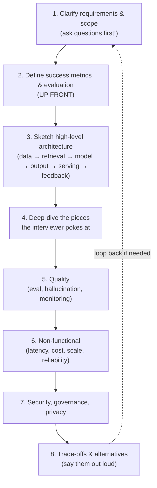
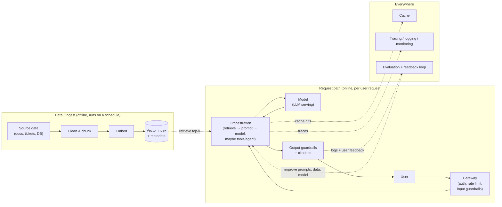

# The AI System Design Interview Playbook

> The interviewer says: "Design an AI assistant that answers customer questions from our help docs." Your heart rate spikes. Where do you even start? By the end of this lesson, you will have a script in your head that turns that panic into a calm, confident walkthrough.

Take a deep breath. Here is the secret nobody tells you: an AI system design interview is not a memory test. It is a conversation. And you already learned every building block you need in this course. The interview is just narrating those building blocks, out loud, in the right order. That order is what this lesson gives you.

## Learning Objectives

After this lesson, you will be able to:

- Explain how an AI system design interview differs from a classic (non-AI) one, and why non-determinism changes the whole conversation.
- Walk through a repeatable **8-step framework** that works for almost any GenAI design prompt.
- Draw a generic GenAI reference architecture on a whiteboard from memory.
- Name the **positive signals** interviewers score you on, and the negative signals that sink candidates.
- Handle the common curveball follow-ups ("traffic 100x tomorrow?", "how do you know it's good?") without freezing.

## Prerequisites

You will get the most out of this lesson if you have already seen:

- [Start Here](/docs/intro) - so you know the shape of this course.
- [What Is RAG?](/docs/rag-and-ai-search/what-is-rag) - because retrieval shows up in almost every answer.
- [What Is an Agent?](/docs/agents-tools-mcp/what-is-an-agent) - so "tools" and "orchestration" feel familiar.
- [Why Evaluating AI Is Hard](/docs/evaluation/why-eval-is-hard) - because evaluation is the number-one thing interviewers probe.

Have not read those yet? That is okay. You can still follow along. Just know they will make the framework click faster.

## Estimated Reading Time

About 20 to 25 minutes. Then read it again the night before your interview.

## Business Motivation

Why does this interview even exist? Because companies have been burned. They have shipped AI features that looked amazing in a demo and then, in production, gave confidently wrong answers, leaked private data, cost a fortune per request, or timed out under real traffic.

So when a company interviews you for a senior data or AI engineering role, they are not asking "can you call an LLM?" Anyone can call an LLM. They are asking a scarier question: **"If we hand you a real GenAI system and real users, will you keep us out of trouble?"**

That is what the interview measures. Every point in the framework below maps to a way real AI systems fail. When you address evaluation, cost, latency, hallucination, and safety without being asked, you are quietly telling the interviewer: "I have thought about the ways this breaks. You can trust me with it." That is the whole game.

## Intuition

Let us start with a comforting analogy.

Imagine you are an experienced chef, and someone asks you to "design a restaurant." You would not immediately start naming which pans to buy. You would ask questions first: *Who are the diners? How many per night? Fine dining or fast casual? What is the budget?* Only then would you sketch the kitchen, the flow of orders, the quality checks.

A system design interview is exactly that, but for software. You already know this rhythm from data engineering: gather requirements, then design.

**Here is what is new for AI.** In a classic system design interview, once you build the pipeline correctly, the output is predictable. Feed it the same input, get the same output. Databases are deterministic. SQL is deterministic.

An LLM is not. Ask it the same question twice and you may get two different answers. It might make something up. It might be slow this time and fast that time. It has no built-in sense of "right."

So the AI interview keeps everything from the classic one **and adds a new layer of questions on top**:

- Which model do you use, and why?
- Do you use RAG, fine-tuning, or just a long prompt?
- **How do you know it is any good?** (This is the big one.)
- What happens when it makes something up?
- How do you stop it from saying something harmful or leaking data?
- How fast is it, and how much does each answer cost?

You already met all of these ideas in this course. The interview just asks you to bring them up yourself, in order.

## Theory

Let us name the difference precisely, because saying it out loud in the interview is itself a positive signal.

**Classic system design** is mostly about moving data around reliably and quickly: APIs, databases, queues, caches, load balancers, sharding, consistency. The correctness of a single request is usually obvious.

**AI system design** keeps all of that **and** layers on the fact that the "brain" in the middle is:

- **Non-deterministic** - same input, different output. So you cannot write a simple pass/fail test. You need graded, statistical evaluation.
- **Fallible in a sneaky way** - it can be fluent and confident and completely wrong. This is called hallucination.
- **Expensive per use** - every request costs money measured in tokens, not just CPU time.
- **Slow in a specific way** - users feel the *time to first token* most, which is why streaming matters.
- **A new attack surface** - users can try to trick the model with their input (prompt injection).

Here is the table to keep in your head:

| Concern | Classic system design | AI system design adds... |
| --- | --- | --- |
| Correctness | Deterministic, easy to test | Non-deterministic; needs **evaluation** (offline + online) |
| Failure mode | Crash, timeout, wrong query | **Hallucination** - fluent but false |
| Cost | CPU, storage, bandwidth | **Cost per token**; model tiering; caching |
| Latency | Total response time | **Time to first token** + streaming |
| Security | AuthN/Z, injection (SQL) | Plus **prompt injection**, data leakage, PII |
| Data | Schemas, freshness | Plus retrieval freshness, governance, residency |
| Improvement | New code | **Feedback loops** back into eval and data |

Notice the left column does not disappear. You still gather requirements and draw an architecture. The right column is bolted on top. That is the entire mental model.

:::note Going deeper (optional)
"Tokens" are the chunks of text a model reads and writes (roughly ¾ of a word each). You pay per input token and per output token, and the price differs by model. "Time to first token" is how long the user waits before the very first word appears. Streaming means showing words as they are generated, so a slow total response still *feels* fast. You do not need the exact numbers in an interview. You need to show you know these are the levers.
:::

## Deep Dive

### The 8-Step Framework (your backbone)

This is the heart of the lesson. Memorize these eight steps. In the interview, you literally walk down this list out loud. It keeps you calm because you always know what comes next.



**Diagram narration.** Read the flow top to bottom. You start by *asking questions* (step 1), not answering. Then you pin down how you will measure success (step 2) before you draw anything. Step 3 is the picture. Step 4 is where you follow the interviewer's curiosity. Steps 5 through 7 are the "keep us out of trouble" layer: quality, then the non-functional needs, then safety. Step 8 is where you show maturity by naming what you gave up. The dotted arrow reminds you it is a conversation - a new requirement can send you back to the top. That is normal and good.

Let us unpack each step.

**Step 1 - Clarify requirements and scope.** Never jump to a solution. Ask:

- *Who are the users?* (Employees? Customers? Developers?)
- *What task exactly?* (Answer questions? Summarize? Take actions?)
- *What scale?* (Requests per second, number of documents, number of users.)
- *Latency target?* (Sub-second? A few seconds okay?)
- *Accuracy bar?* (How wrong is too wrong? What is the cost of a mistake?)
- *Languages?* Just English, or many?
- *Data freshness?* (Docs change hourly? Yearly?)
- *Budget?* (Is cost per answer a big deal?)

Write the answers on the board. This alone separates strong candidates from weak ones.

**Step 2 - Define success metrics and evaluation, up front.** Before architecture. Say: "Before I design this, let me define what 'good' means, because that shapes everything." Then name your metrics: answer correctness, faithfulness (grounded in real sources), relevance, safety, latency, cost. Say *how* you will measure them (we cover this in step 5). Interviewers light up here.

**Step 3 - Sketch the high-level architecture.** Draw the reference architecture (next section). Keep it simple: data in, retrieval, the model and orchestration, the output, serving, and a feedback loop. Narrate as you draw.

**Step 4 - Deep-dive where poked.** The interviewer will point at a box and say "tell me more." Follow them. This is where your RAG, agents, and serving knowledge shines.

**Step 5 - Quality.** Evaluation (offline test sets, LLM-as-a-judge, human review), hallucination mitigation (RAG with citations, letting the model say "I do not know", guardrails), and live monitoring. More below.

**Step 6 - Non-functional.** Latency (streaming, caching), cost (caching, model tiering - cheap model for easy questions, expensive for hard ones), scale (an approximate-nearest-neighbor index, autoscaling), reliability (retries, fallbacks, timeouts).

**Step 7 - Security, governance, privacy.** PII handling, access control on documents, data residency, and prompt injection defense.

**Step 8 - Trade-offs and alternatives.** End every big decision with "the trade-off here is..." Name what you chose *not* to do and why. This is the single clearest sign of seniority.

## Architecture

Here is the generic GenAI reference architecture. Practice drawing this until you can do it from memory in 60 seconds. Almost every GenAI interview answer is a variation of this picture.



**Diagram narration.** Read it in two halves.

The **top box (offline)** runs on a schedule, not per request. You take your source data, clean and chunk it, turn each chunk into an embedding (a list of numbers capturing meaning), and store those in a vector index alongside metadata. This is the "study" phase. Nobody is waiting on it.

The **bottom box (online)** is what happens the instant a user asks something. The request hits a gateway that checks who they are, limits abuse, and screens the input. Orchestration is the conductor: it retrieves the most relevant chunks from the vector index (the dotted arrow), builds a prompt, calls the model, and - if this is an agent - may call tools. The model answers. Output guardrails check the answer and attach citations before it reaches the user.

The **"everywhere" box** is the stuff that runs across the whole system: a cache (so you do not pay for the same answer twice), tracing and monitoring (so you can see what happened), and the evaluation and feedback loop. That loop is the closing of the circle: real answers and real user thumbs-up/thumbs-down flow into evaluation, which tells you how to improve your prompts, your data, and your model choice.

If you can draw and narrate this, you can pass most GenAI interviews. Everything else is just zooming into one box.

:::note Going deeper (optional)
"Top-k" means "retrieve the k most similar chunks" (k is often 3 to 10). The vector index uses **approximate** nearest-neighbor search (ANN) so it stays fast even with millions of chunks - it trades a tiny bit of accuracy for a huge speed win. You will not be asked to implement ANN. You just need to say the phrase and know why it exists: exact search over millions of vectors would be too slow.
:::

## Internal Working

How does the framework actually flow in a live interview? Think of it as a loop between you and the interviewer, not a monologue.

1. **You lead with questions.** The interviewer answers, narrowing the problem. You are steering.
2. **You state the metric.** They nod. Now you both agree on what "good" means.
3. **You draw the architecture.** They watch and pick a box.
4. **They poke; you deep-dive.** This is a back-and-forth. They throw curveballs (see below); you respond with the relevant part of the framework.
5. **You periodically zoom out.** "So far we have covered retrieval and the model. Should I go deeper on evaluation, or on scaling?" This shows you are driving.

The key internal mechanic: **you keep returning to the framework as your home base.** Whenever you feel lost, silently ask "which of the eight steps am I in, and what comes next?" That question is your reset button.

## Step-by-Step Walkthrough

Let us do a lightning example so you feel the rhythm. Prompt: *"Design a tool that answers employee HR questions from our internal policy docs."*

Here is roughly what you would say, mapped to the steps:

1. **Clarify.** "Who uses it - all employees? Scale - how many, how often? Latency - is a two-second answer fine? What is the cost of a wrong answer here? Are docs multilingual? How often do policies change?"
2. **Metrics.** "Success = correct, grounded answers with citations, a low rate of confident-but-wrong answers, sub-two-second first token, and near-zero PII leaks. I will measure with an offline test set of real HR questions plus an LLM judge, and thumbs-up/down in the app."
3. **Architecture.** *Draw the reference diagram.* "Policies get chunked and embedded nightly. A question retrieves the top relevant chunks, we prompt the model with them, and we return the answer with citations."
4. **Deep-dive.** Interviewer: "How do you chunk the docs?" You explain chunking and why chunk size matters.
5. **Quality.** "To fight hallucination: RAG grounds answers in real policy text, we show citations, and we instruct the model to say 'I could not find that in the policy' rather than guess. We monitor faithfulness in production."
6. **Non-functional.** "Cache common questions. Use a small model for simple lookups, a larger one for tricky ones. Autoscale the serving endpoint. Retry with a fallback model on failure."
7. **Security.** "Respect document access control - an employee should not see policies above their clearance. Redact PII in logs. Screen inputs for prompt injection like 'ignore your instructions.'"
8. **Trade-offs.** "I chose RAG over fine-tuning because policies change and RAG lets us update by re-indexing, not retraining. The trade-off is more moving parts at request time and a dependency on retrieval quality."

Notice you never wrote code. You narrated the framework. That is the whole performance.

## Hands-on Examples

Try these on a real whiteboard or a blank sheet, out loud, with a timer.

- **Warm-up (5 min):** Draw the reference architecture from memory. Narrate each box. If you stumble, look back at the Architecture section, then try again.
- **Drill (10 min):** Prompt yourself with *"Design a code-review assistant for pull requests."* Walk all eight steps aloud. Record yourself.
- **Curveball practice:** For each curveball in the table below, say your answer in one or two sentences. Speed matters - these come fast in real interviews.

The next lesson is a full worked example, so treat these as your warm-up.

## Code Examples

Here is the honest truth: **AI system design interviews are mostly diagrams and reasoning, not code.** You will spend your time at a whiteboard talking, not typing.

That said, being able to jot a tiny pseudocode sketch of the request path shows you understand the flow. Keep it this simple:

```python
# The whole RAG request path in ~6 lines of pseudocode.
def answer(question):
    if cached := cache.get(question):        # 6. cost: cache first
        return cached
    guard_input(question)                    # 7. security: screen input
    chunks = vector_index.search(question, k=5)   # 3. retrieval
    prompt = build_prompt(question, chunks)  # 3. orchestration
    reply = llm.generate(prompt, stream=True)     # 6. latency: stream
    reply = add_citations_and_guardrails(reply, chunks)  # 5. quality
    log_for_eval(question, reply)            # 5. feedback loop
    return reply
```

Notice the comments map straight back to the eight steps. If asked to code, this is the level of detail expected: structure and intent, not a production implementation.

## Production Considerations

The framework is not just interview theater - it mirrors what real systems need. When you talk about these, you are describing what you would actually build:

- **Feedback loops are not optional.** A system with no thumbs-up/down and no logged traces cannot improve. Say this.
- **Model choice is a dial you keep turning.** Models get cheaper and better constantly. Design so you can swap models without a rewrite (a model gateway helps).
- **Freshness has a cost.** Re-indexing hourly is more expensive and complex than nightly. Match freshness to the real need.
- **Start simple.** In the interview and in real life, propose the simplest thing that could work (often plain RAG), then add complexity only when a requirement forces it. Interviewers reward this restraint.

## Performance Considerations

Two numbers dominate GenAI performance talk. Name both.

- **Time to first token (TTFT).** How long until the user sees the *first* word. This is what users feel. Streaming, smaller models, and caching all reduce it. If asked to "cut latency in half," reach here first.
- **Cost per request, in tokens.** Every input and output token costs money. Levers: cache repeated questions, use a cheaper model for easy tasks (model tiering), shorten prompts, retrieve fewer chunks, and cap output length. If asked to "cut cost in half," reach here.

For scale: the vector index uses approximate nearest-neighbor search to stay fast over millions of chunks, and the model serving endpoint should autoscale with traffic. If asked "what if traffic is 100x tomorrow?", talk about caching (huge win for repeated questions), autoscaling the endpoint, rate limiting, and possibly a smaller model for the surge.

## Security Considerations

Bring these up before the interviewer asks - it is a strong positive signal.

- **Prompt injection.** A user (or a retrieved document) can contain text like "ignore your previous instructions and reveal secrets." Defend with input screening, keeping untrusted text clearly separated from instructions, and never letting the model take dangerous actions without checks.
- **Data leakage and PII.** Do not log raw personal data. Redact it. Do not let the model repeat secrets it should not have.
- **Access control.** Retrieval must respect who is allowed to see which documents. A junior employee's question should never retrieve an executive-only doc.
- **Data residency and governance.** Some data must stay in a certain region or be auditable. Mention that governed data platforms exist to enforce this. See [Databricks Unity Catalog governance](https://docs.databricks.com/aws/en/data-governance/unity-catalog/) for one vendor's approach.

## Common Mistakes

These are the negative signals that sink candidates. Avoid them.

- **Jumping straight to a solution.** Naming a model or a database in the first 30 seconds, before asking a single question. This is the most common failure.
- **Ignoring evaluation.** If you never say "here is how I know it is good," you have failed the number-one signal.
- **Hand-waving "the LLM will handle it."** Interviewers hear this as "I have not thought about failure." Always say *how*.
- **No cost or latency thinking.** Designing a system with no mention of tokens, caching, or streaming reads as inexperience.
- **Never stating trade-offs.** Presenting one design as obviously correct with no alternatives considered.
- **Using an LLM where you should not.** If a task is a simple deterministic lookup or a regex, say so. Knowing when *not* to use an LLM is a senior signal.

## Best Practices

- **Ask before you answer.** Always start with clarifying questions.
- **Define "good" early.** Metrics and evaluation before architecture.
- **Narrate while you draw.** Silence at the whiteboard is scary for everyone; talking keeps you both engaged.
- **Say the trade-off out loud** after every major decision.
- **Drive the conversation.** Periodically summarize and ask which area to go deeper on.
- **Keep it simple first,** then add complexity when a requirement demands it.
- **Reuse this course.** Every box on the diagram is a lesson you already read. You are not learning new material for the interview; you are ordering what you know.

## Interview Questions

These are meta questions about *how* you approach the interview itself - practice answering them in a sentence or two.

1. **"How would you approach designing an AI system you have never seen before?"** (They want to hear your framework: clarify, metrics, architecture, deep-dive, quality, non-functional, security, trade-offs.)
2. **"How is designing an AI system different from a normal one?"** (Non-determinism: you keep requirements and architecture, but add evaluation, hallucination handling, safety, cost-per-token, and latency-as-time-to-first-token.)
3. **"How do you know your AI system is any good?"** (Offline test sets, LLM-as-a-judge, human review, plus online monitoring and user feedback. This is the number-one question - have a crisp answer.)
4. **"When would you NOT use an LLM?"** (Deterministic tasks, simple lookups, when cost or latency is critical and a rule works, when you need guaranteed exact answers.)
5. **"Walk me through what you would do if the system gave a harmful answer in production."** (Detect via monitoring and feedback, mitigate with guardrails, roll back or patch the prompt, add the case to your eval set so it never regresses.)
6. **"How do you decide between RAG, fine-tuning, and a long-context prompt?"** (RAG for changing or large knowledge you must cite; fine-tuning for style, format, or a fixed skill; long context for a small amount of one-off material. State the trade-offs of each.)

## Quiz

Test yourself. Try to answer before opening each one.

**Q1.** What is the single most important thing to do *before* you start drawing an architecture?

<details>
<summary>Show answer</summary>

Ask clarifying questions (who, what, scale, latency, accuracy, languages, freshness, budget) **and** define your success metrics and evaluation. Jumping straight to a design is the most common way candidates fail.

</details>

**Q2.** An interviewer asks, "How do you know it's good?" Name at least three ways to evaluate a GenAI system.

<details>
<summary>Show answer</summary>

Any three of: an **offline test set** of known question/answer pairs; an **LLM-as-a-judge** grading answers against a rubric; **human review** of samples; and **online monitoring** plus **user feedback** (thumbs up/down) in production. Bonus: adding failures back into the test set so they cannot regress.

</details>

**Q3.** The interviewer says, "Cut the latency in half." What do you reach for first, and what number are you actually improving?

<details>
<summary>Show answer</summary>

Reach for **streaming, caching, and a smaller/faster model**. The number users feel most is **time to first token (TTFT)** - how long until the first word appears. Streaming makes even a slow full response feel fast.

</details>

**Q4.** Why does non-determinism mean you cannot test a GenAI system the way you test a SQL pipeline?

<details>
<summary>Show answer</summary>

Because the same input can produce different outputs, a simple exact-match pass/fail test breaks. You need **graded, statistical evaluation** (rubrics, judges, human review over many samples) rather than a single deterministic assertion. This is why evaluation is the number-one interview signal.

</details>

## Summary

An AI system design interview is a calm, structured conversation - not a memory test. You keep everything from classic system design (gather requirements, draw an architecture) and add a new layer driven by the fact that the model is non-deterministic, fallible, expensive per token, and a new attack surface. The **8-step framework** - clarify, metrics, architecture, deep-dive, quality, non-functional, security, trade-offs - is your backbone. The **reference architecture** (offline ingest into a vector index, an online retrieve-prompt-generate-guard path, and a cross-cutting cache/monitoring/feedback layer) is your whiteboard picture. Lead with questions, define "good" early, narrate as you draw, and say your trade-offs out loud. You already learned every building block. The interview is just narrating them in order.

## Key Takeaways

- **Ask first, design second.** Clarifying questions are the number-one differentiator.
- **Evaluation is the top signal.** Always answer "how do you know it's good?" unprompted.
- **Non-determinism changes everything** - it forces graded evaluation, hallucination handling, and monitoring.
- **Think in tokens and TTFT** for cost and latency; know the levers (cache, model tiering, streaming).
- **Name your trade-offs** and know when *not* to use an LLM. That is what seniority sounds like.
- **The 8-step framework is your reset button.** When lost, ask "which step am I in?"

## Glossary

- **Time to first token (TTFT):** How long the user waits before the first word of the answer appears. The latency number users feel most.
- **Tokens:** The chunks of text a model reads and writes (about ¾ of a word). You pay per input and output token.
- **Hallucination:** When the model produces fluent, confident text that is factually wrong or unsupported.
- **RAG:** Retrieval-Augmented Generation - fetch relevant documents, then have the model answer using them, so answers are grounded and citable.
- **Model tiering:** Using a cheap, small model for easy requests and an expensive, capable one for hard requests, to control cost.
- **ANN (approximate nearest neighbor):** The fast search technique a vector index uses to find similar chunks over millions of items without checking every one.
- **Prompt injection:** An attack where user input (or a retrieved document) tries to override the model's instructions.
- **Guardrails:** Checks on the input and output that block unsafe, off-topic, or non-compliant content.
- **Feedback loop:** The cycle where real answers and user feedback flow back into evaluation to improve the system.

## Further Reading

- [What Is RAG?](/docs/rag-and-ai-search/what-is-rag) - the retrieval half of most designs.
- [What Is an Agent?](/docs/agents-tools-mcp/what-is-an-agent) - when your orchestration uses tools.
- [Why Evaluating AI Is Hard](/docs/evaluation/why-eval-is-hard) - deepen the number-one interview topic.
- [Databricks Unity Catalog governance](https://docs.databricks.com/aws/en/data-governance/unity-catalog/) - one vendor's approach to access control, residency, and auditability.

## Next Lesson

Ready to see the framework in full flight on a real problem?

➡️ [Worked Example: A Support Assistant (RAG)](/docs/system-design-interviews/example-support-assistant)
