# Question Bank: RAG & Chatbots

Welcome to your practice bank. RAG and chatbot prompts are the single most common category in AI system design interviews, so getting comfortable here pays off fast. Each question below has a "Show approach" block with a structured model answer. Read the question, sketch your own answer first, then expand the block to compare. You already know more than you think.

If you have not yet, skim the framework in [The AI System Design Interview Playbook](/docs/system-design-interviews/the-playbook), and study the two worked examples: the [RAG support assistant](/docs/system-design-interviews/example-support-assistant) and the [tool-using agent](/docs/system-design-interviews/example-agent-system). They make these answers click.

:::tip Use the 8-step framework
Every answer below follows the same spine, and you should too: (1) clarify → (2) success metrics & eval → (3) architecture → (4) deep-dive → (5) quality / hallucination / guardrails → (6) non-functional (latency / cost / scale) → (7) security & privacy → (8) trade-offs. When you feel lost mid-interview, name the next step out loud and keep moving.
:::

## A. RAG & Knowledge Assistants

**1. Design a RAG system to answer questions over a company's internal wiki and documentation.**

Show approach

**Clarify:** How large and how fresh is the corpus (thousands vs millions of pages, minutes vs days stale)? What is acceptable answer latency? Are there per-space access controls?

**Approach:**

- Ingest wiki pages via connectors/webhooks; normalize to text, strip boilerplate.
- Chunk (roughly 300 to 800 tokens, semantic boundaries), embed, upsert into a vector store with metadata (space, author, updated_at).
- At query time: retrieve top-k, optionally rerank, assemble a grounded prompt, generate with inline citations.

**Key decisions:**

- Incremental re-indexing on document change events to keep freshness high.
- Store metadata for filtering (recency, source, permissions).
- Return citations so users can verify.

**Databricks build:**

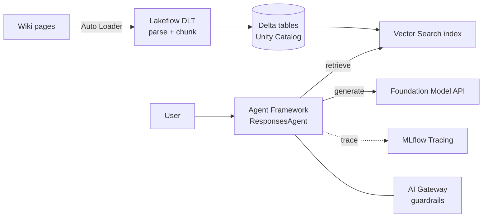

Event-driven DLT ingestion keeps the Vector Search index fresh while the agent retrieves, generates, and stays governed by Unity Catalog and the AI Gateway.

**Evaluation:** Offline retrieval metrics (recall@k, MRR) plus an LLM-judge or human panel for answer faithfulness and helpfulness; track deflection and thumbs-up rate online.

**Trade-offs / pitfalls:** Stale index is the top failure mode; over-large chunks dilute retrieval relevance.

**Likely follow-up:** "How do you handle a page that was just edited?" Fire a re-embed job on the edit webhook so the next query sees fresh content within minutes.

**2. Design a "chat with your docs" document Q&A assistant.**

Show approach

**Clarify:** What document formats (PDF, DOCX, HTML)? Single doc per session or a whole library? Do users need exact page or paragraph citations?

**Approach:**

- Parse and layout-aware extract (tables, headings) → clean text.
- Chunk with overlap, embed, store vectors plus source offsets.
- Retrieve top-k for the question, generate an answer that quotes and cites the chunk locations.

**Key decisions:**

- Chunk size and overlap tuned to document structure; keep parent-child links so you can expand context.
- Embedding model choice (domain fit vs cost); dimension affects storage.
- Vector store selection (managed like Databricks Vector Search, or self-hosted) based on scale and ops appetite.

**Databricks build:**

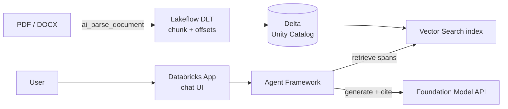

Layout-aware parsing via ai_parse_document preserves span offsets in Delta so the agent can return exact, verifiable citations back through the Databricks App.

**Evaluation:** Citation accuracy (does the cited span support the claim?), answer correctness on a labeled Q&A set, and latency percentiles.

**Trade-offs / pitfalls:** Bad PDF parsing quietly destroys quality; tiny chunks lose context, huge chunks bury the answer.

**Likely follow-up:** "Why cite spans, not whole documents?" Span-level citations let users verify quickly and expose retrieval errors early.

**3. Design a QA assistant over an internal knowledge base where accuracy is critical and it must say "I don't know".**

Show approach

**Clarify:** What is the cost of a confident wrong answer vs a refusal? Is there a support fallback (human handoff)? What confidence signal do we have?

**Approach:**

- Standard RAG retrieval, but gate generation on retrieval quality.
- If top-k scores fall below a threshold, or the reranker finds no strongly relevant chunk, abstain and route to a human.
- Prompt the model to answer only from context and to say it cannot find the answer otherwise.

**Key decisions:**

- Set an abstention threshold from retrieval scores plus an answerability check.
- Require citations; block answers that cite nothing.
- Optional second-pass verifier that checks the answer against retrieved evidence.

**Databricks build:**

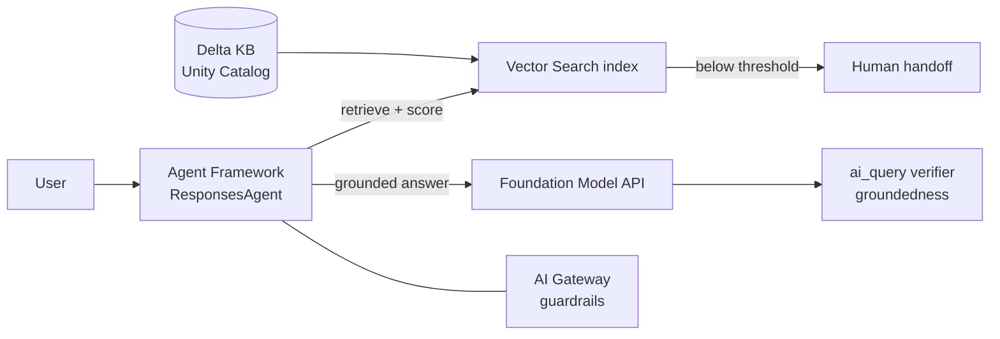

The agent gates on retrieval scores and a post-generation ai_query groundedness check, abstaining to human handoff when evidence is weak.

**Evaluation:** Track precision of answered questions, abstention rate, and hallucination rate; optimize for high precision even at some recall cost.

**Trade-offs / pitfalls:** Too-eager abstention frustrates users; too-loose thresholds leak hallucinations.

**Likely follow-up:** "How do you tune the threshold?" Sweep it on a labeled set to hit a target precision, then monitor drift in production.

**4. Design an internal Slack HR bot that answers HR and policy questions.**

Show approach

**Clarify:** Are answers scoped by employee role or region (different policies)? What PII may appear in questions? How fresh must policy updates be?

**Approach:**

- RAG over policy docs, filtered by the asking user's attributes (region, level) so retrieval only sees documents they may view.
- Enforce identity from the Slack OAuth context; never trust a user-supplied "I am a manager".
- Redact or avoid logging PII in prompts and traces.

**Key decisions:**

- Access control at the retrieval layer via metadata filters tied to the authenticated user.
- Freshness through event-driven re-indexing when policies change.
- Handoff to HR for sensitive or personal-case questions.

**Databricks build:**

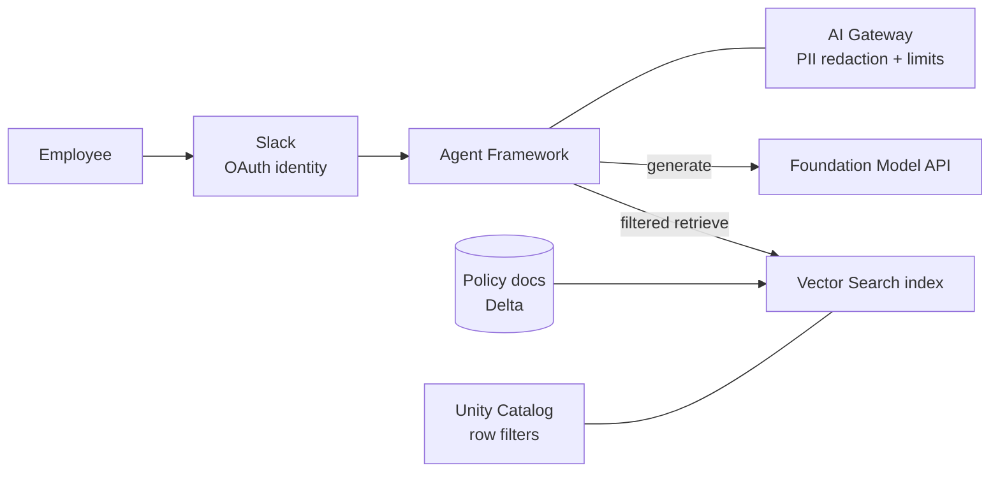

Unity Catalog row filters keyed to the authenticated Slack identity restrict retrieval, while the AI Gateway handles PII redaction and rate limits.

**Evaluation:** Correctness on policy Q&A, plus an access-control audit (can user A ever retrieve user B's restricted policy?).

**Trade-offs / pitfalls:** Leaking a restricted policy is a serious incident; PII in logs is a compliance risk.

**Likely follow-up:** "Where do you enforce permissions?" At retrieval, so restricted chunks never reach the model context in the first place.

**5. Design and optimize an end-to-end RAG system with hybrid retrieval (BM25 + dense) plus reranking under a latency budget.**

Show approach

**Clarify:** What is the end-to-end latency budget (for example under 2 s)? Query volume? Is recall or precision the bigger current pain?

**Approach:**

- Run BM25 (lexical) and dense (vector) retrieval in parallel, fuse with reciprocal rank fusion.
- Rerank the fused candidates with a cross-encoder, keep the top few, then generate.

**Key decisions:**

- Candidate counts: retrieve maybe 50 to 100, rerank down to 5 to 8 to control reranker cost.
- Run lexical and dense retrieval concurrently to hide latency.
- Cache embeddings and frequent-query results.

**Databricks build:**

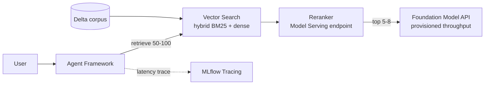

Vector Search runs hybrid retrieval, a served cross-encoder reranks down to a small set, and MLflow Tracing profiles each stage against the latency budget.

**Evaluation:** Recall@k before rerank, nDCG after rerank, and answer faithfulness; profile each stage's latency contribution.

**Trade-offs / pitfalls:** Reranking is the usual latency and cost hotspot; hybrid fusion adds complexity for gains that are corpus-dependent.

**Likely follow-up:** "How do you stay under budget if the reranker is slow?" Reduce rerank candidate count, use a smaller cross-encoder, or rerank only when lexical and dense disagree.

**6. Tune a RAG system for a specific task — QA versus summarization.**

Show approach

**Clarify:** Is the goal a precise factual answer or a broad synthesis across sources? How long should outputs be? How many documents feed one response?

**Approach:**

- For QA: optimize for retrieval relevance, small focused context, precise citation.
- For summarization: optimize for coverage and diversity, retrieve a broader, deduplicated set spanning subtopics, then synthesize.

**Key decisions:**

- QA favors high-precision retrieval and tight chunks; summarization favors diverse, complementary chunks (for example MMR to reduce redundancy).
- Different prompt templates: extract-and-cite vs synthesize-and-organize.
- Different context budgets: summarization needs more.

**Databricks build:**

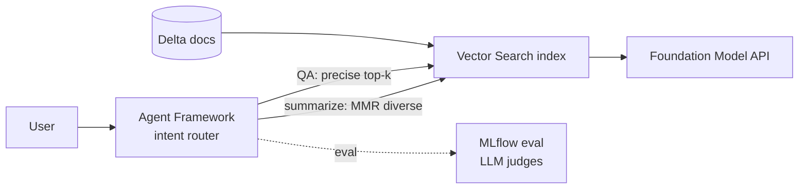

The agent routes by intent to task-specific retrieval configs over one Vector Search index, and MLflow judges score QA and summarization separately.

**Evaluation:** QA on exact-match and faithfulness; summarization on coverage, redundancy, and consistency with retrieved evidence (no facts absent from sources).

**Trade-offs / pitfalls:** Diverse retrieval can pull in loosely relevant chunks that hurt QA precision; the same retrieval config rarely serves both tasks well.

**Likely follow-up:** "One system for both?" Route by intent to task-specific retrieval and prompt configs rather than compromising on a single setting.

**7. Ground LLM answers strictly in proprietary documents with factuality guarantees.**

Show approach

**Clarify:** What does "guarantee" mean operationally (target faithfulness rate, or hard block on unsupported claims)? Is a refusal acceptable when evidence is missing?

**Approach:**

- RAG with a strict "answer only from provided context" prompt.
- Post-generation grounding check: verify each claim is entailed by a retrieved chunk (NLI-style or LLM-judge), and drop or flag unsupported sentences.
- Attach citations to every claim.

**Key decisions:**

- Enforce citation-per-claim, not just per-answer.
- Add a verification pass as a guardrail before returning.
- Abstain when no chunk supports the question.

**Databricks build:**

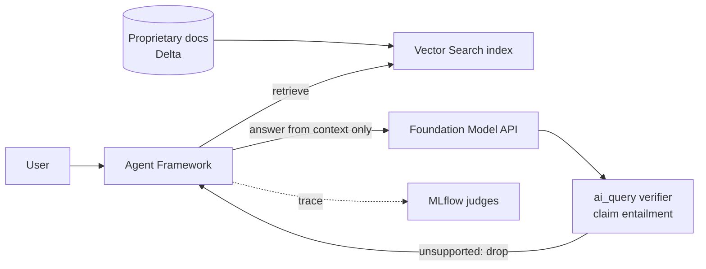

A per-claim ai_query entailment pass acts as a guardrail, dropping or flagging any sentence not supported by a retrieved chunk before the answer returns.

**Evaluation:** Faithfulness / groundedness rate measured by human or LLM-judge on a sample; count unsupported-claim escapes.

**Trade-offs / pitfalls:** True hard guarantees are impossible with generative models; the verifier adds latency and cost. Frame it as high-assurance, not absolute.

**Likely follow-up:** "What if the verifier is wrong?" Sample its decisions for human review and calibrate its threshold against a labeled grounding set.

## B. Chatbots & Conversational Assistants

**8. Design an AI chatbot / ChatGPT-style chat service.**

Show approach

**Clarify:** Expected concurrency and daily active users? Streaming responses required? How long is conversation history retained?

**Approach:**

- Client → API gateway → chat service → LLM inference (streamed).
- Conversation state stored per session; on each turn, assemble recent history (plus a running summary for long chats) into the prompt.
- Stream tokens back over SSE or WebSocket.

**Key decisions:**

- Context management: truncate or summarize old turns to fit the window.
- Stateless app tier with state in a fast store (for example Redis) for horizontal scaling.
- Model gateway/router for load balancing and fallback.

**Databricks build:**

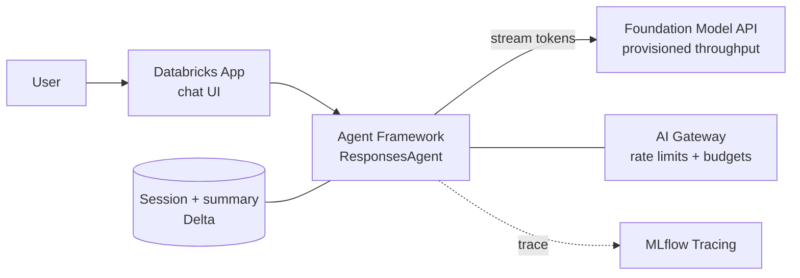

A stateless agent tier streams from a provisioned-throughput endpoint while session history and rolling summaries live in Delta so any worker can serve a turn.

**Evaluation:** Response quality (human/LLM-judge), time-to-first-token, and turn completion rate.

**Trade-offs / pitfalls:** Unbounded history blows the context window and cost; sticky sessions hurt scaling if state lives in-process.

**Likely follow-up:** "How do you keep long chats coherent?" Maintain a rolling summary of older turns and keep only the most recent turns verbatim.

**9. Design a real-time chatbot API.**

Show approach

**Clarify:** Do we need server-push token streaming and multi-turn within a live connection? Mobile clients with flaky networks? Target time-to-first-token?

**Approach:**

- WebSocket (or SSE) for streaming tokens as they generate; REST for stateless one-shot calls and management endpoints.
- Maintain per-connection session context keyed to a session id, backed by a shared store so reconnects resume.

**Key decisions:**

- WebSocket for bidirectional, low-latency streaming; SSE if you only push server → client and want simpler infra.
- Context stored externally so any worker can serve a reconnecting client.
- Backpressure and timeouts on slow generations.

**Databricks build:**

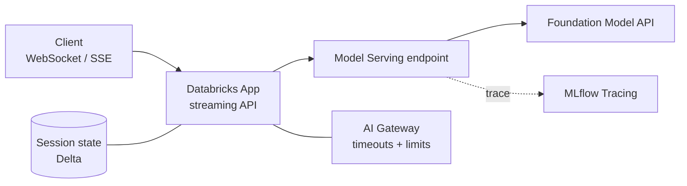

The Databricks App streams tokens over WebSocket or SSE from a Model Serving endpoint, with session state in Delta so reconnecting clients resume on any worker.

**Evaluation:** Time-to-first-token, inter-token latency, connection stability, and reconnect success rate.

**Trade-offs / pitfalls:** WebSockets are stateful and harder to load-balance and scale; SSE cannot stream client → server.

**Likely follow-up:** "SSE or WebSocket?" SSE is simpler and enough for token streaming; choose WebSocket only if you need rich bidirectional real-time interaction.

**10. Design ChatGPT-style cross-conversation long-term memory.**

Show approach

**Clarify:** What should be remembered (facts, preferences) vs forgotten? Is memory per-user and private? Must users see, edit, and delete it?

**Approach:**

- Extract salient memories from conversations (an LLM summarizer proposes candidate facts).
- Store them per user as embedded records; at each new session, retrieve relevant memories and inject them into context.
- Provide a memory dashboard for view/edit/delete.

**Key decisions:**

- Separate short-term (in-session history) from long-term (persisted memories).
- Retrieval-based injection so you only surface relevant memories, not all of them.
- Deletion must hard-remove memory records and their embeddings.

**Databricks build:**

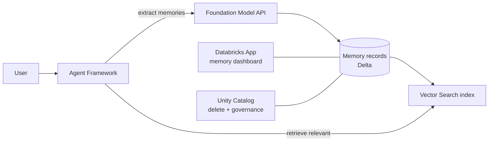

Salient facts are extracted into per-user Delta records and indexed for relevance-based recall, with a Databricks App dashboard and Unity Catalog enforcing view, edit, and hard-delete.

**Evaluation:** Memory precision/recall (is the right thing recalled?), user-reported usefulness, and a privacy audit of deletion.

**Trade-offs / pitfalls:** Storing too much is a privacy liability and pollutes context; stale memories mislead.

**Likely follow-up:** "How do you honor a deletion request?" Purge the record and its vector, and ensure it is excluded from all future retrieval and any derived summaries.

**11. Scale an AI chat feature to 1M daily users.**

Show approach

**Clarify:** Peak concurrency and messages per user per day? Latency and cost targets? Which model tier is required for quality?

**Approach:**

- Estimate load: 1M daily users at, say, 10 messages each is 10M calls/day; derive peak requests per second and size inference capacity with headroom.
- Horizontally scale stateless app tier; autoscale inference behind a model gateway; cache and batch where possible.

**Key decisions:**

- Semantic caching of common queries to cut LLM calls.
- Model routing: cheap/small model for easy turns, larger model only when needed.
- Prompt/context trimming to control per-call token cost.

**Databricks build:**

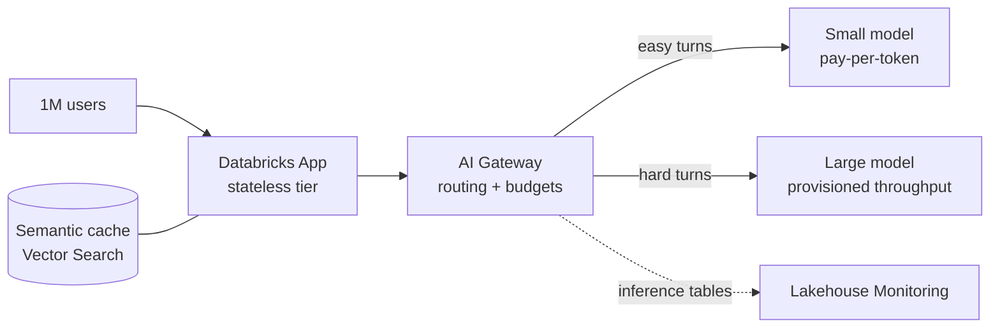

The AI Gateway routes easy turns to a cheap model and hard turns to a provisioned endpoint, a semantic cache cuts calls, and inference tables feed Lakehouse Monitoring for cost and load.

**Evaluation:** Cost per conversation, latency percentiles under peak load, GPU utilization, and cache hit rate.

**Trade-offs / pitfalls:** Inference GPU cost dominates the bill; aggressive caching risks stale or slightly-off answers.

**Likely follow-up:** "Biggest cost lever?" Token volume: shrink context, cache, and route easy turns to a smaller model.

**12. Fine-tune versus prompt-engineered RAG for a domain-specific chatbot — how do you decide?**

Show approach

**Clarify:** Is the need fresh factual knowledge or a consistent style/format/behavior? How much labeled data exists? How often does the knowledge change?

**Approach:**

- Default to RAG when the challenge is knowledge that changes or must be cited; retrieval keeps answers current and grounded.
- Consider fine-tuning when you need a specific tone, structured output, or task behavior that prompting cannot reliably achieve, and you have quality training data.
- They combine: fine-tune for behavior, RAG for knowledge.

**Key decisions:**

- Changing facts → RAG; stable style/skill → fine-tune.
- Weigh fine-tuning's data-collection and retraining cost vs RAG's retrieval infra.

**Databricks build:**

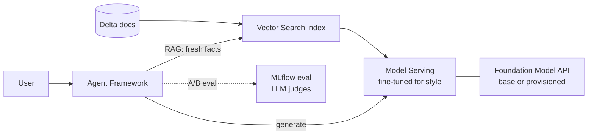

The hybrid pattern combines Vector Search for changing facts with a fine-tuned served model for behavior, and MLflow eval A/B tests RAG, fine-tune, and hybrid on the same metrics.

**Evaluation:** A/B the two (and the hybrid) on task success, faithfulness, and cost; let metrics decide.

**Trade-offs / pitfalls:** Fine-tuning bakes in knowledge that goes stale and needs retraining; prompt-only RAG may not fix deep behavior issues.

**Likely follow-up:** "Fine-tune for up-to-date facts?" Avoid it; retraining to update facts is slow and expensive versus re-indexing for RAG.

**13. Design a retrieval-augmented chatbot for enterprise search (RAG plus conversational state).**

Show approach

**Clarify:** Multiple data sources with different permissions? Follow-up questions that depend on prior turns? Latency target?

**Approach:**

- Rewrite the follow-up query using conversation history so retrieval is self-contained ("what about its price?" → "what is the price of product X?").
- Retrieve across permitted sources with per-user access filters, then generate a grounded, cited answer.
- Persist conversational state for context on the next turn.

**Key decisions:**

- Query rewriting/condensation for multi-turn coherence.
- Access control enforced at retrieval per authenticated user.
- Federated retrieval across sources with unified ranking.

**Databricks build:**

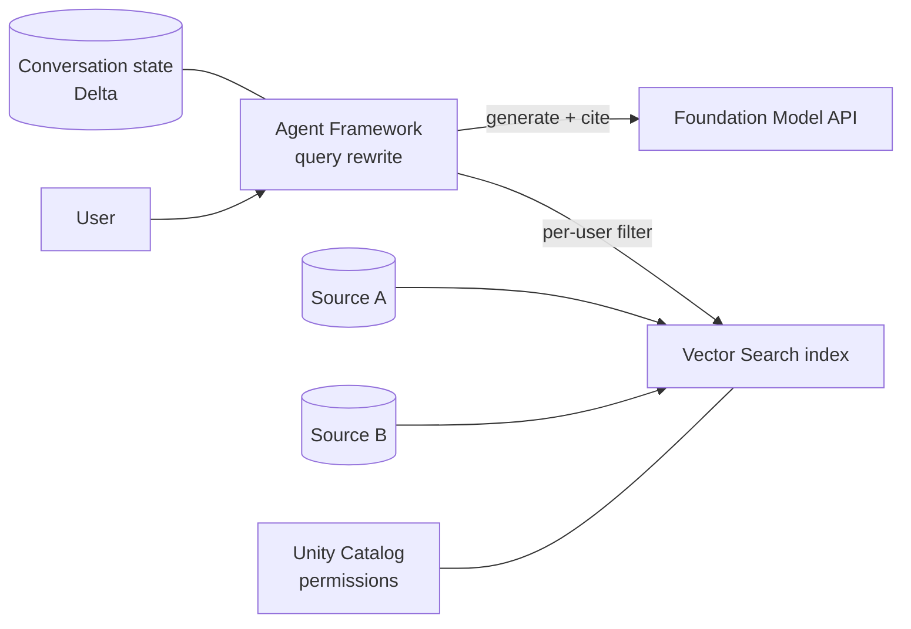

The agent condenses follow-ups using Delta-persisted state, retrieves across federated sources under Unity Catalog per-user permissions, then generates a cited answer.

**Evaluation:** Multi-turn task success, retrieval relevance on rewritten queries, and an access-control audit.

**Trade-offs / pitfalls:** Skipping query rewriting breaks follow-ups; merging sources with different trust/permissions is easy to get wrong.

**Likely follow-up:** "Why rewrite the query?" A bare follow-up lacks the entities needed for retrieval; rewriting restores them from history.

**14. Design a "prompt playground" for testing prompts across multiple models.**

Show approach

**Clarify:** Which providers/models must be supported? Are we comparing side-by-side, saving prompt versions, and tracking cost/latency per run?

**Approach:**

- Frontend: prompt editor, model/params selectors, side-by-side output panes.
- Backend: a provider-agnostic gateway that normalizes calls to each model; run requests in parallel and stream results.
- Persist prompts, versions, and run results (outputs, latency, tokens, cost).

**Key decisions:**

- Adapter layer per provider so the frontend stays model-agnostic.
- State: save prompt versions and runs for comparison and sharing.
- Rate limiting and API-key management per provider.

**Databricks build:**

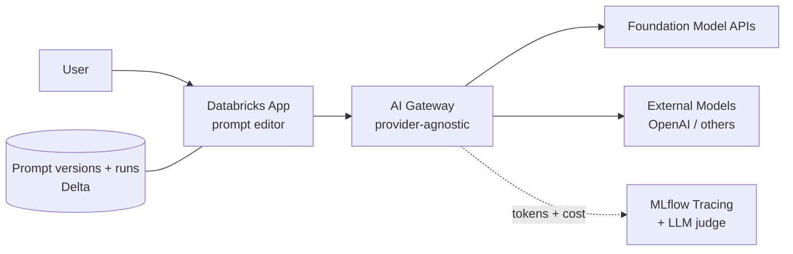

The AI Gateway fronts both Foundation Model APIs and External Models as one interface, while Delta stores prompt versions and runs and MLflow captures per-run tokens, cost, and judge scores.

**Evaluation:** For the tool: usability and correct cost/latency reporting. For prompts under test: let users score outputs, optionally with an LLM-judge for batch comparison.

**Trade-offs / pitfalls:** Provider APIs diverge (params, streaming formats); normalizing them is the real work. Keys must be stored securely.

**Likely follow-up:** "Front/back split?" Frontend owns editing and display; backend owns the provider adapters, secrets, and run persistence.

That is the full RAG and chatbot bank. Practice answering out loud, keep the 8-step framework as your backbone, and remember that a calm, structured "here's how I'd approach it" beats a perfect answer every time. You've got this.

Next Lesson: ➡️ [Question Bank: Agents & Search/Ranking](/docs/system-design-interviews/question-bank-agents-search)
