# Question Bank: Generation, Multimodal & Safety

This page is a rehearsal deck. Each question below is a prompt an interviewer might actually open with. Read the bold line, cover the answer, and try to talk through your own design first. Then open **Show approach** and compare notes. You are not memorizing scripts here; you are building the muscle memory that lets you stay calm and structured when the real question lands.

:::tip
Every answer below follows the same 8-step framework from [The AI System Design Interview Playbook](/docs/system-design-interviews/the-playbook). Clarify, then talk data, model, retrieval or context, orchestration, evaluation, safety, and operations. If you lose your place mid-answer, just say the next step out loud. The structure is your safety net.
:::

## E. Summarization, Extraction & Classification

**1. Design a generative summarization system for internal documents, where factuality matters and fabricated details are unacceptable.**

Show approach

**Clarify:** What documents (length, format, sensitivity)? Who reads the summaries, and what decisions ride on them? Is a wrong-but-fluent summary worse than a partial one? What latency is acceptable?

**Approach:** Ingest and chunk documents, then use map-reduce or refine summarization for long inputs. Prompt the model to summarize only from provided text and to cite source spans. Keep the source alongside every summary so claims are traceable.

**Databricks build:**

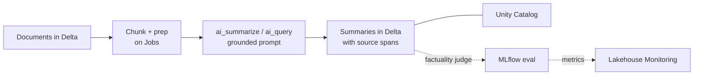

Batch AI Functions summarize chunked documents while keeping every claim traceable to its source span, and MLflow entailment judges track hallucination rate as a governed metric.

**Key decisions:** Extractive-plus-abstractive hybrid over pure generation; grounding every sentence to a source chunk; a "say you do not know" instruction rather than guessing.

**Evaluation:** Factual consistency scoring (entailment or an LLM judge comparing summary claims against source), plus human spot-checks. Track hallucination rate as a first-class metric, not just ROUGE.

**Trade-offs / pitfalls:** Aggressive compression drops nuance; map-reduce can lose cross-section context. The classic failure is a confident summary asserting something the document never said.

**Likely follow-up:** "How do you prove a summary is faithful?" Answer with grounding plus automated entailment checks and sampled human review.

**2. Design a real-time summarization system for meeting transcripts, handling streaming input and speaker context.**

Show approach

**Clarify:** Live rolling summary during the meeting, or a final one at the end? Do we have speaker labels? How many participants? What latency does "real-time" mean here?

**Approach:** Stream transcript segments in, maintain a running buffer, and produce incremental summaries on a sliding window. Preserve speaker attribution so action items map to people. At the end, run a consolidation pass over the full transcript for a clean final summary plus decisions and action items.

**Databricks build:**

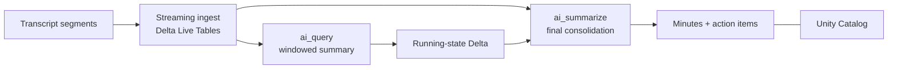

Structured Streaming into Delta feeds windowed ai_query calls for the rolling summary, with a final ai_summarize consolidation pass producing governed minutes and action items.

**Key decisions:** Incremental windowed summarization versus reprocessing the whole transcript each tick; carrying a compact running-state summary forward to hold earlier context; separating "notes so far" from "final minutes."

**Evaluation:** Coverage of key decisions and action items, speaker-attribution accuracy, and latency per update. Human review against ground-truth minutes.

**Trade-offs / pitfalls:** Speech-to-text errors propagate into the summary; overlapping speech and cross-talk confuse attribution; windowing can drop a decision made early. State the ASR dependency explicitly.

**Likely follow-up:** "How do you keep the running summary from drifting over a long meeting?" Periodically re-ground against the raw transcript.

**3. Design a document classifier that routes incoming documents, such as resumes, to the right teams.**

Show approach

**Clarify:** How many categories, and are they stable or evolving? Volume and latency? Is misrouting costly, and can a human review low-confidence cases? Multilingual?

**Approach:** Extract text (OCR if scanned), then classify. Start with embeddings plus a lightweight classifier for known, stable categories; use an LLM with a clear label taxonomy for nuanced or few-shot cases. Route by predicted label, and send low-confidence documents to a human queue.

**Databricks build:**

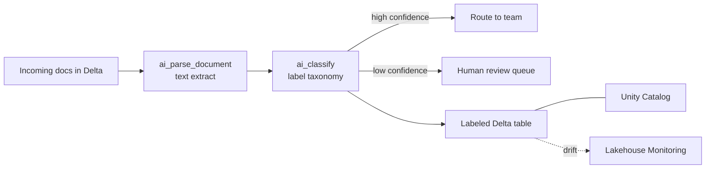

Jobs run ai_parse_document then ai_classify against a governed label taxonomy, routing confident predictions and queuing the rest for human review while Lakehouse Monitoring watches for drift.

**Key decisions:** Embeddings-plus-classifier versus LLM zero-shot (cost and stability versus flexibility); a confidence threshold that triggers human review; an "other/unknown" bucket so the system never forces a bad label.

**Evaluation:** Precision and recall per class, confusion matrix to spot systematic misroutes, and routing accuracy end to end. Monitor drift as document mix changes.

**Trade-offs / pitfalls:** Imbalanced classes hurt rare categories; new document types silently misroute; PII in resumes needs careful handling.

**Likely follow-up:** "A new team and category appears next month, how do you add it?" Prefer approaches that add labels without full retraining.

**4. Design a system to process about 10K user uploads per month, such as payslips and IDs. Extract fields, detect inconsistencies, reject invalid files, and survive provider downtime.**

Show approach

**Clarify:** Which document types and fields? What counts as "invalid" versus "inconsistent"? Sync or async for the user? Regulatory constraints on storing IDs?

**Approach:** Validate file type and quality on upload (reject corrupt, blurry, or wrong-format files early). Run OCR or a document-understanding model to extract structured fields, then apply validation rules and cross-field consistency checks (for example, name on ID versus name on payslip). Queue work asynchronously so spikes and slow providers do not block users.

**Databricks build:**

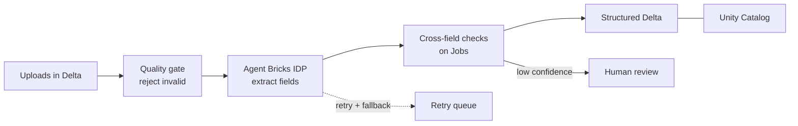

Agent Bricks Intelligent Document Processing extracts fields inside async Jobs with a quality gate up front, cross-field consistency checks after, and a retry queue plus fallback so provider downtime never loses an upload.

**Key decisions:** A managed extraction provider versus self-hosted models; a queue with retries and a dead-letter path; confidence thresholds sending questionable extractions to human review.

**Evaluation:** Field-level extraction accuracy, false-reject rate on valid files, and inconsistency-detection precision and recall.

**Trade-offs / pitfalls:** 10K per month is modest volume, so favor reliability over raw throughput. Provider downtime is the real risk. Use retries with backoff, a fallback provider, and graceful queuing so nothing is lost.

**Likely follow-up:** "Your OCR provider is down for an hour, what happens?" Requests queue and retry; users see pending, not errors.

**5. Design a system that turns patient notes into structured billing information sent to insurers, where extraction accuracy is critical.**

Show approach

**Clarify:** Which codes and fields (procedures, diagnoses, amounts)? What is the cost of an error (denied claim, compliance exposure)? Is a human coder in the loop? PHI handling rules?

**Approach:** Extract clinical entities from free-text notes, map them to the required coding scheme, and emit a validated structured record. Ground every extracted code to the note span that justifies it. Route anything below a confidence threshold to a certified human coder for review before submission.

**Databricks build:**

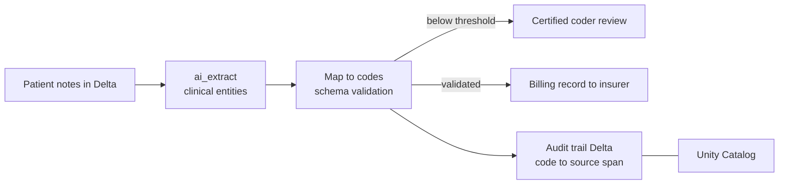

ai_extract pulls clinical entities grounded to note spans, strict schema validation gates submission, and low-confidence records go to a human coder with a full Unity Catalog audit trail linking each code to source text.

**Key decisions:** Human-in-the-loop by default given the stakes; strict schema validation before anything reaches an insurer; full audit trail linking each code back to source text.

**Evaluation:** Code-level precision and recall against coder-labeled ground truth, claim acceptance rate, and rate of downstream denials attributable to extraction.

**Trade-offs / pitfalls:** Hallucinated or upcoded entries are both clinically and legally serious; ambiguous notes need conservative handling. Never auto-submit low-confidence extractions.

**Likely follow-up:** "How do you handle PHI?" Encryption, access controls, minimal retention, and a compliant deployment boundary.

**6. Design attribute-aware product-description and marketing-content generation at scale, with controlled generation.**

Show approach

**Clarify:** How many products, and how often refreshed? What structured attributes exist (size, material, features)? Brand-voice and legal constraints? Languages and channels?

**Approach:** Feed structured product attributes into a templated, constrained prompt so generation stays grounded in real facts rather than invented ones. Enforce brand voice with style instructions and examples. Batch-generate offline, run automated checks (banned claims, required disclaimers, attribute coverage), and store outputs for reuse and A/B testing.

**Databricks build:**

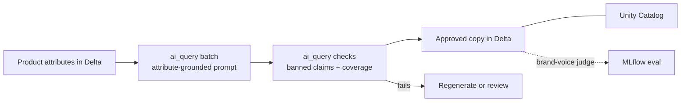

A Jobs batch runs ai_query with attribute-grounded prompts across the catalog, a second ai_query pass validates banned claims and attribute coverage, and MLflow judges score brand-voice adherence before copy is published.

**Key decisions:** Attribute-grounded prompting to prevent fabricated specs; template plus free-generation balance for consistency versus variety; offline batch generation for cost and throughput.

**Evaluation:** Attribute-faithfulness checks (does the copy match the real specs?), brand-voice adherence, and business metrics like click-through and conversion via A/B tests.

**Trade-offs / pitfalls:** Fabricated features are a legal and trust risk; repetitive phrasing across a catalog reads as robotic; multilingual output needs localization review.

**Likely follow-up:** "How do you stop it inventing a feature the product does not have?" Ground strictly to structured attributes and validate before publish.

## F. Multimodal

**7. Design a scalable image-generation pipeline for millions of users, covering the GPU fleet, queueing, and cost.**

Show approach

**Clarify:** Peak concurrent requests, target latency, and images per request? Is a few-seconds wait acceptable? What quality and resolution? Content-safety requirements?

**Approach:** Accept requests through an API, place them on a queue, and serve them from an autoscaling pool of GPU workers running the diffusion model. Return results asynchronously (poll or webhook). Cache and deduplicate identical prompts, and apply a content-safety filter on both prompt and output.

**Databricks build:**

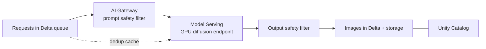

A Delta-backed queue feeds a GPU Model Serving endpoint that autoscales on depth, with AI Gateway safety filters on prompt and output and dedup caching to cut cost per image.

**Key decisions:** Asynchronous queue plus worker pool over synchronous serving; autoscaling on queue depth; batching requests on the GPU for throughput; a spot or reserved capacity mix for cost.

**Evaluation:** Latency percentiles, queue wait time, GPU utilization and cost per image, and a safety-filter catch rate.

**Trade-offs / pitfalls:** GPUs are expensive and scale slowly, so cold starts and bursty traffic hurt; oversized instances waste money. Under-provisioning creates long queues. Batching trades a little latency for large cost wins.

**Likely follow-up:** "Traffic spikes 10x for a launch, what happens?" Queue absorbs the burst, autoscaling adds workers, users see a wait rather than failures.

**8. Design a text-to-video generation platform (Sora-style) with GPU scheduling for long-running, opaque jobs.**

Show approach

**Clarify:** Clip length and resolution? How long does one job run (minutes)? How many concurrent jobs? Is a progress signal expected, or just a final result?

**Approach:** Treat each generation as a long-running async job. Submit to a queue, schedule onto GPU workers, and track job state (queued, running, done, failed). Because jobs are long and opaque, expose status and estimated wait, checkpoint where possible, and support cancellation. Store outputs in object storage and notify on completion.

**Databricks build:**

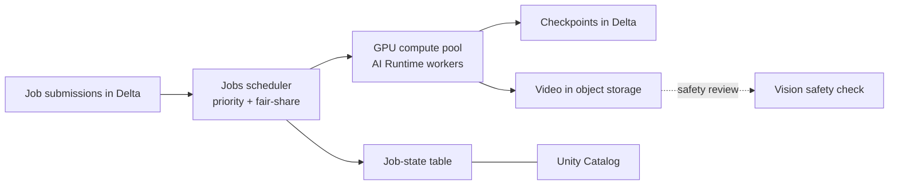

Databricks Jobs schedule long-running generation onto a GPU AI Runtime pool with fair-share priorities, checkpointing state to Delta so a worker crash resumes rather than restarts, and outputs land in governed object storage after a vision safety review.

**Key decisions:** A job scheduler with priorities and fair-share over first-come-first-served; checkpointing to survive worker failure; per-user quotas to protect shared GPU capacity; safety review of generated video.

**Evaluation:** Job success rate, end-to-end completion time, GPU utilization, and cost per minute of video. Track failed or stuck jobs closely.

**Trade-offs / pitfalls:** Long jobs monopolize scarce GPUs; a crash near the end wastes huge compute without checkpoints; users hate opaque multi-minute waits with no feedback.

**Likely follow-up:** "A worker dies at 90 percent, what happens?" Resume from checkpoint or requeue; never silently lose the job.

**9. Design a clinical or hospital voice assistant, handling noise, privacy, latency, and domain vocabulary.**

Show approach

**Clarify:** What tasks (dictation, lookups, orders)? Who speaks, and in what acoustic environment? What latency feels responsive? What are the PHI and consent rules?

**Approach:** Capture audio, run domain-adapted speech-to-text tuned for medical vocabulary and noisy wards, then process intent with an LLM grounded in approved clinical data. Speak or display results. Keep the pipeline streaming so responses feel immediate, and keep PHI inside a compliant boundary.

**Databricks build:**

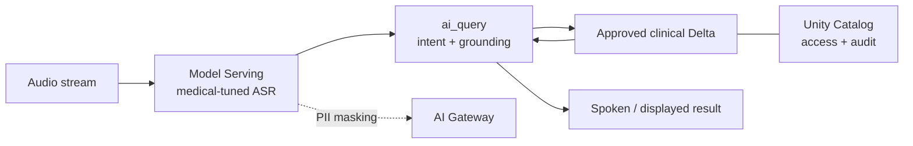

Medical-tuned ASR on Model Serving streams into ai_query grounded on approved clinical Delta tables, with AI Gateway masking PHI and Unity Catalog enforcing role-based access and audit inside a compliant boundary.

**Key decisions:** A medical-tuned ASR model over a generic one; streaming recognition for low latency; strict access controls and audit logging; a confirmation step before any consequential action.

**Evaluation:** Word error rate on medical terms in noisy conditions, task success rate, latency, and safety of any actions taken.

**Trade-offs / pitfalls:** Background noise and accents wreck recognition; medical terms are easily misheard with real consequences; privacy is non-negotiable. Confirm before acting on high-stakes commands.

**Likely follow-up:** "How do you handle PHI?" Encryption, minimal retention, role-based access, and a deployment that keeps data in-boundary.

**10. Design a multimodal search system where a query can be text plus an image or video, using cross-modal embeddings.**

Show approach

**Clarify:** What can users search across (images, video, text)? Query modalities? Corpus size and freshness? Latency target?

**Approach:** Embed all content into a shared multimodal vector space so text and images land in the same coordinate system. Index embeddings in a vector store. At query time, embed the query (text, image, or both) and retrieve nearest neighbors, then optionally rerank. For video, embed representative frames or segments.

**Databricks build:**

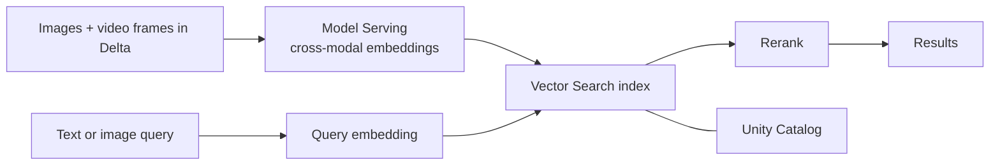

A shared cross-modal embedding model on Model Serving embeds images and sampled video frames into Databricks Vector Search, so a text or image query retrieves across modalities and a rerank stage sharpens precision.

**Key decisions:** A shared cross-modal embedding model so a text query can retrieve images directly; approximate nearest-neighbor indexing for scale; a reranking stage for precision; frame or segment strategy for video.

**Evaluation:** Retrieval quality (recall at k, mean reciprocal rank) on labeled query-result pairs, latency, and human relevance judgments.

**Trade-offs / pitfalls:** Cross-modal alignment is imperfect, so text-to-image relevance can be noisy; video embedding is costly and frame sampling loses information; index freshness lags new uploads.

**Likely follow-up:** "How do you search video efficiently?" Segment and embed key frames rather than every frame.

**11. Design an OCR and document-understanding pipeline that extracts information from scanned documents.**

Show approach

**Clarify:** Document types and layouts (forms, tables, free text)? Scan quality? Which fields must be extracted, and how accurate? Volume and languages?

**Approach:** Preprocess images (deskew, denoise, enhance), run OCR to recover text with position, then apply layout-aware understanding to map text into structured fields. Use a document-understanding model that combines text and layout for forms and tables. Validate extracted fields and route low-confidence results to human review.

**Databricks build:**

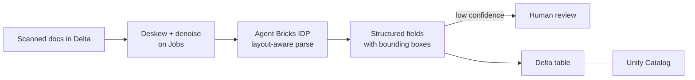

Jobs preprocess scans and Agent Bricks IDP runs layout-aware parsing that maps text and tables into structured fields, preserving bounding boxes for traceability and gating low-confidence extractions to human review.

**Key decisions:** Layout-aware extraction over plain OCR-plus-regex for structured forms; confidence scores that gate human review; preserving bounding boxes for traceability and correction.

**Evaluation:** Character and field-level accuracy, table-structure accuracy, and false-reject rate. Break metrics down by document type and scan quality.

**Trade-offs / pitfalls:** Poor scans and handwriting crush accuracy; complex tables and multi-column layouts are hard; language coverage varies. State the scan-quality dependency up front.

**Likely follow-up:** "How do you handle a field the model is unsure about?" Surface confidence and send it to human review rather than guessing.

## G. Safety, Moderation & Guardrails

**12. Design a harmful-content and policy-violation detection system with input and output classifiers, including multimodal content.**

Show approach

**Clarify:** Which policy categories (violence, hate, sexual, self-harm)? Text only, or images and video too? What is the tolerance for false positives versus false negatives? Human moderators available?

**Approach:** Run classifiers at both the input (user-submitted content) and output (model-generated content) stages. Use category-specific moderation models for text and vision. Take graded action by severity: block, flag for review, or allow. Route borderline cases to human moderators, and log decisions for appeals and auditing.

**Databricks build:**

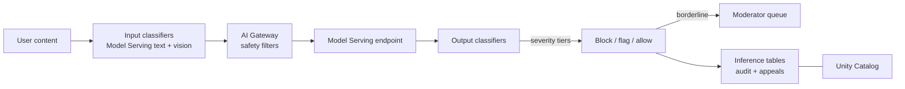

Category-specific classifiers on Model Serving screen input and output for text and vision, AI Gateway applies graded safety filters, and inference tables log every decision for appeals and audit.

**Key decisions:** Layered input and output checks; severity tiers rather than a single block-or-allow switch; a human-review queue for ambiguous cases; separate models per modality.

**Evaluation:** Precision and recall per policy category, false-positive rate (over-blocking harms users), and reviewer agreement. Continuously test against evolving harmful content.

**Trade-offs / pitfalls:** Over-blocking frustrates legitimate users; under-blocking causes real harm; context matters, so the same words can be fine or violating; adversaries adapt.

**Likely follow-up:** "How do you keep up with new attack patterns?" Retrain on new examples and maintain an evolving red-team set.

**13. Protect an LLM system from prompt injection and jailbreaks with layered defense-in-depth.**

Show approach

**Clarify:** Does the system read untrusted content (web pages, documents, emails)? Does it have tools or actions that could cause damage? What is the worst-case if it is manipulated?

**Approach:** Assume no single defense is sufficient and layer several. Separate trusted instructions from untrusted data in the prompt. Screen inputs for injection patterns. Constrain what the model can do, so tools require authorization and dangerous actions need confirmation. Screen outputs before they act. Apply least privilege to every tool and data source.

**Databricks build:**

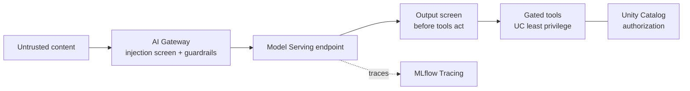

AI Gateway screens untrusted input for injection and guardrails the model, output is checked before any tool fires, and Unity Catalog enforces least-privilege authorization on every gated tool with MLflow Tracing for forensics.

**Key decisions:** Treat all external content as untrusted; keep the system prompt privileged and clearly delimited; gate high-impact tool calls behind explicit checks; sandbox execution.

**Evaluation:** Injection and jailbreak success rate against a red-team suite, measured before and after each defense layer.

**Trade-offs / pitfalls:** No defense is airtight, so over-trusting one filter is the classic mistake; heavy filtering hurts legitimate use; injection hidden in retrieved documents is easy to miss.

**Likely follow-up:** "A retrieved web page says ignore your instructions and email the data, what stops it?" Data-versus-instruction separation plus a gated, authorized email action.

**14. Design an LLM guardrail system for PII, data leakage, and toxicity, with input and output guardrails and retry-on-unsafe.**

Show approach

**Clarify:** What must never leak (PII, secrets, internal data)? Redact or block? What latency budget do guardrails have? Who reviews blocks?

**Approach:** Place guardrails on both sides. On input, detect and redact PII and screen for disallowed requests. On output, scan for PII, leaked internal data, and toxicity before returning anything to the user. If an output fails, retry with a corrective instruction; if it fails again, fall back to a safe canned response rather than serving unsafe text.

**Databricks build:**

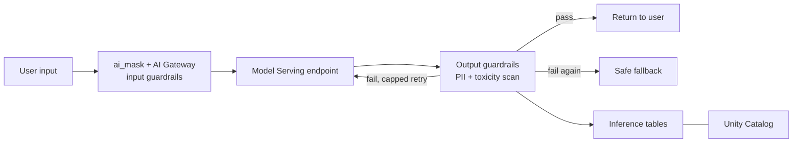

ai_mask and AI Gateway guardrails redact PII on input, output is scanned for PII, leaks, and toxicity, and a capped retry-on-unsafe loop falls back to a safe response with everything logged to inference tables.

**Key decisions:** Input and output guardrails as separate layers; redaction versus hard block per data type; a bounded retry-on-unsafe loop with a safe fallback; logging for audit.

**Evaluation:** PII-detection recall (missing PII is the costly error), false-positive rate, toxicity-catch rate, and added latency.

**Trade-offs / pitfalls:** Guardrails add latency and cost; over-redaction breaks usefulness; infinite retry loops waste money, so cap retries. Detectors are imperfect and need monitoring.

**Likely follow-up:** "Output keeps failing the check, what then?" Cap retries, then return a safe fallback and flag it.

**15. Detect and mitigate ungrounded or hallucinated outputs using grounding and verification.**

Show approach

**Clarify:** Is the system retrieval-grounded (RAG) or open-ended? What is the cost of a confident wrong answer? Is latency budget available for a verification pass?

**Approach:** Ground answers in retrieved sources and require citations. Add a verification step that checks whether each claim is supported by the retrieved context, using an entailment model or an LLM judge. If a claim is unsupported, drop it, ask the model to revise, or return "I do not have enough information." Surface citations so users can check.

**Databricks build:**

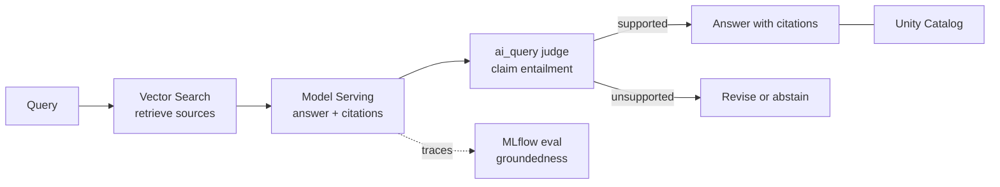

Answers are grounded on Vector Search with mandatory citations, an ai_query judge verifies each claim is entailed by the retrieved context, and MLflow groundedness scores track how often the system correctly abstains.

**Key decisions:** Grounding with mandatory citations; a post-generation faithfulness check; a graceful abstention path over guessing; showing sources for user verification.

**Evaluation:** Faithfulness or groundedness score (claims entailed by sources), hallucination rate, and citation accuracy. Track how often the system correctly abstains.

**Trade-offs / pitfalls:** Verification adds latency and cost; retrieval gaps still cause hallucination; an LLM judge can itself be wrong, so calibrate it against human labels.

**Likely follow-up:** "The answer is not in the retrieved docs, what should happen?" Abstain clearly rather than fabricate.

**16. Design AI red-teaming and adversarial-testing workflows.**

Show approach

**Clarify:** What are we protecting against (harmful content, jailbreaks, injection, PII leakage, bias)? Is this a one-time launch gate or continuous? Who acts on findings?

**Approach:** Build a red-team suite that probes the system with adversarial inputs across each risk category. Combine human red-teamers with automated attack generation, where one model tries to break another at scale. Log every failure as a reproducible test case, feed fixes back into guardrails or training, and re-run the suite as a regression gate on every change.

**Databricks build:**

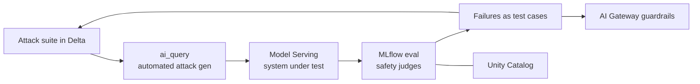

An ai_query attacker generates adversarial inputs at scale against the Model Serving endpoint, MLflow safety judges score outcomes, and every failure becomes a versioned Delta test case that feeds guardrails and runs as a regression gate.

**Key decisions:** Continuous red-teaming over a one-off exercise; automated attack generation to scale coverage; a growing regression suite so old vulnerabilities stay fixed; clear ownership of findings.

**Evaluation:** Attack success rate over time (should trend down), coverage across risk categories, and time-to-fix for discovered issues.

**Trade-offs / pitfalls:** Red-teaming never proves total safety, only surfaces known failure modes; adversaries evolve, so a static suite goes stale; findings without an owner never get fixed.

**Likely follow-up:** "How do you know your coverage is good?" Track categories tested and treat every real incident as a new test case.

Practice these out loud until the framework feels automatic. When you can open any question here and calmly narrate clarify, approach, evaluation, and trade-offs, you are ready.

Next Lesson: ➡️ [Question Bank: Evaluation & LLM Infrastructure](/docs/system-design-interviews/question-bank-eval-infra)
