# Question Bank: Training & Domain-Specific

This is your final practice set. It covers two of the hardest question families interviewers reach for: the ones about **building the machine** (training and data pipelines) and the ones about **a specific, high-stakes domain** (code, legal, banking, medical, fraud, support, search, healthcare).

Each question below gives you a bold prompt and a collapsible worked approach. Read the prompt, cover the answer, and try to talk through your own version first. Then open the details and compare. Do not memorize the answers word for word. Memorize the shape of the reasoning.

:::tip
Every answer here follows the same **8-step framework** from [The AI System Design Interview Playbook](/docs/system-design-interviews/the-playbook): clarify requirements, sketch the architecture, pick a model, design retrieval or data flow, handle evaluation, then cost, latency, and safety. When you feel lost mid-answer, return to that order. It is your map.
:::

## J. Fine-Tuning, Training & Data Pipelines

**1. Design a distributed training system for large deep-learning models (data parallelism, model parallelism, scheduling, failure handling).**

Show approach

**Clarify:** How big is the model (billions of parameters)? How many GPUs or nodes are available, and are they in one cluster or several? What is the training budget in wall-clock time and dollars? Is this a one-off run or continuous retraining?

**Approach:** Split work two ways. **Data parallelism** replicates the model across workers, each processes a different batch shard, and gradients are averaged (all-reduce) each step. **Model parallelism** (tensor and pipeline) splits a model too large for one device across several. Most large runs combine both. A scheduler places jobs on GPU nodes and packs them for high utilization.

**Databricks build:**

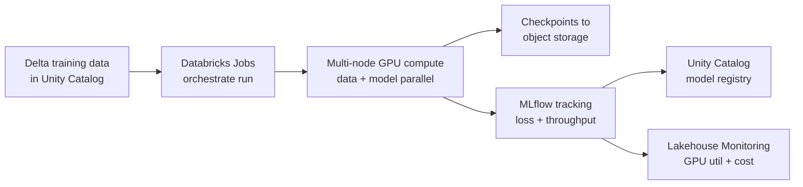

The training data lives in Delta, Jobs schedules the distributed run on GPU clusters that checkpoint to object storage, and MLflow tracks metrics and registers the result to Unity Catalog.

**Key decisions:** Choose an all-reduce topology that matches your interconnect. Checkpoint frequently to object storage so a crashed node does not cost hours. Use mixed precision to fit larger batches.

**Evaluation:** Track GPU utilization, throughput (tokens or samples per second), loss curves, and cost per epoch. Hold out a validation set to catch overfitting.

**Trade-offs / pitfalls:** More parallelism means more communication overhead, so scaling is sublinear. Stragglers stall all-reduce. Silent data corruption in shards is easy to miss without validation.

**Likely follow-up:** "A node dies at hour 20 of a 30-hour run. What happens?" Answer: resume from the last checkpoint, reschedule the failed shard, and continue.

**2. Design a scalable data pipeline for ML and LLM applications (ingestion, processing, storage, throughput).**

Show approach

**Clarify:** What are the data sources and formats? Batch, streaming, or both? What is the volume per day and the freshness requirement? Who consumes the output, training jobs, feature stores, or a retrieval index?

**Approach:** Build in layered stages. **Ingestion** pulls from sources (databases, event streams, files) into a raw landing zone. **Processing** cleans, deduplicates, validates, and transforms, often in a medallion pattern (raw to refined to curated). **Storage** lands curated data in a lakehouse table format for cheap, queryable, versioned access. Downstream, embeddings or features are derived on a schedule or on arrival.

**Databricks build:**

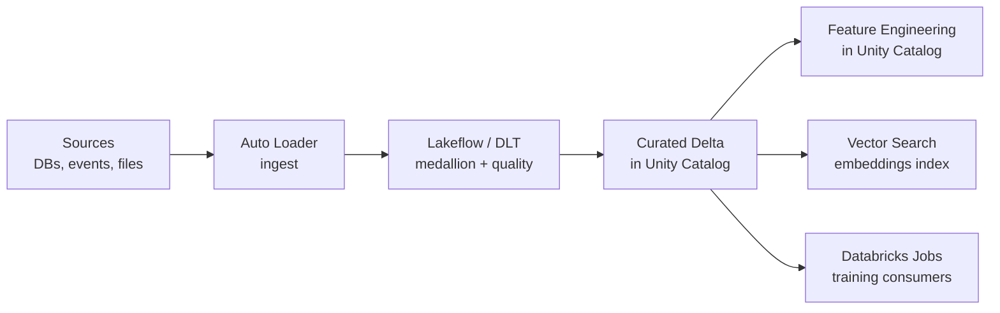

Auto Loader ingests raw sources, Lakeflow DLT applies medallion transforms and quality checks into governed Delta tables, and downstream features, embeddings, and training jobs read from the curated layer.

**Key decisions:** Separate raw from curated so you can reprocess without re-ingesting. Enforce a schema and quality checks at the boundary. Partition storage by time or key for throughput. Make each stage idempotent so retries are safe. See [Databricks documentation](https://docs.databricks.com/aws/en/) for lakehouse patterns.

**Evaluation:** Track ingestion lag, row counts versus expected, schema-violation rates, and end-to-end freshness.

**Trade-offs / pitfalls:** Streaming lowers latency but raises operational complexity. Skipping validation lets bad data poison training silently.

**Likely follow-up:** "Volume grows 10x. What breaks first?" Usually the processing stage, so you scale it horizontally and partition more aggressively.

**3. Design a fine-tuning pipeline for a domain-specific LLM (data curation, evaluation, versioning).**

Show approach

**Clarify:** What does fine-tuning need to add that prompting or retrieval cannot, a tone, a format, or domain reasoning? How much labeled data exists? Who owns quality review? How often will the model be retrained?

**Approach:** Start with data curation, the part that decides success. Collect domain examples, deduplicate, filter for quality, and split into train, validation, and test. Choose a technique: lightweight adapter tuning (such as LoRA) is cheaper and easier to roll back than full fine-tuning. Run the tuning job, then evaluate before promoting. Version everything: the base model, the dataset snapshot, the training config, and the resulting adapter.

**Databricks build:**

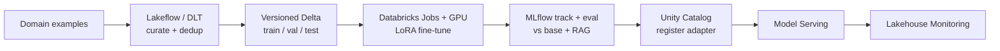

Curated, versioned Delta datasets feed a GPU fine-tuning job, MLflow evaluates the adapter against the base model before registration to Unity Catalog, and only a promoted version reaches Model Serving.

**Key decisions:** Prefer parameter-efficient tuning first, it is faster and reversible. Keep a frozen evaluation set the model never trains on. Register each model version so you can compare and roll back.

**Evaluation:** Measure task-specific quality against the held-out set, compare to the base model and to a retrieval-only baseline, and check for regressions on general tasks.

**Trade-offs / pitfalls:** Fine-tuning bakes knowledge in, so it goes stale, unlike retrieval. Small or biased datasets cause overfitting and confident errors.

**Likely follow-up:** "Fine-tune or just use RAG?" Often RAG first for facts, fine-tune only for behavior.

**4. Design a feature store plus training pipeline feeding a ranking model (continuous ingestion, training, serving).**

Show approach

**Clarify:** What is being ranked and by what signal (clicks, conversions)? What is the latency budget at serving time? How fresh must features be, seconds or hours? What is the training cadence?

**Approach:** A **feature store** computes features once and serves them consistently to both training and serving, which is the whole point, it kills training-serving skew. Events stream in and update features continuously. An **offline store** holds historical values for training; an **online store** holds the latest values for low-latency lookup at request time. A scheduled job trains the ranking model on offline features with point-in-time-correct joins, then the model is registered and deployed behind a serving endpoint.

**Databricks build:**

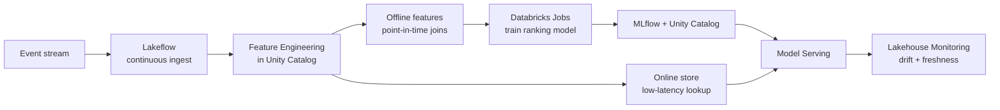

One Feature Engineering layer in Unity Catalog feeds both offline training with point-in-time joins and the online store queried at serving time, guaranteeing the same feature logic on both paths.

**Key decisions:** Guarantee the same feature logic offline and online. Use point-in-time joins so training never sees future data (no label leakage). Keep the online store fast (key-value lookup).

**Evaluation:** Offline ranking metrics (such as NDCG), then an online A/B test on the real business metric. Monitor feature freshness and drift.

**Trade-offs / pitfalls:** Training-serving skew is the classic silent killer. Overly fresh features raise cost and complexity.

**Likely follow-up:** "How do you retrain safely?" Shadow-deploy, compare, then promote.

## K. Domain-Specific

**5. Design an AI code assistant or Copilot-style tool inside an IDE (context retrieval, low latency, debugging support).**

Show approach

**Clarify:** Inline completion, chat, or both? What languages and repo sizes? What is the acceptable latency for a suggestion (typically well under a second)? Can code leave the developer's environment, or is that restricted?

**Approach:** The magic is **context assembly**. Gather the current file, nearby open files, cursor position, imports, and relevant symbols retrieved from the repository, then send a tight prompt to a code-tuned model. Stream the response so the first tokens appear fast. For debugging, feed the error message, stack trace, and the failing code as grounding.

**Databricks build:**

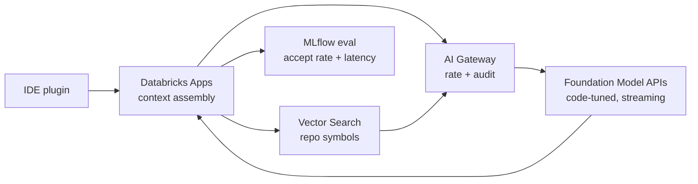

The IDE hits a Databricks App that assembles repo context via Vector Search and calls a streaming code model through the AI Gateway, with MLflow tracking acceptance rate and latency.

**Key decisions:** Use a smaller, faster model for inline completion and a larger one for chat and debugging. Cache and prefetch context. Rank retrieved snippets by relevance to the cursor, not just recency.

**Evaluation:** Suggestion acceptance rate, latency percentiles (p50 and p99), and whether accepted code is later kept or reverted.

**Trade-offs / pitfalls:** Latency is the product, a correct suggestion that arrives too late is useless. Too much context slows and confuses the model. Privacy rules may forbid sending code to external APIs.

**Likely follow-up:** "How do you cut latency in half?" Smaller model, shorter context, streaming, and aggressive caching.

**6. Design an AI legal assistant or contract-generation system (compliance, catastrophic-failure handling).**

Show approach

**Clarify:** Who is the user, a lawyer reviewing output or an end client acting on it? Which jurisdictions? Is the assistant drafting, reviewing, or answering questions? What is the worst-case harm from a wrong clause?

**Approach:** Ground everything in a curated, versioned library of approved clauses and precedents using retrieval, so the model assembles from vetted language rather than inventing it. Generate a draft, cite every clause back to its source, and route the output to a **human lawyer for review** before it is used. Log every generation for audit.

**Databricks build:**

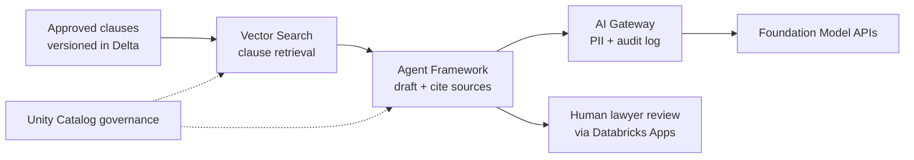

The agent retrieves only vetted clauses from a governed library, drafts with citations through the AI Gateway audit path, and routes every output to a human lawyer in a Databricks App before use.

**Key decisions:** Never let generated legal text reach a client without human sign-off, this is the catastrophic-failure guard. Constrain generation to approved templates where possible. Track clause provenance so review is fast.

**Evaluation:** Expert review scores on correctness and completeness, citation accuracy, and how often reviewers must edit. Red-team with adversarial prompts.

**Trade-offs / pitfalls:** A hallucinated clause or wrong jurisdiction can be genuinely damaging, hence mandatory human review. Over-constraining reduces usefulness.

**Likely follow-up:** "How do you handle a jurisdiction you do not support?" Detect and refuse clearly rather than guess.

**7. Design a banking chatbot that must not hallucinate (self-hosted model in a VPC, strict grounding, no public APIs).**

Show approach

**Clarify:** What questions must it answer, account info, product FAQs, or transactions? What is the regulatory boundary? Confirm the hard constraint: model and data stay inside the bank's private network, with no external API calls.

**Approach:** Host an open-weights model **inside the VPC** so no data leaves. Answer strictly from retrieval over approved internal sources, and instruct the model to say "I do not know" and escalate when retrieval returns nothing relevant. Add a grounding check that verifies the answer is supported by the retrieved passages before it is shown. For anything involving money movement, hand off to authenticated, deterministic backend systems, never the model.

**Databricks build:**

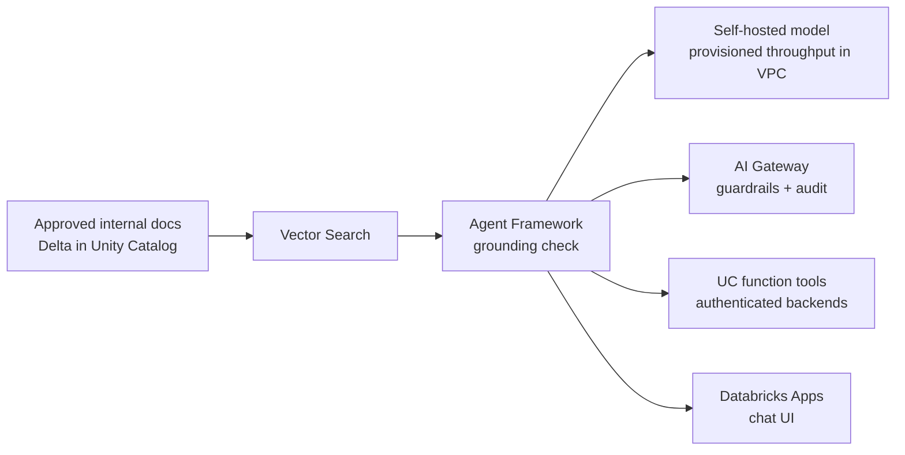

An open-weights model runs on provisioned throughput inside the VPC so no data leaves, answers are grounded and guardrailed through the AI Gateway, and money movement goes only through authenticated Unity Catalog function tools, never the model.

**Key decisions:** Self-host for data residency. Ground answers and cite sources. Refuse rather than guess. Keep the LLM out of the transaction path.

**Evaluation:** Groundedness and citation accuracy, refusal correctness (does it decline when it should?), and zero-tolerance red-teaming for fabricated account facts.

**Trade-offs / pitfalls:** Self-hosting adds operational burden but is non-negotiable here. Aggressive grounding may over-refuse, tune the threshold with real queries.

**Likely follow-up:** "A user asks for their balance." Authenticate, then fetch from the system of record, do not let the model state numbers.

**8. Reduce hallucinations in a medical chatbot (safety-critical grounding, escalation).**

Show approach

**Clarify:** Is this for clinicians or patients? Is it informational only, or does it influence care decisions? What is the escalation path to a human? What is the tolerance for a wrong answer (near zero)?

**Approach:** Ground every answer in vetted medical sources through retrieval, and require citations the user can check. Add a verification layer that confirms claims are supported before display. Detect emergency or high-risk intents (chest pain, self-harm) and **escalate immediately** to a human or emergency guidance rather than answering. Constrain scope: the bot answers general information and explicitly refuses diagnosis.

**Databricks build:**

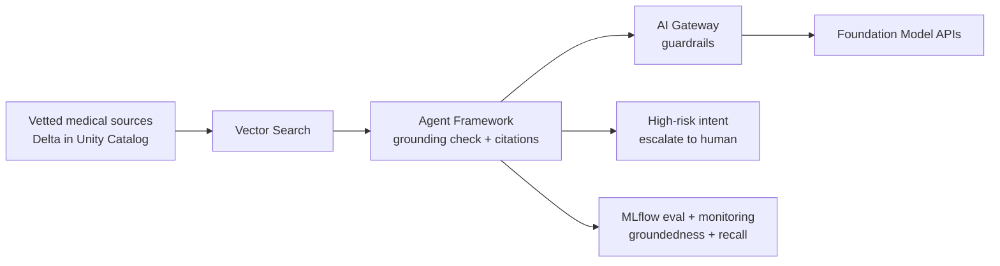

Answers are grounded in vetted sources with citations and verified before display, high-risk intents escalate to a human instead of answering, and MLflow monitors groundedness and escalation recall.

**Key decisions:** Retrieval-grounded answers with citations. A confidence and groundedness gate that triggers "I cannot answer this safely, please consult a professional." Clear, prominent escalation.

**Evaluation:** Groundedness, citation correctness, and expert clinical review of a sample. Measure the false-reassurance rate, the most dangerous failure, and the escalation-trigger accuracy.

**Trade-offs / pitfalls:** In medicine a confident wrong answer can cause real harm, so bias hard toward refusal and escalation. Over-refusal frustrates users but is the safer error.

**Likely follow-up:** "How do you know it did not miss an emergency?" Test escalation with adversarial red-flag cases and track recall.

**9. Design a real-time fraud detection system (millisecond latency plus high accuracy).**

Show approach

**Clarify:** What is being scored, card transactions or logins? What is the latency budget (often single-digit milliseconds inline with a payment)? What is the cost of a false positive (blocking a real customer) versus a false negative (letting fraud through)?

**Approach:** Score each event inline with a fast model fed by an online feature store, using precomputed features (recent velocity, device history, location) that are ready in milliseconds. High-confidence fraud is blocked automatically; ambiguous cases go to step-up verification or a human review queue. A slower, richer offline pipeline retrains models and catches patterns the fast path missed.

**Databricks build:**

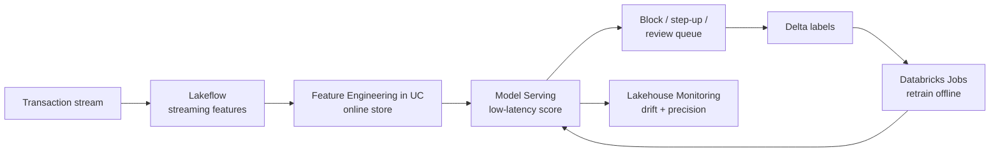

Streaming features land in the Unity Catalog online store for millisecond lookup, Model Serving scores each transaction inline, and a slower offline retrain loop plus Lakehouse Monitoring keeps up with shifting fraud patterns.

**Key decisions:** Split into a fast inline path and a slower analytical path. Precompute features so inference is a quick lookup plus scoring. Tune the decision threshold to the business cost of each error type.

**Evaluation:** Precision and recall on labeled fraud, dollars saved versus false-positive friction, and latency percentiles. Watch for drift as fraud tactics change.

**Trade-offs / pitfalls:** Chasing accuracy with a heavy model can blow the latency budget. Fraud patterns shift fast, so a stale model degrades quietly.

**Likely follow-up:** "How do you adapt to a new fraud pattern overnight?" Fast rules plus frequent retraining and human-labeled feedback.

**10. Design an AI customer-support agent (knowledge-base grounding, tool use, escalation to humans).**

Show approach

**Clarify:** What can it actually do, answer questions, or also take actions like issuing a refund? What channels? What is the escalation policy? What is the tone and brand requirement?

**Approach:** Ground answers in the support knowledge base via retrieval so responses stay factual and current. Give the agent a small set of **tools** for real actions (look up an order, start a return) behind authenticated, permissioned APIs. Add an orchestration loop: retrieve, decide whether a tool is needed, act, and respond. Detect frustration, low confidence, or out-of-scope requests and **escalate to a human** with the full conversation context.

**Databricks build:**

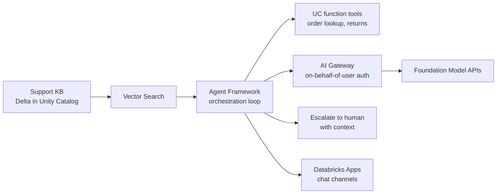

The agent grounds answers via Vector Search, takes real actions through permissioned Unity Catalog function tools with on-behalf-of-user auth, and escalates low-confidence or sensitive cases to a human with full context.

**Key decisions:** Retrieval for facts, tools for actions, humans for the hard cases. Gate any state-changing tool behind confirmation and authorization. Preserve context on handoff.

**Evaluation:** Resolution rate without escalation, groundedness, tool-call success rate, and customer satisfaction. Measure wrongful actions taken (should be near zero).

**Trade-offs / pitfalls:** Giving the agent powerful tools without guardrails risks real harm. Over-eager automation frustrates users who want a person.

**Likely follow-up:** "When exactly should it escalate?" Low confidence, repeated failure, sensitive topics, or explicit user request.

**11. Design an AI search assistant for a website with 10M+ articles (scale plus relevance).**

Show approach

**Clarify:** Is the output a ranked list of articles or a synthesized answer with sources? What is the query volume and latency budget? How fresh must new articles be in results? What languages?

**Approach:** Index all articles into a vector store for semantic search, combined with keyword search (hybrid retrieval) for precision on names and exact terms. At query time, retrieve candidates from both, merge and rerank the top results, then either return the ranked list or feed the top passages to an LLM to synthesize a grounded answer with citations. Precompute embeddings in a batch pipeline and update the index incrementally as articles change.

**Databricks build:**

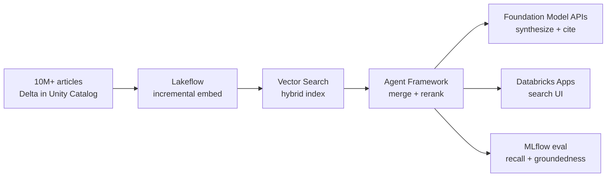

Articles are embedded incrementally into a hybrid Vector Search index, and at query time the agent merges, reranks, and optionally synthesizes a cited answer, with MLflow tracking retrieval recall and groundedness.

**Key decisions:** Hybrid retrieval beats pure vector or pure keyword. Add a reranking stage for relevance. Keep indexing incremental so 10M+ documents stay fresh without full rebuilds.

**Evaluation:** Retrieval recall and precision at k, reranked relevance judged by humans, latency percentiles, and, if synthesizing, groundedness and citation accuracy.

**Trade-offs / pitfalls:** At this scale, index freshness and cost fight each other. Pure semantic search misses exact-match queries, hence hybrid.

**Likely follow-up:** "How do you keep results fresh?" Incremental indexing plus a fast path for newly published articles.

**12. Design a healthcare diagnosis or clinical decision-support system (safety, explainability, human oversight).**

Show approach

**Clarify:** Is this a decision-support tool for clinicians, not an autonomous diagnostician? Which conditions and data (labs, imaging, notes)? What are the regulatory and liability constraints? What must the clinician be able to see to trust it?

**Approach:** Position the system as **decision support**, it surfaces evidence and suggestions, the clinician decides. Ground outputs in patient data and vetted medical guidelines through retrieval, and make every suggestion **explainable**: show which inputs and sources drove it. Require a human clinician in the loop for any recommendation. Log everything for audit and regulatory review, and monitor for bias across patient populations.

**Databricks build:**

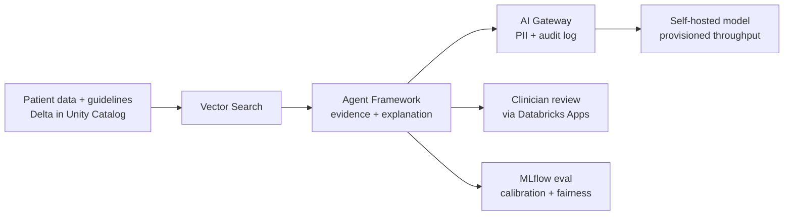

Every suggestion is grounded in the patient record and guidelines with an explanation, passes through the audited AI Gateway to a governed model, and reaches a clinician for confirmation while MLflow monitors calibration and fairness.

**Key decisions:** Never autonomous, always clinician-confirmed. Explainability is a requirement, not a nicety, an unexplained suggestion will not be trusted or defensible. Ground in the patient record and guidelines.

**Evaluation:** Expert clinical review, sensitivity and specificity on labeled cases, calibration of confidence, and fairness audits across demographics. Track how often clinicians accept or override.

**Trade-offs / pitfalls:** A confident wrong suggestion can cause serious harm, so oversight and explainability are mandatory. Bias in training data can quietly disadvantage groups.

**Likely follow-up:** "How do you validate it is safe to deploy?" Prospective clinical evaluation, regulatory review, and staged rollout with monitoring.

---

## You made it

That is the end of the question bank, and the end of the whole **Databrickster** course. Take a moment to appreciate how far you have come. You started not knowing where to begin when someone said "design an AI assistant," and now you can walk through ingestion, retrieval, models, evaluation, cost, latency, and safety for problems as varied as fraud detection, legal drafting, and clinical decision support. That is real, durable skill.

You do not need to have every answer memorized. You have something better: a framework, a vocabulary, and the instinct to ask the right questions and name the ways a system can fail. That is exactly what a senior engineer sounds like.

Go into your interview calm. Breathe. Ask clarifying questions. Narrate your thinking. You are ready.

Congratulations, and thank you for learning with us. Whenever you want to revisit the map, it is always right here at [Start Here](/docs/intro).
