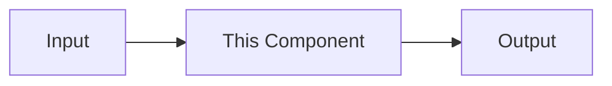

{/*
  DATABRICKSTER LESSON TEMPLATE
  -----------------------------
  Copy this file into docs/<part-folder>/ and rename it (e.g. 02-tokens.mdx).
  Fill every section. Do not delete sections — if one genuinely does not apply,
  keep the heading and write a one-line note explaining why. Keep the order.
  Diagrams: prefer ```mermaid; use ASCII when it reads better inline.
  Code: production-quality, runnable, latest Databricks APIs, AWS scope.
  Scenarios: fictional enterprises only (banking, insurance, healthcare,
  manufacturing, retail, logistics, asset management, restaurants). Never
  reference a real employer, client, or confidential environment.
*/}

# <Lesson Title>

> **One-sentence hook** that tells the reader why this lesson matters to them.

## Learning Objectives
By the end of this lesson you will be able to:
- …
- …

## Prerequisites
- …  (link to prior lessons/concepts)

## Estimated Reading Time
~<N> minutes.

## Business Motivation
Why an enterprise cares. A concrete, fictional scenario that sets up the need.

## Intuition
The plain-English mental model, anchored to a Data Engineering concept the reader
already knows. Use an analogy from the approved list where it genuinely helps.

## Theory
The precise, technically accurate explanation. Define every new term on first use.

## Deep Dive
Go beyond the docs. Nuance, edge cases, and the "why it's designed this way."

## Architecture
Where this sits in the overall system. Include a diagram.



## Internal Working
What actually happens behind the scenes, step by step.

## Step-by-Step Walkthrough
A guided, narrated path through a single concrete example.

## Hands-on Examples
- **Simple:** …
- **Intermediate:** …
- **Enterprise:** …

## Code Examples
```python
# Production-quality, well-commented, runnable on current Databricks APIs.
```

## Production Considerations
Reliability, scaling, failure recovery, operational reality.

## Performance Considerations
Latency, throughput, caching, cost drivers.

## Security Considerations
Permissions, PII, guardrails, data governance.

## Common Mistakes
- ❌ … → ✅ …

## Best Practices
- ✅ …

## Interview Questions
1. **Q:** … **A:** …

## Quiz
1. …
   <details><summary>Answer</summary>…</details>

## Summary
A tight paragraph recapping the lesson.

## Key Takeaways
- …

## Glossary
- **Term** — definition.

## Further Reading
- [Databricks: …](https://docs.databricks.com/aws/en/…)

## Next Lesson
➡️ **[<Next Lesson Title>](<relative-link>)** — one line on what's next.
