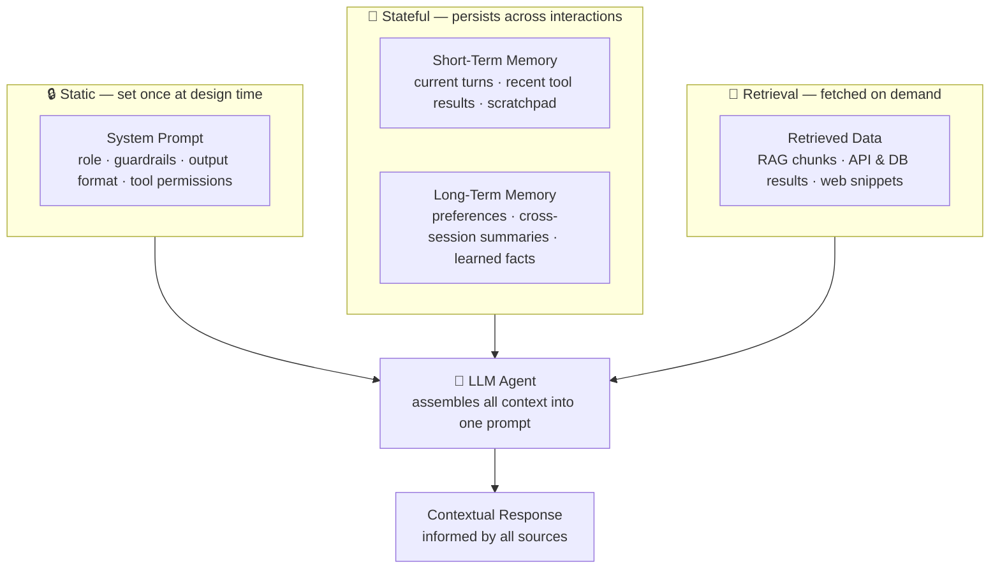
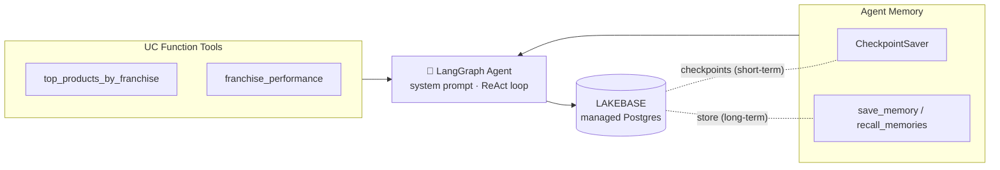
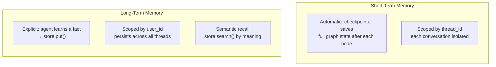
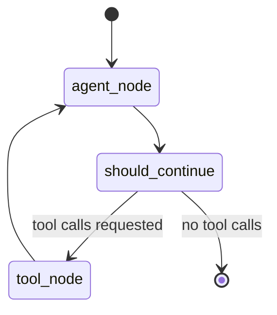
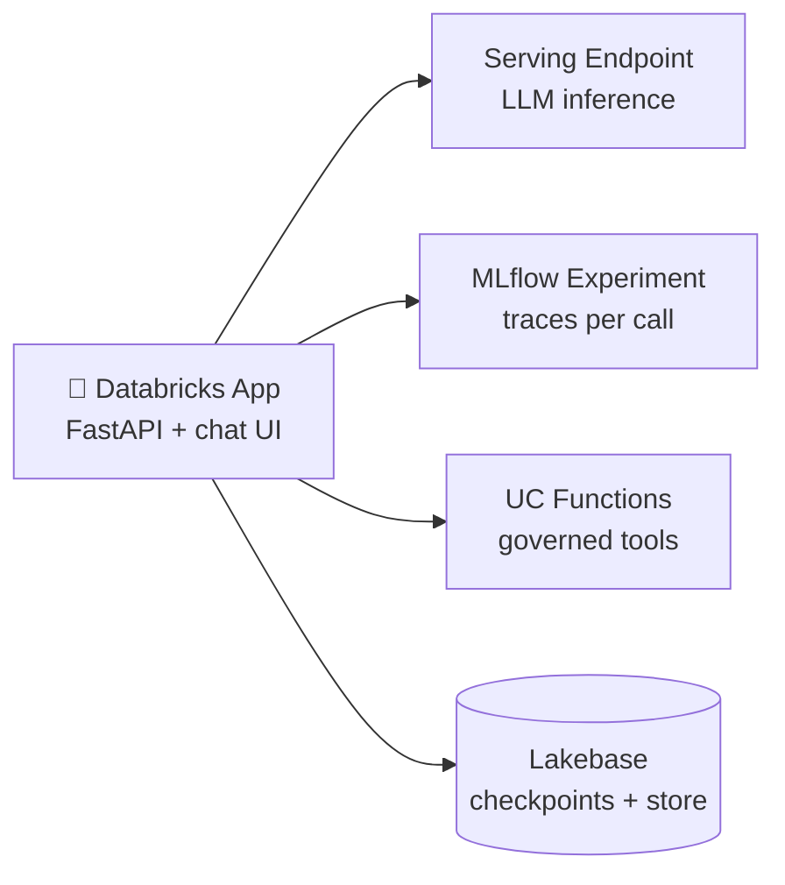

An LLM, on its own, is **stateless**. Every call starts from a blank slate. The
model that just helped you compare two franchises has, on the very next request,
no idea who you are, what you asked, or what it answered. Everything that *feels*
like memory in a good AI assistant is something the surrounding system assembles
and hands to the model on each turn.

This post walks through a complete, stateful assistant for **Bakehouse** — a
global bakery franchise chain with 48 locations across 9 countries — and shows
exactly where "memory" comes from: **short-term** memory that keeps a single
conversation coherent, **long-term** memory that remembers a manager across
sessions, and the **Lakebase** (Databricks-managed Postgres) instance that
persists both. We finish by deploying the whole thing as a Databricks App.

{/* truncate */}

## The scenario

Bakehouse franchise managers want an assistant that can do four things well:

- **Analyze sales performance** — top-selling products, revenue by location, trends by franchise or region. *Powered by Unity Catalog function tools that query live sales data.*
- **Compare franchise locations** — benchmark one franchise against others in the same country or city, including average order value and transaction volume.
- **Maintain conversation context** — follow a multi-turn thread where *"those franchises"* or *"our top product"* refers back to earlier answers without repetition. *Powered by short-term memory.*
- **Remember each manager across sessions** — recall a manager's name, franchise, preferred products, and reporting preferences days later in a brand-new browser session. *Powered by long-term memory.*

The data lives in the `samples.bakehouse` schema: `sales_transactions`
(3,333 transactions over May 1–17, 2024) and `sales_franchises`
(48 franchises, largest presence in Japan and the US, six products each named
after a city or region).

## Four sources of context

The key mental model is that **every agent call assembles multiple context
sources into a single prompt**, organized into three categories. The quality of
the response depends heavily on the quality of these inputs.



**Static** context (the system prompt) is authored once. **Retrieval** context
is fetched fresh each turn — in our case, live sales numbers from Unity Catalog
functions. The interesting part, and the focus of this post, is the **stateful**
middle layer: the two kinds of memory.

## The architecture at a glance



Both memory systems persist to the **same Lakebase instance** but use separate
tables. Lakebase is Databricks' managed Postgres: native workspace auth, and
scale-to-zero when idle. That single design choice — one governed Postgres for
all agent state — is what makes the rest of the system simple.

## Step 1 — UC Function Tools

The agent's ability to answer data questions comes from two **Unity Catalog SQL
functions**. Registering them in UC means they are governed, discoverable, and
callable by the agent as tools. The `COMMENT` on each function is not decoration —
it is the description the LLM reads to decide *when* to call the tool.

```sql
CREATE OR REPLACE FUNCTION top_products_by_franchise(
    filter_franchise STRING DEFAULT NULL COMMENT 'Filter by franchise name (partial, case-insensitive). Pass NULL for all.',
    filter_country   STRING DEFAULT NULL COMMENT 'Filter by country (partial, case-insensitive). Pass NULL for all.'
)
RETURNS TABLE (franchise_name STRING, product STRING, total_quantity BIGINT, total_revenue DOUBLE, num_transactions BIGINT)
COMMENT 'Find top-selling products across Bakehouse franchises. Filter by franchise or country. Returns product sales ranked by revenue.'
RETURN
SELECT f.name AS franchise_name, t.product,
       SUM(CAST(t.quantity AS BIGINT))    AS total_quantity,
       SUM(CAST(t.totalPrice AS DOUBLE))  AS total_revenue,
       COUNT(*)                           AS num_transactions
FROM samples.bakehouse.sales_transactions t
JOIN samples.bakehouse.sales_franchises f ON t.franchiseID = f.franchiseID
WHERE (filter_franchise IS NULL OR LOWER(f.name)    LIKE CONCAT('%', LOWER(filter_franchise), '%'))
  AND (filter_country   IS NULL OR LOWER(f.country) LIKE CONCAT('%', LOWER(filter_country), '%'))
GROUP BY f.name, t.product
ORDER BY total_revenue DESC;
```

A sibling function, `franchise_performance(filter_country, filter_city)`, joins
the same tables to return revenue, order count, and **average order value** per
location. Both are then wrapped as LangChain-compatible tools:

```python
from databricks_langchain import UCFunctionToolkit

uc_tool_names = [
    f"{catalog_name}.{schema_name}.top_products_by_franchise",
    f"{catalog_name}.{schema_name}.franchise_performance",
]
uc_toolkit = UCFunctionToolkit(function_names=uc_tool_names)
uc_tools = uc_toolkit.tools
```

:::note[Why the COMMENT matters]
The parameter and function `COMMENT` strings become the tool's schema and
docstring that the model sees. Vague comments produce a tool the LLM never calls
at the right time; precise ones ("pass NULL to include all") make tool selection
reliable. Treat them as prompt engineering, not documentation.
:::

## Step 2 — Two kinds of memory

This is the heart of the design. Short-term and long-term memory differ along
five dimensions.

| Dimension | Short-Term (Checkpointers) | Long-Term (Store) |
|---|---|---|
| **Scope** | Single session (`thread_id`) | Across all sessions (`user_id`) |
| **Storage** | Full graph state: messages, tool calls, decisions | Curated facts: preferences, learned behaviors |
| **Management** | Automatic — saved after every node | Explicit — the agent calls `save_memory` |
| **Use case** | Follow-ups, constraint recall, mid-task recovery | Personalization, preference recall, progressive learning |
| **Example** | *"Only private rooms under \$200"* filters current results | *"Prefers Golden Gate Ginger reports"* recalled next session |



### Short-term memory: CheckpointSaver

Short-term memory saves automatically after every node in the agent graph. You
only need to create the checkpoint tables in Lakebase.

```python
from databricks_langchain import CheckpointSaver

with CheckpointSaver(project=lakebase_project, branch=lakebase_branch) as saver:
    saver.setup()   # creates checkpoints, checkpoint_blobs,
                    # checkpoint_migrations, checkpoint_writes
```

Every row shares a `thread_id`. That is how the full conversation — messages,
routing decisions, and tool results — is scoped to one session and replayed as
context on the next turn.

### Long-term memory: DatabricksStore + two tools

Long-term memory needs a store *and* tools so the agent can read and write it.
The store creates its own tables and holds embedding vectors for semantic search.

```python
from databricks_langchain import DatabricksStore

store = DatabricksStore(
    project=lakebase_project, branch=lakebase_branch,
    workspace_client=WorkspaceClient(),
    embedding_endpoint=EMBEDDING_ENDPOINT, embedding_dims=EMBEDDING_DIMS,
)
store.setup()   # creates store, store_migrations, store_vectors, vector_migrations
```

The two tools scope everything to `("managers", user_id)` so managers never see
each other's data:

```python
from langchain_core.tools import tool
from langchain_core.runnables import RunnableConfig
from langgraph.store.base import BaseStore
from langgraph.prebuilt import InjectedStore
from typing import Annotated

@tool
def save_memory(key: str, value: str, config: RunnableConfig,
                store: Annotated[BaseStore, InjectedStore]) -> str:
    """Save an important fact about this franchise manager to long-term memory."""
    user_id = config["configurable"]["user_id"]
    store.put(("managers", user_id), key, {"content": value})   # overwrites same key
    return f"Saved '{key}' = '{value}' to long-term memory."

@tool
def recall_memories(query: str, config: RunnableConfig,
                    store: Annotated[BaseStore, InjectedStore]) -> str:
    """Search this manager's long-term memory for relevant facts."""
    user_id = config["configurable"]["user_id"]
    results = store.search(("managers", user_id), query=query, limit=5)
    if not results:
        return "No memories found for this manager."
    return "Recalled memories:\n" + "\n".join(
        f"  [{item.key}]: {item.value['content']}" for item in results)
```

Two design decisions worth underlining: `save_memory` uses `store.put()`, so
re-saving the same key **overwrites** the old value (this is how a preference
change sticks). And `recall_memories` uses `store.search()` for **semantic
similarity**, so the agent finds facts by meaning rather than exact key.

## Step 3 — The agent graph

The agent is a LangGraph `StateGraph` that combines all four tools and runs a
**ReAct loop**: reason, act (call tools), observe, repeat, until it produces a
final answer. The system prompt instructs the agent to recall memories at the
start of a conversation and save facts when it learns them.



```python
all_tools = uc_tools + [save_memory, recall_memories]
llm = ChatDatabricks(endpoint=LLM_ENDPOINT_NAME)
llm_with_tools = llm.bind_tools(all_tools)

def agent_node(state: MessagesState):
    system = {"role": "system", "content": SYSTEM_PROMPT}
    return {"messages": [llm_with_tools.invoke([system] + state["messages"])]}

def should_continue(state: MessagesState):
    return "tools" if state["messages"][-1].tool_calls else END

workflow = StateGraph(MessagesState)
workflow.add_node("agent", agent_node)
workflow.add_node("tools", ToolNode(all_tools))
workflow.add_edge(START, "agent")
workflow.add_conditional_edges("agent", should_continue, ["tools", END])
workflow.add_edge("tools", "agent")
```

The graph is *defined* but not yet compiled. A single entry point wires it to
both memory systems and opens a fresh Lakebase connection per invocation:

```python
def run_agent(query, thread_id, user_id="manager_jordan_sf"):
    config = {"configurable": {"thread_id": thread_id,   # short-term scope
                               "user_id": user_id}}       # long-term scope
    with CheckpointSaver(project=lakebase_project, branch=lakebase_branch) as checkpointer:
        graph = workflow.compile(checkpointer=checkpointer, store=store)
        result = graph.invoke(
            {"messages": [{"role": "user", "content": query}]}, config)
    return result["messages"][-1].content
```

Notice the two scoping keys travel together: `thread_id` selects the
conversation for short-term memory, `user_id` selects the manager for long-term
memory. That is the whole trick.

## Step 4 — Seeing memory work (and not work)

Exercising the system across several conversations makes the
short-term/long-term distinction concrete. Three moments stand out.

**Multi-turn within a session (short-term).** Jordan Chen introduces themselves,
asks for top products, then follows up with *"How does that compare to other
franchises in the US?"* and *"Which of those has the highest average order
value?"* The agent resolves *"that"* and *"those"* from the checkpointed history —
no repetition needed — and even ends with a personalized recommendation built
entirely from accumulated context.

**Stateless proves the point.** Run the exact same recommendation query in a
fresh thread with an anonymous `user_id`, and the agent politely explains it has
nothing on file and asks who you are. Same code, no memory, completely different
answer. In the MLflow trace, this call carries only the system prompt and the
single query — versus the multi-turn call that carried the full history.

**Cross-session recall (long-term).** Days later, in a **brand-new thread** with
the same `user_id`, Jordan asks *"How's my signature product doing this
quarter?"* without re-introducing themselves. The agent calls `recall_memories`,
retrieves the stored facts, greets Jordan by name, knows the franchise is Golden
Crumbs in San Francisco, and understands "signature product" means Austin Almond
Biscotti. Later, *"make Golden Gate Ginger my preferred product instead"* triggers
a `save_memory` that overwrites the old preference.

:::tip[What the trace reveals]
One user query can trigger three agent actions in a single ReAct cycle: recall
existing memories, query live sales data, and save a new fact. The MLflow trace
shows the whole sequence — recall → tool call → save → response — which is the
clearest way to confirm both memory systems are active.
:::

## Step 5 — Shipping it as a Databricks App

Moving from notebook to production means serving the agent as a Databricks App
with a chat interface. The app declares exactly the resources it needs, and each
binding grants its service principal a scoped credential.



The app folder mirrors the notebook logic with one critical change: it uses
**`AsyncCheckpointSaver`** and **`AsyncDatabricksStore`** instead of their
synchronous counterparts, which is required to avoid blocking FastAPI's event
loop. The deployment bundle is small and self-contained:

| File | Purpose |
|---|---|
| `agent.py` | LangGraph agent with async memory |
| `server.py` | FastAPI server that streams chat responses |
| `chat.html` | Branded chat interface |
| `app.yaml` | Resource bindings, permissions, env vars |
| `databricks.yml` | Databricks Asset Bundle manifest |
| `requirements.txt` | Python dependencies |

Two production gotchas worth calling out: the app's service principal must be
granted a Lakebase role (`databricks_superuser` is the quick path for a demo — in
production, create a least-privilege custom role), and the `app.yaml` resource
**keys** must match what the code reads, or the app can't resolve its environment.

## What "shared storage" buys you

Because notebook runs and the deployed app both write to the *same* Lakebase
instance, the state is unified. Query `checkpoint_writes` and you see every
conversation thread — notebook *and* app — side by side, each isolated by
`thread_id`. Query the `store` table and you see every manager's namespace, each
holding that manager's curated facts. Inside a single checkpoint sit the raw
`human` / `ai` / `tool` messages exactly as the LLM received them.

The most instructive observation: the cross-session "test recall" thread started
with an **empty** checkpoint, yet the agent still knew Jordan. Short-term memory
had nothing to offer — long-term memory filled the gap entirely. That is the
clean division of labor:

- **Short-term memory (checkpoints)** handles context *within* a thread.
- **Long-term memory (store)** handles knowledge *across* threads.

Together they support both single-session coherence and returning-user
personalization — and both live in one governed Postgres you already know how to
operate.

## Key takeaways

- An LLM is stateless; **memory is a system you build around it**, assembling
  static, stateful, and retrieval context into every prompt.
- **Short-term memory** (CheckpointSaver) is automatic and thread-scoped; it
  keeps a single conversation coherent.
- **Long-term memory** (DatabricksStore) is explicit and user-scoped; the agent
  chooses what to `save_memory` and finds it later with semantic `recall_memories`.
- **Lakebase** persists both — one managed, governed Postgres, scale-to-zero when
  idle.
- Scope everything by `thread_id` (short-term) and `user_id` (long-term); those
  two keys are what turn a stateless model into a stateful assistant.
- In production, use the **async** memory classes and declare each workspace
  resource explicitly in `app.yaml`.
