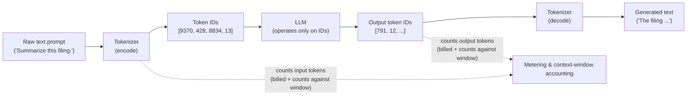

# Tokens & Tokenization

> An LLM never actually "sees" your sentence. It sees a stream of numbered chunks called tokens — and those chunks are the unit of both what the model can read and what Databricks charges you for.

## Learning Objectives

By the end of this lesson you will be able to:

- Define a **token** precisely and explain why it is the atomic unit an LLM reads and generates.
- Explain why models tokenize into **sub-word** pieces instead of whole words or single characters, and what problem that solves.
- Describe **subword tokenization (BPE)** at an intuitive level — enough to predict how a given string will tokenize.
- Walk through the full pipeline: raw text → tokens → token IDs → model → token IDs → text.
- Estimate token counts with the "**~0.75 words per token**" rule of thumb, and predict when English, code, and non-English text will cost more.
- Connect tokens to two hard limits you will hit in production: **billing** (Foundation Model APIs bill per token) and the **context window**.
- Write a Databricks SQL `ai_query` call and reason about why its cost scales with token count.

## Prerequisites

- You should already have the mental model from Part 0: [What Is Generative AI?](/docs/orientation/what-is-generative-ai) and [The Databricks AI Platform Map](/docs/orientation/databricks-ai-platform-map).
- Comfort with SQL, Spark, and the idea of a **billing unit** (you already reason about DBUs). No AI knowledge is assumed beyond Part 0.

## Estimated Reading Time

~20 minutes.

## Business Motivation

Meet **Northwind Trust** again, the fictional mid-sized asset manager from Part 0. Their platform team has just shipped a proof-of-concept: an internal tool that summarizes earnings-call transcripts. It works beautifully in the demo. Then the first monthly bill arrives, and the finance partner asks a question the team cannot answer:

*"Why did summarizing 400 transcripts cost 6x what summarizing 400 client emails cost, when there were the same number of documents?"*

The team is blindsided because they are thinking like Data Engineers: **cost per row, cost per file, cost per job**. But a Foundation Model API does not bill per document. It bills per **token**. A dense 40-page earnings transcript contains vastly more tokens than a three-line client email, so the *same count of documents* can differ in cost by an order of magnitude.

Worse, a few of the longest transcripts came back with summaries that were mysteriously cut off mid-sentence. Nobody wrote code to truncate anything. What happened? The input plus the requested output exceeded the model's **context window** — a hard ceiling measured, once again, in tokens.

Every recurring question in an LLM budget review — *Why did this cost so much? Why did the output get chopped? Why is this prompt slow?* — traces back to a single unit of account. If you understand tokens, you understand the meter. This is the first foundation, and everything downstream (embeddings, context windows, RAG, cost governance) is built on it.

## Intuition

Here is the fastest way to internalize tokens if you come from Data Engineering.

You already know that a large text file is not processed as one indivisible blob. Before Spark does anything useful, it splits input into **records** — the granular units that get distributed, counted, and processed. You reason about job cost and parallelism in terms of *how many records* and *how big they are*, not "one file."

A token is the LLM's record. **Tokenization is the split step**: it takes raw text and chops it into the granular units the model actually processes, one at a time. Just as you would never say "this Spark job processed one file" when you mean it processed 40 million records, you should never think "the model summarized one document" — it read and produced *thousands of tokens*.

And here is the part that makes this lesson matter more than a vocabulary definition: **the token is also the billing unit**. Foundation Model APIs charge per token, input and output combined. That is the LLM's DBU. When you learned to write efficient Spark, you developed an instinct for how many records you were shuffling and why it cost what it cost. This lesson is where you start developing the same instinct for tokens.

One more analogy to hold onto: a token is roughly **three-quarters of an English word** — about four characters on average. So "tokenization" is not one token; it is a few. Keep that fraction in your pocket; we will make it precise shortly.

## Theory

### What a token is

A **token** is a chunk of text — usually a **sub-word** piece — that the model treats as a single indivisible unit. The complete set of tokens a model knows is its **vocabulary**, typically somewhere in the range of 30,000 to 200,000 distinct tokens depending on the model. Every token in the vocabulary has a unique integer ID. The model does not operate on letters or words; it operates on these IDs.

Concretely, a token can be:

- A whole common word: `" the"`, `" trust"` (note the leading space — whitespace is usually part of the token).
- A word fragment: `token` + `ization`.
- A single character or punctuation mark: `.`, `(`, `\n`.
- A byte, for characters the model has never seen as a whole.

### Why sub-words? The vocabulary trade-off

Why not just make every whole word a token? And why not go the other way and make every single character a token? The answer is a trade-off, and sub-words are the sweet spot between two bad extremes.

**Extreme 1 — one token per word.** The vocabulary would have to contain every word in every language, plus every proper noun, every typo, every product SKU, every `snake_case` variable name. That is effectively infinite. And the moment the model meets a word not in its vocabulary — a new company name, a rare medical term — it has no way to represent it at all. This is the classic **out-of-vocabulary (OOV)** problem. Without a fix, the model is blind to anything it did not memorize in advance.

**Extreme 2 — one token per character.** The vocabulary is tiny (a few hundred symbols) and nothing is ever OOV. But now every sequence is enormously long — a 1,000-word document becomes ~6,000 characters, i.e. ~6,000 tokens — and the model has to learn meaning from scratch out of raw letters, one at a time. It is slow and wasteful, like forcing Spark to process one byte per record.

**Sub-word tokenization** splits the difference. Frequent words get their own single token (efficient). Rare or unseen words get broken into smaller known pieces (never OOV). "Tokenization" might be `token` + `ization`; an unknown surname like "Vandelay" might be `Van` + `del` + `ay`. The model can always represent *any* input using pieces it already knows, while keeping common text compact.

### A light intro to BPE

The most common recipe for choosing those sub-word pieces is **Byte-Pair Encoding (BPE)**. You do not need the math, just the intuition — and it maps neatly onto something you already understand: building a compression dictionary.

BPE learns its vocabulary once, offline, before the model is ever used, by looking at a huge pile of text:

1. Start with the most granular units possible — individual characters (or bytes).
2. Count which **adjacent pair** occurs most often across the whole corpus.
3. **Merge** that pair into a single new token and add it to the vocabulary.
4. Repeat thousands of times.

Because common pairs like `t`+`h` → `th`, then `th`+`e` → `the` get merged early, frequent words bubble up into whole tokens, while rare words stay as smaller fragments. It is exactly the logic of a dictionary-based compressor: give short codes to frequent patterns, spell out the rare ones. The output of this offline process is a fixed vocabulary and a fixed set of merge rules — the **tokenizer** — that ships with the model and behaves deterministically forever after.

The Data Engineering parallel: BPE building its merge table is like a one-time job that profiles your data and builds an optimized dictionary encoding for a column. Once built, encoding new values is a fast, deterministic lookup.

## Deep Dive

### The 0.75 rule and what inflates it

The single most useful number in this lesson: for typical English prose,

> **1 token ≈ 0.75 words ≈ 4 characters.**

Equivalently, **100 tokens ≈ 75 words**, and **1,000 words ≈ 1,333 tokens**. This is a rule of thumb for estimation, not an exact law — the real count always comes from the actual tokenizer. But it is close enough to size a budget or sanity-check a prompt.

What pushes the real count *above* the estimate:

- **Punctuation and symbols.** `$1,234.56` is not one token; the digits, comma, period, and dollar sign fragment into several.
- **Whitespace and formatting.** Newlines, tabs, and repeated spaces are tokens too. Heavily formatted markdown or indented text costs more than the same words as flat prose.
- **Casing and spacing quirks.** `"Trust"`, `" Trust"` (leading space), and `"TRUST"` can be *different* tokens. Odd capitalization can split a word that would otherwise be a single token.
- **Non-English text.** Languages the tokenizer saw less of during training fragment far more. The same sentence in, say, Japanese or Hindi can take 2–4x the tokens of its English translation — sometimes down to one token per character.
- **Code.** Source code is punctuation-dense and full of `camelCase`/`snake_case` identifiers, so it tokenizes into *many* more tokens than an equivalent word count of prose. A JSON blob or a stack trace is expensive.

For Northwind Trust, this immediately explains the mystery bill: dense financial transcripts with tables, numbers, and formatting tokenize far more heavily per page than short plain-text emails.

### Tokens are the unit of TWO limits

This is the payoff of the whole lesson. Tokens are simultaneously:

**1. The billing unit.** Databricks Foundation Model APIs bill per token — **input tokens plus output tokens**. There is no per-request or per-document price; there is a price per thousand tokens (and pay-per-token endpoints publish it in exactly those terms). Cutting your token count *is* cutting your bill, directly and linearly. This is precisely the mental model you use for DBUs: the resource meter runs on a unit, and efficient design means moving fewer units.

**2. The context-window limit.** Every model has a maximum number of tokens it can consider at once — its **context window** (e.g., 8K, 128K, or more). This budget must hold *everything*: your system prompt, the user's input, any retrieved documents, the conversation history, **and** the space reserved for the model's answer. If input + requested output exceeds the window, something gets dropped or the response is cut short. That is exactly why Northwind's longest transcripts produced truncated summaries — no code truncated them; the token ceiling did. We devote a whole later lesson to the context window; for now, just hold the fact that it is measured in the same tokens you are billed for.

DE analogy for the window: think of a fixed-size **staging buffer** with a hard byte capacity. Everything you want to process in one pass must fit. Overflow it and you either spill, drop rows, or the job refuses to proceed. The context window is that buffer, sized in tokens.

## Architecture

Where does tokenization actually sit in the request path? It brackets the model on both ends. The tokenizer is a deterministic pre/post-processing stage; the neural network in the middle only ever handles integer IDs.



Reading the diagram: your text hits the **tokenizer's encode step**, which turns it into a list of integer token IDs. Those IDs — never the letters — flow into the **LLM**. The model generates *one token ID at a time*, and the **decode step** turns the resulting IDs back into human-readable text. Crucially, both the input IDs and the output IDs are counted (the dashed lines) for two purposes at once: your **bill** and your **context-window budget**. The model core is blind to spelling; it lives entirely in the world of numbered vocabulary entries.

## Internal Working

Let's zoom into the tokenizer itself, because "encode" hides a few real steps.

1. **Normalization / pre-tokenization.** The raw string is lightly split on boundaries (often keeping leading spaces attached to the following word). This is why `" Trust"` with its space is one candidate chunk rather than `"Trust"`.
2. **Apply merge rules.** Starting from characters/bytes, the tokenizer greedily applies the learned BPE merges — the fixed dictionary shipped with the model — collapsing frequent pairs upward until no more merges apply. Common words collapse to a single token; rare words settle as a handful of fragments.
3. **Map to IDs.** Each resulting sub-word string is looked up in the vocabulary table and replaced with its integer ID. The output is a plain list of integers, e.g. `[9370, 428, 8834, 13]`.
4. **(Model runs.)** The network consumes those IDs and emits new IDs, sampled one at a time.
5. **Decode.** Each output ID is mapped back to its sub-word string via the same table, and the strings are concatenated (spaces reattach) to reconstruct text.

Two properties matter for production. First, the process is **deterministic**: the same string with the same tokenizer always yields the same tokens and IDs. (Any randomness in an LLM lives in the model's *sampling* of the next token, never in tokenization.) Second, encode and decode are **lossless round-trips** — decode(encode(text)) gives back your original text — because byte-level fallbacks guarantee every possible input is representable. That is the OOV problem solved: there is literally nothing the tokenizer cannot encode.

## Step-by-Step Walkthrough

Let's tokenize one sentence by hand, conceptually. Take:

`Northwind Trust's Q3 filing.`

A BPE tokenizer might produce these tokens (▁ marks a leading space; illustrative IDs):

```
Token:   "North" | "wind" | " Trust" | "'s" | " Q" | "3" | " filing" | "."
ID:        11997 |  7315  |   17061  | 596  | 1229 |  18 |    9985   | 13
```

Walking through it:

- **"Northwind"** is not a common English word, so it splits into two known fragments, `North` + `wind`. This is subword handling in action — a rare compound is represented by pieces the model already knows, no OOV.
- **" Trust"** is common enough (and preceded by a space) to be a single token, space included.
- **"'s"** — the apostrophe-s becomes its own token. Punctuation carves off pieces.
- **" Q"** and **"3"** split apart; letters and digits rarely share a token. Numbers, in particular, fragment aggressively.
- **" filing"** is a single common word token.
- **"."** the period is its own token.

So an eight-*word*-ish looking phrase (really four words plus punctuation and a number) becomes **eight tokens**. Notice how the "0.75 words per token" rule would have naively estimated ~5 tokens from 4 words — and the real count is higher because of the proper noun, the number, and the punctuation. That gap is exactly the effect that surprised Northwind's finance team, scaled up to 40-page documents.

Now imagine the reverse: the model generates IDs `[9985, 13]` → decode → `" filing."`. Same table, run backwards.

## Hands-on Examples

You do not need a GPU or a model to build token intuition. You need a **tokenizer**, which is a small, fast, deterministic library. Two quick exercises you can run on any Databricks notebook or your laptop:

**Exercise A — Feel the fraction.** Take three texts of the *same word count* (~200 words): a plain English paragraph, a snippet of Python, and a paragraph in a non-English language. Tokenize all three and compare counts. You will see prose land near the 0.75 rule, code run well above it, and non-English higher still. This is the single most convincing way to make the cost model click.

**Exercise B — Watch a rare word shatter.** Tokenize `"tokenization"`, then `"antidisestablishmentarianism"`, then a made-up string like `"Northwind"`. Print the individual pieces. Watching a long or invented word break into fragments is the "aha" moment for BPE.

The code below does both, using `tiktoken` — a tiny, instant tokenizer that is perfect for illustration. Treat its numbers as representative, not as the ground truth for the specific Databricks-hosted model you will bill against: the **concept** transfers exactly, the **counts** are approximate across model families.

## Code Examples

### 1. Conceptual tokenization in Python (for illustration)

```python
# Illustrative only. Install a tokenizer library in your notebook:
#   %pip install tiktoken
#
# The token BOUNDARIES and IDs shown here belong to this particular
# tokenizer family. A different model may split text slightly differently.
# What transfers exactly is the CONCEPT: text -> tokens -> IDs -> text,
# and that count, not document count, is what you pay for.

import tiktoken

# A general-purpose BPE encoding, used here purely to demonstrate mechanics.
enc = tiktoken.get_encoding("cl100k_base")

def inspect(text: str) -> None:
    """Show a string's tokens, their IDs, and a lossless round-trip."""
    ids = enc.encode(text)                       # text  -> token IDs
    pieces = [enc.decode([i]) for i in ids]      # each ID -> its sub-word string
    print(f"\nText      : {text!r}")
    print(f"Token count: {len(ids)}")
    print(f"Tokens     : {pieces}")
    print(f"IDs        : {ids}")
    # Prove encode/decode is a lossless round-trip:
    assert enc.decode(ids) == text

# --- A: the 0.75 rule and what inflates it ---
inspect("Northwind Trust's Q3 filing.")          # proper noun + number + punctuation
inspect("The quick brown fox jumps over the lazy dog.")  # clean prose ~ 0.75 rule

# --- B: watch rare/long words shatter into sub-words ---
inspect("tokenization")
inspect("antidisestablishmentarianism")
inspect("Northwind")                             # invented compound -> fragments

# --- Estimate cost from token count (pattern, not a live price) ---
prompt = "Summarize the following 10-K risk factors in three bullet points: ..."
n_input = len(enc.encode(prompt))
expected_output_tokens = 180                     # a short summary you asked for
price_per_1k = 0.0005                            # ILLUSTRATIVE $/1K tokens; use your endpoint's real rate
est_cost = (n_input + expected_output_tokens) / 1000 * price_per_1k
print(f"\nEstimated tokens billed: {n_input + expected_output_tokens}")
print(f"Estimated cost         : ${est_cost:.6f}")
```

Run it and three things become concrete: clean prose sits near the 0.75 rule, the proper-noun-and-number sentence runs higher, and long/invented words visibly fragment. The `assert` line demonstrates the lossless round-trip. The cost block shows the mechanic that matters most: **you sum input and output tokens, then multiply by a per-1K rate.** No document count appears anywhere.

### 2. Databricks SQL `ai_query` — and why cost scales with tokens

On Databricks you rarely call a tokenizer by hand in production; you call a model and it tokenizes for you. The most direct path is `ai_query`, which invokes a Foundation Model endpoint straight from SQL:

```sql
-- Summarize each earnings-call transcript with a single SQL function.
-- ai_query(endpoint_name, prompt) -> generated text.
SELECT
  transcript_id,
  ai_query(
    'databricks-meta-llama-3-3-70b-instruct',
    'Summarize the key risks in three concise bullet points:\n' || transcript_text
  ) AS risk_summary
FROM northwind.gold.earnings_transcripts
WHERE fiscal_quarter = '2026-Q3';
```

Here is the cost intuition, made explicit. For **each row**, the endpoint tokenizes your fixed instruction plus the *entire* `transcript_text`, feeds those input tokens to the model, and generates output tokens for the summary. Foundation Model APIs bill **input tokens + output tokens**. Therefore:

- A row whose `transcript_text` is a 40-page filing bills for *far* more input tokens than a row containing a three-line email — even though both are "one row." This is the whole answer to Northwind's mystery bill.
- Asking for "three concise bullet points" instead of "a detailed narrative" reduces **output** tokens, which cuts both cost and latency (the model literally generates fewer tokens, one at a time).
- Running this over a huge table multiplies token cost by row count. Filter first (`WHERE`), and prune the input text you actually need. Every token you *don't* send is money you *don't* spend — the exact instinct you already have about not shuffling columns you won't use.

A concise, well-scoped prompt is the LLM equivalent of column pruning and predicate pushdown: same answer, fewer units moved.

## Production Considerations

- **Budget in tokens, not documents.** Before shipping any `ai_query` job over a table, estimate: (avg input tokens + expected output tokens) × row count × price-per-1K. A 500-row batch of long PDFs can dwarf a 50,000-row batch of short strings.
- **Measure the real distribution.** Tokenize a sample of your actual data to get the true tokens-per-row distribution. The *tail* (your longest documents) drives both cost spikes and context-window overflows.
- **Set `max_tokens` deliberately.** Capping the output length caps the most variable part of your bill and your latency, and prevents runaway generations.
- **Watch the window on long inputs.** For big documents, confirm input + reserved output fits the endpoint's context window, or plan to chunk (a technique you'll meet in the RAG lessons). Truncation is silent; design for it.
- **Cache and dedupe.** Identical prompts produce identical billed tokens every time. Deduplicating inputs and caching results is direct savings — the same idea as not recomputing an unchanged partition.

## Performance Considerations

- **Latency scales with output tokens.** Because generation is sequential — one token at a time — a 1,000-token answer takes roughly 5x longer to produce than a 200-token answer. If a response feels slow, the first lever is *ask for less output*.
- **Input tokens cost time too**, but they are processed together up front (the "prefill"), so a long prompt mainly adds a fixed startup delay; long *outputs* dominate end-to-end latency. Concision is therefore both a cost tactic and a latency tactic — tight prompts and bounded outputs win on both axes.
- **Batch thoughtfully.** When running `ai_query` across many rows, throughput is governed by total tokens in flight, not row count — the same total-work-not-row-count reasoning you apply to Spark stages.

## Security Considerations

- **Token counts can leak information.** The size of a prompt or response is observable metadata. In sensitive settings, be aware that response length alone can hint at content.
- **PII travels as tokens.** Whatever text you tokenize and send is processed by the model endpoint. Redact or mask sensitive fields *before* they enter the prompt; the tokenizer will faithfully encode a Social Security number just as it encodes anything else. Governance still applies — route through Unity Catalog-governed data and approved endpoints.
- **Prompt-length limits as a guardrail.** Enforcing a maximum input-token size defends against both runaway cost and a class of oversized/abusive inputs. Treat the token budget as an input-validation boundary, the way you would cap the size of an uploaded file.
- **Non-English and unusual encodings inflate tokens.** An attacker or a messy upstream source can drive up cost with pathological input (huge whitespace, exotic Unicode). Validate and normalize input text before metering it.

## Common Mistakes

- **Estimating cost by document/row count.** The single most common error. Two jobs with equal row counts can differ 10x in cost. Always reason in tokens.
- **Forgetting output tokens.** People size the prompt and ignore that the *answer* is billed too — and is the slowest, most variable part. Always budget input **plus** output.
- **Assuming 1 token = 1 word.** It's ~0.75 words for clean English, and much worse for code, numbers, punctuation-heavy text, and non-English.
- **Ignoring whitespace and formatting.** Pretty-printed JSON, deep indentation, and repeated newlines all burn tokens for zero semantic gain.
- **Trusting one tokenizer's counts across models.** Counts from `tiktoken` are illustrative; the model you actually bill against may tokenize differently. Estimate with the right tokenizer for the endpoint.
- **Blaming the model for truncated output.** A cut-off answer is almost always a context-window or `max_tokens` limit — a token-accounting problem, not a model bug.

## Best Practices

- **Adopt the 0.75 rule for quick sizing, verify with a real tokenizer for anything that ships.** Estimate fast, confirm before you commit budget.
- **Profile the token distribution of your data**, and pay special attention to the long tail.
- **Prune the input.** Send only the text the task needs; strip boilerplate, headers, and formatting you don't require. It's column pruning for prompts.
- **Bound the output** with an explicit `max_tokens` and by asking for concise formats ("three bullet points," "one sentence").
- **Filter before you infer.** Use SQL `WHERE` clauses so you only pay to process rows that matter.
- **Track tokens as a first-class metric** in your pipelines — log input/output tokens per call the way you log rows processed and DBUs consumed.

## Interview Questions

**1. What is a token, and why don't LLMs just use whole words or single characters?**
A token is a sub-word chunk of text and the atomic unit an LLM reads and generates; the model works on integer token IDs, not letters. Whole-word vocabularies would be effectively infinite and still fail on unseen words (the OOV problem); single-character tokens make sequences painfully long and inefficient. Sub-word tokenization (e.g., BPE) is the sweet spot: frequent words become single tokens (efficient), rare/unseen words break into known fragments (never OOV).

**2. Roughly how many tokens is 1,000 words of English, and what makes the real count higher?**
About 1,333 tokens (using ~0.75 words per token, or ~4 characters per token). The real count rises above the estimate with punctuation, whitespace/formatting, unusual casing, numbers, code, and especially non-English text — all of which fragment into more tokens.

**3. Databricks Foundation Model APIs bill per token. Two batch jobs process the same number of rows but one costs 10x more. How is that possible?**
Billing is per token (input + output), not per row or per document. The expensive job's rows contain far more text — long documents, dense formatting, numbers, code, or non-English — producing many more input tokens, and possibly longer generated outputs. Row count is irrelevant to token cost.

**4. A summarization endpoint returns answers cut off mid-sentence for your longest inputs, with no truncation code anywhere. What's the likely cause and fix?**
The input tokens plus the space reserved for output exceeded the model's context window (or `max_tokens` was set too low). The window is a fixed token budget shared by prompt and answer. Fixes: reduce/chunk the input, lower input token count, raise `max_tokens` if the window allows, or use a larger-context endpoint.

**5. Give two independent reasons that a concise prompt and a bounded, concise output are good engineering — not just cost-cutting.**
(1) Cost: fewer tokens billed, linearly. (2) Latency: output is generated one token at a time, so shorter answers return faster; a tight prompt also reduces prefill time. Concision wins on both cost and speed simultaneously, and often improves answer quality by reducing room to wander.

## Quiz

**Q1.** Your prompt is 900 English words and you expect a ~300-word answer. Roughly how many tokens will you be billed for?

<details>

About 1,600 tokens. Using ~0.75 words per token: input ≈ 900 / 0.75 = 1,200 tokens, output ≈ 300 / 0.75 = 400 tokens, and billing is input **plus** output ≈ 1,600. (The real number comes from the actual tokenizer, but this is the right way to estimate.)

</details>

**Q2.** True or false: because an LLM's output can be random, tokenization is also random.

<details>

False. Tokenization is fully **deterministic** — the same text with the same tokenizer always yields the same tokens and IDs, and encode/decode is a lossless round-trip. Any randomness lives in how the model *samples* the next token during generation, never in the tokenizer.

</details>

**Q3.** You need to summarize 10,000 short client emails and 500 lengthy regulatory filings. Which batch will likely cost more on a per-token-billed endpoint, and why?

<details>

Very likely the **500 filings**, despite being 20x fewer documents. Cost tracks total tokens, not document count. Each filing carries far more input tokens (and often longer summaries) than a short email, so the filings' total token volume can easily exceed that of the emails.

</details>

**Q4.** Which of these will tokenize into the *most* tokens for the same visible length: (a) plain English prose, (b) a Python code snippet, (c) a paragraph in a low-resource non-English language?

<details>

Generally (c), then (b), then (a). Non-English text the tokenizer saw little of fragments the most (sometimes near one token per character); code is punctuation- and identifier-dense so it runs well above the 0.75 rule; clean English prose is the most token-efficient.

</details>

## Key Takeaways

- A token is a sub-word chunk; the model reads and writes integer token IDs, not words or letters.
- Sub-word tokenization (BPE) balances vocabulary size against sequence length and eliminates the OOV problem.
- Rule of thumb: **1 token ≈ 0.75 words ≈ 4 chars**; code, numbers, punctuation, and non-English inflate it.
- Tokenization is deterministic and lossless; only the model's next-token *sampling* is random.
- Tokens are the **billing unit** (input + output) — think DBUs — and the **context-window** unit (a shared, fixed budget).
- Estimate cost and window usage in tokens, not documents; prune inputs and bound outputs to save cost *and* latency.

## Glossary

- **Token** — A sub-word chunk of text; the atomic unit an LLM reads and generates.
- **Tokenization** — The deterministic process of splitting text into tokens (and mapping them to IDs).
- **Token ID** — The unique integer that represents a token in the model's vocabulary.
- **Vocabulary** — The complete fixed set of tokens a model knows (often ~30K–200K entries).
- **Sub-word tokenization** — Representing text with word fragments so rare/unseen words are still expressible.
- **BPE (Byte-Pair Encoding)** — A common algorithm that builds a token vocabulary by repeatedly merging the most frequent adjacent pairs.
- **OOV (Out-Of-Vocabulary)** — A word a model cannot represent; sub-word tokenization solves this.
- **Context window** — The maximum number of tokens a model can consider at once, shared by input and output.
- **Foundation Model API** — Databricks-hosted model endpoints that are billed per token.
- **`ai_query`** — A Databricks SQL function that invokes a model endpoint and returns generated text.

## Further Reading

- Databricks — [Foundation Model APIs](https://docs.databricks.com/aws/en/machine-learning/foundation-model-apis/index.html)
- Databricks — [`ai_query` function](https://docs.databricks.com/aws/en/sql/language-manual/functions/ai_query.html)
- Databricks — [AI functions on Databricks](https://docs.databricks.com/aws/en/large-language-models/ai-functions.html)
- Databricks — [Foundation Model APIs pricing & limits](https://docs.databricks.com/aws/en/machine-learning/foundation-model-apis/prov-throughput-run-benchmark.html)

## Next Lesson

➡️ [Embeddings: Turning Text into Vectors](/docs/llm-foundations/embeddings)
