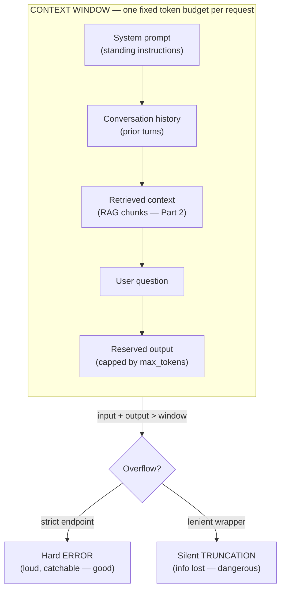

# The Context Window

> Every request you send an LLM is squeezed through one fixed-size buffer. Understand that buffer and you understand most of what makes AI systems slow, expensive, or quietly wrong.

## Learning Objectives

By the end of this lesson you will be able to:

- Define the **context window** precisely: the maximum number of tokens a model can consider in a single request, shared by input and output together.
- Explain **why** the window is bounded — the architectural and computational reasons it cannot simply be made infinite.
- Reason about the **shared token budget**: how a long prompt steals room from the answer, and why `max_tokens` must fit in what is left.
- Predict what happens when you **exceed** the window — hard errors versus silent truncation — and why silent truncation is dangerous inside a pipeline.
- Apply the three core **context-management strategies**: trimming/truncation, summarization/compression, and retrieval (fetch only what is relevant).
- Recognize the **"lost in the middle"** phenomenon and internalize that *more context is not always better* — it adds noise, cost, and latency.
- Connect all of this to Data Engineering intuition you already own: bounded staging buffers, executor memory, OOM, spill-to-disk, and predicate/column pruning.

## Prerequisites

- [Tokens & Tokenization](/docs/llm-foundations/tokens-and-tokenization) — this lesson is measured entirely in tokens, so you need to be comfortable with what a token is and how text maps to token counts.
- Comfort with SQL, Spark, and ETL/ELT pipelines (the audience assumption for this whole course).
- A working mental model of an LLM as a probabilistic next-token predictor (covered earlier in Part 1).

## Estimated Reading Time

~24 minutes.

## Business Motivation

Let me set the scene with a fictional company we will return to throughout this course.

**Northwind Trust** is a mid-sized asset-management firm. Their compliance team wants an internal assistant that reads a client's full account history — statements, advisor notes, support tickets, KYC documents — and answers questions like *"Has this client ever been flagged for a suitability concern?"*

The first prototype worked beautifully in a notebook with one small test client. Then they pointed it at a real client with fourteen years of history. Three things happened, all on the same afternoon:

1. Some requests **failed outright** with an error about exceeding the maximum context length.
2. Some requests **succeeded but gave subtly wrong answers** — the model confidently said "no suitability flags" when there was a flag buried in year seven.
3. The monthly inference bill for the pilot came in **6x higher** than the estimate.

Every one of those three failures traces back to a single concept: the **context window**. The requests that errored overflowed it. The wrong answers came from information that was silently dropped or buried where the model stopped paying attention. And the cost blowup came from stuffing enormous histories into every single request.

This is not an exotic edge case. It is *the* most common way that a demo-quality AI feature becomes a production incident. If you understand the context window deeply, you will design around all three failure modes before they ever reach a user. That is the entire point of this lesson.

## Intuition

Here is the one-sentence version, in language you already speak.

**The context window is a bounded staging buffer.** The model can only "see" what currently fits in that buffer for a single request. Anything you want it to reason about — instructions, conversation history, retrieved documents, the user's actual question — has to be loaded into that buffer *first*. And crucially, the model's *answer* is written into the same buffer as it is generated. Input and output share one fixed amount of space.

Think about how you already reason about a Spark executor. It has a fixed amount of memory. You can process datasets far larger than that memory, but not by loading them all at once — you partition, you prune columns, you push down predicates so you only ever hold the relevant slice in memory. When you get greedy and try to hold too much, you get an `OutOfMemoryError`, or the job spills to disk and crawls.

The context window behaves the same way, with one nasty difference we will keep coming back to: **when an LLM "runs out of memory," it does not always throw an error.** Sometimes it silently drops the overflow and answers anyway — like a Spark job that quietly ignored half your input and returned a result that *looks* complete. In data engineering, a job that silently drops rows is a P1 incident. With LLMs, that behavior is a default you have to actively design against.

Hold onto that image — a bounded buffer that can overflow either loudly (error) or silently (truncation) — because everything else in this lesson is a consequence of it.

## Theory

Let's define the concept carefully and build up the mechanics.

### What the context window *is*

The **context window** (also called the **context length**) is the maximum number of **tokens** a model can process in a single forward pass — a single request. It is the model's entire "field of view." The model has no memory of anything outside the current window. Between requests, unless *you* re-supply it, the model remembers nothing. (This is why "memory" in AI applications is something you *engineer*, not something the model has — a theme for later lessons and for AI Agents.)

Two facts do most of the work in this lesson:

**Fact 1 — It is measured in tokens, not characters or words.** A token is a sub-word chunk. As a rough rule of thumb for English, one token is about four characters, or roughly three-quarters of a word — but code, JSON, non-English text, and unusual formatting can be far denser. You must think in tokens, not in "pages," because the model does.

**Fact 2 — Input and output share the same budget.** This is the fact that trips up almost everyone. The window is not "how much you can send." It is "how much you can send *plus* how much the model can generate." They come out of the same pool.

If a model has a context window of, say, 128,000 tokens, and your prompt consumes 120,000 of them, the model has at most 8,000 tokens left to write its answer. Ask it for a 10,000-token report and you cannot get one — there is no room, no matter how you phrase the request.

### Why it is limited

Why not just make the window infinite? Because of how the underlying **attention mechanism** works.

Modern LLMs are built on the Transformer architecture. Its core operation, **self-attention**, lets every token "look at" every other token in the sequence to decide what matters. That all-pairs comparison is what gives these models their power — but it is also expensive. In the classic formulation, the compute and memory cost of attention grows with the **square** of the sequence length. Double the context and you roughly *quadruple* the attention cost.

You do not need to derive the math. You just need the shape of the curve: cost grows faster than linearly with context length. That is a hard architectural bound, baked into the model at training time. A model is trained with a specific maximum context length, and it genuinely cannot accept more than that — the positions beyond its trained length were never learned.

The DE parallel is exact: you cannot ask an executor to hold more than its configured memory just because your data is big. The limit is a property of the system you provisioned, not a suggestion. You design your job to live within it.

### The reserved-output problem

Because input and output share the budget, sending a request is really an act of *budgeting*:

```
context_window  =  input_tokens  +  output_tokens
```

You control `input_tokens` by what you put in the prompt. You cap `output_tokens` with a parameter, almost always called **`max_tokens`**, which tells the model the most tokens it is allowed to generate. The rule you must never forget:

```
max_tokens  must be  <=  context_window - input_tokens
```

If you set `max_tokens` too high, or your input is too long, you have overcommitted the buffer. What happens next depends on the model and endpoint — and that is exactly what the next section is about.

## Deep Dive

### What happens when you exceed the window

There are two failure modes, and the difference between them is the single most important operational fact in this lesson.

**Failure mode 1 — Hard error.** Many endpoints validate the request up front. If `input_tokens + max_tokens` exceeds the context window, the API rejects the request with an error (typically an HTTP 400-class error mentioning "context length" or "maximum tokens"). This is the *good* failure. It is loud, it happens immediately, and your pipeline can catch it, log it, and take a fallback path. Treat these errors as first-class citizens in your error handling.

**Failure mode 2 — Silent truncation.** Some systems, frameworks, or wrapper libraries "helpfully" chop your input down to fit instead of erroring. The request succeeds. You get a fluent, confident-looking answer. But the model never saw the part that got cut. In Northwind Trust's case, year seven of the client history — the year with the suitability flag — was in the middle of a document that got truncated to fit. The model answered "no flags found" and it was, from its point of view, telling the truth: it never saw the flag.

This is the LLM equivalent of a Spark job that silently drops rows past a memory limit and returns a partial aggregate labeled as complete. In a warehouse you would consider that a data-integrity bug of the highest severity. The same standard applies here. **Never rely on a component's silent-truncation behavior in production.** Measure your token usage yourself, decide explicitly what to keep, and fail loudly when you cannot fit what matters.

### The "budget bar" model

The clearest way to think about a single request is as a fixed-width bar that you fill with segments. Every real request is a stack of these:

- **System prompt** — the standing instructions ("You are a compliance assistant...").
- **Conversation history** — prior turns, in a chat or agent setting.
- **Retrieved context** — documents or chunks you fetched to ground the answer (this is RAG, covered in Part 2).
- **The user's question** — usually small.
- **Reserved output** — the space you *hold back* for the answer via `max_tokens`.

Here is the bar when everything fits:

```
|<------------------------ CONTEXT WINDOW (e.g., 128k tokens) ------------------------>|
| SYSTEM | CONVERSATION HISTORY | RETRIEVED CONTEXT | QUESTION | ///// RESERVED OUTPUT ////// |
   1.5k          8k                    40k              0.2k              8k                    ~66k free
```

The free space at the end is healthy headroom. Now watch what happens when someone naively stuffs in a client's entire fourteen-year history without pruning:

```
|<------------------------ CONTEXT WINDOW (e.g., 128k tokens) ------------------------>|
| SYSTEM | CONVERSATION HISTORY | ================ RETRIEVED CONTEXT (WAY TOO BIG) ================ |?|
   1.5k          8k                                    190k                                       OVERFLOW
                                                                             ^-- no room left for output
```

The retrieved context alone exceeds the window. There is no room for the question, let alone the reserved output. This request will either error (good) or be silently truncated (bad) — and if it truncates, whatever fell off the right edge is simply gone.

We will render this same idea as a diagram in the [Architecture](#architecture) section.

### "Lost in the middle": fitting is not the same as using

Here is the subtlety that separates people who have merely read about context windows from people who have operated them.

**Just because information fits in the window does not mean the model uses it well.**

Empirically, LLMs attend most reliably to the **beginning** and the **end** of a long context, and least reliably to the **middle**. Give a model a huge block of retrieved text and place the one crucial fact right in the center, and it may effectively skim past it — even though the fact is unambiguously present in the input. This is widely known as the **"lost in the middle"** phenomenon.

The intuition: the model's attention is a finite resource spread across the whole sequence. In a very long context, any single middle token gets a thin slice of attention, and the strong positional signals at the edges tend to dominate. It is not that the model *can't* see the middle; it's that the middle competes with everything else and often loses.

The practical consequences are large and counter-intuitive:

- **More context can make answers worse, not better.** Padding a prompt with marginally relevant material dilutes the signal and can bury the fact that actually matters.
- **Placement matters.** If you know which piece of context is most important, put it near the start or the end, not buried in the middle of a giant blob.
- **Relevance beats volume.** Ten precisely-chosen chunks usually beat a hundred loosely-related ones — not just for cost and latency, but for *accuracy*.

For a data engineer, the analogy is column and predicate pruning. You do not `SELECT *` from a hundred-column table and scan every partition when you need three columns from one day's data. You prune, because scanning less is faster, cheaper, *and* less error-prone. Feeding an LLM is the same discipline: **select only the relevant tokens.** That single instinct — fetch only what you need — is precisely what motivates **retrieval / RAG**, which we cover in depth in Part 2.

### Cost and latency scale with context length

Every token in the window is processed. That has two direct consequences you will feel on the invoice and the clock.

- **Cost.** Foundation-model billing is per token — usually with separate input and output rates. A prompt twice as long costs roughly twice as much in input tokens on every single call. Northwind Trust's 6x bill was not a mystery: they were sending 6x more tokens per request than they needed to.
- **Latency.** More input tokens mean more compute before the first output token appears (higher "time to first token"), and attention's super-linear cost means very long contexts get disproportionately slower. Users feel this as a spinner.

So the context window is not just a correctness constraint. It is a **cost and latency dial**. Trimming context is one of the highest-leverage optimizations you have — it improves accuracy (less noise), cost, and speed simultaneously. It is rare to get all three at once; here you do.

## Architecture

Let's make the single-request anatomy concrete with a diagram, then explain every box.



**How to read this diagram.** The outer box is the whole context window — one fixed number of tokens for the entire request. Inside it, the five segments stack up and must *collectively* fit. The first four segments (system, history, retrieved context, question) are your **input**; the last segment (reserved output) is the space you hold back for the model to write its answer. If the sum of everything exceeds the window, you hit the `Overflow?` decision: a strict endpoint returns a hard error you can catch, while a lenient wrapper library may quietly truncate your input and answer anyway — losing whatever did not fit.

The design lesson is right there in the picture: **you own every segment on the left, so you own whether overflow ever happens.** Shrinking the history (trim/summarize) and shrinking the retrieved context (retrieve only relevant chunks) are the two levers that keep you comfortably inside the box.

## Internal Working

Behind the scenes, a request goes through a sequence of steps. Understanding it removes the mystery from every error message and every surprising answer.

1. **Serialization.** Your structured request (system message, list of turns, user message) is flattened into a single token sequence according to the model's chat template. Special tokens mark role boundaries. Note: these template and role-marker tokens *also* count against the window — small, but real.
2. **Tokenization.** That sequence is converted to token IDs by the model's tokenizer. This is where "3 pages of text" becomes a concrete integer count. (See the prerequisite lesson.)
3. **Length check.** The system compares `input_tokens + max_tokens` against the model's maximum context length. This is the moment where a strict endpoint decides to accept or reject — the fork in the [Architecture](#architecture) diagram.
4. **Prefill (processing the input).** The model runs attention over the entire input in one pass, building an internal representation. This is the compute that scales super-linearly with input length — the main driver of time-to-first-token.
5. **Decoding (generating the output).** The model produces output one token at a time. Each new token is appended and becomes part of the context for producing the next one. Generation stops when the model emits an end-of-sequence token *or* when it hits `max_tokens` — whichever comes first.
6. **Truncation risk.** If output generation would push the running total past the window, generation is cut off. A response cut off this way is often flagged with a "length" finish reason. Watch for it: a "length" finish means the answer is *incomplete*, not wrong-but-done.

That last point deserves emphasis. There are two different "ran out of room" events: input overflow (checked at step 3) and output overflow (hit at step 5, surfacing as a `length` finish reason). A production pipeline should inspect the finish reason on every response and treat `length` as "the model was cut off mid-thought," not as a normal completion.

## Step-by-Step Walkthrough

Let's walk one realistic Northwind Trust request through the budget, in numbers, so the arithmetic becomes second nature. Assume a model with a 128,000-token window.

**Goal:** answer *"Has this client ever been flagged for a suitability concern?"* grounded in the client's history, and return an answer of up to ~1,500 tokens.

1. **Start with the total budget.** Window = 128,000 tokens. That is everything — input and output combined.
2. **Reserve the output first.** We want up to ~1,500 output tokens, and we add a safety margin, reserving **2,000** tokens. Do this *before* deciding how much input to include; the answer is the point of the whole exercise. Remaining for input: `128,000 - 2,000 = 126,000`.
3. **Account for fixed input segments.** System prompt ≈ 1,500 tokens. Chat template/role markers ≈ 200 tokens. The question itself ≈ 40 tokens. Subtotal: ~1,740. Remaining for retrieved context: `126,000 - 1,740 ≈ 124,260`.
4. **Confront reality: the raw history is far bigger.** The client's full history tokenizes to ~600,000 tokens — almost **5x** the entire window. You physically cannot include it all. This is the moment the design decision gets forced on you.
5. **Choose a context strategy.** You will *not* dump the history in. Instead you retrieve only the chunks relevant to "suitability" — say 12 chunks at ~600 tokens each = ~7,200 tokens. That fits comfortably inside the ~124,260 available, with enormous headroom.
6. **Re-check the budget.** Input = 1,500 + 200 + 40 + 7,200 = ~8,940 tokens. Output reserve = 2,000. Total = ~10,940 of 128,000. You are using under 9% of the window — cheaper, faster, and *more accurate* than stuffing, because the model isn't hunting through 120k tokens of noise.
7. **Mind placement.** Put the most relevant chunk (or a short "here is what to focus on" summary) near the top or bottom of the retrieved block, not buried in the middle — a direct application of "lost in the middle."
8. **Send, then inspect.** After the response returns, check the finish reason. If it is `length`, the 2,000-token reserve was too small for the answer; raise it (you have room) and retry. If it is `stop`, the model finished naturally.

Notice what just happened: the naive approach (dump everything) is *impossible* here — the data is 5x the window. The engineered approach (retrieve the relevant slice) is not just better, it is the *only* way the feature can exist. That is why retrieval is not an optimization you bolt on later; for real corpora it is the foundation. Part 2 is devoted to it.

## Hands-on Examples

Below are two runnable-ish sketches. They use a tokenizer library purely to *count* tokens; the counts are illustrative, and in production you should count with the tokenizer that matches your specific Databricks foundation-model endpoint (or use the endpoint's own usage metadata on responses).

A note on counting tokens accurately: the most reliable token count is the one the model itself reports. Foundation-model responses on Databricks include usage information (input and output token counts). Use client-side estimation for *budgeting before you send*, and use the returned usage for *accounting after*.

## Code Examples

### Example 1 — Estimate token usage and compute the remaining output budget

This is the guardrail every production caller should have: before sending, verify that your input plus your requested output actually fits, and fail loudly (never silently) if it does not.

```python
# pip install tiktoken   # illustrative tokenizer for COUNTING tokens client-side.
# In production, count with the tokenizer matching your Databricks FM endpoint,
# and reconcile against the token usage the endpoint returns on each response.

from dataclasses import dataclass

import tiktoken

# An illustrative encoding. The exact tokenizer differs per model;
# what matters here is the *budgeting logic*, not this specific encoder.
_ENC = tiktoken.get_encoding("cl100k_base")


def count_tokens(text: str) -> int:
    """Return the number of tokens for a piece of text (illustrative)."""
    return len(_ENC.encode(text))


@dataclass
class WindowBudget:
    context_window: int          # total tokens the model supports (input + output)
    template_overhead: int = 200  # role markers / chat-template tokens, approx


def remaining_output_budget(
    budget: WindowBudget,
    system_prompt: str,
    history: str,
    retrieved_context: str,
    question: str,
    safety_margin: int = 256,
) -> int:
    """
    Compute how many tokens are left for the model's OUTPUT after accounting
    for every INPUT segment. Returns a number you can safely pass as max_tokens.

    The core identity:  output_budget = context_window - input_tokens
    """
    input_tokens = (
        count_tokens(system_prompt)
        + count_tokens(history)
        + count_tokens(retrieved_context)
        + count_tokens(question)
        + budget.template_overhead
    )

    # Reserve a safety margin so we never sit exactly on the edge of the window.
    output_budget = budget.context_window - input_tokens - safety_margin

    if output_budget <= 0:
        # FAIL LOUDLY. This is the single most important line in the function:
        # we refuse to send a request that cannot possibly fit, instead of
        # letting some downstream wrapper silently truncate our input.
        raise ValueError(
            f"Input ({input_tokens} tokens) leaves no room for output within a "
            f"{budget.context_window}-token window. Trim, summarize, or retrieve "
            f"fewer chunks before sending."
        )

    return output_budget


# --- Usage: a Northwind Trust compliance request -------------------------------

budget = WindowBudget(context_window=128_000)

system_prompt = "You are a compliance assistant for Northwind Trust. Answer only from the provided context. If the context does not contain the answer, say so."
history = ""  # single-shot request, no prior conversation
retrieved_context = "... 12 retrieved chunks about suitability, ~7,200 tokens ..."
question = "Has this client ever been flagged for a suitability concern?"

max_tokens = remaining_output_budget(
    budget,
    system_prompt=system_prompt,
    history=history,
    retrieved_context=retrieved_context,
    question=question,
)

print(f"Safe max_tokens for the answer: {max_tokens}")
# You would then pass max_tokens to your foundation-model call
# (covered in the next lesson, "Calling Foundation Models on Databricks").
```

The lesson embedded in the code is the `raise`: a correct client *refuses* to send an impossible request rather than trusting some layer below it to "handle" the overflow gracefully. Loud failure is a feature.

### Example 2 — Chunk a large document into token-bounded pieces (a RAG teaser)

When a document is far larger than the window, you cannot send it whole. You split it into **chunks** small enough that several relevant ones fit comfortably alongside everything else. This is the raw material for retrieval, which you will build fully in Part 2. Note the **overlap** between chunks: it prevents a fact from being sliced in half at a boundary and lost.

```python
import tiktoken

_ENC = tiktoken.get_encoding("cl100k_base")


def chunk_by_tokens(
    text: str,
    max_tokens_per_chunk: int = 600,
    overlap_tokens: int = 80,
) -> list[str]:
    """
    Split `text` into chunks of at most `max_tokens_per_chunk` tokens, with
    `overlap_tokens` of overlap between consecutive chunks.

    Why chunk at all?
      - A single document may be many times larger than the context window.
      - Retrieval works best on small, focused units: you fetch only the chunks
        relevant to the question (predicate/column pruning for text).

    Why overlap?
      - A key sentence near a boundary might otherwise be split across two chunks
        and lose its meaning in both. Overlap keeps boundary context intact.
    """
    if overlap_tokens >= max_tokens_per_chunk:
        raise ValueError("overlap must be smaller than the chunk size")

    token_ids = _ENC.encode(text)
    chunks: list[str] = []

    start = 0
    stride = max_tokens_per_chunk - overlap_tokens  # how far we advance each step

    while start < len(token_ids):
        end = start + max_tokens_per_chunk
        window_ids = token_ids[start:end]
        chunks.append(_ENC.decode(window_ids))
        if end >= len(token_ids):
            break
        start += stride  # advance, leaving `overlap_tokens` of shared context

    return chunks


# --- Usage -------------------------------------------------------------------

long_document = "..."  # imagine a 40-page advisor-notes PDF, already extracted to text

chunks = chunk_by_tokens(long_document, max_tokens_per_chunk=600, overlap_tokens=80)

print(f"Split into {len(chunks)} token-bounded chunks.")
# In Part 2 you will embed these chunks, store them in a vector index, and
# retrieve only the few most relevant to each question — the essence of RAG.
```

Read these two examples together and you have the whole workflow in miniature: **chunk** a big corpus so it becomes retrievable, then **budget** each request so the retrieved slice plus the answer always fit the window.

## Production Considerations

- **Always reserve output space explicitly.** Compute `max_tokens` from `context_window - input_tokens - margin` (Example 1). Never guess, and never let it float.
- **Treat context-length errors as expected control flow.** Catch them, log the token breakdown, and take a defined fallback (summarize history, drop the least-relevant chunks, or return a graceful "input too large" message) rather than crashing the pipeline.
- **Never trust silent truncation.** Assume any wrapper might truncate, and prevent it by measuring tokens yourself before sending.
- **Inspect the finish reason on every response.** A `length` finish means the answer was cut off — retry with a larger reserve (if you have room) or a more focused prompt.
- **Log per-request token usage** (input and output) as first-class metrics. This is your equivalent of monitoring shuffle spill: it is how you catch cost and truncation regressions before users do.
- **Size the window to the job, not the maximum.** A larger context window is not free capacity to fill; it is a ceiling. Design to use a small, relevant fraction of it.

## Performance Considerations

- **Latency scales with input length.** Attention's super-linear cost means very long prompts have a disproportionately high time-to-first-token. Trimming input is one of the most effective latency wins available.
- **Fewer, more relevant tokens is faster *and* more accurate.** Because of "lost in the middle," a lean prompt often beats a bloated one on quality too — a rare win-win-win across latency, cost, and correctness.
- **Batch and cache where possible.** Repeated identical prefixes (a large shared system prompt) may be eligible for prompt caching on some endpoints, cutting repeat prefill cost. Confirm support for your specific endpoint before relying on it.
- **Measure before optimizing.** Log the token composition of real requests. Teams routinely discover that 80% of their tokens come from history or context they could safely prune.

## Security Considerations

- **Every token in the window is data the model will act on.** If you place untrusted content (a user-uploaded document, a scraped web page) into the context, you have opened a **prompt-injection** surface: hidden instructions inside that content may hijack the model's behavior. Keep untrusted context clearly separated from trusted instructions, and never let retrieved text silently override your system prompt. (Injection and mitigations get full treatment later in the course.)
- **Mind data governance inside the window.** Whatever you load into context is sent to the model endpoint. Do not place data a user is not entitled to see into a context that will produce output for them — the window is not an access-control boundary. Apply Unity Catalog governance and row/column filtering *before* text ever reaches the prompt.
- **Truncation can create compliance risk.** If silent truncation drops the one disclosure or flag that mattered (Northwind Trust's year-seven flag), the system can produce an answer that is not just wrong but regulatorily dangerous. Fail-loud budgeting is a compliance control, not just an engineering nicety.

## Common Mistakes

- **Thinking the window is "how much I can send."** It is input *plus* output. Forgetting to reserve output space is the classic cause of truncated, mid-sentence answers.
- **Setting `max_tokens` blindly high.** If `input + max_tokens` exceeds the window, you get an error (best case) or truncation (worst case). Derive it, don't declare it.
- **Assuming a component errors on overflow.** Many silently truncate. Verify the behavior; do not inherit it as an assumption.
- **Equating "it fit" with "it was used."** "Lost in the middle" means a fact can be present and still ignored. Fitting is necessary, not sufficient.
- **Stuffing the window "just to be safe."** More context adds noise, cost, and latency, and can *lower* accuracy. Relevance beats volume.
- **Counting characters or words instead of tokens.** Budgets are in tokens; code, JSON, and non-English text are far denser than the "4 characters per token" rule of thumb suggests.
- **Ignoring the finish reason.** A `length` finish is an incomplete answer masquerading as a complete one.

## Best Practices

- **Budget in this order: reserve output first, then fit input.** The answer is the deliverable; protect its space before deciding how much context to include.
- **Retrieve, don't dump.** Fetch only the chunks relevant to the question. This is predicate/column pruning for text, and it is the single biggest lever on cost, latency, and accuracy. (Part 2: RAG.)
- **Summarize or trim long history.** In multi-turn settings, compress old turns into a running summary rather than carrying every message forever.
- **Place the most important context at the edges**, not the middle.
- **Chunk large documents with overlap** so facts survive boundaries.
- **Fail loudly.** Refuse impossible requests; never depend on silent truncation.
- **Instrument token usage** per request as a standing metric.

## Interview Questions

**1. What exactly is a model's context window, and what does it include?**
It is the maximum number of tokens a model can process in a single request, and it includes *both* the input (system prompt, history, retrieved context, question, plus chat-template overhead) *and* the generated output. Input and output share one fixed budget; they are not separate limits.

**2. Why can't we just make the context window arbitrarily large?**
Because the Transformer's self-attention mechanism has cost that grows super-linearly (roughly quadratically) with sequence length, in both compute and memory. The maximum length is also fixed at training time — positions beyond the trained length were never learned. So the limit is an architectural property, not a configuration you can raise at will.

**3. Your prompt is 120,000 tokens on a 128,000-token model and you set `max_tokens=10000`. What happens, and how should the client behave?**
The request cannot fit: `120,000 + 10,000 = 130,000 > 128,000`. A strict endpoint returns a context-length error; a lenient wrapper may silently truncate the input. A correct client computes the available output budget before sending (`128,000 - 120,000 - margin`), sees it is far below 10,000, and refuses to send — failing loudly and trimming the input rather than trusting downstream truncation.

**4. Explain "lost in the middle" and one design consequence.**
LLMs attend most reliably to the beginning and end of a long context and least reliably to the middle, so a fact buried in the center of a huge prompt may be effectively ignored even though it is present. A key consequence: retrieve fewer, more relevant chunks and place the most important content near the edges — more context is not automatically better and can even reduce accuracy.

**5. A data engineer says "we'll just send the whole document to be safe." What are the three concrete downsides?**
(1) **Cost** — you pay per input token on every call, so you pay for everything you send. (2) **Latency** — prefill cost scales super-linearly, so very long inputs slow time-to-first-token disproportionately. (3) **Accuracy** — irrelevant tokens add noise and, via "lost in the middle," can bury the fact that matters. Retrieval of the relevant slice wins on all three.

## Quiz

**Q1.** A model has a 32,000-token context window. Your input is 30,000 tokens. What is the maximum answer length you can request, ignoring safety margin?

<details>

At most 2,000 tokens (`32,000 - 30,000`). Input and output share the window, so the remaining space after input is all that is available for output. In practice you would reserve a small safety margin and get slightly less.

</details>

**Q2.** True or false: if your input fits within the context window, the model will reliably use every part of it.

<details>

False. Fitting is necessary but not sufficient. Because of the "lost in the middle" phenomenon, information in the center of a long context is often under-attended and can be effectively ignored, even though it is present.

</details>

**Q3.** Which is more dangerous in a production pipeline: a hard context-length error, or silent truncation of the input? Why?

<details>

Silent truncation. A hard error is loud and catchable — the pipeline can log it and take a fallback. Silent truncation drops information without warning and returns a confident, complete-looking answer based on incomplete input, which can be subtly and dangerously wrong (Northwind Trust's missed suitability flag). It is the LLM equivalent of a job that silently drops rows.

</details>

**Q4.** Name the three main context-management strategies and give the one-line intuition for each.

<details>

(1) **Trimming/truncation** — drop the least-important tokens (e.g., oldest history) to fit. (2) **Summarization/compression** — replace long history or documents with a shorter summary that preserves the essentials. (3) **Retrieval** — fetch only the chunks relevant to the current question (predicate/column pruning for text), which motivates RAG in Part 2.

</details>

## Key Takeaways

- The context window is a **token** budget shared by **input + output** — one buffer, not two.
- It is a **hard architectural bound**, driven by attention's super-linear cost; you design within it, you don't raise it.
- **`max_tokens` must fit** in `context_window - input_tokens`. Reserve output space first; derive it, don't guess.
- Overflow is either a **loud error** (good) or **silent truncation** (dangerous). Fail loudly; never trust truncation.
- **Fitting is not using**: "lost in the middle" means relevance and placement beat sheer volume.
- Context length is a **cost and latency dial** — trimming often improves accuracy, cost, and speed at once.
- The winning discipline is the DE one you already have: **prune to what's relevant** — which is the seed of retrieval / RAG (Part 2).

## Glossary

- **Context window / context length** — the maximum number of tokens a model can process in one request, shared by input and output.
- **Token** — the sub-word unit models read and write; the currency of the context window and of billing.
- **`max_tokens`** — the cap on how many tokens the model may generate; must fit within `context_window - input_tokens`.
- **Prefill** — the initial pass in which the model processes all input tokens; the main driver of time-to-first-token.
- **Decoding** — generating output one token at a time, each token appended to the context.
- **Finish reason** — why generation stopped; `stop` means natural completion, `length` means it was cut off by the token cap or window.
- **Truncation** — cutting input (or output) to fit the window; dangerous when it happens silently.
- **Lost in the middle** — the tendency of models to attend better to the start and end of long contexts than the middle.
- **Chunking** — splitting a large document into token-bounded pieces (often with overlap) so relevant parts can be retrieved.
- **Retrieval / RAG** — fetching only the context relevant to a question instead of sending everything; covered in Part 2.

## Further Reading

- [Databricks Foundation Model APIs](https://docs.databricks.com/aws/en/machine-learning/foundation-model-apis/) — the endpoints you will call, including how token limits and usage are surfaced.
- [Query foundation models](https://docs.databricks.com/aws/en/machine-learning/foundation-models/query-foundation-models) — request parameters including `max_tokens`, and how requests are structured.
- [Mosaic AI Vector Search](https://docs.databricks.com/aws/en/generative-ai/vector-search) — the retrieval building block that lets you send only relevant chunks (foundation for Part 2's RAG).

## Next Lesson

➡️ [Calling Foundation Models on Databricks](/docs/llm-foundations/calling-foundation-models) — now that you can budget a request, let's actually make one: authenticate, choose an endpoint, set `max_tokens` within the window, and read back the token usage the model reports.
