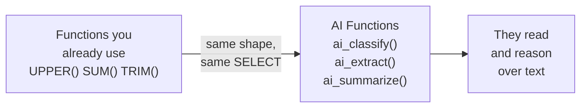
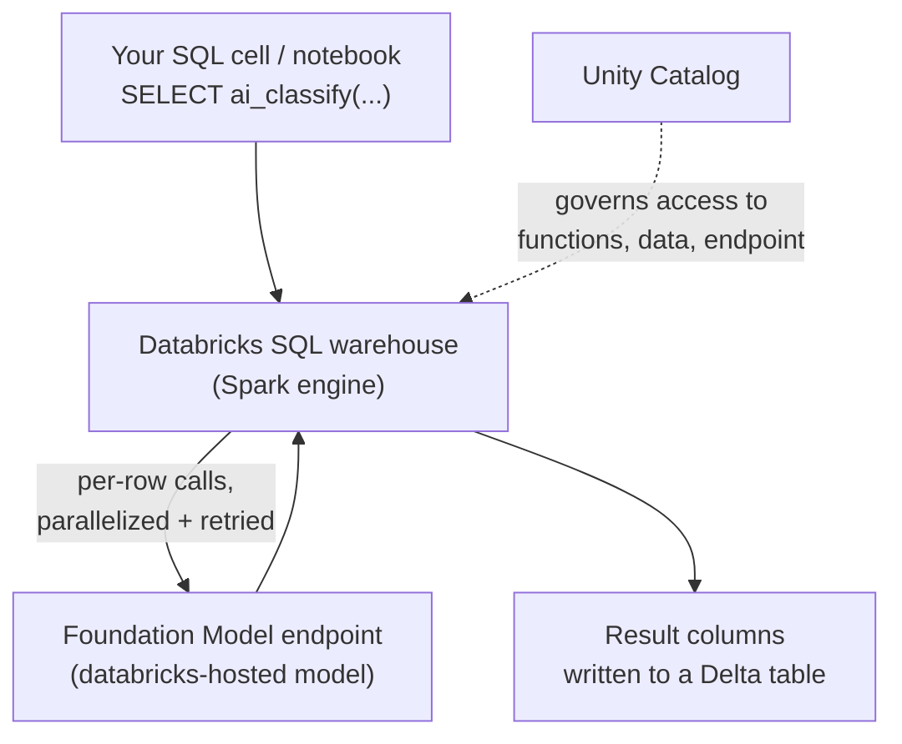
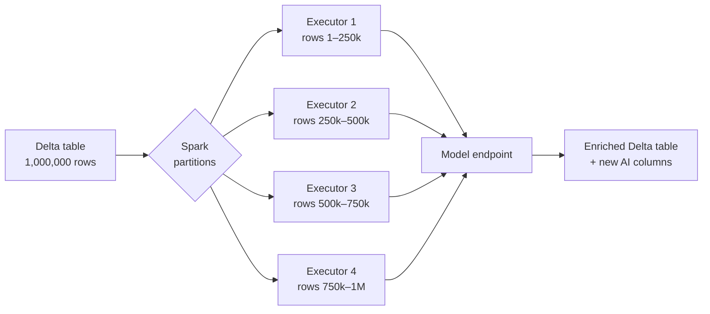

# AI Functions: Enrich Data with SQL

> You already know how to call a model. This lesson gives you a shortcut that feels like coming home: GenAI you invoke as plain SQL functions — the same shape as `UPPER()` or `SUM()`, except these ones can read and reason.

Take a breath. This is going to be the easiest lesson in Part 1, because it does not ask you to learn anything new. If you can write `SELECT`, you can do AI here. That is the whole idea.

## Learning Objectives

By the end of this lesson you will be able to:

- Explain what **AI Functions** are — built-in Databricks SQL functions that call GenAI models over your data — and why they are the friendliest entry point for a Data Engineer.
- Name the **task-specific functions** (`ai_classify`, `ai_extract`, `ai_parse_document`, `ai_summarize`, `ai_translate`, `ai_mask`, `ai_analyze_sentiment`, `ai_similarity`, `ai_gen`, `ai_forecast`, and `vector_search`) and say in one line what each is for.
- Contrast **task-specific functions** (convenient, purpose-built) with **`ai_query`** (general, full control) and choose between them.
- Enrich **millions of rows in a single `CREATE TABLE AS SELECT`**, parallelized by Spark, governed by Unity Catalog.
- Reason about **cost, performance, and PII** when you run these functions at batch scale.

## Prerequisites

- [Calling Foundation Models on Databricks](/docs/llm-foundations/calling-foundation-models) — AI Functions are the SQL-native front door to the same models you called there.
- [Tokens & Tokenization](/docs/llm-foundations/tokens-and-tokenization) — you are billed in tokens, so the size of your text and your output still matters here.

## Estimated Reading Time

~25 minutes.

## Business Motivation

Back at **Northwind Trust**, our fictional asset manager, the support team logs
thousands of tickets a week. Each ticket is a blob of free text: a confused client, a
wire that did not arrive, a login that failed. Today an analyst reads each one and hand-tags
it so the right team picks it up. It is slow, it is inconsistent, and it does not scale.

You already have every ticket sitting in a Delta table. What you have been missing is a
way to say, in the language you already speak all day, *"for each row, read this text and
tell me the category."* Not a new service. Not a Python microservice with retries and a
queue. Just a function you drop into a `SELECT`.

That is exactly what AI Functions give you. Databricks ships a family of SQL functions that
call GenAI models for you. You never see the endpoint, the tokens, or the HTTP call — you
see a function name and some columns. And because it is SQL running on your warehouse, the
parallelism, the governance, and the billing are all the Databricks machinery you already
trust.

Down the road, **Cascade Mutual**, an insurer we will also visit, uses the same functions to
turn scanned claim PDFs into structured columns. Same idea, different data.

## Intuition

Here is the mental model to carry through the whole lesson. Say it out loud:

**An AI Function is just a built-in SQL function — like `UPPER()` or `SUM()` — that happens to understand language.**

Think about what you already do without a second thought:

```sql
SELECT customer_id, UPPER(name) AS name_caps
FROM northwind.crm.customers;
```

`UPPER()` reads a value and returns a new one. Spark applies it to every row and spreads the
work across the cluster. You do not write a loop. You do not think about fan-out. The engine
handles it.

Now replace `UPPER()` with a function that can *read and reason*:

```sql
SELECT ticket_id,
       ai_classify(body, ARRAY('billing', 'technical', 'account', 'other')) AS category
FROM northwind.support.tickets;
```

Same shape. Same fan-out. Same write-back-to-a-table pattern. The only difference is that
`ai_classify` sends the text to a model behind the scenes and returns the label. You did not
learn a new tool. You learned a new *function*. That is the superpower, and it is why Data
Engineers tend to love this topic: it meets you exactly where you already live.



<figcaption>AI Functions slot into the exact spot in a SELECT where your everyday scalar functions already live. Nothing new to install — just new verbs.</figcaption>

## Theory

AI Functions are built-in Databricks SQL functions that call generative AI models over your
data, at scale, from plain SQL. They come in two flavors, and knowing the split is most of
the battle.

**1. Task-specific functions.** Purpose-built for one common job each. You call them by name,
pass your text (and sometimes a little config, like a list of labels), and get a clean result
back. You do not write a prompt, choose a model, or parse JSON. Databricks did that work for
you. These are the convenient, batteries-included option.

**2. The general-purpose function: `ai_query`.** One function that can call *any* supported
model with *your own* prompt. This is the full-control option — you decide the model, the
instructions, the output format. You met this one in the previous lesson.

The rule of thumb: **reach for a task-specific function first**; if none fits, or you need
custom instructions and a specific model, drop down to `ai_query`.

Here is the tour of the task-specific family, one line each:

| Function | What it is for |
| --- | --- |
| `ai_classify` | Sort text into labels *you* provide (e.g. billing / technical / account). |
| `ai_extract` | Pull named fields or entities out of text into structured values. |
| `ai_parse_document` | Turn PDFs and images into structured text and tables. |
| `ai_summarize` | Produce a short summary of a longer piece of text. |
| `ai_translate` | Translate text into a target language. |
| `ai_fix_grammar` | Correct grammar and spelling in text. |
| `ai_mask` | Redact PII (names, emails, card numbers) from text. |
| `ai_analyze_sentiment` | Judge the emotional tone — positive, negative, neutral. |
| `ai_similarity` | Score how semantically close two strings are. |
| `ai_gen` | Free-form generation from your own prompt (the lightweight generator). |
| `ai_forecast` | Project time-series data forward to a horizon. |
| `vector_search` | Query a vector index for semantically similar records. |

You do not need to memorize this table. You need to remember it *exists* — so that when a task
lands on your desk, your first thought is "there is probably a function for that."

:::note[Going deeper (optional)]
`ai_gen` and `ai_query` overlap: both do free-form generation. `ai_gen` is the simplest possible
call (a prompt in, text out) on a Databricks-managed default. `ai_query` is the full interface
where you name the endpoint and control every parameter. Start with `ai_gen` for quick jobs;
graduate to `ai_query` when you need a specific model or structured output.
:::

## Deep Dive

Let us look closely at three of the functions you will reach for most, because their argument
shapes teach you the pattern for all the rest.

**`ai_classify(text, labels)`** takes your text and an *array of labels you define*. The model
picks the best-fitting label from your list. This is the key thing beginners miss: the
categories are *yours*. The model is not guessing from some fixed taxonomy — it is choosing
among the exact buckets you handed it.

**`ai_extract(text, labels)`** also takes an array, but here the array names the *fields* you
want pulled out. Ask for `ARRAY('company', 'amount', 'date')` and you get a value for each,
lifted out of messy prose. It is like a regex that understands meaning instead of characters.

**`ai_parse_document(content)`** takes the *bytes of a document* — a PDF, a scanned image — and
returns structured text and tables. This is the one that turns a folder of scanned claim forms
into rows you can query. It is the bridge from "we have a pile of PDFs" to "we have a table."

Notice the shared shape: **column in, structured value out.** Once you see that, every function
in the family reads the same way. You are always describing what you want and letting the model
do the reading.

:::note[Going deeper (optional)]
Task-specific functions return results in documented, stable shapes — often a struct or a scalar
you can reference directly, e.g. `ai_extract(...).amount`. `ai_query` returns whatever the model
produces, so with `ai_query` you are responsible for constraining and parsing the output (a
`responseFormat` schema helps). That extra parsing burden is the price of the extra control.
:::

## Architecture

Where do these functions actually run, and what do they touch? Here is the picture.



<figcaption>An AI Function call flows from your SQL, through the Spark engine that fans it out and retries failures, to a Databricks-hosted model endpoint, and back into Delta — all inside the Unity Catalog governance boundary.</figcaption>

The three things worth internalizing:

- **Spark does the fan-out.** You submit one query over the whole table; the engine splits the
  rows across executors and calls the model in parallel. You do not manage concurrency.
- **The model is Databricks-hosted.** Task-specific functions use serving endpoints inside your
  workspace (model names prefixed `databricks-`). Nothing leaves the platform's boundary.
- **Unity Catalog governs everything.** Who can call a function, who can read the source table,
  who can write the result — all the same permission system you already use for tables.

## Internal Working

What happens between "you press run" and "the table fills in"? Let us peek under the hood, gently.

1. **Parse and plan.** Spark sees `ai_classify(body, ...)` in your query and treats it like any
   other expression in the logical plan.
2. **Distribute.** The rows are partitioned across the warehouse's executors, exactly as they
   would be for a normal aggregation or join.
3. **Batch and call.** Each executor sends its rows to the model endpoint. The function manages
   how many requests fly at once, respecting the endpoint's rate limits.
4. **Retry.** Transient failures (a timeout, a rate-limit blip) are retried automatically. You do
   not write the retry loop.
5. **Assemble.** Results stream back and land as new columns, ready to be written to Delta.



<figcaption>One SQL query applies an AI Function across an entire Delta table. Spark partitions the rows and calls the model in parallel across executors — the same fan-out you already trust for joins and aggregations, now enriching text.</figcaption>

## Step-by-Step Walkthrough

Let us enrich a support-ticket table at Northwind Trust, step by step, thinking aloud the way you
would at your desk.

**Step 1 — Look at the raw data.** You have a table with a free-text `body` column and not much
else useful for routing.

```sql
SELECT ticket_id, body
FROM northwind.support.tickets
LIMIT 5;
```

This just previews five rows so you can see the shape of the text you are working with. Always
eyeball the input before you spend tokens on it.

**Step 2 — Try the function on a few rows.** Before you run anything over a million rows, test on
a handful.

```sql
SELECT ticket_id,
       ai_classify(body, ARRAY('billing', 'technical', 'account', 'other')) AS category
FROM northwind.support.tickets
LIMIT 20;
```

Here `ai_classify` reads each `body` and returns one of your four labels. The `LIMIT 20` keeps the
test cheap and fast. Read the results: do the labels look right? If not, adjust your label list —
clearer, more distinct labels give better answers.

**Step 3 — Run it over everything and save.** Once you trust the output, materialize it.

```sql
CREATE TABLE northwind.support.tickets_tagged AS
SELECT ticket_id,
       body,
       ai_classify(body, ARRAY('billing', 'technical', 'account', 'other')) AS category
FROM northwind.support.tickets;
```

This is the moment the superpower shows up. One `CREATE TABLE AS SELECT`, and every ticket in the
table gets a category. Spark parallelizes it; you wrote four lines of SQL. That is the whole job.

## Hands-on Examples

Try these in a SQL cell against your own tables. Start small, then scale.

**Sentiment on the same tickets.** Add an emotional-tone read with no extra setup.

```sql
SELECT ticket_id,
       ai_analyze_sentiment(body) AS tone
FROM northwind.support.tickets
LIMIT 10;
```

`ai_analyze_sentiment` returns a tone label (such as positive, negative, or neutral) for each
ticket. Notice you passed no labels this time — sentiment is a fixed task, so the function already
knows the categories.

**Summarize long tickets.** When bodies are long, a summary is easier to scan.

```sql
SELECT ticket_id,
       ai_summarize(body) AS gist
FROM northwind.support.tickets
WHERE LENGTH(body) > 1000
LIMIT 10;
```

`ai_summarize` condenses each long body into a short summary. The `WHERE` clause is a cost habit:
only summarize rows that are actually long enough to need it. Every row you skip is tokens you do
not pay for.

## Code Examples

Now the four real batch examples. Each one is something a Data Engineer would genuinely ship.

**(1) `ai_classify` — tag support tickets.**

```sql
CREATE OR REPLACE TABLE northwind.support.tickets_tagged AS
SELECT ticket_id,
       body,
       ai_classify(
         body,
         ARRAY('billing', 'technical', 'account_access', 'fraud', 'other')
       ) AS category
FROM northwind.support.tickets;
```

This reads every ticket body and assigns one of five labels you defined. `CREATE OR REPLACE` means
you can re-run the whole enrichment idempotently. The result is a routing-ready table — downstream
you can filter `WHERE category = 'fraud'` and page the right team.

**(2) `ai_extract` — pull fields into columns.**

```sql
CREATE OR REPLACE TABLE northwind.support.tickets_extracted AS
SELECT ticket_id,
       ai_extract(body, ARRAY('customer_name', 'account_id', 'issue_amount')) AS fields,
       ai_extract(body, ARRAY('customer_name', 'account_id', 'issue_amount')).account_id AS account_id
FROM northwind.support.tickets;
```

`ai_extract` reads each body and pulls out the three fields you named, returning them as a struct.
The second line shows how you reach into that struct — `.account_id` — to promote one field into its
own column. Suddenly free text is queryable structure. (In practice you would compute the extract
once in a subquery and reference its fields, to avoid calling the model twice — more on that in
Performance.)

**(3) `ai_parse_document` — turn PDFs into structured text.**

```sql
CREATE OR REPLACE TABLE cascade.claims.parsed AS
SELECT path,
       ai_parse_document(content) AS parsed
FROM READ_FILES('/Volumes/cascade/claims/scanned_pdfs/', format => 'binaryFile');
```

Here Cascade Mutual reads raw PDF bytes from a Unity Catalog volume with `READ_FILES`, then
`ai_parse_document` converts each document into structured text and tables. This is the bridge from
"a folder of scans" to "a Delta table you can query." From here you would feed `parsed` into
`ai_extract` to lift out claim numbers, dates, and amounts.

**(4) Batch enrichment — combine several functions in one pass.**

```sql
CREATE OR REPLACE TABLE northwind.support.tickets_enriched AS
SELECT ticket_id,
       ai_mask(body, ARRAY('email', 'phone', 'credit_card')) AS body_redacted,
       ai_classify(body, ARRAY('billing', 'technical', 'account_access', 'fraud', 'other')) AS category,
       ai_analyze_sentiment(body) AS tone,
       ai_summarize(body) AS gist
FROM northwind.support.tickets;
```

One query, four AI columns. `ai_mask` redacts PII from the stored copy, `ai_classify` routes,
`ai_analyze_sentiment` gauges urgency, and `ai_summarize` gives a scannable gist. This single
`CREATE TABLE AS SELECT` runs over the entire table, Spark-parallelized, governed by Unity Catalog.
This is the daily-driver pattern: enrich once, query forever.

## Production Considerations

- **Cost scales with rows and tokens.** Every row is a model call, and you pay per input plus output
  token. A million-row table is a million calls. Filter to the rows that actually need enriching, and
  keep inputs and outputs tight.
- **Make it idempotent.** Use `CREATE OR REPLACE TABLE` or `MERGE` so a re-run does not double-charge
  or duplicate. For incremental loads, only process *new* rows.
- **Schedule it as a job.** These functions fit cleanly into Databricks Workflows, Lakeflow pipelines,
  and Structured Streaming — treat AI enrichment as a normal step in your ETL DAG.
- **Availability and beta status vary.** Some functions and models are region- or workspace-dependent,
  and a few are in beta. Check what your workspace exposes before you build on it.

## Performance Considerations

- **Submit the whole dataset in one query.** Do not hand-split into tiny batches — the function manages
  parallelism, retries, and scaling better when it sees the full job.
- **Do not call the same function twice on the same input.** In Example 2 above, calling `ai_extract`
  twice doubles the cost. Compute it once in a CTE or subquery, then reference its fields.
- **Filter and truncate before you enrich.** A `WHERE` clause that skips short or irrelevant rows, and
  trimming overly long inputs, both cut token spend directly. Fewer tokens is faster *and* cheaper.
- **Warehouse size matters.** More executors means more parallel model calls, up to the endpoint's rate
  limit. Past that limit you are waiting on the endpoint, not the cluster.

## Security Considerations

- **Redact PII with `ai_mask`.** When source text contains emails, phone numbers, or card numbers, mask
  it before storing or before sending it into other functions. Treat `ai_mask` as a first-class step, not
  an afterthought.
- **Unity Catalog governs access.** Access to the functions, the source tables, and the result tables all
  run through UC permissions. You can restrict who is even allowed to call task-specific AI Functions.
- **Data stays on Databricks-hosted models.** Task-specific functions call in-platform serving endpoints
  (model names prefixed `databricks-`), so your data is not shipped to a third party by default.
- **Mind what lands in the output.** A summary or extraction can surface sensitive detail into a new
  column. Govern the enriched table with the same care as the source.

## Common Mistakes

- **Running over the full table before testing on 20 rows.** Always `LIMIT` first, read the output, then
  scale. It saves money and embarrassment.
- **Vague or overlapping labels in `ai_classify`.** `ARRAY('issue', 'problem', 'other')` will confuse the
  model. Make labels distinct and meaningful.
- **Calling the same AI Function twice on one row.** Doubles cost silently. Compute once, reference the
  result.
- **Forgetting these are probabilistic.** The same input can occasionally return different output. Do not
  treat an AI column as a deterministic key. Validate and, where it matters, review.
- **Reaching for `ai_query` when a task function exists.** More work, more parsing, more room for error.
  Use the purpose-built function unless you genuinely need custom control.

## Best Practices

- **Task-specific first, `ai_query` second.** Only drop to the general function when no specialized one
  fits or you need a specific model or output shape.
- **Prototype small, then `CREATE OR REPLACE TABLE`.** Test on a `LIMIT`, then materialize the whole job
  idempotently.
- **Filter before you enrich.** Every row you skip is tokens saved.
- **Name your labels and fields clearly.** The quality of `ai_classify` and `ai_extract` output tracks
  directly with how clear your labels and field names are.
- **Mask PII as a pipeline step.** Bake `ai_mask` into the enrichment, not a later clean-up.
- **Keep AI enrichment in your normal orchestration.** These are SQL functions — schedule and monitor them
  like any other ETL step.

## Interview Questions

**Q1. What are Databricks AI Functions, and why are they a natural fit for a Data Engineer?**
They are built-in SQL functions that call GenAI models over your data. They fit a DE because they have
the exact shape of functions like `UPPER()` or `SUM()` — you apply them per row in a `SELECT`, Spark
parallelizes them, and Unity Catalog governs them. No new tooling, just new functions.

**Q2. When would you use a task-specific function versus `ai_query`?**
Use a task-specific function (like `ai_classify` or `ai_summarize`) when your job matches a purpose-built
one — it is simpler, returns a stable shape, and needs no prompt engineering. Use `ai_query` when no task
function fits, or you need a specific model, custom instructions, or a custom output schema.

**Q3. How do AI Functions scale to a million rows without you writing a loop?**
You submit one query over the whole table. Spark partitions the rows across executors and the function
manages parallelism, retries, and rate limits against the model endpoint. Best practice is to submit the
full dataset in a single query rather than hand-splitting it.

**Q4. What drives cost, and how do you control it?**
Cost scales with the number of rows and tokens (input plus output). Control it by filtering to only the
rows that need enriching, trimming long inputs, capping output length, and never calling the same function
twice on the same input.

**Q5. How do you handle PII when enriching text with AI Functions?**
Use `ai_mask` to redact entities like emails, phones, and card numbers before storing or before feeding
text into other functions. Rely on Unity Catalog to govern who can call the functions and read the source
and result tables, and keep in mind results run on Databricks-hosted endpoints.

## Quiz

**Q1.** You need to route 500,000 support tickets into one of five predefined teams based on their text. Which function, and what do you pass it?

<details>

Use `ai_classify(body, ARRAY(...))`, passing an array of your five team labels. The categories are yours to
define — the model picks the best fit from the list you provide. Run it inside a `CREATE OR REPLACE TABLE ... AS SELECT` to enrich the whole table in one Spark-parallelized pass.

</details>

**Q2.** A teammate wants to use `ai_query` with a custom prompt to pull `invoice_number` and `total` out of ticket text. Is there a simpler option?

<details>

Yes — `ai_extract(body, ARRAY('invoice_number', 'total'))`. It is purpose-built for pulling named fields,
returns a stable struct you can reference with dot notation, and needs no prompt engineering or output
parsing. Reserve `ai_query` for cases where no task-specific function fits or you need a specific model.

</details>

**Q3.** Your nightly enrichment job is costing far more than expected. Name two things you would check.

<details>

(1) Are you enriching rows that do not need it? Add a `WHERE` filter and only process new or relevant rows.
(2) Are you calling the same AI Function more than once per row (e.g. `ai_extract` twice to read two fields)?
Compute it once in a CTE and reference the result. Also check whether inputs or outputs are unnecessarily
long, since cost scales with tokens.

</details>

**Q4.** Why should you *not* manually split a large table into small batches before running an AI Function?

<details>

Because the function already manages parallelization, retries, and scaling for you. Databricks recommends
submitting the full dataset in a single query — Spark partitions the rows across executors and calls the
model in parallel, respecting endpoint rate limits. Hand-splitting fights the engine and usually makes the
job slower, not faster.

</details>

## Key Takeaways

- This is the most comfortable on-ramp to GenAI a Data Engineer will find — not new tooling, just SQL.
- AI Functions are **SQL functions that read and reason** — same shape as the functions you already use.
- **Task-specific first, `ai_query` second.** Reach for a purpose-built function before the general one.
- **One `CREATE TABLE AS SELECT` enriches millions of rows**, parallelized by Spark, governed by Unity Catalog.
- **Submit the whole dataset in one query** — the function handles parallelism, retries, and scaling.
- **Cost scales with rows and tokens.** Filter, trim, and never call the same function twice per row.
- **Redact PII with `ai_mask`** and lean on Unity Catalog for access control.

## Glossary

- **AI Function** — a built-in Databricks SQL function that calls a generative AI model over your data.
- **Task-specific function** — a purpose-built AI Function for one common job (e.g. `ai_classify`), needing
  no prompt or model choice.
- **`ai_query`** — the general-purpose AI Function that calls any supported model with your own prompt and
  parameters.
- **Batch enrichment** — applying an AI Function across a whole table at once, typically via `CREATE TABLE AS SELECT`.
- **Unity Catalog** — Databricks' governance layer controlling access to functions, tables, and endpoints.
- **PII** — personally identifiable information (names, emails, card numbers); redact with `ai_mask`.
- **Serving endpoint** — the hosted model an AI Function calls behind the scenes; Databricks-hosted models
  are prefixed `databricks-`.

## Further Reading

- [Databricks AI Functions overview](https://docs.databricks.com/aws/en/large-language-models/ai-functions) — the official "Enrich data with AI functions" documentation and the full function reference.

## Next Lesson

You have now toured the whole family. That wraps the core concepts of Part 1 — well done. Time to
consolidate everything and get ready to talk about it out loud.

➡️ [Part 1 · Interview Prep](/docs/llm-foundations/interview-prep)
