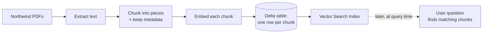

# Chunking: Cutting Documents into Retrievable Pieces

> Imagine handing someone a 300-page policy binder and asking, "Where does it say how many vacation days I get?" They would not read the whole thing to answer one question. They would flip to the right page. Chunking is how we let a computer do the same thing — and it is simpler than it sounds.

Take a breath. You already know how to split data. You have chopped huge tables into partitions, batched rows, windowed streams. Chunking is that same instinct, pointed at text. If you can slice a Delta table, you can chunk a document. Let's walk through it together, one small idea at a time.

## Learning Objectives

By the end of this lesson, you will be able to:

- Explain, in plain words, why we do not embed a whole 50-page document as a single vector.
- Describe what a "chunk" is and why smaller, focused pieces retrieve better.
- Choose a sensible chunk size and overlap, and say why each matters.
- Compare the main splitting strategies (by characters, by tokens, by structure, and recursive).
- Keep useful metadata (source file, page number) attached to every chunk.
- Reason about the trade-offs of chunks that are too small versus too big.
- Write a Python chunker and land the results in a Delta table, ready to be indexed.

## Prerequisites

You will get the most out of this lesson if you have already met these ideas:

- [What Is RAG?](/docs/rag-and-ai-search/what-is-rag) — the big picture of retrieval-augmented generation.
- [Embeddings](/docs/llm-foundations/embeddings) — turning text into vectors of numbers.
- [Context Window](/docs/llm-foundations/context-window) — the limited amount of text a model can read at once.

If those titles ring a bell, you are ready. If not, a quick peek first will make everything here click faster.

## Estimated Reading Time

About 20 to 25 minutes, plus a little more if you try the code.

## Business Motivation

Let's make this real with a company we will use throughout: **Northwind Trust**, a mid-sized financial firm. (It is fictional — no need to look it up.) Northwind has hundreds of policy PDFs: expense rules, compliance procedures, onboarding guides. Employees constantly ask questions like "What is our travel reimbursement limit?" and today they either ping a busy colleague or give up.

Northwind wants an internal assistant that answers these questions using their own documents. That is a classic RAG use case. But here is the catch that surprises most people: **you cannot just feed a whole PDF to the search system and hope for the best.** The documents are too long, and the meaning of a 50-page file is too broad to match a single, specific question.

Chunking is the unglamorous step that makes the whole assistant actually work. Get it right and answers are sharp and cite the correct page. Get it wrong and the assistant returns vague, half-relevant mush. This one step quietly decides whether the project succeeds. That is why it deserves its own lesson.

## Intuition

Here is the whole idea in one picture.

Think of a long reference book. You want to turn it into a stack of **index cards**. Each card holds one small, self-contained thought — something you could read on its own and understand. When someone asks a question, you flip to the handful of cards that match, instead of re-reading the book.

Chunking is cutting the book into index cards.

Two everyday truths fall out of that picture:

- **A card should be about one thing.** If you cram three unrelated topics onto one card, it is hard to know what the card is really "about." Same with a chunk — one focused idea retrieves better than a jumble.
- **Ideas should not get cut in half at the card's edge.** If a sentence starts on one card and finishes on the next, both cards are a little broken. So we let the cards **overlap** slightly — repeat a bit of text at the edges — so no thought falls into the gap between them.

That is chunking. Everything else in this lesson is just detail on how to cut the cards well.

## Theory

Let's slow down and answer the question head-on: **why not embed the whole document as one vector?**

Remember from the embeddings lesson that an embedding turns a piece of text into a single point in space — one vector that captures "what this text is about." Now think about what happens with a 50-page policy PDF.

**Reason 1: It literally will not fit.** Every embedding model has an input limit, measured in tokens. A token is roughly three-quarters of a word. Many embedding models accept only a few hundred to a few thousand tokens at a time. A 50-page document is tens of thousands of tokens. It simply does not fit through the door.

:::note[Going deeper (optional)]
"Token" is the unit language models count in, not characters or words. A rough rule of thumb for English: 1 token is about 4 characters, or roughly 0.75 words. So 1,000 tokens is around 750 words. You do not need to count by hand — a tokenizer library does it for you, and we will use one later.
:::

**Reason 2: The meaning gets blurry.** Say you could squeeze the whole document into one vector. That single point would have to represent expenses *and* travel *and* compliance *and* onboarding, all at once. It becomes an average of everything — a smudge in the middle of the space that is not close to any one question. When someone asks about travel limits, the smudged vector is not a strong match, because it is only a little bit about travel.

Smaller chunks fix both problems at once. Each chunk fits comfortably within the input limit, and each chunk is about one clear thing, so its vector sits crisply near the questions it answers.

**Reason 3: Retrieval feeds a limited prompt.** After we find matching chunks, we paste them into the model's context window, which is also limited. Small, on-target chunks mean we can fit several good ones. One giant chunk would hog the space and drag in lots of irrelevant text.

So the rule is: **split the document into chunks, embed each chunk separately, and store them.** That is the foundation everything else builds on.

## Deep Dive

Now the practical knobs. There are only three big ones: **size**, **overlap**, and **how you split**. Let's take them one at a time.

### Chunk size (measured in tokens)

Chunk size is how much text goes on each index card. We measure it in tokens, not characters, because tokens are what the embedding model actually counts.

There is no single magic number, but a common, sensible starting range is **roughly 200 to 800 tokens per chunk** (many teams start around 300 to 500). Here is the trade-off in one line:

- **Too small** and a chunk loses its surrounding context. A sentence like "This limit does not apply to executives" is useless if the chunk before it — the one naming the limit — got separated.
- **Too big** and the chunk drifts back toward that blurry-average problem, plus fewer chunks fit in the final prompt, and each one carries more noise.

You are aiming for "one complete thought," not "one sentence" and not "one chapter."

### Overlap (the repeated bit at the edges)

Overlap is how much text two neighboring chunks share. If chunk A ends with a sentence and chunk B repeats that same sentence at its start, they overlap.

Why bother? Because splitting is a blind cut. Without overlap, you might slice right through the middle of an important sentence or idea, and neither resulting chunk is whole. A little overlap — commonly **10 to 20 percent** of the chunk size — acts like a safety margin so the idea survives on at least one side of the cut.

A tiny example. Suppose the text is:

> "The daily meal allowance is 60 dollars. Receipts are required for any single expense over 25 dollars."

If you cut right after "60 dollars," one chunk knows the allowance but not the receipt rule, and the other knows the receipt rule but not what expense it applies to. With overlap, the boundary sentence appears on both chunks, so a question about either topic finds a chunk that makes sense on its own.

### How you split (the strategy)

This is *where* you make the cuts. From simplest to smartest:

1. **Fixed by characters or tokens.** Just count and cut every N units. Dead simple, but blind — it happily slices mid-sentence.
2. **By structure (paragraph, heading, section).** Cut at natural boundaries the document already has. A paragraph is usually one idea, so this respects meaning. Great when documents are well formatted.
3. **Recursive.** The popular middle ground. Try to split on big boundaries first (sections, then paragraphs, then sentences), and only fall back to a raw character/token cut if a piece is still too large. It keeps chunks meaningful *and* guarantees they stay under the size limit.

For Northwind's policy PDFs, which have clear headings and paragraphs, a recursive strategy is a strong default. It follows the document's own structure but never lets a chunk blow past the size cap.

You are doing great. The three knobs — size, overlap, strategy — are the whole game. The rest is bookkeeping.

## Architecture

Here is where chunking sits in the RAG pipeline. Notice it happens once, up front, during ingestion — not when a user asks a question.



*Caption: Chunking is step three of ingestion. You extract text, cut it into chunks, embed each chunk, and store them — one row per chunk — before any user ever asks a question.*

The key mental shift: chunking is a **batch data-prep job**, the kind of thing you already do every day. It reads documents, transforms them into rows, and writes a table. You are on home turf.

## Internal Working

Let's zoom into that one box — "Chunk into pieces" — and see the overlap in action, since that is the part people find fuzzy.

Picture one long document as a bar of text. We slide a window across it. Each window is one chunk. The window steps forward by *less* than its own width, so consecutive windows share a strip. That shared strip is the overlap.

```
The document (reading left to right):

|----------------- one long policy document -----------------|

Chunk 1:  [==================]
Chunk 2:           [==================]
Chunk 3:                    [==================]
Chunk 4:                             [==================]
                   ^^^^^^^^^
                   overlap: this text appears in
                   BOTH the chunk before and after
```

*Caption: Chunks are windows that slide forward by less than their width. The stretch where two windows cover the same text is the overlap — the safety margin that keeps ideas from being cut in half.*

Concretely, the math is simple. If your chunk size is 500 tokens and your overlap is 100 tokens, then each new chunk starts 400 tokens after the previous one (that is `size - overlap`, called the *stride* or *step*). So:

- Chunk 1: tokens 0 to 500
- Chunk 2: tokens 400 to 900
- Chunk 3: tokens 800 to 1300

See how tokens 400 to 500 live in both chunk 1 and chunk 2? That is the repeated edge doing its job.

And crucially, **each chunk carries a little luggage** — its metadata: which file it came from, which page, and its position in order. We will see exactly what that buys us when we attach it in code below.

## Step-by-Step Walkthrough

Here is the full path for a single Northwind PDF, start to finish. We will turn each step into code in the next sections.

1. **Read the document's text.** Get the raw text out of the PDF (and, ideally, note which page each bit came from).
2. **Pick your settings.** Decide chunk size (say 500 tokens) and overlap (say 100 tokens).
3. **Tokenize.** Convert the text into tokens so you can count precisely.
4. **Slide the window.** Cut chunks of your chosen size, stepping forward by `size - overlap` each time.
5. **Attach metadata.** For each chunk, record the source file name, the page, and a chunk index.
6. **Write to Delta.** Store one row per chunk. This table is the input to the embedding and indexing steps that come next.

That is it. Notice we have not embedded anything yet — chunking just produces clean, labeled rows. Embedding and index-building are the *following* lessons.

## Hands-on Examples

Let's make it tangible with a small worked example before the full code.

Suppose one paragraph from Northwind's travel policy reads:

> "Employees may book economy flights without prior approval. Business class requires director sign-off. All bookings must go through the corporate travel portal."

With a small chunk size and a bit of overlap, you might get:

- **Chunk 0:** "Employees may book economy flights without prior approval. Business class requires director sign-off."
- **Chunk 1:** "Business class requires director sign-off. All bookings must go through the corporate travel portal."

Notice the sentence "Business class requires director sign-off" appears in both. If a user asks "who approves business class?", chunk 0 answers it. If they ask "where do I book?", chunk 1 answers it — and the shared sentence means neither chunk feels like it starts mid-thought. That repetition is a feature, not a bug.

## Code Examples

Now the real thing. We will write a clear, token-based chunker with overlap and metadata, then land it in Delta. This runs in a Databricks notebook.

First, a small helper to count and slice by tokens. We use a tokenizer so our sizes are measured in the same units the embedding model uses.

```python
# A token-based chunker with overlap.
# We use tiktoken to count tokens the way the model does.

import tiktoken

# Load a tokenizer. cl100k_base is a common general-purpose one.
_encoder = tiktoken.get_encoding("cl100k_base")

def chunk_text(text, chunk_size=500, overlap=100):
    """Split `text` into token-bounded chunks that overlap.

    chunk_size: max tokens per chunk
    overlap:    tokens shared between neighboring chunks
    Returns a list of chunk strings, in order.
    """
    if overlap >= chunk_size:
        raise ValueError("overlap must be smaller than chunk_size")

    # 1) Turn the whole text into a list of token ids.
    tokens = _encoder.encode(text)

    # 2) Slide a window of `chunk_size`, stepping by (size - overlap).
    step = chunk_size - overlap
    chunks = []
    start = 0
    while start < len(tokens):
        window = tokens[start : start + chunk_size]
        # 3) Turn the token window back into readable text.
        chunks.append(_encoder.decode(window))
        start += step

    return chunks
```

What to notice here:

- We `encode` the text into tokens **once**, then slice the token list. That guarantees every chunk is at most `chunk_size` tokens — no chunk will ever overflow the embedding model's door.
- `step = chunk_size - overlap` is the stride from the diagram. A smaller step means more overlap and more chunks.
- The `overlap >= chunk_size` guard stops an easy mistake: if the step were zero or negative, the loop would never move forward (an infinite loop). Small guardrail, big relief.

That chunker is "blind" — it cuts purely by token count. For well-structured documents, a **recursive** splitter that respects paragraphs first is usually better. On Databricks you do not have to hand-roll it; a widely used library does it for you.

```python
# A structure-aware (recursive) splitter.
# It tries paragraph, then line, then sentence, then raw
# character boundaries, and only makes a hard cut as a last resort.

from langchain_text_splitters import RecursiveCharacterTextSplitter

splitter = RecursiveCharacterTextSplitter.from_tiktoken_encoder(
    encoding_name="cl100k_base",
    chunk_size=500,     # measured in tokens
    chunk_overlap=100,  # tokens shared at the edges
)

# `chunks` is a list of strings, split on natural boundaries
# but never larger than 500 tokens.
chunks = splitter.split_text(policy_text)
```

What to notice:

- `from_tiktoken_encoder` means the sizes are counted in **tokens**, matching our earlier reasoning, even though the splitter's name says "Character."
- It prefers natural breaks (blank lines, then newlines, then sentences) so chunks tend to start and end on clean thoughts, and it only falls back to a raw cut when a section is stubbornly long.

Now let's attach metadata and land everything in a Delta table — one row per chunk. This is the deliverable that the vector index will read.

```python
# Turn one document's chunks into rows, with metadata, in Delta.
from pyspark.sql import Row

def build_chunk_rows(text, source_file, page, chunk_size=500, overlap=100):
    """Return a list of Row objects, one per chunk, with metadata."""
    pieces = chunk_text(text, chunk_size=chunk_size, overlap=overlap)
    rows = []
    for i, piece in enumerate(pieces):
        rows.append(Row(
            chunk_id=f"{source_file}::p{page}::c{i}",  # unique + readable
            source_file=source_file,   # which PDF this came from
            page=page,                 # which page
            chunk_index=i,             # order within the document
            content=piece,             # the chunk text itself
        ))
    return rows

# Example: one page of a Northwind policy PDF.
rows = build_chunk_rows(
    text=policy_text,
    source_file="travel_policy_2026.pdf",
    page=4,
)

df = spark.createDataFrame(rows)

# Write one row per chunk to a governed Delta table (Unity Catalog).
(df.write
   .mode("append")
   .saveAsTable("northwind.rag.policy_chunks"))
```

What to notice:

- **Every chunk keeps its luggage.** `source_file` and `page` are what let the finished assistant cite "*Travel Policy 2026*, page 4." Without these columns, answers become unverifiable — a dealbreaker at a firm like Northwind.
- `chunk_id` is unique and human-readable, which makes debugging ("why did *this* chunk get retrieved?") much easier later.
- The output is an ordinary Delta table. This matters: the next lesson builds a Vector Search index directly on top of a Delta table like this one. You are handing off a clean, familiar artifact.

:::note[Going deeper (optional)]
For a production ingestion job you would loop this over many PDFs, extract real per-page text (a PDF library gives you page numbers), and enable **Change Data Feed** on the Delta table so the vector index can sync only the rows that changed. We will cover that sync in the next lesson.
:::

You just built a working chunker end to end. That is the hard part of RAG ingestion, and you did it.

## Production Considerations

- **Idempotency.** Re-running your job should not create duplicate chunks. Use a stable `chunk_id` (as above) and `MERGE`, or overwrite per source file, so reprocessing a document replaces its old chunks cleanly.
- **Handle document updates.** Policies change. When a PDF is revised, delete or replace its existing chunks before writing new ones — otherwise the assistant will cite stale rules.
- **Change Data Feed.** Enable it on the chunk table so Databricks Vector Search can incrementally sync new and changed rows instead of rebuilding everything.
- **Match tokenizer to model.** Count tokens with the tokenizer your embedding model actually uses. If your sizing tokenizer disagrees with the model's, chunks may quietly exceed the model's limit and get truncated.
- **Extraction quality first.** Garbage text in means garbage chunks out. Scanned PDFs need OCR; messy tables need cleanup. Chunking cannot fix bad extraction.

## Performance Considerations

- **Chunk count drives cost and latency.** More chunks means more embedding calls up front and a larger index. Smaller chunks with heavy overlap can multiply your row count fast — a document at 500-token chunks with 400-token overlap produces roughly five times as many rows as with no overlap. Keep overlap modest (10 to 20 percent).
- **Parallelize ingestion.** Chunking is embarrassingly parallel — each document is independent. Distribute the work across your Spark cluster the same way you would any batch transform. A Python UDF or `mapInPandas` over a DataFrame of documents scales this cleanly.
- **Tokenize once per document.** Encoding text into tokens has a cost. Encode a document a single time and slice, rather than re-tokenizing per chunk.
- **Right-size the batch.** Embedding APIs are far more efficient on batches of chunks than one-at-a-time calls. Structure the downstream step to send chunks in batches.

## Security Considerations

- **Chunks inherit the document's sensitivity.** A chunk from a confidential policy is still confidential. Store the chunk table in **Unity Catalog** and apply the same access controls you would to the source.
- **Carry access metadata into the chunk.** If different employees may see different documents, record an access label or owning group on each chunk so retrieval can filter by who is asking. Splitting text does not split permissions for you.
- **Mind PII.** Chunking can scatter sensitive fields across rows. If documents contain personal data, apply masking or redaction during extraction, before the text is embedded and indexed.
- **Do not leak metadata into prompts carelessly.** Internal file paths or system notes stored as metadata should not automatically be pasted into a user-facing answer unless you intend it.

## Common Mistakes

- **Embedding whole documents.** The mistake this whole lesson exists to prevent. One vector per document blurs meaning and overflows the input limit.
- **Zero overlap.** Cutting blind with no overlap slices sentences and ideas in half. Always keep a small margin.
- **Too much overlap.** Overlap near the chunk size explodes row count and cost for little benefit. Keep it around 10 to 20 percent.
- **Measuring in characters, not tokens.** Character counts do not match the model's limits. Size in tokens.
- **Dropping metadata.** Chunks with no `source_file` or `page` make answers impossible to cite or verify.
- **One size for every document type.** A dense legal PDF and a chatty FAQ do not want the same chunk size. Tune per corpus.

## Best Practices

- Start with a sensible default (around 500-token chunks, 100-token overlap, recursive splitting) and adjust based on real retrieval quality.
- Split on the document's natural structure (headings, paragraphs) whenever the formatting allows it.
- Always attach `source_file`, `page`, and `chunk_index` metadata.
- Use a stable, unique `chunk_id` so updates and de-duplication are easy.
- Keep chunks focused on one idea; if a chunk feels like it covers three topics, your size is probably too big.
- Land chunks in a governed Delta table so indexing, governance, and lineage all come for free.
- Evaluate. After building the index, check whether questions retrieve the *right* chunks, and re-tune size and overlap if not.

## Interview Questions

1. **Why not embed an entire document as a single vector?** *Look for:* it exceeds the embedding model's token limit, and its meaning becomes a blurry average of many topics, so it matches no specific query well; smaller chunks are focused and fit.
2. **What is chunk overlap and why does it matter?** *Look for:* shared text between neighboring chunks so an idea cut at a boundary still survives whole on at least one side; typically 10 to 20 percent of chunk size.
3. **Compare fixed-size, structure-based, and recursive splitting.** *Look for:* fixed is simple but cuts blindly; structure-based respects meaning but can produce oversized pieces; recursive tries natural boundaries first and falls back to a hard cut, getting both meaningfulness and a size guarantee.
4. **What are the trade-offs of very small versus very large chunks?** *Look for:* too small loses surrounding context and fragments ideas; too large reintroduces averaging, adds noise, and lets fewer relevant chunks fit in the prompt.
5. **What metadata should travel with each chunk and why?** *Look for:* source file, page, chunk index (and possibly access labels) — needed for citation, verification, updates, de-duplication, and permission-aware retrieval.

## Quiz

**Question 1.** Your embedding model accepts 512 tokens. You try to embed a 30-page document as one vector. What happens, and what should you do instead?

<details>
<summary>Show answer</summary>

The document is far more than 512 tokens, so it will not fit — it gets rejected or silently truncated, losing most of the content. Split the document into chunks under 512 tokens each, embed each chunk separately, and store one row per chunk.

</details>

**Question 2.** You set chunk size to 500 tokens and overlap to 100 tokens. Where does the third chunk start, in tokens?

<details>
<summary>Show answer</summary>

The step is `size - overlap = 500 - 100 = 400` tokens. Chunk 1 starts at 0, chunk 2 at 400, and chunk 3 at 800. So the third chunk starts at token 800 and covers tokens 800 to 1300.

</details>

**Question 3.** A teammate sets overlap equal to chunk size to "capture more context." Why is that a bad idea?

<details>
<summary>Show answer</summary>

If overlap equals chunk size, the step is zero — the window never moves forward, causing an infinite loop (or, if guarded, no progress). Even short of that, very high overlap massively inflates the number of chunks, driving up embedding cost and index size for little gain. Keep overlap around 10 to 20 percent of chunk size.

</details>

**Question 4.** Why do we store `source_file` and `page` on every chunk row?

<details>
<summary>Show answer</summary>

So the assistant can cite exactly where an answer came from (for example, "*Travel Policy 2026*, page 4"), so answers are verifiable, and so we can update or delete a specific document's chunks when the source changes. Without this metadata, retrieved text is unattributable and hard to maintain.

</details>

## Key Takeaways

- Do not embed whole documents; split them into focused chunks and embed each one.
- Size chunks in tokens (a common start is around 500) so they fit the embedding model.
- Use modest overlap (10 to 20 percent) so ideas are not cut in half at boundaries.
- Prefer recursive/structure-aware splitting for well-formatted documents.
- Attach metadata (source, page, index, and an ID) to every chunk.
- Land chunks in a governed Delta table — one row per chunk — ready for indexing.

## Glossary

- **Chunk:** A small, self-contained piece of a document that gets embedded and indexed on its own. Our "index card."
- **Chunk size:** How much text is in one chunk, measured in tokens.
- **Overlap:** Text shared between two neighboring chunks, so ideas at a boundary are not lost.
- **Token:** The unit language models count in — roughly three-quarters of a word in English.
- **Stride / step:** How far the window advances per chunk; equals `chunk_size - overlap`.
- **Recursive splitting:** A strategy that tries natural boundaries (sections, paragraphs, sentences) first and only makes a raw cut as a last resort.
- **Metadata:** The "luggage" stored with each chunk — source file, page, index — used for citation and maintenance.
- **Ingestion:** The one-time, up-front pipeline that extracts, chunks, embeds, and stores documents before any query.

## Further Reading

- [Databricks Vector Search overview](https://docs.databricks.com/aws/en/generative-ai/vector-search)
- [Retrieval-augmented generation on Databricks](https://docs.databricks.com/aws/en/generative-ai/retrieval-augmented-generation)
- [Prepare and query data for Mosaic AI Vector Search](https://docs.databricks.com/aws/en/generative-ai/create-query-vector-search)
- [Delta Lake Change Data Feed](https://docs.databricks.com/aws/en/delta/delta-change-data-feed)

## Next Lesson

Your chunks are cut and sitting in a Delta table. Time to make them searchable.

➡️ [Building a Vector Search Index](/docs/rag-and-ai-search/vector-search-index)
