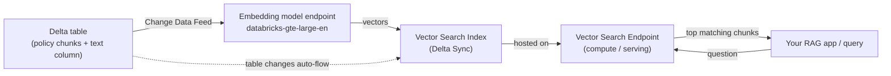
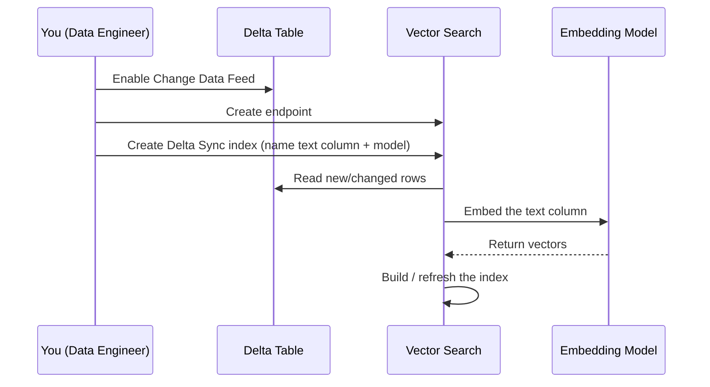

# Building a Vector Search Index on Databricks

> You already know how to build a table that answers a question in milliseconds. Today you'll build the AI version of that same idea, and you'll be surprised how familiar it feels.

Take a breath. If the words "vector index" make your shoulders tense up, that's completely normal, and you're in exactly the right place. You are an expert at data. You've tuned queries, partitioned tables, and kept pipelines fresh for years. That experience is your superpower here. We're just pointing it at a new kind of lookup.

Here's the friendly promise for this lesson: by the end, you'll have created a search structure that finds text by *meaning* instead of by exact match, and Databricks will keep it up to date for you automatically. No mysterious math homework required. One idea at a time. Let's go.

## Learning Objectives

By the end of this lesson, you'll be able to:

- Explain what a vector index is, in plain words, and why it makes AI apps fast.
- Tell the difference between a Vector Search **endpoint** and a Vector Search **index**.
- Create a Vector Search endpoint with the `databricks-vectorsearch` Python client.
- Create a **Delta Sync index** that embeds your text for you and stays fresh automatically.
- Decide when to let Databricks manage embeddings versus managing them yourself.
- Pick an embedding model and enable the one table setting the sync needs.

## Prerequisites

You'll get the most out of this lesson if you've already met these ideas:

- [Chunking](/docs/rag-and-ai-search/chunking) - how we break big documents into bite-sized pieces.
- [Vector Similarity](/docs/llm-foundations/vector-similarity) - how we measure "closeness in meaning."
- [Embeddings](/docs/llm-foundations/embeddings) - how text becomes a list of numbers.

If any of those feel fuzzy, a quick skim is enough. We'll gently re-explain the key parts as we go.

## Estimated Reading Time

About 20 to 25 minutes. There's no rush. Feel free to read it in two sittings.

## Business Motivation

Let's start with a story you'll recognize.

Northwind Trust is a mid-sized financial firm. They have hundreds of internal policy documents: KYC rules, wire-transfer limits, refund procedures, vacation policy, you name it. Every day, employees ask questions like "What's our limit for same-day international wires?" and then spend twenty minutes hunting through PDFs.

The company wants an AI assistant that answers these questions instantly, using their *own* documents. That pattern has a name you'll hear constantly: **RAG** (Retrieval-Augmented Generation). The AI "retrieves" the right policy text, then uses it to write an answer.

But retrieval has one hard requirement: you need a way to find the *most relevant* chunks of text, fast, out of thousands. Not by keyword. By meaning. Someone might type "how much can I send abroad in a day" and the matching policy might say "same-day international wire transfer thresholds." No shared keywords, same meaning.

That "find by meaning, fast" engine is a **vector search index**. It's the piece that makes the whole assistant possible. And Databricks lets you build one right on top of the Delta tables you already have.

## Intuition

Here's the simplest way to hold this in your head.

Imagine a giant library with no catalog. To find a book, you'd walk every aisle. Painful. Now imagine a smart catalog: you describe what you *mean*, and it points you to the three closest books in seconds. That catalog is the index.

A vector index is that smart catalog, but for meaning.

Remember from the embeddings lesson: we turn each chunk of text into a list of numbers (a **vector**) that captures its meaning. Similar meanings land close together in "number space." The index is a clever structure that lets us ask "which vectors are closest to *this* one?" without checking every single one.

:::note[Going deeper (optional)]
The reason it's fast is that the index doesn't compare your query to all vectors one by one (that's called brute force). It uses an approximate nearest-neighbor structure that skips most of the candidates while still finding the closest ones. You do not need to understand the algorithm to use it well. Databricks builds and tunes it for you.
:::

So the mental model is:

> Chunks of text → turned into vectors → organized into a fast "find the closest" catalog.

That's the whole idea. Everything below is just how to build that catalog on Databricks.

## Theory

Let's define the two pieces you'll create. This is the single most important distinction in the lesson, so we'll keep it clean.

**1. The Vector Search endpoint.** This is *compute*. Think of it as the always-on server that hosts your indexes and answers search queries. You create one endpoint and it can serve multiple indexes. Analogy: it's the librarian's desk, staffed and ready. It doesn't hold your books; it serves requests about them.

**2. The Vector Search index.** This is the actual searchable catalog built from *your* data (one Delta table's worth of chunks). The index lives *on* an endpoint. Analogy: the catalog itself, sitting on the desk.

One endpoint, many indexes. You'll almost always create the endpoint once and then create indexes as you need them.

Now, there are two flavors of index, and choosing between them is the other big decision.

**Delta Sync index.** You point it at a Delta table and tell it which text column to search. Databricks embeds that text *for you* using an embedding model, builds the index, and then keeps it fresh as the table changes. This is the star of the show for data engineers.

**Direct Vector Access index.** You compute the embeddings yourself and write the vectors in directly. More control, more work. You'd reach for this when you have a special embedding pipeline or a model Databricks doesn't host.

For almost everyone starting out, and especially for a beginner-friendly first build, the Delta Sync index is the right call. So that's what we'll build.

## Deep Dive

Let's sit with the Delta Sync index for a moment, because this is where your data-engineering brain will light up.

You already love **materialized views**: a view that's precomputed and refreshed so reads are instant. A Delta Sync index is the AI cousin of that idea.

Here's what "sync" actually buys you. You maintain your source of truth the way you always have: an ETL job lands policy chunks into a Delta table. New policies arrive, old ones get edited, some get deleted. Normally, keeping a downstream search system in step with all that churn would be a whole pipeline you'd have to build and babysit.

With a Delta Sync index, Databricks watches the table's changes and updates the index for you. Add a row, and a new embedding gets computed and added. Edit the text, and the embedding is recomputed. Delete a row, and it drops out of the catalog. You did not write any of that plumbing.

There are two ways it stays in sync, and you choose with one parameter:

- **TRIGGERED**: the index updates when you kick off a sync (or on a schedule you control). Cheaper, because compute only spins up when needed. Great when "fresh within a few hours" is fine.
- **CONTINUOUS**: the index keeps updating in near real time as the table changes. Costs more because it's always watching, but data lands in the index within seconds. Great when freshness really matters.

Most teams start with TRIGGERED and move to CONTINUOUS only where the use case demands it.

:::note[Going deeper (optional)]
"Managed embeddings" means Databricks calls an embedding model serving endpoint on your behalf for every row. You just name the model (for example `databricks-gte-large-en`) and the text column. The alternative, "self-managed embeddings," is the Direct Vector Access path where *you* produce the vectors. Same search engine underneath; the only difference is who computes the numbers.
:::

## Architecture

Here's the whole thing in one picture. This is the diagram to burn into memory.



*Diagram: Your Delta table feeds text into an embedding model, which produces vectors that fill the Vector Search index. The index is hosted on an endpoint that answers queries. The dotted arrow is the magic: changes to the table flow into the index automatically.*

Notice the dotted "auto-sync" arrow from the table straight to the index. That's the materialized-view feeling: your table is the source of truth, and the catalog follows it.

Here's the same story as a sequence, so you can see who does what:



*Diagram: You do three simple setup steps. Databricks handles the reading, embedding, and index-building loop on its own.*

## Internal Working

You don't need to know the internals to succeed, but a little peek builds confidence. Here's what happens under the hood when your index syncs, step by step.

1. **Change detection.** Databricks reads the Delta table's **Change Data Feed** (CDF) to see exactly which rows were inserted, updated, or deleted since last time. This is why CDF is required: it's how the index knows what changed without rescanning everything.
2. **Embedding.** For each new or changed row, it sends your text column to the embedding model endpoint and gets back a vector.
3. **Index update.** It inserts, updates, or removes those vectors in the index structure, keyed by your primary key.
4. **Serving.** The endpoint keeps the current index in memory-ready form so queries return in milliseconds.

The **primary key** is important: it's how the index links a vector back to its row, and how it knows an update is a change to an existing item rather than a brand-new one. If you've ever set a merge key in a `MERGE INTO`, this is the same instinct.

## Step-by-Step Walkthrough

Let's lay out the plan before we touch code. We'll build Northwind Trust's policy search index. Here's the recipe:

1. **Prepare the Delta table.** Have a table of policy chunks with a unique id and a text column. Enable Change Data Feed on it.
2. **Install the client.** The `databricks-vectorsearch` Python package.
3. **Create the endpoint.** The compute that will host and serve the index.
4. **Create the Delta Sync index.** Point it at the table, name the text column and the embedding model, and set the primary key.
5. **Let it sync, then query it.** Wait for the first build, then run a search by meaning.

We'll do each step with a small code block and then talk through it. Nothing you can't handle.

## Hands-on Examples

Let's meet our data first, so the code has something concrete to stand on.

Northwind Trust has a Delta table called `northwind.compliance.policy_chunks`. Each row is one chunk of a policy document (the output of the chunking lesson). It looks like this:

| chunk_id | policy_name | chunk_text |
|---|---|---|
| 1001 | Wire Transfers | "Same-day international wire transfers are limited to $50,000 per account per day..." |
| 1002 | Wire Transfers | "Wires above the daily threshold require dual approval from a compliance officer..." |
| 1003 | Refunds | "Customer refunds over $10,000 must be reviewed within two business days..." |

Simple, familiar: an id, some labels, and a text column. `chunk_id` will be our primary key. `chunk_text` is the column we want to search by meaning.

## Code Examples

Let's build it. We'll narrate every block right after it.

**Step 1: Enable Change Data Feed on the source table.**

This is SQL, right in your comfort zone. A Delta Sync index needs to know what changed in the table, and Change Data Feed is how Databricks tracks that.

```sql
-- Enable Change Data Feed on an existing table
ALTER TABLE northwind.compliance.policy_chunks
SET TBLPROPERTIES (delta.enableChangeDataFeed = true);
```

What just happened: we told Delta to record row-level changes (inserts, updates, deletes) for this table. From now on, the index can ask "what's new since last sync?" and get a precise answer instead of re-reading the whole table. If you're creating the table fresh, you can set the same `delta.enableChangeDataFeed = true` property in the `CREATE TABLE` statement. Do this *before* creating the sync index.

**Step 2: Install the client and connect.**

```python
# In a Databricks notebook cell
%pip install databricks-vectorsearch
dbutils.library.restartPython()
```

```python
from databricks.vector_search.client import VectorSearchClient

# Connects using your notebook's identity by default
client = VectorSearchClient()
```

What just happened: we installed the official Python package and created a client. Inside a Databricks notebook, the client authenticates automatically using your session, so there's no key to paste. That's why we run this from a notebook: it's the friendliest path while you're learning.

**Step 3: Create the Vector Search endpoint.**

Remember, the endpoint is the compute that hosts indexes. You create it once and reuse it.

```python
client.create_endpoint(
    name="northwind_vs_endpoint",
    endpoint_type="STANDARD",
)
```

What just happened: we asked Databricks to spin up a serving endpoint named `northwind_vs_endpoint`. `STANDARD` is the everyday endpoint type and is the right choice unless you're storing an enormous number of vectors. Creating an endpoint takes a few minutes; it runs in the background. You only do this once, then many indexes can live on it.

:::note[Going deeper (optional)]
There's also a storage-optimized endpoint type for very large collections (think a billion-plus vectors) with faster indexing. You will not need it for a policy library. Reach for it only when a standard endpoint's capacity becomes a real limit.
:::

**Step 4: Create the Delta Sync index (with managed embeddings).**

This is the main event. We point at the table, tell it the text column to embed, name the embedding model, and set the primary key.

```python
index = client.create_delta_sync_index(
    endpoint_name="northwind_vs_endpoint",
    index_name="northwind.compliance.policy_chunks_index",
    source_table_name="northwind.compliance.policy_chunks",
    primary_key="chunk_id",
    pipeline_type="TRIGGERED",
    embedding_source_column="chunk_text",
    embedding_model_endpoint_name="databricks-gte-large-en",
)
```

What just happened, line by line, because every argument matters:

- `endpoint_name`: which endpoint will host this index. The one we just made.
- `index_name`: the three-level Unity Catalog name for the index itself (`catalog.schema.name`).
- `source_table_name`: the Delta table we're indexing.
- `primary_key`: the unique column (`chunk_id`) that links each vector back to its row.
- `pipeline_type="TRIGGERED"`: update the index when we ask, rather than continuously. Cheaper to start with.
- `embedding_source_column="chunk_text"`: the text column Databricks will embed for us. This is the "managed embeddings" magic: we never compute a vector by hand.
- `embedding_model_endpoint_name="databricks-gte-large-en"`: the model that turns text into vectors. `databricks-gte-large-en` is a solid, Databricks-hosted general-purpose English model, and a great default.

After this call, Databricks reads the table, embeds every `chunk_text`, and builds the index. The first build takes a little while depending on row count. You can watch its status in the Databricks UI under Vector Search, or in code.

**Step 5: Query the index by meaning.**

Once the index is ready, ask it a question in plain language.

```python
results = index.similarity_search(
    query_text="how much can I wire internationally in one day",
    columns=["chunk_id", "policy_name", "chunk_text"],
    num_results=3,
)

for row in results["result"]["data_array"]:
    print(row)
```

What just happened: we handed the index a natural-language question. Because this is a managed-embeddings index, Databricks embeds our *question* with the same model, finds the closest chunk vectors, and returns the top 3. Notice the question shares almost no keywords with "same-day international wire transfers are limited to $50,000," yet the wire-transfer chunk comes back first. That's meaning-based retrieval doing its job. The `columns` argument just says which fields to return alongside each match.

**Optional: manually trigger a sync (TRIGGERED indexes).**

Since we chose `TRIGGERED`, new rows won't appear in the index until we sync. After your ETL job loads new policy chunks, run:

```python
index.sync()
```

What just happened: we told the index to catch up with the table. It reads the Change Data Feed, embeds only the new or changed rows, and updates itself. If we'd chosen `CONTINUOUS`, we wouldn't need this call at all; the index would keep itself current on its own. You can also schedule `sync()` as a job, which is the common production pattern.

## Production Considerations

A few things to think about when this moves past your notebook.

- **Use a service principal, not your personal token.** In production, the index should run under a service principal (a non-human identity) so it doesn't break when you change roles or leave. Personal access tokens are fine for learning only.
- **Automate the sync.** For TRIGGERED indexes, wire `index.sync()` into a Databricks Job that runs after your chunk-loading ETL. That keeps the catalog fresh on a predictable cadence.
- **Right-size the pipeline type.** Start TRIGGERED. Move a specific index to CONTINUOUS only when near-real-time freshness earns its cost.
- **Keep the source table clean.** Garbage chunks in means garbage results out. Your existing data-quality checks matter just as much here.
- **One endpoint, many indexes.** Don't create an endpoint per index out of habit. Group related indexes on a shared endpoint to save cost and simplify ops.

## Performance Considerations

- **Freshness vs. cost.** CONTINUOUS is fresher but pricier because compute is always on. TRIGGERED batches the work. Match the choice to how stale your data is allowed to get.
- **Chunk size affects everything.** Chunks that are too large blur meaning and hurt retrieval; too small and you lose context. This is why the chunking lesson comes first.
- **`num_results` is a dial.** Returning fewer results is faster and usually cleaner for a RAG app. Start around 3 to 5 and tune.
- **Embedding cost scales with syncs.** Every changed row gets re-embedded. A table that rewrites all rows nightly will re-embed everything nightly. Update only what actually changed.
- **Endpoint capacity.** Standard endpoints handle very large collections, but if you're pushing into the hundreds of millions of vectors, plan capacity (or a storage-optimized endpoint) deliberately.

## Security Considerations

- **Unity Catalog governs it.** Your index is a Unity Catalog object with a three-level name. The same grants and lineage you rely on for tables apply here. That's a big win: your existing governance carries over.
- **Least privilege.** Grant the service principal only the access it needs on the source table and the index.
- **Mind what you embed.** The text column becomes searchable. If a column holds sensitive PII you don't want surfaced in answers, mask or exclude it before indexing.
- **Endpoint access.** Control who can query the endpoint. A policy-search index for employees should not be world-readable.

## Common Mistakes

Gentle warnings so you can sidestep the classics.

- **Forgetting to enable Change Data Feed.** The single most common tripwire. A Delta Sync index needs CDF on the source table. Turn it on *before* creating the index.
- **Confusing the endpoint with the index.** The endpoint is compute; the index is the catalog. Creating an endpoint does not create anything searchable yet.
- **Mismatched embedding models.** For managed embeddings, Databricks uses the same model for your data and your queries automatically, which is correct. If you ever go self-managed, you must embed queries with the *same* model you used for the data, or results will be nonsense.
- **Expecting instant freshness on a TRIGGERED index.** New rows won't show up until a sync runs. If you need live freshness, use CONTINUOUS.
- **Choosing a bad primary key.** It must be truly unique per row. A non-unique key confuses updates and deletes.
- **Indexing raw documents instead of chunks.** Search works best over well-sized chunks, not whole PDFs.

## Best Practices

- **Start simple:** one STANDARD endpoint, one TRIGGERED Delta Sync index, the `databricks-gte-large-en` model. Grow from there.
- **Let Databricks manage embeddings** unless you have a concrete reason not to. Less code, fewer bugs.
- **Treat the source table as the source of truth.** Fix data in the table and let the sync propagate it, rather than patching the index directly.
- **Name things clearly** with Unity Catalog three-level names so the index is easy to find and govern.
- **Automate the sync** as a scheduled job right after your ETL.
- **Test retrieval with real questions** your users would actually ask, not just keyword matches.

## Interview Questions

Good practice for explaining this out loud.

1. **What's the difference between a Vector Search endpoint and a Vector Search index on Databricks?**
   The endpoint is the compute layer that hosts indexes and serves queries; the index is the searchable structure built from one Delta table's data. One endpoint can host many indexes.

2. **What is a Delta Sync index, and why is it appealing to a data engineer?**
   It's an index that reads a Delta table, embeds a chosen text column for you using a model endpoint, and keeps itself in sync as the table changes. It feels like a materialized view for AI search: your table stays the source of truth and the index follows it automatically.

3. **Why must the source table have Change Data Feed enabled?**
   The sync uses CDF to detect exactly which rows were inserted, updated, or deleted, so it can update only those vectors instead of rebuilding everything. Without CDF, it can't track changes efficiently.

4. **When would you choose TRIGGERED versus CONTINUOUS pipeline type?**
   TRIGGERED updates on demand or on a schedule and is cheaper; use it when some staleness is acceptable. CONTINUOUS keeps the index fresh in near real time at higher cost; use it when freshness is critical.

5. **When would you use a Direct Vector Access (self-managed) index instead of a Delta Sync index?**
   When you need to compute embeddings yourself, for example with a custom or external model or a specialized pipeline, and you're willing to manage writing the vectors and keeping them current.

## Quiz

Try each before opening the answer.

**Q1.** Your teammate created an endpoint and is confused that they can't search anything yet. What's missing?

<details>
<summary>Show answer</summary>

They still need to create an **index** on that endpoint. The endpoint is only the compute that hosts indexes; it holds no searchable data on its own.

</details>

**Q2.** You add 500 new policy chunks to the source table, but they don't appear in search results. Your index is `pipeline_type="TRIGGERED"`. Why, and what do you do?

<details>
<summary>Show answer</summary>

A TRIGGERED index only updates when a sync runs. The new rows exist in the table but haven't been embedded and added yet. Run `index.sync()` (or wait for the scheduled sync job). If you needed them to appear automatically in near real time, you'd use CONTINUOUS instead.

</details>

**Q3.** You try to create a Delta Sync index and it complains about the source table. You never touched Change Data Feed. What's the fix?

<details>
<summary>Show answer</summary>

Enable Change Data Feed on the source table before creating the index:

`ALTER TABLE ... SET TBLPROPERTIES (delta.enableChangeDataFeed = true);`

The sync needs CDF to track row-level changes.

</details>

**Q4.** In a managed-embeddings Delta Sync index, which two things do you tell Databricks so it can embed your data for you?

<details>
<summary>Show answer</summary>

The **text column to embed** (`embedding_source_column`, for example `chunk_text`) and the **embedding model endpoint** (`embedding_model_endpoint_name`, for example `databricks-gte-large-en`). Databricks handles the rest, including embedding your queries with the same model.

</details>

## Summary

You just built a search engine for meaning. Here's the arc: your policy chunks live in a Delta table you already know how to manage. You enabled Change Data Feed so changes are trackable. You created one Vector Search endpoint (the compute) and then a Delta Sync index (the catalog) that embeds your text column with `databricks-gte-large-en` and keeps itself fresh as the table changes. Then you queried it in plain English and got back the right chunk by meaning, not keywords.

The heart of it: **endpoint is compute, index is the catalog, and the Delta Sync index is your materialized-view-for-AI that Databricks maintains for you.** Your data-engineering instincts, primary keys, freshness trade-offs, governance, and data quality transferred almost directly.

## Key Takeaways

- A **vector index** is a fast "find the closest by meaning" catalog over your chunk embeddings.
- **Endpoint** = compute that serves indexes. **Index** = the searchable structure from one Delta table. One endpoint hosts many indexes.
- A **Delta Sync index** embeds a text column for you and auto-updates as the table changes, like a materialized view.
- **Change Data Feed must be on** the source table for sync to work.
- Set a real **primary key** and name the **text column** and **embedding model**.
- **TRIGGERED** = cheaper, on-demand freshness. **CONTINUOUS** = pricier, near-real-time freshness.
- Prefer **managed embeddings** unless you have a specific reason to self-manage.

## Glossary

- **Vector**: a list of numbers representing the meaning of a piece of text.
- **Embedding**: the process (and result) of turning text into a vector.
- **Vector Search endpoint**: the compute layer that hosts indexes and answers queries.
- **Vector Search index**: the searchable structure built from your data.
- **Delta Sync index**: an index that auto-embeds a Delta table column and stays in sync with the table.
- **Direct Vector Access index**: an index where you provide the embeddings yourself (self-managed).
- **Managed embeddings**: Databricks computes the vectors for you from a text column.
- **Change Data Feed (CDF)**: a Delta feature that records row-level inserts, updates, and deletes.
- **Primary key**: the unique column that ties each vector back to its source row.
- **Pipeline type**: how the sync runs, either TRIGGERED (on demand) or CONTINUOUS (near real time).
- **RAG (Retrieval-Augmented Generation)**: an AI pattern that retrieves relevant text and uses it to generate answers.

## Further Reading

- [Databricks Vector Search overview](https://docs.databricks.com/aws/en/generative-ai/vector-search)
- [Databricks AI Search documentation](https://docs.databricks.com/aws/en/ai-search/)

## Next Lesson

You've built the catalog. Next, you'll learn how to actually *use* it well: how to ask good questions, tune how many results you fetch, and feed the right context to your AI.

➡️ [Retrieving the Right Context](/docs/rag-and-ai-search/retrieval)
